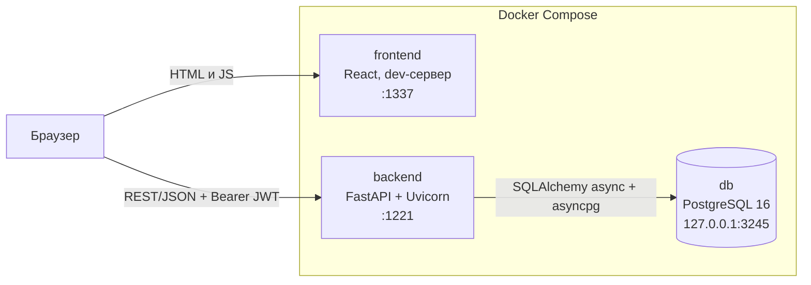
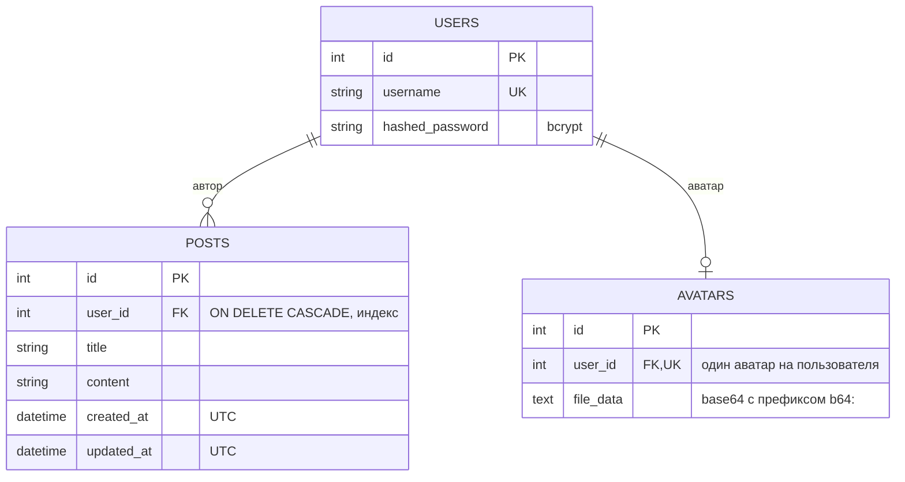
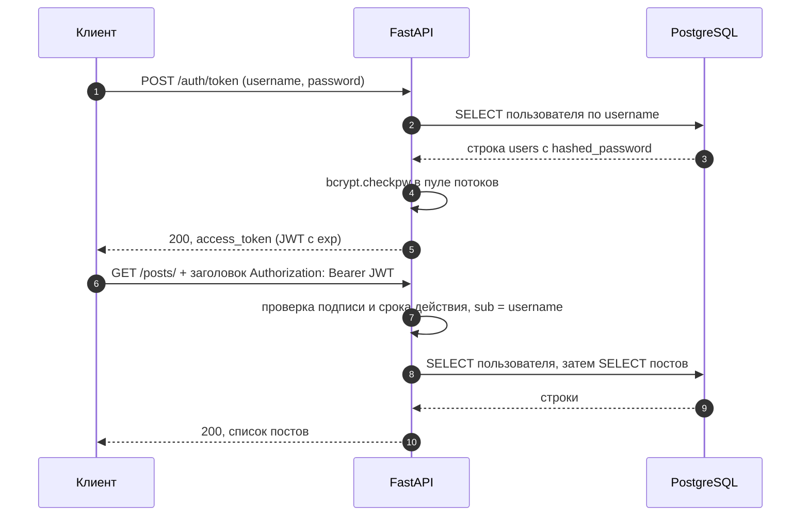

<h1 align="center">messunjerr · мессунжер</h1>

<p align="center">
  Веб-приложение на <b>FastAPI</b> и <b>React</b>: регистрация, JWT-аутентификация, личные посты и профиль с аватаром.<br>
  Фундамент для мессенджера: асинхронный бэкенд, PostgreSQL и запуск одной командой через Docker Compose.
</p>

<p align="center">
  
  
  
  
  
  
  
</p>

> [!NOTE]
> **Статус: ранний MVP.** Готовы аутентификация, личные посты и аватары. Обмена сообщениями (чатов) пока нет: это следующий этап, см. [дорожную карту](#дорожная-карта).

## Содержание

[О проекте](#о-проекте) · [Возможности](#возможности) · [Архитектура](#архитектура) · [Технические решения](#технические-решения) · [Стек](#стек) · [Быстрый старт](#быстрый-старт) · [Конфигурация](#конфигурация) · [Разработка без Docker](#разработка-без-docker) · [API](#api) · [Структура репозитория](#структура-репозитория) · [Честные границы](#честные-границы) · [Дорожная карта](#дорожная-карта)

## О проекте

**messunjerr** состоит из двух частей, которые поднимаются вместе:

- **бэкенд** (`backend/`): REST API на FastAPI. Регистрация и вход, личные посты, аватары, документация OpenAPI и набор автотестов;
- **клиент** (`frontend/`): одностраничное приложение на React + TypeScript с экранами входа, регистрации, ленты своих постов и профиля.

Состояние хранится в PostgreSQL. Основной акцент проекта на бэкенде: права доступа, валидация входных данных, безопасная обработка загружаемых файлов и предсказуемый запуск.

### Проект в цифрах

| **11** | **65** | **3** | **3** | **4** |
|:---:|:---:|:---:|:---:|:---:|
| методов REST API | автотестов бэкенда | таблицы в PostgreSQL | сервиса в Docker Compose | экрана клиента |

## Возможности

| | Возможность | Как устроено |
|:---:|---|---|
| 🔐 | **Аутентификация** | Регистрация и вход по логину и паролю. JWT (HS256), пароли хранятся как bcrypt-хэши. Вход работает по стандартному OAuth2 password flow, поэтому в Swagger UI сразу работает кнопка **Authorize** |
| 📝 | **Личные посты** | Создание, список, чтение, частичное изменение и удаление. Работать с постом может только его автор (чужой пост: `403`). Список идёт от новых к старым и поддерживает `limit` / `offset` |
| 🖼️ | **Аватары** | JPEG и PNG до 5 МБ. Формат определяется по содержимому, а не по заголовку запроса. Сервер учитывает EXIF-ориентацию, сжимает картинку до 400×400 и перекодирует её: метаданные оригинала не сохраняются |
| ✅ | **Валидация** | Логин: 3–32 символа без пробелов, уникален без учёта регистра. Пароль: 8–72 байта. Заголовок поста до 200 символов, текст до 10 000 |
| 🩺 | **Эксплуатация** | `GET /health` проверяет соединение с БД, healthcheck'и в Compose, приложение само дожидается Postgres при старте и не печатает секреты в логи |
| 📖 | **Документация API** | Swagger UI (`/docs`), ReDoc (`/redoc`) и схема OpenAPI (`/openapi.json`) строятся из кода |
| 🧪 | **Тесты** | 65 автотестов бэкенда (pytest), которым не нужен Postgres |
| 🐳 | **Запуск** | `docker compose up --build`: база, API и клиент одной командой |

## Архитектура



Клиент ходит в API напрямую из браузера, поэтому адрес API (`REACT_APP_API_URL`) должен быть доступен **из браузера**, а не из контейнера.

### Слои бэкенда

| Модуль | Ответственность |
|---|---|
| `main.py` | сборка приложения: роутеры, CORS, `lifespan` (создание таблиц с повторными попытками), `/health` |
| `config.py` | чтение и проверка переменных окружения; без `SECRET_KEY` приложение не запускается |
| `database.py` | асинхронный движок и сессии SQLAlchemy, зависимость `get_db` |
| `auth/` | bcrypt-хэширование, выпуск и проверка JWT, зависимость `get_current_user`, маршруты `/auth/*` |
| `posts/` | маршруты `/posts/*` и `crud.py` (операции с БД) |
| `profile/` | маршруты `/users/avatar`: проверка и обработка изображения (Pillow), хранение |
| `models/` | ORM-модели: `users`, `posts`, `avatars` |
| `schemas/` | Pydantic-схемы запросов и ответов: валидация и сериализация |
| `clock.py` | время в UTC |

Путь запроса: CORS → маршрут → зависимости (`get_db` открывает `AsyncSession`, `get_current_user` проверяет JWT и загружает пользователя) → обработчик (бизнес-логика, `crud`) → `response_model` сериализует ответ и не пропускает лишних полей, поэтому хэш пароля наружу не уходит.

### Модель данных



### Аутентификация



Токен содержит два поля: `sub` (логин) и `exp`. Срок жизни задаёт `ACCESS_TOKEN_EXPIRE_MINUTES` (по умолчанию 1440 минут, то есть 24 часа) и одинаков для регистрации и входа.

## Технические решения

- **Асинхронность до конца.** FastAPI + SQLAlchemy 2 (async) + asyncpg: запросы к БД не блокируют event loop. Тяжёлые операции (bcrypt и обработка изображений в Pillow) уходят в пул потоков.
- **Аутентификация без сюрпризов.** Пароли хэшируются bcrypt напрямую (ограничение bcrypt в 72 байта проверяется явно). Время ответа при несуществующем логине выравнивается, чтобы по нему нельзя было перебирать пользователей.
- **Права доступа в одном месте.** Зависимость `get_own_post` отдаёт пост только владельцу. Её используют `GET`, `PUT` и `DELETE`, поэтому проверка не дублируется и не забывается.
- **Безопасная обработка картинок.** Тип определяется по содержимому, есть лимиты на размер файла и число пикселей. Файл перекодируется, поэтому метаданные и «лишние» данные исходника не сохраняются.
- **Предсказуемый старт.** `lifespan` до 30 секунд ждёт Postgres с повторными попытками и падает с понятной ошибкой, если БД так и не появилась. Конфигурация проверяется при импорте: без `SECRET_KEY` приложение не запустится.
- **Корректное время.** В БД хранится UTC, наружу время отдаётся в ISO 8601 с суффиксом `Z`: клиенты в любых часовых поясах показывают правильное время.
- **Секреты не попадают в логи.** Строка подключения не печатается, SQL-логирование включается только флагом `SQL_ECHO`. Пароль БД с символами вроде `@` или `/` корректно экранируется.
- **Минимум лишних привилегий.** Контейнер API работает не от root, порт Postgres проброшен только на localhost, CORS открыт только для адресов клиента.

## Стек

| Слой | Технологии |
|---|---|
| **Бэкенд** | Python 3.12, FastAPI 0.116, Uvicorn, SQLAlchemy 2.0 (async) + asyncpg, Pydantic 2, python-jose (JWT), bcrypt, Pillow |
| **База данных** | PostgreSQL 16 |
| **Клиент** | React 19, TypeScript, React Router 7, Axios, Tailwind CSS 3, Create React App |
| **Тесты** | pytest, pytest-asyncio, httpx (ASGI-транспорт), SQLite через aiosqlite |
| **Инфраструктура** | Docker, Docker Compose, healthcheck'и, непривилегированный образ `python:3.12-slim` |

## Быстрый старт

**Нужно:** Git и Docker с Compose v2 (Docker Desktop на Windows и macOS). Свободные порты: `1337`, `1221`, `3245`.

```bash
git clone https://github.com/sensssey/messunjerr.git
cd messunjerr

cp .env.example .env                      # PowerShell: Copy-Item .env.example .env
cp frontend/.env.example frontend/.env    # PowerShell: Copy-Item frontend\.env.example frontend\.env
```

Откройте `.env` и задайте `POSTGRES_PASSWORD` и `SECRET_KEY`. Ключ удобно сгенерировать так:

```bash
python -c "import secrets; print(secrets.token_hex(32))"
```

Запуск:

```bash
docker compose up --build
```

Первая сборка занимает несколько минут: скачиваются образы и ставятся npm-зависимости клиента. После старта доступно:

| Сервис | Адрес | Что это |
|---|---|---|
| Клиент | http://localhost:1337 | React-приложение (dev-сервер) |
| API | http://localhost:1221 | FastAPI |
| Swagger UI | http://localhost:1221/docs | интерактивная документация и кнопка **Authorize** |
| Health | http://localhost:1221/health | `{"status": "ok"}`, если БД отвечает |
| PostgreSQL | `localhost:3245` | доступен только с вашего компьютера |

Остановить: `docker compose down` (данные БД сохраняются в томе). Остановить и удалить данные: `docker compose down -v`. Логи бэкенда: `docker compose logs -f backend`.

<details>
<summary><b>Если что-то пошло не так</b></summary>

| Симптом | Причина и решение |
|---|---|
| Порт уже занят | Измените левую часть в `ports` у нужного сервиса в `docker-compose.yml` (и `REACT_APP_API_URL`, если меняли порт API) |
| Клиент пишет Network Error | `REACT_APP_API_URL` должен быть адресом, доступным из браузера (`http://localhost:1221`), а не `http://backend:8000`. После правки: `docker compose restart frontend` |
| `backend` падает и в логах сказано про `SECRET_KEY` или `POSTGRES_*` | Переменная не задана в `.env`: сверьтесь с `.env.example` |
| Бэкенд не может войти в БД после смены `POSTGRES_PASSWORD` | Пароль применяется только при первом создании тома. Выполните `docker compose down -v` (данные будут удалены) |
| Поменяли модели, а таблицы остались прежними | Миграций пока нет, таблицы создаются только при первом запуске. Пересоздайте том: `docker compose down -v` |

</details>

## Конфигурация

Все настройки бэкенда задаются переменными окружения (в Docker Compose их читает `.env`). Образец: [`.env.example`](.env.example).

| Переменная | Обязательна | По умолчанию | Описание |
|---|:---:|---|---|
| `SECRET_KEY` | да | — | ключ подписи JWT; без него бэкенд не запустится |
| `POSTGRES_USER`, `POSTGRES_PASSWORD`, `POSTGRES_DB` | да* | — | учётные данные и имя БД |
| `POSTGRES_HOST` | нет | `localhost` | в Docker Compose: `db` |
| `POSTGRES_PORT` | нет | `5432` | в Docker Compose: `5432`; с хоста: `3245` |
| `DATABASE_URL` | нет | собирается из `POSTGRES_*` | готовая строка подключения; если задана, `POSTGRES_*` не нужны (так работают тесты) |
| `ALGORITHM` | нет | `HS256` | алгоритм подписи JWT |
| `ACCESS_TOKEN_EXPIRE_MINUTES` | нет | `1440` | срок жизни токена, минут |
| `CORS_ORIGINS` | нет | `localhost` / `127.0.0.1` на портах `1337` и `3000` | адреса клиента через запятую |
| `AVATAR_MAX_BYTES` | нет | `5242880` (5 МБ) | максимальный размер загружаемого аватара |
| `SQL_ECHO` | нет | выключено | `true`: писать все SQL-запросы в лог (только для отладки) |

\* кроме случая, когда задан `DATABASE_URL`.

Клиент (`frontend/.env`): `REACT_APP_API_URL`, по умолчанию `http://localhost:1221`.

## Разработка без Docker

**Бэкенд.** Нужен Python 3.12 и запущенный PostgreSQL. Проще всего поднять только базу из Compose, она доступна на `localhost:3245`:

```bash
docker compose up -d db

python -m venv .venv
source .venv/bin/activate                  # Windows: .venv\Scripts\activate
pip install -r backend/requirements-dev.txt

cp .env backend/.env                       # затем в backend/.env: POSTGRES_HOST=localhost, POSTGRES_PORT=3245
cd backend
uvicorn src.main:app --reload
```

API будет на http://127.0.0.1:8000 (документация: `/docs`). Файл `backend/.env` читается раньше корневого `.env`.

**Тесты бэкенда.** Postgres не нужен: тесты работают на временной SQLite-базе.

```bash
cd backend
pytest
```

**Клиент.**

```bash
cd frontend
cp .env.example .env    # при запуске бэкенда на :8000 укажите REACT_APP_API_URL=http://localhost:8000
npm ci
npm start               # http://localhost:3000
```

## API

Базовый адрес в Docker Compose: `http://localhost:1221`. Защищённые методы требуют заголовок `Authorization: Bearer <access_token>`.

| Метод | Путь | Токен | Описание |
|:---:|---|:---:|---|
| `POST` | `/auth/register` | — | Регистрация, сразу возвращает токен |
| `POST` | `/auth/token` | — | Вход (`application/x-www-form-urlencoded`: `username`, `password`) |
| `GET` | `/auth/users/me` | ✔ | Текущий пользователь: `id`, `username`, `avatar_url` |
| `POST` | `/posts/` | ✔ | Создать пост (`title`, `content`) |
| `GET` | `/posts/` | ✔ | Свои посты, новые сверху. Параметры `limit` (1–500) и `offset` |
| `GET` | `/posts/{post_id}` | ✔ | Свой пост по id |
| `PUT` | `/posts/{post_id}` | ✔ | Изменить свой пост; поля необязательны, передаются только изменяемые |
| `DELETE` | `/posts/{post_id}` | ✔ | Удалить свой пост |
| `POST` | `/users/avatar` | ✔ | Загрузить аватар (`multipart/form-data`, поле `file`, JPEG или PNG) |
| `GET` | `/users/avatar` | ✔ | Получить свой аватар (изображение) |
| `DELETE` | `/users/avatar` | ✔ | Удалить аватар |
| `GET` | `/health` | — | Состояние сервиса и БД |

Коды ответов: `200` успех (для загрузки аватара `201`, для удаления аватара `204`), `400` некорректные данные (занятый логин, не изображение), `401` нет или неверный токен, `403` чужой пост, `404` не найдено, `413` слишком большой файл, `422` ошибка валидации, `503` БД недоступна. Ошибки приходят в виде `{"detail": ...}`.

### Примеры (bash)

```bash
API=http://localhost:1221

# 1. Регистрация: в ответе сразу есть токен
curl -s -X POST $API/auth/register \
  -H "Content-Type: application/json" \
  -d '{"username": "demo", "password": "demo-password-1"}'
# {"access_token":"eyJ...","token_type":"bearer","message":"User registered successfully"}

# 2. Вход: это форма, а не JSON. Сохраняем токен в переменную
TOKEN=$(curl -s -X POST $API/auth/token -d "username=demo&password=demo-password-1" \
  | python -c "import sys, json; print(json.load(sys.stdin)['access_token'])")

# 3. Пост
curl -s -X POST $API/posts/ \
  -H "Authorization: Bearer $TOKEN" -H "Content-Type: application/json" \
  -d '{"title": "Привет", "content": "Мой первый пост"}'
# {"id":1,"user_id":1,"title":"Привет","content":"Мой первый пост","created_at":"2026-10-04T10:00:00.123456Z","updated_at":"..."}

curl -s "$API/posts/?limit=10" -H "Authorization: Bearer $TOKEN"

curl -s -X PUT $API/posts/1 \
  -H "Authorization: Bearer $TOKEN" -H "Content-Type: application/json" \
  -d '{"title": "Новый заголовок"}'

curl -s -X DELETE $API/posts/1 -H "Authorization: Bearer $TOKEN"

# 4. Аватар
curl -s -X POST $API/users/avatar -H "Authorization: Bearer $TOKEN" -F "file=@avatar.png"
curl -s $API/users/avatar -H "Authorization: Bearer $TOKEN" -o my-avatar.png
```

Проще всего попробовать API в Swagger UI: откройте `/docs`, нажмите **Authorize** и введите логин и пароль.

## Структура репозитория

```
messunjerr/
├── backend/
│   ├── Dockerfile
│   ├── requirements.txt          зафиксированные версии зависимостей
│   ├── requirements-dev.txt      то же + инструменты для тестов
│   ├── pytest.ini
│   ├── src/
│   │   ├── main.py               приложение, CORS, lifespan, /health
│   │   ├── config.py             переменные окружения
│   │   ├── database.py           async-движок и сессии SQLAlchemy
│   │   ├── clock.py              время в UTC
│   │   ├── auth/                 bcrypt, JWT, маршруты /auth/*
│   │   ├── posts/                маршруты /posts/* и операции с БД
│   │   ├── profile/              маршруты /users/avatar
│   │   ├── models/               ORM-модели
│   │   └── schemas/              Pydantic-схемы
│   └── tests/                    автотесты (pytest)
├── frontend/                     React 19 + TypeScript + Tailwind (Create React App)
├── docker-compose.yml
├── .env.example                  шаблон настроек для Docker Compose
└── README.md
```

## Честные границы

| | Тема | Как обстоят дела сейчас |
|:---:|---|---|
| 💬 | **Мессенджер** | Чатов и личных сообщений (REST + WebSocket) пока нет. Пользователь видит только свои посты |
| 🗄️ | **Миграции** | Таблицы создаются через `create_all` при старте. Изменили модель: пересоздайте БД (`docker compose down -v`). Alembic в планах |
| 🤖 | **CI** | Тесты запускаются локально, автоматического прогона на GitHub нет |
| 🐳 | **Production** | Docker-конфигурация рассчитана на разработку: клиент работает на dev-сервере CRA, нет HTTPS и reverse-proxy |
| 🔑 | **Токены** | Stateless JWT без refresh-токенов и отзыва, клиент хранит токен в cookie. Ограничения частоты запросов на вход нет |
| 🖼️ | **Аватары** | Хранятся в самой БД (текстовая колонка). Для большого числа пользователей их стоит вынести в объектное хранилище. Лимит размера проверяется уже после получения запроса сервером |

## Дорожная карта

- [x] Регистрация и вход (JWT)
- [x] Личные посты: CRUD и права доступа
- [x] Профиль и аватары
- [x] Docker Compose и healthcheck'и
- [x] Автотесты бэкенда
- [ ] Чаты и личные сообщения (REST + WebSocket)
- [ ] Список пользователей и публичные профили
- [ ] Миграции схемы (Alembic)
- [ ] CI на GitHub Actions: тесты и линтеры
- [ ] Production-сборка клиента (nginx, HTTPS)
- [ ] Ограничение частоты запросов, refresh-токены

## Автор

[sensssey](https://github.com/sensssey)
