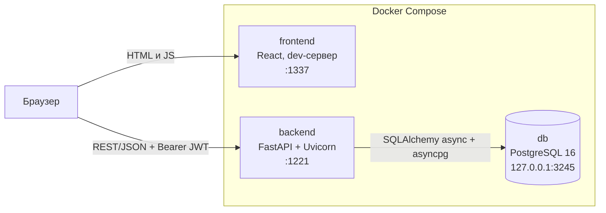
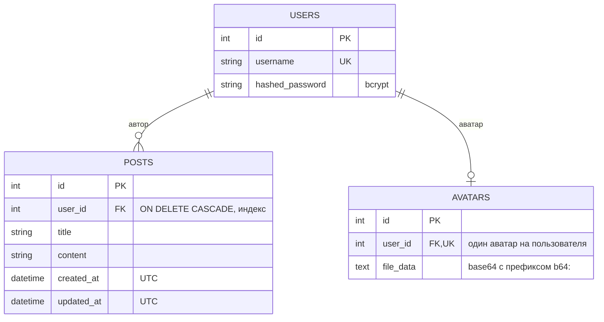
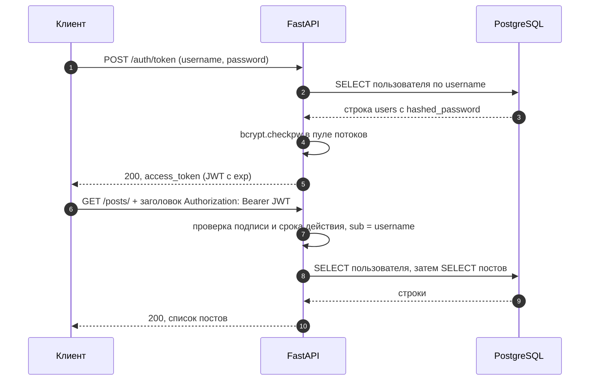

<h1 align="center">messunjerr · мессунжер</h1>

<p align="center">
  Веб-приложение на <b>FastAPI</b> и <b>React</b>: регистрация, JWT-аутентификация, личные посты и профиль с аватаром.<br>
  Фундамент для мессенджера: асинхронный бэкенд, PostgreSQL и запуск одной командой через Docker Compose.
</p>

<p align="center">
  
  
  
  
  
  
  
</p>

> [!NOTE]
> **Статус: ранний MVP.** Готовы аутентификация, личные посты и аватары. Обмена сообщениями (чатов) пока нет: это следующий этап, см. [дорожную карту](#дорожная-карта).

## Содержание

[О проекте](#о-проекте) · [Возможности](#возможности) · [Архитектура](#архитектура) · [Технические решения](#технические-решения) · [Стек](#стек) · [Быстрый старт](#быстрый-старт) · [Конфигурация](#конфигурация) · [Разработка без Docker](#разработка-без-docker) · [Разработка v2 (Docker)](#разработка-v2-docker) · [API](#api) · [Документация](#документация) · [Структура репозитория](#структура-репозитория) · [Честные границы](#честные-границы) · [Дорожная карта](#дорожная-карта)

## О проекте

**messunjerr** состоит из двух частей, которые поднимаются вместе:

- **бэкенд** (`backend/`): REST API на FastAPI. Регистрация и вход, личные посты, аватары, документация OpenAPI и набор автотестов;
- **клиент** (`frontend/`): одностраничное приложение на React + TypeScript с экранами входа, регистрации, ленты своих постов и профиля.

Состояние хранится в PostgreSQL. Основной акцент проекта на бэкенде: права доступа, валидация входных данных, безопасная обработка загружаемых файлов и предсказуемый запуск.

### Проект в цифрах

| **11** | **65** | **3** | **3** | **4** |
|:---:|:---:|:---:|:---:|:---:|
| методов REST API | автотестов бэкенда | таблицы в PostgreSQL | сервиса в Docker Compose | экрана клиента |

## Возможности

| | Возможность | Как устроено |
|:---:|---|---|
| 🔐 | **Аутентификация** | Регистрация и вход по логину и паролю. JWT (HS256), пароли хранятся как bcrypt-хэши. Вход работает по стандартному OAuth2 password flow, поэтому в Swagger UI сразу работает кнопка **Authorize** |
| 📝 | **Личные посты** | Создание, список, чтение, частичное изменение и удаление. Работать с постом может только его автор (чужой пост: `403`). Список идёт от новых к старым и поддерживает `limit` / `offset` |
| 🖼️ | **Аватары** | JPEG и PNG до 5 МБ. Формат определяется по содержимому, а не по заголовку запроса. Сервер учитывает EXIF-ориентацию, сжимает картинку до 400×400 и перекодирует её: метаданные оригинала не сохраняются |
| ✅ | **Валидация** | Логин: 3–32 символа без пробелов, уникален без учёта регистра. Пароль: 8–72 байта. Заголовок поста до 200 символов, текст до 10 000 |
| 🩺 | **Эксплуатация** | `GET /health` проверяет соединение с БД, healthcheck'и в Compose, приложение само дожидается Postgres при старте и не печатает секреты в логи |
| 📖 | **Документация API** | Swagger UI (`/docs`), ReDoc (`/redoc`) и схема OpenAPI (`/openapi.json`) строятся из кода |
| 🧪 | **Тесты** | 65 автотестов бэкенда (pytest), которым не нужен Postgres |
| 🐳 | **Запуск** | `docker compose up --build`: база, API и клиент одной командой |

## Архитектура



Клиент ходит в API напрямую из браузера, поэтому адрес API (`REACT_APP_API_URL`) должен быть доступен **из браузера**, а не из контейнера.

### Слои бэкенда

| Модуль | Ответственность |
|---|---|
| `main.py` | сборка приложения: роутеры, CORS, `lifespan` (создание таблиц с повторными попытками), `/health` |
| `config.py` | чтение и проверка переменных окружения; без `SECRET_KEY` приложение не запускается |
| `database.py` | асинхронный движок и сессии SQLAlchemy, зависимость `get_db` |
| `auth/` | bcrypt-хэширование, выпуск и проверка JWT, зависимость `get_current_user`, маршруты `/auth/*` |
| `posts/` | маршруты `/posts/*` и `crud.py` (операции с БД) |
| `profile/` | маршруты `/users/avatar`: проверка и обработка изображения (Pillow), хранение |
| `models/` | ORM-модели: `users`, `posts`, `avatars` |
| `schemas/` | Pydantic-схемы запросов и ответов: валидация и сериализация |
| `clock.py` | время в UTC |

Путь запроса: CORS → маршрут → зависимости (`get_db` открывает `AsyncSession`, `get_current_user` проверяет JWT и загружает пользователя) → обработчик (бизнес-логика, `crud`) → `response_model` сериализует ответ и не пропускает лишних полей, поэтому хэш пароля наружу не уходит.

### Модель данных



### Аутентификация



Токен содержит два поля: `sub` (логин) и `exp`. Срок жизни задаёт `ACCESS_TOKEN_EXPIRE_MINUTES` (по умолчанию 1440 минут, то есть 24 часа) и одинаков для регистрации и входа.

## Технические решения

- **Асинхронность до конца.** FastAPI + SQLAlchemy 2 (async) + asyncpg: запросы к БД не блокируют event loop. Тяжёлые операции (bcrypt и обработка изображений в Pillow) уходят в пул потоков.
- **Аутентификация без сюрпризов.** Пароли хэшируются bcrypt напрямую (ограничение bcrypt в 72 байта проверяется явно). Время ответа при несуществующем логине выравнивается, чтобы по нему нельзя было перебирать пользователей.
- **Права доступа в одном месте.** Зависимость `get_own_post` отдаёт пост только владельцу. Её используют `GET`, `PUT` и `DELETE`, поэтому проверка не дублируется и не забывается.
- **Безопасная обработка картинок.** Тип определяется по содержимому, есть лимиты на размер файла и число пикселей. Файл перекодируется, поэтому метаданные и «лишние» данные исходника не сохраняются.
- **Предсказуемый старт.** `lifespan` до 30 секунд ждёт Postgres с повторными попытками и падает с понятной ошибкой, если БД так и не появилась. Конфигурация проверяется при импорте: без `SECRET_KEY` приложение не запустится.
- **Корректное время.** В БД хранится UTC, наружу время отдаётся в ISO 8601 с суффиксом `Z`: клиенты в любых часовых поясах показывают правильное время.
- **Секреты не попадают в логи.** Строка подключения не печатается, SQL-логирование включается только флагом `SQL_ECHO`. Пароль БД с символами вроде `@` или `/` корректно экранируется.
- **Минимум лишних привилегий.** Контейнер API работает не от root, порт Postgres проброшен только на localhost, CORS открыт только для адресов клиента.

## Стек

| Слой | Технологии |
|---|---|
| **Бэкенд** | Python 3.12, FastAPI 0.116, Uvicorn, SQLAlchemy 2.0 (async) + asyncpg, Pydantic 2, python-jose (JWT), bcrypt, Pillow |
| **База данных** | PostgreSQL 16 |
| **Клиент** | React 19, TypeScript, React Router 7, Axios, Tailwind CSS 3, Create React App |
| **Тесты** | pytest, pytest-asyncio, httpx (ASGI-транспорт), SQLite через aiosqlite |
| **Инфраструктура** | Docker, Docker Compose, healthcheck'и, непривилегированный образ `python:3.12-slim` |

## Быстрый старт

**Нужно:** Git и Docker с Compose v2 (Docker Desktop на Windows и macOS). Свободные порты: `1337`, `1221`, `3245`.

```bash
git clone https://github.com/sensssey/messunjerr.git
cd messunjerr

cp .env.example .env                      # PowerShell: Copy-Item .env.example .env
cp frontend/.env.example frontend/.env    # PowerShell: Copy-Item frontend\.env.example frontend\.env
```

Откройте `.env` и задайте `POSTGRES_PASSWORD` и `SECRET_KEY`. Ключ удобно сгенерировать так:

```bash
python -c "import secrets; print(secrets.token_hex(32))"
```

Запуск:

```bash
docker compose up --build
```

Первая сборка занимает несколько минут: скачиваются образы и ставятся npm-зависимости клиента. После старта доступно:

| Сервис | Адрес | Что это |
|---|---|---|
| Клиент | http://localhost:1337 | React-приложение (dev-сервер) |
| API | http://localhost:1221 | FastAPI |
| Swagger UI | http://localhost:1221/docs | интерактивная документация и кнопка **Authorize** |
| Health | http://localhost:1221/health | `{"status": "ok"}`, если БД отвечает |
| PostgreSQL | `localhost:3245` | доступен только с вашего компьютера |

Остановить: `docker compose down` (данные БД сохраняются в томе). Остановить и удалить данные: `docker compose down -v`. Логи бэкенда: `docker compose logs -f backend`.

<details>
<summary><b>Если что-то пошло не так</b></summary>

| Симптом | Причина и решение |
|---|---|
| Порт уже занят | Измените левую часть в `ports` у нужного сервиса в `docker-compose.yml` (и `REACT_APP_API_URL`, если меняли порт API) |
| Клиент пишет Network Error | `REACT_APP_API_URL` должен быть адресом, доступным из браузера (`http://localhost:1221`), а не `http://backend:8000`. После правки: `docker compose restart frontend` |
| `backend` падает и в логах сказано про `SECRET_KEY` или `POSTGRES_*` | Переменная не задана в `.env`: сверьтесь с `.env.example` |
| Бэкенд не может войти в БД после смены `POSTGRES_PASSWORD` | Пароль применяется только при первом создании тома. Выполните `docker compose down -v` (данные будут удалены) |
| Поменяли модели, а таблицы остались прежними | Миграций пока нет, таблицы создаются только при первом запуске. Пересоздайте том: `docker compose down -v` |

</details>

## Конфигурация

Все настройки бэкенда задаются переменными окружения (в Docker Compose их читает `.env`). Образец: [`.env.example`](.env.example).

| Переменная | Обязательна | По умолчанию | Описание |
|---|:---:|---|---|
| `SECRET_KEY` | да | — | ключ подписи JWT; без него бэкенд не запустится |
| `POSTGRES_USER`, `POSTGRES_PASSWORD`, `POSTGRES_DB` | да* | — | учётные данные и имя БД |
| `POSTGRES_HOST` | нет | `localhost` | в Docker Compose: `db` |
| `POSTGRES_PORT` | нет | `5432` | в Docker Compose: `5432`; с хоста: `3245` |
| `DATABASE_URL` | нет | собирается из `POSTGRES_*` | готовая строка подключения; если задана, `POSTGRES_*` не нужны (так работают тесты) |
| `ALGORITHM` | нет | `HS256` | алгоритм подписи JWT |
| `ACCESS_TOKEN_EXPIRE_MINUTES` | нет | `1440` | срок жизни токена, минут |
| `CORS_ORIGINS` | нет | `localhost` / `127.0.0.1` на портах `1337` и `3000` | адреса клиента через запятую |
| `AVATAR_MAX_BYTES` | нет | `5242880` (5 МБ) | максимальный размер загружаемого аватара |
| `SQL_ECHO` | нет | выключено | `true`: писать все SQL-запросы в лог (только для отладки) |

\* кроме случая, когда задан `DATABASE_URL`.

Клиент (`frontend/.env`): `REACT_APP_API_URL`, по умолчанию `http://localhost:1221`.

## Разработка без Docker

**Бэкенд.** Нужен Python 3.12 и запущенный PostgreSQL. Проще всего поднять только базу из Compose, она доступна на `localhost:3245`:

```bash
docker compose up -d db

python -m venv .venv
source .venv/bin/activate                  # Windows: .venv\Scripts\activate
pip install -r backend/requirements-dev.txt

cp .env backend/.env                       # затем в backend/.env: POSTGRES_HOST=localhost, POSTGRES_PORT=3245
cd backend
uvicorn src.main:app --reload
```

API будет на http://127.0.0.1:8000 (документация: `/docs`). Файл `backend/.env` читается раньше корневого `.env`.

**Тесты бэкенда.** Postgres не нужен: тесты работают на временной SQLite-базе.

```bash
cd backend
pytest
```

**Клиент.**

```bash
cd frontend
cp .env.example .env    # при запуске бэкенда на :8000 укажите REACT_APP_API_URL=http://localhost:8000
npm ci
npm start               # http://localhost:3000
```

## Разработка v2 (Docker)

Новый бэкенд растёт рядом со старым, в `backend/src/messunjerr/`; порядок работ описан в [плане спринтов](docs/backend-v2-sprints.md). Сделаны **спринт 0** (фундамент: миграции, тесты, CI), **спринт 1** (регистрация, подтверждение почты, вход), **спринт 2** (сессии, пароли, лимиты), **спринт 3** (профили и приватность), **спринт 4** (prod-подобный стенд, ниже) **спринт 5** (загрузка файлов, ниже), **спринт 6** (обработка изображений и аватары, ниже), **спринт 7** (дружба и блокировки, ниже) и **спринт 8** (подписки и поиск людей, ниже): `POST /auth/register`, `/auth/verify-email`, `/auth/resend-verification`, `/auth/login`, `/auth/refresh` (ротация refresh-токена с обнаружением повторного использования), `/auth/logout`, `/auth/logout-all`, `GET /auth/sessions`, `DELETE /auth/sessions/{id}`, `/auth/password/forgot`, `/reset`, `/change`, `/auth/email/change`, `/confirm`, `GET /auth/username-available`, `GET /me`, `GET /legal/documents`, `GET /.well-known/jwks.json`; из спринта 3: `PATCH /me/profile`, `GET` и `PATCH /me/privacy`, `PATCH /me/username` (раз в 30 дней, прежний ник ещё 30 дней занят), `DELETE /me` и `POST /me/restore` (удаление с 14 днями на передумать; пока аккаунт ждёт удаления, доступны только `GET /me`, восстановление и выход), `GET /users/{ref}` (профиль глазами зрителя: закрытый профиль, видимость даты рождения и счётчиков по настройкам владельца); из спринта 5: `POST /media/uploads` (заявка на загрузку файла и ссылка для `PUT` прямо в хранилище), `POST /media/uploads/{id}/complete`, `GET` и `DELETE /media/{id}`, `GET /media/quota`; из спринта 6: `GET /media/{id}/urls` (свежие ссылки на файлы), аватар через `PATCH /me/profile` с `avatar_asset_id` (публичные адреса `/media/public/avatars/…`), метрики Prometheus `GET /metrics` (только изнутри сети) и команды `create-admin` и `reprocess-media`; из спринта 7: `POST` и `GET /friend-requests`, `POST /friend-requests/{id}/accept` и `/decline`, `DELETE /friend-requests/{id}`, `GET /friends` (с поиском `q`), `DELETE /friends/{user_id}`, `GET /users/{ref}/friends` и `/mutual-friends`, `GET /me/blocks`, `PUT` и `DELETE /blocks/{user_id}`; из спринта 8: `PUT` и `DELETE /follows/{user_id}`, `GET /me/following` и `/me/followers`, `DELETE /me/followers/{user_id}`, `GET /me/follow-requests`, `POST /me/follow-requests/{id}/approve` и `/decline`, `GET /users/{ref}/followers` и `/following`, `GET /search/users` (поиск людей по нику и имени). `GET /me` и ответы входа отдают профиль, настройки приватности и счётчики. Лимиты запросов (token bucket в Redis, заголовки `RateLimit-*`), журнал аудита и `Idempotency-Key` для будущих создающих ручек уже работают. Письма отправляет воркер `worker` (очередь `email`, arq), плановую очистку (неподтверждённые аккаунты, просроченные токены и ключи, зависшие загрузки файлов) делает `worker-default`, загруженные файлы обрабатывает `worker-media` (Pillow: перекодирование в WebP без EXIF, варианты, проверка содержимого); в разработке письма оседают в Mailpit, а файлы в SeaweedFS (S3, `http://localhost:8333`). Весь план собирается и работает локально; выход в мир (VPS, домен, вход через VK ID и Яндекс ID) вынесен в последний спринт S21.

Нужны Docker с Compose v2 и Python 3 (только чтобы один раз сгенерировать пароли и ключ подписи токенов). На Windows `make` не обязателен: `./dev.ps1 <команда>` делает то же самое.

```bash
make init     # deploy/.env со случайными паролями и ключом (в git не попадает); после обновления проекта дописывает новые переменные
make up       # PostgreSQL 18, Redis, Mailpit, API и воркеры; роли и миграции применяются сами
make test     # unit и интеграционные тесты на настоящих PostgreSQL, Redis и Mailpit
make check    # всё, что проверяет CI: ruff, pyright (strict), import-linter, тесты
make seed     # учебные аккаунты seed_0001… с разными профилями (открытые и закрытые, приватность вразнобой); повтор безопасен
make seed-big # 5 000 человек big_00001… для замеров поиска: друзья, подписки, блокировки, заявки (около 15 секунд); повтор безопасен, ARGS="--users 1000"
make create-admin ARGS="--email me@example.com --username boss"   # администратор (пароль спросит команда); существующему аккаунту выдаёт роль
```

| Адрес | Что там |
|---|---|
| http://localhost:8000/api/v1/docs | Swagger UI (в проде выключен); кнопка **Authorize** принимает access-токен из `/auth/login` |
| http://localhost:8000/health/ready | готовность: PostgreSQL, Redis и версия миграций (`503`, если что-то недоступно или миграции отстают от кода; БД «впереди» кода не помеха: так выглядит выкладка с миграцией) |
| http://localhost:8025 | Mailpit: письма, которые «отправляет» приложение (там же токен подтверждения почты) |
| http://localhost:8333 | SeaweedFS (S3): сюда браузер кладёт файлы по presigned-ссылкам, отсюда без подписи читаются аватары (`/media/public/avatars/…`); интерфейса у него нет |
| http://localhost:8000/metrics, http://localhost:9102/metrics | метрики Prometheus API и воркера `worker-media` (на стенде и в проде снаружи недоступны) |
| `127.0.0.1:54320`, `127.0.0.1:63790` | PostgreSQL и Redis для клиентов вроде psql и DBeaver; пароли в `deploy/.env` |

Сценарий «регистрация → письмо → подтверждение → вход → `GET /me`» собран в [backend/http/auth.http](backend/http/auth.http) для HTTP-клиента JetBrains: токен из письма он достаёт из Mailpit сам. Сессии, ротация и повторное использование refresh-токена, «выйти везде», сброс и смена пароля, смена почты и лимиты: [backend/http/auth-sessions.http](backend/http/auth-sessions.http). Профили, приватность, смена ника, удаление и восстановление аккаунта: [backend/http/profile.http](backend/http/profile.http). Загрузка файла от заявки до `ready` и удаления: [backend/http/media.http](backend/http/media.http). Заявки в друзья, дружба, блокировки и подписки (открытый и закрытый профиль) двух аккаунтов: [backend/http/social.http](backend/http/social.http). Поиск людей: [backend/http/search.http](backend/http/search.http) (нужен `make seed-big`). Что менялось в контракте API, записано в [журнале изменений](docs/api-changelog.md).

Порты выбраны так, чтобы не пересекаться со стеком v0.1 (`1221`, `3245`, `1337`) и с обычными PostgreSQL (`5432`) и Redis (`6379`) на машине. Исходники правятся на хосте, uvicorn в контейнере перезапускается сам. Тесты используют те же сервисы Compose (в CI это сервисы GitHub Actions), каждый прогон создаёт свою временную базу `mj_test_*`, поэтому данные разработки не затрагиваются.

Миграции: `make revision m="описание"` создаёт ревизию по моделям, `make migrate` применяет, `make db-check` (`alembic check`) проверяет, что модели и миграции не разошлись. Остальные команды: `make help` или `./dev.ps1 help`.

### Prod-подобный стенд (S4)

Стенд повторяет боевой контур на ноутбуке: Caddy с TLS от внутреннего центра, две реплики API, воркеры, PostgreSQL 18 с pgBackRest, Redis, SeaweedFS (S3) и Mailpit; лимиты памяти и ядер как у VPS на 8 ГБ и 4 vCPU. Это отдельный проект Compose (`messunjerr-stand`, свои тома, наружу только Caddy на `127.0.0.1`), он не зависит от стека разработки и работает рядом с ним.

```bash
make up-prod-like       # https://messunjerr.localhost/api/v1/meta (или ./dev.ps1 up-prod-like)
make stand-test         # 106 тестов через Caddy: TLS, заголовки, 404, SSE, WebSocket, presigned URL, загрузка и обработка файлов (S5, S6), дружба и блокировки (S7), подписки и поиск людей (S8), журнал без токенов, cookie, подписей и текста поиска, закрытые порты
make deploy TAG=v2      # выкладка без простоя: миграции отдельной задачей, реплики по одной; make rollback: откат
make rehearse-migration # репетиция выкладки и отката с настоящей новой ревизией Alembic (БД возвращается)
make backup-status      # копии pgBackRest (RPO в минуты); make restore-drill: восстановление на отдельной БД
make stand-stats        # память и ядра контейнеров против лимитов VPS
make stand-reset-limits  # сбросить счётчики лимитов запросов в Redis стенда (после многократных прогонов тестов)
```

Браузер сначала не знает корневой сертификат Caddy: `make stand-ca` выгружает его и показывает, как ему доверять (решение за вами, скрипты систему не меняют). Во время выкладки фоновая нагрузка (запросы, SSE, WebSocket) считает ошибки клиентов: на репетициях их 0 при выкладке, откате, выкладке с новой миграцией и даже при плохом образе. Подробности и разбор неполадок: [runbook стенда](docs/runbooks/stand.md), [runbook копий и восстановления](docs/runbooks/backup-restore.md).

### Файлы, изображения и аватары (S5, S6)

Файл не проходит через API: сервер выдаёт подписанную ссылку, браузер кладёт файл прямо в SeaweedFS, затем просит завершить загрузку, а воркер `worker-media` проверяет и обрабатывает содержимое.

1. `POST /api/v1/media/uploads` с `purpose` (`avatar`, `group_avatar`, `post`, `message`), именем, типом и размером файла: ответ `201` с ресурсом в статусе `pending` и ссылкой `upload` (метод `PUT`, заголовки, срок 15 минут). Принимает `Idempotency-Key`; лимит 60 заявок в час.
2. `PUT` на `upload.url` с теми же заголовками. Подпись закрепляет тип, точный размер и запись один раз (`If-None-Match: *`): другие тип и размер дают `403` от хранилища, а повторный `PUT` по той же ссылке `412` (файл уже на месте, проверенный файл подменить нельзя). В разработке ссылка ведёт на `http://localhost:8333/media/…`, на стенде на `https://messunjerr.localhost/media/…` через Caddy.
3. `POST /api/v1/media/uploads/{id}/complete` проверяет размер объекта и ставит `uploaded` (повтор безопасен); через секунду-две воркер ставит `ready` или `rejected` с причиной (`GET /media/{id}`).

**Что делает обработка.** Тип определяется по содержимому, а не по заявленному `content_type` и расширению: SVG, HTML, исполняемые файлы и неподдерживаемые форматы отклоняются (`not_an_image`, `forbidden_type`, `unsupported_format`). Изображения перекодируются в WebP: EXIF (модель устройства, геометка), XMP и профили не попадают в результат, ориентация применяется к пикселям, цвета приводятся к sRGB; больше 25 мегапикселей это `image_too_large`, больше 50 (и файл из множества мелких частей) `decompression_bomb`; файл, на котором разбор три раза обрывается, отклоняется как `processing_failed`. Оригинал после обработки заменяется пустым объектом, поэтому геометка в хранилище не остаётся, а ссылка на загрузку остаётся мёртвой. Варианты: аватар 64 и 256 пикселей (квадрат по центру), фото 320 и 1280 по длинной стороне. Анимацию мы не обрабатываем: у GIF варианты статичные, оригинал хранится и отдаётся. Не-изображения хранятся с типом `application/octet-stream` и отдаются только вложением (`Content-Disposition: attachment`, `nosniff`).

**Ссылки.** У готового ресурса `urls.thumb` и `urls.medium` (у файла `urls.original`): аватары публичны и постоянны (`/media/public/avatars/{id}/64.webp`, кэш на год, `immutable`), остальное это presigned GET на 10 минут; свежие ссылки выдаёт `GET /media/{id}/urls`. Аватаром ресурс становится через `PATCH /me/profile` с `avatar_asset_id`; замена и очистка удаляют прежний аватар вместе с файлами.

Размеры: аватар до 5 МиБ, изображение 10 МиБ, файл 25 МиБ; квота 1 ГиБ на человека (считаются сохранённые варианты). Незавершённые загрузки старше суток удаляются плановой задачей, потерянные постановки в очередь подбирает `reconcile_uploads` (раз в 5 минут). Метрики обработки и воркеров: `GET /metrics` у API и порт `WORKER_METRICS_PORT` у воркеров (внутри сети). Ресурсы времён S5 (готовые изображения без вариантов) возвращает на обработку `make reprocess-media`. Устройство, статусы и разбор неполадок: [runbook файлов](docs/runbooks/media.md).

### Друзья и блокировки (S7)

Дружба двусторонняя и подтверждается: один зовёт, второй принимает. Встречная заявка принимается сразу, поэтому две заявки друг другу в один миг дают ровно одну дружбу.

1. `POST /api/v1/friend-requests` с `user_id`: `201` и заявка `pending` (либо `200`, если человек уже звал вас: тогда вы сразу друзья). Принимает `Idempotency-Key`; лимит 30 заявок в сутки.
2. Получатель видит заявки в `GET /friend-requests` и отвечает `POST …/{id}/accept` (в ответе новый друг и дата) или `…/decline` (отправитель об отказе не узнаёт). Отправитель видит свои заявки в `?direction=outgoing` и может отозвать (`DELETE …/{id}`).
3. `GET /friends` (поиск `?q` по нику и имени), `DELETE /friends/{user_id}`; чужие списки `GET /users/{ref}/friends` (по настройке `friends_list_visibility` владельца и с учётом закрытого профиля) и общие друзья `…/mutual-friends`. В карточках чужих списков и в профиле есть `relationship`: кнопку «Добавить», «Принять» или «Отменить» клиент выбирает по нему.

**Блокировка** (`PUT /blocks/{user_id}`) в одной транзакции разрывает дружбу и отменяет ждущие заявки; дальше люди не видят друг друга (`404` на профиль, заявку и списки), а заблокировавший видит свой список в `GET /me/blocks`. `DELETE` снимает блокировку, но дружбу не возвращает. Ответ про невидимого человека одинаков для всех причин (удалился, заблокирован, заблокировал вас): по нему причину не угадать.

**Устройство.** Правила лежат в `social/domain/policies.py` и проверены полным перебором состояний (48 состояний пары для заявки, 60 для доступа к списку) и моделью: случайные последовательности операций сверяются с простой моделью в памяти. Любая команда над парой людей берёт `pg_advisory_xact_lock` по этой паре, поэтому гонки (встречные заявки, принятие против отмены, блокировка против принятия) сводятся к последовательности, а инварианты (блокировка исключает дружбу и ждущую заявку) проверяются после каждой гонки. Изменения графа попадают в outbox (`mj.social.graph.v1`) в той же транзакции; ретранслятор и уведомления придут в S9 и S10.

### Подписки и поиск людей (S8)

Подписка односторонняя: на открытый профиль она оформляется сразу, на закрытый создаётся запрос, и владелец отвечает на него.

1. `PUT /api/v1/follows/{user_id}`: `200` и `{"status": "following"}` либо `{"status": "requested"}` (закрытый профиль идёт через запрос и для друзей); повтор безопасен, новых событий нет. Лимит 100 подписок в час. `DELETE /follows/{user_id}` отписывает или отзывает свой запрос и всегда отвечает `204`.
2. Владелец закрытого профиля видит запросы в `GET /me/follow-requests` (сколько ждут, показывает `counters.pending_follow_requests` в `GET /me`) и отвечает `POST …/{id}/approve` (в ответе новый подписчик) или `…/decline` (подписчик об отказе не узнаёт). Когда профиль открывается (`PATCH /me/profile`, `is_private: false`), все ждущие запросы одобряются сами в той же транзакции. Закрытие профиля подписчиков не трогает; подписчику закрытого профиля видны его подробности (город, ссылки), как другу.
3. `GET /me/following`, `GET /me/followers` и `DELETE /me/followers/{user_id}` (убрать подписчика); чужие `GET /users/{ref}/followers` и `/following` подчиняются настройке владельца `followers_list_visibility` и закрытости профиля. В `relationship` теперь настоящие `following` (`none`, `following`, `requested`) и `follows_you`, в счётчиках профиля настоящие `followers` и `following`.

**Блокировка** из S7 теперь разрывает и подписки в обе стороны и закрывает запросы на подписку. Подписки и ответы на запросы пишут события `FollowCreated`, `FollowRequested`, `FollowRequestResponded` и `FollowRemoved` в тот же outbox (`mj.social.graph.v1`). Каждая команда над парой людей берёт `pg_advisory_xact_lock` по паре, а открытие профиля и подписка на него идут друг за другом (порядок замков описан в [спецификации](docs/backend-v2-spec.md), 4.6), так что запрос не может остаться ждать на уже открытом профиле.

**Поиск людей.** `GET /api/v1/search/users?q=иван петров` (лимит 30 запросов в минуту) ищет по нику и имени: регистр не важен, «ё» и «е» одна буква, слова имени можно называть в любом порядке, находятся начало слова от двух букв и одна опечатка. Порядок: точный ник, ник с таким началом, затем сходство. Не находятся вы сами, аккаунты не `active` и люди, связанные с вами блокировкой; закрытые профили находятся (виден только ник, имя и аватар). Страницы по смещению (`next_offset`), глубже 200 результатов не листается (`offset + limit ≤ 200`, иначе `422`). Транслитерации (`ivan` → «Иван») нет. Поиск стоит на `pg_trgm` (миграция 0008), поэтому база обязана быть создана с `LC_CTYPE`, при котором работает кириллица (в образе `postgres:18` так по умолчанию; иначе миграция остановится и подскажет, как пересоздать базу).

**Большой набор данных.** `make seed-big` (`./dev.ps1 seed-big`) создаёт 5 000 человек `big_00001…` (пароль печатает команда) с друзьями (в среднем 15), подписками (30, с перекосом к «популярным»), блокировками и ждущими заявками примерно за 15 секунд; повтор безопасен, число людей и зерно меняются `ARGS="--users 1000 --seed 7"`. На таких данных p95 поиска 43–49 мс (замер включается `SEARCH_PERF=1`). Сразу после посева можно выполнить `ANALYZE` (или подождать минуту автоочистку): без свежей статистики планы неточны, и поиск в 2–3 раза медленнее (75–157 мс против 25–57 мс на живом стеке).

## API

Базовый адрес в Docker Compose: `http://localhost:1221`. Защищённые методы требуют заголовок `Authorization: Bearer <access_token>`.

| Метод | Путь | Токен | Описание |
|:---:|---|:---:|---|
| `POST` | `/auth/register` | — | Регистрация, сразу возвращает токен |
| `POST` | `/auth/token` | — | Вход (`application/x-www-form-urlencoded`: `username`, `password`) |
| `GET` | `/auth/users/me` | ✔ | Текущий пользователь: `id`, `username`, `avatar_url` |
| `POST` | `/posts/` | ✔ | Создать пост (`title`, `content`) |
| `GET` | `/posts/` | ✔ | Свои посты, новые сверху. Параметры `limit` (1–500) и `offset` |
| `GET` | `/posts/{post_id}` | ✔ | Свой пост по id |
| `PUT` | `/posts/{post_id}` | ✔ | Изменить свой пост; поля необязательны, передаются только изменяемые |
| `DELETE` | `/posts/{post_id}` | ✔ | Удалить свой пост |
| `POST` | `/users/avatar` | ✔ | Загрузить аватар (`multipart/form-data`, поле `file`, JPEG или PNG) |
| `GET` | `/users/avatar` | ✔ | Получить свой аватар (изображение) |
| `DELETE` | `/users/avatar` | ✔ | Удалить аватар |
| `GET` | `/health` | — | Состояние сервиса и БД |

Коды ответов: `200` успех (для загрузки аватара `201`, для удаления аватара `204`), `400` некорректные данные (занятый логин, не изображение), `401` нет или неверный токен, `403` чужой пост, `404` не найдено, `413` слишком большой файл, `422` ошибка валидации, `503` БД недоступна. Ошибки приходят в виде `{"detail": ...}`.

### Примеры (bash)

```bash
API=http://localhost:1221

# 1. Регистрация: в ответе сразу есть токен
curl -s -X POST $API/auth/register \
  -H "Content-Type: application/json" \
  -d '{"username": "demo", "password": "demo-password-1"}'
# {"access_token":"eyJ...","token_type":"bearer","message":"User registered successfully"}

# 2. Вход: это форма, а не JSON. Сохраняем токен в переменную
TOKEN=$(curl -s -X POST $API/auth/token -d "username=demo&password=demo-password-1" \
  | python -c "import sys, json; print(json.load(sys.stdin)['access_token'])")

# 3. Пост
curl -s -X POST $API/posts/ \
  -H "Authorization: Bearer $TOKEN" -H "Content-Type: application/json" \
  -d '{"title": "Привет", "content": "Мой первый пост"}'
# {"id":1,"user_id":1,"title":"Привет","content":"Мой первый пост","created_at":"2026-10-04T10:00:00.123456Z","updated_at":"..."}

curl -s "$API/posts/?limit=10" -H "Authorization: Bearer $TOKEN"

curl -s -X PUT $API/posts/1 \
  -H "Authorization: Bearer $TOKEN" -H "Content-Type: application/json" \
  -d '{"title": "Новый заголовок"}'

curl -s -X DELETE $API/posts/1 -H "Authorization: Bearer $TOKEN"

# 4. Аватар
curl -s -X POST $API/users/avatar -H "Authorization: Bearer $TOKEN" -F "file=@avatar.png"
curl -s $API/users/avatar -H "Authorization: Bearer $TOKEN" -o my-avatar.png
```

Проще всего попробовать API в Swagger UI: откройте `/docs`, нажмите **Authorize** и введите логин и пароль.

## Документация

- [Спецификация бэкенда](docs/backend-spec.md): стек, архитектура с плюсами, минусами и планом доработок, справочник всех эндпоинтов с входными данными, ответами и ошибками.
- [Потоки, асинхронность и RPS](docs/async-and-performance.md): теория, сравнение с Go, замеры производительности на этом проекте и советы по ускорению FastAPI.
- [Спецификация бэкенда v2 (целевая архитектура)](docs/backend-v2-spec.md): журнал решений опроса, стек (Caddy, PostgreSQL 18, Redis, Kafka, arq, SeaweedFS), модульный монолит, модель данных с готовым DDL, сессии, события, реальное время, безопасность, требования 152-ФЗ и справочник всех эндпоинтов API v1 с входами, ответами и ошибками.
- [План спринтов бэкенда v2](docs/backend-v2-sprints.md): в каком порядке строим, 22 недельных спринта (≈ 612 ч) с задачами и оценками в часах, критериями приёмки, вехами, спайками и бэклогом.

## Структура репозитория

```
messunjerr/
├── backend/
│   │   ── v0.1 (работает сейчас; удалим после паритета, спринт S13) ──
│   ├── Dockerfile
│   ├── requirements.txt          зафиксированные версии зависимостей
│   ├── requirements-dev.txt      то же + инструменты для тестов
│   ├── pytest.ini
│   ├── src/
│   │   ├── main.py               приложение, CORS, lifespan, /health
│   │   ├── config.py             переменные окружения
│   │   ├── database.py           async-движок и сессии SQLAlchemy
│   │   ├── clock.py              время в UTC
│   │   ├── auth/                 bcrypt, JWT, маршруты /auth/*
│   │   ├── posts/                маршруты /posts/* и операции с БД
│   │   ├── profile/              маршруты /users/avatar
│   │   ├── models/               ORM-модели
│   │   ├── schemas/              Pydantic-схемы
│   │   └── messunjerr/           новый бэкенд v2: core/ и контексты identity, social, chat и др.
│   ├── tests/                    автотесты v0.1 (pytest)
│   │   ── v2 ──
│   ├── pyproject.toml, uv.lock   зависимости, ruff, pyright, pytest
│   ├── Dockerfile.v2             цели dev и prod
│   ├── .importlinter             границы между модулями (контракты 4.2 спецификации)
│   ├── alembic.ini, migrations/  миграции схемы
│   ├── http/                     запросы для HTTP-клиента JetBrains (сценарии по готовым ручкам)
│   └── tests_v2/                 unit и интеграционные тесты
├── deploy/                       compose.dev.yml (разработка), compose.yml и Caddyfile (prod-подобный стенд), seaweedfs/, backup/, postgres/, скрипты выкладки
├── scripts/                      генератор кодов ошибок из спецификации, init_env.py, init_prod_like.py, stand_browser_check.py
├── .github/workflows/            CI бэкенда v2
├── Makefile, dev.ps1             команды разработки (make и их аналог для Windows)
├── docs/                         спецификации, план спринтов, runbooks (стенд, копии, файлы), теория по async и замеры RPS
├── frontend/                     React 19 + TypeScript + Tailwind (Create React App)
├── docker-compose.yml            стек v0.1
├── .env.example                  шаблон настроек для стека v0.1
└── README.md
```

## Честные границы

| | Тема | Как обстоят дела сейчас |
|:---:|---|---|
| 💬 | **Мессенджер** | Чатов и личных сообщений (REST + WebSocket) пока нет. Пользователь видит только свои посты |
| 🗄️ | **Миграции** | Таблицы создаются через `create_all` при старте. Изменили модель: пересоздайте БД (`docker compose down -v`). Alembic в планах |
| 🤖 | **CI** | Для v0.1 тесты запускаются локально. Для v2 работает workflow `.github/workflows/backend.yml` (ruff, pyright, import-linter, тесты на Python 3.14 и 3.13 с PostgreSQL 18, Redis и Mailpit, сборка образа); первый прогон на GitHub зелёный |
| 🐳 | **Production** | Docker-конфигурация v0.1 рассчитана на разработку: клиент работает на dev-сервере CRA, нет HTTPS и reverse-proxy. Для v2 есть prod-подобный стенд (Caddy, TLS, лимиты VPS, SeaweedFS, копии БД), на сервер он выйдет в S21 |
| 🔑 | **Токены** | v0.1: stateless JWT без refresh-токенов и отзыва, клиент хранит токен в cookie, ограничения частоты запросов на вход нет. В новом бэкенде v2 (спринт 2) есть ротируемый refresh-токен в cookie, отзыв сессий и лимиты запросов |
| 🖼️ | **Аватары** | Хранятся в самой БД (текстовая колонка). Для большого числа пользователей их стоит вынести в объектное хранилище. Лимит размера проверяется уже после получения запроса сервером |

## Дорожная карта

- [x] Регистрация и вход (JWT)
- [x] Личные посты: CRUD и права доступа
- [x] Профиль и аватары
- [x] Docker Compose и healthcheck'и
- [x] Автотесты бэкенда
- [ ] Чаты и личные сообщения (REST + WebSocket)
- [ ] Список пользователей и публичные профили
- [ ] Миграции схемы (Alembic)
- [ ] CI на GitHub Actions: тесты и линтеры
- [ ] Production-сборка клиента (nginx, HTTPS)
- [x] Ограничение частоты запросов, refresh-токены (в новом бэкенде v2, спринт 2)
- [ ] Переход на целевую архитектуру v2 по [спецификации](docs/backend-v2-spec.md): PostgreSQL 18, Redis, Kafka, Caddy, SeaweedFS, соответствие 152-ФЗ. Идёт по [плану спринтов](docs/backend-v2-sprints.md): спринты 0 (фундамент), 1 (регистрация и вход), 2 (сессии, пароли, лимиты), 3 (профили и приватность), 4 (prod-подобный стенд), 5 (загрузка файлов), 6 (обработка изображений и аватары), 7 (соцграф I: дружба и блокировки) и 8 (соцграф II: подписки и поиск людей) готовы, дальше спринт 9 (события I: Kafka и relay). Всё собирается и работает локально, выход в мир (VPS, домен, вход через VK ID и Яндекс ID) в последнем спринте S21

## Автор

[sensssey](https://github.com/sensssey)
