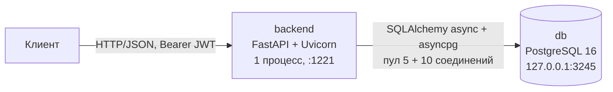
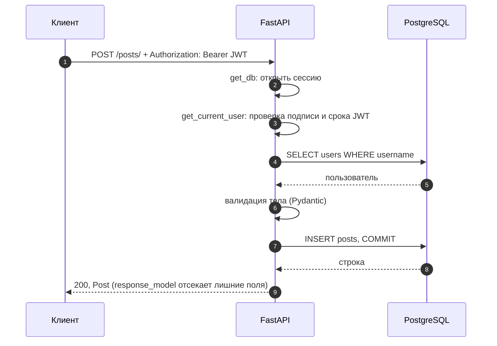
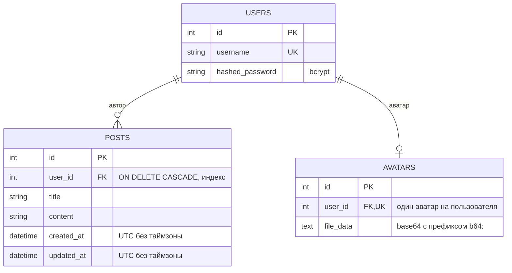
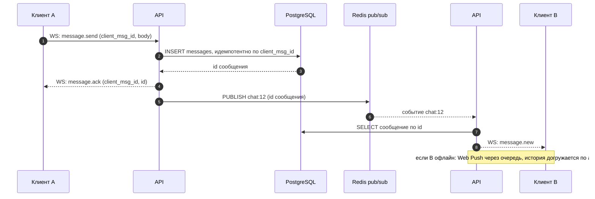
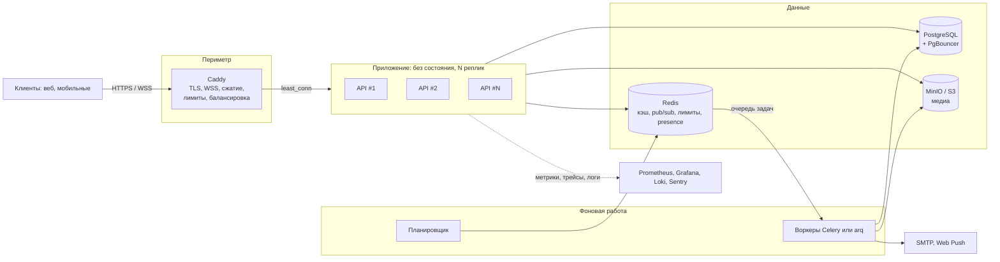

# Спецификация бэкенда messunjerr

> Состояние на 2026-10-04 · версия API 0.1.0 · статус: рабочий MVP.
> Фронтенд (React / Create React App) в документ **не входит**: он будет переписан, его контракт с бэкендом описан в [разделе 3](#3-справочник-api).
> Все ответы API ниже получены прогоном настоящего кода из `backend/src`, а не написаны по памяти.

## Содержание

0. [Сводка: что уже сделано](#0-сводка-что-уже-сделано)
1. [Стек](#1-стек)
2. [Архитектура](#2-архитектура): [устройство](#21-общая-схема), [данные](#23-модель-данных), [безопасность](#24-безопасность), [плюсы](#28-плюсы), [минусы](#29-минусы-и-технический-долг), [как бы доработал сеньор](#210-как-бы-доработал-сеньор)
3. [Справочник API](#3-справочник-api): все эндпоинты, входные данные, ответы, ошибки
4. [Приложение: решения и странности контракта](#4-приложение-решения-и-странности-контракта)

---

## 0. Сводка: что уже сделано

| Область | Реализовано |
|---|---|
| Аутентификация | регистрация с выдачей токена, вход (OAuth2 password flow), JWT HS256, пароли bcrypt, выравнивание времени ответа при неизвестном логине |
| Посты | создание, список (новые сверху, `limit` / `offset`), чтение, частичное изменение, удаление; доступ только у владельца |
| Аватары | загрузка JPEG / PNG (формат по содержимому, лимиты, EXIF, сжатие до 400×400, перекодирование), получение, удаление |
| Сервис | `/health` с проверкой БД, OpenAPI + Swagger UI + ReDoc, CORS по белому списку, конфигурация из окружения с проверкой при старте |
| Эксплуатация | Docker Compose (БД + бэкенд), healthcheck'и, ожидание БД с повторными попытками, образ без root |
| Качество | 65 автотестов (pytest), замеры производительности, README и документы в `docs/` |

**Ещё нет:** друзья; чат и WebSocket; стена и лента с видимостью постов; публичные профили других пользователей; миграции схемы; ограничение частоты запросов; подтверждение email; refresh-токены; CI.

**Размер:** 694 строки кода приложения в 14 файлах, 625 строк тестов, 3 таблицы, 12 операций API (11 прикладных + `/health`).

---

## 1. Стек

### 1.1. Бэкенд (то, что исполняется в продакшене)

| Слой | Технология | Версия | Роль в проекте |
|---|---|---|---|
| Язык | Python | 3.12.8 (образ `python:3.12.8-slim`) | |
| Веб-фреймворк | FastAPI | 0.116.1 | маршруты, внедрение зависимостей, валидация, OpenAPI |
| ASGI-основа | Starlette | 0.47.2 | HTTP, WebSocket, middleware (под капотом FastAPI) |
| ASGI-сервер | Uvicorn | 0.35.0 | один процесс; `uvloop`, `httptools` и `websockets` установлены |
| Схемы и валидация | Pydantic | 2.11.7 (core 2.33.2) | тела запросов и ответов, ограничения полей |
| ORM | SQLAlchemy | 2.0.43, асинхронный режим | модели, запросы |
| Драйвер БД | asyncpg | 0.30.0 | асинхронное соединение с PostgreSQL |
| СУБД | PostgreSQL | 16 (`postgres:16`) | пользователи, посты, аватары |
| Пароли | bcrypt | 5.0.0 | прямой вызов `hashpw` / `checkpw`, стоимость 12 |
| Токены | python-jose | 3.5.0 | JWT, алгоритм HS256 |
| Загрузка файлов | python-multipart | 0.0.20 | разбор `multipart/form-data` |
| Изображения | Pillow | 11.3.0 | проверка, EXIF, ресайз, перекодирование аватаров |
| Конфигурация | python-dotenv | 1.1.1 | чтение `.env` для локального запуска |

### 1.2. Инфраструктура

| Что | Как устроено |
|---|---|
| Оркестрация | Docker Compose v2: сервисы `db`, `backend` (и прототип `frontend`, вне этого документа) |
| База данных | контейнер `postgres:16`, данные в томе `postgres_data`, порт только на `127.0.0.1:3245`, healthcheck `pg_isready` |
| Бэкенд | образ `python:3.12.8-slim` (381 МБ), пользователь `appuser` (uid 10001), порт `1221` → `8000`, healthcheck по `GET /health`, `restart: unless-stopped` |
| Порядок старта | `backend` стартует после `db: healthy`; сам дополнительно ждёт БД до 30 секунд |
| Конфигурация | переменные окружения из `.env` (шаблон: [`.env.example`](../.env.example)) |

### 1.3. Разработка и тесты

| Что | Технология |
|---|---|
| Тесты | pytest 9.1.1, pytest-asyncio 1.4.0 |
| HTTP-клиент в тестах | httpx 0.28.1 (`ASGITransport`, без сети) |
| БД в тестах | SQLite через aiosqlite 0.22.1 (временный файл, таблицы пересоздаются перед каждым тестом) |
| Запуск | `cd backend && pytest` |

### 1.4. Насколько стек актуален (оценка на 2026-10)

| Компонент | Оценка | Комментарий |
|---|---|---|
| FastAPI, Starlette, Uvicorn | актуально | закреплён 0.116.1, текущий выпуск 0.142.x; проект всё ещё в ветке 0.x (классификатор Beta на PyPI), обновлять с прогоном тестов |
| Pydantic 2, SQLAlchemy 2 async, asyncpg, PostgreSQL 16 | актуально | мейнстрим-связка для async-Python |
| bcrypt | приемлемо | современный дефолт для новых проектов: Argon2id (в туториале FastAPI теперь `pwdlib` + Argon2) |
| python-jose | заменить | последний релиз май 2025; в туториале FastAPI теперь PyJWT |
| passlib | удалён | не выпускался с 2020 года и ломался на bcrypt 5; заменён прямым вызовом `bcrypt` |
| Pillow 11.3 | актуально | |
| Python 3.12 | актуально | поддерживается; 3.13 и 3.14 уже доступны |

### 1.5. Лишнее в `requirements.txt`

Файл содержит 59 закреплённых пакетов: это полный `pip freeze` с машины разработчика. Примерно половина приложению не нужна: `beautifulsoup4`, `soupsieve`, `lxml`, `sentry-sdk`, `rich`, `rich-toolkit`, `typer`, `shellingham`, `markdown-it-py`, `mdurl`, `Pygments`, `requests`, `urllib3`, `certifi`, `charset-normalizer`, `fastapi-cli`, `fastapi-cloud-cli`, `rignore`, `Jinja2`, `MarkupSafe`, `itsdangerous`, `orjson`, `ujson`, `email_validator`, `dnspython`, `pydantic-extra-types`, `pydantic-settings`, `colorama`. Они попали сюда как зависимости `fastapi[standard]`.

Обратная сторона: `uvloop` в Linux-образ приходит **транзитивно** (через `fastapi-cli`, который требует `uvicorn[standard]`), в файл не вписан и версией не закреплён, потому что `freeze` снимали на Windows, где `uvloop` не ставится. Реально сервер работает именно на нём.

---

## 2. Архитектура

### 2.1. Общая схема



Приложение **монолитное и без состояния**: в памяти процесса не хранится ничего, что нельзя восстановить из БД. Это условие для запуска нескольких реплик.

### 2.2. Устройство кода

```
backend/
├── Dockerfile
├── requirements.txt            зафиксированные версии
├── requirements-dev.txt        + pytest, aiosqlite
├── pytest.ini
├── src/
│   ├── main.py                 сборка приложения: роутеры, CORS, lifespan, /health
│   ├── config.py               чтение и проверка переменных окружения
│   ├── database.py             асинхронный движок, фабрика сессий, Base, get_db()
│   ├── clock.py                utcnow(): время в UTC без tzinfo
│   ├── auth/
│   │   ├── auth.py             bcrypt, JWT, get_current_user
│   │   └── routes.py           /auth/*
│   ├── posts/
│   │   ├── crud.py             операции с БД
│   │   └── routes.py           /posts/*, зависимость get_own_post
│   ├── profile/
│   │   └── routes.py           /users/avatar: проверка и обработка картинки, хранение
│   ├── models/                 ORM-модели users, posts, avatars
│   └── schemas/                Pydantic-схемы запросов и ответов
└── tests/                      65 тестов
```

| Слой | Модули | Ответственность | Зависит от |
|---|---|---|---|
| HTTP | `*/routes.py`, `main.py` | разбор запроса, коды ответов, права | схемы, зависимости, crud |
| Логика безопасности | `auth/auth.py` | хэширование, выпуск и проверка JWT | модели, конфиг |
| Доступ к данным | `posts/crud.py` | запросы к БД | модели |
| Данные | `models/`, `database.py` | таблицы, сессия | конфиг |
| Контракты | `schemas/` | валидация входа, форма выхода | pydantic |

**Сквозные зависимости FastAPI** (внедряются в обработчики через `Depends`):

| Зависимость | Что делает |
|---|---|
| `get_db` | открывает `AsyncSession` на запрос и закрывает после ответа |
| `get_current_user` | достаёт Bearer-токен, проверяет подпись и срок, загружает пользователя из БД, иначе 401 |
| `get_own_post` | загружает пост по `post_id` и проверяет владельца: 404, если нет, 403, если чужой |

**Жизненный цикл.** При старте `lifespan` вызывает `init_db()`: до 30 попыток раз в секунду выполняет `CREATE TABLE IF NOT EXISTS` для всех моделей; если БД так и не ответила, приложение падает с ошибкой. При остановке движок закрывается.

**Путь авторизованного запроса:**



### 2.3. Модель данных



Фактический DDL для PostgreSQL (сгенерирован из моделей SQLAlchemy):

```sql
CREATE TABLE users (
    id SERIAL NOT NULL,
    username VARCHAR NOT NULL,
    hashed_password VARCHAR NOT NULL,
    PRIMARY KEY (id)
);
CREATE INDEX ix_users_id ON users (id);
CREATE UNIQUE INDEX ix_users_username ON users (username);

CREATE TABLE avatars (
    id SERIAL NOT NULL,
    user_id INTEGER NOT NULL,
    file_data TEXT,
    PRIMARY KEY (id),
    UNIQUE (user_id),
    FOREIGN KEY(user_id) REFERENCES users (id) ON DELETE CASCADE
);
CREATE INDEX ix_avatars_id ON avatars (id);

CREATE TABLE posts (
    id SERIAL NOT NULL,
    user_id INTEGER NOT NULL,
    title VARCHAR NOT NULL,
    content VARCHAR NOT NULL,
    created_at TIMESTAMP WITHOUT TIME ZONE NOT NULL,
    updated_at TIMESTAMP WITHOUT TIME ZONE NOT NULL,
    PRIMARY KEY (id),
    FOREIGN KEY(user_id) REFERENCES users (id) ON DELETE CASCADE
);
CREATE INDEX ix_posts_id ON posts (id);
CREATE INDEX ix_posts_user_id ON posts (user_id);
```

**Договорённости, которые не видны в схеме:**

- Время хранится как naive UTC (колонка без таймзоны); `created_at` и `updated_at` ставит сервер, клиент их передать не может. Наружу время отдаётся в ISO 8601 с суффиксом `Z`.
- Аватар лежит в БД строкой `b64:<base64>`. Записи старого формата (экранированные байты через `latin1` + `unicode-escape`) читаются тоже.
- Схема создаётся при старте приложения (`create_all`), миграций нет. Ограничения и индексы, добавленные в модели позже, применятся только к новым БД.
- Уникальность логина без учёта регистра обеспечивает проверка `lower(username)` в обработчике регистрации; индекс в БД уникален только для точного совпадения.

### 2.4. Безопасность

| Механизм | Как реализован |
|---|---|
| Пароли | bcrypt, стоимость 12, соль внутри хэша; ограничение bcrypt в 72 байта проверяется явно (на регистрации пароль длиннее 72 байт отклоняется) |
| Вычисление хэша | в пуле потоков (`run_in_threadpool`), чтобы не блокировать event loop |
| Перебор логинов по времени | для несуществующего логина всё равно считается фиктивный bcrypt-хэш: ответ занимает столько же, сколько для существующего |
| Токен | JWT HS256, claims `sub` (логин) и `exp`; срок `ACCESS_TOKEN_EXPIRE_MINUTES` (по умолчанию 1440), один и тот же для регистрации и входа |
| Права | каждая ручка, кроме регистрации, входа и `/health`, требует токен; посты и аватар доступны только владельцу |
| CORS | белый список адресов из `CORS_ORIGINS`; `credentials` не разрешены |
| Файлы | формат по содержимому, лимит 5 МБ и 25 мегапикселей, перекодирование без метаданных |
| Секреты | не попадают в логи; без `SECRET_KEY` приложение не стартует; пароль БД с символами `@`, `/`, `:` корректно экранируется |
| Контейнер | не от root, порт БД только на localhost |

**Чего нет** (см. [минусы](#29-минусы-и-технический-долг)): ограничения частоты запросов, подтверждения email, refresh-токенов и отзыва токенов, ролей и бана, security-заголовков (это зона Caddy).

### 2.5. Асинхронность и производительность

Полный разбор с теорией и методикой: [async-and-performance.md](async-and-performance.md). Главное: эндпоинты и драйвер БД асинхронные, а bcrypt и Pillow уведены в пул потоков. Замеры на этом коде (1 процесс, настоящий PostgreSQL, 64 соединения):

| Эндпоинт | Запр/с |
|---|---:|
| `GET /health` | 514 |
| `GET /auth/users/me` | 319 |
| `GET /posts/?limit=20` | 222 |
| `POST /posts/` | 196 |
| `POST /auth/token` (bcrypt) | 38 |

Узкое место — одно ядро под Python (CPU приложения ~100%, Postgres 20–30%). Восемь процессов за балансировщиком дали 1337 запр/с на `GET /posts/`. WebSocket-соединения один процесс держит десятками тысяч (≈100 КБ памяти на соединение).

### 2.6. Конфигурация

| Переменная | Обязательна | По умолчанию | Смысл |
|---|:---:|---|---|
| `SECRET_KEY` | да | — | ключ подписи JWT |
| `POSTGRES_USER`, `POSTGRES_PASSWORD`, `POSTGRES_DB` | да\* | — | подключение к БД |
| `POSTGRES_HOST`, `POSTGRES_PORT` | нет | `localhost`, `5432` | в Compose: `db`, `5432` |
| `DATABASE_URL` | нет | собирается из `POSTGRES_*` | готовая строка подключения (используют тесты) |
| `ALGORITHM` | нет | `HS256` | алгоритм подписи JWT |
| `ACCESS_TOKEN_EXPIRE_MINUTES` | нет | `1440` | срок жизни токена |
| `CORS_ORIGINS` | нет | `localhost` / `127.0.0.1` на портах 1337 и 3000 | разрешённые адреса клиента |
| `AVATAR_MAX_BYTES` | нет | `5242880` | предельный размер аватара |
| `SQL_ECHO` | нет | выключено | логировать SQL (отладка) |

\* кроме случая, когда задан `DATABASE_URL`.

### 2.7. Тестирование

65 тестов в четырёх файлах (14 + 15 + 10 + 10 функций, часть параметризована), выполняются за ~35 секунд (основное время съедает bcrypt).

| Файл | Что покрыто |
|---|---|
| `test_auth.py` | регистрация и вход, валидация, срок токена, просроченный и поддельный токен, обратная совместимость со старыми хэшами passlib |
| `test_posts.py` | CRUD, порядок и пагинация, валидация, чужие посты, неаутентифицированный доступ, UTC |
| `test_avatar.py` | загрузка, замена, удаление, формат по содержимому, лимиты, EXIF, старый формат хранения |
| `test_service.py` | `/health`, CORS, OpenAPI, ожидание БД при старте, проверки при импорте (нет секрета, утечка пароля) |

**Ограничение:** БД в тестах — SQLite, а не PostgreSQL, поэтому расхождения (регистр строк, диапазон целых, типы дат) тестами не ловятся. WebSocket-тестов нет (WebSocket'ов тоже).

### 2.8. Плюсы

1. **Чёткие границы.** Код разложен по доменам (`auth`, `posts`, `profile`) и слоям; маршруты не лезут в SQL там, где есть `crud`; схемы отделены от моделей.
2. **Права в одном месте.** `get_own_post` используется тремя ручками, поэтому проверка владельца не размазана и не забывается.
3. **Асинхронность сделана правильно.** Драйвер БД асинхронный, блокирующее (bcrypt, Pillow) вынесено в потоки. Это подтверждено замером: один процесс при входе нагружает ~14 ядер и не вешает остальные запросы.
4. **Валидация на границе.** Ограничения полей, обрезка пробелов, предсказуемые 422 с машинно-читаемыми `type` и `loc`; лишние поля игнорируются, служебные (`user_id`, `created_at`) клиент задать не может.
5. **Безопасные значения по умолчанию.** Быстрое падение без секрета, белый список CORS, секреты вне логов, непривилегированный контейнер, порт БД на localhost, выравнивание времени ответа при логине.
6. **Аккуратная работа с файлами.** Формат по содержимому, лимиты на размер и пиксели, EXIF-ориентация, перекодирование без метаданных, тяжёлая обработка вне event loop.
7. **Предсказуемый запуск и эксплуатация.** Healthcheck'и, ожидание БД, `/health` с реальной проверкой, воспроизводимая сборка (закреплены версии образов и пакетов).
8. **Обратная совместимость при рефакторинге.** Старые bcrypt-хэши и старый формат аватаров продолжают работать, это закреплено тестами.
9. **Документация из кода.** OpenAPI, Swagger UI и ReDoc строятся автоматически; плюс README и документы в `docs/`.
10. **Быстрая обратная связь.** Набор из 65 тестов, которому не нужен ни Docker, ни Postgres.

### 2.9. Минусы и технический долг

Нумерация (M1…M21) нужна, чтобы ссылаться на пункты в [плане доработок](#210-как-бы-доработал-сеньор).

**Безопасность и публичная эксплуатация**

| № | Проблема | Почему важно |
|---|---|---|
| M1 | Нет ограничения частоты запросов | `POST /auth/token` стоит ~0,25 с CPU на вызов; 32 параллельных входа заняли ~14 ядер. Одним клиентом можно положить сервер, а перебор паролей не ограничен |
| M2 | Открытая регистрация без подтверждения email и капчи | боты, спам, массовые аккаунты; каждая регистрация ещё и CPU-дорогая |
| M3 | Один access-токен на 24 часа: нет refresh, отзыва, серверного logout | смена пароля или бан не обрывает сессию; украденный токен действует сутки |
| M4 | Ответ 422 повторяет введённые данные в поле `input`, **включая пароль в открытом виде** | пароль попадает в логи прокси, клиента, Sentry |
| M5 | Нет ролей, бана, модерации, удаления аккаунта | для публичной сети это обязательно |
| M6 | python-jose, HS256 с общим секретом, без ротации ключей | библиотека редко обновляется; один секрет на всё |

**Данные и схема**

| № | Проблема | Почему важно |
|---|---|---|
| M7 | Нет миграций (`create_all`) | любое изменение схемы = пересоздание БД; новые индексы и ограничения не доезжают до существующих БД |
| M8 | Модель пользователя минимальна: нет email, display_name, `created_at`, `is_active` | логин совпадает с публичным именем; нечего показывать в профиле |
| M9 | `SERIAL` (int32, последовательные id), `timestamp without time zone` | id перебираются; тип времени держится на договорённости. Значение `post_id` больше 2³¹−1 дойдёт до БД: на PostgreSQL ожидаемо будет 500 (в этой сессии не проверялось, на SQLite не воспроизводится) |
| M10 | Аватар в БД текстом base64 (+33% размера), виден только владельцу и только с токеном | нет публичных URL, кэш-заголовков, превью; чужие аватары не показать |
| M11 | Уникальность логина без регистра обеспечена запросом, а не индексом БД; вход чувствителен к регистру | в гонке два «одинаковых» логина разного регистра теоретически пройдут; `Alice` не войдёт как `alice` |

**Код и контракт API**

| № | Проблема | Почему важно |
|---|---|---|
| M12 | Нет слоя сервисов и общей границы транзакции: `commit()` вызывается внутри `crud` и роутов | несколько операций не собрать в одну транзакцию; для дружбы и сообщений это критично |
| M13 | Нет версии API (`/api/v1`) и единого формата ошибок: `detail` то строка, то список; нет машинных кодов; 500 и ошибки CORS приходят как `text/plain` | клиенту приходится разбирать строки; смена текста сломает клиента |
| M14 | Непоследовательные коды: регистрация и создание поста отвечают 200, удаление поста 200 с телом, аватар 201 и 204; 403 с текстом «Unauthorized»; PUT работает как PATCH; пустой PUT меняет `updated_at` | усложняет клиентов и документацию |
| M15 | `limit` необязателен: без параметров список отдаёт все посты; пагинация через `offset`, без курсора и общего числа | лента на тысячи постов станет медленной и тяжёлой |
| M16 | 403 против 404 раскрывает, существует ли чужой `post_id` | перебор идентификаторов |
| M17 | Логи — обычный текст, нет request-id, метрик, трассировки; `/health` один (нет разделения на liveness / readiness) | в проде не разобраться, что случилось |

**Качество и сборка**

| № | Проблема | Почему важно |
|---|---|---|
| M18 | Тесты на SQLite; нет CI, линтера, проверки типов, `pip-audit`, pre-commit | расхождения с PostgreSQL остаются незамеченными |
| M19 | `requirements.txt` — полный `freeze` (половина лишнего), `uvloop` не закреплён | медленная сборка, больше поверхность атаки, неточная воспроизводимость |
| M20 | Один stage в Dockerfile, нет разделения dev и prod; создание таблиц выполняет каждая реплика при старте | при нескольких репликах миграции должны идти отдельным шагом |
| M21 | Конфиг — модуль с глобальными константами, а не типизированный объект настроек | сложнее тестировать и расширять |

### 2.10. Как бы доработал сеньор

**Принципы.** (1) Сначала фундамент, потом фичи: миграции, слои, контракт ошибок, наблюдаемость. Добавлять дружбу и чат на нынешний каркас дороже, чем исправить каркас сейчас. (2) Публичный сервис с первого дня считается враждебной средой: лимиты, верификация, модерация. (3) Каждая новая возможность проектируется как отдельный домен со своими таблицами, сервисом и политикой доступа. (4) Измерять, а не гадать.

#### План по приоритетам

| Приоритет | Что сделать | Закрывает |
|---|---|---|
| **P0** (до публикации в интернет и до новых фич) | Ограничение частоты запросов: Caddy на периметре + Redis в приложении по ключам IP и логин, отдельные жёсткие лимиты на `/auth/token` и `/auth/register` | M1 |
| | Alembic (шаблон async): первая ревизия = текущая схема, применение отдельным шагом деплоя, `create_all` убрать | M7, M20 |
| | Слой сервисов и транзакция на запрос: репозитории не вызывают `commit`, коммит в одном месте (зависимость или сервис, Unit of Work) | M12 |
| | Единый формат ошибок с машинными кодами и `request_id`, 422 без `input`; префикс `/api/v1`; приведение кодов к REST (201 / 204) | M4, M13, M14 |
| | Токены: короткий access (10–15 минут) + refresh с ротацией и отзывом (хэш в БД или Redis), HttpOnly-cookie для браузера, PyJWT, Argon2id с автоперехэшированием | M3, M6 |
| | Подтверждение email (письмо через очередь) и капча на регистрации | M2 |
| | CI: ruff, mypy, pytest **на настоящем PostgreSQL**, `pip-audit`, сборка образа | M18 |
| **P1** (вместе с новыми доменами) | Расширить `users`: email, display_name, bio, `created_at`, `is_active`, роль; `BIGINT` / UUID для публичных id, `timestamptz`, уникальный индекс по `lower(username)` | M8, M9, M11 |
| | Файлы вне БД: объектное хранилище (MinIO / S3), presigned URL, превью фоновой задачей, `Cache-Control` и `ETag` | M10 |
| | Пагинация курсором по `(created_at, id)`, обязательный `limit` с потолком | M15 |
| | Наблюдаемость: JSON-логи, `request_id`, метрики Prometheus, OpenTelemetry (встроен в свежий FastAPI), Sentry, `/health` и `/ready` | M17 |
| | Типизированные настройки (`pydantic-settings`), Docker secrets | M21 |
| | Роли, бан, жалобы, удаление аккаунта, журнал действий | M5 |
| **P2** (по мере роста) | PgBouncer, реплики чтения, секционирование таблицы сообщений, полнотекстовый поиск Postgres, нагрузочные тесты в CI с бюджетом на p95, feature flags | |

#### Контракт ошибок (пример)

```json
{
  "error": {
    "code": "post_not_found",
    "message": "Post not found",
    "details": null
  },
  "request_id": "01J9ZQ3Y8E4N7M2K5V6T1R0XBC"
}
```

Для валидации: тот же конверт с `code: "validation_error"` и `details: [{"field": "body.password", "code": "string_too_short", "message": "..."}]`, без поля `input`. Все коды перечисляются в OpenAPI (`responses=` у каждой ручки), клиент ветвится по `code`, а не по тексту.

#### Права доступа как отдельный слой

Одна точка решения «может ли X видеть Y» (`policies.py`), которую используют и ручки, и SQL-фильтры списков: ни один новый эндпоинт не пишет собственных проверок.

```python
def can_view_post(viewer_id: int, post: Post, are_friends: bool, is_blocked: bool) -> bool:
    if post.user_id == viewer_id:
        return True
    if is_blocked:
        return False
    return post.visibility == "public" or (post.visibility == "friends" and are_friends)
```

В списках то же условие выражается в SQL (`visibility`, `EXISTS` по дружбе), иначе приватные посты утекут через новую ручку.

#### Данные под ваши планы (предложение)

Дружба и блокировки:

```sql
CREATE TABLE friendships (
    user_low_id  BIGINT NOT NULL REFERENCES users(id) ON DELETE CASCADE,
    user_high_id BIGINT NOT NULL REFERENCES users(id) ON DELETE CASCADE,
    requested_by BIGINT NOT NULL REFERENCES users(id),
    status       TEXT   NOT NULL CHECK (status IN ('pending', 'accepted')),
    created_at   TIMESTAMPTZ NOT NULL DEFAULT now(),
    accepted_at  TIMESTAMPTZ,
    PRIMARY KEY (user_low_id, user_high_id),
    CHECK (user_low_id < user_high_id)          -- пара хранится один раз, независимо от порядка
);
CREATE TABLE user_blocks (
    blocker_id BIGINT NOT NULL REFERENCES users(id) ON DELETE CASCADE,
    blocked_id BIGINT NOT NULL REFERENCES users(id) ON DELETE CASCADE,
    PRIMARY KEY (blocker_id, blocked_id)
);
```

Видимость постов и стена:

```sql
ALTER TABLE posts ADD COLUMN visibility TEXT NOT NULL DEFAULT 'private'
    CHECK (visibility IN ('private', 'friends', 'public'));        -- личные посты = private
ALTER TABLE posts ADD COLUMN wall_owner_id BIGINT REFERENCES users(id);  -- только если нужна «стена» как в ВК
CREATE INDEX ix_posts_feed ON posts (created_at DESC, id DESC);
```

Чат (беседа + участники + сообщения; даже для личной переписки, чтобы групповой чат был почти бесплатным):

```sql
CREATE TABLE conversations (
    id         BIGSERIAL PRIMARY KEY,
    kind       TEXT NOT NULL CHECK (kind IN ('direct', 'group')),
    title      TEXT,
    direct_key TEXT UNIQUE,                    -- 'меньший_id:больший_id': одна беседа на пару
    created_at TIMESTAMPTZ NOT NULL DEFAULT now()
);
CREATE TABLE conversation_members (
    conversation_id      BIGINT NOT NULL REFERENCES conversations(id) ON DELETE CASCADE,
    user_id              BIGINT NOT NULL REFERENCES users(id) ON DELETE CASCADE,
    last_read_message_id BIGINT NOT NULL DEFAULT 0,
    PRIMARY KEY (conversation_id, user_id)
);
CREATE TABLE messages (
    id              BIGSERIAL PRIMARY KEY,
    conversation_id BIGINT NOT NULL REFERENCES conversations(id) ON DELETE CASCADE,
    sender_id       BIGINT NOT NULL REFERENCES users(id),
    client_msg_id   UUID   NOT NULL,           -- идемпотентность повторной отправки
    body            TEXT   NOT NULL CHECK (length(body) BETWEEN 1 AND 4000),
    created_at      TIMESTAMPTZ NOT NULL DEFAULT now(),
    UNIQUE (conversation_id, sender_id, client_msg_id)
);
CREATE INDEX ix_messages_conversation ON messages (conversation_id, id DESC);
```

#### Чат: как его строит сеньор

1. **Сначала REST, потом WebSocket.** История и отправка работают по HTTP (`POST /conversations/{id}/messages`, `GET ...?after_id=`), WebSocket только доставляет события. Так проще тестировать, а клиент после обрыва связи догружает пропущенное.
2. **Авторизация WebSocket** одноразовым ticket'ом (его выдаёт REST-ручка) или HttpOnly-cookie с обязательной проверкой заголовка `Origin`. Токен в query-строке не передают: он оседает в логах.
3. **Протокол**: JSON-события с полем `type`, схема описывается Pydantic-моделями (OpenAPI WebSocket не описывает).
4. **Несколько реплик**: событие публикуется в Redis pub/sub, каждая реплика рассылает его своим подключённым клиентам; присутствие и «печатает…» живут в Redis с TTL, а не в БД.
5. **Оффлайн-доставка**: Web Push и email через очередь задач.



#### Целевая архитектура



Где что применяется из вашего плана: **Caddy** даёт HTTPS и WSS, сжатие, лимиты размера тела и частоты, равномерную балансировку между репликами (встроенный `uvicorn --workers` на коротких всплесках раздаёт соединения неровно: в замере два воркера из четырёх взяли 38 запросов из 40). **Redis** нужен в трёх ролях: кэш горячего чтения, pub/sub и presence для WebSocket, счётчики rate limit. **Celery** подходит для писем, превью картинок и периодических задач; его воркеры синхронные, поэтому задачи пишутся обычными `def` (нативно-асинхронные аналоги — arq и taskiq).

#### Целевая структура кода

```
src/
├── core/               config (pydantic-settings), db, security, errors, logging, policies
├── api/v1/             сборка роутеров под префиксом /api/v1
├── users/              router, service, repository, schemas, models
├── auth/               tokens, passwords, sessions (refresh)
├── friends/
├── posts/              стена, лента, видимость
├── chat/               REST + WebSocket, менеджер подключений за интерфейсом (память → Redis)
├── media/              загрузка, превью, хранилище
├── notifications/      email, Web Push (через очередь)
└── workers/            задачи Celery / arq
```

Правило зависимостей: `router → service → repository → models`; сервис не знает про HTTP, репозиторий не делает `commit`, доменные модули общаются друг с другом через сервисы, а не через чужие таблицы.

#### Чего сеньор делать не стал бы

Микросервисы, Kubernetes, GraphQL, event sourcing и собственную криптографию для токенов до тех пор, пока одна машина с Postgres и Redis не упрётся в потолок. Модульный монолит с чёткими границами позволит выделить сервис позже, а ошибка раннего дробления стоит дороже. Для Go-сервиса разумный кандидат — WebSocket-шлюз; детали сравнения в [async-and-performance.md](async-and-performance.md).

---

## 3. Справочник API

### 3.1. Общие правила

| Что | Правило |
|---|---|
| Базовый адрес | `http://localhost:1221` (Docker Compose). Версии в пути нет |
| Формат | JSON, UTF-8. Исключения: `POST /auth/token` (форма `application/x-www-form-urlencoded`), `POST /users/avatar` (`multipart/form-data`), `GET /users/avatar` (изображение) |
| Аутентификация | заголовок `Authorization: Bearer <access_token>`. Токен выдают `POST /auth/register` и `POST /auth/token`. В OpenAPI это схема `OAuth2PasswordBearer` (`tokenUrl: /auth/token`), поэтому в Swagger UI работает кнопка **Authorize** |
| Идентификаторы | целые числа |
| Время | ISO 8601 в UTC с микросекундами и суффиксом `Z`: `2026-10-04T09:33:14.538106Z` |
| Строки | пробелы по краям логина, заголовка и текста поста обрезаются |
| Лишние поля | в JSON-теле игнорируются (задать `user_id` или `created_at` нельзя) |
| Слэш на конце | у `/posts/` слэш обязателен: `/posts` отвечает 307 на `/posts/` (метод и тело сохраняются). `/auth/register/` и `/auth/users/me/` работают как скрытые алиасы без редиректа. `/users/avatar/` отвечает 307 на `/users/avatar` |
| Неизвестный путь, метод | `404 {"detail":"Not Found"}`; `405 {"detail":"Method Not Allowed"}` |
| CORS | разрешены адреса из `CORS_ORIGINS`. Preflight с разрешённого адреса: `200` с телом `OK` и заголовком `access-control-allow-origin`; с чужого: `400` с телом `Disallowed CORS origin` (`text/plain`) |
| Документация | `/docs` (Swagger UI), `/redoc`, `/openapi.json` |

**Две формы тела ошибки:**

```json
{"detail": "Post not found"}
```

для ошибок логики (400, 401, 403, 404, 413, 503), и

```json
{"detail": [{"type": "string_too_short", "loc": ["body", "title"], "msg": "String should have at least 1 character", "input": "   ", "ctx": {"min_length": 1}}]}
```

для ошибок валидации (422); список может содержать несколько элементов. Поле `loc` указывает источник (`body`, `query`, `path`) и имя поля. Поле `input` повторяет присланное значение, **в том числе пароль** (см. M4). Неперехваченная ошибка сервера: `500`, `Content-Type: text/plain`, тело `Internal Server Error`.

**Порядок проверок в защищённых ручках:** аутентификация (401) → существование ресурса (404) → владелец (403) → валидация тела (422). Например, чужой пост с некорректным телом даёт 403, а не 422.

**Заметки для клиента:**

- Аватар отдаётся только с заголовком `Authorization`, поэтому `` напрямую не сработает: запрашивайте файл через `fetch` и показывайте как blob.
- Все 401 содержат `WWW-Authenticate: Bearer`. Различать «нет токена» и «токен недействителен» можно по тексту `detail` (но это хрупко, см. M13).
- Токен живёт `ACCESS_TOKEN_EXPIRE_MINUTES` минут; продления нет, после истечения нужен новый вход.

### 3.2. Обзор эндпоинтов

| Метод | Путь | Доступ | Назначение | Успех |
|:---:|---|:---:|---|:---:|
| `POST` | `/auth/register` | — | регистрация, сразу возвращает токен | 200 |
| `POST` | `/auth/token` | — | вход по логину и паролю | 200 |
| `GET` | `/auth/users/me` | токен | текущий пользователь | 200 |
| `POST` | `/posts/` | токен | создать пост | 200 |
| `GET` | `/posts/` | токен | свои посты, новые сверху | 200 |
| `GET` | `/posts/{post_id}` | токен | свой пост по id | 200 |
| `PUT` | `/posts/{post_id}` | токен | частично изменить свой пост | 200 |
| `DELETE` | `/posts/{post_id}` | токен | удалить свой пост | 200 |
| `POST` | `/users/avatar` | токен | загрузить свой аватар | 201 |
| `GET` | `/users/avatar` | токен | получить свой аватар | 200 |
| `DELETE` | `/users/avatar` | токен | удалить свой аватар | 204 |
| `GET` | `/health` | — | состояние сервиса и БД | 200 |

---

### 3.3. `POST /auth/register`

Создаёт пользователя и сразу выдаёт токен (отдельный вход не нужен).

**Запрос** · `Content-Type: application/json`

| Поле | Тип | Обязательно | Ограничения |
|---|---|:---:|---|
| `username` | string | да | после обрезки пробелов 3–32 символа, без пробельных символов внутри |
| `password` | string | да | не короче 8 символов и не длиннее 72 байт в UTF-8 |

```json
{"username": "alice", "password": "alice-password-1"}
```

**Ответ** · `200`

```json
{
  "access_token": "eyJhbGciOiJIUzI1NiIsInR5cCI6IkpXVCJ9...",
  "token_type": "bearer",
  "message": "User registered successfully"
}
```

**Ошибки**

| Статус | Когда | Тело |
|:---:|---|---|
| 400 | логин занят (сравнение без учёта регистра, после обрезки пробелов); также при гонке двух одновременных регистраций | `{"detail":"Username already registered"}` |
| 422 | логин короче 3 или длиннее 32 символов | `type: value_error`, `msg: "Value error, Username must be 3 to 32 characters long"`, `loc: ["body","username"]` |
| 422 | пробел внутри логина | `msg: "Value error, Username must not contain spaces"` |
| 422 | пароль короче 8 символов | `msg: "Value error, Password must be at least 8 characters long"` |
| 422 | пароль длиннее 72 байт (кириллица: больше 36 символов) | `msg: "Value error, Password must be at most 72 bytes long"` |
| 422 | нет поля | `type: missing`, `msg: "Field required"`, `loc: ["body","password"]` (по элементу на каждое отсутствующее поле) |
| 422 | тело не JSON | `type: json_invalid`, `msg: "JSON decode error"`, `loc: ["body",0]` |
| 422 | форма вместо JSON | `type: model_attributes_type`, `msg: "Input should be a valid dictionary or object to extract fields from"` |

**Заметки:** пароль хэшируется bcrypt в пуле потоков (~0,25 с CPU). Логин сохраняется в том регистре, в каком введён. Успешный статус — 200, а не 201 (см. M14).

---

### 3.4. `POST /auth/token`

Вход. Стандартный OAuth2 password flow, поэтому тело — **форма**, а не JSON.

**Запрос** · `Content-Type: application/x-www-form-urlencoded`

| Поле | Обязательно | Описание |
|---|:---:|---|
| `username` | да | логин (регистр важен) |
| `password` | да | пароль |
| `grant_type` | нет | если передан, то только `password` |
| `scope`, `client_id`, `client_secret` | нет | принимаются и игнорируются |

```
username=alice&password=alice-password-1
```

**Ответ** · `200`

```json
{"access_token": "eyJhbGciOiJIUzI1NiIsInR5cCI6IkpXVCJ9...", "token_type": "bearer"}
```

**Ошибки**

| Статус | Когда | Тело |
|:---:|---|---|
| 401 | неверный пароль, несуществующий логин или логин другого регистра (`PROBE_ALICE` вместо `probe_alice`): ответ одинаковый | `{"detail":"Incorrect username or password"}`, заголовок `WWW-Authenticate: Bearer` |
| 422 | нет `username` или `password` (в том числе если прислан JSON вместо формы) | `type: missing`, `loc: ["body","username"]` / `["body","password"]`, `input: null` |
| 422 | `grant_type` не равен `password` | `type: string_pattern_mismatch`, `msg: "String should match pattern '^password$'"` |

**Заметки:** самая дорогая ручка: bcrypt занимает ~0,25 с CPU, при 32 параллельных входах p50 был ~0,9 с и 38 запр/с на процесс. Время ответа для несуществующего логина выровнено с существующим. Для защиты нужен rate limit (M1).

---

### 3.5. `GET /auth/users/me`

Возвращает текущего пользователя по токену.

**Запрос:** заголовок `Authorization: Bearer <token>`, тела нет.

**Ответ** · `200`

```json
{"username": "alice", "id": 1, "avatar_url": null}
```

| Поле | Тип | Описание |
|---|---|---|
| `id` | int | идентификатор пользователя |
| `username` | string | логин |
| `avatar_url` | string или null | `"/users/avatar"`, если аватар загружен, иначе `null` (относительный путь; сам файл требует токен) |

**Ошибки**

| Статус | Когда | Тело |
|:---:|---|---|
| 401 | нет заголовка `Authorization` или схема не `Bearer` | `{"detail":"Not authenticated"}`, `WWW-Authenticate: Bearer` |
| 401 | токен не расшифровывается, неверная подпись, истёк срок, нет `sub`, пользователь удалён или не найден, пустой токен после `Bearer ` | `{"detail":"Could not validate credentials"}`, `WWW-Authenticate: Bearer` |

---

### 3.6. `POST /posts/`

Создаёт пост текущего пользователя. Видимость пока одна: пост доступен только автору.

**Запрос** · `Content-Type: application/json`

| Поле | Тип | Обязательно | Ограничения |
|---|---|:---:|---|
| `title` | string | да | после обрезки пробелов 1–200 символов |
| `content` | string | да | после обрезки пробелов 1–10 000 символов |

```json
{"title": "Привет", "content": "Мой первый пост"}
```

**Ответ** · `200`

```json
{
  "id": 1,
  "user_id": 1,
  "title": "Привет",
  "content": "Мой первый пост",
  "created_at": "2026-10-04T09:33:14.538106Z",
  "updated_at": "2026-10-04T09:33:14.538106Z"
}
```

**Ошибки**

| Статус | Когда | Тело |
|:---:|---|---|
| 401 | нет или недействителен токен | как в [`GET /auth/users/me`](#35-get-authusersme) |
| 422 | нет поля | `type: missing`, `loc: ["body","title"]` / `["body","content"]` |
| 422 | пустая или состоящая из пробелов строка | `type: string_too_short`, `ctx: {"min_length": 1}` |
| 422 | слишком длинная строка | `type: string_too_long`, `ctx: {"max_length": 200}` (заголовок) или `10000` (текст) |
| 422 | `null` вместо строки | `type: string_type`, `msg: "Input should be a valid string"` |

**Заметки:** `user_id`, `created_at` и `updated_at` из тела игнорируются, их проставляет сервер. Успех — 200 (см. M14).

---

### 3.7. `GET /posts/`

Список **своих** постов, от новых к старым (`created_at` по убыванию, затем `id`).

**Запрос:** query-параметры

| Параметр | Тип | По умолчанию | Ограничения |
|---|---|---|---|
| `limit` | int | не задан (отдаются все посты) | 1–500 |
| `offset` | int | 0 | ≥ 0 |

**Ответ** · `200` — массив объектов `Post` (формат как в [`POST /posts/`](#36-post-posts)); если постов нет, `[]`.

**Ошибки**

| Статус | Когда | Тело |
|:---:|---|---|
| 401 | нет или недействителен токен | как выше |
| 422 | `limit=0` | `type: greater_than_equal`, `ctx: {"ge": 1}`, `loc: ["query","limit"]` |
| 422 | `limit=501` | `type: less_than_equal`, `ctx: {"le": 500}` |
| 422 | `offset=-1` | `type: greater_than_equal`, `ctx: {"ge": 0}`, `loc: ["query","offset"]` |
| 422 | нечисловое значение | `type: int_parsing`, `msg: "Input should be a valid integer, unable to parse string as an integer"` |

**Заметки:** посты других пользователей не возвращаются, чужой список всегда пустой. Без `limit` ответ может быть большим (M15).

---

### 3.8. `GET /posts/{post_id}`

Один пост текущего пользователя.

**Запрос:** `post_id` — целое число в пути.

**Ответ** · `200` — объект `Post`.

**Ошибки**

| Статус | Когда | Тело |
|:---:|---|---|
| 401 | нет или недействителен токен | как выше |
| 403 | пост существует, но принадлежит другому пользователю | `{"detail":"Unauthorized"}` |
| 404 | поста с таким id нет | `{"detail":"Post not found"}` |
| 422 | `post_id` не число | `type: int_parsing`, `loc: ["path","post_id"]` |

**Заметки:** раньше эта ручка отдавала любой пост без токена; сейчас токен обязателен. Различие 403 и 404 позволяет проверять существование чужих id (M16). Текст «Unauthorized» при коде 403 — историческая странность (M14).

---

### 3.9. `PUT /posts/{post_id}`

Частичное изменение своего поста: меняются только переданные поля (фактически PATCH).

**Запрос** · `Content-Type: application/json`, `post_id` в пути

| Поле | Тип | Обязательно | Ограничения |
|---|---|:---:|---|
| `title` | string или null | нет | если передан: 1–200 символов после обрезки |
| `content` | string или null | нет | если передан: 1–10 000 символов после обрезки |

```json
{"title": "Новый заголовок"}
```

**Ответ** · `200` — обновлённый `Post`; `updated_at` новое, `created_at` прежнее.

**Ошибки**

| Статус | Когда | Тело |
|:---:|---|---|
| 401 | нет или недействителен токен | как выше |
| 403 | чужой пост | `{"detail":"Unauthorized"}` |
| 404 | поста нет | `{"detail":"Post not found"}` |
| 422 | пустая строка или строка из пробелов, слишком длинное значение | `type: string_too_short` / `string_too_long`, `loc: ["body","title"]` |
| 422 | `post_id` не число | `type: int_parsing`, `loc: ["path","post_id"]` |

**Заметки:** тело `{}` и поля `null` — не ошибки: ничего не меняется, но `updated_at` всё равно обновляется. Права проверяются раньше валидации тела: чужой пост с некорректным телом даёт 403.

---

### 3.10. `DELETE /posts/{post_id}`

Удаляет свой пост.

**Запрос:** `post_id` в пути, тела нет.

**Ответ** · `200`

```json
{"detail": "Post deleted"}
```

**Ошибки**

| Статус | Когда | Тело |
|:---:|---|---|
| 401 | нет или недействителен токен | как выше |
| 403 | чужой пост | `{"detail":"Unauthorized"}` |
| 404 | поста нет (в том числе повторное удаление) | `{"detail":"Post not found"}` |
| 422 | `post_id` не число | `type: int_parsing` |

**Заметки:** удаление необратимо (мягкого удаления нет). Успешный ответ приходит с телом и кодом 200, а не 204 (M14).

---

### 3.11. `POST /users/avatar`

Загружает или заменяет аватар текущего пользователя.

**Запрос** · `Content-Type: multipart/form-data`

| Поле | Тип | Обязательно | Описание |
|---|---|:---:|---|
| `file` | файл | да | JPEG или PNG |

Что делает сервер:

1. отклоняет файл больше 5 МБ (`AVATAR_MAX_BYTES`) ещё до чтения;
2. определяет формат **по содержимому**, а не по заголовку `Content-Type` или расширению (допустимы JPEG и PNG);
3. отклоняет изображения больше 25 мегапикселей;
4. применяет EXIF-ориентацию, уменьшает до размера в пределах 400×400 с сохранением пропорций (меньшие картинки не увеличивает);
5. перекодирует (JPEG качество 85, PNG с оптимизацией): метаданные оригинала не сохраняются;
6. сохраняет в БД, заменяя прежний аватар.

**Ответ** · `201` (в том числе при замене существующего аватара)

```json
{"message": "Avatar uploaded and resized successfully"}
```

**Ошибки**

| Статус | Когда | Тело |
|:---:|---|---|
| 400 | не изображение, повреждённый или обрезанный файл | `{"detail":"Invalid image file"}` |
| 400 | настоящее изображение другого формата (GIF и т. п.) | `{"detail":"Only JPEG/PNG allowed"}` |
| 400 | больше 25 мегапикселей (даже если файл маленький) | `{"detail":"Image is too large"}` |
| 401 | нет или недействителен токен | как выше |
| 413 | файл больше 5 МБ | `{"detail":"File is too large (max 5120 KB)"}` |
| 422 | нет поля `file` (в том числе если прислан JSON или поле называется иначе) | `type: missing`, `loc: ["body","file"]` |

**Заметки:** текст внутренних исключений наружу не отдаётся. Весь запрос принимается сервером целиком до проверки размера: потолок размера тела нужно дополнительно ставить на Caddy.

---

### 3.12. `GET /users/avatar`

Отдаёт аватар **текущего** пользователя (чужие недоступны).

**Запрос:** заголовок `Authorization`, тела нет.

**Ответ** · `200`, тело — байты изображения

| Заголовок | Значение |
|---|---|
| `Content-Type` | `image/jpeg` или `image/png` (определяется по первым байтам файла) |
| `Content-Disposition` | `inline; filename=avatar_<user_id>` |

**Ошибки**

| Статус | Когда | Тело |
|:---:|---|---|
| 401 | нет или недействителен токен | как выше |
| 404 | аватар не загружен | `{"detail":"Avatar not found"}` |
| 500 | запись в БД повреждена и не декодируется (по коду, на практике не встречается) | `{"detail":"Failed to process avatar"}` |

---

### 3.13. `DELETE /users/avatar`

Удаляет аватар текущего пользователя.

**Запрос:** заголовок `Authorization`, тела нет.

**Ответ** · `204`, тело пустое.

**Ошибки**

| Статус | Когда | Тело |
|:---:|---|---|
| 401 | нет или недействителен токен | как выше |
| 404 | аватара нет (в том числе повторное удаление) | `{"detail":"Avatar not found"}` |

---

### 3.14. `GET /health`

Проверка живости и доступности БД: выполняет `SELECT 1`. Без авторизации. Используется healthcheck'ом Compose.

**Ответ** · `200`

```json
{"status": "ok"}
```

**Ошибки**

| Статус | Когда | Тело |
|:---:|---|---|
| 503 | БД недоступна | `{"detail":"Database unavailable"}` (по коду и тесту) |

---

### 3.15. Схемы данных

**User** (ответ `GET /auth/users/me`)

| Поле | Тип | Описание |
|---|---|---|
| `id` | int | идентификатор |
| `username` | string | логин |
| `avatar_url` | string или null | `/users/avatar` или `null` |

**Post** (ответы постов)

| Поле | Тип | Описание |
|---|---|---|
| `id` | int | идентификатор поста |
| `user_id` | int | идентификатор автора |
| `title` | string | заголовок |
| `content` | string | текст |
| `created_at` | string (дата-время, UTC, `Z`) | создан |
| `updated_at` | string (дата-время, UTC, `Z`) | изменён (при создании равен `created_at`) |

**Token** (ответ `POST /auth/token`) — `access_token` (string), `token_type` (всегда `"bearer"`). **RegisterResponse** — то же плюс `message` (string).

**Содержимое JWT:** заголовок `{"alg":"HS256","typ":"JWT"}`, claims `sub` (логин на момент выдачи) и `exp` (unix-время истечения). Других claims нет.

### 3.16. Сводка кодов ошибок

| Статус | Значение в этом API | Форма тела |
|:---:|---|---|
| 400 | занятый логин; неподходящее или повреждённое изображение | `{"detail": "<строка>"}` |
| 401 | нет токена, токен недействителен, неверный логин или пароль | `{"detail": "<строка>"}` + `WWW-Authenticate: Bearer` |
| 403 | чужой пост | `{"detail":"Unauthorized"}` |
| 404 | нет поста, нет аватара, неизвестный путь | `{"detail": "<строка>"}` |
| 405 | метод не поддерживается путём | `{"detail":"Method Not Allowed"}` |
| 307 | путь без нужного слэша (`/posts`, `/users/avatar/`) | пустое тело, заголовок `Location` |
| 413 | аватар больше лимита | `{"detail": "<строка>"}` |
| 422 | ошибка валидации тела, query или path | `{"detail": [ {type, loc, msg, input, ctx?}, ... ]}` |
| 500 | необработанная ошибка | `text/plain`: `Internal Server Error` |
| 503 | БД недоступна (только `/health`) | `{"detail":"Database unavailable"}` |

Матрица: какие коды возможны у каких ручек (кроме общих 307, 405 и 500):

| Ручка | 400 | 401 | 403 | 404 | 413 | 422 | 503 |
|---|:---:|:---:|:---:|:---:|:---:|:---:|:---:|
| `POST /auth/register` | ✔ | | | | | ✔ | |
| `POST /auth/token` | | ✔ | | | | ✔ | |
| `GET /auth/users/me` | | ✔ | | | | | |
| `POST /posts/` | | ✔ | | | | ✔ | |
| `GET /posts/` | | ✔ | | | | ✔ | |
| `GET /posts/{id}` | | ✔ | ✔ | ✔ | | ✔ | |
| `PUT /posts/{id}` | | ✔ | ✔ | ✔ | | ✔ | |
| `DELETE /posts/{id}` | | ✔ | ✔ | ✔ | | ✔ | |
| `POST /users/avatar` | ✔ | ✔ | | | ✔ | ✔ | |
| `GET /users/avatar` | | ✔ | | ✔ | | | |
| `DELETE /users/avatar` | | ✔ | | ✔ | | | |
| `GET /health` | | | | | | | ✔ |

### 3.17. Чего в контракте ещё нет

WebSocket-эндпоинтов, друзей, чатов, ленты и стены, просмотра чужих профилей и аватаров, обновления и отзыва токенов, смены пароля, удаления аккаунта. Библиотека `websockets` в образе уже установлена, так что сервер готов принимать WebSocket-соединения; не хватает самих маршрутов.

---

## 4. Приложение: решения и странности контракта

Список того, что новый клиент должен знать, а бэкенд, возможно, захочется поправить (номера M — из [раздела 2.9](#29-минусы-и-технический-долг)).

| Особенность | Деталь | Связь |
|---|---|---|
| Коды успеха непоследовательны | регистрация и создание поста: 200; удаление поста: 200 с телом; загрузка аватара: 201; удаление аватара: 204 | M14 |
| `PUT` ведёт себя как `PATCH` | передавать можно только изменяемые поля; пустое тело тоже «успешно» и обновляет `updated_at` | M14 |
| 403 с текстом «Unauthorized» | это «Forbidden» по смыслу; текст оставлен ради совместимости | M14 |
| Регистр логина | регистрация проверяет уникальность без учёта регистра, вход требует точного совпадения | M11 |
| Ответ 422 повторяет введённое | в том числе пароль | M4 |
| `limit` необязателен | без него `GET /posts/` отдаёт всё | M15 |
| Слэш на конце у постов | `/posts/` со слэшем, без него 307 | M13 |
| Аватар только свой и только с токеном | для чужих профилей понадобится отдельная ручка и публичные URL | M10 |
| Ошибки не только JSON | 500 и ошибка CORS приходят как `text/plain` | M13 |
| Время | UTC, суффикс `Z`; клиенту достаточно `new Date(value)` | |
| Токен | единственный, без продления; срок в минутах из настройки | M3 |

**Как проверить описанное самостоятельно:** запустить стек (`docker compose up -d`) и открыть `http://localhost:1221/docs` или выполнить тесты (`cd backend && pytest`); оба способа не требуют правок кода.
