# Спецификация бэкенда messunjerr v2 (целевая архитектура)

> Статус: проект, черновик 1 · дата: 2026-10-04 · основа: опрос по архитектуре (7 раундов, 31 решение) и обязательное требование соответствия 152-ФЗ «О персональных данных».
> Документ описывает **будущий** бэкенд. Текущая реализация (v0.1) описана в [backend-spec.md](backend-spec.md), производительность и теория async/GIL в [async-and-performance.md](async-and-performance.md).
> Фронтенд будет переписан отдельно; здесь описан только его контракт с бэкендом (раздел 5 и приложение 6.8).
> Порядок работ по неделям, оценки и критерии приёмки: [backend-v2-sprints.md](backend-v2-sprints.md).
> ⚖️ Требования 152-ФЗ встроены в архитектуру: механизмы описаны в [разделе 4.20](#420-персональные-данные-и-152-фз-механизмы), юридические допущения, инвентаризация данных и чек-лист запуска собраны в [приложении 6.9](#69-соответствие-152-фз). Нормы сверены с открытыми источниками на 2026-10-04. Документ не заменяет консультацию юриста: статус оператора, тексты документов и спорные трактовки решает владелец проекта вместе с юристом.

## Содержание

0. [Как читать документ](#0-как-читать-документ)
1. [Решения](#1-решения): [журнал опроса](#11-журнал-решений-по-итогам-опроса), [решения архитектора](#12-решения-архитектора-без-опроса), [за рамками v1](#13-что-не-входит-в-v1)
2. [Требования и ёмкость](#2-требования-и-ёмкость)
3. [Стек](#3-стек)
4. [Архитектура](#4-архитектура): [контейнеры](#41-контейнеры-и-потоки-данных), [модули](#42-модульный-монолит), [слои](#43-слои-cqrs-lite-unit-of-work-outbox), [код](#44-структура-репозитория), [данные](#45-модель-данных), [права](#46-права-доступа-и-приватность), [сессии](#47-аутентификация-и-сессии), [события](#48-события-outbox--kafka--потребители), [реальное время](#49-реальное-время), [лента и поиск](#410-лента-поиск-хэштеги-упоминания), [медиа](#411-медиа), [задачи](#412-фоновые-задачи-arq), [Redis](#413-redis-роли-и-ключи), [безопасность](#414-безопасность), [наблюдаемость](#415-наблюдаемость), [деплой](#416-инфраструктура-и-деплой), [качество](#417-качество-и-тестирование), [риски](#418-плюсы-минусы-риски), [этапы](#419-план-реализации), [ПДн и 152-ФЗ](#420-персональные-данные-и-152-фз-механизмы)
5. [Справочник API v1](#5-справочник-api-v1)
6. [Приложения](#6-приложения)

---

## 0. Как читать документ

| Метка | Значение |
|---|---|
| ✅ | решено вами в опросе |
| 🧭 | предложение архитектора: можно оспорить, но тогда нужно пересмотреть связанные части |
| ⚠️ | риск или место, требующее проверки до реализации |
| ⚖️ | требование закона (152-ФЗ и смежных актов), а не вопрос вкуса; отступать от него можно только по решению юриста |

- Версии библиотек сверены по PyPI на 2026-10-04; перед стартом проекта их фиксирует lock-файл.
- «Эскиз» в названии блока кода означает: структура верна, но точные имена параметров нужно сверить с документацией образа или библиотеки на этапе реализации.
- Раздел 5 написан так, чтобы по нему можно было реализовывать эндпоинты и генерировать тесты: для каждого указаны доступ, вход, выход, ошибки и побочные эффекты.
- Что проверено механически: весь DDL из 4.5 выполнен на PostgreSQL 18.4 (37 таблиц в 10 схемах, ограничения и индексы срабатывают, `uuidv7()` работает); запросы ленты и видимости из 6.5 прогнаны на тестовых данных (все видимости, блокировки, закрытые профили, пагинация); блоки SQL, Python и YAML разобраны, 11 диаграмм Mermaid проходят парсер, все внутренние ссылки разрешаются, коды ошибок из раздела 5 есть в каталоге 5.14. Не проверено запуском: код-эскизы (6.3), Caddyfile и Compose (6.2), `.proto` (6.4), интеграции с VK ID и Яндекс ID.

---

## 1. Решения

### 1.1. Журнал решений по итогам опроса

| № | Тема | Решение ✅ | Следствие |
|---|---|---|---|
| D01 | Связи между людьми | взаимная дружба **и** подписки | таблицы `friendships`, `friend_requests`, `follows`, `follow_requests`; два вида аудитории у постов |
| D02 | Подписки | на открытый профиль сразу, на закрытый по запросу | флаг `profiles.is_private`, ручки запросов на подписку, «потолок» видимости постов |
| D03 | Стена | хронологическая лента друзей и подписок; «стена» человека = его страница | `GET /feed`, `GET /users/{ref}/posts`; писать на чужую страницу нельзя |
| D04 | Видимость постов | `public`, `friends`, `private`; без списков друзей | поле `posts.visibility` и одна политика доступа |
| D05 | Взаимодействия | комментарии, реакции, @упоминания, #хэштеги; без репостов | таблицы `comments`, `reactions`, `mentions`, `hashtags` |
| D06 | Беседы | личные и групповые | `conversations` + `members`, ключ `direct_key` для личных |
| D07 | Сообщения | правка и удаление, ответ, реакции, «прочитано», «печатает…» | поля `edited_at`, `deleted_at`, `reply_to_id`, `last_read_message_id`; эфемерные события |
| D08 | Вложения | фото и файлы; без голосовых и видео | конвейер обработки изображений, квоты, лимиты |
| D09 | Реальное время | WebSocket для чата, SSE для уведомлений и presence, REST для команд; Redis Pub/Sub между инстансами | `/ws`, `/events`, tickets, каналы Redis |
| D10 | Гарантия доставки событий | transactional outbox → **Kafka** | процесс-ретранслятор, потребители с идемпотентностью, DLQ |
| D11 | Схемы событий | **Protobuf + buf + Schema Registry**; клиент **aiokafka** | `.proto` в репозитории, `buf breaking` в CI, Karapace в Compose |
| D12 | Перегрузка | rate limit (token bucket в Redis) + ограниченные очереди на соединение; медленных клиентов отключаем, они догружают по курсору | коды закрытия WS, заголовки `RateLimit-*` |
| D13 | Защита текста сообщений | TLS + шифрование диска, без E2EE | возможны модерация и (позже) поиск по сообщениям; без E2EE можно выполнить требования к хранению и выдаче сообщений, если чат признают сервисом ОРИ (6.9.10) |
| D14 | Presence | виден друзьям, настраивается | `privacy.presence_visibility`, события через SSE |
| D15 | Поля профиля | био и ссылки; дата рождения (с видимостью); город, язык, часовой пояс | таблица `profiles` |
| D16 | Каналы уведомлений | в приложении (SSE) и email | `notifications` + письма через arq; ⚖️ SMTP-провайдер с серверами в РФ |
| D17 | Приватность | кто пишет в личку, кто видит друзей и подписчиков, кто комментирует, кто упоминает | таблица `privacy_settings`, проверки в политиках |
| D18 | Сессии | гибрид: короткий access-JWT + refresh в HttpOnly-cookie | таблица `sessions` с ротацией, tickets для WS и SSE |
| D19 | Адреса | один домен через Caddy | без CORS, проще cookie и CSRF |
| D20 ⚖️ | Вход | email + пароль; OAuth: **VK ID и Яндекс ID** (в опросе были выбраны Google и GitHub, заменены по закону, см. примечание ниже) | `oauth_identities`, Authlib, конфигурация `AUTH_METHODS` |
| D21 | Защита аккаунта | подтверждение email, сброс пароля, список сессий и «выйти везде»; без капчи и 2FA | `email_tokens`, ручки сессий |
| D22 | Модерация | жалобы, блокировки, роли | `reports`, `moderation_actions`, `audit_log`, роли `user` / `moderator` / `admin` |
| D23 | Слои | CQRS-lite | команды через сервисы и Unit of Work, чтение отдельным слоем на SQL |
| D24 | Идентификаторы | UUIDv7 для сущностей, BIGINT для сообщений, уведомлений и событий | `uuidv7()` из PG 18; порядок `id` сообщений внутри беседы совпадает с порядком фиксации благодаря блокировке строки беседы (5.9), поэтому курсор `after_id` не пропускает сообщения |
| D25 | Формат ошибок | RFC 9457 `application/problem+json` | каталог кодов (5.14) |
| D26 | Имена в JSON | snake_case | |
| D27 | Хостинг | один VPS + Docker Compose + Caddy | ⚖️ VPS с дата-центром в РФ (A25); ориентир по ресурсам: 4 vCPU и 8 ГБ ОЗУ |
| D28 | Файлы | SeaweedFS (S3 API); MinIO CE не используем | presigned URL, bucket `media` |
| D29 | Наблюдаемость | минимум: structlog (JSON) + Sentry + `/metrics` | ⚖️ вместо облачного Sentry самохостинг GlitchTip (совместим с Sentry SDK) или только логи; без Grafana-стека, метрики готовы для подключения |
| D30 | Масштаб | до ~5 000 активных пользователей | PgBouncer и реплики БД не нужны, приложение остаётся stateless |
| D31 | Поиск | PostgreSQL FTS + `pg_trgm` | без отдельного поискового сервиса |
| D32 | Фоновые задачи | arq (из исходной постановки) | письма, обработка медиа, cron; за интерфейсом `JobQueue` |
| D33 | СУБД | PostgreSQL 18 | нативный `uuidv7()`, том монтируется в `/var/lib/postgresql` |
| D34 | Кэш и шина | Redis | pub/sub, лимиты, tickets, presence, очередь arq |
| D35 ⚖️ | Соответствие 152-ФЗ | обязательное требование владельца, добавлено после опроса | реестр согласий, права субъекта, сроки хранения, локализация данных в РФ (4.20, 6.9) |
| D36 | Порядок выкладки | весь бэкенд собираем и гоняем локально (ноутбук, Docker, лимиты контейнеров как у VPS); VPS, домен, TLS Let's Encrypt, CD по SSH, копии наружу, SMTP провайдера и вход через VK ID и Яндекс ID делаются в последнем спринте S21 | решение владельца после S2; D27 остаётся целевым хостингом; до S21 `AUTH_METHODS=password`, а перед запуском для людей российский способ входа обязателен (A33, R11); фронтенд начинается после S20 |

> **Отклонение от ответов опроса (D20).** В опросе выбран вход через Google и GitHub. Часть 10 статьи 8 149-ФЗ (действует с 1 декабря 2023 г.) обязывает владельцев сайтов, которые являются российскими юрлицами или гражданами РФ, авторизовать пользователей в России только по абонентскому номеру, через «Госуслуги» (ЕСИА), Единую биометрическую систему или иную систему авторизации, принадлежащую гражданину РФ либо российской организации. Ответственность установлена статьёй 13.55 КоАП (Федеральный закон от 26.06.2026 № 199-ФЗ, штрафы действуют с июля 2026 г.: граждане 10–20 тыс. ₽, должностные лица 30–50 тыс. ₽, организации 500–700 тыс. ₽, при повторе вдвое больше). Google и GitHub под перечень не подходят, поэтому вместо них в проект заложены **VK ID и Яндекс ID**; собственный вход по email и паролю сохранён. Публикации расходятся в том, допустим ли вход по email и паролю в одиночку, и безопасная позиция такая: всегда держать включёнными российские способы входа и вынести вопрос юристу (6.9.10). Набор способов задаётся конфигурацией (`AUTH_METHODS`).

### 1.2. Решения архитектора (без опроса)

| № | Тема | Решение 🧭 | Почему |
|---|---|---|---|
| A01 | Python | 3.14 (запасной вариант 3.13) | `uvloop`, Pillow, argon2-cffi, asyncpg и aiokafka заявляют поддержку 3.14; в 3.14 есть `uuid.uuid7()` |
| A02 | Инструменты | `uv`, `ruff`, `pyright`, `import-linter`, `pre-commit` | быстрые, воспроизводимые, границы модулей проверяются автоматически |
| A03 | Реестр схем | Karapace (Apache 2.0, совместим с API Confluent) | легче JVM-реестра, поддерживает Protobuf |
| A04 | Kafka | `apache/kafka` 4.x, один брокер в режиме KRaft, фактор репликации 1 | нет ZooKeeper; для одного сервера избыточность невозможна, источник истины — PostgreSQL |
| A05 | Access-токен | JWT, подпись EdDSA (Ed25519), срок 10 минут, заголовок `kid`, публичные ключи в JWKS | сервисы и будущий Go-шлюз проверяют токен без общего секрета |
| A06 | Refresh-токен | непрозрачный 256-бит, хранится хэш SHA-256, срок 30 дней скользящий и 90 абсолютный, ротация с обнаружением повторного использования | отзыв, «выйти везде», защита от кражи |
| A07 | Авторизация реального времени | одноразовый ticket (30 секунд) из REST-ручки | браузер не может передать заголовок в WebSocket и `EventSource`; refresh-cookie ограничена путём |
| A08 | Отправка сообщений | команда идёт по REST, WebSocket только доставляет события и носит эфемерные клиентские события | одна точка идемпотентности, лимитов и валидации; просто тестировать |
| A09 | Реакции | на посты и комментарии одна реакция на человека (можно менять), на сообщения несколько разных эмодзи | как в привычных продуктах; проще счётчики |
| A10 | Комментарии | два уровня: корневой комментарий и ответы на него | читаемость и простые запросы |
| A11 | Закрытый профиль | ограничивает аудиторию всех его постов: `public` видят только друзья и подтверждённые подписчики | как в Instagram, соответствует ожиданиям |
| A12 | Анонимный доступ | в v1 отсутствует: все ручки, кроме регистрации, входа и служебных, требуют токен | меньше поверхность атаки; публичные страницы — потом |
| A13 | Email | вход запрещён до подтверждения; письма через SMTP-провайдера ⚖️ с серверами в РФ (например, Unisender Go или Yandex Cloud Postbox: условия проверить), в разработке Mailpit | базовая защита от одноразовых аккаунтов; зарубежный почтовый сервис означал бы передачу адресов за рубеж |
| A14 | Пароли | Argon2id через `pwdlib`, минимум 10 символов, без правил композиции, проверка по списку частых паролей | современные рекомендации |
| A15 | Медиа | публичны только аватары; остальное отдаётся по presigned GET на 10 минут; обработка в arq; WebP-варианты; EXIF удаляется | приватность вложений сильнее удобства кэширования |
| A16 | Лента | fan-out on read: SQL по друзьям и подпискам с keyset-пагинацией | при 5 000 пользователях дёшево; путь эволюции описан |
| A17 | Пагинация | непрозрачный курсор; для сообщений курсор — сам `id` | стабильность при вставках |
| A18 | Идемпотентность | заголовок `Idempotency-Key` для создающих POST; для сообщений `client_msg_id` | повторы после обрыва связи безопасны |
| A19 | Версия API | префикс `/api/v1`, OpenAPI 3.1, документация выключена в проде | |
| A20 | Роли БД | схемы по контекстам; роли `app` (чтение и запись), `migrator` (DDL), `readonly`; `audit_log` только на вставку | принцип наименьших привилегий |
| A21 ⚖️ | Удаление | мягкое удаление контента; удаление аккаунта с льготным сроком **14 дней** (`ACCOUNT_DELETION_GRACE_DAYS`) | возможность восстановить; ст. 21 ч. 5 152-ФЗ требует уничтожить ПДн не позднее 30 дней с отзыва согласия, поэтому льготный срок короче и оставляет запас на задержки |
| A22 | Сборка и выкладка | ≥ 2 реплик API за Caddy, миграции отдельной одноразовой задачей, схема «расширить → мигрировать → сузить» | выкладка без простоя |
| A23 ⚖️ | Резервные копии | pgBackRest (полные + WAL) в S3 **российского провайдера** с шифрованием на стороне клиента, копия томов SeaweedFS через rclone туда же | RPO ≤ 5 минут; зарубежные хранилища (R2, B2) исключены правилом локализации |
| A24 | Redis | `appendonly yes`, политика `noeviction` | в нём живёт очередь arq, терять её нельзя |
| A25 ⚖️ | Юрисдикция данных | всё, где хранятся или проходят ПДн, находится в РФ: VPS, PostgreSQL, Redis, Kafka, SeaweedFS, резервные копии, логи, почтовый сервис, сборщик ошибок; зарубежные SaaS не используются | ст. 18 ч. 5: запись, хранение и извлечение ПДн граждан РФ с помощью баз данных за пределами РФ не допускаются; передача за рубеж требует уведомления Роскомнадзора (ст. 12) |
| A26 ⚖️ | Реестр согласий | три отдельных документа и отдельные отметки: пользовательское соглашение, согласие на обработку ПДн, согласие на распространение (по категориям данных); версии текстов и факт согласия хранятся | ст. 9: согласие оформляется отдельно от иных документов (с 01.09.2025); ст. 10.1: распространение требует отдельного согласия, молчание согласием не считается |
| A27 ⚖️ 🧭 | Возраст | 18+ в v1: отметка при регистрации и параметр `MIN_AGE` | не нужен механизм согласия законных представителей; снижение возраста потребует отдельного решения |
| A28 ⚖️ | Права субъекта | самообслуживание (правка, экспорт, отзыв согласия, удаление) плюс журнал обращений по почте с контролем срока в 10 рабочих дней | ст. 14, 20, 21 |
| A29 ⚖️ | Сроки хранения | единая матрица (6.9.7), все сроки в конфигурации, очистка задачами arq; после восстановления из копии повторно применяется журнал уничтожения | принцип ограничения срока хранения (ст. 5) |
| A30 ⚖️ | Инциденты | регламент утечки: уведомление РКН в течение 24 часов, результаты расследования в течение 72 часов, оповещение пользователей; метрики и алерты | ст. 21 ч. 3.1 |
| A31 ⚖️ | Сторонние ресурсы | фронтенд без внешних шрифтов, аналитики, капч, виджетов и CDN; CSP `default-src 'self'`; исходящий трафик серверов ограничен списком | IP-адрес и идентификаторы устройства могут быть ПДн (позиция Роскомнадзора), любая загрузка с чужого домена = передача |
| A32 ⚖️ 🧭 | Статус ОРИ | в проект заложены настройки сроков хранения и выгрузка данных; решение о регистрации в качестве организатора распространения информации принимает владелец вместе с юристом | ст. 10.1 149-ФЗ: чат — сервис обмена сообщениями |
| A33 ⚖️ | Способы авторизации | набор включённых способов задаётся `AUTH_METHODS`; российский способ (VK ID, Яндекс ID) всегда доступен | ч. 10 ст. 8 149-ФЗ, ст. 13.55 КоАП |

### 1.3. Что не входит в v1

Репосты; голосовые и видео; 2FA, passkeys, вход через Telegram; капча; Web Push и Telegram-уведомления; списки друзей и «круги»; поиск по сообщениям; E2EE; анонимное чтение и SEO-страницы; сообщества и каналы; сторис, опросы, превью ссылок; реклама и платежи; мобильные push-уведомления; рекомендательные алгоритмы и подборки «кого добавить» (они включили бы требования 149-ФЗ к рекомендательным технологиям); вход через иностранные сервисы (запрещён законом, см. D20). Все они учтены в архитектуре как расширения, но не проектируются здесь.

Экспорт данных пользователя, который раньше стоял в этом списке, **входит в v1**: это право субъекта персональных данных (4.20).

---

## 2. Требования и ёмкость

### 2.1. Нефункциональные требования

| Область | Цель |
|---|---|
| Доступность | 99,5% в месяц (один сервер; плановые выкладки без простоя) |
| Задержки REST | p95 чтения < 150 мс, записи < 300 мс при штатной нагрузке |
| Доставка сообщений | p95 < 500 мс от `POST` до события на другом устройстве (быстрый путь через Redis) |
| Уведомления | p95 < 3 с от действия до SSE-события (durable-путь через Kafka) |
| Потеря данных | RPO ≤ 5 минут (архивация WAL), RTO ≤ 1 час (восстановление из копии) |
| Безопасность | цель: OWASP ASVS уровень 2 для аутентификации, сессий, контроля доступа и загрузки файлов |
| Приватность и закон ⚖️ | соответствие 152-ФЗ (4.20, 6.9): данные только в РФ, отдельные согласия, права субъекта, матрица сроков хранения; минимизация: IP хранится только в сессиях, согласиях, журнале аудита и access-логах Caddy, срок 90 дней |
| Совместимость | API версионируется; несовместимые изменения только в `/api/v2` |

### 2.2. Расчёт ёмкости

| Величина | Допущение | Результат |
|---|---|---|
| Пользователи | 5 000 активных в месяц, 30% заходят в день | ~1 500 DAU |
| Одновременно онлайн | до 15–30% от DAU | 250–500 соединений WS и SSE |
| Запросы | пик 3–5 запросов в секунду на онлайн-пользователя × 10% активных | ≈ 50 запр/с в пике |
| События Kafka | ~100 тысяч в сутки, пик ~20 в секунду | один брокер справляется с огромным запасом |
| Сообщения | ~50 в сутки на DAU | ~75 тысяч в сутки, ~27 млн в год, ~8 ГБ/год |
| Файлы | главная статья роста | квота 1 ГБ на пользователя, изображение ≤ 10 МБ, файл ≤ 25 МБ; хранить обработанные версии, а не «сырые» оригиналы |

Для сравнения: один процесс нынешнего кода держит ~220–500 запр/с на запросах с БД ([async-and-performance.md](async-and-performance.md)), то есть две реплики дают запас на порядок.

### 2.3. Бюджет памяти (ориентир для VPS 8 ГБ)

| Компонент | ОЗУ |
|---|---:|
| PostgreSQL 18 (`shared_buffers` 1 ГБ + процессы) | 1,5–2 ГБ |
| Kafka (куча 512 МБ–1 ГБ) | 1–1,5 ГБ |
| Karapace | 0,3 ГБ |
| Redis | 0,2–0,3 ГБ |
| SeaweedFS (master + volume + filer + s3) | 0,3–0,5 ГБ |
| API × 2 | 0,6–0,8 ГБ |
| worker, relay, 2 потребителя | 0,6–0,8 ГБ |
| Caddy | 0,05 ГБ |
| GlitchTip (профиль `obs`, по желанию) | 0,4–0,5 ГБ |
| Система и запас | ~1,5 ГБ |
| **Итого** | **~6–7,5 ГБ** (с GlitchTip до ~8 ГБ) |

⚖️ Облачный Sentry использовать нельзя (передача ПДн за рубеж), поэтому сборщик ошибок размещается у себя; на сервере с 8 ГБ запас при этом минимален, и профиль `obs` включают, когда ресурсы позволяют, а до тех пор ошибки идут в JSON-логи.

⚠️ На сервере с 4 ГБ этот набор не поместится. Если ресурсов не хватает, самое дорогое, что можно отложить без перепроектирования, — Kafka и Karapace (см. 4.18: интерфейс `EventBus` позволяет временно заменить их на доставку из outbox прямо в arq).

До выкладки (S21) этот бюджет задаётся лимитами контейнеров локального prod-подобного стенда (8 ГБ и 4 vCPU): память и нагрузочные пороги проверяются на ноутбуке с теми же ограничениями, окончательные цифры подтверждаются на VPS.

---

## 3. Стек

Версии по данным PyPI на 2026-10-04.

### 3.1. Рантайм-зависимости

| Слой | Технология | Версия | Назначение |
|---|---|---|---|
| Язык | Python | 3.14 | `uuid.uuid7()`, улучшенная интроспекция asyncio |
| Веб | FastAPI | 0.142.x | REST, WebSocket, SSE (`EventSourceResponse`), DI, OpenAPI |
| ASGI | Starlette | 1.7.x | под капотом FastAPI |
| Сервер | Uvicorn + uvloop + httptools | 0.54.x / 0.23.x | процесс на ядро |
| Схемы | Pydantic | 2.13.x | валидация, сериализация |
| ORM и запросы | SQLAlchemy (asyncio) | 2.1.x | модели для команд; Core/`text()` для чтения |
| Драйвер БД | asyncpg | 0.31.x | |
| Миграции | Alembic | 1.20.x | async-шаблон, ревизии с `schema=` |
| СУБД | PostgreSQL | 18 | `uuidv7()`, асинхронный ввод-вывод, виртуальные генерируемые колонки |
| Redis-клиент | redis-py (`redis.asyncio`) | 8.1.x | pub/sub, лимиты, tickets, presence |
| Очередь задач | arq | 0.28.x | письма, медиа, cron; ⚠️ проект в режиме «только исправления»; ⚠️ arq 0.28 заявляет `redis<6`, а проект на redis-py 8.1: пин снят (`[tool.uv] override-dependencies`), связку сторожит тест `test_arq_compat`; запасной вариант Taskiq (`taskiq-redis` поддерживает redis 8) |
| Kafka-клиент | aiokafka | 0.14.x | продюсер и потребители; ⚠️ проверить совместимость с брокером 4.x в CI |
| Реестр схем (клиент) | confluent-kafka[protobuf,schemaregistry] | 2.15.x | только сериализаторы и клиент Schema Registry; транспорт остаётся на aiokafka |
| Protobuf | protobuf | 7.x | сгенерированные классы событий |
| JWT | PyJWT[crypto] | 2.15.x | EdDSA, JWKS |
| Пароли | pwdlib[argon2] (argon2-cffi 25.x) | 0.3.x | Argon2id |
| OAuth | Authlib | 1.8.x | ⚖️ VK ID и Яндекс ID (OAuth 2.x, Authorization Code + PKCE); Google и GitHub исключены законом (D20, 6.9.10); ⚠️ параметры провайдеров сверить с их документацией на этапе 1 |
| Изображения | Pillow | 12.3.x | проверка, EXIF, варианты |
| S3-клиент | aiobotocore (или boto3 в потоке) | последняя стабильная | presigned URL, HEAD, удаление |
| HTTP-клиент | httpx | 0.28.x | OAuth, внешние вызовы |
| Почта | aiosmtplib (SMTP) или HTTP API провайдера, Jinja2 | последние стабильные | ⚖️ письма уходят через провайдера с серверами в РФ; шаблоны на русском |
| Логи и ошибки | structlog 26.x, sentry-sdk 2.71.x | | JSON-логи с `request_id`; ошибки отправляются в самохостинговый GlitchTip (⚖️ не в облачный Sentry), `send_default_pii=False` |
| Метрики | prometheus-client | последняя стабильная | `/metrics` |

### 3.2. Разработка

`uv` (зависимости и lock-файл), `ruff` (линтер и форматирование), `pyright` (типы), `import-linter` (границы модулей), `pytest` + `pytest-asyncio`, `testcontainers` (PostgreSQL 18, Redis, Kafka, Karapace, SeaweedFS), `schemathesis` (проверка API по OpenAPI), `hypothesis` (политики), `buf` (линтер и проверка совместимости `.proto`), `k6` (нагрузка), `pre-commit`.

### 3.3. Инфраструктура

Docker Compose v2 · Caddy 2 (автоматический TLS, HTTP/3, балансировка, WebSocket и SSE без настройки) · Redis (последняя стабильная, с AOF) · `apache/kafka` 4.x (KRaft) · Karapace · SeaweedFS · Mailpit (только разработка) · GlitchTip (самохостинг, по желанию) · pgBackRest · GitHub Actions + GHCR.

⚖️ Всё перечисленное, кроме GitHub Actions и GHCR, работает на VPS в РФ. Сборочный конвейер ПДн не получает: в CI используются только синтетические данные, секреты хранятся вне репозитория.

---

## 4. Архитектура

### 4.1. Контейнеры и потоки данных

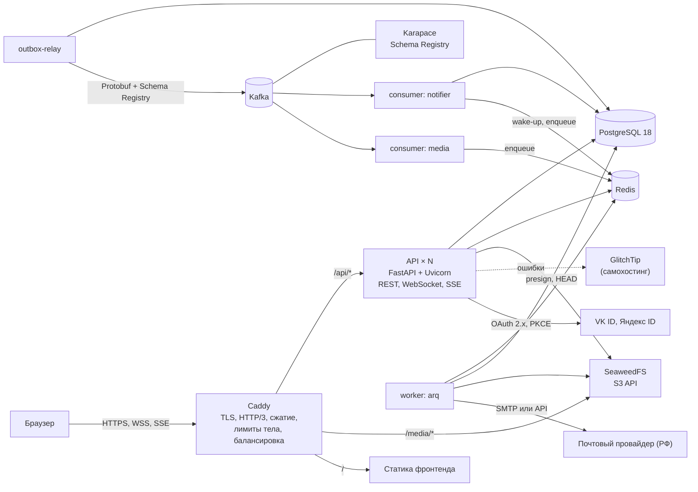

Принципы потоков:

- **Источник истины — PostgreSQL.** Kafka, Redis и очередь arq можно потерять без потери данных: события восстанавливаются из `platform.outbox`, клиенты догружают состояние по курсорам.
- **Два пути доставки.** Быстрый (best-effort): API после коммита публикует событие в Redis Pub/Sub, и подключённые клиенты получают его за миллисекунды. Надёжный (at-least-once): outbox → Kafka → потребители; он создаёт уведомления, письма, обработку медиа.
- **Команды и события разделены.** Kafka несёт факты («произошло»), arq исполняет работу («сделай»). Потребитель превращает событие в задачу, а не выполняет тяжёлое сам.
- ⚖️ **Все персональные данные остаются в РФ.** Каждый узел схемы, кроме браузера пользователя и провайдеров входа (VK ID и Яндекс ID — самостоятельные операторы), размещён на VPS в РФ или у российского провайдера. Исходящие соединения серверов разрешены только к почтовому провайдеру, VK ID, Яндекс ID и (при необходимости) healthchecks-пингам без ПДн; список закреплён в сетевых правилах Compose (4.20).

### 4.2. Модульный монолит

Один репозиторий, один образ, несколько процессов (API, worker, relay, потребители). Код разложен по ограниченным контекстам.

| Контекст | Ответственность |
|---|---|
| `identity` | аккаунты, учётные данные, сессии, OAuth, письменные токены |
| `profiles` | профили, настройки приватности |
| `social` | запросы в друзья, дружба, подписки, запросы на подписку, блокировки |
| `content` | посты, комментарии, реакции, упоминания, хэштеги, лента, поиск |
| `chat` | беседы, участники, сообщения, реакции, прочтение |
| `notifications` | уведомления, настройки писем |
| `media` | загрузки, обработка, варианты, квоты |
| `moderation` | жалобы, действия модераторов, аудит |
| `compliance` | ⚖️ версии юридических документов, реестр согласий, права субъекта (экспорт, удаление, обращения), сроки хранения, журнал уничтожения |
| `realtime` | WebSocket и SSE, tickets, присутствие, хаб соединений |
| `core` | БД и Unit of Work, outbox, ошибки, безопасность, пагинация, лимиты, логи, метрики |

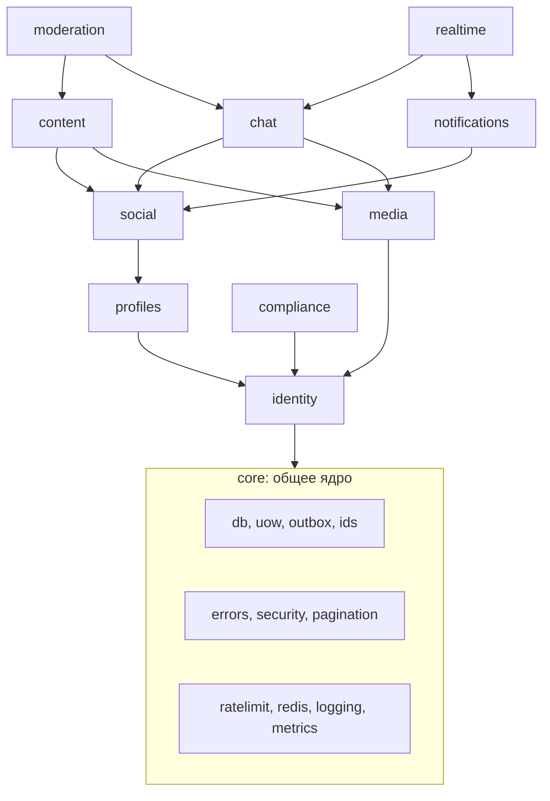

Стрелка означает «может импортировать». Правила:

1. Контексты обращаются друг к другу только через **публичный интерфейс** (`<context>/api_public.py`: функции запросов и порты) и **события**; модели и репозитории чужого контекста не импортируются.
2. Циклы запрещены; направление зависимостей проверяет `import-linter` в CI.
3. Базовые данные пользователя (`identity.users`) могут быть целью внешнего ключа из любого контекста; всё остальное связывается по идентификатору без обращения к чужим таблицам в обход публичного интерфейса.
4. Если нижнему контексту нужны данные верхнего, он не импортирует его, а определяет порт (`Protocol`) в своём `infra/ports.py`; реализацию подставляет корень приложения (`main.py`). Так `identity` создаёт профиль при регистрации и берёт разделы `MeUser` у `profiles` (S3), так же придут счётчики друзей, уведомлений и бесед (S7, S10, S14). Общие модели ответа, которые собирают несколько контекстов (`MeUser`), лежат в `core/me.py`.
5. ⚖️ Каждый контекст, хранящий персональные данные, реализует порт `PersonalDataProvider` (`describe()`, `export(user_id)`, `erase(user_id)`) и регистрирует его в `core.pd_registry`. Контекст `compliance` вызывает порты через реестр и не импортирует чужие модули. Тест в CI обходит `information_schema` и падает, если найдена таблица со столбцом `user_id` (или `*_user_id`), которую не объявил ни один провайдер: забыть новую таблицу при экспорте и удалении нельзя (4.20).

### 4.3. Слои: CQRS-lite, Unit of Work, outbox

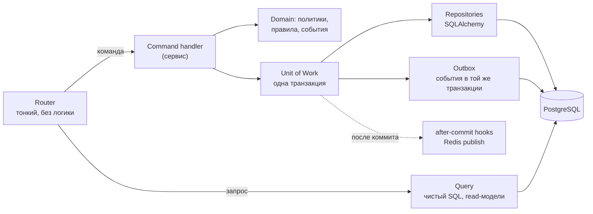

- **Команда** меняет состояние: принимает типизированный объект, проверяет политики, работает через `UnitOfWork`, добавляет события в outbox, возвращает идентификаторы или DTO. Один HTTP-запрос = одна команда = одна транзакция.
- **Запрос** читает: функция с явным SQL (SQLAlchemy Core или `text()`), возвращает замороженные Pydantic-модели. Ленты, списки бесед, поиск и счётчики пишутся именно так, а не через ORM-связи.
- **Unit of Work** владеет транзакцией: `async with uow:` открывает её, `await uow.commit()` фиксирует состояние **и** строки outbox атомарно, затем выполняет after-commit hooks (публикация в Redis). При откате hooks отбрасываются. Репозитории `commit()` не вызывают.
- **Политики** (`policies.py`) — чистые функции «может ли X видеть Y» и «может ли X сделать Z» с таблицей решений из 4.6. Их единственный источник правды используют и команды, и SQL-фильтры запросов.
- **Роутеры** только разбирают вход, вызывают обработчик и формируют ответ; никакого SQL и бизнес-правил.

### 4.4. Структура репозитория

```
messunjerr/
├── backend/
│   ├── pyproject.toml          зависимости, настройки ruff / pyright / import-linter
│   ├── uv.lock
│   ├── alembic.ini
│   ├── migrations/             ревизии Alembic (схемы, расширения, таблицы)
│   ├── proto/                  buf.yaml, buf.gen.yaml, messunjerr/events/v1/*.proto
│   ├── src/messunjerr/
│   │   ├── main.py             фабрика ASGI-приложения
│   │   ├── settings.py         pydantic-settings
│   │   ├── core/               db, uow, outbox, events, errors (problem+json), security,
│   │   │                       ids, pagination, ratelimit, idempotency, logging, metrics, redis,
│   │   │                       pd_registry (реестр провайдеров персональных данных)
│   │   ├── identity/           api/ commands/ queries/ domain/ infra/
│   │   ├── profiles/           (та же раскладка)
│   │   ├── social/
│   │   ├── content/
│   │   ├── chat/
│   │   ├── notifications/
│   │   ├── media/
│   │   ├── moderation/
│   │   ├── compliance/         согласия, документы, экспорт, удаление, обращения, сроки хранения
│   │   ├── realtime/           ws.py, sse.py, hub.py, tickets.py, presence.py
│   │   ├── jobs/               настройки arq, определения задач, cron
│   │   ├── consumers/          notifier.py, media.py (Kafka)
│   │   ├── relay/              outbox-ретранслятор
│   │   └── cli.py              create-admin, seed, outbox-stats, erasure-reapply, incident-report
│   └── tests/                  unit/ integration/ contract/ load/
├── deploy/                     compose.yml, compose.dev.yml, Caddyfile, env-шаблоны, backup/
├── frontend/                   (будет переписан)
└── docs/                       спецификации; legal/ — черновики политики и согласий (6.9.4)
```

Внутри контекста: `api/` (роутеры и схемы запросов-ответов), `commands/` (обработчики), `queries/` (чтение), `domain/` (политики, события, ошибки), `infra/` (репозитории, адаптеры). Команды и запросы не импортируют `api/`.

### 4.5. Модель данных

#### Схемы и общие правила

Одна база, по схеме на контекст: `identity`, `profile`, `social`, `content`, `chat`, `notify`, `media`, `moderation`, `compliance`, `platform`. Расширения: `citext`, `pg_trgm`, `unaccent`.

| Правило | Деталь |
|---|---|
| Идентификаторы | `uuid` с `DEFAULT uuidv7()` для сущностей; `bigint GENERATED ALWAYS AS IDENTITY` для `chat.messages`, `notify.notifications`, `platform.outbox` |
| Время | `timestamptz`, везде UTC, `DEFAULT now()` |
| Нормализация | `email` и `username` — `citext`, значения хранятся в нижнем регистре |
| Мягкое удаление | `deleted_at` у постов, комментариев, сообщений; запросы читают `WHERE deleted_at IS NULL` |
| Ограничения | `CHECK` на длины и перечисления прямо в БД, чтобы данные нельзя было испортить мимо приложения |
| Каскады | `ON DELETE CASCADE` от `identity.users` к личным данным; контент других людей каскадом не удаляется |

#### ER-диаграммы ключевых связей

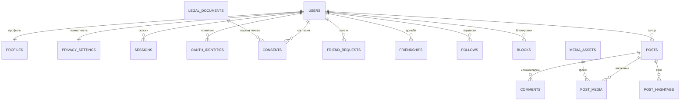

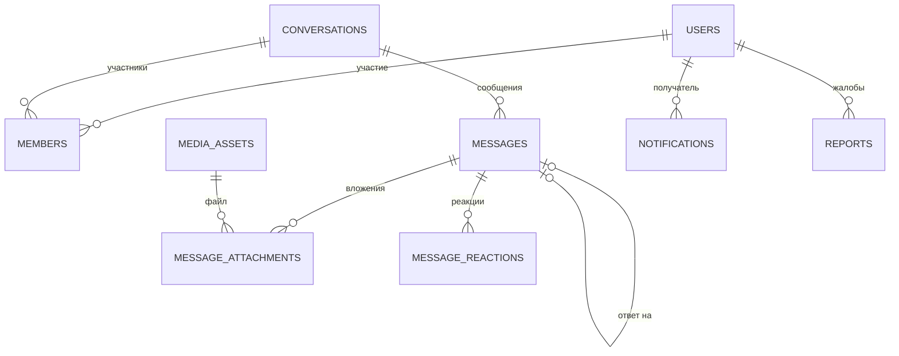

#### DDL: identity и profile

```sql
CREATE EXTENSION IF NOT EXISTS citext;
CREATE EXTENSION IF NOT EXISTS pg_trgm;
CREATE EXTENSION IF NOT EXISTS unaccent;
CREATE SCHEMA identity; CREATE SCHEMA profile; CREATE SCHEMA social; CREATE SCHEMA content;
CREATE SCHEMA chat; CREATE SCHEMA notify; CREATE SCHEMA media; CREATE SCHEMA moderation; CREATE SCHEMA compliance; CREATE SCHEMA platform;

CREATE TABLE identity.users (
    id                    uuid PRIMARY KEY DEFAULT uuidv7(),
    email                 citext NOT NULL UNIQUE,
    email_verified_at     timestamptz,
    username              citext NOT NULL UNIQUE
                          CHECK (username::text = lower(username::text) AND username::text ~ '^[a-z0-9_]{3,30}$'),
    username_changed_at   timestamptz,
    age_declared_at       timestamptz,                            -- ⚖️ подтверждение возраста (MIN_AGE), момент отметки
    password_hash         text,                                   -- NULL, если вход только через OAuth
    role                  text NOT NULL DEFAULT 'user' CHECK (role IN ('user','moderator','admin')),
    status                text NOT NULL DEFAULT 'pending'
                          CHECK (status IN ('pending','active','suspended','banned','deletion_pending')),
    suspended_until       timestamptz,
    deletion_scheduled_at timestamptz,
    last_login_at         timestamptz,
    created_at            timestamptz NOT NULL DEFAULT now(),
    updated_at            timestamptz NOT NULL DEFAULT now()
);

CREATE TABLE identity.oauth_identities (
    id               uuid PRIMARY KEY DEFAULT uuidv7(),
    user_id          uuid NOT NULL REFERENCES identity.users(id) ON DELETE CASCADE,
    provider         text NOT NULL CHECK (provider IN ('vk','yandex')),   -- ⚖️ только российские провайдеры (D20)
    provider_user_id text NOT NULL,
    email            citext,
    created_at       timestamptz NOT NULL DEFAULT now(),
    UNIQUE (provider, provider_user_id)
);

CREATE TABLE identity.sessions (
    id                  uuid PRIMARY KEY DEFAULT uuidv7(),
    user_id             uuid NOT NULL REFERENCES identity.users(id) ON DELETE CASCADE,
    refresh_hash        bytea NOT NULL UNIQUE,            -- SHA-256 текущего refresh-токена
    prev_refresh_hash   bytea,                            -- предыдущий: признак повторного использования
    rotated_at          timestamptz,
    created_at          timestamptz NOT NULL DEFAULT now(),
    last_seen_at        timestamptz NOT NULL DEFAULT now(),
    expires_at          timestamptz NOT NULL,             -- скользящий срок, 30 дней
    absolute_expires_at timestamptz NOT NULL,             -- предельный срок, 90 дней
    revoked_at          timestamptz,
    revoked_reason      text,        -- logout | logout_all | reuse_detected | password_changed | suspended | admin
    ip                  inet,
    user_agent          text,
    device_label        text
);
CREATE INDEX ix_sessions_user_active ON identity.sessions (user_id) WHERE revoked_at IS NULL;
CREATE INDEX ix_sessions_prev ON identity.sessions (prev_refresh_hash) WHERE prev_refresh_hash IS NOT NULL;

CREATE TABLE identity.email_tokens (
    id          uuid PRIMARY KEY DEFAULT uuidv7(),
    user_id     uuid NOT NULL REFERENCES identity.users(id) ON DELETE CASCADE,
    purpose     text NOT NULL CHECK (purpose IN ('verify_email','reset_password','change_email')),
    token_hash  bytea NOT NULL UNIQUE,
    new_email   citext,                                    -- для change_email
    expires_at  timestamptz NOT NULL,
    consumed_at timestamptz,
    created_at  timestamptz NOT NULL DEFAULT now()
);

CREATE TABLE identity.username_reservations (               -- прежний ник после смены (5.3): занят до reserved_until
    username       citext PRIMARY KEY,
    user_id        uuid NOT NULL REFERENCES identity.users(id) ON DELETE CASCADE,
    reserved_until timestamptz NOT NULL
);
CREATE INDEX ix_username_reservations_user_id ON identity.username_reservations (user_id);
CREATE INDEX ix_username_reservations_reserved_until ON identity.username_reservations (reserved_until);

CREATE TABLE profile.profiles (
    user_id               uuid PRIMARY KEY REFERENCES identity.users(id) ON DELETE CASCADE,
    display_name          text NOT NULL CHECK (char_length(display_name) BETWEEN 1 AND 50),
    bio                   text CHECK (char_length(bio) <= 500),
    links                 jsonb NOT NULL DEFAULT '[]'
                          CHECK (jsonb_typeof(links) = 'array' AND jsonb_array_length(links) <= 5),
    birth_date            date,
    birth_date_visibility text NOT NULL DEFAULT 'hidden' CHECK (birth_date_visibility IN ('hidden','day_month','full')),
    city                  text CHECK (char_length(city) <= 100),
    language              text CHECK (language ~ '^[a-z]{2,3}(-[A-Za-z0-9]{2,8})*$'),
    timezone              text,                            -- IANA, проверяется приложением
    is_private            boolean NOT NULL DEFAULT false,  -- закрытый профиль
    avatar_asset_id       uuid,                            -- FK на media.assets добавляется после её создания
    created_at            timestamptz NOT NULL DEFAULT now(),
    updated_at            timestamptz NOT NULL DEFAULT now()
);

CREATE TABLE profile.privacy_settings (
    user_id                  uuid PRIMARY KEY REFERENCES identity.users(id) ON DELETE CASCADE,
    dm_policy                text NOT NULL DEFAULT 'friends'  CHECK (dm_policy IN ('everyone','friends','nobody')),
    comment_policy           text NOT NULL DEFAULT 'everyone' CHECK (comment_policy IN ('everyone','friends','nobody')),
    mention_policy           text NOT NULL DEFAULT 'everyone' CHECK (mention_policy IN ('everyone','friends','nobody')),
    friends_list_visibility  text NOT NULL DEFAULT 'friends'  CHECK (friends_list_visibility IN ('everyone','friends','only_me')),
    followers_list_visibility text NOT NULL DEFAULT 'friends' CHECK (followers_list_visibility IN ('everyone','friends','only_me')),
    presence_visibility      text NOT NULL DEFAULT 'friends'  CHECK (presence_visibility IN ('everyone','friends','nobody')),
    default_post_visibility  text NOT NULL DEFAULT 'friends'  CHECK (default_post_visibility IN ('public','friends','private')),
    updated_at               timestamptz NOT NULL DEFAULT now()
);
```

#### DDL: social

```sql
CREATE TABLE social.friend_requests (
    id           uuid PRIMARY KEY DEFAULT uuidv7(),
    sender_id    uuid NOT NULL REFERENCES identity.users(id) ON DELETE CASCADE,
    receiver_id  uuid NOT NULL REFERENCES identity.users(id) ON DELETE CASCADE,
    status       text NOT NULL DEFAULT 'pending' CHECK (status IN ('pending','accepted','declined','cancelled')),
    created_at   timestamptz NOT NULL DEFAULT now(),
    responded_at timestamptz,
    CHECK (sender_id <> receiver_id)
);
-- не больше одной активной заявки на пару, в любом направлении
CREATE UNIQUE INDEX ux_friend_requests_pending ON social.friend_requests
    (LEAST(sender_id, receiver_id), GREATEST(sender_id, receiver_id)) WHERE status = 'pending';
CREATE INDEX ix_friend_requests_receiver ON social.friend_requests (receiver_id, created_at DESC) WHERE status = 'pending';

CREATE TABLE social.friendships (
    user_low_id  uuid NOT NULL REFERENCES identity.users(id) ON DELETE CASCADE,
    user_high_id uuid NOT NULL REFERENCES identity.users(id) ON DELETE CASCADE,
    created_at   timestamptz NOT NULL DEFAULT now(),
    PRIMARY KEY (user_low_id, user_high_id),
    CHECK (user_low_id < user_high_id)                      -- пара хранится один раз
);
CREATE INDEX ix_friendships_high ON social.friendships (user_high_id);

CREATE TABLE social.follows (
    follower_id uuid NOT NULL REFERENCES identity.users(id) ON DELETE CASCADE,
    followee_id uuid NOT NULL REFERENCES identity.users(id) ON DELETE CASCADE,
    created_at  timestamptz NOT NULL DEFAULT now(),
    PRIMARY KEY (follower_id, followee_id),
    CHECK (follower_id <> followee_id)
);
CREATE INDEX ix_follows_followee ON social.follows (followee_id, created_at DESC);

CREATE TABLE social.follow_requests (
    id           uuid PRIMARY KEY DEFAULT uuidv7(),
    follower_id  uuid NOT NULL REFERENCES identity.users(id) ON DELETE CASCADE,
    followee_id  uuid NOT NULL REFERENCES identity.users(id) ON DELETE CASCADE,
    status       text NOT NULL DEFAULT 'pending' CHECK (status IN ('pending','approved','declined','cancelled')),
    created_at   timestamptz NOT NULL DEFAULT now(),
    responded_at timestamptz,
    CHECK (follower_id <> followee_id)
);
CREATE UNIQUE INDEX ux_follow_requests_pending ON social.follow_requests (follower_id, followee_id) WHERE status = 'pending';
CREATE INDEX ix_follow_requests_followee ON social.follow_requests (followee_id, created_at DESC) WHERE status = 'pending';

CREATE TABLE social.blocks (
    blocker_id uuid NOT NULL REFERENCES identity.users(id) ON DELETE CASCADE,
    blocked_id uuid NOT NULL REFERENCES identity.users(id) ON DELETE CASCADE,
    created_at timestamptz NOT NULL DEFAULT now(),
    PRIMARY KEY (blocker_id, blocked_id),
    CHECK (blocker_id <> blocked_id)
);
CREATE INDEX ix_blocks_blocked ON social.blocks (blocked_id);
```

#### DDL: content

```sql
CREATE TABLE content.posts (
    id               uuid PRIMARY KEY DEFAULT uuidv7(),
    author_id        uuid NOT NULL REFERENCES identity.users(id) ON DELETE CASCADE,
    body             text NOT NULL CHECK (char_length(body) <= 5000),   -- пустое тело допустимо, если есть вложение
    visibility       text NOT NULL CHECK (visibility IN ('public','friends','private')),
    moderation_state text NOT NULL DEFAULT 'visible' CHECK (moderation_state IN ('visible','hidden')),
    comment_count    integer NOT NULL DEFAULT 0,
    reaction_count   integer NOT NULL DEFAULT 0,
    created_at       timestamptz NOT NULL DEFAULT now(),
    edited_at        timestamptz,
    deleted_at       timestamptz,
    search_tsv       tsvector GENERATED ALWAYS AS
                     (to_tsvector('russian', body) || to_tsvector('english', body)) STORED
);
CREATE INDEX ix_posts_author_created ON content.posts (author_id, created_at DESC, id DESC) WHERE deleted_at IS NULL;
CREATE INDEX ix_posts_search ON content.posts USING gin (search_tsv) WHERE deleted_at IS NULL;

CREATE TABLE content.post_media (
    post_id  uuid NOT NULL REFERENCES content.posts(id) ON DELETE CASCADE,
    asset_id uuid NOT NULL,                                   -- FK на media.assets
    position smallint NOT NULL CHECK (position BETWEEN 0 AND 9),
    PRIMARY KEY (post_id, asset_id)
);

CREATE TABLE content.comments (
    id               uuid PRIMARY KEY DEFAULT uuidv7(),
    post_id          uuid NOT NULL REFERENCES content.posts(id) ON DELETE CASCADE,
    parent_id        uuid REFERENCES content.comments(id) ON DELETE CASCADE,   -- только корневой комментарий
    author_id        uuid NOT NULL REFERENCES identity.users(id) ON DELETE CASCADE,
    body             text NOT NULL CHECK (char_length(body) <= 2000),
    moderation_state text NOT NULL DEFAULT 'visible' CHECK (moderation_state IN ('visible','hidden')),
    reply_count      integer NOT NULL DEFAULT 0,
    reaction_count   integer NOT NULL DEFAULT 0,
    created_at       timestamptz NOT NULL DEFAULT now(),
    edited_at        timestamptz,
    deleted_at       timestamptz
);
CREATE INDEX ix_comments_root ON content.comments (post_id, created_at, id) WHERE parent_id IS NULL;
CREATE INDEX ix_comments_replies ON content.comments (parent_id, created_at, id) WHERE parent_id IS NOT NULL;

CREATE TABLE content.reactions (                              -- посты и комментарии: одна реакция на человека
    target_type text NOT NULL CHECK (target_type IN ('post','comment')),
    target_id   uuid NOT NULL,
    user_id     uuid NOT NULL REFERENCES identity.users(id) ON DELETE CASCADE,
    emoji       text NOT NULL,
    created_at  timestamptz NOT NULL DEFAULT now(),
    PRIMARY KEY (target_type, target_id, user_id)
);
CREATE INDEX ix_reactions_target ON content.reactions (target_type, target_id, emoji);

CREATE TABLE content.mentions (
    source_type       text NOT NULL CHECK (source_type IN ('post','comment')),
    source_id         uuid NOT NULL,
    mentioned_user_id uuid NOT NULL REFERENCES identity.users(id) ON DELETE CASCADE,
    PRIMARY KEY (source_type, source_id, mentioned_user_id)
);
CREATE INDEX ix_mentions_user ON content.mentions (mentioned_user_id);

CREATE TABLE content.post_hashtags (
    post_id uuid NOT NULL REFERENCES content.posts(id) ON DELETE CASCADE,
    tag     text NOT NULL CHECK (tag = lower(tag) AND char_length(tag) BETWEEN 1 AND 50),
    PRIMARY KEY (post_id, tag)
);
CREATE INDEX ix_post_hashtags_tag ON content.post_hashtags (tag, post_id);
CREATE INDEX ix_post_hashtags_trgm ON content.post_hashtags USING gin (tag gin_trgm_ops);
```

#### DDL: chat

```sql
CREATE TABLE chat.conversations (
    id              uuid PRIMARY KEY DEFAULT uuidv7(),
    kind            text NOT NULL CHECK (kind IN ('direct','group')),
    title           text CHECK (char_length(title) BETWEEN 1 AND 100),
    avatar_asset_id uuid,
    direct_key      text UNIQUE,                         -- 'меньший_uuid:больший_uuid' только для direct
    created_by      uuid REFERENCES identity.users(id) ON DELETE SET NULL,
    last_message_id bigint,
    last_message_at timestamptz,
    created_at      timestamptz NOT NULL DEFAULT now(),
    updated_at      timestamptz NOT NULL DEFAULT now(),
    CHECK ((kind = 'direct' AND direct_key IS NOT NULL) OR (kind = 'group' AND direct_key IS NULL))
);

CREATE TABLE chat.members (
    conversation_id            uuid NOT NULL REFERENCES chat.conversations(id) ON DELETE CASCADE,
    user_id                    uuid NOT NULL REFERENCES identity.users(id) ON DELETE CASCADE,
    role                       text NOT NULL DEFAULT 'member' CHECK (role IN ('owner','admin','member')),
    joined_at                  timestamptz NOT NULL DEFAULT now(),
    left_at                    timestamptz,
    last_read_message_id       bigint NOT NULL DEFAULT 0,
    cleared_before_message_id  bigint NOT NULL DEFAULT 0,   -- «очистить историю у себя»
    PRIMARY KEY (conversation_id, user_id)
);
CREATE INDEX ix_members_user_active ON chat.members (user_id, conversation_id) WHERE left_at IS NULL;

CREATE TABLE chat.messages (
    id              bigint GENERATED ALWAYS AS IDENTITY PRIMARY KEY,
    conversation_id uuid NOT NULL REFERENCES chat.conversations(id) ON DELETE CASCADE,
    sender_id       uuid REFERENCES identity.users(id) ON DELETE SET NULL,
    client_msg_id   uuid NOT NULL,                        -- идемпотентность повторной отправки
    kind            text NOT NULL DEFAULT 'text' CHECK (kind IN ('text','system')),
    body            text CHECK (char_length(body) <= 4000),  -- обнуляется задачей после purge_body_at (сообщение удалено для всех)
    system_payload  jsonb,
    reply_to_id     bigint REFERENCES chat.messages(id) ON DELETE SET NULL,
    created_at      timestamptz NOT NULL DEFAULT now(),
    edited_at       timestamptz,
    deleted_at      timestamptz,
    purge_body_at   timestamptz,                          -- ⚖️ момент физического удаления текста: deleted_at + MESSAGE_DELETED_RETENTION_DAYS
    UNIQUE (conversation_id, sender_id, client_msg_id)
);
CREATE INDEX ix_messages_conversation ON chat.messages (conversation_id, id DESC);

CREATE TABLE chat.message_attachments (
    message_id bigint NOT NULL REFERENCES chat.messages(id) ON DELETE CASCADE,
    asset_id   uuid NOT NULL,
    position   smallint NOT NULL CHECK (position BETWEEN 0 AND 9),
    PRIMARY KEY (message_id, asset_id)
);

CREATE TABLE chat.message_reactions (                        -- у сообщений можно несколько разных эмодзи от одного человека
    message_id bigint NOT NULL REFERENCES chat.messages(id) ON DELETE CASCADE,
    user_id    uuid NOT NULL REFERENCES identity.users(id) ON DELETE CASCADE,
    emoji      text NOT NULL,
    created_at timestamptz NOT NULL DEFAULT now(),
    PRIMARY KEY (message_id, user_id, emoji)
);

CREATE TABLE chat.message_hidden (                           -- «удалить у себя»
    user_id    uuid NOT NULL REFERENCES identity.users(id) ON DELETE CASCADE,
    message_id bigint NOT NULL REFERENCES chat.messages(id) ON DELETE CASCADE,
    PRIMARY KEY (user_id, message_id)
);
```

#### DDL: notify, media, moderation, platform

```sql
CREATE TABLE notify.notifications (
    id          bigint GENERATED ALWAYS AS IDENTITY PRIMARY KEY,   -- он же Last-Event-ID в SSE
    user_id     uuid NOT NULL REFERENCES identity.users(id) ON DELETE CASCADE,
    type        text NOT NULL,
    actor_id    uuid REFERENCES identity.users(id) ON DELETE SET NULL,
    target_type text,
    target_id   text,
    data        jsonb NOT NULL DEFAULT '{}',
    dedup_key   text NOT NULL,
    created_at  timestamptz NOT NULL DEFAULT now(),
    read_at     timestamptz,
    UNIQUE (user_id, dedup_key)
);
CREATE INDEX ix_notifications_user ON notify.notifications (user_id, id DESC);
CREATE INDEX ix_notifications_unread ON notify.notifications (user_id) WHERE read_at IS NULL;

CREATE TABLE notify.settings (
    user_id       uuid PRIMARY KEY REFERENCES identity.users(id) ON DELETE CASCADE,
    email_types   jsonb NOT NULL DEFAULT '{}',               -- {"post.comment": true, ...}
    updated_at    timestamptz NOT NULL DEFAULT now()
);

CREATE TABLE media.assets (
    id                uuid PRIMARY KEY DEFAULT uuidv7(),
    owner_id          uuid NOT NULL REFERENCES identity.users(id) ON DELETE CASCADE,
    kind              text NOT NULL CHECK (kind IN ('image','file')),
    purpose           text NOT NULL CHECK (purpose IN ('avatar','group_avatar','post','message')),
    status            text NOT NULL DEFAULT 'pending'
                      CHECK (status IN ('pending','uploaded','processing','ready','rejected','deleted')),
    object_key        text NOT NULL UNIQUE,
    original_filename text,
    content_type      text,
    declared_size     bigint NOT NULL,
    size_bytes        bigint,
    sha256            bytea,
    width             integer,
    height            integer,
    variants          jsonb NOT NULL DEFAULT '{}',            -- {"thumb": "key", "medium": "key"}
    reject_reason     text,
    created_at        timestamptz NOT NULL DEFAULT now(),
    uploaded_at       timestamptz,
    processed_at      timestamptz
);
CREATE INDEX ix_assets_owner ON media.assets (owner_id, created_at DESC);
CREATE INDEX ix_assets_cleanup ON media.assets (created_at) WHERE status IN ('pending','uploaded');
ALTER TABLE profile.profiles ADD FOREIGN KEY (avatar_asset_id) REFERENCES media.assets(id) ON DELETE SET NULL;

CREATE TABLE moderation.reports (
    id             uuid PRIMARY KEY DEFAULT uuidv7(),
    reporter_id    uuid NOT NULL REFERENCES identity.users(id) ON DELETE CASCADE,
    target_type    text NOT NULL CHECK (target_type IN ('user','post','comment','message')),
    target_ref     text NOT NULL,                              -- идентификатор цели в текстовом виде
    target_user_id uuid REFERENCES identity.users(id) ON DELETE SET NULL,   -- автор / владелец цели
    reason         text NOT NULL CHECK (reason IN ('spam','harassment','hate','sexual','violence','illegal','other')),
    comment        text CHECK (char_length(comment) <= 1000),
    snapshot       jsonb NOT NULL DEFAULT '{}',                -- копия цели на момент жалобы; для сообщения: оно само и до 5 соседних. Модератор видит только снимок, а не всю переписку
    status         text NOT NULL DEFAULT 'open' CHECK (status IN ('open','in_review','resolved','dismissed')),
    resolved_by    uuid REFERENCES identity.users(id) ON DELETE SET NULL,
    resolved_at    timestamptz,
    resolution     text,
    created_at     timestamptz NOT NULL DEFAULT now()
);
CREATE INDEX ix_reports_queue ON moderation.reports (status, created_at);

CREATE TABLE moderation.actions (
    id           uuid PRIMARY KEY DEFAULT uuidv7(),
    moderator_id uuid NOT NULL REFERENCES identity.users(id),
    report_id    uuid REFERENCES moderation.reports(id) ON DELETE SET NULL,
    action       text NOT NULL CHECK (action IN ('hide_content','restore_content','warn_user','suspend_user','ban_user','unban_user')),
    target_type  text NOT NULL,
    target_ref   text NOT NULL,
    target_user_id uuid REFERENCES identity.users(id) ON DELETE SET NULL,
    reason       text NOT NULL,
    until        timestamptz,
    created_at   timestamptz NOT NULL DEFAULT now()
);

CREATE TABLE platform.outbox (
    id           bigint GENERATED ALWAYS AS IDENTITY PRIMARY KEY,
    event_id     uuid NOT NULL UNIQUE DEFAULT uuidv7(),
    topic        text NOT NULL,
    key          text NOT NULL,
    event_type   text NOT NULL,
    payload      jsonb NOT NULL,                              -- эквивалент Protobuf-сообщения; в Kafka уходит Protobuf
    headers      jsonb NOT NULL DEFAULT '{}',
    created_at   timestamptz NOT NULL DEFAULT now(),
    published_at timestamptz,
    attempts     integer NOT NULL DEFAULT 0
);
CREATE INDEX ix_outbox_unpublished ON platform.outbox (id) WHERE published_at IS NULL;

CREATE TABLE platform.inbox (                                 -- идемпотентность потребителей
    consumer     text NOT NULL,
    event_id     uuid NOT NULL,
    processed_at timestamptz NOT NULL DEFAULT now(),
    PRIMARY KEY (consumer, event_id)
);

CREATE TABLE platform.idempotency_keys (
    user_id         uuid NOT NULL,
    key             text NOT NULL,
    request_hash    bytea NOT NULL,
    response_status integer,
    response_body   jsonb,
    created_at      timestamptz NOT NULL DEFAULT now(),
    expires_at      timestamptz NOT NULL,
    PRIMARY KEY (user_id, key)
);

CREATE TABLE platform.audit_log (
    id          bigint GENERATED ALWAYS AS IDENTITY PRIMARY KEY,
    at          timestamptz NOT NULL DEFAULT now(),
    actor_id    uuid,
    action      text NOT NULL,
    target_type text,
    target_id   text,
    ip          inet,
    user_agent  text,
    data        jsonb NOT NULL DEFAULT '{}'
);
-- роль приложения: GRANT INSERT, SELECT ON platform.audit_log; UPDATE и DELETE не выдаются
```

#### DDL: compliance ⚖️

Схема отвечает за доказательства согласий, обращения субъектов, экспорт и журнал уничтожения (механизмы — в 4.20).

```sql
CREATE TABLE compliance.legal_documents (                        -- версии юридических текстов
    id           uuid PRIMARY KEY DEFAULT uuidv7(),
    slug         text NOT NULL CHECK (slug IN ('terms','privacy_policy','consent_processing','consent_dissemination')),
    version      text NOT NULL,                                   -- '2026-10-01'
    title        text NOT NULL,
    body_sha256  bytea NOT NULL,                                  -- хэш опубликованного текста (доказательство, что именно приняли)
    url          text NOT NULL,                                   -- страница с полным текстом
    is_material  boolean NOT NULL DEFAULT true,                   -- существенное изменение: нужно повторное согласие
    published_at timestamptz NOT NULL,
    effective_at timestamptz NOT NULL,
    UNIQUE (slug, version)
);

CREATE TABLE compliance.consents (                                -- журнал согласий; смена или отзыв = новая строка, старая помечается отозванной
    id           uuid PRIMARY KEY DEFAULT uuidv7(),
    user_id      uuid NOT NULL REFERENCES identity.users(id) ON DELETE CASCADE,
    purpose      text NOT NULL CHECK (purpose IN ('terms','processing','dissemination')),
    document_id  uuid NOT NULL REFERENCES compliance.legal_documents(id),
    scope        jsonb NOT NULL DEFAULT '{}',                     -- dissemination: {"categories": ["basic","about",...]}
    method       text NOT NULL CHECK (method IN ('registration','onboarding','settings','admin')),
    granted_at   timestamptz NOT NULL DEFAULT now(),
    withdrawn_at timestamptz,
    ip           inet,                                            -- обнуляется через IP_RETENTION_DAYS
    user_agent   text                                             -- обнуляется вместе с ip
);
CREATE UNIQUE INDEX ux_consents_active ON compliance.consents (user_id, purpose) WHERE withdrawn_at IS NULL;

CREATE TABLE compliance.subject_requests (                        -- журнал обращений субъектов ПДн (ст. 14, 20, 21)
    id             uuid PRIMARY KEY DEFAULT uuidv7(),
    user_id        uuid REFERENCES identity.users(id) ON DELETE SET NULL,   -- NULL, если заявитель не найден или вышел
    contact_email  citext NOT NULL,
    kind           text NOT NULL CHECK (kind IN ('access','rectification','erasure','withdraw_consent','stop_dissemination','objection','other')),
    details        text CHECK (char_length(details) <= 2000),
    channel        text NOT NULL CHECK (channel IN ('web_form','email','in_app','post')),
    status         text NOT NULL DEFAULT 'verifying'
                   CHECK (status IN ('verifying','received','in_progress','completed','rejected')),
    received_at    timestamptz,                                   -- с этого момента идёт срок
    due_at         timestamptz,                                   -- 10 рабочих дней (3 для stop_dissemination)
    extended_until timestamptz,                                   -- продление не более чем на 5 рабочих дней с уведомлением
    handled_by     uuid REFERENCES identity.users(id) ON DELETE SET NULL,
    completed_at   timestamptz,
    resolution     text,
    created_at     timestamptz NOT NULL DEFAULT now()
);
CREATE INDEX ix_subject_requests_open ON compliance.subject_requests (due_at) WHERE status IN ('received','in_progress');

CREATE TABLE compliance.data_exports (                            -- выгрузки данных пользователя
    id            uuid PRIMARY KEY DEFAULT uuidv7(),
    user_id       uuid NOT NULL REFERENCES identity.users(id) ON DELETE CASCADE,
    requested_by  uuid REFERENCES identity.users(id) ON DELETE SET NULL,   -- сам пользователь или администратор по обращению
    request_id    uuid REFERENCES compliance.subject_requests(id) ON DELETE SET NULL,
    status        text NOT NULL DEFAULT 'queued' CHECK (status IN ('queued','building','ready','failed','expired')),
    object_key    text,
    size_bytes    bigint,
    created_at    timestamptz NOT NULL DEFAULT now(),
    ready_at      timestamptz,
    expires_at    timestamptz,
    downloaded_at timestamptz
);

CREATE TABLE compliance.erasure_log (                             -- кто и когда уничтожен; без внешнего ключа: пользователя уже нет
    user_id       uuid PRIMARY KEY,
    reason        text NOT NULL CHECK (reason IN ('user_request','withdrawn_consent','admin')),
    requested_at  timestamptz NOT NULL,
    erased_at     timestamptz NOT NULL DEFAULT now(),
    consent_proof jsonb NOT NULL DEFAULT '[]'                     -- [{purpose, document_version, granted_at, withdrawn_at}], без ПДн
);
-- erasure_log нужен, чтобы после восстановления из резервной копии повторно уничтожить данные уже удалённых людей (cli erasure-reapply)
-- роль retention (4.16) получает UPDATE (ip, user_agent, body) и DELETE по просроченным записям; роль app изменять журналы не может
```

### 4.6. Права доступа и приватность

Одна точка решения: модуль `policies` каждого контекста. Команды вызывают политики напрямую, запросы выражают то же условие в SQL (общий фрагмент «предикат видимости поста» лежит в `content/queries/_visibility.py`). Ни один эндпоинт не пишет собственных проверок.

#### Состояние отношений между зрителем V и владельцем O

`self` · `friend` (есть строка в `friendships`) · `follower` (V подписан на O, подписка подтверждена) · `stranger` · `blocked` (любая из сторон заблокировала другую).

#### Кто видит пост

| Зритель | `public` | `friends` | `private` |
|---|:---:|:---:|:---:|
| автор (`self`) | ✔ | ✔ | ✔ |
| друг | ✔ | ✔ | — |
| подтверждённый подписчик | ✔ | — | — |
| посторонний, профиль автора **открыт** | ✔ | — | — |
| посторонний, профиль автора **закрыт** | — | — | — |
| заблокирован в любую сторону | — | — | — |

Скрытое модератором (`moderation_state = 'hidden'`) видят только автор и модераторы. Удалённое (`deleted_at`) не видит никто, кроме модераторов в контексте жалобы.

#### Правила действий

| Действие | Условия |
|---|---|
| Видеть профиль | нет блокировки. У закрытого профиля чужие (не друзья, не подписчики) видят только имя, ник, аватар, био и счётчики; посты, списки и дата рождения скрыты |
| Заявка в друзья | нет блокировки, не друзья, нет активной заявки, цель в статусе `active`. Встречная заявка автоматически принимается |
| Подписка | нет блокировки. Открытый профиль: подписка сразу. Закрытый: создаётся запрос, ответ владельца превращает его в подписку |
| Комментарий | пост виден зрителю **и** `comment_policy` автора поста разрешает (`everyone` / `friends` / `nobody`, сам автор поста комментирует всегда) |
| Реакция | пост или комментарий виден зрителю |
| Упоминание | `mention_policy` упоминаемого разрешает автору. Иначе текст остаётся обычным, но записи в `mentions` и уведомления нет |
| Личное сообщение | `dm_policy` получателя разрешает отправителя, нет блокировки. Существующая беседа остаётся читаемой, отправка при запрете блокируется (`dm_forbidden`) |
| Добавить в группу | инициатор `owner` или `admin`; добавляемый — друг инициатора 🧭, не заблокирован ни в одну сторону, `dm_policy` его допускает |
| Списки друзей и подписчиков | настройка владельца: `everyone` / `friends` / `only_me` (владелец всегда видит свои) |
| Статус «в сети» | настройка владельца `presence_visibility` |
| Править пост | автор. Удалять: автор; модератор и админ **скрывают** пост (`moderation_state = hidden`, 5.12) с причиной и записью в журнал |
| Удалять комментарий | автор комментария и автор поста; модератор и админ скрывают комментарий (5.12) |
| Управлять группой | `owner`: всё, включая роли и удаление; `admin`: название, аватар, добавление и удаление участников (кроме `owner`) |

#### Согласие на распространение и видимость полей профиля ⚖️

Поле профиля показывается другим пользователям, только если одновременно выполнены три условия: (1) категория поля входит в действующее согласие на распространение (`compliance.consents`, `purpose = 'dissemination'`, `scope.categories`); (2) настройки видимости владельца разрешают зрителю (таблицы выше); (3) владелец в статусе `active`. Остальное хранится, но другим не отдаётся; владелец видит перечень скрытых полей (`hidden_fields`) и может расширить согласие в настройках.

| Категория | Поля | Обязательна |
|---|---|:---:|
| `basic` | ник, отображаемое имя, аватар | да: без неё люди не смогут узнать друг друга |
| `about` | био, ссылки | нет |
| `city` | город | нет |
| `birth_date` | дата рождения в объёме из `birth_date_visibility` | нет |
| `locale` | язык и часовой пояс | нет |
| `activity` | присутствие «в сети» и время последнего визита | нет |
| `connections` | списки друзей, подписчиков и подписок, их счётчики | нет |

Круг получателей по условиям согласия ограничен зарегистрированными пользователями сервиса: анонимного доступа и индексации поисковиками нет (A12). Сужение набора категорий действует мгновенно (закон допускает до трёх рабочих дней), полный отзыв равнозначен удалению аккаунта (5.3). Тексты постов, комментариев и сообщений человек пишет сам; ответственность за чужие персональные данные в публикациях лежит на авторе по пользовательскому соглашению, а сервис обязан удалять такие публикации по жалобе (раздел о модерации).

#### Блокировка

«A блокирует B»: в одной транзакции удаляются дружба и подписки в обе стороны, отменяются активные заявки и запросы, пишется событие `UserBlocked`. Дальше B не видит A (404 на профиль и контент), не может писать A, упоминать A, находить A в поиске; взаимно не создаются уведомления. Личная беседа остаётся в истории, отправка в неё запрещена. Групповые беседы не затрагиваются.

#### Единое соглашение об ответах

Ресурс, о существовании которого зритель знать не должен (скрытый пост, профиль заблокировавшего), даёт **404**. Запрещённое действие над ресурсом, который зритель видит, даёт **403** с конкретным `code`.

### 4.7. Аутентификация и сессии

| Параметр | Значение |
|---|---|
| Access-токен | JWT, `alg = EdDSA`, заголовок `kid`, срок **10 минут**, хранится в памяти SPA (не в `localStorage`) |
| Claims | `iss`, `aud = messunjerr-api`, `sub` (id пользователя), `sid` (id сессии), `role`, `iat`, `exp`, `jti`, необязательный `scp` |
| Ограниченный токен ⚖️ | если у пользователя нет действующих согласий на актуальные версии документов (новый аккаунт после OAuth или вышла существенная редакция), access-токен выдаётся с `scp = "consent"`: разрешены только `GET /me`, `/legal/*`, `/me/consents*`, `POST /me/onboarding`, `/privacy/requests*`, `GET /me/privacy-requests`, `DELETE /me` (отказ принять условия равен удалению аккаунта) и `POST /auth/logout`; остальные ручки отвечают `403 consent_required` |
| Refresh-токен | 256 бит случайных данных, в БД только SHA-256; срок 30 дней скользящий, предел 90 дней |
| Cookie | `__Secure-mj_refresh`; `HttpOnly; Secure; SameSite=Strict; Path=/api/v1/auth` |
| Ключи подписи | пара Ed25519; публичная часть в JWKS `/.well-known/jwks.json`; ротация добавлением нового `kid` |
| Пароль | Argon2id (`pwdlib`), минимум 10 символов, максимум 128, проверка по списку частых паролей и на совпадение с логином или почтой |
| Отзыв | запись в таблице `sessions` + ключ `sess:revoked:{sid}` в Redis на 10 минут (время жизни access-токена) |

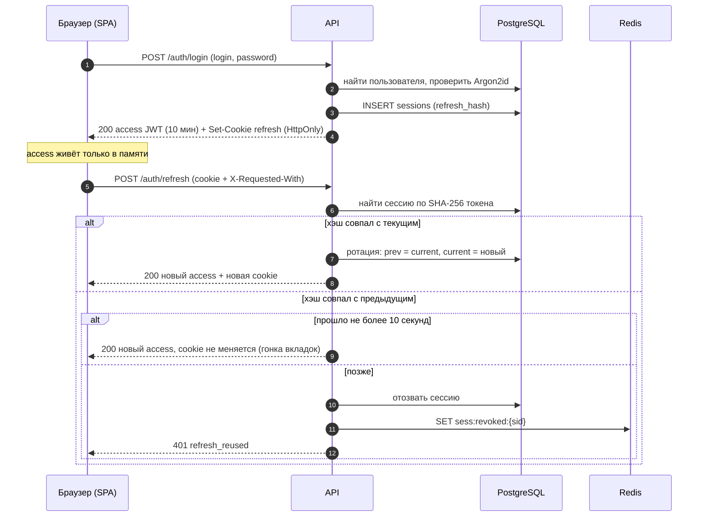

#### Алгоритм обновления

1. Из cookie берётся токен, считается `h = SHA-256(token)`.
2. `SELECT … FROM identity.sessions WHERE refresh_hash = h FOR UPDATE`. Если запись есть, не отозвана и сроки не истекли, выполняется **ротация**: `prev_refresh_hash ← refresh_hash`, `refresh_hash ← SHA-256(новый)`, `rotated_at ← now()`, `expires_at ← min(now()+30 дней, absolute_expires_at)`.
3. Если по `refresh_hash` ничего нет, ищем по `prev_refresh_hash`:
   - не прошло 10 секунд с `rotated_at`: это гонка двух вкладок. Выдаём **только новый access** (без `Set-Cookie`); браузер уже получил свежую cookie из первого ответа;
   - позже: токен украден или повторён. Сессия отзывается (`reuse_detected`), `sid` попадает в denylist, пишется запись в `audit_log`, пользователю уходит письмо о безопасности, ответ `401 refresh_reused`.
4. Не найдено нигде: `401 refresh_invalid`.

#### Защита от CSRF

Cookie с `SameSite=Strict` не отправляется со сторонних сайтов. Дополнительно `POST /auth/refresh` и `POST /auth/logout` требуют заголовок `X-Requested-With: messunjerr` и проверяют `Origin` (и `Sec-Fetch-Site`, если он есть): при несовпадении `403 csrf_failed`. Остальные ручки используют `Authorization: Bearer`, а не cookie, и CSRF-атаке не подвержены.

#### Что проверяет каждый запрос

Подпись, `exp`, `iss`, `aud`, отсутствие `sid` в denylist, ограничение `scp` (токен `consent` допускается только на ручки из списка выше). Статус пользователя и роль из БД **не** читаются на каждый запрос: блокировка и бан отзывают все сессии и кладут их `sid` в denylist, а изменение роли действует после обновления токена (до 10 минут); админские ручки и операции из списка ниже перечитывают пользователя из БД. Аккаунт, который ждёт удаления, пускают только на `GET /me`, `POST /me/restore` и выход (`403 account_deletion_pending` на остальном, 5.1). Его статус тоже не читается из БД на каждый запрос: `DELETE /me` ставит в Redis признак `acct:deletion:{user_id}` (срок чуть больше срока access-токена), его читает та же команда `MGET`, что и denylist, а вход и `refresh` аккаунта в этом статусе признак подтверждают и продлевают; `POST /me/restore` его снимает. Если Redis недоступен: общие ручки работают без проверки denylist и признака (с предупреждением в логах и метрикой), «чувствительные» (смена пароля и почты, удаление аккаунта, управление сессиями, модерация, админка) отвечают `503`.

#### Чувствительные операции

Смена пароля, смена почты, удаление аккаунта, запрос экспорта данных и «выйти везде» требуют повторного ввода пароля в теле запроса (аккаунты только с OAuth подтверждают действие письмом).

#### OAuth (VK ID, Яндекс ID) ⚖️

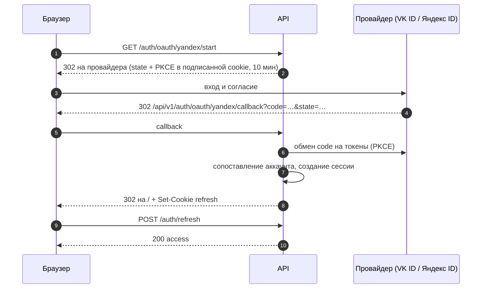

Правила сопоставления: (1) привязка `(provider, provider_user_id)` уже есть: вход; (2) привязки нет, но email совпал с **подтверждённым** локальным аккаунтом: автоматически **не** связываем (риск захвата), отвечаем `oauth_email_conflict`; пользователь входит паролем и привязывает провайдера из настроек; (3) локального аккаунта нет: создаём (email берётся у провайдера и считается подтверждённым только если провайдер так утверждает), ник генерируется из локальной части почты с числовым суффиксом, первая смена ника бесплатна. Токены доступа провайдера не сохраняются.

⚖️ **Онбординг после OAuth.** Вход через провайдера не заменяет согласий. Новый аккаунт создаётся в статусе `pending`, клиент получает ограниченный токен (`scp = "consent"`, см. таблицу выше) и должен пройти `POST /me/onboarding`: принять три документа, подтвердить возраст и при желании выбрать ник. Имя из профиля провайдера используется как значение по умолчанию, аватар не импортируется (сервер не ходит по чужим URL). Если провайдер не вернул email (у VK ID он необязателен и зависит от выбора пользователя), аккаунт не создаётся, ответ `oauth_email_required`, пользователю предлагают другой способ входа. Параметры эндпоинтов провайдеров (адреса, области доступа, поле `device_id` у VK ID) ⚠️ сверяются с их документацией на этапе 1: у Яндекс ID авторизация идёт по адресам `oauth.yandex.ru/authorize` и `oauth.yandex.ru/token`, области `login:info`, `login:email`, поддерживается PKCE.

#### Письменные токены

| Назначение | Срок | Правила |
|---|---|---|
| подтверждение почты | 24 часа | одноразовый; повторная отправка с лимитом |
| сброс пароля | 1 час | одноразовый; после использования отзываются все сессии |
| смена почты | 1 час | отправляется на новый адрес; старый получает уведомление |

Ответы ручек «забыли пароль» и «повторить подтверждение» всегда одинаковы, независимо от существования адреса.

### 4.8. События: outbox → Kafka → потребители

#### Принципы

- Событие описывает **факт, который уже произошёл**, и содержит идентификаторы и минимум данных; полные объекты потребитель читает из БД. Тексты сообщений и постов в события не попадают. ⚖️ Email, имена, IP и прочие персональные данные тоже: в событиях только идентификаторы и перечисления. Это не вкусовщина, а условие удаления: записи из журнала Kafka выборочно стереть нельзя, поэтому при уничтожении данных человека топики трогать не приходится.
- Событие пишется в `platform.outbox` **в той же транзакции**, что и изменение состояния. Публикация в Kafka происходит отдельным процессом: атомарность без распределённых транзакций.
- Доставка **at-least-once**: потребители идемпотентны (таблица `platform.inbox` или естественная уникальность результата).

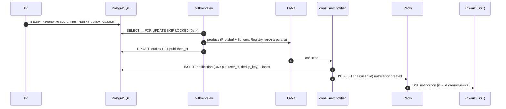

#### Топики

Префикс `mj.`, суффикс `.v1` — версия топика (несовместимое изменение = новый топик). Один «конверт» на топик, внутри `oneof payload` по типам событий.

| Топик | Ключ | Партиций | Хранение | События |
|---|---|:---:|:---:|---|
| `mj.identity.user.v1` | `user_id` | 3 | 30 дней | `UserRegistered`, `EmailVerified`, `PasswordChanged`, `UserSuspended`, `UserBanned`, `UserUnbanned`, `UserDeletionRequested`, `UserDeleted`, ⚖️ `ConsentGranted`, `ConsentWithdrawn`, `DataExportRequested` |
| `mj.social.graph.v1` | `меньший_id:больший_id` | 3 | 7 дней | `FriendRequestSent`, `FriendRequestResponded`, `FriendshipRemoved`, `FollowCreated`, `FollowRequested`, `FollowRequestResponded`, `FollowRemoved`, `UserBlocked`, `UserUnblocked` |
| `mj.content.v1` | `post_id` | 6 | 7 дней | `PostCreated`, `PostUpdated`, `PostDeleted`, `CommentCreated`, `CommentDeleted`, `ReactionSet`, `ReactionRemoved` |
| `mj.chat.v1` | `conversation_id` | 6 | 7 дней | `ConversationCreated`, `MemberAdded`, `MemberRemoved`, `MessageCreated`, `MessageEdited`, `MessageDeleted` |
| `mj.media.v1` | `asset_id` | 3 | 7 дней | `AssetUploaded`, `AssetProcessed`, `AssetRejected`, `AssetDeleted` |
| `mj.moderation.v1` | `target_user_id` | 3 | 30 дней | `ReportCreated`, `ContentHidden`, `ContentRestored`, `UserWarned` |
| `<топик>.dlq` | исходный ключ | 1 | 30 дней | сообщения, не обработанные за N попыток; в заголовках причина и число попыток |

Прочтение, ввод, «печатает…» и presence в Kafka **не** попадают: они эфемерны или слишком частые и живут в Redis и PostgreSQL.

#### Схемы

- Источник — `.proto` в `backend/proto/`. `buf lint` и `buf breaking --against '.git#branch=main'` в CI: нельзя удалять и переиспользовать номера полей, поля только добавляются, удалённые номера помечаются `reserved`.
- Реестр: Karapace, subject `<топик>-value` (TopicNameStrategy), совместимость `BACKWARD_TRANSITIVE`. Сериализация в формате Confluent: магический байт `0`, четыре байта идентификатора схемы, индексы сообщения, затем Protobuf.
- Python-классы генерирует `buf generate`; сгенерированный код не правится вручную. Образец конверта — в приложении 6.4.

#### Ретранслятор (outbox-relay)

Один активный экземпляр (перед стартом берёт `pg_try_advisory_lock`, второй экземпляр простаивает): единственный публикатор сохраняет порядок событий одного ключа. Цикл: читает до 500 строк `WHERE published_at IS NULL ORDER BY id FOR UPDATE SKIP LOCKED`, сериализует в Protobuf через реестр, отправляет идемпотентным продюсером (`acks=all`, `enable_idempotence=True`, сжатие `zstd`), помечает `published_at`. Просыпается по `LISTEN outbox_new` (триггер вызывает `pg_notify`) и по таймеру 500 мс. При недоступности Kafka строки накапливаются; метрика `outbox_oldest_unpublished_age_seconds` сигнализирует о заторе. Опубликованные строки удаляет почасовая задача спустя 7 дней.

⚠️ При переходе на Debezium (чтение WAL вместо опроса) схема таблицы остаётся прежней; это путь роста, а не требование сейчас.

#### Потребители

| Потребитель (`group.id`) | Читает | Делает |
|---|---|---|
| `mj.notifier.v1` | `social.graph`, `content`, `chat`, `moderation` | создаёт строки `notifications` (идемпотентно по `dedup_key`), публикует в Redis `chan:user:{id}` для SSE, ставит в arq письма согласно настройкам |
| `mj.media.v1` | `media` | по `AssetUploaded` ставит в arq `process_media`; по `AssetProcessed` и `AssetRejected` публикует SSE-событие `media.ready` |

Общие настройки: ручная фиксация смещений после успешной обработки (`enable_auto_commit=False`), `auto_offset_reset=earliest`, `max_poll_records=200`. Алгоритм обработки: десериализация → проверка `inbox` → транзакция с побочным эффектом и записью в `inbox` → фиксация смещения. Ошибка: три повтора с задержкой 1 с, 5 с, 30 с, затем в `.dlq` и дальше без блокировки партиции. Отдельный CLI (`cli dlq-replay`) возвращает сообщения из DLQ после исправления причины.

Порядок гарантируется внутри ключа (одной беседы, одного поста, одной пары людей); между ключами порядка нет, и код его не предполагает.

### 4.9. Реальное время

#### Каналы

| Канал | Для чего | Аутентификация | Что передаёт |
|---|---|---|---|
| **WebSocket** `/api/v1/ws` | чат | одноразовый ticket в query | события сообщений, беседы, прочтение, «печатает…»; от клиента: `typing.*`, `read.mark`, `ping` |
| **SSE** `/api/v1/events` | уведомления и presence | одноразовый ticket в query | уведомления, счётчики, присутствие друзей, `media.ready`, `session.revoked` |
| **REST** | все команды | `Authorization: Bearer` | отправка, правка, удаление, реакции, прочтение |

Ticket: `POST /api/v1/realtime/tickets` возвращает непрозрачную строку; в Redis живёт 30 секунд под ключом `ticket:{sha256}` вместе с `user_id`, `sid` и типом канала; при подключении читается и удаляется одной командой `GETDEL`. Параметр `ticket` вырезается из access-логов Caddy.

#### Быстрый и надёжный пути для сообщения

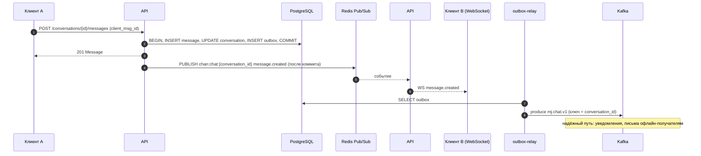

Быстрый путь best-effort: если публикация в Redis потеряна, сообщение всё равно в БД, а клиент докачивает по курсору (`after_id`).

#### Масштабирование между инстансами

Каждый API-инстанс держит одно подключение к Redis и подписывается на каналы лениво: на `chan:chat:{id}`, пока у него есть хотя бы одно WS-подключение участника этой беседы; на `chan:user:{id}`, пока есть SSE или WS этого пользователя. Внешнего состояния о том, «кто к какому инстансу подключён», нет: сообщение публикуется в канал, а подписанные инстансы сами раздают его локальным соединениям.

#### Presence

Клиент в WS и SSE шлёт heartbeat; сервер обновляет `ZADD presence:last_seen {now} {user_id}` и, если пользователь был офлайн, публикует `presence.updated {online: true}`. Фоновая подметалка (в `relay`, под тем же advisory-локом) раз в 15 секунд находит тех, у кого `last_seen` старше 45 секунд, помечает офлайн и публикует событие. Кому доставлять, определяет `presence_visibility`: получатели события фильтруются по дружбе и настройке при рассылке; запрос состояния друзей делается одним `ZMSCORE`.

#### Обратное давление и пределы

| Параметр | Значение |
|---|---|
| WebSocket на пользователя | не более 10 одновременных |
| SSE-потоков на пользователя | не более 5 |
| Размер входящего WS-кадра | 16 КБ |
| Входящие кадры | 20 в секунду на соединение (token bucket, всплеск 40) |
| Очередь исходящих кадров | 256 кадров или 1 МБ на соединение; переполнение = закрытие `4013 slow_consumer` |
| Heartbeat | сервер шлёт ping каждые 25 с; нет pong 60 с = закрытие `4008` |
| Автоподписка на беседы | все активные беседы пользователя, не более 500 последних |
| Соединений на инстанс | потолок 5 000, предупреждение при 3 500 |
| При выкладке | сервер закрывает соединения кодом `1001`, клиент переподключается с джиттером |

Медленного клиента не буферизуем бесконечно: его отключают, а пропущенное он забирает из PostgreSQL по курсору. Редис хранит только эфемерное.

#### Переподключение

Клиент получает новый ticket → подключается → запрашивает `GET /conversations` (счётчики и последние сообщения) и для открытых бесед `GET /conversations/{id}/messages?after_id=<последний известный>`. SSE дополнительно присылает `Last-Event-ID`: сервер отдаёт уведомления с большим `id` из таблицы, затем переходит на живой поток.

### 4.10. Лента, поиск, хэштеги, упоминания

#### Лента

Хронологическая, fan-out on read: одним SQL-запросом выбираются посты самого пользователя, его друзей (`public` и `friends`) и тех, на кого он подписан (`public`), с исключением блокировок и скрытого. Keyset-пагинация по `(created_at, id)`; индекс `ix_posts_author_created` обслуживает выборку по автору. Полный запрос — в приложении 6.5. При 5 000 пользователей и сотнях связей на человека запрос укладывается в десятки миллисекунд.

Путь эволюции, если лента станет узким местом: (1) кэш первой страницы в Redis на 15 секунд; (2) таблица `timeline_entries`, которую пополняет потребитель `mj.content.v1` (fan-out on write) с ограничением на число записей на пользователя; (3) отдельный сервис ленты.

#### Хэштеги

Извлекаются при создании и правке по шаблону `#[\p{L}\p{N}_]{1,50}`; значение нормализуется (`NFKC`, `casefold`) и хранится в `post_hashtags`. Для поиска и подсказок используется префиксный поиск и GIN-индекс `gin_trgm_ops`. Актуальные теги за последние 24 часа считает задача `trending_hashtags` раз в 5 минут в ZSET Redis (только по видимым публичным постам открытых профилей).

#### Упоминания

Шаблон `@[a-z0-9_]{3,30}` на границах слов; сопоставляется с существующими активными пользователями; применяется `mention_policy` упоминаемого. Результат в `content.mentions`, уведомление создаёт потребитель.

#### Поиск

| Что ищем | Как | Фильтр |
|---|---|---|
| Люди | точное и префиксное совпадение `username`, затем `similarity()` по `username` и `display_name` на `pg_trgm`; ранжирование: точное > префикс > сходство | нет блокировок, статус `active` |
| Посты | `websearch_to_tsquery('russian', q) OR websearch_to_tsquery('english', q)` по `search_tsv`, `ts_rank_cd`, `ts_headline` для фрагментов | тот же предикат видимости, что и у ленты |
| Хэштеги | префикс по `post_hashtags.tag`, количество видимых постов | только публичные посты открытых профилей |

Лимиты поиска жёстче обычных (5.1). Пагинация поиска — по смещению и рангу с потолком в 200 результатов, глубокого листания нет.

### 4.11. Медиа

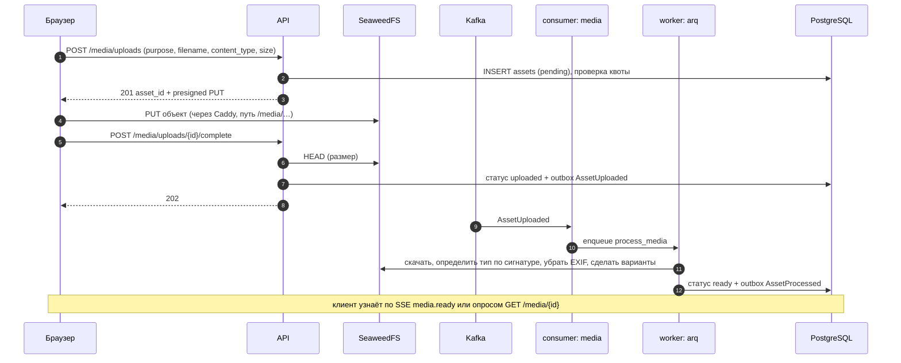

| Назначение | Допустимо | Лимит | Варианты |
|---|---|---|---|
| `avatar`, `group_avatar` | JPEG, PNG, WebP | 5 МБ | 64 и 256 px, WebP |
| `post`, `message`: изображение | JPEG, PNG, WebP, GIF (как файл без обработки анимации) | 10 МБ | 320 и 1280 px по длинной стороне, WebP |
| `post`, `message`: файл | любые, кроме запрещённых расширений (`exe`, `bat`, `cmd`, `scr`, `msi`, `ps1`, `js`, `vbs`, `jar`, `apk`) | 25 МБ | нет |

- **Тип определяется по содержимому** (сигнатура + Pillow), не по заявленному `content_type` и не по расширению. SVG и HTML отклоняются.
- **Изображения перекодируются**: EXIF удаляется, применяется ориентация, ограничение 25 мегапикселей и защита от «бомб распаковки».
- **Файлы** хранятся как есть, отдаются с `Content-Disposition: attachment`, `X-Content-Type-Options: nosniff`, имя файла очищается. В хранилище они лежат с типом `application/octet-stream`, какой бы тип ни заявил клиент (иначе хранилище отдало бы загруженное как `text/html` или SVG): заявленный тип остаётся в карточке, а подпись ссылки закрепляет именно `application/octet-stream`. Исполняемые файлы (PE, ELF, Mach-O, класс Java) отклоняются по содержимому: `forbidden_type`.
- **Квота** 1 ГБ на пользователя по сумме `size_bytes` готовых ресурсов **плюс заявленный размер идущих загрузок** (`pending`, `uploaded`, `processing`): иначе параллельные заявки обошли бы предел. Заявка и подсчёт идут под блокировкой владельца (`pg_advisory_xact_lock`), так что две одновременные заявки не пройдут в одну и ту же свободную дыру. Превышение: `quota_exceeded`. Место освобождают удаление, отклонение и очистка незавершённой загрузки.
- **Доступ:** публичны только аватары (стабильные адреса вида `/media/public/avatars/{asset_id}/{size}.webp`, непредсказуемые идентификаторы). Остальные ссылки — presigned GET на 10 минут, которые API подставляет в ответы и пересоздаёт при каждой выдаче; в ответе есть `url_expires_at`.
- **Очистка:** загрузки в `pending` старше 24 часов от заявки, а в `uploaded` и `processing` старше 24 часов от завершения загрузки (`PENDING_UPLOAD_TTL_HOURS`; файл, который ждёт упавший воркер, не пропадает через сутки после заявки) и неприкреплённые `ready` старше 48 часов удаляет почасовая задача; при удалении поста, сообщения или аккаунта объекты удаляются отдельной задачей. Неприкреплённые `ready` задача начнёт чистить вместе с первыми привязками (аватар S6, вложения S11 и S14): пока знать, прикреплён ли ресурс, нечем.
- **Запись один раз (S5).** В подпись ссылки входит условие `If-None-Match: *` (заголовок есть в `upload.headers`): объект создаётся один раз, второй `PUT` по той же ссылке получает `412 PreconditionFailed` (проверено на SeaweedFS 4.47, в том числе через Caddy). Без него клиент мог бы подменить файл после проверки (размер смотрит `complete`, сигнатуру `process_media`): положить другое содержимое того же размера, пока ссылка жива. Условие подписано, поэтому убрать заголовок нельзя (`403`). Клиенту, у которого повтор `PUT` получил `412`, остаётся вызвать `complete`: файл уже на месте.
- **Окно ссылки при удалении (S5).** Условная запись не мешает создать объект заново, когда прежний уже удалён: клиент, не потерявший ссылку, может положить файл после `DELETE /media/{id}` или отказа, и такой объект не учтён ни в какой квоте. Поэтому `delete_media_objects` убирает объекты сразу, а отметку `objects_deleted_at` ставит, только когда ссылка заведомо протухла (`UPLOAD_URL_TTL_SECONDS` и минута запаса от создания заявки); до тех пор `reconcile_uploads` повторяет удаление каждые 5 минут. Для ресурсов старше этого срока (очистка незавершённых, поздние удаления) хватает одного прохода. Объект, который всё же появился позже (`PUT` с медленным телом, начатый до истечения ссылки, дописался после зачистки; удаление аккаунта каскадом убрало строки), убирает **суточная сверка** `sweep_orphan_objects` (4.12): она листает префикс `uploads/` и удаляет объекты старше часа, у которых нет живого ресурса. За запуск удаляется не больше 500 объектов: ошибка настройки (БД не та, что у хранилища) не должна стереть всё разом.
- **Неподписанные заголовки (S5).** SeaweedFS отклоняет неподписанные `X-Amz-*` (`X-Amz-Copy-Source`, `X-Amz-Acl`, `X-Amz-Meta-*`: `403`), но принимает неподписанные `Content-Encoding`, `Content-Disposition`, `Cache-Control`, `Expires`, `Content-Language`, сохраняет их как метаданные объекта и отдаёт при чтении (проверено): загруженный файл мог бы сам объявить себя сжатым и стать «бомбой» распаковки для того, кто его скачивает. Поэтому Caddy срезает эти пять заголовков у `PUT` под `/media/uploads/*` (браузер их не шлёт, подпись их не закрепляет), а выдача файлов (S6, S14) обязана задавать заголовки ответа сама (`ResponseContentType`, `ResponseContentDisposition`, `ResponseCacheControl`) и не полагаться на сохранённые метаданные.
- **Состояние объектов и временная схема до Kafka (S5).** Строки `deleted` и `rejected` хранят отметку `objects_deleted_at`: пока её нет, объекты ещё лежат в хранилище. Задачи `process_media` и `delete_media_objects` ставятся напрямую после коммита, а `reconcile_uploads` (каждые 5 минут) подбирает те, что потерялись при сбое Redis или смерти воркера: загрузки в `uploaded` и `processing`, до которых обработка не дошла, и строки с неубранными объектами. Недоступное хранилище файл не отклоняет и не стирает: после последней попытки задача сдаётся, ресурс остаётся в `processing`, сверка повторяет обработку, а через сутки очистка удаляет застрявшую загрузку; `processing_failed` ставится, только когда объекта в хранилище нет. События `AssetUploaded`, `AssetProcessed`, `AssetRejected`, `AssetDeleted` пишутся в outbox уже сейчас (без имени файла), ретранслятор и потребители придут в S9–S10.
- **Обработка в S5 (заглушка).** `process_media` читает первые 4 КиБ объекта и решает по сигнатуре: JPEG, PNG, WebP, GIF принимаются (GIF не для аватара), SVG, HTML и неопознанное под видом изображения дают `not_an_image`, BMP, TIFF, HEIC и подобные `unsupported_format`, исполняемые файлы `forbidden_type`; тип записывается по содержимому. Перекодирование, EXIF, варианты, лимит мегапикселей и защита от «бомб» добавит S6; ресурсы, прошедшие заглушку, S6 перегонит (у них `variants = {}`).
- **Таблица `media.assets`** отличается от DDL в 4.5: индекс `ix_assets_owner` без `DESC` (PostgreSQL читает его и назад), столбцы `deleted_at` и `objects_deleted_at`, индексы `ix_assets_reconcile` и `ix_assets_objects_pending` для плановых задач; внешний ключ `profile.profiles.avatar_asset_id` создаёт та же миграция 0004.
- ⚖️ **Метаданные изображений:** EXIF, включая геометки и модель устройства, удаляется всегда: это персональные данные, которые человек не собирался публиковать.
- ⚖️ **Выгрузка данных пользователя** (4.20) лежит в том же bucket под непубличным префиксом `exports/{user_id}/{export_id}.zip`, отдаётся presigned-ссылкой на 24 часа и удаляется через `DATA_EXPORT_TTL_DAYS` (по умолчанию 7).
- ⚠️ **Подпись SigV4 включает путь и заголовок `Host`**, поэтому Caddy проксирует `/media/*` в SeaweedFS **без переписывания пути**, а bucket называется `media` (path-style адресация на том же домене). ✅ Подтверждено спайком S4-05 (итоги S4, п. 1 плана спринтов): подпись проходит через Caddy из браузера, в presigned PUT подписываются `Content-Type` и `Content-Length` (тип и точный размер закрепляются подписью; с S5 ещё и `If-None-Match: *`, запись один раз), анонимно читается только `public/`, флаг SeaweedFS `-s3.externalUrl` не нужен.

### 4.12. Фоновые задачи (arq)

Каждая задача идемпотентна и имеет детерминированный `job_id`, чтобы повторная постановка не создавала дубль. Очереди: `email`, `media`, `default`. Cron-задачи запускает ровно один процесс (`worker --role cron`).

| Задача | Запуск | Очередь | Повторы | Назначение |
|---|---|---|---|---|
| `send_email` | по событию | `email` | 5, экспонента от 30 с | письма подтверждения, сброса, уведомления безопасности, уведомления пользователю |
| `process_media` | по `AssetUploaded` (до Kafka напрямую после коммита) | `media` | 3, пауза 30 и 60 с, тайм-аут 120 с | сигнатура, EXIF, варианты, статус; `processing_failed` только если объекта нет, при недоступном хранилище задача после последней попытки сдаётся, ресурс остаётся в `processing`, его повторяет `reconcile_uploads` |
| `delete_media_objects` | по событиям удаления | `media` | 5, пауза от 30 с, тайм-аут 120 с | удаление объектов из хранилища; строку закрывает отметкой, когда протухла ссылка на загрузку (4.11) |
| `cleanup_pending_uploads` | cron, каждый час | `default` | — | незавершённые и неприкреплённые загрузки |
| `reconcile_uploads` | cron, каждые 5 минут | `default` | — | 🧱 временно, до Kafka: заново ставит потерянные `process_media` и `delete_media_objects` (детерминированный `job_id`, дублей нет) |
| `sweep_orphan_objects` | cron, 04:20 UTC | `default` | — | объекты `uploads/` без живого ресурса (старше часа, не больше 500 за запуск); воркеру `default` для этого нужен доступ к хранилищу |
| `cleanup_sessions` | cron, раз в сутки | `default` | — | истёкшие и давно отозванные сессии (>30 дней) |
| `cleanup_tokens_and_idempotency` | cron, каждый час | `default` | — | просроченные письменные токены и ключи идемпотентности |
| `outbox_housekeeping` | cron, каждый час | `default` | — | удаление опубликованных строк старше 7 дней |
| `unsuspend_expired` | cron, каждые 5 минут | `default` | — | возврат аккаунтов после срока приостановки |
| `purge_deleted_accounts` | cron, раз в сутки | `default` | — | ⚖️ окончательное удаление аккаунтов после льготного срока (14 дней): вызывает `erase(user_id)` у каждого провайдера ПДн и пишет `erasure_log` (4.20) |
| `trending_hashtags` | cron, каждые 5 минут | `default` | — | пересчёт популярных тегов в Redis |
| `digest_unread_chat_email` | отложенно, +15 минут | `email` | 3 | письмо о непрочитанных сообщениях офлайн-адресату (этап 8, по желанию) |
| `build_data_export` | по `DataExportRequested` | `default` | 3, тайм-аут 600 с | ⚖️ сборка архива данных пользователя, письмо и SSE-событие о готовности |
| `cleanup_data_exports` | cron, каждый час | `default` | — | ⚖️ удаление просроченных выгрузок |
| `scrub_expired_pii` | cron, раз в сутки | `default` | — | ⚖️ обнуление `ip` и `user_agent` старше `IP_RETENTION_DAYS` (сессии, согласия, аудит), удаление записей по срокам хранения (уведомления, закрытые жалобы, устаревшие записи журнала уничтожения); работает под ролью `retention` |
| `purge_deleted_message_bodies` | cron, каждые 15 минут | `default` | — | ⚖️ обнуление `body` и удаление вложений у сообщений, у которых наступил `purge_body_at` |
| `check_subject_requests` | cron, раз в сутки | `default` | — | ⚖️ напоминание администраторам об обращениях субъектов, срок по которым истекает через 3 рабочих дня |

⚠️ **arq в режиме «только исправления»** (по README проекта). Для нашей нагрузки этого достаточно, но риск закрывается заранее: приложение работает через порт `JobQueue` (`enqueue`, `enqueue_in`, `cron`), реализацию на arq можно заменить на Taskiq или Procrastinate (очередь внутри PostgreSQL, транзакционная постановка) без изменения кода команд.

---

### 4.13. Redis: роли и ключи

Redis хранит только эфемерное и очередь arq. Настройки: `appendonly yes`, `appendfsync everysec`, `maxmemory-policy noeviction`, пароль и доступ только из внутренней сети Compose.

| Ключ или канал | Тип | Срок | Назначение |
|---|---|---|---|
| `rl:{бакет}:{субъект}` | hash (Lua, token bucket) | окно бакета | лимиты запросов |
| `ticket:{sha256}` | hash | 30 с, одноразовый | вход в WS и SSE |
| `sess:revoked:{sid}` | string | 10 мин | отозванные сессии (denylist access-токенов) |
| `acct:deletion:{user_id}` | string | срок токена + 5 мин, продлевается входом и `refresh` | аккаунт ждёт удаления: допускаются только `GET /me`, `POST /me/restore`, выход (4.7) |
| `presence:last_seen` | ZSET `user_id → время` | без срока (чистится подметалкой) | присутствие |
| `chan:chat:{conversation_id}` | pub/sub | — | события беседы между инстансами |
| `chan:user:{user_id}` | pub/sub | — | события пользователя для SSE и команды управления (`session.revoked`) |
| `idem:lock:{user_id}:{key}` | string | 60 с | защита от параллельных одинаковых запросов |
| `trending:hashtags` | ZSET | пересчёт каждые 5 мин | популярные теги |
| `cache:*` | по необходимости | короткий | кэши вводятся только по результатам измерений |
| `arq:*` | arq | — | очередь задач (управляется библиотекой) |

### 4.14. Безопасность

#### Модель угроз

| Угроза | Меры |
|---|---|
| Подбор паролей | Argon2id, лимиты по IP и по аккаунту с нарастающей задержкой, проверка по списку частых паролей |
| Кража refresh-токена | HttpOnly, `SameSite=Strict`, ограничение пути, ротация с обнаружением повторного использования, отзыв сессии, письмо владельцу |
| XSS | access-токен только в памяти, строгий CSP, тексты хранятся как есть и экранируются клиентом, HTML не принимается |
| CSRF | `SameSite=Strict` + заголовок и `Origin` на cookie-ручках; остальные ручки на `Bearer` |
| IDOR и утечка приватного | единые политики, 404 для невидимого, UUIDv7 вместо последовательных id, property-тесты матрицы доступа |
| Перечисление пользователей | одинаковые ответы на регистрацию, «забыли пароль» и повтор подтверждения; выравнивание времени входа; лимит на проверку ника |
| Вредоносные файлы | тип по содержимому, перекодирование изображений, `attachment` и `nosniff`, запрещённые расширения, квоты, отдельный путь без cookie |
| DoS по CPU | Argon2id в потоке и жёсткие лимиты входа, ограничение размера тела на Caddy, лимиты WebSocket |
| DoS по памяти | потолки очередей, кадров, числа соединений и размера страниц |
| SSRF | сервер не ходит по пользовательским URL (OAuth только к фиксированным провайдерам) |
| Захват аккаунта через OAuth | автоматической привязки к подтверждённому локальному аккаунту нет |
| Спам и злоупотребления | лимиты, подтверждение почты, жалобы, блокировки, скрытие модератором |
| Утечка секретов | `.env` вне git, секреты файлами с правами 0600, санитайзер в клиенте сборщика ошибок, вырезание `Authorization`, `Cookie` и `ticket` из логов Caddy |
| Уязвимые зависимости | lock-файл, `pip-audit`, Renovate или Dependabot, Trivy по образам |
| Потеря данных | pgBackRest, учения по восстановлению |
| Утечка ПДн ⚖️ | шифрование дисков и копий, роли БД с минимальными правами, аудит действий администраторов и модераторов, регламент инцидентов 24/72 часа (6.9.8), данные только в РФ |
| Злоупотребление правами персонала ⚖️ | модератор видит только снимок содержимого жалобы, а не всю переписку; просмотр профилей и снимков пишется в `audit_log`; доступ администратора к данным человека только по обращению, с записью причины |
| Передача ПДн сторонним ресурсам из браузера ⚖️ | CSP `default-src 'self'`, нет внешних шрифтов, аналитики, капч и виджетов; проверка в CI, что сборка фронтенда не содержит внешних URL |

#### Лимиты запросов

Реализация: Lua-скрипт token bucket в Redis. Ключ — IP (из доверенного заголовка Caddy), id пользователя или идентификатор сессии. Ответ при превышении: `429` с `Retry-After`; на всех ответах `RateLimit-Limit`, `RateLimit-Remaining`, `RateLimit-Reset`. Значения настраиваются конфигурацией.

| Бакет | Субъект | Лимит | Где применяется |
|---|---|---|---|
| `auth_login_ip` | IP | 20 за 10 мин | `POST /auth/login` |
| `auth_login_account` | логин | 5 за 15 мин, затем задержка | `POST /auth/login` |
| `auth_register_ip` | IP | 5 в час | `POST /auth/register` |
| `auth_email_ip` / `auth_email_addr` | IP / адрес | 10 / 3 в час | повтор подтверждения, «забыли пароль» |
| `auth_refresh_session` | сессия | 60 в минуту | `POST /auth/refresh` |
| `username_check_ip` | IP | 30 в минуту | проверка ника |
| `api_read` | пользователь | 600 в минуту | все `GET` |
| `api_write` | пользователь | 120 в минуту | общий потолок для остальных методов |
| `post_create` | пользователь | 30 в час | `POST /posts` |
| `comment_create` | пользователь | 120 в час | `POST /posts/{id}/comments` |
| `reaction_set` | пользователь | 300 в час | реакции |
| `message_send` | пользователь | 60 в минуту, 20 в минуту на беседу | `POST …/messages` |
| `friend_request` | пользователь | 30 в сутки | заявки в друзья |
| `follow` | пользователь | 100 в час | подписки |
| `report_create` | пользователь | 20 в сутки | жалобы |
| `upload_init` | пользователь | 60 в час | `POST /media/uploads` |
| `search` | пользователь | 30 в минуту | `/search/*` |
| `ticket` / `ws_connect` | пользователь | 30 / 20 в минуту | tickets и подключения |
| `consent_write` | пользователь | 30 в час | ⚖️ изменение согласий и онбординг |
| `export_request` | пользователь | 3 в сутки | ⚖️ запрос выгрузки данных |
| `privacy_request_ip` | IP | 5 в сутки | ⚖️ публичная форма обращения субъекта |

#### Заголовки Caddy

`Strict-Transport-Security`, `Content-Security-Policy` (`default-src 'self'`, `img-src 'self' data: blob:`, `connect-src 'self'`, `frame-ancestors 'none'`, `base-uri 'none'`), `X-Content-Type-Options: nosniff`, `Referrer-Policy: strict-origin-when-cross-origin`, `Permissions-Policy` с пустыми списками, `X-Frame-Options: DENY`. Заголовок `Server` убирается.

#### Журнал аудита

`platform.audit_log` пополняется при: успешном и неудачном входе, выходе, повторном использовании refresh, смене и сбросе пароля, смене почты, отзыве сессий, изменении роли, действиях модераторов и админов, запросе и отмене удаления аккаунта. Запись только добавляется (роль приложения не имеет `UPDATE` и `DELETE`). Срок хранения IP и User-Agent: 90 дней.

#### Защита данных пользователей

⚖️ Требования 152-ФЗ и юридические допущения: 4.20 и 6.9. Минимизация: хранятся email, хэш пароля, ник и отображаемое имя, по желанию био, ссылки, город, язык, часовой пояс, дата рождения и аватар; IP и User-Agent в сессиях, согласиях, журнале аудита и access-логах. Номер телефона, паспортные данные, геолокация и биометрия не собираются; распознавание лиц на загруженных фото не применяется. Удаление аккаунта: мгновенный выход со всех устройств, скрытие профиля и контента, через 14 дней окончательное удаление записей и файлов (4.20). Политика обработки ПДн, согласия и пользовательское соглашение должны быть опубликованы до публичного запуска (6.9.4, 6.9.11).

### 4.15. Наблюдаемость

Уровень «минимум» (D29), но с заделом на рост.

| Что | Как |
|---|---|
| Логи | `structlog`, JSON в stdout. Поля: `ts`, `level`, `event`, `request_id`, `user_id`, `session_id`, `method`, `path`, `status`, `duration_ms`. Тела запросов, пароли, токены и cookie не логируются. ⚖️ В логи приложения не попадают email, имена и IP (только UUID); IP есть лишь в access-логах Caddy, срок хранения логов 90 дней (ротация) |
| `request_id` | берётся из `X-Request-ID` (Caddy добавляет, если нет), возвращается в ответе и в `problem+json`, попадает в заголовки Kafka |
| Ошибки ⚖️ | клиент `sentry-sdk`, отправка в самохостинговый GlitchTip в РФ; трассировка 5%; релиз = git sha; `send_default_pii=False`, в `before_send` вырезаются email, IP, токены и тела запросов; срок хранения событий 30 дней |
| Метрики `/metrics` | формат Prometheus, доступ только из внутренней сети (Caddy отдаёт 404 снаружи) |
| Здоровье | `GET /health/live` (процесс жив), `GET /health/serving` (принимает трафик: `200`, пока процесс не сливается при остановке; зависимости не проверяет, по ней Caddy выводит реплику из балансировки), `GET /health/ready` (PostgreSQL и Redis доступны, миграции на `head` либо БД впереди кода (`ahead`: выкладка с миграцией); Kafka и реестр отражаются как `degraded`, но не валят готовность: outbox накапливает события) |

Метрики: `http_requests_total{route,method,status}`, `http_request_duration_seconds`, `ws_connections`, `sse_streams`, `db_pool_in_use`, `outbox_oldest_unpublished_age_seconds`, `kafka_consumer_lag{group,topic}`, `arq_queue_depth{queue}`, `arq_jobs_failed_total{job}`, `rate_limited_total{bucket}`, `auth_failures_total{reason}`, `media_processing_seconds`, `notifications_created_total{type}`.

Минимальный набор оповещений: внешний чек `/health/ready` (UptimeRobot или Better Stack), оповещения GlitchTip (новые ошибки, всплеск 5xx), heartbeat-пинги cron-задач на healthchecks.io (передаются только имя задачи и статус, персональных данных нет), свободное место на диске < 15%, возраст последней резервной копии > 26 часов (скрипт + пинг healthchecks.io). Позже: OpenTelemetry (встроенная поддержка есть в FastAPI) и Grafana-стек отдельным профилем Compose; формат логов и метрик уже подходит.

### 4.16. Инфраструктура и деплой

#### Сервисы Compose

| Сервис | Образ | Реплик | Проверка | Память |
|---|---|:---:|---|---:|
| `caddy` | `caddy:2` | 1 | — | 128 МБ |
| `api-a`, `api-b` | собственный | 2 | `/health/live` (Docker), `/health/serving` (Caddy), `/health/ready` (выкладка, мониторинг) | 512 МБ |
| `worker`, `worker-default`, `worker-media` | собственный | по 1 (очереди `email`, `default` и `media`; плановые задачи на `default`) | `arq --check` | 256 МБ каждый (`worker-media` получит больше вместе с Pillow, S6) |
| `relay` | собственный | 1 | heartbeat в метрике | 256 МБ |
| `consumer-notifier`, `consumer-media` | собственный | по 1 | heartbeat | 256 МБ |
| `db-init` | собственный | одноразовая задача (роли и база, нужен суперпользователь; выкладка её не запускает) | код возврата | — |
| `migrate` | собственный | одноразовая задача (под ролью `migrator`, отдельным шагом выкладки) | код возврата | — |
| `postgres` | `postgres:18` с пакетом pgBackRest | 1 | `pg_isready` | 2 ГБ |
| `pgbackrest` | тот же образ | 1 (sidecar с общим каталогом данных) | возраст последней копии ≤ 26 ч | 256 МБ |
| `redis` | `redis:8` | 1 | `redis-cli ping` | 384 МБ |
| `kafka` | `apache/kafka:4.x` | 1 | `kafka-broker-api-versions` | 1,5 ГБ |
| `schema-registry` | `ghcr.io/aiven-open/karapace` | 1 | HTTP-проверка | 512 МБ |
| `glitchtip` (+ worker) | `glitchtip/glitchtip` | 1, профиль `obs` | HTTP-проверка | 512 МБ |
| `seaweedfs` | собственный на основе `chrislusf/seaweedfs:4.47` (добавлен `socat`) | 1 | `/healthz`, `/cluster/status`, buckets на месте | 768 МБ |
| `mailpit` | `axllent/mailpit` | только dev | — | — |

Сети: `edge` (Caddy), `internal` (с флагом `internal: true`, без выхода наружу: PostgreSQL, Redis, SeaweedFS, все сервисы) и `egress` (API и воркеры); наружу публикует порты только Caddy (80, 443 TCP и UDP для HTTP/3; на стенде ещё веб-интерфейс Mailpit на `127.0.0.1:8026`, для него Mailpit стоит и в `edge`: Docker не публикует порты сети без выхода наружу). У SeaweedFS нет аутентификации ни у master, volume и filer, ни у gRPC (через gRPC S3 любой сосед по сети создаёт себе администратора), поэтому внутри контейнера они слушают только `127.0.0.1`, а в `internal` виден лишь S3 (8333 по HTTP и 8334 по HTTPS для pgBackRest), его выставляет наружу `socat`. Лимиты памяти задаются на каждый контейнер (своп выключен), все контейнеры делят ядра 0-3 (`cpuset`), как у VPS на 4 vCPU.

**Остановка без простоя (S4-03).** По SIGTERM процесс сначала сливает трафик: `/health/serving` и `/health/ready` отвечают `503` (`/health/live` остаётся 200), активная проверка Caddy `/health/serving` (каждые 2 с) снимает реплику с балансировки, SSE заканчивается событием `bye`, WebSocket закрывается кодом 1001 (клиент переподключается к соседней реплике); спустя `SHUTDOWN_DRAIN_SECONDS` (на стенде и в проде 5 с) uvicorn перестаёт принимать соединения и дожидается текущих запросов до `SHUTDOWN_TIMEOUT_SECONDS` (20 с); `stop_grace_period` контейнера 30 с. Выкладка (`deploy/rollout.sh`) идёт так: образ, миграции отдельной задачей, `api-a`, `api-b` по одной, воркеры, дымовой тест; при сбое автоматический возврат на прошлый тег. Проверка Caddy не зависит от PostgreSQL и Redis: общий сбой зависимости не должен выводить обе реплики разом (иначе весь `/api/*` отвечал бы `503` после пяти секунд ожидания), реплика отвечает ошибкой сама.

**Миграции и готовность (S4).** Миграции назад не откатываются: схема обязана быть совместимой с обоими версиями кода («расширить → мигрировать → сузить»). Поэтому `/health/ready` считает ревизию БД, которой нет среди известных коду, признаком «БД новее кода» (`migrations: ahead`: старые реплики сразу после `migrate`, предыдущий код при откате) и остаётся готовым; `behind` (ревизия известна, но не последняя) готовым не бывает. Проверяет это репетиция с настоящей новой ревизией (`make rehearse-migration`): выкладка и откат против схемы «впереди» кода идут без ошибок клиентов.

⚖️ **Размещение.** VPS находится в дата-центре в РФ (в договоре с провайдером фиксируется, что данные не вывозятся; у провайдера стоит запросить документы по физической защите площадки и виртуализации, 6.9.9). Диски шифруются средствами провайдера или LUKS. DNS-зона может быть у любого провайдера (ПДн в запросах нет), но проксирование трафика через зарубежные CDN и «защитные» сервисы не используется: это передача данных за рубеж. Исходящий трафик серверов ограничен списком (сетевые правила Compose и фильтр на хосте): SMTP/API почтового провайдера, VK ID, Яндекс ID, S3 для копий, healthchecks, серверы обновлений ОС и реестры образов на время выкладки.

#### PostgreSQL 18

- ⚠️ Том монтируется в **`/var/lib/postgresql`**, а не в `/var/lib/postgresql/data`: в образе 18 каталог данных переехал в `/var/lib/postgresql/18/docker`, старый путь при запуске даёт ошибку. Нынешний `docker-compose.yml` для PG 18 нужно поправить.
- Основные настройки: `shared_buffers=1GB`, `effective_cache_size=3GB`, `work_mem=16MB`, `maintenance_work_mem=256MB`, `max_connections=100`, `io_method=worker` (`io_uring` в контейнере требует ослабления seccomp, не включаем), `wal_level=replica`, `archive_mode=on`, `idle_in_transaction_session_timeout=30s`, `lock_timeout=5s`, `shared_preload_libraries=pg_stat_statements`, `track_io_timing=on`, `log_min_duration_statement=250ms`. Контрольные суммы страниц в новых кластерах PG 18 включены по умолчанию.
- Роли: `migrator` (владелец схем, DDL), `app` (DML, `statement_timeout=15s`), `readonly`, ⚖️ `retention` (только `UPDATE (ip, user_agent, body)` и `DELETE` по просроченным записям, используется задачами очистки). Права на `platform.audit_log` и `compliance.consents` у роли `app` только `INSERT`, `SELECT` и (для согласий) `UPDATE (withdrawn_at)`.
- Пулы SQLAlchemy: на каждую реплику API `pool_size=10`, `max_overflow=10`; у воркеров меньше. Суммарно заведомо ниже `max_connections`. При росте числа реплик появляется PgBouncer (в режиме transaction pooling нужно отключить кэш подготовленных выражений asyncpg).

#### Caddy

Один сайт-домен: `/api/*` на API (балансировка `least_conn`, активные проверки `/health/serving`, `flush_interval -1`, динамический набор upstream'ов), `/media/*` на SeaweedFS без переписывания пути, остальное — статика SPA с `try_files … /index.html`. WebSocket Caddy проксирует автоматически, SSE (`text/event-stream`) сбрасывается сразу. Эскиз — в приложении 6.2.

#### Конвейер CI/CD (GitHub Actions)

| Шаг | Что проверяется |
|---|---|
| 1. Качество | `ruff check`, `ruff format --check`, `pyright`, `import-linter` |
| 2. Контракты событий | `buf lint`, `buf breaking`, проверка, что сгенерированный код актуален |
| 3. Тесты | unit; интеграционные на testcontainers (PostgreSQL 18, Redis, Kafka, Karapace, SeaweedFS); проверка миграций с пустой БД до `head` и `alembic check` |
| 4. API | запуск приложения и `schemathesis` по OpenAPI |
| 5. Безопасность | `pip-audit`, Trivy по образу |
| 6. Сборка | образ `backend` один на все роли процессов; тег = git sha; публикация в GHCR (ветка `main`) |
| 7. Выкладка | по SSH: `docker compose pull`, задача `migrate`, поочерёдный перезапуск `api-a` и `api-b` (Caddy исключает недоступный по health-check), затем воркеры; дымовой тест `/health/ready` и синтетический вход |
| Откат | предыдущий тег образа; миграции совместимы в обе стороны («расширить → мигрировать → сузить») |

#### Резервные копии

pgBackRest: полная копия раз в неделю, дифференциальная ежедневно, WAL непрерывно в S3-хранилище **российского провайдера** (Selectel, Yandex Object Storage, VK Cloud или аналог; ⚖️ зарубежные R2 и B2 не подходят), хранение 14 дней, шифрование на стороне клиента (`repo1-cipher-type=aes-256-cbc`, ключ хранится отдельно от копий), учения по восстановлению раз в квартал. SeaweedFS: ночная `rclone sync` данных в то же хранилище. Redis и Kafka не архивируются: состояние восстанавливается из PostgreSQL (outbox и таблицы), потеря очереди arq допустима.

⚖️ Копии хранят данные уже удалённых людей до истечения срока хранения (14 дней). Поэтому после **любого** восстановления из копии выполняется `cli erasure-reapply`: он читает журнал уничтожения и повторно удаляет данные всех перечисленных пользователей до открытия сервиса. Таблица `compliance.erasure_log` при восстановлении откатилась бы вместе с базой и не знала бы об удалениях, сделанных после точки восстановления, поэтому каждая запись дублируется построчно во внешний журнал (объект S3 `erasure-log/YYYY-MM.jsonl` в хранилище копий, версии не перезаписываются) **до** фиксации удаления в БД; `erasure-reapply` читает именно внешний журнал.

#### Локальная разработка

`make up` поднимает PostgreSQL 18, Redis, Kafka, Karapace, SeaweedFS, Mailpit и API с автоперезагрузкой; `make seed` создаёт тестовых пользователей, друзей, посты и беседы; `make test` запускает набор; `make proto` генерирует код событий. ⚖️ Рабочие данные в разработку, CI и на стенды не копируются: только синтетические (`make seed`).

### 4.17. Качество и тестирование

| Уровень | Что | Инструменты |
|---|---|---|
| Unit | доменные правила и политики; матрица видимости проверяется property-тестами (для любой комбинации отношений результат совпадает с эталонной таблицей 4.6) | pytest, hypothesis |
| Интеграция | команды и запросы на настоящем PostgreSQL 18: транзакции, outbox, идемпотентность, ограничения `CHECK` | testcontainers |
| API | все эндпоинты по OpenAPI, включая негативные сценарии; stateful-фаззинг | httpx ASGI, schemathesis |
| События | совместимость схем; потребители (идемпотентность, DLQ) на реальном Kafka и Karapace | buf, testcontainers |
| Реальное время | WebSocket и SSE: подключение, ticket, переподключение, переполнение очереди, отзыв сессии | Starlette TestClient, httpx-sse, Redis |
| Безопасность | повторное использование refresh, IDOR по матрице, CSRF, перебор, обход лимитов | pytest |
| Миграции | с нуля до `head`, `alembic check`, совместимость «расширить → сузить» | CI |
| Устойчивость | Kafka недоступна: API работает, outbox копится, после возврата очередь разбирается; Redis недоступен: деградация по плану 4.7 | pytest + testcontainers |
| Нагрузка | k6: лента 100 запр/с, 500 WebSocket, вход 5 запр/с, загрузка файлов | k6 |

Пороги: покрытие ядра, политик и команд ≥ 90%, всего ≥ 85%; p95 ленты < 150 мс; p95 доставки сообщения < 500 мс.

**Определение готовности эндпоинта:** описан в OpenAPI с примерами; перечислены коды ошибок; написаны тесты политики доступа; назначен бакет лимитов; события задокументированы; чувствительные действия пишут аудит.

### 4.18. Плюсы, минусы, риски

#### Плюсы

1. **Данные не теряются:** единый источник истины в PostgreSQL, outbox делает публикацию событий атомарной.
2. **Горизонтальный рост:** API stateless, события между инстансами идут через Redis, тяжёлое вынесено в потребителей и воркеры.
3. **Безопасность по построению:** короткие токены, ротация, единые политики, 404 для невидимого, проверка границ модулей и матрицы доступа тестами.
4. **Управляемый монолит:** границы контекстов проверяются автоматически; при необходимости любой контекст выделяется в сервис, уже общаясь событиями.
5. **Жёсткие контракты:** OpenAPI + problem+json для клиентов, Protobuf + реестр с проверкой совместимости для событий.
6. **Эксплуатация без сюрпризов:** healthcheck'и, резервные копии с учениями, метрики и алерты, выкладка без простоя.
7. **Учебная ценность:** outbox, CQRS-lite, Unit of Work, event-driven потребители, ротация сессий: реальные приёмы, а не имитация.
8. **Соответствие 152-ФЗ заложено, а не приклеено:** реестр согласий, порты экспорта и удаления с проверкой полноты в CI, матрица сроков хранения, локализация данных, контроль сторонних ресурсов.

#### Минусы

1. **Сложность для одного разработчика:** около 12 контейнеров и 5 типов процессов; нужна дисциплина и поэтапность.
2. **Ресурсы:** 6–8 ГБ ОЗУ на один сервер, это заметная стоимость хостинга.
3. **Два канала реального времени и два пути доставки** (Redis быстрый + Kafka надёжный): больше состояний для отладки.
4. **Kafka на одном брокере** не даёт отказоустойчивости (фактор репликации 1): мы используем её как журнал событий и учебный инструмент, а не ради HA.
5. **arq в режиме «только исправления»:** держим за портом `JobQueue`.
6. **Protobuf + реестр:** кодогенерация и ещё один сервис; выгода проявится при росте числа потребителей.
7. **Итоговая согласованность:** уведомления появляются через секунды, а не мгновенно.
8. **Нет полного стека наблюдаемости:** расследование инцидентов по логам и GlitchTip; графики и трассировки потребуют доработки.
9. **Юридическая нагрузка не исчезает:** оператор ПДн обязан вести документы, уведомить Роскомнадзор, отвечать на обращения и сообщать об утечках; код этого не заменяет (6.9). Ограничения по месту размещения и сторонним сервисам сужают выбор инструментов (нет облачного Sentry, Cloudflare R2, Google/GitHub-входа).

#### Риски

| № | Риск | Вероятность / влияние | Что делаем |
|---|---|---|---|
| R1 | Несовместимость aiokafka с брокером Kafka 4.x (там убраны старые версии протокола) | средняя / высокая | интеграционный тест на `apache/kafka:4.x` в этапе 0; запасной вариант: `confluent-kafka` (AIO) за интерфейсом `EventBus` или закрепление брокера на 3.9 |
| R2 | arq перестанет выпускаться | низкая / средняя | порт `JobQueue`; замена на Taskiq или Procrastinate. ⚠️ Частично сработал в S1: arq 0.28 не поддерживает redis-py ≥ 6 по метаданным (работает с 8.1 с двумя `DeprecationWarning`); пин снят, тест-сторож `test_arq_compat` |
| R3 ✅ | Presigned URL SeaweedFS за Caddy не заработает из браузера (закрыт в S4: работает на том же домене без переписывания пути) | средняя / средняя | spike в этапе 0; запасной вариант: отдельный поддомен для S3 или S3 российского провайдера (Selectel, Yandex Object Storage) в проде |
| R4 | Не хватит ресурсов VPS | средняя / высокая | лимиты памяти, бюджет из 2.3; запасной вариант: временно заменить Kafka на `ArqEventBus` (outbox → arq напрямую) |
| R5 | Единственный сервер — точка отказа | высокая / средняя | копии, инфраструктура как код, runbook; RTO 1 час |
| R6 | Злоупотребления в публичной сети | высокая / высокая | лимиты, подтверждение почты, жалобы и блокировки; позже капча и 2FA |
| R7 | Protobuf и реестр замедляют старт | средняя / средняя | начать с одного топика `mj.social.graph.v1`, остальные добавлять по мере появления потребителей |
| R8 | Редкая зависимость без колёс под Python 3.14 | низкая / низкая | матрица CI 3.13 и 3.14; при проблеме закрепиться на 3.13 |
| R9 | Хранилище файлов растёт быстрее ожиданий | средняя / средняя | квоты, очистка, мониторинг диска, вынос в S3 российского провайдера |
| R10 ⚖️ | Нарушение 152-ФЗ: локализация, согласия, уведомление РКН, права субъектов, утечка | средняя / высокая | механизмы 4.20, чек-лист 6.9.11, регламент инцидентов, юрист до публичного запуска; оборотные штрафы за утечки и уголовная ответственность (ст. 272.1 УК РФ) делают это самым дорогим риском проекта |
| R11 ⚖️ | Закон об авторизации (ч. 10 ст. 8 149-ФЗ, ст. 13.55 КоАП) трактуют строже, чем сейчас | средняя / средняя | VK ID и Яндекс ID включены всегда, способы входа в `AUTH_METHODS`, вопрос юристу (6.9.10); запасной вариант: вход по номеру телефона |
| R12 ⚖️ | Чат признан сервисом ОРИ (ст. 10.1 149-ФЗ): уведомление РКН, хранение сведений об обмене сообщениями и их содержимого, выдача по запросам | средняя / высокая | решение владельца и юриста до запуска; настройки сроков хранения и выгрузка данных уже есть (4.20) |
| R13 ⚖️ | Случайная передача ПДн за рубеж через сторонний ресурс (шрифты, CDN, аналитика, зарубежные SaaS) | средняя / средняя | правило A31, CSP, список исходящих адресов, проверка сборки фронтенда на внешние URL в CI |

#### Как упростить без потери архитектуры

- Интерфейс `EventBus` с реализациями `KafkaEventBus`, `ArqEventBus` (outbox напрямую в arq), позже `RedisStreamsEventBus`: переключение конфигурацией.
- Если Kafka временно не нужна, Karapace и `buf`-проверки остаются в репозитории, схемы не теряются.
- SSE-поток уведомлений и WebSocket чата можно слить в один WebSocket, не меняя команды и события.

### 4.19. План реализации

Этапы идут по зависимостям; после этапа 3 модули независимы, и этапы 4–6 можно переставлять. Разбивка на недельные спринты с задачами, часами и критериями приёмки: [backend-v2-sprints.md](backend-v2-sprints.md) (там же отмечены упрощения юридической части и порядок появления инфраструктуры).

| Этап | Содержание | Критерии приёмки |
|---|---|---|
| **0. Фундамент** | репозиторий, `uv`, ruff, pyright, import-linter, pre-commit, CI (с проверкой сборки фронтенда на внешние URL), настройки, structlog и клиент сборщика ошибок, problem+json, UoW и outbox, `pd_registry` и тест полноты провайдеров ПДн, Alembic (схемы, расширения), Compose для разработки, health, стенд testcontainers. **Спайки:** (1) aiokafka × Kafka 4.x × Karapace × Protobuf; (2) SeaweedFS presigned PUT и GET за Caddy из браузера; (3) SSE и WebSocket через Caddy; (4) вход через VK ID и Яндекс ID с PKCE. ⚖️ **Параллельно, юридически:** определить оператора ПДн, выбрать VPS и S3 в РФ, начать подготовку документов и уведомления Роскомнадзора (6.9.11) | `make up && make test` зелёные; пустое приложение за Caddy с TLS на VPS в РФ; итоги спайков записаны в журнал решений; перечень юридических задач заведён, у каждой есть ответственный и срок |
| **1. Идентичность** | регистрация, подтверждение почты, вход, refresh с ротацией, выход, сессии, смена и сброс пароля, OAuth (VK ID, Яндекс ID), ⚖️ версии документов, три отдельных согласия и подтверждение возраста при регистрации и онбординге, ограниченный токен `scp = "consent"`, лимиты, письма через arq, аудит | тесты повторного использования refresh и гонки двух вкладок; нельзя получить полный токен без согласий; существенная редакция документа снова закрывает доступ до принятия; ручное прохождение чек-листа ASVS для аутентификации |
| **2. Профили и медиа** | профиль, приватность, смена ника, аватар, конвейер медиа, квоты, поиск людей, ⚖️ фильтрация полей профиля по категориям согласия на распространение | аватар загружается из браузера по presigned URL; `media.ready` приходит по SSE; поле вне согласия не отдаётся другим (тест по всем категориям) |
| **3. Социальный граф** | заявки, друзья, подписки и запросы, блокировки, `relationship` в профиле; relay + notifier + топик `mj.social.graph.v1` | политики покрыты property-тестами; событие доходит до уведомления в SSE |
| **4. Контент** | посты, видимость, лента, комментарии, реакции, упоминания, хэштеги, поиск; уведомления | p95 ленты < 150 мс на синтетике 5 000 пользователей; тесты утечек по всем комбинациям видимости |
| **5. Чат** | беседы, сообщения, правка и удаление, ответы, реакции, прочтение, вложения, WebSocket-хаб, Redis Pub/Sub, presence, «печатает…» | k6: 500 WebSocket, p95 доставки < 500 мс; переподключение без потери сообщений |
| **6. Модерация и права субъекта** | жалобы со снимками, очередь, действия, роли, аудит, жизненный цикл удаления аккаунта; ⚖️ выгрузка данных, журнал обращений субъектов, матрица сроков хранения и задачи очистки, журнал уничтожения и `erasure-reapply` | сквозные сценарии модератора; журнал аудита неизменяем; тест полноты выгрузки и удаления по всем таблицам с `user_id`; учение «запрос → выгрузка → удаление → восстановление из копии → повторное применение журнала» |
| **7. Усиление** | нагрузочные тесты, настройка лимитов, резервные копии и учение по восстановлению, security review, runbook'и, оповещения, ⚖️ учение по инциденту утечки | восстановление из копии ≤ 1 часа; отчёт по ASVS; регламент инцидентов (24/72 часа) проверен учением; чек-лист 6.9.11 закрыт |
| **8. По желанию** | email-дайджесты, Web Push, 2FA, passkeys, вход по номеру телефона (SMS), капча (российская), лента fan-out on write, Grafana-стек | по решению владельца |

### 4.20. Персональные данные и 152-ФЗ: механизмы

⚖️ Раздел описывает, как требования закона превращаются в код, таблицы и задачи. Юридическая сторона (кто оператор, какие документы, что подавать в Роскомнадзор, какие трактовки спорны) собрана в приложении 6.9; здесь только то, что делает система.

#### Принципы

1. **Минимизация.** Собирается только то, что перечислено в инвентаризации 6.9.3. Телефон, паспортные данные, геолокация и биометрия не запрашиваются, распознавание лиц не применяется.
2. **Данные только в РФ** (A25). Это свойство размещения, а не кода, поэтому оно закреплено в Compose (внутренняя сеть, список исходящих адресов), в выборе провайдеров (почта, S3, VPS) и в CI-проверке фронтенда на внешние URL.
3. **Цель и срок у каждой категории данных.** Сроки лежат в конфигурации (6.1) и исполняются задачами arq (4.12), а не «по возможности».
4. **Согласия раздельные, версионные и доказуемые** (A26): что именно человек принял, когда, с какого устройства.
5. **Данные человека можно найти, выгрузить и уничтожить.** Для этого каждый контекст реализует порт `PersonalDataProvider`, а CI проверяет полноту покрытия таблиц.
6. **События и логи без персональных данных:** в Kafka и логах приложения только идентификаторы.
7. **Доступ персонала минимален и журналируется:** модератор видит снимок жалобы, администратор открывает данные человека только по обращению.

#### Реестр согласий и документов

| Документ (`slug`) | Назначение | Согласие (`purpose`) | Принимается |
|---|---|---|---|
| `terms` | пользовательское соглашение | `terms` | при регистрации или онбординге |
| `consent_processing` | согласие на обработку ПДн, отдельный документ (ст. 9) | `processing` | при регистрации или онбординге |
| `consent_dissemination` | согласие на распространение ПДн (ст. 10.1) | `dissemination` | при регистрации или онбординге, затем меняется в настройках |
| `privacy_policy` | политика обработки ПДн (ст. 18.1), публикуется, не принимается | нет | ссылка у каждой формы, где собираются данные |

- **Источник текстов:** Markdown-файлы `docs/legal/<slug>/<version>.md` в репозитории. Команда `cli legal-sync` при выкладке загружает новые версии в `compliance.legal_documents` вместе с SHA-256; страница, которую видит человек, строится из того же текста. Принятая версия, таким образом, доказуема хэшем.
- **Три отметки, а не одна.** При регистрации клиент отправляет три независимых подтверждения с версиями документов; предзаполненных отметок и объединения с пользовательским соглашением быть не должно. Отсутствие любой отметки: `422 consent_missing`.
- **Доказательства:** строка `compliance.consents` хранит версию документа, момент, способ, IP и User-Agent (последние два обнуляются через `IP_RETENTION_DAYS`, остальное сохраняется).
- **Повторное согласие.** Если выходит новая версия с признаком `is_material`, у пользователей без согласия на неё в `required_actions` появляется `accept_document`, а access-токен выдаётся с `scp = "consent"` (4.7). Несущественные правки (опечатки) повторного согласия не требуют. О новой версии пользователя информируют письмом и баннером.
- **Изменение набора категорий** распространения закрывает старую строку согласия (`withdrawn_at`) и создаёт новую; видимость полей пересчитывается сразу (4.6).
- **Отзыв основного согласия** (`processing`, `terms`, полное `dissemination`) равнозначен удалению аккаунта: `POST /me/consents/{purpose}/withdraw` запускает тот же процесс, что и `DELETE /me`.

#### Порт `PersonalDataProvider`

```python
class PersonalDataProvider(Protocol):
    name: str                                    # 'chat', 'content', ...
    erase_order: int                             # меньше = раньше; зависимости удаляются позже
    def describe(self) -> list[TableDecl]: ...  # какие таблицы и столбцы содержат ПДн, цель, срок
    async def export(self, uow, user_id: UUID, sink: ExportSink) -> None: ...
    async def erase(self, uow, user_id: UUID, *, reason: ErasureReason) -> None: ...   # идемпотентно
```

`describe()` служит одновременно документацией (по нему генерируется инвентаризация 6.9.3 и раздел «что мы храним» в политике) и контрактом для теста полноты. Что делает каждый контекст:

| Контекст | Данные | Выгрузка | Уничтожение |
|---|---|---|---|
| `identity` | `users`, `oauth_identities`, `sessions`, `email_tokens` | email, ник, статусы, даты, привязки, сессии с IP и User-Agent | строки удаляются; `users` последней |
| `profiles` | `profiles`, `privacy_settings` | все поля и настройки | каскадом |
| `social` | заявки, дружба, подписки, запросы, блокировки | списки с ником, UUID и датами | каскадом, счётчики пересчитываются |
| `content` | посты, комментарии, реакции, упоминания, хэштеги | собственные тексты, вложения, реакции | посты и комментарии автора, реакции, упоминания удаляются; счётчики пересчитываются |
| `chat` | членство, сообщения, реакции, скрытия | **собственные** сообщения и метаданные бесед (чужие сообщения не выгружаются) | личные беседы: свои сообщения удаляются; группы: `ERASE_GROUP_MESSAGES` (`anonymize`: `sender_id → NULL`, `delete`: удалить); членство и скрытия удаляются |
| `notifications` | уведомления, настройки | список | каскадом |
| `media` | `assets` и объекты в S3 | оригиналы своих загрузок | строки каскадом, объекты удаляет задача `delete_media_objects`, сверка по префиксу |
| `moderation` | жалобы автора, санкции в отношении человека | поданные жалобы, факт санкций | жалобы автора удаляются; в `actions` и чужих жалобах `target_user_id → NULL` |
| `compliance` | согласия, обращения, выгрузки | согласия и обращения | согласия сворачиваются в `erasure_log.consent_proof` (без ПДн), `subject_requests.user_id → NULL` |
| `platform` | `audit_log`, ключи идемпотентности | события безопасности по человеку | `audit_log` остаётся на `AUDIT_RETENTION_DAYS` (идентификатор без остальных ПДн), ключи идемпотентности удаляются |

**Проверка полноты:** тест перебирает `information_schema.columns`, находит столбцы `user_id` и `*_user_id`, `sender_id`, `author_id`, `actor_id` и проверяет, что таблица объявлена в `describe()` какого-либо провайдера (либо явно помечена исключением с обоснованием). Добавить таблицу с человеком и забыть про выгрузку и удаление нельзя: CI покраснеет.

#### Выгрузка данных

`POST /me/data-export` ставит задачу `build_data_export`. Она вызывает `export()` у всех провайдеров в одной транзакции со снимком (`REPEATABLE READ`, чтобы архив был согласован), пишет потоково в ZIP и кладёт его в `exports/…` (4.11). Состав архива:

```
export-<username>-<дата>.zip
├── README.txt            что внутри и как читать
├── account.json          email, ник, статусы, даты, привязки OAuth
├── profile.json          поля профиля и настройки приватности
├── consents.json         принятые документы и согласия (версии, даты)
├── sessions.json         сессии и устройства (IP, User-Agent, даты)
├── social.json           друзья, подписки, заявки, блокировки
├── posts.jsonl · comments.jsonl · reactions.jsonl
├── conversations.jsonl · messages.jsonl     только ваши сообщения
├── notifications.jsonl · reports.jsonl
└── media/                загруженные вами файлы (оригиналы)
```

Формат машиночитаемый (JSON и JSON Lines, UTF-8). Запрос подтверждается паролем (4.7); не чаще 3 раз в сутки; при готовности приходит письмо и SSE-событие `export.ready`; ссылка живёт 24 часа, файл удаляется через `DATA_EXPORT_TTL_DAYS`. Чужие персональные данные в архив не попадают (чужие сообщения, чужие профили, кроме идентификатора и ника).

#### Жизненный цикл аккаунта и уничтожение

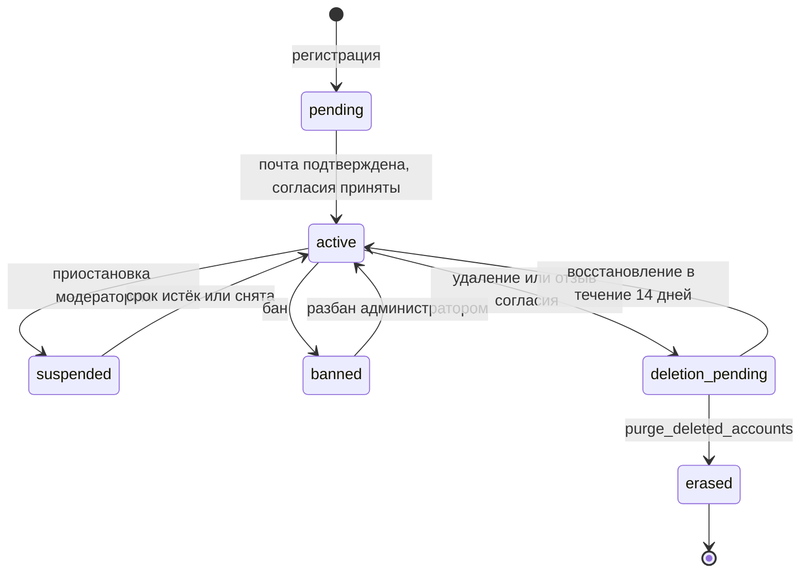

`deletion_pending`: сессии отозваны, профиль и контент скрыты для других, доступны только `GET /me`, восстановление и выход. По истечении `ACCOUNT_DELETION_GRACE_DAYS` задача `purge_deleted_accounts`:

1. берёт блокировку по пользователю и перечитывает его статус;
2. дописывает строку во **внешний** журнал `erasure-log/` и в `compliance.erasure_log` (с `consent_proof`);
3. вызывает `erase()` провайдеров по возрастанию `erase_order`, каждый шаг идемпотентен, после сбоя задача продолжает с начала;
4. ставит в очередь удаление объектов из S3, удаляет ключи Redis (`presence`, `sess:*`, `ticket:*`);
5. публикует `UserDeleted`, удаляет строку `identity.users`.

Заблокированный (`banned`) пользователь может потребовать уничтожения данных обращением; администратор запускает ту же процедуру (`POST /admin/users/{id}/erase`, 5.12), сохраняя минимум, необходимый для защиты от повторной регистрации, если владелец примет такое решение (6.7).

Что **остаётся** после уничтожения, и почему:

| Что | Срок | Основание |
|---|---|---|
| Резервные копии БД | до 14 дней (срок хранения копий), затем исчезают сами; после восстановления применяется `erasure-reapply` | техническая невозможность выборочного удаления |
| Журнал аудита (идентификатор и тип события) | `AUDIT_RETENTION_DAYS` (365), IP и User-Agent обнуляются через 90 дней | безопасность, расследование инцидентов |
| Access-логи Caddy | 90 дней | безопасность |
| `erasure_log.consent_proof` | `ERASURE_LOG_RETENTION_DAYS` (3 года) | доказательство факта согласия при спорах; персональных данных нет |
| Сообщения в чужих группах (`anonymize`) | пока существует группа | интересы участников беседы; автор отвязан. ⚠️ вопрос юристу (6.7) |
| Копии у других людей (цитаты, скриншоты, пересланное) | вне контроля сервиса | оговаривается в политике и соглашении |

#### Обращения субъектов

Человек может воспользоваться самообслуживанием (профиль, `GET/PUT /me/consents`, выгрузка, удаление) либо направить обращение: через публичную форму `POST /privacy/requests`, письмом на адрес из политики или по почте. Все обращения попадают в `compliance.subject_requests` (письма и бумажные вносит администратор). Срок отсчитывается от получения запроса: **10 рабочих дней**, с возможным продлением не более чем на 5 рабочих дней с мотивированным уведомлением (ст. 14, 20); требование прекратить распространение исполняется за **3 рабочих дня** (ст. 10.1), хотя сужение категорий в приложении действует мгновенно; уничтожение после отзыва согласия не позднее **30 дней** (ст. 21 ч. 5). Рабочие дни считаются по производственному календарю РФ (`RU_HOLIDAYS_FILE`). Задача `check_subject_requests` предупреждает администраторов за 3 рабочих дня до срока. Личность заявителя подтверждается входом в аккаунт или ссылкой на email, к которому привязан аккаунт; к чужим данным по анонимному обращению доступ не выдаётся.

#### Журналирование доступа

В `platform.audit_log` пишутся: согласия и отзывы, запросы и скачивание выгрузок, удаление и восстановление аккаунта, просмотр модератором снимка жалобы и профиля, любые административные действия над данными человека (с причиной и ссылкой на обращение), изменение ролей, вход в админские ручки. Журнал только добавляется (роль `app` не может изменять или удалять), срок `AUDIT_RETENTION_DAYS`.

#### Утечки

Инцидентом считается неправомерная или случайная передача, предоставление, распространение либо доступ к ПДн, нарушившие права субъектов (ст. 21 ч. 3.1). Система помогает техникой: оповещения (всплеск 401/403/404, аномальный объём выгрузок и запросов к профилям, срабатывание лимитов, необычные соединения с БД, нехватка места под журнал аудита), неизменяемый аудит и CLI `incident-report --from --to`, который собирает за период список затронутых идентификаторов, события безопасности и сводку по затронутым таблицам для уведомления РКН. Порядок действий и сроки (24 и 72 часа) в 6.9.8.

#### Контроль сторонних ресурсов

- Фронтенд: CSP `default-src 'self'`, шрифты и иконки отдаются своим доменом, нет аналитики, капч и внешних виджетов, `Referrer-Policy: strict-origin-when-cross-origin`.
- CI: шаг «внешние URL» ищет в собранном фронтенде адреса вне списка разрешённых и падает при находке.
- Серверы: исходящий трафик ограничен списком (4.16). Любое новое подключение внешнего сервиса проходит чек-лист «кому уходят данные, где он расположен, есть ли договор поручения» (6.9.5) до слияния кода.
- Обработчики по поручению (хостинг, почтовый провайдер, хранилище копий): договор с условиями защиты (ст. 6 ч. 3).

#### Тесты механизмов

| Тест | Что проверяет |
|---|---|
| полнота провайдеров | каждая таблица с человеком объявлена и обработана |
| экспорт-эталон | выгрузка пользователя из набора синтетических данных содержит все его записи и ни одной чужой |
| уничтожение | после `purge_deleted_accounts` в БД нет строк с идентификатором пользователя, кроме разрешённых исключений; в S3 нет объектов; в Redis нет ключей |
| повторное применение | восстановленная из копии БД после `erasure-reapply` не содержит уничтоженных пользователей |
| согласия | без согласий не получить полный токен; смена версии снова закрывает доступ; фильтр полей профиля по категориям |
| сроки | задачи очистки обнуляют `ip`, `user_agent`, `body` и удаляют просроченное, не трогая свежее |
| утечки через события | сборка событий не содержит запрещённых полей (email, имя, IP) |

---

## 5. Справочник API v1

### 5.1. Общие соглашения

#### Базовое

| Что | Правило |
|---|---|
| Адрес | `https://<домен>/api/v1`. Фронтенд и API на одном домене (D19) |
| Формат | JSON, UTF-8, поля в `snake_case`. Исключения: загрузка файла напрямую в хранилище по presigned URL, SSE (`text/event-stream`), WebSocket |
| Аутентификация | `Authorization: Bearer <access_token>` на всех ручках, кроме помеченных «публично». Токен выдают `/auth/login`, `/auth/refresh`, `/auth/verify-email` |
| Идентификаторы | UUID: строка в нижнем регистре с дефисами. `bigint` (сообщения, уведомления): JSON-число, безопасно до 2⁵³−1 |
| Время | RFC 3339, UTC, миллисекунды, суффикс `Z`: `2026-10-04T12:34:56.789Z` |
| Поля ответа | форма ответа стабильна: ключ всегда присутствует, при отсутствии значения `null` |
| Тело запроса | неизвестные поля отклоняются (`422 validation_error`, код элемента `unknown_field`); строки обрезаются по краям и приводятся к Unicode NFC; управляющие символы кроме `\n` и `\t` запрещены |
| `PATCH` | как JSON Merge Patch: отсутствующий ключ = без изменений, `null` = очистить (если допустимо) |
| Слэш на конце | пути без завершающего `/` |
| Версионирование | несовместимые изменения только в `/api/v2`; добавление необязательных полей и ручек считается совместимым |

#### Заголовки

| Заголовок | Направление | Назначение |
|---|---|---|
| `Authorization` | запрос | `Bearer <access_token>` |
| `Idempotency-Key` | запрос | UUID; для создающих `POST`, помеченных в справочнике |
| `X-Request-ID` | запрос / ответ | сквозной идентификатор (до 64 символов); если не передан, генерируется |
| `X-Requested-With: messunjerr` | запрос | обязателен на `POST /auth/refresh` и `POST /auth/logout` |
| `RateLimit-Limit`, `RateLimit-Remaining`, `RateLimit-Reset` | ответ | состояние бакета лимитов (секунды до сброса) |
| `Retry-After` | ответ | на `429` и `503`, секунды |
| `Location` | ответ | адрес созданного ресурса на `201` |
| `Idempotency-Replayed: true` | ответ | ответ воспроизведён из ранее сохранённого |
| `Cache-Control: no-store` | ответ | на ручках аутентификации и личных данных |

#### Постраничный вывод

Курсорный. Запрос: `limit` (по умолчанию 20, максимум 100; для сообщений по умолчанию 50, максимум 100) и `cursor` (непрозрачная строка из предыдущего ответа). Ответ:

```json
{ "items": [ { "id": "0192b7a0-5c1e-7c3a-9d54-3f1a2b6c7d80" } ], "next_cursor": "eyJ2IjoxLCJrIjpbIjIwMjYtMTAtMDRU" }
```

`next_cursor: null` означает конец списка. Нельзя разбирать и конструировать курсор на клиенте. Порядок сортировки указан у каждой ручки. Некорректный курсор: `400 invalid_cursor`. Сообщения чата используют не курсор, а `before_id` / `after_id` / `around_id` (5.9).

#### Идемпотентность

`Idempotency-Key` (UUID) принимают: `POST /posts`, `POST /posts/{id}/comments`, `POST /friend-requests`, `POST /reports`, `POST /media/uploads`, `POST /conversations`. Ответ сохраняется на 24 часа. Повтор с тем же ключом и тем же телом возвращает исходный ответ с заголовком `Idempotency-Replayed: true`; тем же ключом, но другим телом: `422 idempotency_key_reuse`; пока первый запрос выполняется: `409 request_in_progress`. Сообщения чата идемпотентны по `client_msg_id`.

#### Формат ошибок (RFC 9457)

`Content-Type: application/problem+json`. Исходное значение полей в ответ **не** подставляется.

```json
{
  "type": "/problems/validation_error",
  "title": "Validation failed",
  "status": 422,
  "code": "validation_error",
  "detail": "One or more fields are invalid.",
  "instance": "/api/v1/posts",
  "request_id": "01J9ZQ3Y8E4N7M2K5V6T1R0XBC",
  "errors": [
    { "pointer": "/body", "code": "string_too_long", "detail": "Must be at most 5000 characters.", "meta": { "max_length": 5000 } }
  ]
}
```

| Поле | Смысл |
|---|---|
| `type` | относительный URI `/problems/{code}`, стабилен |
| `title` | краткое стабильное название (английский) |
| `code` | машинный код; клиент ветвится по нему и подбирает локализованный текст |
| `detail` | пояснение для разработчика |
| `request_id` | идентификатор для поддержки и логов |
| `errors` | только у `validation_error`: список `{pointer, code, detail, meta}`; `pointer` — JSON Pointer на поле (`/body`, `/query/limit`, `/path/post_id`) |
| расширения | у отдельных кодов: `retry_after` (429), `suspended_until` (`account_suspended`), `limit` и `used` (`quota_exceeded`) |

#### Ошибки, общие для всех ручек

Не повторяются в описаниях ниже.

| Статус | `code` | Когда |
|:---:|---|---|
| 400 | `invalid_request` | тело не разбирается как JSON, неверный тип содержимого заголовков |
| 400 | `invalid_cursor` | недопустимый `cursor` |
| 401 | `token_missing`, `token_invalid`, `token_expired`, `session_revoked` | нет токена, плохая подпись, истёк срок, сессия отозвана. Заголовок `WWW-Authenticate: Bearer error="…"` |
| 403 | `account_deletion_pending` | аккаунт ждёт удаления: разрешены только `GET /me`, `POST /me/restore`, `POST /auth/logout` |
| 403 | `consent_required` | ⚖️ нужны согласия на актуальные версии документов (токен с `scp = "consent"`, 4.7); в ответе поле `required_actions` (формат как в `GET /me`) |
| 404 | `not_found` | ресурса нет или он не виден зрителю |
| 405 | `method_not_allowed` | метод не поддерживается |
| 413 | `payload_too_large` | тело больше 1 МБ (загрузки файлов идут напрямую в хранилище) |
| 415 | `unsupported_media_type` | не `application/json` там, где нужен JSON |
| 422 | `validation_error` | не прошла проверка полей, `unknown_field` |
| 429 | `rate_limited` | превышен лимит (4.14) |
| 500 | `internal_error` | необработанная ошибка |
| 503 | `service_unavailable` | недоступна зависимость, необходимая запросу |

**Ссылки в теле запроса.** Если цель, названная в теле, и есть главный объект действия (`user_id` в заявке в друзья, цель жалобы), недоступная цель даёт `404 not_found`, чтобы не раскрывать существование заблокировавших и скрытых. Если это вложенная ссылка (вложение, участник беседы, родительский комментарий, ответ на сообщение), ошибка идёт как `422 validation_error` с `pointer` и кодом вида `asset_not_found`, `member_not_found`, `parent_invalid`, `reply_not_found`.

#### Типовые объекты

**UserSummary** · **Avatar** · **MediaRef** · **Relationship**:

```json
{
  "id": "0192b7a0-5c1e-7c3a-9d54-3f1a2b6c7d80",
  "username": "ivan",
  "display_name": "Иван",
  "avatar": { "sm": "/media/public/avatars/0192…/64.webp", "md": "/media/public/avatars/0192…/256.webp" }
}
```

`avatar` равен `null`, если не задан. Для `MediaRef` (вложения постов и сообщений):

```json
{
  "id": "0192…", "kind": "image", "status": "ready",
  "content_type": "image/webp", "size_bytes": 184233, "filename": "photo.jpg",
  "width": 1280, "height": 960,
  "urls": { "thumb": "https://…", "medium": "https://…", "original": null },
  "url_expires_at": "2026-10-04T12:44:56.000Z"
}
```

У файлов `urls.original` содержит presigned-ссылку, `thumb` и `medium` равны `null`. До готовности (`status` ≠ `ready`) все `urls` равны `null`.

`Relationship` (зритель → владелец) присутствует в профиле и карточках:

```json
{
  "is_self": false,
  "friendship": "none",
  "friend_request_id": null,
  "following": "none",
  "follows_you": false,
  "blocked": false
}
```

`friendship`: `none` · `friends` · `request_sent` · `request_received`. `following`: `none` · `following` · `requested`. Факт того, что **вас** заблокировали, не раскрывается (в таком случае ресурс отвечает 404).

---

### 5.2. Аутентификация · `/auth`

Ручки без токена помечены «публично». Тело ответов входа и обновления:

```json
{
  "access_token": "eyJhbGciOiJFZERTQSIsImtpZCI6IjIwMjYtMTAifQ…",
  "token_type": "Bearer",
  "expires_in": 600,
  "session_id": "0192b7a0-…",
  "user": { "...": "MeUser (см. GET /me)" }
}
```

Вместе с ним в ответе `Set-Cookie: __Secure-mj_refresh=…; HttpOnly; Secure; SameSite=Strict; Path=/api/v1/auth; Max-Age=2592000`.

⚖️ Если в `user.required_actions` есть элементы (не принята новая версия документа, не подтверждён возраст после OAuth), `access_token` ограниченный (`scp = "consent"`, 4.7): клиент ведёт пользователя на экран согласий, остальные ручки отвечают `403 consent_required`.

#### `POST /auth/register` · публично

| | |
|---|---|
| Лимит | `auth_register_ip` |
| Тело | `email` (корректный адрес, ≤ 254) · `username` (3–30 символов `A–Z a–z 0–9 _`, регистр игнорируется, сохраняется в нижнем) · `password` (10–128, см. 4.7) · `display_name` (1–50, необязательно, по умолчанию = ник) · `language` (необязательно, BCP 47) · `timezone` (необязательно, IANA) · ⚖️ `consents` (три отдельные отметки, все обязательны; `document_version` берётся из `GET /legal/documents`) · ⚖️ `age_confirmed` (должно быть `true`: пользователю не меньше `MIN_AGE`, по умолчанию 18 лет) |
| Успех | `201` `{ "status": "verification_sent" }`. Одинаков, даже если адрес уже занят (тогда владельцу уходит письмо «у вас уже есть аккаунт»; согласия в этом случае не записываются) |
| Ошибки | `409 username_taken` · `422 validation_error` с кодами `username_reserved`, `password_too_weak`, `consent_missing`, `consent_version_outdated`, `invalid_category`, `age_not_confirmed` |
| Эффекты | пользователь `pending`, профиль и настройки приватности по умолчанию; ⚖️ три строки в `compliance.consents` (версия документа, IP и User-Agent как доказательство) и `age_declared_at`; события `UserRegistered`, `ConsentGranted`; задача `send_email` (подтверждение) |

⚖️ Пример `consents`. Три отметки независимы друг от друга; отметка о распространении содержит категории (`basic` обязательна, остальные добавляются позже в настройках):

```json
{
  "terms":         { "accepted": true, "document_version": "2026-10-01" },
  "processing":    { "accepted": true, "document_version": "2026-10-01" },
  "dissemination": { "accepted": true, "document_version": "2026-10-01", "categories": ["basic"] }
}
```

#### `POST /auth/verify-email` · публично

| | |
|---|---|
| Тело | `token` (из письма) |
| Успех | `200` ответ входа + cookie (автоматический вход) |
| Ошибки | `400 token_invalid_or_expired` |
| Эффекты | статус `active`, `email_verified_at`; событие `EmailVerified` |

#### `POST /auth/resend-verification` · публично

| | |
|---|---|
| Лимит | `auth_email_ip`, `auth_email_addr` |
| Тело | `email` |
| Успех | `202` `{ "status": "accepted" }` независимо от существования адреса |

#### `POST /auth/login` · публично

| | |
|---|---|
| Лимит | `auth_login_ip`, `auth_login_account` |
| Тело | `login` (email или ник) · `password` · `device_label` (необязательно, ≤ 100) |
| Успех | `200` ответ входа + cookie |
| Ошибки | `401 invalid_credentials` (неверная пара; одинаково для несуществующего логина, время ответа выровнено) · `403 email_not_verified` · `403 account_suspended` (расширение `suspended_until`) · `403 account_banned` · `429 rate_limited` |
| Эффекты | запись в `sessions`, `last_login_at`, аудит (успех и неуспех) |

Аккаунт в статусе `deletion_pending` может войти: клиенту показывается предложение восстановить аккаунт (`user.status`), остальные ручки закрыты (5.1).

#### `POST /auth/refresh` · cookie

| | |
|---|---|
| Лимит | `auth_refresh_session` |
| Запрос | без тела; cookie `__Secure-mj_refresh`; заголовок `X-Requested-With: messunjerr` |
| Успех | `200` ответ входа и новая cookie. В окне гонки двух вкладок (10 с после ротации) ответ содержит только новый `access_token`, а `Set-Cookie` отсутствует (4.7) |
| Ошибки | `401 refresh_missing` · `401 refresh_invalid` · `401 refresh_expired` · `401 refresh_reused` (сессия отозвана) · `403 csrf_failed` · `403 account_suspended` · `403 account_banned` |

#### `POST /auth/logout` · cookie

Запрос без тела, заголовок `X-Requested-With`. Всегда `204` (идемпотентно); отзывает текущую сессию и стирает cookie. Ошибки: `403 csrf_failed`.

#### `POST /auth/logout-all` · токен

| | |
|---|---|
| Тело | `password` · `keep_current` (по умолчанию `false`) |
| Успех | `204` |
| Ошибки | `403 reauth_failed` (неверный пароль) |
| Эффекты | все сессии отозваны, `sid` в denylist, пишется аудит |

#### `GET /auth/sessions` · токен

Список активных сессий пользователя.

```json
{ "items": [ { "id": "0192…", "device_label": "Firefox на Windows", "user_agent": "Mozilla/5.0 …",
               "ip_masked": "203.0.113.x", "created_at": "…", "last_seen_at": "…", "current": true } ] }
```

#### `DELETE /auth/sessions/{session_id}` · токен

`204`. Если сессия текущая, поведение как у `logout`. Ошибки: `404 not_found` (чужая или несуществующая).

#### `POST /auth/password/forgot` · публично

Лимит `auth_email_*`. Тело: `email`. Ответ `202` `{ "status": "accepted" }` всегда.

#### `POST /auth/password/reset` · публично

Тело: `token`, `new_password`. Успех `204`. Ошибки: `400 token_invalid_or_expired` · `422 password_too_weak`. Эффекты: отзываются все сессии, письмо-уведомление, событие `PasswordChanged`, аудит.

#### `POST /auth/password/change` · токен

Тело: `current_password`, `new_password`, `revoke_other_sessions` (по умолчанию `true`). Успех `204`. Ошибки: `403 reauth_failed` · `422 password_too_weak`. Эффекты как у сброса, но текущая сессия остаётся.

#### `POST /auth/email/change` · токен

Тело: `new_email`, `password`. Успех `202` `{ "status": "confirmation_sent" }` (письмо с токеном на новый адрес, уведомление на старый). Ошибки: `403 reauth_failed`.

#### `POST /auth/email/confirm` · публично

Тело: `token`. Успех `204`, адрес заменён. Ошибки: `400 token_invalid_or_expired`.

#### `GET /auth/username-available` · публично

| | |
|---|---|
| Лимит | `username_check_ip` |
| Запрос | `username` |
| Успех | `200` `{ "available": true }` или `{ "available": false, "reason": "taken" \| "reserved" \| "invalid" }` |

#### OAuth

| Метод и путь | Доступ | Описание |
|---|---|---|
| `GET /auth/oauth/{provider}/start` | публично | ⚖️ `provider` ∈ `vk`, `yandex` (актуальный список в `GET /meta`; Google и GitHub исключены законом, D20). Параметр `redirect` — относительный путь возврата (по умолчанию `/`). Ответ `302` на провайдера; `state` и PKCE-проверка в подписанной cookie на 10 минут |
| `GET /auth/oauth/{provider}/callback` | публично | Ответ `302` на `redirect` с установленной refresh-cookie (SPA затем вызывает `/auth/refresh`); для нового аккаунта или при невыданных согласиях ответ `302` на `/onboarding` (ограниченный токен, см. 4.7). Ошибки: `302` на `/login?error=<code>`, где `<code>` ∈ `oauth_failed`, `oauth_email_conflict`, `oauth_email_required`, `account_suspended`, `account_banned` |
| `POST /auth/oauth/{provider}/link` | токен | Начало привязки к текущему аккаунту. Тело: `redirect` (необязательно). Ответ `200` `{ "authorization_url": "…" }`. Ошибки: `409 oauth_already_linked` |
| `GET /auth/oauth/identities` | токен | `200` `{ "items": [ { "provider": "yandex", "email": "…", "linked_at": "…" } ] }` |
| `DELETE /auth/oauth/identities/{provider}` | токен | `204`. Ошибки: `404 not_found` · `409 last_login_method` (нельзя отвязать, если нет пароля и других привязок) |

#### `GET /.well-known/jwks.json` · публично

JWKS с публичными ключами Ed25519 (`kty: OKP`, `crv: Ed25519`, `kid`). Кэшируется (`Cache-Control: public, max-age=3600`). Вне префикса `/api/v1`.

---

### 5.3. Текущий пользователь и профили · `/me`, `/users`

**MeUser** (ответ `GET /me`):

```json
{
  "id": "0192…", "username": "ivan", "email": "ivan@example.com", "email_verified": true,
  "role": "user", "status": "active", "created_at": "…",
  "profile": { "display_name": "Иван", "avatar": null, "bio": null, "links": [], "birth_date": null,
               "birth_date_visibility": "hidden", "city": null, "language": "ru", "timezone": "Europe/Moscow",
               "is_private": false, "hidden_fields": [] },
  "privacy": { "dm_policy": "friends", "comment_policy": "everyone", "mention_policy": "everyone",
               "friends_list_visibility": "friends", "followers_list_visibility": "friends",
               "presence_visibility": "friends", "default_post_visibility": "friends" },
  "counters": { "unread_notifications": 3, "unread_conversations": 1,
                "pending_friend_requests": 2, "pending_follow_requests": 0 },
  "required_actions": []
}
```

- `profile.hidden_fields` ⚖️: поля, которые вы заполнили, но другие их не видят, потому что их категория не входит в согласие на распространение (4.6), например `["city"]`.
- `required_actions` ⚖️: действия, без которых доступ ограничен. Элементы: `{ "type": "accept_document", "slug": "terms", "version": "2026-10-01" }`, `{ "type": "confirm_age" }`, `{ "type": "choose_username" }`, `{ "type": "verify_email" }`. Пустой массив означает полный доступ; иначе токен ограниченный (4.7).

**UserProfile** (ответ `GET /users/{ref}`):

```json
{
  "user": { "id": "0192…", "username": "anna", "display_name": "Анна", "avatar": { "sm": "…", "md": "…" } },
  "bio": "Люблю горы", "links": [ { "title": "Блог", "url": "https://example.com" } ],
  "birth_date": "05-12", "city": "Казань", "language": "ru", "timezone": "Europe/Moscow",
  "is_private": false, "created_at": "…",
  "counters": { "posts": 42, "friends": 17, "followers": 90, "following": 31 },
  "relationship": { "is_self": false, "friendship": "none", "friend_request_id": null,
                    "following": "none", "follows_you": false, "blocked": false },
  "presence": { "online": true, "last_seen_at": null }
}
```

- `birth_date`: `"1990-05-12"` при видимости `full`, `"05-12"` при `day_month`, иначе `null`.
- `counters.friends`, `followers`, `following` равны `null`, если настройки владельца не разрешают зрителю их видеть.
- `presence` присутствует только если настройка владельца разрешает; иначе `null`.
- У закрытого профиля для не друзей и не подписчиков `counters.posts` равен `null`, а посты не отдаются.
- `{ref}` в путях `/users/{ref}` — UUID или ник; ник не совпадает по форме с UUID, неоднозначности нет.

#### `GET /me` · токен

`200` MeUser. Доступна и аккаунту в статусе `deletion_pending`.

#### `PATCH /me/profile` · токен

| | |
|---|---|
| Лимит | `api_write` |
| Тело (все поля необязательны) | `display_name` (1–50) · `bio` (≤ 500, `null` очищает) · `links` (до 5 объектов `{title ≤ 40, url ≤ 300, схема http или https}`) · `birth_date` (`YYYY-MM-DD`, возраст ≥ `MIN_AGE` (18), `null` очищает) · `birth_date_visibility` (`hidden`, `day_month`, `full`) · `city` (≤ 100) · `language` (BCP 47) · `timezone` (IANA) · `is_private` (bool) · `avatar_asset_id` (id готового ресурса назначения `avatar` своего владельца; `null` убирает аватар) |
| Успех | `200` MeUser.profile (с актуальным `hidden_fields`) |
| Ошибки | `422 validation_error`, в том числе `asset_not_found` (чужой или несуществующий ресурс), `asset_not_ready`, `asset_wrong_purpose` по `pointer` `/body/avatar_asset_id`; `underage` для `birth_date` |
| Эффекты | при переходе `is_private` из `false` в `true` существующие подписчики остаются, но новые подписки идут через запрос; при обратном переходе все ожидающие запросы на подписку автоматически одобряются. ⚖️ Поля вне категорий согласия на распространение сохраняются, но другим не показываются; клиент предлагает расширить согласие (`PUT /me/consents/dissemination`) |

#### `PATCH /me/username` · токен

Тело: `username`. Успех `200` `{ "username": "…" }`. Ограничение: не чаще раза в 30 дней, первая смена бесплатна. Ошибки: `409 username_taken` · `409 username_change_cooldown` (расширение `retry_after_days`) · `422 username_reserved`. Старый ник освобождается через 30 дней: пока он зарезервирован (`identity.username_reservations`), его не займёт никто, ни смена ника, ни регистрация, а `GET /auth/username-available` отвечает `taken`. Срок настраивается (`USERNAME_CHANGE_COOLDOWN_DAYS`).

#### `GET /me/privacy`, `PATCH /me/privacy` · токен

`PrivacySettings` как в MeUser. `PATCH` принимает любые из полей, значения из перечислений: `dm_policy`, `comment_policy`, `mention_policy` ∈ `everyone`, `friends`, `nobody`; `friends_list_visibility`, `followers_list_visibility` ∈ `everyone`, `friends`, `only_me`; `presence_visibility` ∈ `everyone`, `friends`, `nobody`; `default_post_visibility` ∈ `public`, `friends`, `private`. Ответ `200` обновлённые настройки.

#### `DELETE /me` · токен

Запрос удаления аккаунта. Тело: `password` (аккаунтам только с OAuth достаточно свежей сессии, не старше 5 минут). Успех `202` `{ "deletion_scheduled_at": "…" }` (+14 дней, `ACCOUNT_DELETION_GRACE_DAYS`). Ошибки: `403 reauth_failed` · `409 role_must_be_revoked` (модератор или администратор сначала лишается роли). Эффекты: статус `deletion_pending`, все остальные сессии отозваны, профиль и контент скрыты для других, событие `UserDeletionRequested`; ⚖️ это же считается отзывом согласий на обработку и распространение, окончательное уничтожение данных описано в 4.20.

#### `POST /me/restore` · токен

Отмена удаления до наступления срока. `200` MeUser. Ошибки: `409 not_pending_deletion`.

#### `GET /users/{ref}` · токен

`200` UserProfile. Ошибки: `404 not_found` (нет такого, заблокирован в любую сторону, статус не `active`).

#### `GET /users/{ref}/friends`, `/followers`, `/following` · токен

Страница `UserSummary` с полем `relationship` (по Relationship), порядок: по давности связи, новые сверху. Ошибки: `403 list_hidden` (настройка владельца не разрешает зрителю смотреть список; поле `connections` вне согласия на распространение действует так же) · `403 profile_private` (профиль закрыт, зритель не друг и не подписчик) · `404 not_found`.

#### `GET /users/{ref}/mutual-friends` · токен

Страница `UserSummary` общих друзей зрителя и владельца. Ошибки: `404 not_found`.

#### Согласия, документы и права субъекта ⚖️

Механизмы описаны в 4.20, юридическая рамка в 6.9. Коды ошибок в каталоге 5.14.

##### `GET /legal/documents` · публично

Действующие версии юридических текстов, сведения об операторе и параметры возраста. Кэшируется (`Cache-Control: public, max-age=300`).

```json
{
  "operator": { "name": "…", "address": "…", "contact_email": "privacy@example.ru" },
  "min_age": 18,
  "items": [
    { "slug": "terms", "version": "2026-10-01", "title": "Пользовательское соглашение",
      "sha256": "9f2c…", "is_material": true, "published_at": "…", "effective_at": "…" },
    { "slug": "consent_processing", "version": "2026-10-01", "title": "Согласие на обработку персональных данных", "...": "…" },
    { "slug": "consent_dissemination", "version": "2026-10-01", "title": "Согласие на распространение персональных данных", "...": "…" },
    { "slug": "privacy_policy", "version": "2026-10-01", "title": "Политика обработки персональных данных", "...": "…" }
  ],
  "dissemination_categories": [
    { "key": "basic", "required": true, "fields": ["username", "display_name", "avatar"] },
    { "key": "about", "required": false, "fields": ["bio", "links"] },
    { "key": "city", "required": false, "fields": ["city"] },
    { "key": "birth_date", "required": false, "fields": ["birth_date"] },
    { "key": "locale", "required": false, "fields": ["language", "timezone"] },
    { "key": "activity", "required": false, "fields": ["presence", "last_seen_at"] },
    { "key": "connections", "required": false, "fields": ["friends", "followers", "following"] }
  ]
}
```

##### `GET /legal/documents/{slug}/{version}` · публично

`200` `{ "slug", "version", "title", "format": "markdown", "body": "…", "sha256": "…" }`. Ошибки: `404 not_found`. Клиент показывает именно этот текст рядом с отметкой; хэш совпадает с записанным в журнале согласий.

##### `GET /me/consents` · токен

Доступна и с ограниченным токеном.

```json
{
  "items": [
    { "purpose": "terms", "state": "granted", "document": { "slug": "terms", "version": "2026-10-01" },
      "granted_at": "…", "withdrawn_at": null, "scope": {} },
    { "purpose": "processing", "state": "outdated", "document": { "slug": "consent_processing", "version": "2026-04-01" },
      "granted_at": "…", "withdrawn_at": null, "scope": {} },
    { "purpose": "dissemination", "state": "granted", "document": { "slug": "consent_dissemination", "version": "2026-10-01" },
      "granted_at": "…", "withdrawn_at": null, "scope": { "categories": ["basic", "about", "city"] } }
  ],
  "required_actions": [ { "type": "accept_document", "slug": "consent_processing", "version": "2026-10-01" } ]
}
```

`state`: `granted` · `outdated` (вышла более новая существенная версия) · `missing` · `withdrawn`.

##### `PUT /me/consents/{purpose}` · токен

`purpose` ∈ `terms`, `processing`, `dissemination`. Доступна и с ограниченным токеном.

| | |
|---|---|
| Лимит | `consent_write` |
| Тело | `document_version` (обязательно, актуальная версия из `GET /legal/documents`) · `categories` (только для `dissemination`: подмножество категорий, обязательно содержит `basic`) |
| Успех | `200` элемент согласия (как в `GET /me/consents`) + `required_actions` |
| Ошибки | `422 validation_error` с кодами `consent_version_outdated`, `invalid_category`, `basic_category_required` |
| Эффекты | предыдущая строка согласия помечается отозванной, добавляется новая (версия, IP, User-Agent); событие `ConsentGranted`; для `dissemination` видимость полей профиля пересчитывается мгновенно; запись в аудит |

##### `POST /me/consents/{purpose}/withdraw` · токен

Отзыв основного согласия (`terms`, `processing`) или согласия на распространение целиком. Поскольку без них аккаунт существовать не может, отзыв запускает удаление аккаунта (4.20). Частичное сужение категорий выполняется через `PUT /me/consents/dissemination` с меньшим набором.

| | |
|---|---|
| Тело | `confirm` (должно быть `true`) · `password` (аккаунтам только с OAuth достаточно свежей сессии) |
| Успех | `202` `{ "deletion_scheduled_at": "…" }` |
| Ошибки | `403 reauth_failed` · `409 role_must_be_revoked` · `422 validation_error` |
| Эффекты | те же, что у `DELETE /me`; в журнале причина `withdrawn_consent`; событие `ConsentWithdrawn` |

##### `POST /me/onboarding` · токен

Одним запросом закрывает все обязательные действия из `required_actions`: новый аккаунт после OAuth, повторное принятие после существенной редакции документов. Доступна с ограниченным токеном.

| | |
|---|---|
| Тело | `consents` (как при регистрации; достаточно тех назначений, которые перечислены в `required_actions`) · `age_confirmed` (если требуется `confirm_age`) · `username` (если требуется `choose_username`; остальным не нужен) |
| Успех | `200` `{ access_token, token_type, expires_in, session_id, user }`: свежий **полный** токен, cookie не меняется |
| Ошибки | `409 onboarding_not_required` · `409 username_taken` · `422 validation_error` (`consent_missing`, `consent_version_outdated`, `invalid_category`, `age_not_confirmed`, `username_reserved`) |
| Эффекты | согласия записаны (`method = onboarding`), у OAuth-аккаунтов статус `pending` → `active`; события `ConsentGranted`, при необходимости `UserRegistered`; запись в аудит |

##### `POST /me/data-export` · токен

Выгрузка всех данных пользователя (4.20). Запрещена ограниченному токену.

| | |
|---|---|
| Лимит | `export_request` |
| Тело | `password` (аккаунтам только с OAuth достаточно свежей сессии) |
| Успех | `202` `{ "id": "…", "status": "queued", "created_at": "…" }` |
| Ошибки | `403 reauth_failed` · `409 export_in_progress` |
| Эффекты | событие `DataExportRequested`, задача `build_data_export`; когда архив готов, приходят письмо и SSE-событие `export.ready` |

##### `GET /me/data-export` · токен

`200` `{ "items": [ { "id", "status", "created_at", "ready_at", "expires_at", "size_bytes" } ] }`: последние 5 выгрузок. `status`: `queued` · `building` · `ready` · `failed` · `expired`.

##### `GET /me/data-export/{export_id}/download` · токен

`200` `{ "url": "https://…", "expires_at": "…" }`: presigned-ссылка на 24 часа. Ошибки: `404 not_found` · `409 export_not_ready` · `410 export_expired`. Каждое получение ссылки пишется в аудит.

##### `POST /privacy/requests` · публично или токен

Обращение субъекта персональных данных: запрос сведений, уточнение, удаление, отзыв согласия, прекращение распространения, возражение.

| | |
|---|---|
| Лимит | `privacy_request_ip` |
| Тело | `kind` ∈ `access`, `rectification`, `erasure`, `withdraw_consent`, `stop_dissemination`, `objection`, `other` · `details` (≤ 2000) · без токена дополнительно `contact_email` и необязательный `username` |
| Успех без токена | `202` `{ "status": "confirmation_sent" }`; всегда одинаков, письмо со ссылкой подтверждения уходит на указанный адрес |
| Успех с токеном | `201` `{ "id", "status": "received", "due_at": "…" }`: личность подтверждена входом, срок пошёл сразу |
| Эффекты | строка в `compliance.subject_requests`; администраторы получают уведомление; срок `due_at` считается по рабочим дням РФ: 10 (3 для `stop_dissemination`) |

##### `POST /privacy/requests/confirm` · публично

Тело: `token` (из письма). Успех `200` `{ "id", "status": "received", "due_at": "…" }`. Ошибки: `400 token_invalid_or_expired`. С этого момента идёт срок обработки.

##### `GET /me/privacy-requests` · токен

`200` `{ "items": [ { "id", "kind", "status", "received_at", "due_at", "completed_at", "resolution" } ] }`: свои обращения, новые сверху (одна страница, не более 50). Доступна и с ограниченным токеном.

---

### 5.4. Социальный граф

#### Заявки в друзья

**FriendRequest**: `{ "id", "status": "pending", "user": UserSummary, "direction": "incoming" | "outgoing", "created_at" }`, где `user` — собеседник.

| Метод и путь | Описание |
|---|---|
| `POST /friend-requests` | Тело: `user_id`. Лимит `friend_request`, поддерживает `Idempotency-Key`. `201` FriendRequest со статусом `pending`; если существовала встречная заявка, она принимается: `200` и `status: "accepted"`. Ошибки: `400 self_action` · `404 not_found` (нет цели, блокировка, цель не `active`) · `409 already_friends` · `409 friend_request_exists`. События: `FriendRequestSent` (или `FriendRequestResponded` при автопринятии) |
| `GET /friend-requests` | Запрос: `direction` (`incoming` по умолчанию, `outgoing`). Страница активных заявок, новые сверху |
| `POST /friend-requests/{id}/accept` | Только получатель. `200` `{ "friend": UserSummary, "since": "…" }`. Ошибки: `404 not_found` (чужая или не существует) · `409 friend_request_not_pending`. События: `FriendRequestResponded` |
| `POST /friend-requests/{id}/decline` | Только получатель. `204`. Ошибки как выше. Отправитель об отказе не уведомляется |
| `DELETE /friend-requests/{id}` | Только отправитель, отмена. `204`. Ошибки: `404 not_found` · `409 friend_request_not_pending` |

#### Друзья

| Метод и путь | Описание |
|---|---|
| `GET /friends` | Запрос: `q` (необязательно, поиск по нику и имени среди друзей). Страница `{ user: UserSummary, since }`, порядок: по давности дружбы, новые сверху |
| `DELETE /friends/{user_id}` | `204`. Ошибки: `404 not_found` (не друзья). События: `FriendshipRemoved` |

#### Подписки

| Метод и путь | Описание |
|---|---|
| `PUT /follows/{user_id}` | Идемпотентно. Лимит `follow`. `200` `{ "status": "following" }` для открытого профиля или `{ "status": "requested" }` для закрытого (создан запрос). Ошибки: `400 self_action` · `404 not_found`. События: `FollowCreated` или `FollowRequested` |
| `DELETE /follows/{user_id}` | Отписка или отмена запроса. Всегда `204` (идемпотентно). События: `FollowRemoved` |
| `GET /me/following` | Страница `UserSummary` тех, на кого вы подписаны, новые сверху |
| `GET /me/followers` | Страница ваших подписчиков |
| `DELETE /me/followers/{user_id}` | Удалить подписчика. `204` (идемпотентно) |

#### Запросы на подписку (для закрытого профиля)

**FollowRequest**: `{ "id", "user": UserSummary, "created_at" }`.

| Метод и путь | Описание |
|---|---|
| `GET /me/follow-requests` | Страница входящих запросов, новые сверху |
| `POST /me/follow-requests/{id}/approve` | `200` `{ "follower": UserSummary }`. Ошибки: `404 not_found` · `409 follow_request_not_pending`. События: `FollowRequestResponded` |
| `POST /me/follow-requests/{id}/decline` | `204`. Ошибки как выше |

#### Блокировки

| Метод и путь | Описание |
|---|---|
| `GET /me/blocks` | Страница `{ user: UserSummary, blocked_at }`, новые сверху |
| `PUT /blocks/{user_id}` | Идемпотентно, `204`. Ошибки: `400 self_action` · `404 not_found`. Эффекты по 4.6 (удаление дружбы и подписок, отмена заявок). События: `UserBlocked` |
| `DELETE /blocks/{user_id}` | Идемпотентно, `204`. События: `UserUnblocked` (дружба и подписки не восстанавливаются) |

---

### 5.5. Посты и лента · `/posts`, `/feed`

**Post**:

```json
{
  "id": "0192…",
  "author": { "id": "0192…", "username": "anna", "display_name": "Анна", "avatar": { "sm": "…", "md": "…" } },
  "body": "Привет, #горы! Спасибо @ivan",
  "visibility": "friends",
  "audience": "friends",
  "media": [ { "id": "0192…", "kind": "image", "status": "ready", "urls": { "thumb": "https://…", "medium": "https://…", "original": null }, "url_expires_at": "…" } ],
  "hashtags": ["горы"],
  "mentions": [ { "id": "0192…", "username": "ivan" } ],
  "counters": { "comments": 3, "reactions": 12 },
  "reactions": { "total": 12, "by_emoji": [ { "emoji": "❤️", "count": 8 }, { "emoji": "👍", "count": 4 } ], "mine": "❤️" },
  "created_at": "…",
  "edited_at": null,
  "moderation_state": "visible",
  "viewer": { "can_comment": true, "can_edit": false, "can_delete": false }
}
```

| Поле | Смысл |
|---|---|
| `visibility` | выбор автора: `public` · `friends` · `private` |
| `audience` | кто реально увидит с учётом закрытого профиля (A11): `everyone` (все зарегистрированные пользователи) · `friends_and_followers` · `friends` · `only_me` |
| `mentions` | только те упоминания, которые прошли `mention_policy` упоминаемого; остальные остаются обычным текстом |
| `reactions.mine` | ваша реакция или `null`; `by_emoji` отсортирован по убыванию, не более 8 элементов |
| `moderation_state` | `visible` или `hidden`; `hidden` видят только автор (с пометкой) и модераторы |
| `viewer` | что можно сделать зрителю; клиент не вычисляет права сам |

Реакции берутся из палитры (A09): ей управляет конфигурация, список отдаёт `GET /meta`; по умолчанию `👍 ❤️ 😂 😮 😢 😡 🔥 🎉`. Сервер приводит написание к каноническому (с селектором вариации U+FE0F или без), поэтому `❤` и `❤️` считаются одной реакцией.

#### `POST /posts` · токен

| | |
|---|---|
| Лимит | `post_create`; поддерживает `Idempotency-Key` |
| Тело | `body` (0–5000 символов, обязателен, может быть пустым при наличии вложений) · `visibility` (необязательно, по умолчанию `privacy.default_post_visibility`) · `media_ids` (0–10 уникальных id готовых ресурсов назначения `post`, принадлежащих автору) |
| Успех | `201` Post, заголовок `Location: /api/v1/posts/{id}` |
| Ошибки | `422 validation_error`: `body_or_media_required`, `string_too_long`, `too_many_media`, `duplicate_media`, `asset_not_found`, `asset_not_ready`, `asset_wrong_purpose`, `asset_already_attached` |
| Эффекты | из текста извлекаются хэштеги (`#[\p{L}\p{N}_]{1,50}`) и упоминания (`@ник`), результат записывается в `post_hashtags` и `mentions`; вложения привязываются; событие `PostCreated`; упомянутые получают уведомление `mention.post` |

Для закрытого профиля `public` принимается, но реальная аудитория ограничена (`audience`).

#### `GET /posts/{post_id}` · токен

`200` Post. Ошибки: `404 not_found` (пост не виден зрителю по матрице 4.6, удалён, заблокирован автор).

#### `PATCH /posts/{post_id}` · только автор

| | |
|---|---|
| Лимит | `api_write` |
| Тело (все поля необязательны) | `body` · `visibility` · `media_ids` (заменяет список целиком; снятые вложения отвязываются и позже удаляются) |
| Успех | `200` Post; `edited_at` ставится, если изменились текст или вложения (смена видимости метку не ставит) |
| Ошибки | `404 not_found` · `403 not_author` · `422 validation_error` (те же коды, что при создании) |
| Эффекты | хэштеги и упоминания пересчитываются, новые упоминания уведомляют; событие `PostUpdated` |

#### `DELETE /posts/{post_id}` · только автор

`204`. Мягкое удаление (`deleted_at`), комментарии и реакции перестают показываться, вложения удаляются фоновой задачей, событие `PostDeleted`. Ошибки: `404 not_found` · `403 not_author`. Модераторы и администраторы **скрывают** пост через 5.12, а не удаляют.

#### `GET /users/{ref}/posts` · токен

«Стена» человека: страница Post, новые сверху (`created_at DESC, id DESC`), только видимые зрителю. Запрос: `limit`, `cursor`.

Ошибки: `403 profile_private` (профиль закрыт, зритель не друг и не подписчик) · `404 not_found`.

На собственной стене автор видит и посты, скрытые модератором (с `moderation_state: "hidden"`, чтобы понимать причину); в ленте скрытые посты не показываются никому, включая автора (6.5).

#### `GET /feed` · токен

Хронологическая лента: собственные посты, посты друзей (`public`, `friends`) и тех, на кого вы подписаны (`public`), без заблокированных и скрытых; запрос — приложение 6.5.

| | |
|---|---|
| Запрос | `scope` ∈ `all` (по умолчанию), `friends`, `following` · `limit` (по умолчанию 20) · `cursor` |
| Ответ | Page<Post>, новые сверху |
| Ошибки | `400 invalid_cursor` |

#### `GET /feed/new-count` · токен

Для кнопки «показать новые посты». Запрос: `since` (обязательно, RFC 3339: `created_at` самого нового известного клиенту поста), `scope`. Ответ `200` `{ "count": 3, "capped": false }`; счёт ограничен 50 (`capped: true`, если новых больше). Ошибки: `422 validation_error`.

---

### 5.6. Комментарии и реакции

**Comment**:

```json
{
  "id": "0192…", "post_id": "0192…", "parent_id": null,
  "author": { "id": "0192…", "username": "ivan", "display_name": "Иван", "avatar": null },
  "body": "Класс! @anna", "mentions": [ { "id": "0192…", "username": "anna" } ],
  "counters": { "replies": 2, "reactions": 5 },
  "reactions": { "total": 5, "by_emoji": [ { "emoji": "👍", "count": 5 } ], "mine": null },
  "created_at": "…", "edited_at": null, "deleted": false,
  "moderation_state": "visible",
  "viewer": { "can_edit": true, "can_delete": true }
}
```

- Два уровня (A10): корневой комментарий и ответы на него. Ответ на ответ клиент отправляет с `parent_id` корня и `@ником` в тексте; упоминание уведомит адресата.
- Удалённый корневой комментарий, у которого есть неудалённые ответы, отдаётся «надгробием»: `deleted: true`, `author: null`, `body: null`, счётчики реакций нулевые. Удалённый без ответов и удалённые ответы в списках отсутствуют.
- Комментарии и реакции людей, с которыми у зрителя блокировка в любую сторону, в выдаче не показываются (счётчики остаются общими).

#### `GET /posts/{post_id}/comments` · токен

Корневые комментарии, по умолчанию от старых к новым. Запрос: `order` ∈ `asc` (по умолчанию), `desc` · `limit` (по умолчанию 20) · `cursor`. Ответ Page<Comment>. Ошибки: `404 not_found` (пост не виден).

#### `POST /posts/{post_id}/comments` · токен

| | |
|---|---|
| Лимит | `comment_create`; поддерживает `Idempotency-Key` |
| Тело | `body` (1–2000) · `parent_id` (необязательно, id **корневого** комментария этого поста) |
| Успех | `201` Comment |
| Ошибки | `404 not_found` (пост не виден) · `403 comments_forbidden` (`comment_policy` автора поста не допускает вас) · `422 validation_error`: `parent_invalid` (нет такого комментария, он не корневой или принадлежит другому посту), `string_too_long` |
| Эффекты | счётчики поста и родителя; упоминания; события `CommentCreated`; автору поста уведомление `post.comment`, автору родительского комментария `comment.reply`, упомянутым `mention.comment` (себе уведомления не создаются) |

#### `GET /comments/{comment_id}` · токен

Один комментарий (для ссылок из уведомлений). `200` Comment · `404 not_found` (комментарий или его пост не виден).

#### `GET /comments/{comment_id}/replies` · токен

Ответы на корневой комментарий, от старых к новым. Запрос: `limit` (по умолчанию 20), `cursor`. Ответ Page<Comment>. Ошибки: `404 not_found`.

#### `PATCH /comments/{comment_id}` · только автор

Тело: `body` (1–2000). `200` Comment, ставится `edited_at`. Ошибки: `404 not_found` · `403 not_author` · `422 validation_error`.

#### `DELETE /comments/{comment_id}` · автор комментария или автор поста

`204`. Мягкое удаление, счётчики уменьшаются, событие `CommentDeleted`. Ошибки: `404 not_found` · `403 not_author` (вы видите комментарий, но не вправе его удалить). Модераторы скрывают комментарий через 5.12.

#### Реакции на посты и комментарии

Одна реакция на человека, её можно менять (A09). Объект `ReactionSummary`: `{ "total", "by_emoji": [ { "emoji", "count" } ], "mine" }`.

| Метод и путь | Описание |
|---|---|
| `PUT /posts/{post_id}/reaction` | Тело: `emoji` (из палитры). Идемпотентно: повтор с тем же `emoji` ничего не меняет; другой `emoji` заменяет прежний. Лимит `reaction_set`. `200` `ReactionSummary`. Ошибки: `404 not_found` · `422 validation_error` (`emoji_not_allowed`). События: `ReactionSet` (только при изменении); уведомление `post.reaction` автору (одно на пару «автор поста — реагирующий») |
| `DELETE /posts/{post_id}/reaction` | Идемпотентно. `200` `ReactionSummary` с обновлёнными счётчиками. Событие `ReactionRemoved` |
| `GET /posts/{post_id}/reactions` | Кто отреагировал: Page `{ user: UserSummary, emoji, created_at }`, новые сверху. Запрос: `emoji` (фильтр), `limit`, `cursor`. Заблокированные в любую сторону не показываются. Ошибки: `404 not_found` |
| `PUT /comments/{comment_id}/reaction` | То же для комментария; уведомление `comment.reaction` |
| `DELETE /comments/{comment_id}/reaction` | То же |
| `GET /comments/{comment_id}/reactions` | То же |

---

### 5.7. Поиск и хэштеги · `/search`, `/hashtags`

Лимит всех ручек `search` (30 в минуту). Поиск без анонимного доступа: учитываются только данные, видимые зрителю (4.6, 4.10). Глубокого листания нет: `offset + limit ≤ 200`.

**SearchPage**: `{ "items": [ … ], "next_offset": 20 }`; `next_offset: null`, если результаты кончились или достигнут потолок.

#### `GET /search/users` · токен

| | |
|---|---|
| Запрос | `q` (2–50 символов) · `limit` (по умолчанию 20, максимум 50) · `offset` (по умолчанию 0) |
| Ответ | SearchPage элементов `{ user: UserSummary, relationship: Relationship }`. Порядок: точное совпадение ника, префикс, затем сходство `pg_trgm` по нику и имени |
| Ошибки | `422 validation_error` (`q` короче 2 символов) |

Не находятся пользователи в статусе не `active`, заблокировавшие вас и заблокированные вами. ⚖️ Поиск видит только то, что разрешено категорией `basic`: ник, имя и аватар.

#### `GET /search/posts` · токен

| | |
|---|---|
| Запрос | `q` (2–100 символов; синтаксис `websearch_to_tsquery`: слова, `"фразы"`, `-исключение`, `or`) · `limit` (до 50) · `offset` |
| Ответ | SearchPage элементов `{ post: Post, highlight: [ { "text": "…", "match": false }, { "text": "горы", "match": true } ] }`. Порядок: `ts_rank_cd`, затем свежесть |

Фрагмент `highlight` приходит массивом сегментов, а не HTML, чтобы клиент выводил его как текст без риска XSS. Поиск идёт по русской и английской конфигурациям (4.10).

#### `GET /search/hashtags` · токен

Запрос: `q` (1–50 символов, начальный `#` отбрасывается). Ответ `200` `{ "items": [ { "tag": "горы", "posts_count": 17 } ] }`: до 20 тегов по префиксу, счёт видимых зрителю постов. Без пагинации.

#### `GET /hashtags/trending` · токен

`200` `{ "items": [ { "tag", "posts_count_24h" } ], "updated_at": "…" }`: до 20 тегов за последние 24 часа по публичным постам открытых профилей (пересчёт раз в 5 минут, 4.12). Лимит `api_read`.

#### `GET /hashtags/{tag}/posts` · токен

Посты с тегом, видимые зрителю, новые сверху. Запрос: `limit`, `cursor`. Ответ Page<Post>. Тег нормализуется (`NFKC`, `casefold`); неизвестный тег даёт пустую страницу, не ошибку. Лимит `api_read`.

---

### 5.8. Медиа · `/media`

Файлы загружаются **напрямую в хранилище** по presigned URL (4.11), API-сервер их содержимое не видит. Жизненный цикл ресурса: `pending` → `uploaded` → `processing` → `ready` | `rejected`; удалённые получают `deleted`.

**Asset** (владелец видит полную карточку):

```json
{
  "id": "0192…", "purpose": "post", "kind": "image", "status": "ready",
  "filename": "photo.jpg", "content_type": "image/webp", "declared_size": 1843200, "size_bytes": 184233,
  "width": 1280, "height": 960, "reject_reason": null,
  "urls": { "thumb": "https://…", "medium": "https://…", "original": null }, "url_expires_at": "…",
  "created_at": "…", "uploaded_at": "…", "processed_at": "…"
}
```

`reject_reason`: `size_mismatch` · `size_exceeds_limit` · `not_an_image` · `unsupported_format` · `image_too_large` (больше 25 мегапикселей) · `decompression_bomb` · `forbidden_type` · `processing_failed`. До готовности (`status` ≠ `ready`) все `urls` равны `null`.

#### `POST /media/uploads` · токен

| | |
|---|---|
| Лимит | `upload_init`; поддерживает `Idempotency-Key` |
| Тело | `purpose` ∈ `avatar`, `group_avatar`, `post`, `message` · `filename` (1–255, имя очищается от путей и управляющих символов) · `content_type` (заявленный тип) · `size_bytes` (больше 0 и не больше лимита назначения, см. 4.11) |
| Успех | `201` `{ "asset": Asset (status = pending), "upload": { "method": "PUT", "url": "https://<домен>/media/…?X-Amz-…", "headers": { "Content-Type": "image/jpeg", "If-None-Match": "*" }, "expires_at": "…" } }` |
| Ошибки | `403 quota_exceeded` (расширения `limit`, `used`) · `422 validation_error`: `purpose_invalid`, `content_type_not_allowed`, `extension_forbidden`, `size_invalid`, `size_exceeds_limit` (в `meta.max_bytes`); все найденные проблемы приходят одним ответом · `503 service_unavailable` (хранилище недоступно, `Retry-After: 5`) |
| Эффекты | строка `media.assets` со статусом `pending`; заголовок `Location: /api/v1/media/{id}`; клиент обязан выполнить `PUT` по `upload.url` с теми же заголовками (подпись включает `Content-Type`, точный `Content-Length` и `If-None-Match: *`) в течение 15 минут. Запись происходит один раз: повторный `PUT` по той же ссылке получает от хранилища `412` (файл уже на месте, дальше `complete`). У не-изображений в `upload.headers` всегда `Content-Type: application/octet-stream` (4.11). Повтор с тем же `Idempotency-Key` возвращает ту же заявку вместе с прежней ссылкой, в том числе уже просроченной: тогда нужна новая заявка под другим ключом, а прежняя `pending` освободит квоту сама через 24 часа или по `DELETE` |

Тип `kind` определяется по заявленному `content_type` (`image/jpeg`, `image/png`, `image/webp`, `image/gif` → `image`, иначе `file`); окончательное решение принимается по содержимому при обработке.

#### `POST /media/uploads/{asset_id}/complete` · владелец

Без тела. Сервер проверяет объект (`HEAD`: наличие, размер равен заявленному) и передаёт на обработку.

| | |
|---|---|
| Успех | `202` `{ "asset": Asset (status = uploaded) }`. Повторный вызов идемпотентен: возвращает текущее состояние, в том числе `ready` и `rejected` (с `reject_reason`) |
| Ошибки | `404 not_found` · `409 upload_missing` (объекта в хранилище нет, ресурс остаётся `pending`: можно дозагрузить и повторить) · `422 upload_rejected` (размер не совпал или превышен: ресурс переходит в `rejected`, объект удаляется, причина в `reason`) · `503 service_unavailable` (хранилище недоступно, состояние не меняется) |
| Эффекты | событие `AssetUploaded`; потребитель `media` ставит задачу `process_media` (4.11, 4.12); о результате сообщает SSE-событие `media.ready` или `media.rejected` (поток событий придёт в S10, до этого состояние читается опросом `GET /media/{asset_id}`) |

#### `GET /media/{asset_id}` · владелец

`200` Asset. Для опроса статуса, если SSE недоступен. Ошибки: `404 not_found`.

#### `GET /media/{asset_id}/urls` · токен

Свежие presigned-ссылки, когда прежние (10 минут) истекли. Доступ у владельца и у всех, кто вправе видеть объект, к которому ресурс привязан (видимый пост, беседа, где вы участник). Ответ `200` `{ "urls": { "thumb", "medium", "original" }, "url_expires_at": "…" }`. Ошибки: `404 not_found`. Аватары публичны и этой ручки не требуют: адрес вида `/media/public/avatars/{asset_id}/{64|256}.webp` неизменяем (при смене аватара появляется новый `asset_id`), отдаётся с `Cache-Control: public, max-age=31536000, immutable`.

#### `DELETE /media/{asset_id}` · владелец

`204`. Допустимо, пока ресурс ни к чему не привязан. Ошибки: `404 not_found` · `409 asset_in_use`. Объекты хранилища удаляет задача `delete_media_objects`.

#### `GET /media/quota` · токен

`200` `{ "used_bytes": 183456789, "limit_bytes": 1073741824, "assets_count": 42 }`.

---

### 5.9. Чат · `/conversations`

Команды идут по REST, события доставляются по WebSocket (A08, 5.11). Все ручки раздела требуют, чтобы вы были **участником** беседы; иначе `404 not_found`. После выхода или исключения беседа становится недоступной.

**Conversation**:

```json
{
  "id": "0192…", "kind": "direct", "title": null, "avatar": null,
  "peer": { "id": "0192…", "username": "anna", "display_name": "Анна", "avatar": { "sm": "…", "md": "…" } },
  "members_count": 2, "my_role": "member",
  "last_message": { "...": "Message" },
  "unread_count": 3, "last_read_message_id": 4018, "peer_last_read_message_id": 4020,
  "can_send": true, "cannot_send_reason": null,
  "created_at": "…", "updated_at": "…"
}
```

- Для `group`: `peer` и `peer_last_read_message_id` равны `null`, заполнены `title` и `avatar`; кто и до какого сообщения прочитал, видно в списке участников.
- `unread_count` считает чужие неудалённые сообщения новее `last_read_message_id`; значение ограничено 999.
- `cannot_send_reason`: `dm_forbidden` (политика получателя или блокировка с его стороны, различить нельзя) · `user_blocked_by_you` · `null`.
- Личная беседа показывается в списке, только если в ней есть сообщения новее вашей отметки «очистить у себя».

**Message**:

```json
{
  "id": 4021, "conversation_id": "0192…", "client_msg_id": "0192…",
  "sender": { "id": "0192…", "username": "anna", "display_name": "Анна", "avatar": null },
  "kind": "text", "body": "Привет!", "system": null,
  "reply_to": { "id": 4019, "sender": { "...": "UserSummary" }, "snippet": "Как дела?", "deleted": false },
  "attachments": [ { "...": "MediaRef" } ],
  "reactions": [ { "emoji": "👍", "count": 2, "mine": true } ],
  "created_at": "…", "edited_at": null, "deleted": false
}
```

- `client_msg_id` присутствует только в ваших сообщениях.
- Системные сообщения: `kind: "system"`, `body: null`, `system: { "type", "actor", "targets", "data" }`; `type` ∈ `conversation_created` · `member_added` · `member_removed` · `member_left` · `title_changed` · `avatar_changed` · `owner_changed`.
- Удалённое для всех: `deleted: true`, `body: null`, `attachments: []`, `reactions: []`; остаётся в ленте «надгробием», чтобы ответы на него не повисали.
- `reply_to.snippet`: первые 100 символов; у удалённого `snippet: null`, `deleted: true`.

#### `GET /conversations` · токен

Page<Conversation>, порядок `COALESCE(last_message_at, created_at) DESC, id DESC`. Запрос: `kind` (фильтр), `limit` (по умолчанию 30, максимум 100), `cursor`. Беседы, где вы не состоите, не показываются; личные беседы без сообщений новее `cleared_before_message_id` скрыты.

#### `POST /conversations` · токен

Личная беседа открывается лениво: «открыть или создать» без сообщения.

| | |
|---|---|
| Лимит | `api_write`; поддерживает `Idempotency-Key` |
| Тело, личная | `kind: "direct"` · `user_id` |
| Тело, группа | `kind: "group"` · `title` (1–100) · `member_ids` (1–99 друзей создателя) · `avatar_asset_id` (необязательно, назначение `group_avatar`) |
| Успех | личная: `200` существующая или `201` новая; группа: `201`. Тело: Conversation |
| Ошибки | `400 self_action` · `404 not_found` (цель не найдена, заблокирована или не `active`) · `403 dm_forbidden` (политика получателя не допускает) · `422 validation_error`: `member_not_found`, `member_not_friend`, `member_dm_forbidden`, `too_many_members` (в группе не более 100 человек вместе с создателем, `GROUP_MAX_MEMBERS`), `asset_not_found`, `asset_not_ready`, `asset_wrong_purpose` |
| Эффекты | группа: системное сообщение `conversation_created`, события `ConversationCreated` и `MemberAdded`, участники получают realtime-событие `conversation.created` и уведомление `group.added` |

#### `GET /conversations/{conversation_id}` · участник

`200` Conversation. Ошибки: `404 not_found`.

#### `PATCH /conversations/{conversation_id}` · владелец или админ группы

Тело: `title`, `avatar_asset_id` (оба необязательны). `200` Conversation. Ошибки: `404 not_found` · `403 not_group_admin` · `409 conversation_not_group` · `422 validation_error`. Эффекты: системные сообщения `title_changed`, `avatar_changed`; realtime-событие `conversation.updated`.

#### `DELETE /conversations/{conversation_id}` · участник

«Удалить у себя»: для личной беседы выставляет `cleared_before_message_id` по последнему сообщению и скрывает её из списка до нового сообщения. `204`. Ошибки: `404 not_found` · `409 conversation_is_group` (из группы выходят через удаление себя из участников).

#### `GET /conversations/{conversation_id}/members` · участник

Page `{ user: UserSummary, role, joined_at, last_read_message_id }`, по давности вступления; `limit` по умолчанию 50, максимум 100. Здесь видно, кто что прочитал.

#### `POST /conversations/{conversation_id}/members` · владелец или админ

Тело: `user_ids` (1–20, друзья добавляющего). `200` `{ "added": [UserSummary] }`. Ошибки: `404 not_found` · `403 not_group_admin` · `409 conversation_not_group` · `409 group_full` · `422 validation_error` (`member_not_found`, `member_not_friend`, `member_dm_forbidden`, `already_member`). Эффекты: системное сообщение `member_added`, событие `MemberAdded`, уведомление `group.added`.

#### `PATCH /conversations/{conversation_id}/members/{user_id}` · владелец

Тело: `role` ∈ `admin`, `member`, `owner` (передача владения: прежний владелец становится `admin`). `200` участник. Ошибки: `404 not_found` (нет такого участника) · `403 not_group_owner` · `409 conversation_not_group`. Системное сообщение `owner_changed` при передаче.

#### `DELETE /conversations/{conversation_id}/members/{user_id}` · админ, владелец или сам участник

Исключить участника либо выйти (`user_id` равен вашему). `204`. Ошибки: `404 not_found` · `403 not_group_admin` (исключаете чужого без прав) · `403 cannot_remove_owner` · `409 conversation_not_group`. Если выходит владелец, владение переходит к самому раннему админу, а при его отсутствии к самому раннему участнику; когда участников не остаётся, беседа архивируется. Эффекты: системные сообщения `member_removed` и `member_left`, событие `MemberRemoved`, исключённый получает `conversation.removed`.

#### `GET /conversations/{conversation_id}/messages` · участник

| | |
|---|---|
| Запрос | `limit` (по умолчанию 50, максимум 100) и **не более одного** из `before_id`, `after_id`, `around_id`; без якоря возвращаются последние сообщения |
| Ответ | `{ "items": [Message, …], "has_more_before": true, "has_more_after": false }`; внутри страницы **всегда по возрастанию** `id` |
| Ошибки | `404 not_found` · `422 validation_error` (`multiple_anchors`; `around_id` не найден тоже `404 not_found`) |

`before_id` даёт `limit` сообщений непосредственно перед якорем, `after_id` сразу после, `around_id` окно вокруг якоря с самим якорем. Исключаются сообщения не новее `cleared_before_message_id`, скрытые «у себя» и отправленные до вашего последнего вступления в беседу (`created_at ≥ joined_at`). Курсор — само число `id`: после обрыва связи клиент запрашивает `after_id=<последний известный>`.

#### `POST /conversations/{conversation_id}/messages` · участник

| | |
|---|---|
| Лимит | `message_send` |
| Тело | `client_msg_id` (UUID, обязателен) · `body` (0–4000) · `reply_to_id` (необязательно, id сообщения этой беседы) · `attachment_ids` (0–10 готовых ресурсов назначения `message`, ваших и ещё не привязанных) |
| Успех | `201` Message; при повторе того же `client_msg_id` возвращается исходное сообщение со статусом `200` |
| Ошибки | `404 not_found` · `403 dm_forbidden` · `403 user_blocked_by_you` · `422 validation_error`: `body_or_attachments_required`, `string_too_long`, `reply_not_found`, `asset_not_found`, `asset_not_ready`, `asset_wrong_purpose`, `asset_already_attached`, `too_many_attachments` |
| Эффекты | вставка сообщения, обновление `last_message_id/at` беседы, продвижение вашей отметки прочтения, событие `MessageCreated`; после коммита публикация `message.created` в Redis (5.11); офлайн-участники позднее получают письма согласно настройкам |

**Порядок идентификаторов.** Идентификаторы выдаются последовательностью, и две одновременные транзакции могли бы зафиксироваться в обратном порядке, из-за чего клиент с `after_id=102` пропустил бы сообщение 101. Поэтому команда **первой** берёт блокировку строки беседы (`SELECT … FROM chat.conversations WHERE id = $1 FOR UPDATE`) и только потом вставляет сообщение: внутри беседы порядок `id` совпадает с порядком фиксации, а курсор `after_id` ничего не теряет. Пример — в приложении 6.3.

#### `PATCH /conversations/{conversation_id}/messages/{message_id}` · автор

Тело: `body` (1–4000). `200` Message с `edited_at`. Окно правки `MESSAGE_EDIT_WINDOW_HOURS` (по умолчанию 48). Ошибки: `404 not_found` · `403 not_author` · `403 edit_window_expired` · `403 system_message` · `409 message_deleted` · `422 validation_error`. Событие `MessageEdited`, realtime `message.updated`.

#### `DELETE /conversations/{conversation_id}/messages/{message_id}` · участник

Запрос: `scope` ∈ `me` (по умолчанию), `all`. `204`.

- `scope=me`: сообщение скрывается только у вас (`chat.message_hidden`).
- `scope=all`: автор, а в группе также владелец и админы. Выставляются `deleted_at` и ⚖️ `purge_body_at = now() + MESSAGE_DELETED_RETENTION_DAYS` (по умолчанию 0: текст и вложения уничтожаются сразу; значение больше нуля нужно, если владелец решит, что сервис подпадает под требования к хранению сообщений, 6.9.10). Событие `MessageDeleted`, realtime `message.deleted`.

Ошибки: `404 not_found` · `403 not_author` (для `all` без прав) · `403 system_message`.

#### Реакции на сообщения

Несколько **разных** эмодзи от одного человека допустимы (A09); эмодзи из палитры (5.5). Ответ обеих ручек: `200` `{ "reactions": [ { "emoji", "count", "mine" } ] }`. Лимит `reaction_set`. Ошибки: `404 not_found` · `422 validation_error` (`emoji_not_allowed`). Реакции сообщений живут только в БД и realtime (в Kafka не попадают).

| Метод и путь | Описание |
|---|---|
| `POST /conversations/{id}/messages/{message_id}/reactions` | Тело: `emoji`. Идемпотентно. Realtime `message.reactions_updated` |
| `DELETE /conversations/{id}/messages/{message_id}/reactions` | Запрос: `emoji`. Идемпотентно |

#### `POST /conversations/{conversation_id}/read` · участник

Тело: `up_to_message_id`. `200` `{ "last_read_message_id": 4021, "unread_count": 0 }`. Значение только растёт: меньшее, чем уже записано, игнорируется. Ошибки: `404 not_found` · `422 validation_error` (`read_beyond_last`: id больше последнего сообщения беседы). Эффекты: realtime `read.updated` другим участникам, `counters.updated` в SSE на ваших устройствах. То же делает клиентская команда WebSocket `read.mark`.

«Печатает…» отдельной REST-ручки не имеет: это эфемерное событие WebSocket (5.11).

---

### 5.10. Уведомления · `/notifications`

**Notification**:

```json
{
  "id": 4021,
  "type": "post.comment",
  "actor": { "id": "0192…", "username": "ivan", "display_name": "Иван", "avatar": null },
  "target": { "type": "post", "id": "0192…" },
  "data": { "comment_id": "0192…", "snippet": "Класс! Где это снято?" },
  "created_at": "…",
  "read_at": null
}
```

`id` растёт монотонно и служит `Last-Event-ID` в SSE. `snippet` — первые 100 символов текста. Строки хранятся `NOTIFICATION_RETENTION_DAYS` (по умолчанию 180).

| `type` | Когда | `target.type` | Письмо по умолчанию |
|---|---|---|:---:|
| `friend.request_received` | вам отправили заявку в друзья (`data.request_id`) | `user` | да |
| `friend.request_accepted` | вашу заявку приняли | `user` | да |
| `follow.new` | на вас подписались (открытый профиль) | `user` | нет |
| `follow.request_received` | запрос на подписку на закрытый профиль (`data.request_id`) | `user` | да |
| `follow.request_approved` | ваш запрос на подписку одобрен | `user` | да |
| `post.comment` | комментарий к вашему посту | `post` | да |
| `comment.reply` | ответ на ваш комментарий | `post` | да |
| `post.reaction` | реакция на ваш пост (`data.emoji`) | `post` | нет |
| `comment.reaction` | реакция на ваш комментарий (`data.emoji`, `data.post_id`) | `comment` | нет |
| `mention.post` | вас упомянули в посте | `post` | да |
| `mention.comment` | вас упомянули в комментарии (`data.post_id`) | `comment` | да |
| `group.added` | вас добавили в группу (`data.title`) | `conversation` | да |
| `moderation.warning` | предупреждение модератора (`data.reason`) | `user` | да |
| `moderation.content_hidden` | ваш пост или комментарий скрыт (`data.reason`) | `post` или `comment` | да |

Правила создания (потребитель `notifier`, 4.8):

- себе уведомления не создаются; при блокировке в любую сторону тоже, равно как и по контенту, который получатель не вправе видеть;
- повторы подавляются `dedup_key` (`UNIQUE (user_id, dedup_key)`): например, реакции на один пост от одного человека дают одно уведомление, смена эмодзи нового не создаёт; группировку «Иван и ещё 5» выполняет клиент по `target`;
- сообщения чата уведомлениями не являются: у них свои счётчики непрочитанного; письмо о непрочитанных сообщениях отправляет отдельная необязательная задача (4.12);
- письмо уходит, только если пользователь офлайн не менее 5 минут, тип включён в настройках, и не более 20 писем в сутки; в каждом письме есть ссылка отписки (заголовки `List-Unsubscribe` и `List-Unsubscribe-Post`, RFC 8058).

#### `GET /notifications` · токен

Запрос: `unread_only` (bool, по умолчанию `false`), `limit` (по умолчанию 30, максимум 100), `cursor`. Ответ Page<Notification>, новые сверху.

#### `GET /notifications/unread-count` · токен

`200` `{ "count": 3 }`. Те же цифры приходят в SSE (`counters.updated`) и в `GET /me`.

#### `POST /notifications/read` · токен

Тело: **ровно одно** из `ids` (до 100) или `up_to_id` (все уведомления с `id` не больше указанного). `200` `{ "unread_count": 0 }`. Ошибки: `422 validation_error` (`ids_or_up_to_required`). Эффект: SSE-событие `counters.updated` на ваших остальных устройствах.

#### `DELETE /notifications/{notification_id}` · токен

`204`. Ошибки: `404 not_found`.

#### `GET /notifications/settings`, `PATCH /notifications/settings` · токен

```json
{ "email_enabled": true, "email_types": { "friend.request_received": true, "post.comment": true, "follow.new": false } }
```

`PATCH` сливает переданное с имеющимся. Ошибки: `422 validation_error` (`unknown_type`). Ответ `200` обновлённые настройки.

#### `POST /notifications/email/unsubscribe` · публично, по токену из письма

Адрес из заголовка `List-Unsubscribe` вида `/api/v1/notifications/email/unsubscribe?token=…`; тело `List-Unsubscribe=One-Click` (форма, RFC 8058). Токен подписан, привязан к пользователю и не требует входа. `200` без тела, `email_enabled` становится `false`. Ошибки: `400 token_invalid_or_expired`.

---

### 5.11. Реальное время: WebSocket, SSE, присутствие

Принципы и пределы в 4.9. Здесь протокол для клиента.

#### `POST /realtime/tickets` · токен

| | |
|---|---|
| Лимит | `ticket` |
| Тело | `channel` ∈ `ws`, `sse` |
| Успех | `200` `{ "ticket": "…", "expires_in": 30, "url": "wss://<домен>/api/v1/ws?ticket=…" }` (для `sse`: `https://<домен>/api/v1/events?ticket=…`) |
| Ошибки | `403 consent_required` (ограниченный токен) · `429 rate_limited` |

Ticket одноразовый и живёт 30 секунд; новое подключение требует нового ticket. Ограниченный токен (`scp = "consent"`) ticket не получает.

#### WebSocket `GET /api/v1/ws?ticket=…`

Заголовок `Origin` должен совпадать с адресом приложения. Ошибки до апгрейда протокола (обычный HTTP-ответ): `401 ticket_invalid` · `403 forbidden_origin` · `429 rate_limited` · `503 service_unavailable`.

Все кадры текстовые, JSON, форма `{ "type": "…", "data": { … } }`. Команды клиента могут нести `"id"`, сервер повторяет его в ответной ошибке как `ref`.

**Сервер → клиент:**

| `type` | `data` | Когда |
|---|---|---|
| `hello` | `{ connection_id, user_id, heartbeat_interval, server_time }` | сразу после подключения |
| `message.created` | `{ message: Message }` | новое сообщение в вашей беседе (в том числе ваше, на другом устройстве) |
| `message.updated` | `{ message: Message }` | правка |
| `message.deleted` | `{ conversation_id, message_id, scope }` | удалено для всех, либо `scope = "me"` на ваших других устройствах |
| `message.reactions_updated` | `{ conversation_id, message_id, reactions: [ { emoji, count } ], actor: { user_id, emoji, action } }` | реакция добавлена или снята; `mine` клиент выводит из `actor` |
| `read.updated` | `{ conversation_id, user_id, last_read_message_id }` | кто-то прочитал |
| `typing.started`, `typing.stopped` | `{ conversation_id, user_id }` | «печатает…»; метка гаснет через 6 секунд без повтора |
| `conversation.created` | `{ conversation: Conversation }` | вас добавили в группу |
| `conversation.updated` | `{ conversation: Conversation }` | название, аватар, роли, состав |
| `conversation.removed` | `{ conversation_id, reason }` | `removed` · `left` · `archived`: беседа вам больше недоступна |
| `pong` | `{ ts }` | ответ на `ping` |
| `error` | `{ code, detail, ref }` | неверная команда; соединение остаётся открытым |

Ссылки на вложения подписываются на момент доставки (10 минут). События сообщений не дублируются в REST: по REST клиент докачивает пропущенное.

**Клиент → сервер:**

| `type` | `data` | Описание |
|---|---|---|
| `ping` | `{}` | проверка живости со стороны клиента (браузер не умеет WS-ping) |
| `typing.start` | `{ conversation_id }` | повторять не реже раза в 4 секунды, пока человек печатает |
| `typing.stop` | `{ conversation_id }` | |
| `read.mark` | `{ conversation_id, up_to_message_id }` | то же, что `POST …/read` |

Отправка, правка, удаление, реакции идут **только по REST** (A08).

**Коды закрытия:**

| Код | Имя | Причина | Действие клиента |
|---|---|---|---|
| 1000 | `normal` | клиент закрыл соединение | — |
| 1001 | `going_away` | выкладка или остановка инстанса | переподключиться с задержкой 0–5 с (джиттер) |
| 1009 | `message_too_big` | кадр больше 16 КБ | исправить клиент |
| 4001 | `session_revoked` | сессия отозвана, «выйти везде» | показать экран входа |
| 4008 | `heartbeat_timeout` | нет ответа на ping 60 с | переподключиться |
| 4009 | `replaced` | открыто более 10 соединений, это самое старое | не переподключаться автоматически |
| 4013 | `slow_consumer` | очередь исходящих кадров переполнена | переподключиться и догрузить по `after_id` |
| 4029 | `rate_limited` | входящие кадры сверх лимита (20 в секунду, всплеск 40) | переподключиться с нарастающей задержкой |
| 4400 | `protocol_error` | не JSON, неизвестный `type`, неверные данные | исправить клиент |

**Переподключение** (4.9): новый ticket → подключение → `GET /conversations` → для открытых бесед `GET …/messages?after_id=<последний известный>`. Дубликаты отбрасываются по `message.id`.

#### SSE `GET /api/v1/events?ticket=…`

Заголовки ответа: `Content-Type: text/event-stream`, `Cache-Control: no-store`, `X-Accel-Buffering: no`. Каждое событие: `id:` (только у уведомлений), `event:`, `data:` с JSON. Каждые 20 секунд сервер шлёт комментарий `: keep-alive`.

| `event` | `data` | Когда |
|---|---|---|
| `ready` | `{ server_time, heartbeat_interval }` | первое событие |
| `notification.created` | `{ notification: Notification, unread_count }` | новое уведомление; `id` события равен `notification.id` |
| `counters.updated` | `{ unread_notifications, unread_conversations, pending_friend_requests, pending_follow_requests }` | счётчики изменились |
| `presence.snapshot` | `{ online_user_ids: [ … ] }` | при подключении: друзья в сети, видимые вам (не более 500) |
| `presence.updated` | `{ user_id, online, last_seen_at }` | друг вошёл или вышел |
| `media.ready` | `{ asset: Asset }` | обработка файла закончена |
| `media.rejected` | `{ asset_id, reason }` | файл отклонён |
| `export.ready` | `{ export_id, expires_at }` | ⚖️ выгрузка данных готова |
| `session.revoked` | `{ reason }` | сессия отозвана; после события сервер закрывает поток |
| `error` | `{ code, detail }` | служебная ошибка |

**Переподключение.** Встроенный повтор `EventSource` использует прежний адрес, а ticket уже потрачен, поэтому повтор закончится `401`. Правильно: при ошибке закрыть `EventSource`, запросить новый ticket и открыть поток заново с параметром `last_event_id=<последний полученный id>`. Сервер принимает и заголовок `Last-Event-ID`, и параметр (заголовок приоритетнее), отдаёт пропущенные уведомления с большим `id` (не более 200, остальное клиент забирает через `GET /notifications`) и переходит на живой поток. Дубликаты отбрасываются по `id`.

#### `GET /presence` · токен

Присутствие списка людей, например собеседников открытой беседы. Запрос: `ids` (до 100 UUID через запятую). Ответ `200` `{ "items": { "<uuid>": { "online": true, "last_seen_at": null } } }`. Люди, чьё присутствие вам видеть не положено (`presence_visibility`, категория `activity`, блокировки), в ответе отсутствуют. Присутствие поддерживает сам сервер, пока соединение открыто (4.9): клиент ничего не отправляет.

---

### 5.12. Модерация и администрирование

Роли: `user` < `moderator` < `admin`. Ручки `/moderation/*` требуют роль не ниже модератора, `/admin/*` только администратора; иначе `403 insufficient_role`. Роль читается из БД на каждом таком запросе (4.7). Каждое действие пишет `moderation.actions` и `audit_log`.

#### `POST /reports` · токен

| | |
|---|---|
| Лимит | `report_create`; поддерживает `Idempotency-Key` |
| Тело | `target_type` ∈ `user`, `post`, `comment`, `message` · `target_id` (UUID; для сообщения число) · `conversation_id` (обязателен для `message`) · `reason` ∈ `spam`, `harassment`, `hate`, `sexual`, `violence`, `illegal`, `other` · `comment` (≤ 1000, необязательно) |
| Успех | `201` `{ "id", "status": "open", "created_at" }`; если ваша открытая жалоба на ту же цель уже есть, `200` с ней |
| Ошибки | `404 not_found` (жаловаться можно только на то, что вы видите; сообщение должно быть из вашей беседы) · `400 self_action` · `422 validation_error` |
| Эффекты | сохраняется **снимок** цели (текст, миниатюры вложений, автор; для сообщения оно и до 5 соседних); событие `ReportCreated`; очередь модераторов растёт |

⚖️ Модератор получает доступ к содержимому только через снимок жалобы, не ко всей переписке; просмотры пишутся в аудит.

#### `GET /moderation/reports` · модератор

Запрос: `status` (по умолчанию `open`), `target_type`, `reason`, `limit`, `cursor`. Ответ Page<ReportDetail>, **старые сверху** (очередь), ключ `(created_at, id)`.

**ReportDetail**:

```json
{
  "id": "0192…", "status": "open", "reason": "spam", "comment": "Реклама казино", "created_at": "…",
  "reporter": { "id": "0192…", "username": "ivan", "display_name": "Иван", "avatar": null },
  "target": { "type": "post", "id": "0192…", "state": "visible" },
  "target_user": { "id": "0192…", "username": "spammer", "display_name": "…", "avatar": null },
  "snapshot": { "body": "…", "media": [ { "thumb": "https://…" } ], "captured_at": "…" },
  "reports_on_target": 3,
  "claimed_by": null,
  "resolution": null
}
```

`target.state`: `visible` · `hidden` · `deleted`. `resolution` после решения: `{ "outcome", "reason", "by": UserSummary, "at": "…" }`.

#### `GET /moderation/reports/{report_id}` · модератор

`200` ReportDetail. Ошибки: `404 not_found`.

#### `POST /moderation/reports/{report_id}/claim` · модератор

Берёт жалобу в работу (`in_review`). `200` ReportDetail. Идемпотентно для того же модератора. Ошибки: `404 not_found` · `409 already_claimed` (занята другим) · `409 report_not_open`.

#### `POST /moderation/reports/{report_id}/resolve` · модератор

| | |
|---|---|
| Тело | `outcome` ∈ `dismiss`, `hide_content`, `warn_user`, `suspend_user`, `ban_user` · `reason` (1–1000; попадает в уведомление пользователю) · `until` (для `suspend_user`: не дальше 30 дней у модератора, 365 у администратора) |
| Успех | `200` ReportDetail с заполненным `resolution` |
| Ошибки | `404 not_found` · `409 report_not_open` · `403 insufficient_role` (`ban_user` только администратору) · `422 validation_error`: `until_required`, `until_too_far`, `outcome_not_applicable` (например, `hide_content` для цели `user`) |
| Эффекты | запись в `moderation.actions`; `hide_content`: пост или комментарий скрывается (`moderation_state = hidden`), сообщение удаляется для всех; остальные открытые жалобы на ту же цель закрываются тем же решением; автору уведомление `moderation.warning` или `moderation.content_hidden` и письмо; приостановка и бан отзывают все сессии пользователя и публикуют `UserSuspended` или `UserBanned`; событие `ContentHidden` или `UserWarned` |

#### Скрытие контента без жалобы · модератор

| Метод и путь | Описание |
|---|---|
| `POST /moderation/content/{type}/{id}/hide` | `type` ∈ `post`, `comment`. Тело: `reason`. `200` `{ "moderation_state": "hidden" }`. Автору уходит `moderation.content_hidden`. Ошибки: `404 not_found` · `409 already_hidden` |
| `POST /moderation/content/{type}/{id}/restore` | Тело: `reason`. `200` `{ "moderation_state": "visible" }`. Событие `ContentRestored`. Ошибки: `404 not_found` · `409 not_hidden` |

#### Пользователи и санкции · модератор

| Метод и путь | Описание |
|---|---|
| `GET /moderation/users/{user_id}` | Карточка для модератора: `{ user: UserSummary, status, role, created_at, suspended_until, reports_against: 4, recent_actions: [ … до 10 ] }`. Без email и IP. Ошибки: `404 not_found` |
| `POST /moderation/users/{user_id}/actions` | Тело: `action` ∈ `warn`, `suspend`, `unsuspend`, `ban`, `unban` · `reason` · `until` (для `suspend`). `ban` и `unban` только администратор. `200` запись действия. Ошибки: `404 not_found` · `403 insufficient_role` · `422 validation_error` (`until_required`, `until_too_far`) · `409 invalid_transition` (например, `unban` для не забаненного) |
| `GET /moderation/actions` | Журнал действий: Page, новые сверху. Запрос: `target_user_id`, `moderator_id`, `limit`, `cursor` |

#### Администрирование · администратор

| Метод и путь | Описание |
|---|---|
| `GET /admin/users` | Поиск: `q` (email или ник), `status`, `role`, `limit`, `cursor`. Элементы: `{ id, username, email, role, status, created_at, last_login_at }`. Просмотр пишется в аудит |
| `PUT /admin/users/{user_id}/role` | Тело: `role` ∈ `user`, `moderator`, `admin` · `reason`. `200`. Понижение отзывает сессии пользователя (иначе старая роль жила бы до 10 минут). Ошибки: `404 not_found` · `403 cannot_change_own_role` |
| `POST /admin/users/{user_id}/force-logout` | Отзывает все сессии (инцидент безопасности). `204` |
| `GET /admin/audit-log` | Журнал аудита: Page, новые сверху. Запрос: `actor_id`, `action`, `target_id`, `from`, `to`, `limit`, `cursor`. IP и User-Agent видны, пока не обнулены (90 дней) |

#### Обращения субъектов и права на данные ⚖️ · администратор

| Метод и путь | Описание |
|---|---|
| `GET /admin/privacy/requests` | Очередь обращений, срочные сверху (`due_at` по возрастанию). Запрос: `status` (по умолчанию `received`, `in_progress`), `kind`, `limit`, `cursor`. Элемент: `{ id, kind, status, contact_email, user, details, channel, received_at, due_at, extended_until, handled_by }` |
| `PATCH /admin/privacy/requests/{id}` | Тело: `status` ∈ `in_progress`, `completed`, `rejected` · `resolution` (обязателен для `completed` и `rejected`; текст уходит заявителю письмом) · `extend` (bool: продлить срок на 5 рабочих дней, один раз, требует `resolution` с обоснованием). `200`. Ошибки: `404 not_found` · `409 invalid_transition` · `422 validation_error` |
| `POST /admin/users/{user_id}/data-export` | Тело: `request_id`. Запускает выгрузку по обращению; ссылка уходит на подтверждённый email аккаунта. `202`. Ошибки: `404 not_found` · `409 export_in_progress` |
| `POST /admin/users/{user_id}/erase` | Тело: `request_id`, `reason`, `confirm` (`true`), `immediately` (по умолчанию `false`: льготный срок как у обычного удаления). Уничтожение данных по обращению, в том числе для заблокированного. `202`. Ошибки: `404 not_found` · `409 role_must_be_revoked` · `422 validation_error`. Пишется в `erasure_log` и аудит |

---

### 5.13. Служебные ручки

| Метод и путь | Доступ | Описание |
|---|---|---|
| `GET /health/live` | внутренний | процесс жив: `200` `{ "status": "ok" }` |
| `GET /health/serving` | внутренний | принимает трафик, зависимости не проверяет: `200` `{ "status": "serving" }`, при остановке (слив трафика) `503` `{ "status": "draining" }`. По ней Caddy выводит реплику из балансировки |
| `GET /health/ready` | внутренний | готовность: `200` или `503` `{ "status": "ready" \| "unavailable", "checks": { "postgres": "ok", "redis": "ok", "migrations": "head" }, "degraded": { "kafka": "ok", "schema_registry": "ok", "storage": "ok" } }`. Падение PostgreSQL или Redis даёт `503`; Kafka, реестр и хранилище попадают в `degraded` и готовность не валят. `migrations`: `head` (последняя ревизия) или `ahead` (ревизия неизвестна коду: БД проведена более новым релизом, готовность не нарушается); `behind` (известная, но не последняя) и `unknown` дают `503`. При остановке процесса (слив) `503` с `checks: { "shutdown": "draining" }` |
| `GET /metrics` | внутренний | метрики Prometheus (4.15) |
| `GET /api/v1/meta` | публично | параметры для клиента, кэш 5 минут |
| `GET /.well-known/jwks.json` | публично | ключи проверки access-токенов (5.2) |
| `GET /api/v1/openapi.json`, `/api/v1/docs` | только dev и stage | документация OpenAPI; в проде отключена (A19) |

«Внутренний» означает: доступно только из сети Compose; Caddy снаружи отвечает `404`.

#### `GET /api/v1/meta` · публично

```json
{
  "version": "1.0.0", "build": "3f9a1c2", "server_time": "2026-10-04T12:34:56.789Z",
  "limits": {
    "display_name_max": 50, "bio_max": 500, "city_max": 100, "links_max": 5, "link_title_max": 40, "link_url_max": 300,
    "post_body_max": 5000, "comment_body_max": 2000, "message_body_max": 4000,
    "post_media_max": 10, "message_attachments_max": 10, "group_members_max": 100,
    "avatar_max_bytes": 5242880, "image_max_bytes": 10485760, "file_max_bytes": 26214400, "quota_bytes": 1073741824,
    "message_edit_window_hours": 48
  },
  "reactions": ["👍", "❤️", "😂", "😮", "😢", "😡", "🔥", "🎉"],
  "auth": { "methods": ["password", "vk", "yandex"], "oauth_providers": ["vk", "yandex"], "password_min_length": 10, "password_max_length": 128 },
  "legal": { "min_age": 18, "documents": [ { "slug": "terms", "version": "2026-10-01" }, { "slug": "consent_processing", "version": "2026-10-01" }, { "slug": "consent_dissemination", "version": "2026-10-01" }, { "slug": "privacy_policy", "version": "2026-10-01" } ] },
  "features": { "email_notifications": true, "data_export": true }
}
```

Клиент берёт отсюда лимиты и палитру реакций, чтобы не дублировать константы; полные тексты документов и сведения об операторе отдаёт `GET /legal/documents` (5.3).

---

### 5.14. Каталог ошибок

Формат ответа описан в 5.1. Клиент ветвится по `code`, а не по тексту. Статус `401` сопровождается заголовком `WWW-Authenticate`, `429` и `503` заголовком `Retry-After`.

#### Общие

| `code` | HTTP | Значение | Действие клиента |
|---|:---:|---|---|
| `invalid_request` | 400 | тело не разбирается, неверный заголовок | исправить запрос |
| `invalid_cursor` | 400 | курсор повреждён или от другой выдачи | начать список с начала |
| `token_missing`, `token_invalid`, `token_expired` | 401 | нет токена, плохая подпись, срок вышел | при `token_expired` один раз вызвать `/auth/refresh` и повторить запрос; иначе экран входа |
| `session_revoked` | 401 | сессия отозвана (выход, «выйти везде», приостановка) | экран входа |
| `account_deletion_pending` | 403 | аккаунт ждёт удаления | предложить восстановление |
| `consent_required` | 403 | ⚖️ нужно принять актуальные документы | экран согласий по `required_actions` |
| `not_found` | 404 | ресурса нет или он вам не виден | показать «не найдено» |
| `method_not_allowed` | 405 | метод не поддерживается | исправить клиент |
| `payload_too_large` | 413 | тело больше 1 МБ | загружать файлы через `/media/uploads` |
| `unsupported_media_type` | 415 | нужен `application/json` | исправить клиент |
| `request_in_progress` | 409 | такой же запрос с тем же `Idempotency-Key` ещё выполняется | повторить через секунду |
| `idempotency_key_reuse` | 422 | `Idempotency-Key` использован с другим телом | сгенерировать новый ключ |
| `validation_error` | 422 | поля не прошли проверку; детали в `errors[]` | подсветить поля по `pointer` |
| `rate_limited` | 429 | превышен лимит, `retry_after` в секундах | подождать, показать мягкое сообщение |
| `internal_error` | 500 | необработанная ошибка | повторить позже, показать `request_id` |
| `service_unavailable` | 503 | недоступна зависимость | повторить с задержкой |

#### Аутентификация и аккаунт

| `code` | HTTP | Значение |
|---|:---:|---|
| `invalid_credentials` | 401 | неверный логин или пароль (причина не раскрывается) |
| `email_not_verified` | 403 | почта не подтверждена |
| `account_suspended` | 403 | аккаунт приостановлен, поле `suspended_until` |
| `account_banned` | 403 | аккаунт заблокирован |
| `refresh_missing`, `refresh_invalid`, `refresh_expired` | 401 | нет cookie, неизвестный или просроченный refresh-токен |
| `refresh_reused` | 401 | повторное использование refresh-токена: сессия отозвана |
| `csrf_failed` | 403 | не прошла проверка `Origin` или заголовка |
| `reauth_failed` | 403 | не подтверждён пароль или сессия не свежая |
| `token_invalid_or_expired` | 400 | одноразовый токен из письма недействителен |
| `username_taken` | 409 | ник занят |
| `username_change_cooldown` | 409 | ник меняли недавно, поле `retry_after_days` |
| `not_pending_deletion` | 409 | аккаунт не в состоянии удаления |
| `oauth_already_linked` | 409 | провайдер уже привязан (к вам или к другому аккаунту) |
| `last_login_method` | 409 | нельзя отвязать последний способ входа |
| `role_must_be_revoked` | 409 | модератор или администратор сначала лишается роли |
| `onboarding_not_required` | 409 | обязательных действий нет |

Для OAuth-обратных вызовов, которые заканчиваются перенаправлением на `/login?error=<code>`: `oauth_failed`, `oauth_email_conflict`, `oauth_email_required`, `terms_required` (в упрощённой юридической части v1: при создании аккаунта не отмечена галочка согласия, см. план спринтов 1.2), `account_suspended`, `account_banned`.

#### Социальный граф и профили

| `code` | HTTP | Значение |
|---|:---:|---|
| `self_action` | 400 | действие над собой |
| `already_friends` | 409 | вы уже друзья |
| `friend_request_exists` | 409 | активная заявка уже есть |
| `friend_request_not_pending` | 409 | заявка уже обработана или отменена |
| `follow_request_not_pending` | 409 | запрос на подписку уже обработан |
| `list_hidden` | 403 | владелец скрыл этот список настройками или категорией согласия |
| `profile_private` | 403 | профиль закрыт, вы не друг и не подписчик |

#### Контент

| `code` | HTTP | Значение |
|---|:---:|---|
| `not_author` | 403 | вы видите ресурс, но действие доступно только автору |
| `comments_forbidden` | 403 | настройка автора поста не позволяет вам комментировать |

#### Медиа

| `code` | HTTP | Значение |
|---|:---:|---|
| `quota_exceeded` | 403 | исчерпана квота хранилища, поля `limit` и `used` |
| `upload_missing` | 409 | при завершении загрузки объекта в хранилище нет |
| `upload_rejected` | 422 | размер не совпал или превышен; ресурс отклонён, поле `reason` |
| `asset_in_use` | 409 | ресурс привязан к посту, сообщению или профилю |

#### Чат

| `code` | HTTP | Значение |
|---|:---:|---|
| `dm_forbidden` | 403 | получатель не принимает ваши сообщения (политика или блокировка, не различаются) |
| `user_blocked_by_you` | 403 | вы заблокировали собеседника |
| `not_group_admin` | 403 | нужны права владельца или админа группы |
| `not_group_owner` | 403 | нужны права владельца группы |
| `cannot_remove_owner` | 403 | владельца исключить нельзя |
| `edit_window_expired` | 403 | время правки сообщения вышло |
| `system_message` | 403 | системные сообщения не правятся и не удаляются |
| `conversation_not_group` | 409 | действие только для групп |
| `conversation_is_group` | 409 | действие только для личных бесед |
| `group_full` | 409 | в группе максимум участников |
| `message_deleted` | 409 | сообщение уже удалено |

#### Модерация и администрирование

| `code` | HTTP | Значение |
|---|:---:|---|
| `insufficient_role` | 403 | недостаточно прав роли |
| `cannot_change_own_role` | 403 | свою роль менять нельзя |
| `already_claimed` | 409 | жалоба в работе у другого модератора |
| `report_not_open` | 409 | жалоба уже закрыта |
| `already_hidden`, `not_hidden` | 409 | контент уже скрыт или не скрыт |
| `invalid_transition` | 409 | недопустимый переход состояния (санкция, обращение субъекта) |

#### Права субъекта ⚖️

| `code` | HTTP | Значение |
|---|:---:|---|
| `export_in_progress` | 409 | выгрузка уже готовится |
| `export_not_ready` | 409 | архив ещё не готов |
| `export_expired` | 410 | срок хранения архива вышел, запросите новый |

#### Реальное время

| `code` | HTTP | Значение |
|---|:---:|---|
| `ticket_invalid` | 401 | ticket неверен, просрочен или уже использован |
| `forbidden_origin` | 403 | заголовок `Origin` не совпадает с адресом приложения |

#### Коды элементов `errors[].code` у `validation_error`

| Область | Коды |
|---|---|
| Общие | `unknown_field`, `required`, `string_too_short`, `string_too_long`, `invalid_format`, `out_of_range`, `invalid_enum`, `too_many_items`, `duplicate_items` |
| Регистрация и профиль | `username_reserved`, `password_too_weak`, `underage`, `age_not_confirmed` |
| ⚖️ Согласия | `consent_missing`, `consent_version_outdated`, `invalid_category`, `basic_category_required` |
| Ссылки на медиа | `asset_not_found`, `asset_not_ready`, `asset_wrong_purpose`, `asset_already_attached`, `duplicate_media`, `too_many_media`, `too_many_attachments` |
| Загрузка | `purpose_invalid`, `content_type_not_allowed`, `extension_forbidden`, `size_invalid`, `size_exceeds_limit` |
| Посты, комментарии, реакции | `body_or_media_required`, `parent_invalid`, `emoji_not_allowed` |
| Чат | `body_or_attachments_required`, `reply_not_found`, `member_not_found`, `member_not_friend`, `member_dm_forbidden`, `already_member`, `too_many_members`, `multiple_anchors`, `read_beyond_last` |
| Уведомления | `ids_or_up_to_required`, `unknown_type` |
| Модерация | `until_required`, `until_too_far`, `outcome_not_applicable` |

---

### 5.15. Каталог событий

#### Доменные события (Kafka, через outbox)

Формат, топики и гарантии: 4.8. Все события содержат только идентификаторы (⚖️ без персональных данных). Колонка «Источник» указывает ручку или задачу, в чьей транзакции событие записывается.

| Событие | Топик | Источник | Что делают потребители |
|---|---|---|---|
| `UserRegistered`, `EmailVerified` | `mj.identity.user.v1` | `POST /auth/register`, OAuth, `POST /auth/verify-email`, `POST /me/onboarding` | потребителей в v1 нет (задел для аналитики и приветственных писем) |
| `PasswordChanged` | `mj.identity.user.v1` | смена и сброс пароля | то же |
| `UserSuspended`, `UserBanned`, `UserUnbanned` | `mj.identity.user.v1` | модерация | то же; сессии отзываются в той же транзакции |
| `UserDeletionRequested`, `UserDeleted` | `mj.identity.user.v1` | `DELETE /me`, отзыв согласия, админ; `purge_deleted_accounts` | то же |
| `ConsentGranted`, `ConsentWithdrawn` ⚖️ | `mj.identity.user.v1` | регистрация, онбординг, `PUT/POST /me/consents/…` | то же |
| `DataExportRequested` ⚖️ | `mj.identity.user.v1` | `POST /me/data-export`, админ | то же (задачу ставит сама команда) |
| `FriendRequestSent` | `mj.social.graph.v1` | `POST /friend-requests` | `notifier`: `friend.request_received` |
| `FriendRequestResponded` | `mj.social.graph.v1` | принятие, отказ, автопринятие встречной заявки | `notifier`: `friend.request_accepted` |
| `FriendshipRemoved` | `mj.social.graph.v1` | `DELETE /friends/{id}`, блокировка | пересчёт счётчиков |
| `FollowCreated`, `FollowRequested`, `FollowRequestResponded`, `FollowRemoved` | `mj.social.graph.v1` | `PUT/DELETE /follows/{id}`, ответы на запросы | `notifier`: `follow.new`, `follow.request_received`, `follow.request_approved` |
| `UserBlocked`, `UserUnblocked` | `mj.social.graph.v1` | `PUT/DELETE /blocks/{id}` | чистка уведомлений и присутствия |
| `PostCreated`, `PostUpdated`, `PostDeleted` | `mj.content.v1` | `/posts` | `notifier`: `mention.post` (по новым упоминаниям) |
| `CommentCreated`, `CommentDeleted` | `mj.content.v1` | `/posts/{id}/comments`, `DELETE /comments/{id}` | `notifier`: `post.comment`, `comment.reply`, `mention.comment` |
| `ReactionSet`, `ReactionRemoved` | `mj.content.v1` | `PUT/DELETE …/reaction` | `notifier`: `post.reaction`, `comment.reaction` |
| `ConversationCreated`, `MemberAdded`, `MemberRemoved` | `mj.chat.v1` | `/conversations` | `notifier`: `group.added` |
| `MessageCreated`, `MessageEdited`, `MessageDeleted` | `mj.chat.v1` | `…/messages` | `notifier`: письма офлайн-адресатам (этап 8); задел для поиска и индексации |
| `AssetUploaded` | `mj.media.v1` | `POST /media/uploads/{id}/complete` | `media`: ставит `process_media` |
| `AssetProcessed`, `AssetRejected` | `mj.media.v1` | задача `process_media` | `media`: SSE `media.ready` или `media.rejected` |
| `AssetDeleted` | `mj.media.v1` | `DELETE /media/{id}`, очистка | удаление объектов |
| `ReportCreated` | `mj.moderation.v1` | `POST /reports` | метрика очереди |
| `ContentHidden`, `ContentRestored`, `UserWarned` | `mj.moderation.v1` | решения модераторов | `notifier`: `moderation.content_hidden`, `moderation.warning` |

#### Эфемерные события (Redis Pub/Sub, в Kafka не попадают)

| Событие | Канал | Доставляется через |
|---|---|---|
| `message.created`, `message.updated`, `message.deleted`, `message.reactions_updated` | `chan:chat:{conversation_id}` | WebSocket |
| `read.updated`, `typing.started`, `typing.stopped` | `chan:chat:{conversation_id}` | WebSocket |
| `conversation.created`, `conversation.updated`, `conversation.removed` | `chan:user:{user_id}` | WebSocket |
| `notification.created`, `counters.updated` | `chan:user:{user_id}` | SSE |
| `presence.updated`, `presence.snapshot` | `chan:user:{user_id}` | SSE |
| `media.ready`, `media.rejected`, `export.ready` ⚖️ | `chan:user:{user_id}` | SSE |
| `session.revoked` | `chan:user:{user_id}` | WebSocket и SSE, затем закрытие соединения |

Эфемерные события теряются при недоступности Redis; клиент восстанавливает состояние по REST и курсорам (4.9).

---

## 6. Приложения

Оглавление приложений: [6.1 конфигурация](#61-конфигурация) · [6.2 Caddy и Compose](#62-эскизы-caddyfile-и-compose) · [6.3 Unit of Work и отправка сообщения](#63-эскиз-unit-of-work-outbox-и-отправки-сообщения) · [6.4 Protobuf-конверт](#64-образец-protobuf-конверта) · [6.5 SQL ленты и видимости](#65-sql-ленты-и-предикат-видимости) · [6.6 глоссарий](#66-глоссарий) · [6.7 открытые вопросы](#67-открытые-вопросы) · [6.8 контракт для фронтенда](#68-контракт-для-нового-фронтенда) · [6.9 соответствие 152-ФЗ](#69-соответствие-152-фз) · [6.10 сводная таблица эндпоинтов](#610-сводная-таблица-эндпоинтов)

### 6.1. Конфигурация

Настройки читает `pydantic-settings` из переменных окружения; секреты передаются файлами (`*_FILE`, права 0600). Значения по умолчанию безопасны для продакшена. Сроки хранения и лимиты ⚖️ вынесены в настройки, чтобы их можно было изменить без правки кода.

| Переменная | По умолчанию | Назначение |
|---|---|---|
| `APP_ENV` | `prod` | `dev`, `test`, `stage`, `prod`; в `prod` документация OpenAPI выключена |
| `PUBLIC_BASE_URL` | — | `https://домен`: ссылки в письмах, cookie, OAuth, база presigned URL; на локальном стенде `https://messunjerr.localhost`, в простой разработке `http://localhost:3000` |
| `TRUSTED_PROXIES` | `caddy` | откуда принимать `X-Forwarded-For` и `X-Request-ID` |
| `DATABASE_URL` | — | роль `app` |
| `MIGRATOR_DATABASE_URL`, `RETENTION_DATABASE_URL` | — | роли `migrator` и `retention` (4.16) |
| `REDIS_URL` | — | |
| `KAFKA_BOOTSTRAP_SERVERS`, `SCHEMA_REGISTRY_URL` | — | |
| `S3_ENDPOINT_INTERNAL` | — | для `HEAD`, `GET`, `DELETE` из серверов (внутренняя сеть); без него (и ключей) ручки загрузки отвечают `503`, а в `prod` и `stage` не стартуют API и воркеры `media` и `default` |
| `S3_ENDPOINT_PUBLIC` | `PUBLIC_BASE_URL` | база для presigned URL: подпись SigV4 включает `Host`, поэтому ссылки подписываются публичным адресом |
| `S3_BUCKET`, `S3_ACCESS_KEY_FILE`, `S3_SECRET_KEY_FILE` | `media` | ключи приложения (в SeaweedFS у них доступ только к bucket `media`); `S3_REGION` по умолчанию `us-east-1` |
| `UPLOAD_URL_TTL_SECONDS` | `900` | срок действия presigned PUT (5.8: 15 минут) |
| `PENDING_UPLOAD_TTL_HOURS` | `24` | через сколько часов незавершённая загрузка удаляется вместе с объектом (4.11) |
| `JWT_PRIVATE_KEY_FILE`, `JWT_KEY_ID` | — | Ed25519; прежние публичные ключи остаются в JWKS на время жизни токенов |
| `ACCESS_TOKEN_TTL_SECONDS` | `600` | |
| `REFRESH_TTL_DAYS`, `REFRESH_ABSOLUTE_TTL_DAYS` | `30`, `90` | |
| `REFRESH_RACE_WINDOW_SECONDS` | `10` | окно гонки двух вкладок после ротации refresh-токена (4.7) |
| `PASSWORD_RESET_TTL_MINUTES`, `EMAIL_CHANGE_TTL_MINUTES` | `60`, `60` | срок токенов из писем сброса пароля и смены почты |
| `UNVERIFIED_ACCOUNT_TTL_DAYS` | `7` | аккаунт без подтверждённой почты удаляет ночная задача `cleanup_unverified_accounts` |
| `IDEMPOTENCY_TTL_HOURS` | `24` | срок хранения ответа на `Idempotency-Key` (5.1) |
| `ALLOWED_ORIGINS` | пусто | ещё источники (через запятую), которым разрешён `Origin` при проверке CSRF; источник `PUBLIC_BASE_URL` разрешён всегда |
| `AUTH_METHODS` | `password,vk,yandex` | ⚖️ включённые способы входа; всегда остаётся хотя бы один российский. До S21 в коде по умолчанию `password`: OAuth подключается в последнем спринте, к запуску для людей российский способ обязан быть включён (A33, R11) |
| `OAUTH_VK_CLIENT_ID`, `OAUTH_VK_CLIENT_SECRET_FILE` | — | ⚖️ VK ID |
| `OAUTH_YANDEX_CLIENT_ID`, `OAUTH_YANDEX_CLIENT_SECRET_FILE` | — | ⚖️ Яндекс ID |
| `MAIL_TRANSPORT` | `smtp` | `smtp` или `http_api` |
| `SMTP_URL`, `MAIL_API_URL`, `MAIL_API_KEY_FILE`, `MAIL_FROM` | — | ⚖️ провайдер с серверами в РФ |
| `SENTRY_DSN` | пусто | ⚖️ DSN самохостингового GlitchTip; пусто = ошибки только в логи |
| `ERROR_TRACKING_SAMPLE_RATE` | `0.05` | выборочная трассировка |
| `RATE_LIMITS_FILE` | пусто | необязательный файл поверх встроенной таблицы бакетов 4.14 (`ratelimits.toml` в пакете); поля `limit`, `window`, `on_unavailable` перекрывают встроенные по бакетам |
| `RATE_LIMITS_ENABLED` | `true` | `false` только в тестах и при отладке |
| `REDIS_MAX_CONNECTIONS`, `REDIS_POOL_TIMEOUT_SECONDS` | `50`, `2` | пул соединений с Redis ждёт свободного соединения; ожидание дольше таймаута считается сбоем Redis |
| `MIN_AGE` | `18` | ⚖️ минимальный возраст |
| `ACCOUNT_DELETION_GRACE_DAYS` | `14` | ⚖️ срок восстановления аккаунта до уничтожения |
| `USERNAME_CHANGE_COOLDOWN_DAYS` | `30` | пауза между сменами ника; столько же прежний ник остаётся занятым (5.3) |
| `IP_RETENTION_DAYS` | `90` | ⚖️ срок хранения IP и User-Agent в сессиях, согласиях и аудите |
| `AUDIT_RETENTION_DAYS` | `365` | ⚖️ |
| `NOTIFICATION_RETENTION_DAYS` | `180` | ⚖️ |
| `REPORT_RETENTION_DAYS` | `365` | ⚖️ после закрытия жалобы |
| `SUBJECT_REQUEST_RETENTION_DAYS` | `1095` | ⚖️ после завершения обращения |
| `ERASURE_LOG_RETENTION_DAYS` | `1095` | ⚖️ |
| `DATA_EXPORT_TTL_DAYS` | `7` | ⚖️ |
| `MESSAGE_DELETED_RETENTION_DAYS` | `0` | ⚖️ сколько хранить текст удалённых «для всех» сообщений; `183`, если владелец признал сервис ОРИ |
| `ERASE_GROUP_MESSAGES` | `anonymize` | ⚖️ судьба сообщений удаляемого аккаунта в группах: `anonymize` или `delete` |
| `RU_HOLIDAYS_FILE` | `/app/calendar_ru.json` | ⚖️ производственный календарь для расчёта сроков обращений |
| `LEGAL_OPERATOR_NAME`, `LEGAL_OPERATOR_ADDRESS`, `LEGAL_CONTACT_EMAIL` | — | ⚖️ показываются в `GET /legal/documents` и письмах |
| `LEGAL_DOCS_DIR` | `/app/legal` | тексты документов (`legal-sync`, 4.20) |
| `GROUP_MAX_MEMBERS` | `100` | |
| `MESSAGE_EDIT_WINDOW_HOURS` | `48` | |
| `REACTION_PALETTE` | `👍,❤️,😂,😮,😢,😡,🔥,🎉` | |
| `MEDIA_QUOTA_BYTES` | `1073741824` | |
| `WS_MAX_CONNECTIONS_PER_USER`, `SSE_MAX_STREAMS_PER_USER` | `10`, `5` | 4.9 |
| `OUTBOX_RELAY_ENABLED` | `false` | `true` только в процессе `relay` |
| `SHUTDOWN_DRAIN_SECONDS` | `0` | сколько после SIGTERM `/health/serving` и `/health/ready` отвечают 503, а запросы ещё принимаются; на стенде и в проде `5` (больше периода активной проверки Caddy) |
| `SHUTDOWN_TIMEOUT_SECONDS` | `20` | сколько после слива uvicorn ждёт текущие запросы (меньше `stop_grace_period`) |
| `SPIKE_ENDPOINTS_ENABLED` | `false` | тестовые ручки SSE и WebSocket `/api/v1/_spike/*` для спайка через Caddy (S4); в `prod` запрещены, убираются в S10 |

Переменные контейнера Caddy (Caddyfile один на стенд и сервер): `SITE_ADDRESS` (домен; стенд `messunjerr.localhost`), `TLS_MODE` (`tls_internal` для стенда, `tls_auto` для сервера), `HSTS_MAX_AGE` (по умолчанию год, на стенде 300 с), `ACME_EMAIL` (для Let's Encrypt).

### 6.2. Эскизы Caddyfile и Compose

Эскиз: структура верна, точные имена параметров сверяются с документацией образов на этапе 0.

⚠️ **Рабочие файлы `deploy/Caddyfile` и `deploy/compose.yml` проверены на стенде S4 и верны при расхождении с эскизами ниже.** Расхождения. Caddyfile: служебные адреса закрывает первый `handle @internal` (верхнеуровневый `respond` после `handle` не срабатывает: общий `handle` со статикой отвечает раньше); заголовки с одним полем и разными матчерами Caddy упорядочивает по специфичности, а не по порядку в файле (поэтому два CSP, обычный и для Swagger UI, разведены матчерами); `request_header` с `?` не работает, нужен матчер `header !X-Request-ID`; повтор на соседней реплике `lb_try_duration` и проверка `/health/serving` раз в 2 с (она не зависит от PostgreSQL и Redis); размеры в `request_body` в МиБ (`MB` у Caddy это 10^6 байт, а пределы приложения двоичные), внешний предел API 2 МиБ только страхует: точный предел 1 МиБ с ответом `problem+json` держит приложение; под `/media/public/*` разрешены только GET и HEAD, служебные заголовки хранилища убраны, журнал скрывает и параметры подписи `X-Amz-*`; домен и TLS задаются переменными (6.1). Compose: три сети, секреты файлами, `cpuset` и `memswap_limit`, задачи `db-init`, `migrate`, `s3-certs`, sidecar `pgbackrest`, SeaweedFS в собственном образе (`socat`): всё, кроме S3 (8333 и HTTPS 8334 для pgBackRest), слушает только `127.0.0.1`, buckets создаёт сам контейнер, без `-volume.max` и с `-master.telemetry=false`; `init: true` у `postgres` (иначе сирота асинхронной архивации pgBackRest при недоступном хранилище заставляет PostgreSQL перезапустить все серверные процессы).

Локальный prod-подобный стенд (S4) использует тот же Caddyfile с двумя отличиями: домен `messunjerr.localhost` (браузеры сами направляют `*.localhost` на 127.0.0.1) и директива `tls internal` вместо выпуска сертификатов Let's Encrypt. Сертификаты выпускает внутренний центр Caddy, его корневой сертификат один раз доверяют в ОС и браузерах. Лимиты памяти и ядер контейнеров задаются как у VPS (2.3).

```caddyfile
{
	email admin@example.ru
}

example.ru {
	encode zstd gzip

	header {
		Strict-Transport-Security "max-age=31536000; includeSubDomains"
		Content-Security-Policy "default-src 'self'; img-src 'self' data: blob:; connect-src 'self'; frame-ancestors 'none'; base-uri 'none'"
		X-Content-Type-Options nosniff
		Referrer-Policy strict-origin-when-cross-origin
		Permissions-Policy "camera=(), microphone=(), geolocation=()"
		X-Frame-Options DENY
		-Server
	}

	# ⚖️ в журнал не попадают токены и cookie; срок хранения 90 дней
	log {
		output file /var/log/caddy/access.log {
			roll_size 100MiB
			roll_keep_for 2160h
		}
		format filter {
			wrap json
			fields {
				request>headers>Authorization delete
				request>headers>Cookie delete
				request>uri query {
					replace ticket REDACTED
				}
			}
		}
	}

	# служебные адреса снаружи недоступны (первым handle: общий handle ниже отдал бы им страницу SPA)
	@internal path /health /health/* /metrics /metrics/*
	handle @internal {
		respond 404
	}

	handle /api/* {
		request_body {
			max_size 2MiB
		}
		reverse_proxy api-a:8000 api-b:8000 {
			lb_policy least_conn
			lb_try_duration 5s
			lb_try_interval 250ms
			health_uri /health/serving
			health_interval 2s
			health_timeout 1s
			flush_interval -1
		}
	}

	handle /.well-known/jwks.json {
		reverse_proxy api-a:8000 api-b:8000
	}

	# SigV4 подписывает путь и Host: проксируем без переписывания
	handle /media/* {
		request_body {
			max_size 26MB
		}
		reverse_proxy seaweedfs:8333 {
			flush_interval -1
		}
	}

	handle {
		root * /srv/frontend
		try_files {path} /index.html
		file_server
	}
}
```

Caddy передаёт upstream'у исходный заголовок `Host`, что и требуется для подписи presigned URL. WebSocket проксируется автоматически, SSE (`text/event-stream`) сбрасывается сразу, а `flush_interval -1` страхует остальные потоки. Для усиленной приватности IP в журнале можно сократить фильтром `ip_mask` по полю `request>client_ip`.

```yaml
# compose.yml (сокращённый эскиз)
name: messunjerr

x-backend: &backend
  image: ghcr.io/OWNER/messunjerr-backend:${TAG}
  env_file: [.env]
  restart: unless-stopped
  read_only: true
  tmpfs: [/tmp]
  cap_drop: [ALL]
  security_opt: ["no-new-privileges:true"]
  networks: [internal, egress]        # egress: наружу ходят только api и worker; адреса ограничивает фильтр хоста

networks:
  edge: {}                            # caddy
  internal:
    internal: true                    # postgres, redis, kafka, seaweedfs без выхода наружу
  egress: {}

volumes: { pgdata: {}, redisdata: {}, kafkadata: {}, seaweed: {}, caddy_data: {}, caddy_logs: {} }

services:
  caddy:
    image: caddy:2
    ports: ["80:80", "443:443", "443:443/udp"]
    volumes: ["./Caddyfile:/etc/caddy/Caddyfile:ro", "./frontend-dist:/srv/frontend:ro", "caddy_data:/data", "caddy_logs:/var/log/caddy"]
    networks: [edge, internal]

  api-a: &api
    <<: *backend
    command: ["messunjerr", "serve", "--role", "api"]
    healthcheck: { test: ["CMD", "messunjerr", "healthcheck"], interval: 10s, timeout: 3s, retries: 3 }
    deploy: { resources: { limits: { memory: 512m } } }
    depends_on: { migrate: { condition: service_completed_successfully } }
  api-b: { <<: *api }

  migrate:
    <<: *backend
    command: ["messunjerr", "migrate"]
    restart: "no"

  worker:
    <<: *backend
    command: ["messunjerr", "worker", "--role", "default,email,media"]
  worker-cron:
    <<: *backend
    command: ["messunjerr", "worker", "--role", "cron"]
  relay:
    <<: *backend
    command: ["messunjerr", "relay"]
    environment: { OUTBOX_RELAY_ENABLED: "true" }
  consumer-notifier:
    <<: *backend
    command: ["messunjerr", "consume", "notifier"]
  consumer-media:
    <<: *backend
    command: ["messunjerr", "consume", "media"]

  postgres:
    image: postgres:18
    volumes: ["pgdata:/var/lib/postgresql"]   # ⚠️ PG 18: том монтируется сюда, не в /data
    networks: [internal]
    healthcheck: { test: ["CMD-SHELL", "pg_isready -U postgres"], interval: 5s }
  redis:
    image: redis:8
    command: ["redis-server", "--appendonly", "yes", "--maxmemory-policy", "noeviction", "--requirepass", "${REDIS_PASSWORD}"]
    volumes: ["redisdata:/data"]
    networks: [internal]
  kafka:
    image: apache/kafka:4.0.0
    volumes: ["kafkadata:/var/lib/kafka/data"]
    networks: [internal]
  schema-registry:
    image: ghcr.io/aiven-open/karapace:latest
    networks: [internal]
  seaweedfs:
    image: chrislusf/seaweedfs
    command: ["server", "-s3", "-dir=/data"]
    volumes: ["seaweed:/data"]
    networks: [internal]

  glitchtip:                          # ⚖️ самохостинг вместо облачного Sentry
    profiles: ["obs"]
    image: glitchtip/glitchtip
    networks: [internal, edge]
```

Тег `apache/kafka` и `karapace:latest` зафиксируйте точными версиями; `latest` здесь только для краткости.

### 6.3. Эскиз Unit of Work, outbox и отправки сообщения

```python
class UnitOfWork:
    """Одна транзакция: состояние + outbox атомарно, затем after-commit hooks."""

    def __init__(self, sessionmaker: async_sessionmaker[AsyncSession]):
        self._sessionmaker = sessionmaker
        self._hooks: list[Callable[[], Awaitable[None]]] = []

    async def __aenter__(self) -> "UnitOfWork":
        self.session = self._sessionmaker()
        await self.session.begin()
        self.outbox = Outbox(self.session)          # INSERT в platform.outbox той же транзакцией
        self.chat = ChatRepo(self.session)          # репозитории не вызывают commit()
        self.social = SocialRepo(self.session)
        self.media = MediaRepo(self.session)
        return self

    def after_commit(self, hook: Callable[[], Awaitable[None]]) -> None:
        self._hooks.append(hook)

    async def commit(self) -> None:
        await self.session.commit()                 # состояние и outbox фиксируются вместе
        for hook in self._hooks:                    # best-effort: сбой публикации в Redis не откатывает коммит
            try:
                await hook()
            except Exception:
                log.warning("after_commit_failed", exc_info=True)

    async def __aexit__(self, exc_type, exc, tb) -> None:
        if exc_type is not None:
            await self.session.rollback()           # hooks отбрасываются
        await self.session.close()


@dataclass(frozen=True)
class SendMessage:
    actor_id: UUID
    conversation_id: UUID
    client_msg_id: UUID
    body: str
    reply_to_id: int | None
    attachment_ids: tuple[UUID, ...]


class SendMessageHandler:
    async def __call__(self, cmd: SendMessage) -> SendResult:
        async with self.uow_factory() as uow:
            # 1. Сначала блокировка беседы: порядок id внутри беседы = порядок фиксации (5.9)
            conv = await uow.chat.lock_conversation(cmd.conversation_id)   # SELECT … FOR UPDATE
            member = await uow.chat.active_member(conv.id, cmd.actor_id)
            if member is None:
                raise NotFound()                                           # 404: беседы для вас нет
            # 2. Идемпотентность: повтор client_msg_id возвращает исходное сообщение
            if (prev := await uow.chat.by_client_msg_id(conv.id, cmd.actor_id, cmd.client_msg_id)):
                return SendResult(prev, created=False)
            # 3. Политики: dm_policy, блокировки (единый источник правды, 4.6)
            relation = await uow.social.relation_for_dm(cmd.actor_id, conv)
            policies.chat.ensure_can_send(conv, cmd.actor_id, relation)    # DmForbidden / UserBlockedByYou
            # 4. Вложения: проверка владельца, статуса, назначения; привязка один раз
            await uow.media.claim_for_message(cmd.attachment_ids, owner_id=cmd.actor_id)
            # 5. Запись
            msg = await uow.chat.insert_message(conv.id, cmd)
            await uow.chat.touch_conversation(conv.id, msg.id, msg.created_at)
            await uow.chat.advance_read(conv.id, cmd.actor_id, msg.id)
            uow.outbox.add("mj.chat.v1", key=str(conv.id), event=MessageCreated(msg.id, str(conv.id), str(cmd.actor_id)))
            uow.after_commit(lambda: self.realtime.publish(f"chan:chat:{conv.id}", "message.created", msg.id))
            await uow.commit()
        return SendResult(msg, created=True)
```

Предикат «может ли зритель видеть пост» живёт в одном месте и используется и командами, и SQL (6.5):

```python
def can_view_post(viewer: Viewer, post: PostFacts) -> bool:
    if post.deleted or (post.moderation_state == "hidden" and not (viewer.id == post.author_id or viewer.is_moderator)):
        return False
    if viewer.blocked_either_way(post.author_id):
        return False
    if viewer.id == post.author_id:
        return True
    if viewer.is_friend_of(post.author_id) and post.visibility in ("public", "friends"):
        return True
    if post.visibility == "public" and (viewer.follows(post.author_id) or not post.author_is_private):
        return True
    return False
```

### 6.4. Образец Protobuf-конверта

Один конверт на топик (4.8). Пример для `mj.social.graph.v1`; subject в реестре `mj.social.graph.v1-value`, совместимость `BACKWARD_TRANSITIVE`.

```proto
syntax = "proto3";

package messunjerr.events.v1;

import "google/protobuf/timestamp.proto";

// ⚖️ Никаких персональных данных: только идентификаторы и перечисления.
message GraphEnvelope {
  string event_id = 1;                     // UUIDv7: ключ идемпотентности потребителя
  string event_type = 2;                   // 'FriendRequestSent'
  google.protobuf.Timestamp occurred_at = 3;
  string aggregate_id = 4;                 // 'меньший_uuid:больший_uuid'
  string correlation_id = 5;               // X-Request-ID запроса, породившего событие
  string actor_id = 6;                     // UUID совершившего действие
  reserved 7 to 9;                         // служебные поля на будущее

  oneof payload {
    FriendRequestSent friend_request_sent = 10;
    FriendRequestResponded friend_request_responded = 11;
    FriendshipRemoved friendship_removed = 12;
    FollowCreated follow_created = 13;
    FollowRequested follow_requested = 14;
    FollowRequestResponded follow_request_responded = 15;
    FollowRemoved follow_removed = 16;
    UserBlocked user_blocked = 17;
    UserUnblocked user_unblocked = 18;
  }
}

message FriendRequestSent      { string request_id = 1; string sender_id = 2; string receiver_id = 3; }
message FriendRequestResponded {
  enum Decision { DECISION_UNSPECIFIED = 0; ACCEPTED = 1; DECLINED = 2; }
  string request_id = 1; string sender_id = 2; string receiver_id = 3; Decision decision = 4;
}
message FriendshipRemoved      { string user_low_id = 1; string user_high_id = 2; }
message FollowCreated          { string follower_id = 1; string followee_id = 2; }
message FollowRequested        { string request_id = 1; string follower_id = 2; string followee_id = 3; }
message FollowRequestResponded {
  enum Decision { DECISION_UNSPECIFIED = 0; APPROVED = 1; DECLINED = 2; }
  string request_id = 1; string follower_id = 2; string followee_id = 3; Decision decision = 4;
}
message FollowRemoved          { string follower_id = 1; string followee_id = 2; }
message UserBlocked            { string blocker_id = 1; string blocked_id = 2; }
message UserUnblocked          { string blocker_id = 1; string blocked_id = 2; }
```

Правила эволюции: новые типы событий добавляются новыми членами `oneof` с новыми номерами; номера не переиспользуются, удалённые помечаются `reserved`; поля только добавляются. `buf.yaml`:

```yaml
version: v2
modules:
  - path: proto
lint:
  use: [STANDARD]
breaking:
  use: [FILE]
```

В CI: `buf lint`, `buf breaking --against '.git#branch=main'`, `buf generate` и проверка, что сгенерированный код не изменился. Формат на проводе: магический байт `0`, четыре байта идентификатора схемы, индексы сообщения, затем Protobuf.

### 6.5. SQL ленты и предикат видимости

Запрос ленты (5.5, 4.10). Параметры: `:viewer`, `:scope` (`all` / `friends` / `following`), `:cursor_ts`, `:cursor_id` (на первой странице курсор заменяется на «бесконечность»), `:limit`. Выбор по каждому автору через `LATERAL` ограничивает работу: от автора берётся не больше `limit + 1` строк по индексу `ix_posts_author_created`, затем результаты сливаются.

```sql
WITH rel AS (
    SELECT :viewer::uuid AS uid, true AS is_self, false AS is_friend, false AS is_following
    UNION ALL
    SELECT CASE WHEN user_low_id = :viewer THEN user_high_id ELSE user_low_id END, false, true, false
      FROM social.friendships
     WHERE user_low_id = :viewer OR user_high_id = :viewer
    UNION ALL
    SELECT followee_id, false, false, true
      FROM social.follows
     WHERE follower_id = :viewer
),
audience AS (
    SELECT uid, bool_or(is_self) AS is_self, bool_or(is_friend) AS is_friend, bool_or(is_following) AS is_following
      FROM rel
     WHERE uid NOT IN (SELECT blocked_id FROM social.blocks WHERE blocker_id = :viewer
                       UNION
                       SELECT blocker_id FROM social.blocks WHERE blocked_id = :viewer)
     GROUP BY uid
)
SELECT p.*
  FROM audience a
  JOIN identity.users u ON u.id = a.uid AND u.status = 'active'
  CROSS JOIN LATERAL (
        SELECT p.*
          FROM content.posts p
         WHERE p.author_id = a.uid
           AND p.deleted_at IS NULL
           AND p.moderation_state = 'visible'
           AND (a.is_self
                OR (a.is_friend    AND p.visibility IN ('public', 'friends'))
                OR (a.is_following AND p.visibility = 'public'))
           AND (p.created_at, p.id) < (:cursor_ts, :cursor_id)
         ORDER BY p.created_at DESC, p.id DESC
         LIMIT :limit + 1
  ) p
 WHERE CASE :scope WHEN 'friends'   THEN a.is_friend
                   WHEN 'following' THEN a.is_following
                   ELSE true END
 ORDER BY p.created_at DESC, p.id DESC
 LIMIT :limit + 1;
```

Строка сверх `limit` показывает, что следующая страница существует: по ней строится `next_cursor` (закодированные `created_at` и `id` последней возвращаемой строки). Закрытый профиль работает без отдельного условия: чужие не входят в `audience`, а подтверждённый подписчик видит только `public` (A11). Для `GET /feed/new-count` тот же запрос с условием `p.created_at > :since` и `LIMIT 51`. Перед выкладкой план проверяется `EXPLAIN (ANALYZE, BUFFERS)` на синтетике из 5 000 пользователей.

Видимость одного поста (`GET /posts/{id}`, комментарии, реакции) выражается тем же правилом, что `can_view_post` в 6.3:

```sql
SELECT p.*
  FROM content.posts p
  JOIN identity.users u ON u.id = p.author_id AND u.status = 'active'
  JOIN profile.profiles pr ON pr.user_id = p.author_id
 WHERE p.id = :post_id
   AND p.deleted_at IS NULL
   AND (p.moderation_state = 'visible' OR p.author_id = :viewer OR :viewer_is_moderator)
   AND NOT EXISTS (SELECT 1 FROM social.blocks b
                    WHERE (b.blocker_id = p.author_id AND b.blocked_id = :viewer)
                       OR (b.blocker_id = :viewer AND b.blocked_id = p.author_id))
   AND (   p.author_id = :viewer
        OR (p.visibility IN ('public', 'friends') AND EXISTS (
               SELECT 1 FROM social.friendships f
                WHERE f.user_low_id = LEAST(:viewer, p.author_id) AND f.user_high_id = GREATEST(:viewer, p.author_id)))
        OR (p.visibility = 'public' AND (NOT pr.is_private OR EXISTS (
               SELECT 1 FROM social.follows fo WHERE fo.follower_id = :viewer AND fo.followee_id = p.author_id))));
```

---

### 6.6. Глоссарий

| Термин | Значение |
|---|---|
| ASGI | интерфейс асинхронных Python-серверов; FastAPI работает поверх него |
| CQRS-lite | разделение команд (меняют состояние через сервисы и транзакцию) и запросов (читают чистым SQL) без отдельных баз и шины |
| Unit of Work | объект, владеющий одной транзакцией; фиксирует состояние и outbox вместе |
| Outbox | таблица событий, пишется в той же транзакции, что и изменение; отдельный процесс публикует её в Kafka |
| DLQ | очередь недоставленных сообщений (`<топик>.dlq`) |
| KRaft | режим Kafka без ZooKeeper |
| Karapace | реестр схем, совместимый с API Confluent |
| UUIDv7 | идентификатор, упорядоченный по времени создания: удобен для индексов и курсоров |
| Keyset-пагинация | страницы по значению ключа `(created_at, id)`, а не по смещению |
| Ticket | одноразовая короткоживущая строка для входа в WebSocket и SSE |
| JWKS | набор публичных ключей для проверки подписи JWT |
| PKCE | защита OAuth-кода от перехвата (code_challenge, code_verifier) |
| Presigned URL | временная подписанная ссылка на объект хранилища |
| Token bucket | алгоритм лимита: ведро токенов, пополняемое с постоянной скоростью |
| problem+json | формат ошибки по RFC 9457 |
| Idempotency-Key | заголовок, по которому повтор создающего запроса возвращает прежний результат |
| RPO / RTO | допустимая потеря данных / допустимое время восстановления |
| ПДн | персональные данные: любая информация, относящаяся к определённому или определяемому человеку |
| Оператор ПДн | тот, кто организует и осуществляет обработку ПДн (в проекте: владелец сервиса) |
| Субъект ПДн | человек, чьи данные обрабатываются (пользователь) |
| РКН | Роскомнадзор, уполномоченный орган по защите прав субъектов ПДн |
| Локализация | требование записывать и хранить ПДн граждан РФ в базах данных на территории РФ (ст. 18 ч. 5 152-ФЗ) |
| Трансграничная передача | передача ПДн за рубеж (ст. 12 152-ФЗ); требует уведомления РКН |
| Распространение ПДн | действия, раскрывающие ПДн неопределённому кругу лиц (ст. 3, 10.1 152-ФЗ) |
| ОРИ | организатор распространения информации в сети «Интернет» (ст. 10.1 149-ФЗ) |
| УЗ | уровень защищённости ПДн при обработке в информационных системах (постановление Правительства № 1119) |
| ИСПДн | информационная система персональных данных |
| ЕСИА | единая система идентификации и аутентификации («Госуслуги») |
| VK ID, Яндекс ID | российские сервисы авторизации, допустимые по ч. 10 ст. 8 149-ФЗ |

### 6.7. Открытые вопросы

⚖️ отмечены юридические вопросы: ответ на них нужен до публичного запуска, и решает его владелец проекта вместе с юристом. Остальные продуктовые, их можно закрыть позже. Вариант «по умолчанию» уже заложен в документ.

| № | Вопрос | Почему важно | Принято по умолчанию | Решает |
|:---:|---|---|---|---|
| 1 | ⚖️ Кто оператор ПДн: физлицо, самозанятый, ИП или юрлицо; гражданство владельца | от статуса зависят реквизиты в документах, ответственные лица, договоры с провайдерами и применимость ч. 10 ст. 8 149-ФЗ (она адресована российским юрлицам и гражданам РФ) | считаем владельца оператором; все обязанности оператора выполняются | владелец, юрист |
| 2 | ⚖️ Признавать ли чат сервисом ОРИ (ст. 10.1 149-ФЗ) | уведомление РКН, хранение сведений об обмене сообщениями и их содержимого, выдача по запросам; влияет на удаление сообщений и аккаунтов | не признаём, но параметры хранения готовы (`MESSAGE_DELETED_RETENTION_DAYS`) | юрист |
| 3 | ⚖️ Достаточен ли вход по email и паролю в собственной системе (ч. 10 ст. 8 149-ФЗ, ст. 13.55 КоАП) | публикации расходятся; штраф для физлица 10–20 тыс. ₽, для организации 500–700 тыс. ₽ | оставляем email и пароль, VK ID и Яндекс ID включены всегда; при отрицательном выводе добавляем вход по номеру телефона | юрист |
| 4 | ⚖️ Допустимы ли адреса на зарубежных почтовых доменах как логин и адрес для кодов | источники оценивают по-разному | не ограничиваем; при отрицательном выводе добавляем список разрешённых доменов в регистрацию | юрист |
| 5 | ⚖️ Минимальный возраст: 18 или 14+ | с 14 до 18 лет нужна позиция по согласию законных представителей | 18+ (`MIN_AGE`) | владелец, юрист |
| 6 | ⚖️ Сообщения удаляемого аккаунта в группах: анонимизировать или удалять | баланс права на уничтожение и интересов участников беседы | `anonymize` (`ERASE_GROUP_MESSAGES`) | юрист |
| 7 | ⚖️ Хранить ли хэш email забаненных после удаления (защита от повторной регистрации) | дополнительная обработка ПДн с обоснованием «законный интерес» | не хранить в v1 | владелец, юрист |
| 8 | ⚖️ Срок хранения доказательств согласия после удаления | срок давности споров против минимизации | 3 года, только `consent_proof` без ПДн | юрист |
| 9 | ⚖️ Тексты четырёх документов (политика, соглашение, согласие на обработку, согласие на распространение) | обязательны до запуска, согласие оформляется отдельным документом | черновики в `docs/legal/`, финальные тексты готовит юрист | юрист |
| 10 | ⚖️ Выбор российских VPS, S3 и почтового провайдера, договоры поручения | локализация и статус обработчиков | сравнить по цене и документам (ЦОД в РФ, аттестаты, условия вывоза данных) | владелец |
| 11 | ⚖️ Подача уведомления в РКН об обработке ПДн (ст. 22) | обязана до начала обработки | подать до публичного запуска; при зарубежных сервисах отдельное уведомление о трансграничной передаче | владелец |
| 12 | ⚖️ Возрастная маркировка и регламент реакции на требования РКН об удалении контента | ответственность владельца ресурса с пользовательским контентом | маркировка 18+; процедура: жалоба или требование → скрытие модератором → журнал | юрист |
| 13 | Уведомлять ли автора жалобы об итоге | нагрузка и обратная связь | в v1.1, коротким уведомлением | владелец |
| 14 | Заглушение, архив и закрепление бесед; приглашения в группы по ссылке | не обсуждались в опросе | отложено | владелец |
| 15 | Нужны ли публичные страницы профилей и SEO | A12; при включении меняется круг получателей в согласии на распространение | не в v1 | владелец |
| 16 | Продуктовые параметры: группа до 100, окно правки 48 часов, палитра реакций, квота 1 ГБ | оценочные значения | пересмотреть после запуска по данным | владелец |
| 17 | Домен, бренд и адрес для обращений субъектов (например, `privacy@…`) | нужны в документах и письмах | выбрать до запуска | владелец |

### 6.8. Контракт для нового фронтенда

Что должен делать клиент, чтобы работать с бэкендом без сюрпризов. Подробности ручек в разделе 5.

**Сессия и токены**

- Access-токен хранится только в памяти. При старте страницы клиент вызывает `POST /auth/refresh` (заголовок `X-Requested-With: messunjerr`, cookie приходит сама); `401` значит экран входа.
- На `401 token_expired` выполняется один `refresh` для всех параллельных запросов (single-flight), затем повтор. `session_revoked`, `refresh_reused` и закрытие WebSocket кодом 4001 ведут на экран входа.
- Если `user.required_actions` не пуст, показывается экран согласий (ограниченный токен позволяет только его).

**Запросы и ответы**

- Поля `snake_case`, время в UTC (RFC 3339), показывать в часовом поясе пользователя. Идентификаторы сообщений и уведомлений числа, остальных сущностей UUID.
- Создающие `POST` отправляются с `Idempotency-Key`; сообщения с `client_msg_id`, который генерируется до отправки и сохраняется для повтора при обрыве.
- Курсоры непрозрачны и не разбираются; сообщения листаются по `before_id`/`after_id`/`around_id`.
- Ветвление по `code` ошибки; тексты локализует клиент; `request_id` показывается в сообщении «Что-то пошло не так». `429`: ждать `Retry-After`; `503`: экспоненциальная задержка с джиттером.
- Права берутся из `viewer` и `can_send`, а не вычисляются на клиенте. Лимиты и палитра реакций берутся из `GET /api/v1/meta`.

**Файлы**

- Загрузка: `POST /media/uploads` → `PUT` на `upload.url` с теми же заголовками → `POST …/complete` → ждать SSE `media.ready` (или опрашивать `GET /media/{id}`) → использовать `asset_id`.
- Ссылки на вложения живут 10 минут; при ошибке загрузки изображения запрашивается `GET /media/{id}/urls`. Аватары публичны и кэшируются навсегда по адресу.

**Реальное время**

- Каждое подключение WebSocket и SSE получает **новый** ticket. Автоматический повтор `EventSource` не использовать: закрыть, запросить ticket, открыть заново с `last_event_id`.
- После обрыва: ticket → подключение → `GET /conversations` → `GET …/messages?after_id=…`. Дубликаты отбрасываются по `id`. Закрытие `1001` и `4008`: переподключиться с джиттером; `4013`: переподключиться и догрузить; `4009`: не переподключаться автоматически.
- «Печатает…»: `typing.start` не чаще раза в 4 секунды, индикатор гаснет через 6 секунд без обновления.

**⚖️ Требования закона к интерфейсу**

- Регистрация: три **отдельных** непредзаполненных отметки (пользовательское соглашение, согласие на обработку, согласие на распространение) рядом с полными текстами из `GET /legal/documents/{slug}/{version}`, плюс отдельное подтверждение возраста. Объединять в одну отметку нельзя; пока не отмечены все, кнопка неактивна. Молчание или предзаполнение согласием не считается.
- Ссылка на политику обработки ПДн и сведения об операторе (`GET /legal/documents`) рядом с каждой формой сбора данных (регистрация, профиль, обращение) и в подвале.
- Раздел «Приватность и данные»: видимость полей (категории согласия на распространение) и список `hidden_fields` с предложением разрешить показ; переключатели приватности; выгрузка данных; удаление аккаунта с объяснением льготного срока 14 дней; история и форма обращений.
- После существенной редакции документов показывается экран согласий по `required_actions`; отказ равнозначен удалению аккаунта, это нужно объяснить.
- **Никаких внешних ресурсов:** шрифты, иконки, аналитика, карты, видео, капчи и виджеты только свои. Сборка проверяется в CI на внешние URL; CSP `default-src 'self'`.
- Cookie используется только необходимая (refresh); раздел политики о cookie обязателен, баннер необязателен.

**Чего на клиенте не делать:** хранить токены в `localStorage`; жёстко кодировать лимиты; парсить курсоры; подгружать скрипты и шрифты с чужих доменов; логировать токены, тексты сообщений и персональные данные в консоль и аналитику.

---

### 6.9. Соответствие 152-ФЗ

Раздел собирает юридическую сторону проекта в одном месте. Механизмы в коде, API и данных описаны в 4.20, 4.5, 4.7 и 5.3; здесь перечень обязанностей, инвентаризация данных, границы допустимого и чек-лист запуска.

#### 6.9.1. Оговорки и источники

- Это инженерная сводка для разработчика, а не юридическое заключение. Нормы сверены с открытыми источниками на 2026-10-04 (действующая редакция 152-ФЗ от 26.07.2026). Что помечено «юрист», нужно подтвердить; закон меняется часто, перед запуском проверьте актуальную редакцию.
- Обозначения: ✔ реализовано в архитектуре; 📄 организационная обязанность владельца (код её не заменяет); ⚠️ спорно или зависит от заключения юриста.

Использованные источники:

- Федеральный закон от 27.07.2006 № 152-ФЗ «О персональных данных», редакция от 26.07.2026: [текст](https://normativ.kontur.ru/document?moduleId=1&documentId=507366). Последние существенные изменения: № 23-ФЗ от 28.02.2025 (локализация, ст. 18 ч. 5), № 156-ФЗ от 24.06.2025 (согласие отдельным документом, ст. 9, с 01.09.2025), № 420-ФЗ от 30.05.2025 (оборотные штрафы за утечки), № 265-ФЗ от 26.07.2026 (критерии стран с адекватной защитой, ст. 12; [текст](https://www.consultant.ru/document/cons_doc_LAW_540340/)).
- Федеральный закон от 27.07.2006 № 149-ФЗ «Об информации…», ст. 8 ч. 10 (авторизация) и ст. 10.1 (организатор распространения информации): [ст. 10.1](https://www.consultant.ru/document/cons_doc_LAW_61798/9ab7abe2b9fe407f507610f7e6e14a951d575585/).
- Федеральный закон от 26.06.2026 № 199-ФЗ (ст. 13.55 и 13.56 КоАП): [обзор](https://ppt.ru/news/idea/shtrafy-dlya-vladeltsev-saitov-za-avtorizatsiyu-i-rekomendatelnye-tekhnologii), [разъяснение по способам входа](https://www.garant.ru/article/2136195/).
- Новые требования к форме согласия: [обзор](https://kontur.ru/articles/1577).

#### 6.9.2. Обязанности оператора

| Обязанность | Норма | Что делает код | Что делает владелец 📄 |
|---|---|---|---|
| Уведомить Роскомнадзор об обработке до её начала | ст. 22 (обязательно для операторов; исключения узкие и, как правило, не подходят сервису, где данные пользователей видны другим, проверить с юристом) | — | подать уведомление через портал РКН; обновлять при изменении сведений |
| Опубликовать политику обработки ПДн и дать к ней доступ у каждой формы сбора | ст. 18.1 | ссылки в интерфейсе (6.8), `GET /legal/documents` | написать и опубликовать текст |
| Иметь основание обработки; согласие отдельным документом; отдельное согласие на распространение | ст. 6, 9, 10.1 | реестр согласий, версии документов, категории (4.20) | тексты документов, выбор оснований с юристом |
| Хранить ПДн граждан РФ в базах на территории РФ | ст. 18 ч. 5 | A25, список исходящих адресов, контроль сторонних ресурсов | договоры с провайдерами в РФ |
| Уведомить РКН до трансграничной передачи | ст. 12 | передача не предусмотрена; зарубежные сервисы запрещены | при любом отступлении: уведомление, оценка страны, юрист |
| Принять правовые, организационные и технические меры защиты; определить уровень защищённости | ст. 19; постановление № 1119; приказ ФСТЭК № 21 | 6.9.9 | модель угроз, определение УЗ, перечень лиц с доступом |
| Отвечать субъектам и исполнять их требования | ст. 14, 20, 21 | самообслуживание, журнал обращений, контроль сроков (4.20) | назначить исполнителя, адрес для обращений |
| Сообщать об утечках: 24 часа и 72 часа | ст. 21 ч. 3.1 | оповещения, `incident-report`, аудит | регламент, подача в РКН, учение |
| Назначить ответственного за организацию обработки | ст. 22.1 (для юридических лиц; для ИП и физлица обязанности исполняет владелец) | — | приказ и обязанности |
| Заключить договоры поручения с обработчиками | ст. 6 ч. 3 | — | хостинг, почтовый провайдер, хранилище копий |
| Оценить вред субъектам при нарушении закона и вести внутренний контроль | ст. 18.1 | журналы и метрики | документ оценки вреда, периодические проверки |

#### 6.9.3. Инвентаризация персональных данных

Предложение правового основания требует подтверждения юриста: обычно основной вариант «исполнение договора (пользовательского соглашения)», для распространения «согласие», для безопасности «законный интерес» (п. 1, 2, 5, 7 ч. 1 ст. 6). Таблица создаётся по `describe()` провайдеров (4.20) и поддерживается в актуальном виде тестом полноты.

| Данные | Где хранятся | Цель | Основание (предложение) | Срок |
|---|---|---|---|---|
| email, хэш пароля (Argon2id), ник, статус, даты | `identity.users` | учётная запись, вход, связь с пользователем | договор | пока аккаунт и 14 дней после запроса удаления |
| отображаемое имя, аватар | `profile.profiles`, `media.assets` | узнаваемость пользователей | согласие на распространение (`basic`) | пока аккаунт |
| био, ссылки, город, язык, часовой пояс, дата рождения | `profile.profiles` | отображение профиля (по желанию) | согласие на распространение по категориям | пока аккаунт |
| настройки приватности и уведомлений | `profile.privacy_settings`, `notify.settings` | исполнение выбора пользователя | договор | пока аккаунт |
| привязки VK ID и Яндекс ID (идентификатор у провайдера, email) | `identity.oauth_identities` | вход | договор, согласие | пока привязка |
| сессии: IP, User-Agent, название устройства, время | `identity.sessions` | безопасность, список устройств | законный интерес, договор | IP и User-Agent 90 дней; запись до истечения и ещё 30 дней |
| журнал согласий: версия, время, IP, User-Agent | `compliance.consents` | доказательство согласия | обязанность оператора | пока согласие действует; затем `consent_proof` без ПДн 3 года; IP и User-Agent 90 дней |
| посты, комментарии, реакции, упоминания, хэштеги, вложения | `content.*`, `media.*` | работа сети | договор | пока контент и аккаунт |
| беседы, сообщения, реакции, вложения | `chat.*`, `media.*` | работа чата | договор | пока беседа; удалённые «для всех»: `MESSAGE_DELETED_RETENTION_DAYS` |
| друзья, подписки, заявки, блокировки | `social.*` | работа сети | договор | пока аккаунт |
| уведомления | `notify.notifications` | информирование | договор | 180 дней |
| жалобы, снимки, меры модерации | `moderation.*` | безопасность сервиса | законный интерес | 365 дней после закрытия |
| журнал аудита | `platform.audit_log` | безопасность, доказательства | законный интерес | 365 дней; IP и User-Agent 90 дней |
| обращения субъектов | `compliance.subject_requests` | исполнение обязанностей оператора | обязанность по закону | 3 года после завершения |
| выгрузки данных | `compliance.data_exports`, S3 | право субъекта | закон | 7 дней |
| access-логи Caddy: IP, адрес, время | файлы журнала | безопасность, диагностика | законный интерес | 90 дней |
| логи приложения (только UUID) | stdout, ротация | эксплуатация | законный интерес | 30 дней |
| отчёты об ошибках без PII | GlitchTip | диагностика | законный интерес | 30 дней |
| письма: адрес получателя, тема, текст | почтовый провайдер (обработчик) | доставка уведомлений | договор | по договору, запросить минимальный срок |
| резервные копии | S3 в РФ | восстановление | законный интерес, обязанность обеспечить сохранность | 14 дней |

Специальные категории (здоровье, убеждения и т.п.) и биометрия намеренно не собираются; распознавание лиц на фото не применяется. Люди могут написать что угодно в свободном тексте, поэтому правила публикации чужих данных вынесены в пользовательское соглашение, а модерация удаляет такие записи по жалобе.

#### 6.9.4. Документы и согласия

| Документ | Требования | Где используется | Готовит |
|---|---|---|---|
| Политика обработки ПДн | ст. 18.1: оператор, цели, категории, основания, действия, сроки, права и порядок обращения, меры защиты, трансграничная передача (нет), cookie, контакты | ссылка у каждой формы сбора, подвал, `GET /legal/documents` | 📄 юрист |
| Пользовательское соглашение | правила сервиса, 18+, контент и чужие ПДн, модерация, удаление, смена версий | регистрация, онбординг | 📄 юрист |
| Согласие на обработку ПДн | ст. 9: **отдельный документ**, не часть соглашения (с 01.09.2025); оператор с адресом, цели, перечень ПДн, действия, срок, порядок отзыва, обработчики | отдельная отметка при регистрации | 📄 юрист |
| Согласие на распространение | ст. 10.1: категории и перечень ПДн, цели, условия и запреты, порядок отзыва; молчание согласием не считается; категории выбираются раздельно | отдельная отметка, затем настройки | 📄 юрист |
| Локальные акты | положение об обработке ПДн, перечень ПДн и мест обработки, перечень лиц с доступом, регламент обращений, регламент инцидентов, модель угроз и определение УЗ, оценка вреда | внутри организации | 📄 владелец, юрист |
| Договоры поручения | ст. 6 ч. 3: цели, перечень действий, меры защиты, запрет передачи, удаление | хостинг, почтовый провайдер, хранилище копий | 📄 владелец |
| Уведомление РКН | ст. 22 | портал РКН | 📄 владелец |

✔ В репозитории: каталог `docs/legal/<slug>/<version>.md` и команда `legal-sync`; в БД попадает хэш каждого текста, поэтому доказуемо, какой документ принял пользователь. Отметки в интерфейсе: непредзаполненные, раздельные, с активной ссылкой на полный текст.

#### 6.9.5. Локализация и сторонние сервисы

Правило для любого нового внешнего сервиса: где расположены серверы, какие ПДн (включая IP) он получает, кто он для нас (оператор или обработчик), есть ли договор, не зарубежный ли он. Зарубежные сервисы без решения юриста и уведомления РКН не подключаются.

| Компонент | Размещение | Вердикт |
|---|---|---|
| VPS: API, PostgreSQL, Redis, Kafka, Karapace, SeaweedFS, Caddy, воркеры | ЦОД в РФ | ✔ обязательное условие |
| Резервные копии | S3 российского провайдера | ✔; Cloudflare R2, Backblaze B2 и другие зарубежные хранилища исключены |
| Исходящая почта (SMTP или HTTP API) | провайдер с серверами в РФ | ✔; зарубежные SendGrid, Mailgun, Amazon SES исключены |
| Сбор ошибок | самохостинговый GlitchTip | ✔; облачный Sentry исключён |
| Провайдеры входа | VK ID, Яндекс ID | ✔ российские; Google и GitHub исключены (в том числе ч. 10 ст. 8 149-ФЗ) |
| Шрифты, иконки, аналитика, карты, видео, капча, виджеты | только собственные | ✔; внешние исключены (IP пользователя уходит третьей стороне), CI это проверяет |
| DNS, сертификаты Let's Encrypt | любой провайдер | ✔ ПДн пользователей в этих запросах нет; проксирование через зарубежный CDN исключено |
| GitHub, GHCR, Actions, реестры образов и пакетов | сборка | ✔ только код и синтетические данные, ПДн не передаются |
| healthchecks.io | пинги | ✔ только имя задачи и статус |
| События Kafka, логи | внутри | ✔ только идентификаторы |

#### 6.9.6. Права субъекта

| Право | Норма | Механизм | Срок закона | Цель системы |
|---|---|---|---|---|
| Получить сведения об обработке и копию данных | ст. 14, 20 | `POST /me/data-export`, `POST /privacy/requests` | 10 рабочих дней, продление до 5 | выгрузка за минуты, обращения в срок |
| Уточнить данные | ст. 14, 21 | `PATCH /me/profile`, `PATCH /me/username`, смена email | по обращению в сроки ст. 21 | сразу |
| Отозвать согласие | ст. 9 | `POST /me/consents/{purpose}/withdraw`; сужение через `PUT /me/consents/dissemination` | уничтожение не позднее 30 дней (ст. 21 ч. 5) | до 15 дней |
| Прекратить распространение | ст. 10.1 | сужение категорий, `is_private`, настройки видимости | 3 рабочих дня | мгновенно |
| Потребовать уничтожения | ст. 14, 21 | `DELETE /me`, `POST /privacy/requests` (`erasure`) | в сроки ст. 21 | до 15 дней |
| Возразить, ограничить | ст. 14 | настройки приватности, обращение `objection` | по обращению | мгновенно или в срок обращения |
| Обжаловать действия оператора | ст. 17 | указывается в политике: РКН, суд | — | — |

#### 6.9.7. Матрица сроков хранения

| Данные | Срок | Как исполняется | Параметр |
|---|---|---|---|
| аккаунт после запроса удаления | 14 дней, затем уничтожение | `purge_deleted_accounts` | `ACCOUNT_DELETION_GRACE_DAYS` |
| IP и User-Agent (сессии, согласия, аудит) | 90 дней | `scrub_expired_pii` | `IP_RETENTION_DAYS` |
| журнал аудита | 365 дней | `scrub_expired_pii` | `AUDIT_RETENTION_DAYS` |
| сессии | до истечения и ещё 30 дней | `cleanup_sessions` | — |
| одноразовые токены, ключи идемпотентности | до срока и 7 дней | `cleanup_tokens_and_idempotency` | — |
| outbox | 7 дней после публикации | `outbox_housekeeping` | — |
| уведомления | 180 дней | `scrub_expired_pii` | `NOTIFICATION_RETENTION_DAYS` |
| закрытые жалобы и снимки | 365 дней | `scrub_expired_pii` | `REPORT_RETENTION_DAYS` |
| текст сообщений, удалённых «для всех» | сразу (0 дней) либо `purge_body_at` | команда и `purge_deleted_message_bodies` | `MESSAGE_DELETED_RETENTION_DAYS` |
| выгрузки данных | 7 дней | `cleanup_data_exports` | `DATA_EXPORT_TTL_DAYS` |
| обращения субъектов | 3 года после завершения | `scrub_expired_pii` | `SUBJECT_REQUEST_RETENTION_DAYS` |
| `erasure_log` и `consent_proof` | 3 года | `scrub_expired_pii` | `ERASURE_LOG_RETENTION_DAYS` |
| access-логи Caddy | 90 дней | ротация `roll_keep_for` | — |
| события GlitchTip | 30 дней | настройка сервиса | — |
| резервные копии | 14 дней; после восстановления `erasure-reapply` | pgBackRest, внешний журнал уничтожения | — |

#### 6.9.8. Инциденты и утечки

Инцидент: неправомерная или случайная передача, предоставление, распространение либо доступ к ПДн, повлёкшие нарушение прав субъектов (ст. 21 ч. 3.1).

1. **Принять сигнал.** Источники: оповещения (4.20), сообщение пользователя, исследователь безопасности, запрос РКН. Принимает дежурный (владелец), канал `security@…`. Время выявления фиксируется: от него идут сроки.
2. **Остановить.** Отозвать сессии (`force-logout`, смена ключа подписи JWT), сменить пароли БД и Redis, закрыть доступ к бакету, при необходимости снять сервис с эксплуатации. Сохранить доказательства: копии журналов, дамп, снимок диска.
3. **Оценить.** Какие данные, чьи (`cli incident-report --from … --to …` собирает список затронутых идентификаторов, события безопасности, сводку по таблицам), когда началось, вектор, продолжается ли.
4. **В течение 24 часов** уведомить РКН: что произошло, предполагаемые причины, предполагаемый вред, принятые меры, контакт уполномоченного лица.
5. **В течение 72 часов** направить результаты внутреннего расследования и сведения о лицах, действия которых стали причиной (если известны).
6. **Сообщить пользователям** письмом и баннером: что случилось, какие данные затронуты, что сделать (сменить пароль), контакт. Закон прямо требует уведомлять РКН; информирование людей принято здесь как правило хорошей практики.
7. **Исправить и учесть.** Устранение причины, пост-мортем, обновление модели угроз и оповещений, запись в журнал инцидентов, учение не реже раза в год.

За утечки предусмотрены крупные штрафы, в том числе оборотные при повторе (ст. 13.11 КоАП), и уголовная ответственность за незаконное использование и передачу ПДн (ст. 272.1 УК РФ): утечка является самым дорогим риском проекта (R10).

#### 6.9.9. Меры защиты и уровень защищённости

**Уровень защищённости (предположение).** При обработке «иных» (не специальных и не биометрических) категорий ПДн менее чем 100 000 субъектов и актуальности угроз 3-го типа система относится к **четвёртому уровню** (УЗ-4) по постановлению Правительства № 1119. Вывод держится на допущениях: используется общеизвестное системное и прикладное ПО без недекларированных возможностей, специальные категории намеренно не собираются. Окончательно уровень определяется моделью угроз 📄. Для УЗ-4 сертифицированные средства защиты нужны, только если этого требует модель угроз; постановление также требует режима безопасности помещений (обеспечивает провайдер ЦОД: запросите документы), сохранности носителей, перечня лиц с доступом и использования необходимых средств защиты.

| Группа мер (приказ ФСТЭК № 21) | Реализация |
|---|---|
| Идентификация и аутентификация | Argon2id, ротация refresh-токенов, отзыв сессий, лимиты перебора, вход через российских провайдеров, SSH по ключам для администраторов |
| Управление доступом | роли приложения и БД с наименьшими привилегиями, политики видимости 4.6, доступ персонала по обращению с записью в аудит |
| Защита машинных носителей | шифрование дисков и резервных копий, ключи отдельно, удаление по срокам хранения |
| Регистрация событий безопасности и аудит | `platform.audit_log` только на добавление, структурные логи, срок хранения, оповещения |
| Антивирусная защита | Trivy по образам, обновления ОС и зависимостей, проверка файлов по содержимому и перекодирование изображений |
| Контроль целостности | неизменяемые образы с тегом по хэшу коммита, lock-файл зависимостей, миграции через Alembic |
| Обеспечение доступности | pgBackRest, RPO 5 минут и RTO 1 час, health-проверки, выкладка без простоя |
| Защита среды виртуализации | изоляция контейнеров: `read_only`, `cap_drop: ALL`, без привилегий, раздельные сети |
| Защита информационной системы и передачи данных | TLS (Caddy), HSTS, внутренняя сеть, сегментация, фильтр исходящего трафика |
| Реагирование на инциденты | регламент 6.9.8, `incident-report`, учения |
| Управление конфигурацией | инфраструктура как код, CI, проверка миграций и схем |

#### 6.9.10. Смежные требования и неопределённости

**Авторизация пользователей (ч. 10 ст. 8 149-ФЗ, ст. 13.55 КоАП, закон от 26.06.2026 № 199-ФЗ).** Владелец сайта, являющийся российским юрлицом или гражданином РФ, авторизует пользователей в России только по абонентскому номеру, через ЕСИА («Госуслуги»), Единую биометрическую систему или иную систему авторизации, принадлежащую гражданину РФ либо российской организации. Иностранные сервисы (Google, Apple, GitHub и др.) не подходят. Нарушение штрафуется (граждане 10–20 тыс. ₽, должностные лица 30–50 тыс. ₽, юрлица 500–700 тыс. ₽, при повторе вдвое больше). В проекте оставлены собственный вход и российские провайдеры. ⚠️ Публикации расходятся по двум вопросам: допустим ли вход только по email и паролю в собственной базе и допустима ли почта на зарубежном домене как логин. Принято безопасное решение (российские способы всегда включены, `AUTH_METHODS`), вопросы вынесены юристу (6.7, №3 и №4); запасной вариант: вход по номеру телефона.

**Организатор распространения информации (ст. 10.1 149-ФЗ).** ОРИ — лицо, обеспечивающее работу информационных систем или программ, предназначенных для приёма, передачи, доставки или обработки электронных сообщений пользователей. Такое лицо уведомляет РКН о начале деятельности, хранит на территории РФ сведения о фактах приёма, передачи, доставки и обработки сообщений и о пользователях (по тексту статьи в редакции от 01.04.2025 — три года) и содержимое сообщений (до шести месяцев), предоставляет их уполномоченным органам. Исключены граждане, действующие для личных, семейных и домашних нужд; публичная сеть под исключение не подпадает. Для организаторов мессенджеров статья содержит дополнительные требования, включая идентификацию по абонентскому номеру. ⚠️ Подпадает ли чат внутри социальной сети под эти нормы, решает юрист (6.7, №2). Если да: уведомление РКН, `MESSAGE_DELETED_RETENTION_DAYS=183`, срок хранения сведений о фактах обмена и отдельная процедура выдачи по запросам; удаление аккаунта тогда не сотрёт эти данные немедленно, и политика должна об этом говорить.

**Рекомендательные технологии (требования 149-ФЗ, ст. 13.56 КоАП).** Лента хронологическая, подборок «кого добавить» и алгоритмических рекомендаций в v1 нет (1.3), поэтому требования не применяются; при добавлении потребуется публикация правил рекомендаций и уведомление пользователей.

**Социальные сети с большой аудиторией (ст. 10.6 149-ФЗ).** Обязанности владельцев сетей с суточной аудиторией свыше 500 тысяч пользователей на масштаб проекта (до 5 000) не распространяются.

**Возраст, маркировка и контент.** Минимальный возраст 18 лет (6.7, №5); возрастная маркировка и порядок реакции на требования РКН об удалении запрещённого контента закладываются в соглашение и процедуру модерации (6.7, №12).

**Реклама и рассылки.** Реклама не размещается; письма сервисные (подтверждение, безопасность, уведомления по настройкам), маркетинговые рассылки не предусмотрены.

**Cookie.** Используется одна необходимая cookie сессии. Отдельного режима согласия на cookie в российском праве нет, но политика должна их описывать; аналитические cookie не применяются.

**Изменения в регулировании.** Законопроекты пакета «Антифрод» (в том числе об ограничении случаев, когда нужно согласие, и об управлении согласиями через «Госуслуги») на момент сверки, насколько удалось установить, приняты не были; за ними нужно следить. Любое изменение формы согласия вносится новой версией документа и повторным принятием (4.20).

#### 6.9.11. Чек-лист до публичного запуска

Юридическое и организационное 📄:

- [ ] Определён статус оператора (физлицо, самозанятый, ИП или организация), учтено гражданство владельца при применении ч. 10 ст. 8 149-ФЗ
- [ ] Получено заключение юриста по вопросам 1–4, 6, 12 из 6.7
- [ ] Подано уведомление в Роскомнадзор об обработке ПДн
- [ ] Принято решение по статусу ОРИ; при «да» подано уведомление и настроены сроки хранения
- [ ] Выбраны провайдеры VPS, S3 и почты в РФ, заключены договоры, получены документы о ЦОД
- [ ] Подготовлены и опубликованы политика, пользовательское соглашение, согласие на обработку, согласие на распространение
- [ ] Подготовлены локальные акты: положение, перечень ПДн, перечень лиц с доступом, регламенты обращений и инцидентов, модель угроз и определение УЗ, оценка вреда
- [ ] Назначены ответственные за обращения и инциденты, заведены адреса `privacy@…` и `security@…`

Техническое ✔:

- [ ] Все компоненты и резервные копии находятся в РФ (таблица 6.9.5)
- [ ] Исходящий трафик ограничен списком, в сборке фронтенда нет внешних URL (проверка в CI)
- [ ] Работают три отдельные отметки согласий, подтверждение возраста, ограниченный токен и повторное принятие
- [ ] Фильтрация полей профиля по категориям согласия проверена тестами
- [ ] Вход через VK ID и Яндекс ID проверен; Google и GitHub в проекте отсутствуют
- [ ] Выгрузка данных, удаление аккаунта и `erasure-reapply` проверены учением на копии
- [ ] Задачи очистки включены, сроки в конфигурации совпадают с 6.9.7
- [ ] Диски и резервные копии зашифрованы, ключи хранятся отдельно от копий
- [ ] Оповещения об инцидентах настроены, учение по схеме 24/72 часа проведено
- [ ] Журнал аудита и права администраторов и модераторов проверены

---

### 6.10. Сводная таблица эндпоинтов

Пути даны относительно `/api/v1`, если не указано иное. «Токен» — `Authorization: Bearer` (полный; ограниченный токен допускается только там, где это сказано в 4.7). Лимит: R = `api_read`, W = `api_write`, остальные названия из 4.14. Подробности — в разделах 5.x.

**Аутентификация (5.2)**

| Метод и путь | Доступ | Лимит |
|---|---|---|
| `POST /auth/register` | публично | `auth_register_ip` |
| `POST /auth/verify-email` | публично | `auth_email_ip` |
| `POST /auth/resend-verification` | публично | `auth_email_ip`, `auth_email_addr` |
| `POST /auth/login` | публично | `auth_login_ip`, `auth_login_account` |
| `POST /auth/refresh` | cookie | `auth_refresh_session` |
| `POST /auth/logout` | cookie | W |
| `POST /auth/logout-all` | токен | W |
| `GET /auth/sessions` | токен | R |
| `DELETE /auth/sessions/{session_id}` | токен | W |
| `POST /auth/password/forgot` | публично | `auth_email_ip`, `auth_email_addr` |
| `POST /auth/password/reset` | публично | `auth_email_ip` |
| `POST /auth/password/change` | токен | W |
| `POST /auth/email/change` | токен | W |
| `POST /auth/email/confirm` | публично | `auth_email_ip` |
| `GET /auth/username-available` | публично | `username_check_ip` |
| `GET /auth/oauth/{provider}/start` | публично | `auth_login_ip` |
| `GET /auth/oauth/{provider}/callback` | публично | `auth_login_ip` |
| `POST /auth/oauth/{provider}/link` | токен | W |
| `GET /auth/oauth/identities` | токен | R |
| `DELETE /auth/oauth/identities/{provider}` | токен | W |
| `GET /.well-known/jwks.json` (вне `/api/v1`) | публично | R |

**Профиль, приватность и права субъекта ⚖️ (5.3)**

| Метод и путь | Доступ | Лимит |
|---|---|---|
| `GET /me` | токен (в том числе ограниченный) | R |
| `PATCH /me/profile` | токен | W |
| `PATCH /me/username` | токен | W |
| `GET /me/privacy`, `PATCH /me/privacy` | токен | R / W |
| `DELETE /me` | токен (в том числе ограниченный) | W |
| `POST /me/restore` | токен | W |
| `GET /users/{ref}` | токен | R |
| `GET /users/{ref}/friends`, `/followers`, `/following`, `/mutual-friends` | токен | R |
| `GET /legal/documents`, `GET /legal/documents/{slug}/{version}` | публично | R |
| `GET /me/consents` | токен (в том числе ограниченный) | R |
| `PUT /me/consents/{purpose}` | токен (в том числе ограниченный) | `consent_write` |
| `POST /me/consents/{purpose}/withdraw` | токен (в том числе ограниченный) | `consent_write` |
| `POST /me/onboarding` | токен (ограниченный) | `consent_write` |
| `POST /me/data-export` | токен (полный) | `export_request` |
| `GET /me/data-export`, `GET /me/data-export/{export_id}/download` | токен (полный) | R |
| `POST /privacy/requests` | публично или токен | `privacy_request_ip` |
| `POST /privacy/requests/confirm` | публично | `privacy_request_ip` |
| `GET /me/privacy-requests` | токен (в том числе ограниченный) | R |

**Социальный граф (5.4)**

| Метод и путь | Доступ | Лимит |
|---|---|---|
| `POST /friend-requests` | токен | `friend_request` |
| `GET /friend-requests` | токен | R |
| `POST /friend-requests/{id}/accept`, `/decline` | получатель | W |
| `DELETE /friend-requests/{id}` | отправитель | W |
| `GET /friends` | токен | R |
| `DELETE /friends/{user_id}` | токен | W |
| `PUT /follows/{user_id}` | токен | `follow` |
| `DELETE /follows/{user_id}` | токен | W |
| `GET /me/following`, `GET /me/followers` | токен | R |
| `DELETE /me/followers/{user_id}` | токен | W |
| `GET /me/follow-requests` | токен | R |
| `POST /me/follow-requests/{id}/approve`, `/decline` | владелец профиля | W |
| `GET /me/blocks` | токен | R |
| `PUT /blocks/{user_id}`, `DELETE /blocks/{user_id}` | токен | W |

**Посты, комментарии, реакции, поиск (5.5–5.7)**

| Метод и путь | Доступ | Лимит |
|---|---|---|
| `POST /posts` | токен | `post_create` |
| `GET /posts/{post_id}` | токен | R |
| `PATCH /posts/{post_id}`, `DELETE /posts/{post_id}` | автор | W |
| `GET /users/{ref}/posts` | токен | R |
| `GET /feed`, `GET /feed/new-count` | токен | R |
| `GET /posts/{post_id}/comments` | токен | R |
| `POST /posts/{post_id}/comments` | токен | `comment_create` |
| `GET /comments/{comment_id}`, `GET /comments/{comment_id}/replies` | токен | R |
| `PATCH /comments/{comment_id}` | автор | W |
| `DELETE /comments/{comment_id}` | автор комментария или поста | W |
| `PUT /posts/{post_id}/reaction`, `PUT /comments/{comment_id}/reaction` | токен | `reaction_set` |
| `DELETE /posts/{post_id}/reaction`, `DELETE /comments/{comment_id}/reaction` | токен | W |
| `GET /posts/{post_id}/reactions`, `GET /comments/{comment_id}/reactions` | токен | R |
| `GET /search/users`, `/search/posts`, `/search/hashtags` | токен | `search` |
| `GET /hashtags/trending`, `GET /hashtags/{tag}/posts` | токен | R |

**Медиа (5.8)**

| Метод и путь | Доступ | Лимит |
|---|---|---|
| `POST /media/uploads` | токен | `upload_init`, `api_write` |
| `POST /media/uploads/{asset_id}/complete` | владелец | W |
| `GET /media/{asset_id}`, `GET /media/quota` | владелец | R |
| `GET /media/{asset_id}/urls` | владелец или тот, кому ресурс виден | R |
| `DELETE /media/{asset_id}` | владелец | W |

**Чат (5.9)**

| Метод и путь | Доступ | Лимит |
|---|---|---|
| `GET /conversations`, `GET /conversations/{id}` | участник | R |
| `POST /conversations` | токен | W |
| `PATCH /conversations/{id}` | владелец или админ группы | W |
| `DELETE /conversations/{id}` | участник | W |
| `GET /conversations/{id}/members` | участник | R |
| `POST /conversations/{id}/members` | владелец или админ группы | W |
| `PATCH /conversations/{id}/members/{user_id}` | владелец группы | W |
| `DELETE /conversations/{id}/members/{user_id}` | админ или сам участник | W |
| `GET /conversations/{id}/messages` | участник | R |
| `POST /conversations/{id}/messages` | участник | `message_send` |
| `PATCH /conversations/{id}/messages/{message_id}` | автор | W |
| `DELETE /conversations/{id}/messages/{message_id}` | участник (`scope=all`: автор или админ группы) | W |
| `POST /conversations/{id}/messages/{message_id}/reactions`, `DELETE …/reactions` | участник | `reaction_set` |
| `POST /conversations/{id}/read` | участник | W |

**Уведомления и реальное время (5.10, 5.11)**

| Метод и путь | Доступ | Лимит |
|---|---|---|
| `GET /notifications`, `GET /notifications/unread-count` | токен | R |
| `POST /notifications/read`, `DELETE /notifications/{id}` | токен | W |
| `GET /notifications/settings`, `PATCH /notifications/settings` | токен | R / W |
| `POST /notifications/email/unsubscribe` | публично, по токену из письма | W |
| `POST /realtime/tickets` | токен (полный) | `ticket` |
| `GET /ws?ticket=…` (WebSocket) | ticket | `ws_connect` |
| `GET /events?ticket=…` (SSE) | ticket | `ws_connect` |
| `GET /presence` | токен | R |

**Модерация и администрирование (5.12)**

| Метод и путь | Доступ | Лимит |
|---|---|---|
| `POST /reports` | токен | `report_create` |
| `GET /moderation/reports`, `GET /moderation/reports/{id}` | модератор | R |
| `POST /moderation/reports/{id}/claim`, `/resolve` | модератор | W |
| `POST /moderation/content/{type}/{id}/hide`, `/restore` | модератор | W |
| `GET /moderation/users/{user_id}`, `GET /moderation/actions` | модератор | R |
| `POST /moderation/users/{user_id}/actions` | модератор (`ban`, `unban` — админ) | W |
| `GET /admin/users`, `GET /admin/audit-log` | админ | R |
| `PUT /admin/users/{user_id}/role`, `POST /admin/users/{user_id}/force-logout` | админ | W |
| `GET /admin/privacy/requests`, `PATCH /admin/privacy/requests/{id}` | админ | R / W |
| `POST /admin/users/{user_id}/data-export`, `POST /admin/users/{user_id}/erase` | админ | W |

**Служебные (5.13)**

| Метод и путь | Доступ |
|---|---|
| `GET /meta` | публично |
| `GET /openapi.json`, `GET /docs` | только dev и stage |
| `GET /health/live`, `GET /health/serving`, `GET /health/ready`, `GET /metrics` (вне `/api/v1`) | внутренний |
