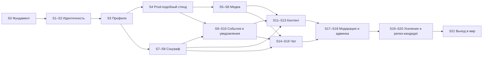

# План спринтов бэкенда messunjerr v2

> Статус: проект, черновик 2 · дата: 2026-10-05 (после S2 порядок выкладки пересмотрен: всё локально, выход в мир в S21, см. 1.1) · основа: [backend-v2-spec.md](backend-v2-spec.md) и опрос (ритм, инфраструктура, порядок, судьба старого кода).
> Эта спека отвечает на вопрос «в каком порядке и что делаем». **Что** именно строим (данные, ручки, ошибки, события, безопасность) описано в backend-v2-spec; здесь только порядок, состав спринтов, оценка и критерии приёмки. Ссылки вида «4.7» или «5.2» ведут в разделы backend-v2-spec.
> Фронтенд переписывается отдельно; здесь учтено только, **когда** бэкенд готов отдать ему очередной кусок контракта (2.5).

## Содержание

0. [Как читать документ](#0-как-читать-документ)
1. [Параметры плана](#1-параметры-плана): [решения опроса](#11-решения-опроса), [упрощения и отклонения от спеки](#12-упрощения-и-отклонения-от-backend-v2-spec), [ёмкость и сроки](#13-ёмкость-и-сроки), [соответствие фазам 4.19](#14-соответствие-фазам-из-419)
2. [Сквозные правила](#2-сквозные-правила): [неделя спринта](#21-неделя-спринта), [готовность](#22-определение-готовности), [ветки и релизы](#23-ветки-pr-и-релизы), [тесты](#24-тесты-и-пороги), [что доступно фронтенду](#25-что-доступно-фронтенду-после-спринтов), [оргзадачи](#26-оргзадачи-вне-кода)
3. [Карта плана](#3-карта-плана): [таблица спринтов](#31-таблица-спринтов), [вехи](#32-вехи), [инфраструктура по спринтам](#33-когда-появляется-инфраструктура), [зависимости](#34-зависимости), [спайки и риски](#35-спайки-и-риски)
4. [Спринты S0–S21](#4-спринты)
5. [Бэклог после 1.0](#5-бэклог-после-10)
6. [Приложения](#6-приложения): [эндпоинты по спринтам](#61-эндпоинты-по-спринтам), [таблицы БД](#62-таблицы-бд-по-спринтам), [задачи, топики, лимиты](#63-фоновые-задачи-топики-и-лимиты-по-спринтам), [шаблоны](#64-шаблоны)

---

## 0. Как читать документ

| Обозначение | Значение |
|---|---|
| Спринт | одна неделя; нумерация `S0`…`S21`; задачи нумеруются `S3-02` |
| Ч | часы чистой работы (код, тесты, документация), без совещаний и ожиданий |
| 🧱 | инфраструктура или конвейер |
| 🔬 | спайк: исследование с жёстким лимитом времени и записью решения в журнал |
| ⚖️ | юридический минимум (галочка согласия и то, что даётся «бесплатно») |
| ✅ / 🧭 / ⚠️ | как в backend-v2-spec: решено вами / предложение / риск |
| «Растяжка» | задача, которую можно отложить на следующий спринт без последствий; в таблицах помечена «(растяжка)» |

У каждого спринта одинаковые блоки: **цель**, **результат (демо)**, **зависит от**, **спецификация** (где читать детали), **задачи** с часами и итогом, **эндпоинты**, **таблицы БД**, **инфраструктура**, **приёмка**, **риски**, **не входит**. По блокам «Эндпоинты» и «Таблицы БД» скриптом проверено, что каждая ручка и каждая таблица из backend-v2-spec попала ровно в один спринт или в бэклог (приложения 6.1 и 6.2).

---

## 1. Параметры плана

### 1.1. Решения опроса

| Тема | Решение ✅ | Следствие |
|---|---|---|
| Ритм | спринт 1 неделя, ёмкость 25–40 ч в неделю | расчётная ёмкость 30 ч; плановая загрузка 20–32 ч (S4, S5 и S21 легче остальных); в спринтах выше 30 ч (S0, S1, S2, S9, S10, S14) последние задачи помечены «растяжкой», так что ядро спринта укладывается в 30 ч |
| Инфраструктура | тонкий скелет, компоненты добавляются, когда нужны | график в 3.3: Caddy, SeaweedFS и prod-подобный стенд приходят в S4, Kafka с первым потребителем (S9–S10), VPS и домен только в S21 |
| Порядок частей | сначала соцсеть, потом чат | вход → профили и медиа → граф → события и уведомления → посты → чат → модерация → усиление → выход в мир |
| Старый код v0.1 | новый код растёт рядом в `backend/src/messunjerr/`; старый `backend/src/*` живёт до паритета и удаляется | паритет (регистрация, профиль, аватар, посты) достигается к S11–S12, удаление в S13 (задача S13-04) |
| Юридическая часть | внимания не уделяем, ставим галочку согласия | см. 1.2 |
| Выход в мир | весь бэкенд собираем и гоняем локально (ноутбук 32 ГБ ОЗУ, Docker); VPS, домен, почту, вход через VK ID и Яндекс ID и выкладку делаем в самом конце (решение владельца после S2) | отдельный спринт S21 после S20; до него ничего не покупаем и не выставляем наружу, письма только в Mailpit; фронтенд начинается после S20 |

### 1.2. Упрощения и отклонения от backend-v2-spec

Чтобы не тащить в первые спринты всё, что описано в 4.20 и 6.9, принято:

1. ⚖️ **Только галочка.** При регистрации и при первом входе через VK ID или Яндекс ID пользователь отмечает чекбокс «Принимаю условия и даю согласие на обработку персональных данных» (текст содержит и «мне есть 18 лет»). Бэкенд хранит `terms_version` и `terms_accepted_at` в `identity.users`, отдаёт статический `GET /legal/documents`. Вместо объекта `consents` из 5.2 пока достаточно флага `accept_terms: true`; ошибка при его отсутствии `422 validation_error` с кодом элемента `consent_missing`.
2. ⚖️ **Остальная юридическая часть в бэклоге** (раздел 5): схема `compliance.*`, `/me/consents`, `/me/onboarding`, выгрузка данных, журнал обращений, журнал уничтожения, матрица сроков хранения, регламенты. «Бесплатно» остаётся то, что и так входит в выбор технологий: хостинг в РФ, события без персональных данных, удаление EXIF, VK ID и Яндекс ID вместо Google и GitHub.
3. **Таблица `identity.users`** в S1 получает столбцы `terms_version` и `terms_accepted_at` вместо `age_declared_at` из DDL 4.5. Поле `MeUser.required_actions` в v1 всегда пустой массив (задел под бэклог).
4. **OAuth** принимает галочку в параметре `accept_terms=1` запроса `GET /auth/oauth/{provider}/start`. Если аккаунт новый, а галочки нет, перенаправление на `/login?error=terms_required` (в каталог ошибок добавляется). Ограниченный токен `scp = "consent"` и онбординг из 4.7 не делаются. Сам вход через VK ID и Яндекс ID делается в последнем спринте (S21).
5. **События до появления Kafka.** С S1 команды пишут события в `platform.outbox` через порт `EventBus` (реализация `NullEventBus`: строки копятся). В S9 запускается relay, который публикует накопленное.
6. **Медиа до Kafka** (S5–S12): после `complete` задача `process_media` ставится в arq напрямую после коммита, а `reconcile_uploads` подхватывает зависшие ресурсы. В S13 путь переводится на событие `AssetUploaded` и потребитель `media`, как в 4.8 (временный код удаляется).
7. **Присутствие** (`presence`) приходит вместе с чатом (S16), хотя SSE появляется в S10: события `presence.*` до этого не отправляются.
8. **Один продуктовый контур.** Отдельного stage нет: до S21 всё работает на локальном prod-подобном стенде (`make up-prod-like`, S4), в S21 к нему добавляется prod на VPS.
9. **Сборщик ошибок** GlitchTip (профиль `obs`) входит в S20 и только если хватает памяти; до этого ошибки идут в JSON-логи.
10. **Выход в мир в конце** (решение владельца после S2). Весь бэкенд собираем и гоняем локально, на ноутбуке с Docker; VPS, домен, TLS Let's Encrypt, выкладка по SSH, копии наружу, SMTP провайдера и вход через VK ID и Яндекс ID делаются в последнем спринте S21. До него `AUTH_METHODS=password`, письма уходят в Mailpit, ничего не покупаем. ⚖️ Перед запуском для людей российский способ входа обязан быть включён (A33 и R11 спецификации). Фронтенд начинается после S20: до тех пор контракт проверяется через Swagger, `.http`-коллекции и демо-скрипты.

### 1.3. Ёмкость и сроки

| Показатель | Значение |
|---|---|
| Спринтов | 22 (`S0`–`S21`) |
| Плановая нагрузка | 612 ч, в среднем 27,8 ч на спринт, диапазон 20–32 ч; из них «растяжка» 31 ч, ядро плана 581 ч |
| Расчётная ёмкость | 30 ч (диапазон 25–40): ядро спринта не превышает 30 ч, с «растяжкой» до 32 ч; при середине диапазона (32,5 ч) запас около 14% |
| Срок при 30 ч в неделю | 22 недели (около 5 месяцев) |
| Срок при 40 ч / при 25 ч | около 16 недель / около 25 недель |
| Календарь | при старте в понедельник 12.10.2026 план заканчивается около 15.03.2027; новогодние каникулы добавляют 1–2 недели |

⚠️ Это уточнённая оценка по задачам снизу вверх: в опросе я называл «14–16 спринтов», а реальный объём спецификации (около 140 эндпоинтов, чат с WebSocket, Kafka, медиа-конвейер) оказался равен 21 спринту; 22-й (S21) добавило решение выходить в мир в самом конце. Если нужно быстрее, режем в таком порядке: сначала S17–S18 (модерация и админка уходят после запуска для друзей), затем часть S19–S20. «Минимальный релиз для друзей» возможен после S13 и S21 (388 + 27 = 415 ч): S21 не зависит от S14–S20 и при желании делается раньше, тогда чат строится уже на боевом стенде. Полный функционал с чатом готов после S16 (475 ч), весь план вместе с выходом в мир занимает 612 ч. Оценки консервативны: при работе вместе с ассистентом фактическое время может быть меньше.

### 1.4. Соответствие фазам из 4.19

| Фаза 4.19 | Спринты |
|---|---|
| 0. Фундамент и спайки | S0 (каркас), S4 (prod-подобный стенд, спайки SSE/WS через Caddy и presigned URL), S9 (спайк aiokafka), S21 (спайк VK ID и Яндекс ID) |
| 1. Идентичность | S1, S2, S21 (OAuth) |
| 2. Профили и медиа | S3, S5, S6; поиск людей в S8 |
| 3. Социальный граф | S7, S8; relay и уведомления S9–S10 |
| 4. Контент | S11, S12, S13 |
| 5. Чат | S14, S15, S16 |
| 6. Модерация | S17, S18 |
| 7. Усиление | S19, S20 |
| 8. По желанию | бэклог (раздел 5) |

Разница с 4.19: Kafka введена не на старте, а вместе с первым потребителем; prod-подобный стенд собирается рано (S4), а выход в мир (VPS, домен, вход через VK ID и Яндекс ID) вынесен в самый конец (S21).

---

## 2. Сквозные правила

### 2.1. Неделя спринта

Предлагаемый ритм для одного разработчика (≈ 30 ч):

| День | Что |
|---|---|
| Пн | планирование (30 минут): прочитать блок спринта, уточнить порядок задач, подготовить окружение; сразу самая рискованная задача |
| Вт–Чт | работа по задачам; каждая задача заканчивается тестами и обновлением `.http`-коллекции |
| Пт | дожим «растяжки»; демо самому себе по сценарию из блока «Результат»; запись в журнал решений; ретро (15 минут: что замедлило, что менять); черновик следующего спринта |

Правило остановки: если к четвергу ясно, что спринт не закрыть, из плана убираются «растяжка» и последняя задача, а не качество тестов.

### 2.2. Определение готовности

**Задача готова**, когда: код проходит `ruff`, `pyright`, `import-linter`; есть тесты на успешный путь и основные ошибки; миграция идёт «вперёд» и совместима со старой версией кода (схема «расширить → мигрировать → сузить»); изменения контракта отражены в OpenAPI.

**Эндпоинт готов** (из 4.17), когда: описан в OpenAPI с примерами; перечислены коды ошибок и они есть в каталоге 5.14; есть тесты политики доступа; назначен бакет лимитов; события задокументированы; чувствительные действия пишут аудит; ручка добавлена в `.http`-коллекцию.

**Спринт готов**, когда: выполнены пункты блока «Приёмка»; CI зелёный на `main`; образ собран и (с S4) поднимается на локальном prod-подобном стенде без простоя (в S21 выкатывается на VPS); сценарий из «Результата» проходит руками и тестом; запись в журнал решений и обновлённый перечень открытых вопросов; тег `v2.0.0-sN`.

### 2.3. Ветки, PR и релизы

- Trunk-based: короткие ветки `sN/задача`, PR в `main` даже при работе в одиночку (CI и самопроверка по шаблону из 6.4), история линейная.
- Каждый спринт заканчивается тегом `v2.0.0-sN`. С S4 CI собирает и проверяет prod-образ, а выкладку на VPS тег запускает только в S21. Релиз-кандидат — тег `v1.0.0-rc1` в S20, релиз 1.0 — тег `v1.0.0` в S21.
- Миграции Alembic только вперёд, никаких правок уже применённых ревизий; каждая миграция проверяется «с нуля до head» и `alembic check`.
- Контракт API до релиза 1.0 можно менять, но каждое изменение записывается в `docs/api-changelog.md` (ведётся с S3), чтобы фронтенд не узнавал о нём из ошибок.

### 2.4. Тесты и пороги

| Когда | Порог |
|---|---|
| с S0 | `core`, `policies`, команды: тест на каждую публичную функцию; CI красный при падении любого теста |
| с S2 | покрытие ядра и политик ≥ 80% |
| с S7 | политики: property-тесты (hypothesis) для матрицы доступа 4.6 |
| с S9 | интеграционные тесты событий на реальном Kafka |
| с S13 | покрытие ядра, политик и команд ≥ 90%, всего ≥ 85%; `schemathesis` по OpenAPI в CI |
| с S15 | тесты реального времени на двух инстансах API |
| S19 | нагрузочные пороги: p95 ленты < 150 мс, p95 доставки сообщения < 500 мс |

### 2.5. Что доступно фронтенду после спринтов

Фронтенд переписывается отдельно. По решению владельца он начинается после S20, когда бэкенд готов и работает локально; таблица показывает, когда готов очередной кусок контракта (на случай, если решение изменится). Первая проверка клиента: два аккаунта в двух браузерах переписываются в чате.

| После спринта | Фронтенд может делать |
|---|---|
| S2 | регистрация, подтверждение почты, вход, выход, сессии, смена и сброс пароля |
| S3 | страница профиля и настройки приватности, удаление аккаунта |
| S6 | загрузка файлов и аватар |
| S8 | друзья, подписки, блокировки, поиск людей |
| S10 | уведомления и SSE, счётчики |
| S13 | посты, лента, комментарии, реакции, поиск, хэштеги |
| S16 | чат целиком: беседы, группы, сообщения, присутствие |
| S18 | интерфейс модератора и администратора |
| S21 | вход через VK ID и Яндекс ID, работа с боевым адресом |

### 2.6. Оргзадачи вне кода

Это не часы разработки, но у них есть сроки ожидания; их нужно начинать заранее. До S21 ничего из этого не нужно: всё работает локально, письма уходят в Mailpit.

| Когда начать | Что | Ожидание |
|---|---|---|
| за 2–3 недели до S21 | купить домен (`.ru`), поднять DNS-зону; заказать VPS в РФ (4 vCPU, 8 ГБ ОЗУ или больше: размер подскажут замеры под лимитами стенда в S4 и S9), оформить S3-хранилище российского провайдера для копий | до суток; 1–3 дня |
| за 2–3 недели до S21 | зарегистрировать приложения VK ID и Яндекс OAuth (redirect URI на домен), выбрать почтового провайдера в РФ и настроить SPF, DKIM, DMARC | VK ID: проверка до нескольких дней |
| за неделю до S21 | написать минимальный текст условий и согласия для чекбокса, опубликовать страницу; составить список друзей для запуска и способ сбора обратной связи | 1–2 часа по шаблону |
| до приглашения людей | ⚖️ юридический минимум вне разработки (B-06): уведомление Роскомнадзора, политика обработки персональных данных, договоры с хостингом, почтой и хранилищем копий | сроки уточнить заранее |

---

## 3. Карта плана

Порядок выстроен по трём правилам: (1) сначала то, на что опирается остальное: вход, профили, граф; (2) рискованное делается рано и в рамках лимита времени: спайки в S4 и S9 (внешние провайдеры VK ID и Яндекс ID проверяются в S21); (3) каждый спринт заканчивается тем, что можно запустить и показать.

### 3.1. Таблица спринтов

| № | Название | Результат | Ч | Что добавляется в инфраструктуру |
|---|---|---|---:|---|
| S0 | Фундамент: скелет и конвейер | `make up && make test` зелёные, CI, миграции, problem+json | 31 | PostgreSQL 18, Redis, Mailpit, GitHub Actions |
| S1 | Идентичность I: регистрация и вход | регистрация → письмо → подтверждение → вход → `/me` | 31 | arq-воркер |
| S2 | Идентичность II: сессии и пароли | refresh с ротацией, сессии, сброс пароля, лимиты, идемпотентность | 31 | воркер `default` (cron) |
| S3 | Профили и приватность | профиль, настройки, ник, удаление аккаунта | 26 | — |
| S4 | Prod-подобный стенд | Caddy с локальным TLS, лимиты как у VPS, SeaweedFS, репетиции выкладки и копий | 24 | Caddy, prod Compose, SeaweedFS, pgBackRest |
| S5 | Медиа I: загрузка | загрузка по presigned URL, статусы, квоты | 20 | `worker-media` (очередь `media`) |
| S6 | Медиа II: обработка и аватары | WebP-варианты, EXIF, аватары, метрики | 28 | — |
| S7 | Соцграф I: дружба и блокировки | заявки, друзья, блокировки, матрица доступа | 28 | — |
| S8 | Соцграф II: подписки и поиск людей | подписки, закрытые профили, поиск, seed 5 000 | 26 | — |
| S9 | События I: Kafka и relay | outbox → Kafka, Protobuf, каркас потребителей, DLQ | 31 | Kafka, Karapace, `relay` |
| S10 | Уведомления и SSE | уведомления, SSE, письма, tickets | 31 | `consumer-notifier` |
| S11 | Посты и лента | посты, видимость, стена, лента, хэштеги, упоминания | 29 | — |
| S12 | Комментарии и реакции | комментарии, реакции, уведомления по ним | 26 | — |
| S13 | Поиск и паритет | поиск постов и тегов, удаление старого кода, e2e-сценарий | 26 | `consumer-media` |
| S14 | Чат I: беседы и сообщения | REST чата, порядок id, правка и удаление, прочтение | 31 | — |
| S15 | Чат II: WebSocket | WS-хаб, Redis Pub/Sub, «печатает…», обратное давление | 27 | — |
| S16 | Чат III: группы, вложения, присутствие | группы и роли, вложения, реакции, presence | 29 | — |
| S17 | Модерация I | жалобы, снимки, очередь, санкции | 30 | — |
| S18 | Админка и жизненный цикл аккаунта | администрирование, уничтожение аккаунта, обслуживание | 26 | — |
| S19 | Усиление I: нагрузка и безопасность | k6, оптимизация, ASVS, деградации | 28 | k6 |
| S20 | Усиление II и релиз-кандидат | восстановление, оповещения, runbook'и, `v1.0.0-rc1` | 26 | GlitchTip (по ресурсам) |
| S21 | Выход в мир | VPS за Caddy с TLS, CD, копии наружу, вход через VK ID и Яндекс ID, `v1.0.0` | 27 | VPS в РФ, домен, S3 для копий, SMTP |
| | **Итого** | | **612** | |

### 3.2. Вехи

| Веха | После | Что работает | Кому показываем |
|---|---|---|---|
| M0 Скелет | S0 | CI, миграции, health, ошибки | никому |
| M1 Вход | S2 | регистрация, вход, сессии, пароли | себе |
| M2 Стенд | S4 | prod-подобный стенд: Caddy с локальным TLS, лимиты ресурсов, SeaweedFS, репетиции выкладки и копий | себе |
| M3 С аватарами | S6 | медиа и аватары | себе |
| M4 Друзья | S8 | дружба, подписки, закрытые профили, поиск людей | себе |
| M5 Живая сеть | S10 | уведомления и SSE | себе |
| M6 Стена | S13 | посты, лента, комментарии, реакции, поиск; старый код удалён | себе |
| M7 Чат | S16 | весь функционал, кроме модерации | себе |
| M8 Порядок | S18 | модерация, админка, удаление аккаунта | — |
| M9 Релиз-кандидат | S20 | усиление, восстановление, runbook'и, `v1.0.0-rc1` | себе |
| M10 В мире | S21 | VPS, домен, TLS, CD, копии наружу, вход через VK ID и Яндекс ID, `v1.0.0` | друзьям, затем всем желающим |

До S21 все вехи принимаются локально. Клиент пишется после S20, поэтому до тех пор вехи показываются через Swagger, `.http`-коллекции и демо-скрипты.

### 3.3. Когда появляется инфраструктура

| Компонент | Спринт | Почему именно тогда |
|---|---|---|
| PostgreSQL 18, Redis, Mailpit, GitHub Actions | S0 | нужны с первой строки кода |
| arq-воркер | S1 | письма подтверждения |
| воркер `default` (cron arq) | S2 | очистка неподтверждённых аккаунтов, просроченных токенов и ключей |
| Caddy, prod-подобный Compose (`make up-prod-like`), SeaweedFS, pgBackRest в локальный S3 | S4 | весь боевой контур, кроме сервера, поднимается на ноутбуке с лимитами VPS: выкладка, копии и хранилище репетируются до выхода в мир |
| Kafka (KRaft), Karapace, `buf`, `outbox-relay` | S9 | к этому моменту накопились события графа, готов первый потребитель |
| `consumer-notifier` | S10 | уведомления |
| `consumer-media` | S13 | перевод медиа на событийный путь |
| k6 | S16 (дым), S19 (полный прогон) | нагрузка чата и ленты |
| GlitchTip (профиль `obs`) | S20 | по оставшимся ресурсам |
| VPS в РФ, домен, CD по SSH, S3 провайдера для копий, SMTP провайдера | S21 | выход в мир в самом конце: до него ничего не покупаем (решение владельца) |

⚠️ К S9 нужно проверить бюджет памяти под лимитами стенда (8 ГБ, 4 ядра): Kafka добавляет около 1,5 ГБ, Karapace около 0,3 ГБ (2.3); запас остаётся небольшим. Размер настоящего VPS выберем по этим замерам перед S21.

### 3.4. Зависимости

Критический путь: S0 → S1 → S2 → S3 → S4 → S7 → S9 → S10 → S11 → S14 → S15 → S17 → S19 → S20 → S21. Медиа (S5–S6) и граф (S7–S8) можно менять местами, если вдруг понадобятся друзья раньше аватаров; события (S9) нельзя ставить раньше графа, потому что им нечего публиковать. S21 не зависит от S14–S20: при желании его делают раньше, например после S13, чтобы запустить сеть без чата.

### 3.5. Спайки и риски

| Спринт | Спайк или риск | Лимит | Что выясняем | Запасной вариант |
|---|---|---|---|---|
| S4 | 🔬 SSE и WebSocket через Caddy ✅ закрыт (итоги S4, п. 2) | 2 ч внутри S4-02 | потоки не буферизуются, WS проходит | `flush_interval -1`, отдельный `handle` |
| S4 | 🔬 presigned PUT и GET SeaweedFS за Caddy (R3) ✅ закрыт (итоги S4, п. 1) | 5 ч (S4-05) | подпись SigV4 не ломается | отдельный поддомен для S3 или S3 провайдера |
| S9 | 🔬 aiokafka × Kafka 4.x × Karapace × Protobuf (R1) | 5 ч (S9-01) | какой клиент брать | `confluent-kafka` AIO за `EventBus` или брокер 3.9 |
| S9 | ресурсы под лимитами стенда: 8 ГБ, 4 ядра (R4) | в S9-02 | хватает ли памяти | поднять лимит и взять VPS на 12 ГБ или временный `ArqEventBus` |
| S15 | WebSocket на двух инстансах | в задачах S15 | Redis Pub/Sub между репликами | — |
| S19 | производительность ленты и чата | весь S19 | p95 по порогам 4.17 | кэш первой страницы ленты (4.10), индексы |
| S21 | 🔬 VK ID и Яндекс ID: PKCE, `device_id`, отсутствие email | 3 ч внутри S21-05 | реальные параметры провайдеров | сначала только Яндекс ID, VK ID позже |
| S21 | поздний выход в мир: сюрпризы боевого окружения (TLS, прокси, мобильные сети, память сервера) | весь S21 | то, что локальный стенд не показал | закрытый запуск для 2–3 человек, запас 2–3 дня на правки |

---

## 4. Спринты

### Спринт 0. Фундамент: скелет и конвейер

**Цель.** Пустое, но боевое приложение: структура v2, инструменты, миграции, тесты и CI, чтобы дальше работать только над функциями.

**Результат (демо).** `make up && make test` зелёные на чистой машине; `GET /health/ready` показывает PostgreSQL и Redis и отвечает `503`, если Redis остановлен; любая ошибка возвращается как `application/problem+json`; CI зелёный.

**Зависит от:** —. **Спецификация:** 3.2, 4.2–4.5 (таблицы `platform`), 4.15, 5.1, 5.13, 6.1.

| ID | Задача | Ч |
|---|---|---:|
| S0-01 | Каркас репозитория v2: пакет `backend/src/messunjerr/` (контексты-пустышки, `core/`), `pyproject.toml` (uv, зависимости из 3.1), ruff, pyright, import-linter с контрактами 4.2, pre-commit, Makefile | 3 |
| S0-02 | Настройки (`pydantic-settings`, секреты через `*_FILE`, переменные 6.1), structlog в JSON, `X-Request-ID`, access-лог без токенов | 3 |
| S0-03 | Фабрика ASGI-приложения, префикс `/api/v1`, `/health/live`, `/health/ready`, `/api/v1/meta` (лимиты и палитра из настроек), OpenAPI 3.1 (в проде выключена) | 3 |
| S0-04 | Ошибки problem+json (RFC 9457): иерархия `DomainError`, перечисление кодов из 5.14, обработчики (валидация без эха `input`, 404, 405, 500), `request_id` в ответе | 4 |
| S0-05 | БД: SQLAlchemy 2.1 async + asyncpg, пулы, Alembic (async-шаблон), миграция 0001 (схемы, расширения `citext`, `pg_trgm`, `unaccent`, роли `app`, `migrator`, `readonly`) | 4 |
| S0-06 | Unit of Work, outbox, таблицы `platform.*`, after-commit hooks, порт `EventBus` и `NullEventBus` | 4 |
| S0-07 | `core`: UUIDv7, непрозрачные курсоры пагинации, Redis-клиент, проверка готовности | 2 |
| S0-08 | 🧱 Compose для разработки: PostgreSQL 18 (том в `/var/lib/postgresql`), Redis (AOF), Mailpit; `.env.example`; Dockerfile на uv; `make up` | 3 |
| S0-09 | Тестовый стенд: pytest-asyncio, testcontainers (PostgreSQL 18, Redis), фабрики, httpx ASGI-клиент; тест «миграции с нуля до head» и `alembic check` | 3 |
| S0-10 | 🧱 CI (GitHub Actions): ruff, pyright, import-linter, тесты, проверка миграций, сборка образа, матрица Python 3.13 и 3.14 (растяжка) | 2 |
| | **Итого** | **31** |

**Эндпоинты:** `GET /health/live`, `GET /health/ready`, `GET /meta`, `GET /openapi.json`, `GET /docs`
**Таблицы БД:** `platform.outbox`, `platform.inbox`, `platform.idempotency_keys`, `platform.audit_log`
**Инфраструктура:** PostgreSQL 18, Redis, Mailpit (dev-Compose), GitHub Actions.

**Приёмка**

- `make up && make test` проходят с чистого клона; CI зелёный на PR.
- Миграции «с нуля до head» и `alembic check` в CI.
- Ответы 404, 405, 422, 500 имеют формат problem+json с `request_id` и без эха входных значений.
- Нарушение границы между контекстами красит `import-linter` (есть тест на нарушение).
- Откат транзакции откатывает и строку outbox; after-commit hook при откате не вызывается (тест).

**Риски.** ⚠️ pyright в строгом режиме с SQLAlchemy 2.1 и FastAPI 0.x: допускается точечный `# pyright: ignore[...]` с причиной. ⚠️ Python 3.14: если зависимость без колёс, закрепляемся на 3.13 (R8).
**Не входит.** Любые доменные ручки, Caddy, arq, Kafka.

**Итоги (сделан 2026-10-05).**

- Проверено на локальном стеке Docker: 125 тестов (unit и интеграционные на PostgreSQL 18 и Redis 8), ruff, pyright strict (0 ошибок), import-linter (2 контракта целы), `alembic check` без расхождений, миграции «с нуля до head» и откат/накат, `GET /health/ready` отвечает `503` с `redis: down` при остановленном Redis и снова `200` после его запуска, горячая перезагрузка API при правке исходников.
- Отклонения от плана:
  1. **S0-09:** вместо testcontainers тесты берут PostgreSQL и Redis из Compose (локально) или из `services` GitHub Actions (CI). Тестам внутри контейнера понадобился бы `docker.sock`, а свои сервисы у стенда и так есть. Каждый прогон создаёт временную базу `mj_test_*` и в конце удаляет её. Фабрики тестовых данных появятся вместе с первой доменной таблицей (S1).
  2. **S0-10:** workflow `.github/workflows/backend.yml` проверен `actionlint`, а на GitHub первый прогон (коммит `bfa01ce`, спринт 1) прошёл полностью зелёным: линтеры и типы, тесты на Python 3.14 и 3.13, сборка образа. Матрица Python 3.14 и 3.13 включена; те же 125 тестов локально проходят и на 3.14.0, и на 3.13.16.
  3. **S0-01:** на Windows нет `make`, поэтому рядом с Makefile лежит `dev.ps1` с тем же набором команд.
  4. До S13 тесты v2 запускаются с `-c pyproject.toml`: старый `backend/pytest.ini` остаётся до удаления v0.1.
- Что поймали интеграционные тесты: роль `app` не имела права читать `alembic_version`, и `/health/ready` показывал `migrations: unknown`. Право `SELECT` выдаёт миграция 0001; на это есть тесты.

### Спринт 1. Идентичность I: регистрация и вход

**Цель.** Человек регистрируется, подтверждает почту и входит.

**Результат (демо).** Через `.http`: регистрация → письмо в Mailpit → подтверждение → вход → `GET /me`; тот же сценарий проходит автотестом.

**Зависит от:** S0. **Спецификация:** 4.7, 5.2, 5.3 (`GET /me`), 5.14.

| ID | Задача | Ч |
|---|---|---:|
| S1-01 | Миграция identity: `users` (со столбцами `terms_version`, `terms_accepted_at`), `email_tokens`, `sessions` | 2 |
| S1-02 | Пароли: pwdlib Argon2id в пуле потоков, политика (10–128 символов, список частых паролей), выравнивание времени ответа | 3 |
| S1-03 | `POST /auth/register`: схемы, нормализация (`citext`), одинаковый ответ при занятом адресе, ⚖️ флаг `accept_terms` → `terms_version` и `terms_accepted_at`, событие `UserRegistered`; `GET /auth/username-available` | 5 |
| S1-04 | arq: воркер (очереди `email` и `default`), порт `JobQueue`, `send_email` (aiosmtplib, Jinja2, шаблоны на русском, Mailpit), повторы | 5 |
| S1-05 | Одноразовые токены из писем (хэш, срок, использование): `POST /auth/verify-email` (событие `EmailVerified`), `POST /auth/resend-verification` | 3 |
| S1-06 | JWT: Ed25519, `kid`, access 10 минут, JWKS, зависимость `current_user` (проверка `iss`, `aud`, `exp`, `scp`) | 4 |
| S1-07 | `POST /auth/login`: проверка пароля и статуса, создание сессии, refresh-токен (хэш SHA-256) в cookie `__Secure-mj_refresh`; ротация в S2 | 4 |
| S1-08 | `GET /me` (пока без профиля) | 1 |
| S1-09 | ⚖️ Статический `GET /legal/documents` (версия, ссылки, страницы-заглушки) (растяжка) | 1 |
| S1-10 | Тесты: сценарий «регистрация → письмо → подтверждение → вход → `/me`», негативные случаи, перечисление пользователей | 3 |
| | **Итого** | **31** |

**Эндпоинты:** `POST /auth/register`, `POST /auth/verify-email`, `POST /auth/resend-verification`, `POST /auth/login`, `GET /auth/username-available`, `GET /.well-known/jwks.json`, `GET /me`, `GET /legal/documents`
**Таблицы БД:** `identity.users`, `identity.email_tokens`, `identity.sessions`
**Инфраструктура:** контейнер `worker` (arq).

**Приёмка**

- Сценарий проходит автотестом и руками; без `accept_terms: true` регистрация невозможна (`consent_missing`).
- Регистрация на занятый и на свободный email неотличима по ответу и времени (тест).
- Пароли хранятся как Argon2id; JWKS отдаёт `kid`; просроченный токен даёт `401 token_expired`.
- Токен подтверждения одноразовый и истекает через 24 часа; вход в статусе `pending` даёт `403 email_not_verified`.
- Хэширование пароля не блокирует цикл событий (тест на параллельных запросах).

**Риски.** ⚠️ Argon2id нагружает процессор: при нехватке ядер подбираем параметры. R2: arq остаётся за портом `JobQueue`.
**Не входит.** Ротация refresh, список сессий, сброс пароля, лимиты (S2); профиль (S3).

**Итоги (сделан 2026-10-05).** Сценарий «регистрация → письмо в Mailpit → подтверждение → вход → `GET /me`» проходит и автотестом (сквозной тест гоняет настоящие arq и SMTP), и руками на стеке Docker; коллекция запросов лежит в `backend/http/auth.http`. Выполнены все задачи S1-01…S1-10, включая «растяжку» S1-09. Проверено: ruff, pyright strict, import-linter (добавлен контракт раскладки внутри контекста), `alembic check`, тесты на Python 3.14 и 3.13.

Отклонения от плана и принятые решения:

1. **arq и redis-py (R2 сработал частично).** arq 0.28.0 (апрель 2026) заявляет `redis<6`, а проект на redis-py 8.1. Эмпирически они совместимы: enqueue, дедупликация по `job_id`, повторы и отложенный запуск работают, есть два `DeprecationWarning` (`retry_on_timeout`, `close()`). Пин снят через `[tool.uv] override-dependencies`, предупреждения заглушены точечно, связку сторожит тест `test_arq_compat`. Если сломается, запасной вариант Taskiq (`taskiq-redis` поддерживает redis 8); код команд знает только порт `JobQueue`. Задачи сериализуются в JSON, не в pickle: запись в Redis не даёт выполнения кода в воркере.
2. **Воркер по одному процессу на очередь.** arq 0.28 не слушает несколько очередей сразу, поэтому `python -m messunjerr worker --queue email`. Задачи пока есть только в очереди `email`; воркеры `default` и `media` появятся вместе с их задачами (S2, S5). Воркер запускается через `asyncio.run(worker.async_run())`: штатный `arq` CLI берёт цикл через `get_event_loop()`, а в Python 3.14 это ошибка. В Compose воркер перезапускается при правке кода (`--reload`), состояние видно через `worker --check`.
3. **Письмо ставится в очередь до коммита.** Если очередь недоступна, адаптер отвечает `503`, транзакция откатывается и аккаунта нет; обратное («аккаунт есть, письма нет») невозможно. Цена: возможно письмо с токеном, который не записался из-за отката, такая ссылка просто недействительна. Токен лежит в аргументах задачи, поэтому результаты задач `send_email` не сохраняются (`keep_result=0`). Ссылка в письме держит токен во фрагменте (`/verify-email#token=…`): он не попадает ни в журналы Caddy, ни в `Referer`.
4. **Повторная регистрация одного адреса.** Ответ всегда `201`. Активный аккаунт: ничего не меняется, владельцу уходит письмо «вы уже зарегистрированы». Неподтверждённый: данные регистрации заменяют прежние, прежние токены гаснут (иначе тот, кто первым занял чужую почту, оставил бы на ней свой пароль: pre-hijacking). Во всех ветках считается один Argon2id-хэш, время ответа от ветки не зависит (тест на тяжёлых параметрах). Занятый ник всегда даёт `409`, независимо от почты.
5. **Поля профиля при регистрации.** `display_name`, `language`, `timezone` пока не принимаются (`unknown_field`): таблицы профиля нет до S3-01, поля добавятся вместе с ней. Галочку `accept_terms` проверяет команда, а не схема: `consent_missing` приходит в одном ответе вместе с зарезервированным ником и слабым паролем.
6. **`resend-verification`** выполняет работу после отправки ответа (фоновая задача запроса): ни время, ни сбои очереди не выдают, есть ли адрес. Сбой очереди откатывает выдачу нового токена, прежний остаётся рабочим.
7. **JWT.** Ключ задаёт `JWT_PRIVATE_KEY` (PEM или seed Ed25519 в base64url для разработки, `JWT_PRIVATE_KEY_FILE` в проде); `kid` по умолчанию отпечаток ключа (RFC 7638). В prod и stage без ключа процесс не стартует (`check_runtime`), в dev и test ключ временный. Проверка denylist `sess:revoked:{sid}` уже работает (пишет её S2); при недоступном Redis общие ручки продолжают работать. Ограниченные токены (`scp`) не принимаются.
8. **Argon2id** настраивается (`ARGON2_*`; по умолчанию профиль RFC 9106 с малой памятью: t=3, 64 МиБ, p=4), хэширование идёт в потоках, число одновременных хэшей ограничено `PASSWORD_HASH_CONCURRENCY` (4). Тест с настоящими параметрами показывает, что цикл событий не простаивает. Список из 9901 частого пароля собран скриптом из SecLists (MIT), переносится в образ как данные пакета.
9. **В S2, а не в S1:** аудит входов (S2-06), лимиты запросов (S2-05), `Idempotency-Key`. Туда же добавляется крон-очистка неподтверждённых аккаунтов старше нескольких дней (иначе они занимают ники и почту).
10. Дополнительно: блок `legal` в `GET /api/v1/meta`; `GET /api/v1/legal/documents` (растяжка S1-09) отдаёт одну запись `terms` с версией из `LEGAL_TERMS_VERSION`; полный реестр документов остаётся в бэклоге B-01.

### Спринт 2. Идентичность II: сессии, пароли, лимиты

**Цель.** Безопасные сессии, смена и сброс пароля, защита от перебора и повторов.

**Результат (демо).** Показать ротацию refresh и обнаружение повторного использования, «выйти везде», сброс пароля с письмами; 21-я попытка входа с одного IP за 10 минут даёт `429`.

**Зависит от:** S1. **Спецификация:** 4.7, 4.14 (лимиты и аудит), 5.1 (идемпотентность, заголовки), 5.2.

| ID | Задача | Ч |
|---|---|---:|
| S2-01 | `POST /auth/refresh`: ротация, окно гонки 10 с, обнаружение повторного использования, denylist `sess:revoked:{sid}`, CSRF-проверки (`X-Requested-With`, `Origin`) | 6 |
| S2-02 | Выход и сессии: `POST /auth/logout`, `POST /auth/logout-all` (с паролем), `GET /auth/sessions`, `DELETE /auth/sessions/{session_id}` | 4 |
| S2-03 | Пароль: `POST /auth/password/forgot`, `/reset`, `/change`; письма безопасности; отзыв сессий; событие `PasswordChanged` | 4 |
| S2-04 | Почта: `POST /auth/email/change`, `POST /auth/email/confirm` (растяжка) | 3 |
| S2-05 | Лимиты запросов: Lua token bucket в Redis, зависимость и заголовки `RateLimit-*`, `Retry-After`, `ratelimits.toml`, бакеты `auth_*`, `username_check_ip`, `api_read`, `api_write`; деградация при недоступном Redis по 4.7 | 5 |
| S2-06 | Аудит: запись в `platform.audit_log` (вход, выход, смена пароля, повторное использование refresh, отзыв сессий) | 2 |
| S2-07 | `Idempotency-Key`: зависимость, хранение в `platform.idempotency_keys`, `idem:lock`, ошибки `idempotency_key_reuse` и `request_in_progress` | 3 |
| S2-08 | Тесты безопасности: повторное использование refresh, гонка двух вкладок (параллельные запросы), перебор, лимиты, CSRF | 4 |
| | **Итого** | **31** |

Сверх оценки добавлена **S2-09** (≈3 ч): плановая очистка неподтверждённых аккаунтов, просроченных токенов писем и ключей идемпотентности, воркер очереди `default` с cron-задачами (решение п. 9 итогов S1).

**Эндпоинты:** `POST /auth/refresh`, `POST /auth/logout`, `POST /auth/logout-all`, `GET /auth/sessions`, `DELETE /auth/sessions/{session_id}`, `POST /auth/password/forgot`, `POST /auth/password/reset`, `POST /auth/password/change`, `POST /auth/email/change`, `POST /auth/email/confirm`
**Таблицы БД:** — (`platform.audit_log` и `platform.idempotency_keys` созданы ещё в S0)
**Инфраструктура:** Redis теперь хранит лимиты, denylist сессий и замки идемпотентности; новый воркер `worker-default` (очередь `default`) в Compose.

**Приёмка**

- Старый refresh после ротации: в окне 10 с выдаётся только новый access, позже `401 refresh_reused` и сессия отозвана (тесты на оба случая).
- «Выйти везде» отзывает все сессии; старые access-токены перестают приниматься после попадания `sid` в denylist.
- 21-я попытка входа с IP за 10 минут: `429` с `Retry-After`; заголовки `RateLimit-*` на всех ответах.
- Повтор `POST` с тем же `Idempotency-Key` возвращает исходный ответ (`Idempotency-Replayed: true`), с другим телом `422 idempotency_key_reuse`.
- Письма безопасности (смена пароля, повторное использование) приходят в Mailpit; запись в аудите есть.

**Риски.** ⚠️ Lua-скрипт: проверить 10 000 вызовов на корректность и скорость. ⚠️ Гонка вкладок: тест с реальной параллельностью (`asyncio.gather`), а не последовательными вызовами.
**Не входит.** OAuth (S21).

**Итоги (сделан 2026-10-05).** Выполнены все задачи S2-01…S2-08, включая «растяжку» S2-04, и добавленная S2-09. Демо проходит и автотестами, и руками на стеке Docker: ротация refresh с обнаружением повторного использования, «выйти везде», сброс пароля с письмами в Mailpit, 21-я попытка входа с одного адреса даёт `429` (запросы собраны в `backend/http/auth-sessions.http`). Проверено: ruff, pyright strict, import-linter (3 контракта), тесты на Python 3.14: 622 (322 unit и 300 интеграционных на PostgreSQL 18, Redis 8 и Mailpit). На Python 3.13 локально не гонялось (на диске мало места для второго образа), его проверит CI.

Отклонения от плана и принятые решения:

1. **Refresh и повторное использование (S2-01).** Сессия берётся `SELECT … FOR UPDATE` по хэшу текущего токена, затем по `prev_refresh_hash`: параллельные вкладки выстраиваются в очередь на строке сессии (тест: шесть параллельных `refresh` одним токеном дают ровно одну ротацию). Окно гонки 10 с (`REFRESH_RACE_WINDOW_SECONDS`): только новый access, без `Set-Cookie`. Позже окна сессия закрывается (`reuse_detected`), `sid` попадает в denylist `sess:revoked:{sid}`, пишется аудит, владельцу уходит письмо «Подозрительная активность», ответ `401 refresh_reused` стирает cookie. Закрытие сессии и аудит фиксируются коммитом до выброса ошибки, иначе откат стёр бы след.
2. **CSRF.** Для `refresh` и `logout` обязателен заголовок `X-Requested-With: messunjerr`; `Origin`, если он есть, должен быть источником `PUBLIC_BASE_URL` или одним из `ALLOWED_ORIGINS`; `Sec-Fetch-Site`, если он есть, должен быть `same-origin` или `none` (вне prod допускается и `same-site`: клиент на :3000, API на :8000). Проверка идёт раньше токена и лимитов, поэтому чужой сайт не тратит бюджет чужой сессии.
3. **Лимиты (S2-05).** Token bucket одним Lua-скриптом, время берётся у Redis (`TIME`), 10 000 вызовов считаются точно и быстро (тест). Таблица бакетов `ratelimits.toml` лежит в пакете, `RATE_LIMITS_FILE` перекрывает её по полям. Политика при недоступном Redis задаётся бакетом: `auth_login_*`, `auth_register_ip`, `auth_email_*` закрыты (`503` и `Retry-After: 5`), потому что подбор пароля и рассылка без счёта недопустимы; `auth_refresh_session`, `username_check_ip`, `api_read`, `api_write` пропускают запрос с предупреждением в журнале, чтобы сбой Redis не клал всё приложение. `RateLimit-Limit`, `-Remaining`, `-Reset` приходят на ответах лимитируемых ручек, в том числе на ошибках (заголовки лежат в состоянии запроса, их достаёт обработчик ошибок); `429` несёт `Retry-After` и поле `retry_after`. Все ответы-ошибки получили `Cache-Control: no-store`. Лимитируются все ручки таблицы 6.10, кроме `POST /auth/logout` (выход всегда отвечает `204`) и статических публичных ответов (JWKS, `legal/documents`, `meta`: их закрывает Caddy).
4. **Лимит по аккаунту.** Спецификация: «5 за 15 минут, затем задержка»; сделан жёсткий отказ `429` с `Retry-After` (задержка держала бы соединения и упрощала DoS). Токен списывается до проверки пароля и возвращается после успешного входа: параллельный перебор лимит не обходит. Ключ: `id` аккаунта (почта и ник делят один бюджет), для несуществующего логина хэш логина, ответы неотличимы. Тот же бюджет тратят повторные вводы пароля (`logout-all`, смена пароля и почты): подбор через украденный access-токен упирается в тот же лимит. Известная цена: тот, кто знает чужой логин, может мешать владельцу входить (по одному запросу в три минуты); смягчение (капча, доверенные устройства) относится к B-09.
5. **Пул соединений Redis.** Тест на 200 параллельных вызовов показал, что обычный пул redis-py 8 при более чем 100 одновременных операциях отдаёт `MaxConnectionsError`, а лимитер принял бы это за недоступность Redis и пропустил запросы. Клиент теперь строится на `BlockingConnectionPool` (`REDIS_MAX_CONNECTIONS`, `REDIS_POOL_TIMEOUT_SECONDS`): при нехватке соединений вызов ждёт, и только ожидание дольше таймаута считается сбоем.
6. **Чувствительные ручки** (`logout-all`, сессии, смена пароля и почты) при недоступном denylist отвечают `503`; общие ручки работают без проверки отзыва (4.7).
7. **Сброс пароля (S2-03).** Токен из письма доказывает владение ящиком: аккаунт `pending` становится `active`, ставится `email_verified_at`, токены подтверждения гаснут (события `EmailVerified` и `PasswordChanged`), все сессии закрываются, автоматического входа нет. Проверки идут от дешёвого к дорогому: токен, правила пароля, затем Argon2id. Слабый пароль не сжигает токен: его можно ввести заново.
8. **Смена пароля.** Нужен текущий пароль; тот же пароль даёт `422` (`password_too_weak`, `meta.reason = same_as_current`); остальные сессии закрываются (`revoke_other_sessions: false` их оставит); владельцу уходит письмо «Пароль изменён».
9. **Смена почты (S2-04).** Токен уходит на новый адрес, старый получает уведомление с маской нового. Занятый и совпадающий с текущим адреса отвечают тем же `202`, но без письма. Подтверждение не трогает сессии, но гасит все выданные на прежний адрес токены (сброс пароля в том числе): иначе читавший старый ящик ещё час мог бы сбросить пароль.
10. **Идемпотентность (S2-07).** Класс маршрута `idempotent_route_class(...)`: ключ (UUID) действует в пределах пользователя; замок `idem:lock:{user}:{key}` на 60 с в Redis хранит отпечаток запроса (метод, путь, запрос, тело в каноническом JSON), ответ 2xx и `Location` на 24 часа в `platform.idempotency_keys`. Повтор: `Idempotency-Replayed: true`; другое тело, путь или запрос: `422 idempotency_key_reuse`; параллельный дубль: `409 request_in_progress` с `Retry-After`. Сбой запроса запись не оставляет, ключ можно использовать снова; запись с истёкшим сроком перезаписывается; без Redis запрос выполняется без замка, а повтор по-прежнему воспроизводится из PostgreSQL; аутентификация первична (без токена `401`, а не `422`). Создающих ручек в S2 ещё нет (первая, `POST /media/uploads`, появится в S5), поэтому подключение проверено тестовым роутером с тем же классом маршрута.
11. **Аудит (S2-06).** Пишутся вход (успех и неудача), выход, «выйти везде», закрытие сессии, повторное использование refresh, неверный повторный ввод пароля, запрос и выполнение сброса, смена пароля и почты, удаление неподтверждённых аккаунтов. Запись лежит в транзакции действия; при отказе команда фиксирует транзакцию с записью и лишь затем выбрасывает ошибку. В `data` нет почты, паролей и токенов.
12. **Плановая очистка (S2-09).** Воркер `default` (`worker-default` в Compose) с cron-задачами arq по UTC: `cleanup_unverified_accounts` раз в сутки в 03:10 удаляет `pending` без подтверждённой почты, не менявшиеся `UNVERIFIED_ACCOUNT_TTL_DAYS` (7) дней и без живого токена подтверждения (в аудит идёт запись без почты и ника); `cleanup_tokens_and_idempotency` каждый час удаляет токены писем и записи идемпотентности через 7 дней после срока (матрица 6.9.7). Удаление идёт пачками с `FOR UPDATE SKIP LOCKED`, поэтому два воркера не мешают друг другу; отдельная роль `worker --role cron` из 4.12 не нужна: cron-задачи arq уникальны на каждое срабатывание и выполняются один раз при любом числе воркеров. `cleanup_sessions` и очистка IP и User-Agent остаются за S18.
13. **Проверки живости воркеров.** `worker --check` и `healthcheck` перестали импортировать воркер целиком: на медленном диске bind-mount импорт не укладывался в таймаут проверки Docker, и воркеры считались нездоровыми.
14. **Тесты безопасности (S2-08).** Повторное использование и окно гонки, шесть параллельных `refresh`, перебор пароля через вход и через повторный ввод, CSRF (заголовок, `Origin`, `Sec-Fetch-Site`), все лимиты через приложение (включая 21-ю попытку, неразличимость известного и неизвестного логина, сбой Redis), Lua-скрипт на настоящем Redis (200 параллельных вызовов, 10 000 вызовов), идемпотентность (двадцать параллельных дублей выполняют ручку один раз), очистка (два параллельных воркера удаляют каждый аккаунт ровно один раз).
15. **Спецификация.** В таблицу 6.1 добавлены переменные S2 (`REFRESH_RACE_WINDOW_SECONDS`, `PASSWORD_RESET_TTL_MINUTES`, `EMAIL_CHANGE_TTL_MINUTES`, `UNVERIFIED_ACCOUNT_TTL_DAYS`, `IDEMPOTENCY_TTL_HOURS`, `ALLOWED_ORIGINS`, `RATE_LIMITS_ENABLED`, `REDIS_MAX_CONNECTIONS`, `REDIS_POOL_TIMEOUT_SECONDS`); `RATE_LIMITS_FILE` теперь необязательный файл поверх встроенной таблицы.

### Спринт 3. Профили и приватность

**Цель.** У человека есть профиль и настройки приватности; другие видят его по правилам.

**Результат (демо).** Создать и поправить профиль, сменить ник, сделать профиль закрытым, удалить и восстановить аккаунт.

**Зависит от:** S2. **Спецификация:** 4.5 (profile), 4.6, 5.3.

| ID | Задача | Ч |
|---|---|---:|
| S3-01 | Миграция `profile.profiles`, `profile.privacy_settings`; создание строк при регистрации | 2 |
| S3-02 | `PATCH /me/profile` (био, ссылки, город, язык, часовой пояс, дата рождения с проверкой возраста `MIN_AGE`, `is_private`; `avatar_asset_id` пока даёт `asset_not_found`), `GET /me/privacy`, `PATCH /me/privacy` | 5 |
| S3-03 | `GET /users/{ref}` (UserProfile, `relationship` пока заглушка), `PATCH /me/username` (раз в 30 дней, старый ник резервируется) | 4 |
| S3-04 | `GET /me` дополняется профилем, настройками, нулевыми `counters` и пустым `required_actions` | 1 |
| S3-05 | Модуль политик (`policies`, 4.6) для профиля; каркас property-тестов (hypothesis) | 4 |
| S3-06 | Удаление аккаунта: `DELETE /me`, `POST /me/restore`, статус `deletion_pending`, ограничение `account_deletion_pending`, отзыв сессий, событие `UserDeletionRequested` (уничтожение данных в S18) | 4 |
| S3-07 | Seed-данные (`make seed`), коллекция `.http` по готовым ручкам, примеры OpenAPI, `docs/api-changelog.md` | 3 |
| S3-08 | Тесты политик профиля (открытый и закрытый, видимость даты рождения, блокировки-заглушки) | 3 |
| | **Итого** | **26** |

Оргзадачи (заявки VK ID и Яндекс OAuth, заказ VPS, S3 для копий, DNS, почтовый провайдер) перенесены в S21 (S21-07).

Сверх оценки добавлены **S3-09** (≈3 ч): резерв прежних ников (таблица `identity.username_reservations`, учёт в регистрации, смене ника и `GET /auth/username-available`, очистка в `cleanup_tokens_and_idempotency`) и **S3-10** (≈5 ч): порты identity к профилям и публичный интерфейс `identity/api_public.py` (без них `GET /me` и ответы входа не получили бы профиль, не нарушив граф контекстов 4.2) и ограничение `account_deletion_pending` через признак в Redis (решение п. 6 итогов).

**Эндпоинты:** `PATCH /me/profile`, `PATCH /me/username`, `GET /me/privacy`, `PATCH /me/privacy`, `DELETE /me`, `POST /me/restore`, `GET /users/{ref}`
**Таблицы БД:** `profile.profiles`, `profile.privacy_settings`, `identity.username_reservations` (сверх DDL 4.5, S3-09)
**Инфраструктура:** без новых компонентов; в Redis появился ключ `acct:deletion:{user_id}` (4.13).

**Приёмка**

- Профиль читается и правится, поля валидируются (ссылки, возраст по `birth_date`).
- Закрытый профиль показывает чужим ник, имя, био и счётчики, но не дату рождения.
- Смена ника не чаще раза в 30 дней; старый ник занят 30 дней.
- `DELETE /me` отзывает остальные сессии; разрешены только `GET /me`, `POST /me/restore`, выход, остальное `403 account_deletion_pending`.

**Риски.** Существенных нет: оргзадачи (VK ID, VPS, домен) отложены до S21 (2.6).
**Не входит.** Друзья и `relationship` (S7), аватар (S6), оргзадачи выхода в мир (S21).

**Итоги (сделан 2026-10-05).** Выполнены все задачи S3-01…S3-08 и добавленные S3-09 и S3-10. Демо проходит и автотестами, и руками на стеке Docker: регистрация с профилем, правка профиля и приватности, чужой профиль открытый и закрытый, смена ника с паузой и резервом, удаление и восстановление аккаунта (запросы собраны в `backend/http/profile.http`, учебные аккаунты создаёт `make seed`). Проверено: ruff, pyright strict (0 ошибок), import-linter (5 контрактов), `alembic check`, тесты на Python 3.14: 1169 (612 unit и 557 интеграционных на PostgreSQL 18, Redis 8 и Mailpit; до S3 было 622). На Python 3.13 локально не гонялось (на диске мало места для второго образа), его проверит CI.

Отклонения от плана и принятые решения:

1. **Порты вместо импортов (S3-04, S3-10).** identity стоит ниже profiles, а `MeUser` из 5.3 собирается из обоих и входит в ответы `login`, `refresh`, `verify-email`. Поэтому модели разделов (`MeProfile`, `PrivacySettings`, `MeCounters`, `RequiredAction`) лежат в `core/me.py`, а identity знает два порта в `identity/infra/ports.py`: `ProfileProvisioner` (создать профиль при регистрации) и `MeExtrasProvider` (разделы `MeUser`). Реализует оба `ProfileServices`, соединяет корень приложения (`main.py`). В обратную сторону profiles берёт у identity только `identity/api_public.py` (зависимости аутентификации, карточка аккаунта, порты): новый контракт import-linter запрещает остальное, а контракт слоёв (`api`, `commands`, `queries`, `infra`, `domain`) добавлен и для profiles. Порты profiles к контекстам выше (`AvatarAssets` к медиа, `Relationships` к графу, `ProfileCounters`) пока заглушки (`NoMediaYet`, `NoGraphYet`, `ZeroCounters`): настоящие подставят S6, S7–S8 и S11 при сборке приложения, правила профиля от этого не изменятся. Той же схемой придут счётчики `MeUser` (друзья, уведомления, беседы) в S7, S10, S14. Правило записано в 4.2 спецификации.
2. **Профиль создаётся вместе с аккаунтом (S3-01).** Регистрация принимает необязательные `display_name` (по умолчанию ник), `language` (каноническое написание: `en-us` становится `en-US`) и `timezone` (база IANA; для проверки добавлен пакет `tzdata`, чтобы не зависеть от файлов образа). Профиль и настройки приватности вставляются в той же транзакции; повторная регистрация неподтверждённого адреса заменяет имя, язык и пояс (тот, кто занял чужую почту, ничего не оставляет), а регистрация поверх активного аккаунта профиль не трогает. Миграция 0003 создаёт профиль и приватность всем уже зарегистрированным аккаунтам (имя равно нику). Аккаунт без профиля это `500` (`ProfileMissingError`) и вход без сессии, а не молчаливые значения по умолчанию.
3. **`GET /users/{ref}` и политики (S3-03, S3-05, S3-08).** `{ref}` это UUID или ник без учёта регистра; всё остальное и все «нельзя видеть» (нет такого, аккаунт не `active`, блокировка любой стороны) одинаково `404`. Правила видимости лежат в чистых функциях `profiles/domain/policies.py` для пяти отношений (`self`, `friend`, `follower`, `stranger`, `blocked`), проверены таблицами решений и property-тестами hypothesis (девять инвариантов: заблокированный не видит ничего, владелец видит всё, ближний круг не видит меньше дальнего, открытие профиля и ослабление настройки ничего не скрывают, `only_me` скрывает от всех, кроме владельца, и так далее): S7 добавит к ним граф, а не перепишет их. Решения, которых нет в спецификации: закрытость профиля счётчики не скрывает (их скрывают только настройки владельца), сами списки у закрытого профиля чужим недоступны, счётчик постов скрыт от посторонних; счётчик подписок подчиняется настройке `followers_list_visibility` (отдельной настройки нет); владелец видит дату рождения целиком, остальные в объёме `birth_date_visibility`; дата регистрации (`created_at`) видна всегда, она относится к аккаунту, а не к профилю; `relationship` пока всегда «чужой», `presence` всегда `null`.
4. **`PATCH /me/profile` (S3-02).** JSON Merge Patch: схема различает «нет ключа» и `null` через `model_fields_set`, пустая строка в `bio` и `city` очищает поле, `links: null` равно `[]`, `null` в `display_name`, `birth_date_visibility` и `is_private` ошибка `invalid_format`. Возраст проверяет команда по `MIN_AGE`: младше значит `underage` (в `meta` приходит `min_age`), дата в будущем и старше 120 лет `out_of_range`. Ссылки только `http` и `https` с хостом, без логина с паролем, пробелов и невидимых символов. `avatar_asset_id` проходит через порт медиа: до S6 любой ресурс это `asset_not_found`. Все найденные ошибки приходят одним ответом, значения полей в ответ не попадают. Побочные эффекты `is_private` на запросы подписки (4.6, 5.3) делает S8: таблиц запросов ещё нет.
5. **Ник (S3-03, S3-09).** Первая смена бесплатна, дальше пауза `USERNAME_CHANGE_COOLDOWN_DAYS` (30) дней: `409 username_change_cooldown` с `retry_after_days` (округляется вверх). Прежний ник остаётся занятым на тот же срок: в спецификации сказано только «освобождается через 30 дней», где это хранить, не сказано, поэтому добавлена таблица `identity.username_reservations` (имя, владелец, срок; вне DDL 4.5). Резерв учитывают регистрация, смена ника и `GET /auth/username-available` (ответ `taken`); проверка идёт в порядке «владелец, затем резерв», который в одной транзакции смены не оставляет окна для гонки. Свой прежний ник человек может вернуть, чужой нет; тот же ник, что сейчас, сменой не считается (ответ `200`, пауза не запускается); гонка двух людей за один ник кончается `409` у проигравшего, четыре параллельные смены одного человека дают одну смену. Просроченные резервы удаляет плановая очистка `cleanup_tokens_and_idempotency`. В аудит попадает факт смены без самих ников.
6. **Удаление и восстановление (S3-06, S3-10).** `DELETE /me` нужен пароль (общий бюджет попыток с входом и прочими повторными вводами), аккаунт с ролью модератора или администратора получает `409 role_must_be_revoked` после проверки пароля. Статус `deletion_pending`, срок `ACCOUNT_DELETION_GRACE_DAYS` (14) дней, остальные сессии закрыты (`revoked_reason = deletion_requested`), событие `UserDeletionRequested` (только идентификатор), запись в аудите, письмо «Удаление аккаунта» с датой и ссылками на вход и восстановление доступа. Повторный запрос срок не сдвигает (две вкладки одновременно дают одно удаление). **Ограничение `account_deletion_pending`** держит признак в Redis `acct:deletion:{user_id}`: статус из БД на каждый запрос не читается (4.7), а текущая сессия после `DELETE /me` остаётся живой, поэтому нужен ключ на пользователя. Его читает та же команда `MGET`, что и denylist (лишнего обращения к Redis нет), ставит `DELETE /me`, вход и `refresh` подтверждают и продлевают (потерянный Redis восстанавливает признак при следующей выдаче токена), `POST /me/restore` снимает. Срок признака равен сроку токена плюс пять минут: забытый после восстановления признак гаснет сам. Пускают только `GET /me`, `POST /me/restore` и выход, остальное `403 account_deletion_pending` (проверено на одиннадцати ручках); при недоступном Redis общие ручки пропускают (как и с denylist), чувствительные отвечают `503`, `DELETE /me` чувствительная. Профиль такого аккаунта для других `404`; восстановить можно до `deletion_scheduled_at`, после срока `409 not_pending_deletion`, даже если задача уничтожения (S18) до аккаунта ещё не дошла. Аккаунту без пароля (вход через OAuth, S21) вместо пароля достаточно сессии не старше пяти минут (5.3); сейчас такой путь достижим только правкой БД, но ветка и тесты есть.
7. **Состав ответов входа.** `user` в ответах `login`, `refresh` (включая окно гонки вкладок) и `verify-email` теперь полный `MeUser`, как в 5.2; профиль читается до коммита, поэтому сбой чтения профиля даёт `500` без созданной сессии. Прежние поля остались на месте, клиент S2 не ломается.
8. **Seed, `.http`, OpenAPI, журнал API (S3-07).** `make seed` (`./dev.ps1 seed`, `python -m messunjerr seed --users N`) создаёт подтверждённые аккаунты `seed_0001`… детерминированно и повторно безопасно: каждый пятый профиль закрыт, дата рождения трёх уровней видимости, разные настройки приватности, у всех один пароль (хэш Argon2id считается один раз), в `prod` и `stage` команда отказывается работать; модуль `seeding.py` внесён в точки сборки контракта import-linter. Коллекция `backend/http/profile.http` (для JetBrains, как и прежние, в IDE не запускалась: сценарий проверен живым прогоном по тем же запросам с помощью Python), примеры в OpenAPI у всех моделей новых ручек (`MeUser`, `MeProfile`, `PrivacySettings`, `UserProfile`, запросы правки профиля и приватности, смены ника и удаления; без `null`: FastAPI убирает их из схемы), а тест проверяет, что каждый пример проходит проверку своей моделью, журнал `docs/api-changelog.md` начат.
9. **Настройки и лимиты.** Новые переменные `ACCOUNT_DELETION_GRACE_DAYS` (14, уже была в таблице 6.1 спецификации) и `USERNAME_CHANGE_COOLDOWN_DAYS` (30). В `GET /meta` в `limits` добавлены `display_name_max`, `city_max`, `link_title_max`, `link_url_max`. Все новые ручки лимитируются бакетами `api_read` и `api_write`, новых бакетов нет.
10. **Тесты S3.** Unit: поля и нормализация, правила возраста и ссылок, таблицы политик и property-тесты, схемы, порты, разбор `{ref}`, шаблон письма, примеры OpenAPI (каждый пример проходит проверку своей моделью), новые контракты import-linter (слои profiles, публичный интерфейс identity, seed как точка сборки, identity не импортирует profiles). Интеграционные: создание профиля при регистрации и миграция 0003 (откат и накат, ограничения БД, права ролей), правка профиля, приватность, чужой профиль, ник (пауза, резерв, гонки, очистка), удаление и восстановление (ограничение на одиннадцати ручках, Redis, сессии, гонки), `MeUser` в ответах входа и отсутствие профиля, seed. Три теста выхода Redis из строя теперь подменяют `access_state` вместо `is_revoked`; счётчик контрактов import-linter в тесте стал 5, голова миграций `0003`.
11. **Спецификация.** Правки: 4.2 (правило о портах), 4.5 (DDL `identity.username_reservations`), 4.7 и 4.13 (признак `acct:deletion:{user_id}`), 5.3 (резерв ника), 5.13 (новые лимиты в `/meta`), 6.1 (`USERNAME_CHANGE_COOLDOWN_DAYS`).
12. **Нестабильный тест S1.** `test_parallel_logins_do_not_block_the_event_loop` (порог простоя цикла событий 0,08 с) на ноутбуке с Docker Desktop падал и до S3: на коде спринта 2 в четырёх запусках из десяти (простой 0,083–0,115 с), на коде S3 в трёх из десяти, в полном прогоне один раз (0,098 с). Это шум планировщика при четырёх потоках Argon2id, а не блокировка: один хэш с параметрами теста занимает здесь около 0,43 с (на машине автора около 0,2 с), и настоящий блокирующий хэш (проверено временной подменой `_in_pool` на синхронный вызов) даёт простой 1,2 с. Порог поднят до 0,15 с: выше шума (до 0,12 с), ниже самого короткого блокирующего хэша; смысл теста сохранён.
13. **Известные ограничения.** (а) Отображаемое имя, био и город принимают любые символы Unicode кроме управляющих (как в 5.1): невидимые символы и символы управления направлением текста (подмена имён) не отфильтрованы, это тема S19 (ASVS). (б) Ограничение `account_deletion_pending` опирается на Redis: потерянный Redis снимает его для уже выданных токенов до следующего обновления токена (до срока access-токена: 10 минут, с S7 20), недоступный Redis снимает его на общих ручках, а чувствительные дают `503`; так же ведёт себя denylist сессий (4.7). (в) Настоящие отношения, счётчики, аватар и побочные эффекты `is_private` на запросы подписки подключат S6–S8 и S11 через уже готовые порты.
14. **Независимая проверка кода** (`/code-review`, уровень high, по `backend/src/messunjerr`): 10 замечаний, 8 исправлены, 2 отложены. Исправлено: повторный `DELETE /me` подтверждает потерянный признак в Redis; `GET /users/{ref}` проверен при настоящих отношениях (друг, подписчик, блокировка в любую сторону, счётчики из порта) через двойники портов в `test_user_profile_relations.py`; тест-сторож `test_deletion_guard_wiring.py` краснеет, если команда, выдающая access-токен (`start_session`, `tokens.issue`), не подтверждает признак удаления (так вход через OAuth в S21 не обойдёт ограничение молча); база часовых поясов читается при старте, а не на первом запросе (около 0,3 с синхронной работы в цикле событий); удалены мёртвый `SessionDenylist.is_revoked` и дубликаты (`ValidationFailedError` вместо своей фабрики, `token_user_gone()` вместо семи копий ошибки, общие наборы ошибок OpenAPI `TOKEN_ERRORS` и `LIMIT_ERRORS` в `core/openapi.py`). Отложено: имя `SessionDenylist` (класс теперь хранит и признак удаления; переименование затронуло бы тесты S2) и зависимость слоя запросов profiles от `identity.api_public` (она тянет зависимости FastAPI; публичный интерфейс стоит разделить на запросы и HTTP, когда появится второй потребитель, например в S7).

### Спринт 4. Prod-подобный стенд

**Цель.** Локально поднимается стенд, повторяющий боевой: Caddy с TLS, две реплики API, лимиты ресурсов как у VPS, хранилище файлов и копии БД; выкладка репетируется на нём.

**Результат (демо).** Открыть `https://messunjerr.localhost/api/v1/meta`; выкатить новую версию без простоя и откатить её; потоки SSE и WebSocket и presigned PUT и GET проходят через Caddy; восстановить резервную копию на отдельной БД.

**Зависит от:** S3 (и S2 для сессий). **Спецификация:** 4.14, 4.16, 6.2.

| ID | Задача | Ч |
|---|---|---:|
| S4-01 | 🧱 Prod-подобный Compose (`make up-prod-like`): `caddy`, `api-a`, `api-b`, `worker`, `migrate`, `postgres`, `redis`; сети `internal`, `egress`, `edge`; секреты файлами; лимиты памяти и ядер как у VPS на 8 ГБ и 4 vCPU | 5 |
| S4-02 | 🧱 Caddyfile: домен `messunjerr.localhost`, TLS от внутреннего центра Caddy (`tls internal`), заголовки безопасности, `/api/*`, `/media/*` (пока пусто), статика-заглушка, лог без токенов, 404 для `/health/*` и `/metrics`; 🔬 спайк SSE и WebSocket через Caddy на тестовых ручках | 4 |
| S4-03 | 🧱 Репетиция выкладки: сценарий поочерёдного перезапуска `api-a` и `api-b`, миграции отдельной задачей, smoke-тест, откат (в S21 его запускает CD) | 2 |
| S4-04 | 🧱 SeaweedFS в Compose (dev и prod-подобный), bucket `media`, ключи, публичный префикс `public/` для аватаров | 3 |
| S4-05 | 🔬 Спайк presigned PUT и GET за Caddy из браузера: подпись SigV4, `Host`, путь `/media/*` без переписывания; результат в журнал решений (R3) | 5 |
| S4-06 | 🧱 Резервные копии: pgBackRest в локальный S3 (SeaweedFS), шифрование, расписание, первое восстановление на отдельной БД | 5 |
| | **Итого** | **24** |

Задачи S4-04 и S4-05 пришли из S5 (были S5-01 и S5-02); сервер, CD по SSH, копии на внешнее хранилище и вход через VK ID и Яндекс ID перенесены в S21.

Сверх оценки добавлены **S4-07** (≈4 ч): мягкая остановка приложения со сливом трафика (калитка `ShutdownGate`, `GracefulServer`, готовность `503` при остановке, тестовые ручки SSE и WebSocket), без которой выкладка без простоя не получалась, и **S4-08** (≈4 ч): тесты стенда через Caddy (81), фоновая нагрузка выкладки, подпись SigV4 для тестов, проверка настоящим браузером, runbook'и, проверка конфигурации в CI. Доработки по замечаниям независимого ревью (закрытие портов SeaweedFS, переписанный `rollout.sh`, ручка `/health/serving`, репетиции с миграцией, отказом Redis и хранилища копий) заняли ещё около 8 ч. Итог по часам не пересчитывался.

**Эндпоинты:** —
**Таблицы БД:** —
**Инфраструктура:** Caddy, prod-подобный Compose, SeaweedFS, pgBackRest (копии в локальный S3).

**Приёмка**

- `https://messunjerr.localhost/api/v1/meta` отвечает через Caddy; `/health/*` и `/metrics` снаружи дают 404; контейнеры укладываются в лимиты 8 ГБ и 4 ядра.
- Выкладка новой версии без простоя (цикл `curl` во время выкладки без ошибок), откат работает.
- Копия создана и восстановлена на отдельной БД, процедура записана в runbook.
- Спайк SSE и WebSocket: потоки не буферизуются, WebSocket проходит, закрытие при перезагрузке корректно; результат записан в журнал решений.
- Загрузка и скачивание по presigned URL из браузера (или `curl`) через Caddy проходят, подпись не ломается; решение по спайку записано.

**Риски.** ⚠️ R3: если подпись ломается, S3 уходит на отдельный поддомен (+3–4 ч, берём из S6). R4: память под лимитом 8 ГБ проверяется с приходом Kafka (S9). Корневой сертификат Caddy нужно один раз доверить в ОС и браузерах, иначе браузеры предупреждают о сертификате.
**Не входит.** Сервер, домен, Let's Encrypt, CD по SSH, копии на внешнее хранилище, вход через VK ID и Яндекс ID (S21), Kafka (S9), GlitchTip (S20).

**Итоги (сделан 2026-10-07).** Выполнены все задачи S4-01…S4-06 и добавленные S4-07 и S4-08. Демо проходит и автотестами, и руками на стенде Docker: `https://messunjerr.localhost/api/v1/meta` отвечает через Caddy, `/health/*` и `/metrics` снаружи дают 404, выкладка новой версии и откат идут без единой ошибки клиентов, SSE, WebSocket и presigned PUT и GET проходят (в том числе из настоящего браузера на Chromium), копия БД восстановлена на отдельной БД. Проверено: ruff, pyright strict (0 ошибок), import-linter (5 контрактов), shellcheck по всем скриптам, `caddy validate` (стенд и боевой вариант) и `caddy fmt`, тесты на Python 3.14: 1231 прошёл и 65 пропущены (81 тест стенда без стенда минус 16 офлайн; до S4 было 1169), на запущенном стенде 81 тест стенда проходит (`make stand-test`). Репетиции выкладки (обычная, откат, выкладка с настоящей новой миграцией, плохой образ, остановленный Redis) и авария хранилища копий идут без ошибок клиентов и без потери WAL. На Python 3.13 локально не гонялось, его проверит CI. Сделанное проверил независимый рецензент (отдельный субагент): 15 замечаний и 10 расхождений документации с кодом, все разобраны, исходы в п. 12.

Отклонения от плана и принятые решения:

1. **R3 закрыт: presigned URL за Caddy работают, отдельный поддомен не нужен (S4-05).** Схема: `handle /media/* { reverse_proxy seaweedfs:8333 }` без переписывания пути, `Host` остаётся исходным, bucket `media` с адресацией по пути на том же домене; флаг SeaweedFS `-s3.externalUrl` не нужен (проверено с ним и без). Результаты (SeaweedFS 4.47, Caddy 2.11.4): presigned PUT и GET через Caddy дают 200; подписанные заголовки `Content-Type` и `Content-Length` закрепляют тип и **точный размер** (другой тип или размер даёт `403 SignatureDoesNotMatch`), поэтому S5 подписывает размер, заявленный клиентом, и лимит `file_max_bytes` держит само хранилище; подмена ключа, хоста или подписи, просроченная ссылка и анонимное чтение приватного объекта дают 403. Публичный префикс: анонимному удостоверению дано только `Read:media/public/*`; GET, HEAD и Range работают, листинг bucket, запись и удаление без подписи закрыты (403), а `GET /media/public/` отвечает пустым `200 application/x-directory` без списка ключей (тест `test_public_prefix_listing_reveals_no_keys`), `..` и `%2e%2e` дают 400, соседние префиксы (`public-secret/`, `publicity.txt`, `PUBLIC/`) закрыты. Вторым слоем Caddy отвечает `405` на любой метод кроме GET и HEAD под `/media/public/*`: в `public/` пишет только воркер S6 по внутреннему адресу, мимо Caddy. Большой файл (60 МБ) уходит и приходит за доли секунды, лимит Caddy на `/media/*` 26 МиБ (27 МиБ даёт 413, а файл ровно в 25 МиБ проходит: Caddy считает `MB` как 10^6 байт, поэтому пределы заданы в МиБ). CORS не нужен: страница и `/media/*` на одном origin, а `-s3.allowedOrigins` ограничен доменом сайта. **Настоящий браузер:** Chromium (headless Edge, `scripts/stand_browser_check.py`) загружает по presigned PUT из `fetch` с `Blob` и скачивает по GET по HTTP/2; Chrome и Яндекс.Браузер проверяются вручную на `https://messunjerr.localhost/spike.html` (встроенный браузер приложения отказался доверять сертификату Caddy и страницу не открыл, поэтому скрипт запускает Edge с одноразовым профилем и `--ignore-certificate-errors`). Что учесть в S5-03 и S6: (а) aiobotocore по HTTPS с настройками по умолчанию заставляет SeaweedFS сохранить у объекта `Content-Encoding: aws-chunked` (браузер такой аватар не распакует), лечится `Config(request_checksum_calculation="when_required", response_checksum_validation="when_required")`; (б) ссылки подписывает клиент с `endpoint_url` = `S3_ENDPOINT_PUBLIC` (подпись считается локально, сеть не нужна), а HEAD и DELETE идут отдельным клиентом на `S3_ENDPOINT_INTERNAL`; (в) `Cache-Control` публичного аватара задаётся метаданными объекта при записи (SeaweedFS его возвращает): `public, max-age=31536000, immutable`; (г) служебные заголовки SeaweedFS (`Server`, `Seaweed-X-Amz-Owner`, `Seaweed-X-Amz-Etag`, `X-Amz-Request-Id`) срезает Caddy; (д) ключи приложения уже лежат в `deploy/.env` (`S3_APP_*`) и в секретах стенда, в `Settings` их добавит S5-03.
2. **SSE и WebSocket через Caddy (спайк S4-02).** Тестовые ручки `/api/v1/_spike/sse` и `/ws` включаются `SPIKE_ENDPOINTS_ENABLED=true` (в `prod` запрещено, `check_runtime` не даст запуститься), без авторизации, не в OpenAPI; S10 заменит SSE настоящим, S15 WebSocket, ручки тогда удаляются. Результаты: SSE не буферизуется ни без сжатия, ни при `Accept-Encoding: gzip, br, zstd` (первое событие приходит сразу, интервал сохраняется: `flush_interval -1` и сброс сжатого потока работают, отдельный `handle` и исключение из `encode` не понадобились); пульс-комментарии доходят между редкими событиями; WebSocket (текст и байты) проходит; соединение, по которому идут только серверные тики раз в секунду, живёт 90 секунд без обрыва (в обычном прогоне 8 секунд, `STAND_IDLE_SECONDS=90` для долгого); из браузера на HTTP/2 работают и `EventSource`, и `WebSocket`. Закрытие при перезагрузке: при SIGTERM поток SSE заканчивается событием `bye`, а WebSocket закрывается кодом 1001 (как в 4.9; uvicorn сам закрыл бы кодом 1012), клиент переподключается к соседней реплике. Клиентам S10 и S15 заложить: после `bye` и после 1001 переподключаться сразу, `retry` у SSE задан 3 с.
3. **Мягкая остановка и выкладка без простоя (S4-03, S4-07).** Порядок при SIGTERM: калитка слива (`core/shutdown.py`) закрывается, `/health/serving` и `/health/ready` отвечают `503` (а `/health/live` продолжает отвечать 200, поэтому Docker не считает реплику упавшей), Caddy по активной проверке `/health/serving` (раз в 2 с, таймаут 1 с) снимает реплику с балансировки, потоки сами завершаются (`bye`, 1001); через `SHUTDOWN_DRAIN_SECONDS` (5 с) `GracefulServer` (`core/server.py`) отдаёт управление uvicorn: он перестаёт принимать соединения и ждёт текущие запросы до `SHUTDOWN_TIMEOUT_SECONDS` (20 с), всё вместе короче `stop_grace_period` (30 с). Повторный сигнал пропускает паузу. В dev и в тестах пауза 0, поведение прежнее. Caddy: `lb_try_duration 5s` повторяет запрос на соседней реплике, если соединение не установилось (повторяются только отказы соединения, небезопасных повторов нет); пассивная проверка срабатывает только на ошибки соединения, а не на 503. Активная проверка намеренно не смотрит на PostgreSQL и Redis: для неё отдельная ручка `/health/serving` (сначала проверка шла по `/health/ready`, это нашёл рецензент), и при общем сбое зависимости обе реплики остаются в балансировке и отвечают ошибкой сами. Проверено остановленным Redis: `/api/v1/meta` 200 за 166 мс, `/api/v1/me` 401 за 182 мс, вход 503 `problem+json` за 209 мс (с проверкой по `/health/ready` обе реплики выпали бы разом, и каждый запрос ждал бы пять секунд Caddy до пустого 503); после возвращения Redis реплики снова готовы через 11 с, а воркеры перезапускаются сами (arq сдаётся после пяти попыток подключения, Docker поднимает контейнер). Скрипт `deploy/rollout.sh`: проверка стенда (`deploy/smoke.sh`: выкладка при нездоровой реплике дала бы простой) → образ → миграции отдельной задачей (`migrate` под ролью `migrator`; роли и базу создаёт отдельная `db-init` с суперпользователем, выкладка её не запускает) → `api-a`, затем `api-b` (перед остановкой реплики соседняя должна быть готова) → воркеры → `smoke.sh`; сбой после миграций возвращает прошлый тег автоматически, откат (`rollback`) возвращает неготовые реплики первыми и не требует готовой соседки (он нужен, когда уже сломано). Состояние лежит в `deploy/.stand` (`current_tag`, `previous_tag`, `pending`): выкладка уже выкаченного тега ничего не делает (тег неизменяем), прерванная выкладка завершается тем же тегом или отменяется `rollback`, а выкладка другого тега до этого отказывается стартовать. Миграции назад не откатываются: схема обязана быть совместима с обоими версиями кода, поэтому `/health/ready` считает ревизию БД, неизвестную коду, признаком «БД новее кода» (`migrations: ahead`, реплика готова), а известную, но не последнюю (`behind`) нет. Проверено репетициями с фоновой нагрузкой (`tests_v2/stand/probe.py` в отдельном контейнере: шесть циклов запросов, поток SSE и соединение WebSocket с переподключением; итог чистый, только если открыты и SSE, и WebSocket, а ошибок и неожиданных исключений нет): выкладка 19 513 запросов, 0 ошибок, отвечали обе версии; откат 18 387, 0 ошибок; плохой образ (у него `api` не стартует): `api-a` не стал здоровым, откат автоматический, 23 520 запросов, 0 ошибок (пострадала одна реплика, вторая отвечала); упавшая миграция: реплики не тронуты; **выкладка с настоящей новой ревизией Alembic** (`make rehearse-migration`: одноразовый образ с пустой ревизией `9999_rehearsal` поверх `0003`, затем откат на прежний код против БД «впереди»): 19 705 и 18 348 запросов, 0 ошибок, готовность `migrations: ahead`, БД возвращается на `0003` самим скриптом; незавершённая выкладка (`pending`: завершить тем же тегом, отменить `rollback`, другой тег отказывает) и выкладка уже выкаченного тега проверены сценариями; во всех прогонах каждый слитый поток закончился `bye`, каждый WebSocket закрылся кодом 1001, оборванных нет. Выкладка с предпроверкой стенда занимает около 110 секунд. До проверки рецензентом репетиции ни разу не меняли ревизию БД и поэтому не ловили главный сценарий (п. 12). Синтетический вход в дымовой тест добавит S21 (нужен тестовый аккаунт).
4. **Prod-подобный Compose и лимиты (S4-01).** Проект `messunjerr-stand` (отдельный от dev-стека `messunjerr-v2`: свои тома и порты), сети `edge` (только Caddy), `internal` (с флагом `internal: true`, без выхода наружу) и `egress` (API и воркеры), порты публикует только Caddy (и веб-интерфейс Mailpit на `127.0.0.1:8026`; для него Mailpit стоит ещё и в `edge`, потому что Docker не публикует порты контейнеров сети без выхода наружу) и только на `127.0.0.1`. Лимиты как у VPS: память по таблице 4.16 (Caddy 128 МБ, каждая реплика API 512, воркеры по 256, PostgreSQL 2 ГБ, Redis 384, SeaweedFS 768, sidecar копий 256, Mailpit 64), своп выключен (`memswap_limit` равен лимиту), все контейнеры делят ядра 0-3 (`cpuset`), корневая файловая система приложения только для чтения, `cap_drop: ALL`, `no-new-privileges`. Сумма лимитов 5184 МиБ из 8192; в покое стенд занимает около 0,75 ГБ. Худший случай по памяти проверен: 60 хэшей Argon2id (64 МиБ, параллельно 4, то есть пик памяти API) подняли пик cgroup контейнера до 405 МиБ при лимите 512, без OOM; на четырёх общих ядрах выходит около 12 хэшей в секунду. `make stand-stats` печатает потребление, лимиты, OOM и сумму. **R4:** с приходом Kafka (1,5 ГБ), Karapace (0,5), relay и consumers (0,77) и GlitchTip (0,5) сумма лимитов станет около 8,5 ГБ и перестанет влезать в 8 ГБ: в S9-02 пересмотреть (например, GlitchTip не на этом сервере, урезать Kafka). Окружение стенда `APP_ENV=stage`: все проверки prod, но документация OpenAPI включена. Секреты (14 файлов в `deploy/secrets/`, создаёт `scripts/init_prod_like.py`, в git не попадают) читает приложение через `<ИМЯ>_FILE`; pgBackRest не умеет `*_FILE`, поэтому секреты копий переходят в его переменные окружения оболочкой-обёрткой при старте контейнера. У одноразовых задач окружение уже, чем у сервисов: приложение читает каждую `<ИМЯ>_FILE`, и файл, который не смонтирован, обрушил бы старт.
5. **Caddyfile (S4-02).** Один файл на стенд и боевой сервер: домен `SITE_ADDRESS`, `TLS_MODE` (`tls_internal` или `tls_auto`; проверено `caddy validate` для обоих), `HSTS_MAX_AGE` (на стенде 300 с, чтобы браузер не запомнил https для `*.localhost` на год). Отличия от эскиза 6.2, найденные при проверке: (а) `respond @internal 404` на верхнем уровне после `handle` никогда не срабатывает (общий `handle` со статикой отвечает раньше и отдал бы странице SPA `200`), поэтому служебные адреса закрывает первый `handle @internal`; (б) заголовки с одним полем и разными матчерами Caddy упорядочивает по специфичности, а не по порядку в файле: общий CSP затирал частный для Swagger UI, поэтому две политики разведены матчерами `@docs` и `@not_docs`; (в) `request_header ?X-Request-ID` не работает (`?` только для ответов), нужен матчер `header !X-Request-ID`; (г) нужны `lb_try_duration` (повтор на соседней реплике при отказе соединения) и более частая проверка готовности, 2 с вместо 5 с эскиза: слив при остановке должен успеть снять реплику. Журнал доступа: удаляются `Authorization`, `Cookie`, `Set-Cookie`, параметр `ticket` и `X-Amz-Signature`, `X-Amz-Credential`, `X-Amz-Security-Token` заменяются на `REDACTED` (тест читает журнал). Скрыты `Server` и служебные заголовки хранилища. Сжатие `encode zstd gzip` оставлено для всего, потоки оно не ломает. HTTP уходит на HTTPS (308), HTTP/3 включён (порт UDP 443), `read_header` 10 с. Статика-заглушка (`deploy/frontend-placeholder`) отдаётся с запасным `index.html`, как будет у SPA.
6. **SeaweedFS (S4-04).** Один процесс `weed server -filer -s3` в собственном образе `messunjerr-seaweedfs:4.47` (официальный `chrislusf/seaweedfs:4.47` плюс `socat`), в dev на `127.0.0.1:8333` и в prod-подобном стенде за Caddy. Оболочка `deploy/seaweedfs/entrypoint.sh` собирает удостоверения из ключей (в образе и в git их нет; файл с ними создаётся с правами `0600` для пользователя `seaweed`): `app` (bucket `media`), `backup` (bucket `pgbackrest`, только на стенде) и анонимное (`Read:media/public/*`); buckets создаёт тот же контейнер идемпотентным скриптом `buckets.sh` через `weed shell`, а healthcheck проверяет, что они на месте. **Закрытие портов (нашёл рецензент, глубже проверено мной).** `weed server` отдаёт master (9333), volume (8080) и filer (8888) без аутентификации, и права S3 защищают только S3-порты: из контейнера `api-a` без ключей читался и стирался bucket с копиями БД через filer. Хуже того, у S3-шлюза есть gRPC-порт (18333, `SeaweedS3IamCache.PutIdentity`), через который любой сосед по сети создаёт себе администратора S3 (воспроизведено в изолированном контейнере), а ещё каталог Iceberg (8181) и Lance (9101), тоже без проверки. Поэтому всё это слушает только `127.0.0.1` (`-ip=127.0.0.1 -ip.bind=127.0.0.1 -s3.ip.bind=127.0.0.1`, Iceberg и Lance выключены `-s3.port.iceberg=0 -s3.port.lance=0`), а в сеть выходят только S3 по HTTP (8333) и HTTPS (8334): сквозной TCP-проброс `socat` из `entrypoint.sh` не разбирает запросы, подпись SigV4 и TLS остаются между клиентом и SeaweedFS. Проверяют это `tests_v2/stand/test_internal_network.py` (два порта открыты, двенадцать остальных закрыты) и анонимные PUT и DELETE мимо Caddy (403). Подводные камни: флаг отказа от анонимной статистики называется `-master.telemetry=false` (`-telemetry` не существует), а статистика иначе уходит наружу (⚖️ исходящий трафик ограничен); `-volume.max` задавать нельзя (на каждый bucket нужны свои тома, при малом числе S3 отвечает 500 `No writable volumes`); PowerShell 5.1 режет аргумент `-master.volumeSizeLimitMB=64` по точке на два, и `weed` не запускает filer и S3, поэтому контейнеры стартуют только из YAML или Bash; запись `IAM: no signing key found for STS` в журнале безвредна для статических удостоверений. HTTPS-порт 8334 с самоподписанным сертификатом нужен pgBackRest (задача `s3-certs`: ключ с сертификатом в томе `s3tls` только для SeaweedFS, копия одного сертификата в томе `s3ca` для клиентов). В покое SeaweedFS занимает 130–340 МБ.
7. **pgBackRest (S4-06).** pgBackRest 2.59.3 с PostgreSQL 18.6 (образ `messunjerr-postgres:18` на основе `postgres:18` с пакетом `pgbackrest`; нужен и для `archive_command`, и для sidecar'а), копии уходят в bucket `pgbackrest` по HTTPS с адресацией по пути, `repo1-cipher-type=aes-256-cbc` (пароль в секрете, хранится отдельно от копий), хранение 14 дней по времени, WAL асинхронно, `archive_timeout=60` (RPO в минуты при записи), `archive-push-queue-max=1GiB` (недоступное хранилище не заполнит диск ценой пропуска WAL). Sidecar `pgbackrest` с общим каталогом данных (только чтение) и сокетом: создаёт stanza, проверяет архивацию, при пустом репозитории сразу делает полную копию, затем раз в сутки в 03:00 UTC (полная в воскресенье, остальные дни дифференциальная); расписание проверено (в назначенную минуту началась и закончилась полная копия); состояние и возраст последней копии показывает `make backup-status` (порог 26 часов из 4.15 стоит в healthcheck контейнера). **Учение (`make restore-drill`):** метка записывается в боевую БД после последней копии, `pgbackrest check` отправляет WAL с ней в хранилище, затем контейнер `restore-drill` восстанавливает копию в свободный том, поднимает кластер **с выключенной архивацией** (иначе его новая ветка времени испортила бы боевой репозиторий) и сверяет: метка найдена (WAL применён), ревизия миграций `0003` и число строк во всех 11 таблицах совпадают с боевой БД, контрольные суммы страниц включены. Первое учение: восстановление файлов 5 с, запуск и доигрывание WAL 4 с, всего 9 с (цель RTO ≤ 1 часа; БД пока почти пустая, но порядок операций тот же). Runbook: `docs/runbooks/backup-restore.md`. Что в тестах пришлось обойти: `psql -c "INSERT …; SELECT pg_switch_wal()"` идёт одной транзакцией, и запись о коммите попадает в ещё не заархивированный сегмент (метка «терялась»); официальный образ PostgreSQL сначала запускает временный сервер, и `pg_isready` отвечает до настоящего старта. **Недоступное хранилище (опыт, он же проверка замечаний рецензента).** PostgreSQL как PID 1 давал цикл «untracked child process exited with exit code 103»: асинхронный `archive-push` оставляет сирот, и при недоступном хранилище (код выхода 103) postmaster, будучи PID 1, принимал сироту за чужой дочерний процесс и перезапускал все серверные процессы с обрывом соединений; лечит `init: true` (tini) у `postgres`, `pgbackrest` и `seaweedfs`. Опыт: хранилище остановлено, записано шесть сегментов: PostgreSQL не перезапускался, запись продолжалась, сегменты копились в `pg_wal` (`.ready`), контейнер `postgres` пересоздан при непустой очереди (рецензент опасался потери spool-каталога pgBackRest): сегменты остались на томе, ничего не потеряно, потому что PostgreSQL не удаляет сегмент, пока `archive_command` не вернул успех, а spool хранит только статусы; после возвращения хранилища очередь разобралась за секунды, `pgbackrest check` и учение по восстановлению прошли (всего 11 с, метка найдена, WAL без дыр). `archive-push-queue-max=1GiB` при переполнении пропускает WAL (нужна полная копия), runbook описывает это. **S20-01 сокращается:** учение и runbook готовы здесь, там остаются повтор на данных нагрузочных тестов и оповещение о возрасте копии. Копии SeaweedFS (`rclone`) и копии наружу остаются на S21-04.
8. **Тесты стенда (S4-08).** `backend/tests_v2/stand/`, 81 тест, запускаются в контейнере `stand-tools` (`make stand-test`): он стоит в сетях стенда, ходит на тот же `https://messunjerr.localhost`, что и браузер, и доверяет корневому сертификату из тома Caddy; без `STAND_BASE_URL` пропускаются (16 тестов подписи SigV4 и пробы нагрузки стенду не нужны и идут всегда). Покрыто: TLS (сертификат внутреннего центра, согласован h2), редирект на HTTPS, заголовки безопасности, `Server` скрыт, 404 на служебных адресах для любого метода и при обходах пути (`..`, `%2e`, регистр, двойной слэш; адрес уходит сырым, без нормализации клиентом), `X-Request-ID` (создаётся Caddy или сохраняется клиентский), ошибки `problem+json` и JWKS через Caddy, лимит тела 1 МиБ на API (413 `problem+json` отвечает приложение по `Content-Length`, внешний предел Caddy 2 МиБ только страхует), сжатие, заглушка со статикой и запасным `index.html`, SSE без буферизации (в том числе со сжатием) и пульс, WebSocket (эхо, простой), presigned URL (круг PUT и GET, закрепление типа и размера, чужой ключ и подпись, просроченная ссылка, привязка к `Host`, удаление, 20 МБ туда и обратно, лимит 26 МБ), публичный префикс (чтение аноним, `Cache-Control`, Range, запись закрыта и Caddy (405), и правами SeaweedFS (403, мимо Caddy), листинг не раскрывает ключи, `..`, соседние префиксы, CORS), закрытые порты SeaweedFS (из сети открыты только S3 8333 и 8334), журнал доступа без токенов, `cookie`, `ticket` и подписей. Подпись SigV4 для тестов своя (`stand/sigv4.py`, около 50 строк) и сверена с примером из документации AWS: `aiobotocore` придёт в S5-03, до него зависимость не нужна. `tests_v2/stand/probe.py` это программа, а не тест (нагрузка выкладки). Проверка конфигурации в CI (job `stand-config`): `docker compose config` стенда и dev-стека, `caddy validate` для стенда и боевого сервера, `caddy fmt` (сравнение вывода с файлом: `caddy fmt --diff` всегда печатает файл целиком), shellcheck по всем скриптам; сам стенд в CI не поднимается (долго, и проверить Actions локально нельзя).
9. **Инструменты и ловушки.** (а) При первом запуске стенд встал на тома dev-стека: `COMPOSE_PROJECT_NAME=messunjerr-v2` из `deploy/.env` (его Compose подхватывает для любого файла из `deploy/`) перебивает `name:`; последствия устранены (контейнеры стенда остановлены, созданные им тома удалены, тома dev-стека `pgdata` и `redisdata` не тронуты), переменная убрана из `.env.example` и из `deploy/.env` (в `compose.dev.yml` своё `name:`), стенд везде запускается с явным `-p messunjerr-stand`. (б) `.gitattributes`: `*.sh`, Caddyfile и конфиги всегда с LF (при `core.autocrlf=true` на Windows они иначе получили бы CRLF и перестали запускаться в контейнерах). (в) `dev.ps1`: параметр из одного элемента превращался в строку и разваливался при передаче дальше, исправлено приведением к `[string[]]`; для скриптов выкладки берётся bash из Git, а не из WSL. (г) Файлы с CRLF в рабочем дереве, правки которых требуют скрипта с сохранением перевода строки: `cli.py`, `idempotency.py`, `identity/api/routers.py`, `identity/commands/housekeeping.py`, `test_housekeeping.py`, `dev.ps1`, спецификация и этот план. (д) Корневой сертификат Caddy доверять должен пользователь: `make stand-ca` выгружает его и печатает команды, сам скрипт в систему ничего не ставит. (е) `.gitattributes` закрепляет LF и у Makefile. (ж) `reset-prod-like` удаляет и контейнеры профилей `drill` и `tools` (`--profile '*'`), иначе их тома остаются занятыми. (з) После перезапуска Docker Desktop стенд поднимается сам (`restart: unless-stopped`), а dev-стек нет (политики нет), и dev-воркер с `--reload` мог упасть на ошибке ввода-вывода у наблюдателя файлов (`watchfiles` на bind-mount): `./dev.ps1 up` лечит. (и) Скрипты, которые из Git Bash вызывают `docker`, нужно запускать с `MSYS2_ARG_CONV_EXCL='*'` (иначе пути вида `/etc/caddy/Caddyfile` превращаются в `C:/Program Files/Git/...`), а каталоги для `docker build` держать внутри репозитория (Windows-docker не знает `/tmp/...` из Git Bash).
10. **Спецификация и документы.** Правки: 4.11 (R3 закрыт, решение по presigned), 4.15 и 5.13 (ручка `/health/serving`, `ahead` в `/health/ready`), 4.16 (сервисы `pgbackrest`, `s3-certs`, `db-init`, воркеры 2×256 МБ, закрытые порты SeaweedFS, Mailpit, слив трафика при остановке, миграции и готовность, версии), 6.1 (`SHUTDOWN_DRAIN_SECONDS`, `SHUTDOWN_TIMEOUT_SECONDS`, `SPIKE_ENDPOINTS_ENABLED`, переменные Caddy `SITE_ADDRESS`, `TLS_MODE`, `HSTS_MAX_AGE`, `ACME_EMAIL`), 6.2 (Caddyfile и Compose приведены к проверенным). Новые документы: `docs/runbooks/stand.md`, `docs/runbooks/backup-restore.md`; в README раздел о стенде.
11. **Известные ограничения.** (а) HTTP/3 (UDP 443) опубликован и объявлен через `Alt-Svc`, но браузером не проверялся: тестовый Edge выбрал HTTP/2. (б) Chrome и Яндекс.Браузер пользователь проверяет сам на `/spike.html` после `make stand-ca`. (в) Сертификат хранилища для pgBackRest самоподписанный, на сервере будет сертификат провайдера. (г) Healthcheck sidecar'а копий краснеет, если последняя копия старше 26 часов, в том числе после долгого сна ноутбука: это штатно, `up.sh` не ждёт `pgbackrest`, поэтому подъём стенда не падает и сертификат выгружается. (д) Ключи S3 и пароль шифрования копий лежат в `deploy/secrets` открытыми файлами (на сервере каталог 0700 у root): шифрование на диске хоста обеспечивает провайдер или LUKS (4.16). (е) Копии файлов SeaweedFS и внешнее хранилище копий БД, синтетический вход в дымовой тест, `APP_ENV=prod` без тестовых ручек: S21. (ж) `FORWARDED_ALLOW_IPS="*"`: сеть `internal` плоская, и любой её контейнер может обратиться к API напрямую с поддельным `X-Forwarded-For` (через Caddy нельзя, он перезаписывает `X-Forwarded-*`), то есть подделать IP клиента в лимитах и журнале аудита может только скомпрометированный контейнер стенда; в S21 Caddy получает отдельную сеть с закреплённым адресом, и доверие сужается до него. (з) Проверка Caddy `/health/serving` не видит поломку зависимости у одной реплики (например, неверный пароль БД только у неё): выкладка такую реплику ловит (`wait_ready` по `/health/ready`), в работе её ошибки видны в журналах и метриках (S19–S20). (и) Журнал ошибок Caddy проверяется статически (`scripts/check_caddy_logging.py` в CI), а не записью: ошибку прокси нельзя вызвать, не остановив сервис; запись при отказе обоих апстримов проверена вручную (`ticket` и подпись заменены на `REDACTED`). (к) Проверка Caddy и ручка `/health/serving` вводятся парой: ручку сначала выкатывают релизом, потом Caddyfile начинает её опрашивать, иначе старые реплики отвечают 404 и выпадают из балансировки; откат ниже версии без ручки после смены Caddyfile невозможен.
12. **Независимое ревью S4 (отдельный субагент без доступа к ходу работы: 15 замечаний и 10 расхождений документации с кодом).** Каждое замечание проверено, исходы такие. *Исправлено:* (1) готовность требовала точного равенства ревизий БД и кода, поэтому после `migrate` обе старые реплики становились неготовыми, Caddy выводил обе, а откат на старый код не мог стать готовым; репетиции этого не ловили, потому что ни одна не меняла ревизию. Теперь ревизия, неизвестная коду, это `ahead` (готов), для Caddy есть отдельная проверка `/health/serving`, добавлен `make rehearse-migration`; (2) SeaweedFS отдавал master, volume, filer и gRPC без проверки прав, закрыто (п. 6); (3) журнал ошибок Caddy и его stderr печатали `ticket` и подписи целиком: фильтр стоит на всех журналах, статическая проверка в CI; (4) веб-интерфейс Mailpit не публиковался: Mailpit добавлен в `edge`, порт проверяет дымовой тест; (5) `probe.py` проглатывал ошибки рукопожатия WebSocket, а итог «ошибок нет» не требовал открытых потоков: исключения считаются, вердикт требует открытых SSE и WebSocket (тесты `test_probe.py`); (6) `rollout.sh` хранил состояние только при полном успехе: переписан (п. 3); (7) команды без `-p` и устаревший `COMPOSE_PROJECT_NAME` в `deploy/.env` сажали стенд на тома dev-стека: `-p` везде, явные имена томов, `init_env.py` убирает переменную; (9) пределы `MB` у Caddy десятичные, а у приложения двоичные: пределы в МиБ, файл в 25 МиБ проходит (тест на границе); (10) часть тестов путей проверяла адрес, уже нормализованный клиентом: сырой target, добавлены анонимные PUT и DELETE мимо Caddy; (11) таймер задержки слива не отменялся повторным сигналом: отменяется (тест); (12) права: каталог секретов `0700`, файл ключей S3 `0600`, закрытый ключ TLS виден одному SeaweedFS (клиентам только сертификат, том `s3ca`); (14) учение при расхождении числа строк из-за записей в боевую БД проверяет ещё раз и не считает это ошибкой, том `pgrestore` после учения чистится; (15) `up.sh` не ждёт `pgbackrest` и выгружает сертификат независимо. *Проверено, не подтвердилось:* (13) «потеря spool-каталога при пересоздании `postgres` теряет WAL»: сегмент остаётся в `pg_wal`, пока `archive_command` не вернул успех (опыт в п. 7). *Принято как ограничение:* (8) `FORWARDED_ALLOW_IPS="*"` (п. 11, ж). *Документация:* исправлены все десять расхождений (D1 воркеры 2×256 МБ в спецификации, D2 Mailpit, D3 пассивная и активная проверка, D4 шапка `smoke.sh`, D5 `-p` в шапке compose и подсказке `init_prod_like.py`, D6 журнал ошибок, D7 удостоверения и filer, D8 `GET /media/public/` отвечает пустым `200`, а не 403 (п. 1), D9 откат с миграцией, D10 комментарий compose). Урок для следующих спринтов: репетиция выкладки обязана менять ревизию БД и ронять общую зависимость (Redis, PostgreSQL, хранилище), иначе она не ловит самые опасные сценарии; такие сценарии входят в репетицию сразу, а не после ревью.

---

### Спринт 5. Медиа I: загрузка

**Цель.** Файлы загружаются напрямую в хранилище по presigned URL; сервер ведёт статусы и квоты.

**Результат (демо).** Загрузить файл `PUT`-ом на presigned URL через локальный домен стенда, увидеть статус `uploaded`; превысить размер и получить ошибку; незавершённая загрузка удаляется задачей.

**Зависит от:** S4. **Спецификация:** 4.11, 4.12, 5.8, 6.2.

| ID | Задача | Ч |
|---|---|---:|
| S5-03 | Миграция `media.assets`; S3-клиент (aiobotocore): внутренний и публичный адреса | 3 |
| S5-04 | `POST /media/uploads`: проверка назначения, типа, расширения, размера и квоты, presigned PUT; `Idempotency-Key`; лимит `upload_init` | 4 |
| S5-05 | `POST /media/uploads/{asset_id}/complete` (HEAD, проверка размера, статус `uploaded`), `GET /media/{asset_id}`, `DELETE /media/{asset_id}`, `GET /media/quota` | 4 |
| S5-06 | Очередь `media`: заглушка `process_media` (тип по сигнатуре, статусы `processing` → `ready` или `rejected`); постановка после коммита и `reconcile_uploads` (временная схема до S13) | 4 |
| S5-07 | Очистка: `cleanup_pending_uploads`, `delete_media_objects` | 2 |
| S5-08 | Тесты на SeaweedFS (testcontainers): успешный путь, превышение размера и квоты, чужой ресурс, повторный `complete` | 3 |
| | **Итого** | **20** |

Задачи S5-01 (SeaweedFS в Compose) и S5-02 (спайк presigned URL) перенесены в S4 (S4-04 и S4-05); нумерация остальных задач сохранена.

Сверх оценки добавлено: **S5-09** (≈6 ч): стенд и тесты на нём (загрузка через Caddy из `httpx` и из настоящего браузера, постоянные аккаунты через Mailpit, `worker-media`, опыты с отказами), **S5-10** (≈10 ч): всё, что нашли репетиции, самопроверка и независимый рецензент (запись один раз, окно ссылки, суточная сверка объектов, сроки операций с хранилищем, соединение БД не занято во время сети, отказ хранилища не отклоняет файлы, чистая остановка воркеров, срезание заголовков о содержимом). Доработки S4 по второму ревью заняли ещё ≈8 ч (см. итоги S4). Итог по часам не пересчитывался.

**Эндпоинты:** `POST /media/uploads`, `POST /media/uploads/{asset_id}/complete`, `GET /media/{asset_id}`, `DELETE /media/{asset_id}`, `GET /media/quota`
**Таблицы БД:** `media.assets`
**Инфраструктура:** сервис `worker-media` (очередь `media`, 256 МБ); SeaweedFS поднят в S4.

**Приёмка**

- Загрузка из браузера (или `curl`) по presigned PUT через локальный домен стенда проходит (спайк S4-05 закрыт).
- Превышение размера, неверный тип, превышение квоты, чужой `asset_id` дают коды `size_exceeds_limit`, `content_type_not_allowed`, `quota_exceeded`, `not_found`.
- Незавершённые загрузки старше 24 часов удаляются; `reconcile_uploads` подхватывает ресурсы в `uploaded`, для которых нет задачи.
- Повторный `complete` идемпотентен.

**Риски.** ⚠️ Multipart не нужен: лимит 25 МБ укладывается в одиночный `PUT`. Риск R3 (подпись за Caddy) закрывается спайком S4-05.
**Не входит.** Обработка изображений, варианты, публичные аватары (S6).

**Итоги (сделан 2026-10-07).** Выполнены все задачи S5-03…S5-08 и добавленные S5-09, S5-10. Демо проходит и автотестами, и руками на стенде Docker: заявка `POST /media/uploads`, `PUT` из `fetch` настоящего браузера (Edge 154, HTTP/2) по ссылке через `https://messunjerr.localhost/media/…`, `complete`, статус `ready` от воркера `worker-media`, удаление с уборкой объекта; превышение размера, неверный тип, превышение квоты и чужой ресурс отвечают кодами из каталога; незавершённая загрузка старше суток удаляется задачей; `reconcile_uploads` подбирает ресурсы, до которых обработка не дошла; повторный `complete` идемпотентен. Проверено: ruff, pyright strict (0 ошибок), import-linter (6 контрактов), shellcheck по всем скриптам, `docker compose config` обоих стеков, `caddy validate` и `caddy fmt`; тесты на Python 3.14: 1563 прошли и 74 пропущены (847 unit, 700 интеграционных и 16 офлайн-тестов стенда, на настоящих PostgreSQL 18, Redis 8, Mailpit и SeaweedFS; пропущены остальные тесты стенда, им нужен стенд); на запущенном стенде 90 тестов стенда проходят (`make stand-test`, было 81). Репетиции на стенде с фоновой нагрузкой (запросы, SSE, WebSocket): **выкладка S5 поверх S4 с настоящей миграцией 0004** (23 227 запросов, 0 ошибок, отвечали обе сборки), шесть выкладок и откатов между образами S5 (21 972–25 154 запроса в каждой, 0 ошибок), в том числе `make rehearse-migration` на базе S5 (выкладка с настоящей новой ревизией и откат на код, которому БД «впереди»: готовность `migrations: ahead`, БД вернулась на `0004`), образ, который не проходит миграцию (реплики не тронуты), и образ, у которого не стартует приложение (автоматический возврат, 22 318 запросов, 0 ошибок). Опыты с отказами записаны в п. 8, разбор независимого ревью в п. 13. На Python 3.13 локально не гонялось, его проверит CI.

Отклонения от плана и принятые решения:

1. **Загрузка по presigned PUT и защита от подмены (S5-03, S5-04).** Ссылку подписывает клиент aiobotocore публичным адресом (`S3_ENDPOINT_PUBLIC`, по умолчанию `PUBLIC_BASE_URL`), адресация по пути (`/media/uploads/{asset_id}/original`), подписаны `content-length`, `content-type`, `host` и `if-none-match`. Не-изображения всегда лежат в хранилище с типом `application/octet-stream`, какой бы тип ни заявил клиент (иначе хранилище отдало бы `text/html` или SVG как страницу); заявленный тип остаётся в карточке. **Запись один раз** нашла самопроверка кода, а не тест: подпись закрепляла размер, но не запрещала перезапись, и клиент, чей файл уже проверен (`complete` смотрит размер, `process_media` сигнатуру), мог положить по той же ссылке другое содержимое того же размера. Теперь в подпись входит `If-None-Match: *` (заголовок возвращается в `upload.headers`): SeaweedFS 4.47 отвечает второму `PUT` `412 PreconditionFailed`, запрос без заголовка `403` (проверено на живом хранилище, через Caddy и из `fetch` в Edge, в том числе при одновременном медленном втором `PUT`: условие проверяется и при завершении записи, объект остаётся первым). Клиенту это значит: `412` при повторе `PUT` значит «файл уже на месте», дальше `complete`. Условная запись не мешает создать объект заново после удаления, и такой объект не учтён ни в какой квоте (заявка, `PUT`, `DELETE`, снова `PUT`: за час по 60 заявок это гигабайты неучтённого места). Поэтому `delete_media_objects` убирает объекты сразу, а отметку `objects_deleted_at` ставит, только когда ссылка заведомо протухла (`UPLOAD_URL_TTL_SECONDS` и минута запаса от создания заявки); до тех пор `reconcile_uploads` повторяет удаление, а то, что всё же появилось позже (медленный `PUT`, начатый до истечения ссылки), убирает суточная `sweep_orphan_objects` (п. 5). **Неподписанные заголовки:** SeaweedFS отклоняет неподписанные `X-Amz-*` (`Copy-Source`, `Acl`, `Meta-*`: `403`), но принимает и хранит `Content-Encoding`, `Content-Disposition`, `Cache-Control`, `Expires`, `Content-Language`; файл мог бы объявить себя сжатым и стать «бомбой» распаковки для скачивающего. Caddy срезает эти заголовки у `PUT` под `/media/uploads/*` (тест стенда), а выдача файлов в S6 и S14 обязана задавать заголовки ответа сама. Контрольные суммы клиента `when_required` (итоги S4, п. 1).
2. **Квота (S5-04).** 1 ГиБ на человека считается по размеру готовых ресурсов плюс **заявленному** размеру идущих загрузок (`pending`, `uploaded`, `processing`): иначе параллельные заявки обошли бы предел. Заявка и подсчёт идут под `pg_advisory_xact_lock` по владельцу, две одновременные заявки не проходят в одну и ту же дыру (тест с параллельными заявками). Место освобождают `DELETE`, отказ и очистка незавершённой загрузки; `GET /media/quota` возвращает `used_bytes`, `limit_bytes`, `assets_count`.
3. **Состояния и удаление (S5-05, S5-07).** Строка не удаляется, а получает `deleted` и `deleted_at`; объекты убирает `delete_media_objects`, которая ставит `objects_deleted_at` (столбцы, индексы `ix_assets_reconcile` и `ix_assets_objects_pending` вне DDL 4.5). `DELETE` привязанного ресурса даёт `409 asset_in_use`: привязку знает порт `AssetUsage` (аватар профиля через `ProfileAvatarUsage`; вложения подключат S11 и S14). Повторный `complete` возвращает текущее состояние, в том числе `ready` и `rejected` с причиной; чужой, удалённый и несуществующий ресурс одинаково `404`. Неприкреплённые `ready` старше 48 часов задача пока не чистит: знать, прикреплён ли ресурс, нечем (S6, S11, S14). Застрявшие загрузки чистятся через 24 часа: `pending` от заявки, `uploaded` и `processing` от завершения загрузки.
4. **Заглушка `process_media` (S5-06).** Читает первые 4 КиБ объекта и решает по сигнатуре: JPEG, PNG, WebP, GIF принимаются (GIF не для аватара), SVG, HTML и неопознанное под видом изображения дают `not_an_image`, BMP, TIFF, HEIC, AVIF и подобные `unsupported_format`, исполняемые файлы (PE, ELF, Mach-O, класс Java) под любым видом `forbidden_type`; расширения `.exe`, `.bat` и подобные отклоняются ещё при заявке (`extension_forbidden`). Тип записывается по содержимому. Три коротких транзакции вместо одной: сети под блокировкой БД нет, удалённый за это время ресурс итог не получает. S6 заменит `judge` перекодированием (Pillow), лимитом мегапикселей и вариантами; готовые ресурсы S5 она перегонит (`variants = {}`). Ограничение: PE, чей заголовок лежит дальше первых 4 КиБ и без заглушки DOS, проверку обходит (тест фиксирует это); файл остаётся `octet-stream` и отдаётся вложением.
5. **Очередь `media`, сверка и очистка.** Задачи ставятся после коммита (`uow.after_commit`) с детерминированным `job_id` (`process_media:{id}`, `delete_media_objects:{id}`), `keep_result=0`, чтобы повторная постановка после итога проходила. Сбой Redis не ломает ответ: состояние уже в БД, а `reconcile_uploads` (cron `default`, каждые 5 минут, льготный срок 2 минуты) ставит заново обработку для `uploaded` и `processing` и удаление для `deleted` и `rejected` с неубранными объектами. `process_media`: 3 попытки, паузы 30 и 60 с; **недоступное хранилище файл не отклоняет**: после последней попытки задача сдаётся, ресурс остаётся в `processing`, сверка повторяет (первая версия отклоняла такой файл как `processing_failed` и удаляла объект, то есть двухминутный сбой хранилища стирал загрузки людей; нашёл ревьюер), а через сутки очистка удаляет застрявшее. `processing_failed` теперь только когда объекта нет. `delete_media_objects`: 5 попыток, тайм-аут 120 с (самый долгий тайм-аут воркера задаёт, сколько после его смерти задачу никто не возьмёт). **`sweep_orphan_objects`** (cron `default`, 04:20 UTC; поэтому воркеру `default` теперь нужен доступ к хранилищу) листает `uploads/` и удаляет объекты старше часа, у которых нет живого ресурса (нет строки, либо `deleted` и `rejected` с закрытыми объектами); не больше 500 за запуск, чтобы ошибка настройки не стёрла всё разом; для S18 (удаление аккаунта каскадом оставляет объекты) это же и «сверка по префиксу» из 4.5. События `AssetUploaded`, `AssetProcessed`, `AssetRejected`, `AssetDeleted` пишутся в outbox сразу (только идентификаторы и назначение, без имени файла), ретранслятор и потребители придут в S9–S10.
6. **Идемпотентность, лимиты, ошибки.** `Idempotency-Key` принимает только `POST /media/uploads` (отдельный класс маршрутов с `principal_user_id`); `complete` идемпотентен сам. Повтор после 15 минут вернёт прежнюю, уже просроченную ссылку: нужна новая заявка под другим ключом (описано в 5.8 и в журнале API). Лимит `upload_init` 60 заявок в час на человека вдобавок к `api_write` (при остановленном Redis пропускает, число заявок тогда ограничивает квота). Все найденные проблемы заявки (`purpose_invalid`, `content_type_not_allowed`, `extension_forbidden`, `size_invalid`, `size_exceeds_limit` с `meta.max_bytes`) приходят одним `422`, в том числе для пустых `purpose` и `content_type`; квота `403 quota_exceeded` с `limit` и `used`; недоступное хранилище `503` с `Retry-After: 5`. Имя файла очищается (пути, управляющие и невидимые символы, пробелы), в журнал имена и ссылки не попадают.
7. **Границы контекстов и настройки.** media в графе 4.2 стоит выше profiles, поэтому profiles знает о файлах только через порт `AssetUsage` (`profiles/infra/usage.py`), а `main.py` собирает их в `CompositeAssetUsage`; внешний ключ `profile.profiles.avatar_asset_id → media.assets(id) ON DELETE SET NULL` создаёт та же миграция 0004 (ключ добавляется `NOT VALID` и проверяется отдельно, с `lock_timeout`: запись в профили не перекрывается на время сканирования таблицы). `PATCH /me/profile` по-прежнему отвечает `asset_not_found` на любой `avatar_asset_id` до порта аватара S6 (S6-04). import-linter: контракт слоёв `media-layers` и media в контрактах «только через `api_public` identity» и «не импортируют точки сборки» (6 контрактов). Настройки: `S3_ENDPOINT_INTERNAL`, `S3_ENDPOINT_PUBLIC`, `S3_BUCKET`, `S3_ACCESS_KEY[_FILE]`, `S3_SECRET_KEY[_FILE]`, `S3_REGION`, `UPLOAD_URL_TTL_SECONDS` (900), `PENDING_UPLOAD_TTL_HOURS` (24), `MEDIA_QUOTA_BYTES`; в `prod` и `stage` API и воркеры `media` и `default` без адреса и ключей хранилища не стартуют (`check_runtime`), в разработке приложение стартует, а ручки загрузки отвечают `503`. Клиент S3 прогревается при старте (первое обращение читает описание сервиса синхронно, это не должно случиться внутри транзакции с замком квоты); у каждой операции с хранилищем общий срок (`Deadlines`: проверка 8 с, чтение и листинг 20 с, удаление 60 с).
8. **Опыты с отказами на стенде (урок S4: репетиция обязана ронять общую зависимость).** *Хранилище остановлено:* `GET /meta` 200, готовность реплик не меняется (хранилище не входит в `/health/ready`), заявка принимается (ссылка подписывается локально), `PUT` через Caddy получает 502, `complete` `503` с `Retry-After`, `DELETE` отвечает 204 (только БД), после возврата хранилища повторная попытка удаления убирает объект, незавершённая загрузка доводится до `ready`. Первый прогон показал, что **`complete` при остановленном хранилище висел около 26 секунд** (разрешение имени в сети Docker и две попытки клиента; тайм-ауты botocore относятся к одной попытке): после общего срока операции ответ приходит за 8 секунд (тест с «молчащим» сервером). *Воркер `worker-media` остановлен:* `complete` отвечает 202, ресурс остаётся `uploaded`, задача лежит в Redis; после запуска воркера она выполняется сразу. *Задача потеряна (очередь media очищена в Redis):* сверка поставила её заново, ресурс стал `ready` через 6,5 минуты. *Redis остановлен:* `complete` 202 за 2 секунды (задача не поставлена, состояние в БД), остальные ручки работают, воркеры здоровы через 19 секунд после возврата, ресурс `ready` через 159 секунд (сверка). Тот же прогон нашёл **дефект S1: каждый воркер arq при `SIGTERM` заканчивался трассировкой `CancelledError`, кодом 1 и пропущенным `on_shutdown`** (`Worker.async_run` задумана для тестов и ничего не закрывает; для `worker-media` к этому добавилось «Unclosed client session» от клиента S3). `run_worker` ловит штатную отмену и вызывает `close()`; тест запускает настоящий процесс воркера, шлёт `SIGTERM` и проверяет код 0, отсутствие трассировки и закрытие ресурсов (без исправления он краснеет).
9. **Тесты.** Unit: правила (назначения, типы, размеры, имена, расширения), сигнатуры (таблицы, граничные случаи), подпись и подставное хранилище (запись один раз, листинг, сроки, прогрев, `NoSuchBucket`), настройки, примеры OpenAPI, лимит `upload_init`, расписание и состав воркеров, контракты import-linter для media. Интеграционные: `test_media_uploads.py` (заявка, проверки, квота, идемпотентность, лимит), `test_media_lifecycle.py` (`complete`, чтение, удаление, `asset_in_use`, чужие ресурсы, гонки `complete` с `complete` и с `DELETE`, соединение БД свободно, пока хранилище отвечает), `test_media_jobs.py` (обработка, очистка, сверка, сверка объектов, повторы, настоящая очередь arq), `test_media_migration.py` (миграция 0004 вверх и вниз, ограничения, права ролей, внешний ключ), `test_worker_shutdown.py`, **`test_media_s3.py` на настоящем SeaweedFS** (подпись, тип и размер, срок ссылки, запись один раз, одновременные `PUT`, чужой ключ, окно ссылки, листинг с продолжением, сверка, неверный bucket, отказ хранилища). Вместо testcontainers из задачи S5-08 — SeaweedFS из Compose (как PostgreSQL и Redis): в CI его поднимает отдельный шаг, без него эти тесты пропускаются. Тесты стенда: `test_uploads.py` (9 тестов: вся цепочка через Caddy, SVG под видом PNG, документы как `octet-stream`, закрепление типа и размера, запись один раз, срезание заголовков о содержимом, коды лимитов, идемпотентность, чужие ресурсы со вторым аккаунтом); аккаунты постоянные (`stand-owner`, `stand-other`): первый прогон регистрирует их через настоящий API и письмо в Mailpit стенда, следующие только входят, а при исчерпанных лимитах тесты падают с подсказкой (`make stand-reset-limits`), а не молча пропускаются.
10. **Стенд и инфраструктура.** Сервис `worker-media` (256 МБ; Pillow и память под него — S6) в `deploy/compose.yml` и `compose.dev.yml`, сумма лимитов стенда 5440 МиБ из 8192. Ключи S3 смонтированы только API, `worker-default` и `worker-media`, а два последних без сети `egress`. `no-new-privileges` у всех контейнеров, `STAND_CPUSET` для машин с меньшим числом ядер, Mailpit закреплён на `v1.31.4`. Проверка браузером (`scripts/stand_browser_check.py`) теперь заводит аккаунт и грузит файл по ссылке настоящего API из `fetch`; для Python на Windows соединение идёт на `127.0.0.1` с именем сайта в SNI (резолвер Windows не знает `*.localhost`). Новый `make stand-reset-limits` сбрасывает счётчики лимитов запросов в Redis стенда. Доработки S4 по второму ревью (`/health/serving`, состояние выкладки, CDP вместо `--dump-dom`) записаны в итогах S4. В итогах S4 пропущенные тесты стенда названы 64, на деле их 65 (81 минус 16 офлайн); поправлено.
11. **Спецификация и документы.** Правки: 4.11 (типы в хранилище, квота с резервом, запись один раз, окно ссылки, неподписанные заголовки, сверка, состояния объектов, заглушка обработки, таблица), 4.12 (`process_media`, `delete_media_objects`, `reconcile_uploads`, `sweep_orphan_objects`), 4.16 (`worker-media`), 5.8 (поля ответов, ошибки, заголовки, `Location`, повтор по `Idempotency-Key`), 6.1 (`S3_*`, `UPLOAD_URL_TTL_SECONDS`, `PENDING_UPLOAD_TTL_HOURS`), 6.10 (лимиты ручки). Новые документы: `docs/runbooks/media.md` (с таблицей проверенных отказов), `backend/http/media.http`, раздел S5 в `docs/api-changelog.md`; в README раздел о загрузке файлов, в runbook стенда границы отката.
12. **Известные ограничения.** (а) Неприкреплённые `ready` не чистятся (п. 3). (б) Откат через границу S4→S5 не поддерживается: образ старее S5 не знает очереди `media` (runbook стенда). (в) Фронтенд и любой клиент обязаны считать `412` при повторном `PUT` признаком «файл уже загружен», а к `PUT` добавлять только заголовки из `upload.headers`. (г) Событий `media.ready` и `media.rejected` по SSE нет до S10, статус читается опросом `GET /media/{id}`. (д) Ссылки на чтение (`urls`) и публичные аватары придут в S6, до тех пор `urls` пусты и у готовых ресурсов; выдача файлов (S6, S14) задаёт заголовки ответа сама (`ResponseContentType`, `ResponseContentDisposition`, `ResponseCacheControl`), потому что сохранённым метаданным объекта доверять нельзя. (е) Содержимое файла-не-изображения проверяется только на исполняемую сигнатуру в первых 4 КиБ: вирусной проверки нет (бэклог). (ж) Сверка объектов листает префикс целиком раз в сутки: до десятков тысяч объектов это секунды, на больших объёмах понадобится инвентарь хранилища. (з) `upload_init` при остановленном Redis пропускает запросы (как и остальные не-аутентификационные бакеты), число заявок тогда ограничивает квота по заявленному размеру.
13. **Независимое ревью S5** (отдельный субагент без доступа к ходу работы, только чтение кода: 5 важных замечаний и 12 мелких). Исходы. *Исправлено:* В1 транзакция и соединение БД держались на время сетевых вызовов (`complete`, `delete_media_objects`): теперь между двумя короткими транзакциями, тест с пулом из одного соединения; В3 недолгий сбой хранилища необратимо отклонял и стирал файлы (п. 5); В4 объект, дописанный медленным `PUT` после зачистки, оставался навсегда: суточная сверка объектов; В5 неподписанные заголовки о содержимом сохранялись как метаданные: Caddy срезает; М1 `NoSuchBucket` считался «объекта нет»; М2 очистка `uploaded` по времени заявки вместо завершения загрузки; М3 тайм-аут `delete_media_objects` 600 с удерживал задачу после смерти воркера: 120 с; М6 внешний ключ миграции `NOT VALID` и `lock_timeout`; М7 мёртвый код (`enqueue_object_deletions`, `include_deleted`); М8 расхождения документов (расширения в `/meta`, диаграмма с `etag`, команды стенда в runbook, устаревшая фраза в роутере профиля, лимит `api_write` в 6.10); М9 пустые `purpose` и `content_type` получают коды каталога; М10 повтор по `Idempotency-Key` после срока ссылки описан; М11 тесты (одно событие в outbox вместо «одна задача в очереди в памяти», гонка `complete` с `DELETE`, второй аккаунт, заголовки в проверке типа, падение вместо тихого пропуска при исчерпанных лимитах); М12 ключи S3 только тем, кому нужны, прогрев клиента при старте. *Проверено, не подтвердилось:* В2 «одновременный медленный второй `PUT` обходит запись один раз» (SeaweedFS 4.47 отвечает ему `412`, объект остаётся первым; тест на живом хранилище); В5 в части `X-Amz-Copy-Source` (хранилище отвечает `403`, как и на `Acl` и `Meta-*`); М4 «до 10 секунд ожидания при остановленном Redis» (измерено 2 секунды). *Принято как ограничение:* М5 PE за пределами 4 КиБ (п. 4), М12 связка имени bucket с путём `/media/*` в Caddy (записана в комментарии Caddyfile), `upload_init` при остановленном Redis (п. 12, з). Урок: проверять заявления рецензента опытом на стенде (так отпали В2 и часть В5), а не принимать на веру.

### Спринт 6. Медиа II: обработка и аватары

**Цель.** Изображения перекодируются безопасно, аватары работают, метрики собираются.

**Результат (демо).** Загрузить JPEG с геометкой, получить WebP-варианты без EXIF, поставить аватар и открыть его по публичному адресу.

**Зависит от:** S5, S3. **Спецификация:** 4.11, 4.15, 5.8.

| ID | Задача | Ч |
|---|---|---:|
| S6-01 | `process_media` на Pillow: тип по содержимому, перекодирование в WebP, варианты 64/256 и 320/1280, удаление EXIF, ориентация, лимит 25 мегапикселей, защита от «бомб» | 7 |
| S6-02 | Файлы (не изображения): запрещённые расширения, `Content-Disposition: attachment`, `nosniff`, очистка имени | 2 |
| S6-03 | Выдача ссылок: presigned GET (10 минут), объект `MediaRef`, `GET /media/{asset_id}/urls`, публичные аватары `/media/public/avatars/…` с кэш-заголовками | 4 |
| S6-04 | Аватары: `avatar_asset_id` в `PATCH /me/profile`, `UserSummary.avatar`, замена и очистка прежнего | 3 |
| S6-05 | Квоты: подсчёт по готовым ресурсам, `quota_exceeded`, метрики обработки | 2 |
| S6-06 | Метрики `/metrics`: `http_requests_total`, длительности, `db_pool_in_use`, `arq_*`, `media_processing_seconds` | 3 |
| S6-07 | CLI `create-admin` и `seed`; обновление `.http` | 2 |
| S6-08 | Тесты-ловушки: SVG и HTML под видом PNG, «бомба», подмена `content-type`, EXIF с геометкой, имена файлов | 4 |
| S6-09 | Проверка паритета с v0.1: регистрация, профиль, аватар ✔; зафиксировать остаток (посты) | 1 |
| | **Итого** | **28** |

**Эндпоинты:** `GET /media/{asset_id}/urls`, `GET /metrics`
**Таблицы БД:** —
**Инфраструктура:** без изменений.

**Приёмка**

- Изображение даёт WebP-варианты; в результате нет EXIF, включая геометку (тест); более 25 мегапикселей и «бомба» отклоняются с `reject_reason`.
- Аватар меняется, публичный адрес стабилен и кэшируется (`immutable`), прежний объект удаляется.
- `GET /media/{id}/urls` выдаёт свежие ссылки владельцу; ссылки живут 10 минут.
- `/metrics` отдаёт метрики, снаружи 404.
- Паритет по регистрации, профилю и аватару подтверждён таблицей сравнения со старой версией.

**Риски.** ⚠️ Pillow 12.x на Python 3.14. Обработка изображений грузит процессор: concurrency очереди `media` ограничена двумя.
**Не входит.** Вложения к постам и сообщениям (S11, S16).

Сверх оценки добавлено: **S6-10** (≈5 ч): память (замеры Pillow на изображениях по 24 мегапикселя, свой `draft` для JPEG, `DecodeBudget`, лимит `worker-media`), **S6-11** (≈3 ч): оригинал заменяется пустым объектом вместо удаления (запись один раз остаётся в силе) и дочищается суточной сверкой, команда `reprocess-media` для ресурсов времён S5, **S6-12** (≈5 ч): стенд (выкладка S5→S6 без ошибок клиентов, 8 тестов стенда, проверка настоящим браузером, опыт с отказом хранилища, нагрузка 4×24 МП), **S6-13** (≈6 ч): самопроверка и независимое ревью с разбором, **S6-14** (≈9 ч): закрытие находок ревью (опыты над враждебными файлами, структурные пределы разбора, счётчик попыток и миграция 0005, разведение секретов по сервисам, дубль задачи, заголовки Caddy, мелочи). Итог по часам не пересчитывался.

**Итоги (сделан 2026-10-08).** Выполнены все задачи S6-01…S6-09 и добавленные S6-10…S6-14. Демо проходит и автотестами, и руками на стенде Docker, и в настоящем браузере (Edge 154, HTTP/2): картинка, нарисованная самой страницей, загружается по presigned PUT через `https://messunjerr.localhost/media/…`, повторный `PUT` получает 412, `worker-media` делает из неё WebP-варианты (фото 320 и 1280, аватар 64 и 256 пикселей) без метаданных, закрытые варианты открываются по подписанной ссылке, аватар назначается через `PATCH /me/profile` и открывается в `` по публичному адресу без подписи с `Cache-Control: public, max-age=31536000, immutable`; замена аватара удаляет прежние файлы; `GET /media/{id}/urls` выдаёт свежие ссылки на 10 минут; `/metrics` отвечает внутри сети и `404` снаружи. Фото с моделью устройства и геометкой в EXIF проходит обработку без них (проверено разбором кусков контейнера WebP и поиском байтов). Ловушки отклоняются с причинами из каталога: SVG и HTML под видом PNG и JPEG, обрезанный и битый файл (`not_an_image`), PNG 5001×5000 (`image_too_large`), 8000×8000 и 20000×20000 в файле на килобайты (`decompression_bomb`), GIF как аватар (`unsupported_format`), исполняемый файл (`forbidden_type`). Проверено: ruff, pyright strict (0 ошибок), import-linter (6 контрактов), `caddy validate` и `caddy fmt`; тесты на Python 3.14: 971 unit, 810 интеграционных и 98 тестов стенда (всего 1879); полный прогон без стенда 1797 passed и 82 skipped (пропущены тесты, которым нужен стенд) за 12 мин 26 с; на запущенном стенде 98 тестов стенда проходят (`make stand-test`, было 90). Репетиции на стенде с фоновой нагрузкой (запросы, SSE, WebSocket): **выкладка S6 поверх S5** (25 372 запроса, 0 ошибок, отвечали обе сборки), **четыре изображения по 24 мегапикселя разом** (WebP, PNG RGBA, JPEG-аватар, GIF: все `ready` за 3,3 с, пик памяти `worker-media` 365 МиБ из 768, без OOM), **отказ хранилища посреди обработки** (ресурс остался `processing`, через 25 секунд после возврата хранилища стал `ready`), **выкладка S6b (после ревью) поверх S6 с настоящей миграцией 0005**: миграция идёт отдельной задачей, 23 626 запросов, 0 ошибок, отвечали обе сборки (`s6` 4 606, `s6b` 11 012), потоки SSE и WebSocket закрыты чисто; внутри контейнеров проверено, что у `worker-media` лежат только ключи БД, Redis и S3 (без ключа токенов и SMTP), а 98 тестов стенда проходят за 32 с и проверка в Edge пройдена. На Python 3.13.16 (одноразовый контейнер) все 971 unit-тест проходят; CI гоняет обе версии.

Отклонения от плана и принятые решения:

1. **Обработка изображений (S6-01).** Pillow 12.3.0 (libwebp 1.6, libjpeg-turbo 3.1, lcms2 2.19) работает на Python 3.14, колёса есть: риск «Pillow на 3.14» закрыт. Тип определяется двумя шагами: сигнатура первых 4 КиБ (`judge` дёшево отсекает SVG, HTML, исполняемые файлы и неподдерживаемые форматы, не читая файл целиком) и разбор Pillow, причём файл открывается только как тот формат, который назвала сигнатура (`formats=[…]`: EPS через Ghostscript и остальные декодеры не пробуются, есть тест). Размер читается из заголовка до декодирования: больше 25 МП это `image_too_large`, больше 50 `decompression_bomb` (`Image.MAX_IMAGE_PIXELS` отключён: пороги наши, а не границы предупреждения Pillow; проверено на настоящих PNG с огромным растром в файле на килобайты и на JPEG, GIF и WebP с подправленным заголовком). Результат собирается из пикселей, метаданные в WebP попадают только из явных параметров сохранения, мы их не передаём (проверено чтением исходника Pillow и разбором кусков RIFF в тестах: EXIF, XMP, ICCP нет). Ориентация применяется к пикселям (все восемь значений, JPEG, PNG и WebP; битый блок EXIF снимок не отклоняет), цвета из профиля приводятся к sRGB через lcms2 (тест с синтезированным профилем Display P3; битый профиль игнорируется), палитра, 1 бит, 16 бит, CMYK и серое приводятся к RGB(A), прозрачность сохраняется, у анимации берётся первый кадр, снимки MPO (несколько кадров, дают некоторые телефоны) открываются как JPEG. Аватар: центральный квадрат (ориентацию применяем после обрезки: для центрального квадрата это то же самое и дешевле), 64 и 256 пикселей, исходник меньше растягивается; фото вписывается в 320 и 1280 по длинной стороне и вверх не растягивается; WebP, качество 80 (аватар 85), `method=4`. Ошибки разбора это `not_an_image`, `MemoryError` это `image_too_large`, любое другое исключение на файле это `processing_failed`: иначе файл крутился бы в повторах, потому что `reconcile_uploads` ставит задачу снова.
2. **Память и параллелизм (S6-10).** Замеры (Pillow 12.3, изображения по 24 МП, чистый процесс, пик сверх базового): JPEG в фото +131 МБ, JPEG в аватар +15, PNG RGBA +209, PNG-палитра +231, серый PNG 16 бит +116, GIF +153, WebP +375 (декодер Pillow ведёт несколько полных копий кадра). Замер нашёл, что `Image.thumbnail` просит у декодера JPEG уменьшение по коробке, а не по результату с пропорциями, и 24 МП читались без уменьшения; свой `draft` по размеру результата (с запасом вдвое) снижает пик фото до +39 МБ. Отсюда: очередь `media` берёт две задачи (`max_jobs=2`, как в плане), `DecodeBudget` на 400 МБ не пускает тяжёлые изображения вместе (оценка МБ на мегапиксель: JPEG 6, GIF 8, PNG 10, WebP 16, аватар из JPEG 2; изображение дороже бюджета идёт в одиночку; резерв возвращается и при отмене), контейнер `worker-media` на 768 МиБ вместо 256 (сумма лимитов стенда 5952 МиБ из 8192). Декодирование идёт в потоке (`asyncio.to_thread`: Pillow отпускает GIL), цикл событий воркера не простаивает. После всплеска RSS остаётся высоким (glibc не возвращает память системе: 341 МиБ после нагрузки против 126 до), это не утечка: потолок задан бюджетом.
3. **Оригинал: пустой объект вместо удаления (S6-11).** EXIF с геометкой не должен лежать в хранилище, поэтому после успешной обработки оригинал изображения заменяется пустым объектом на том же ключе. Удалять нельзя: ссылка на загрузку живёт 15 минут, а условная запись (`If-None-Match: *`) на пустом месте проходит, то есть клиент положил бы новый файл мимо квоты и обработки; пока ключ занят, второй `PUT` получает `412` (проверено на SeaweedFS: перезапись ключа ключами приложения проходит, условный `PUT` поверх пустой заглушки даёт 412, тест на живом хранилище и в браузере). Заглушку пишет `process_media` после коммита `ready`; если не удалось (хранилище недоступно в этот миг), её дописывает суточная `sweep_orphan_objects` (читает размеры из листинга, у готового изображения с непустым оригиналом пишет пустой; не больше 500 за запуск). Исключение GIF (п. 4). Удаление ресурса убирает все ключи, которые обработка могла создать по назначению (оригинал и варианты), а не только записанные в карточке: упавшая обработка могла оставить недописанный вариант, которого в карточке нет. Сверка просматривает оба префикса, `uploads/` и `public/avatars/`. Если ресурс удалили, пока воркер писал варианты, записанное убирается сразу (`SKIPPED` и `delete_many`); если ресурс за это время довела до `ready` другая копия задачи, варианты, которые у обеих копий лежат под одними ключами, не трогаются (`DUPLICATE`, п. 16). Начало пустой заглушки читается без ошибки: на диапазон у пустого объекта хранилище отвечает `416`, это пустой объект, а не сбой.
4. **GIF.** В спецификации «GIF (как файл без обработки анимации)»: понимаем так, что варианты (`thumb`, `medium`) статичные, из первого кадра, а оригинал хранится как есть и отдаётся в `urls.original` (с `image/gif`), чтобы анимация не терялась. Размер растра у GIF проверяется так же, как у остальных (клиент-браузер не получит гигантский экран), оригинал считается в квоте вместе с вариантами. Аватар из GIF по-прежнему `unsupported_format`. У остальных изображений оригинала у клиента нет.
5. **Файлы (S6-02).** Не-изображения остаются как есть (проверяется только исполняемая сигнатура), хранятся как `application/octet-stream` и отдаются ссылкой с `response-content-disposition: attachment; filename="…"; filename*=UTF-8''…` (RFC 6266 и 5987; запасное ASCII-имя без кавычек, обратной косой черты и `%`, полное имя в процентной кодировке, имя уже очищено от управляющих и форматных символов), `response-content-type: application/octet-stream`. Проверено опытом на SeaweedFS 4.47: заголовки из ссылки подменяют сохранённые, а сохранённые метаданные объекта (`text/html`) отдаются только при ссылке без переопределений, поэтому доверять им нельзя и все ссылки на чтение их переопределяют; `X-Content-Type-Options: nosniff` ставит Caddy. Расширения из списка запрещённых отклоняются при заявке (S5-04).
6. **Ссылки (S6-03).** `AssetPresenter` (`media/queries/presenter.py`) собирает ссылки по виду и назначению: аватар даёт публичные абсолютные адреса `{публичный адрес}/{bucket}/public/avatars/{id}/64.webp` и `256.webp` без подписи и без срока (`url_expires_at: null`); фото даёт presigned GET на `thumb` и `medium` (10 минут, `DOWNLOAD_URL_TTL_SECONDS`, заголовки ответа задаёт ссылка: `image/webp`, `private, max-age=300`); у файла только `original`. Ссылки есть только у `ready`; у готового изображения времён S5 без вариантов их нет (п. 10). В `Avatar` профилей адреса относительные (`/media/public/avatars/…`, как в 5.1), в `Asset.urls` абсолютные: иначе в разработке, где файлы лежат на отдельном порту, их нельзя открыть. `GET /media/{id}/urls`: владелец, а чужим решает порт `AssetAudience` (`media/domain/ports.py`, `CompositeAssetAudience` собирает части контекстов); частей пока нет (посты S11, сообщения S14), поэтому сейчас только владелец; чужой, удалённый и несуществующий ресурс одинаково `404`, карточку (`GET /media/{id}`) по-прежнему видит только владелец. Публичный `Cache-Control: public, max-age=31536000, immutable` пишет воркер в метаданные объекта и задаёт Caddy (`header >Cache-Control` для `GET` и `HEAD` под `/media/public/*`: ответ не зависит от того, что лежит в метаданных); анонимно читается только `public/*`, запись и листинг без подписи дают 403 (тест на живом хранилище). Известное ограничение: каждая выдача подписывает ссылки заново, поэтому кэш браузера для закрытых вариантов почти не работает; подпись по границе окна (одна ссылка в пределах 10 минут) можно ввести, когда трафик покажет нужду (S14, S19).
7. **Аватары (S6-04).** Порт `AvatarAssets` объявлен в `profiles/domain/ports.py` (`check` и `release`), реализует его `media/commands/avatars.py` (profiles стоят ниже media, импорт в обратную сторону запрещён контрактом; корень приложения связывает их в `main.py`). `check` блокирует строку ресурса (`FOR UPDATE`) до конца транзакции профиля: параллельный `DELETE /media/{id}` дождётся и увидит привязку (`409 asset_in_use`), а не оставит профиль с удалённым аватаром; гонку проверяет тест (шесть кругов `PATCH` с `DELETE`: либо назначен и 409, либо удалён и 422, висячего аватара нет). Назначить можно только свой готовый ресурс назначения `avatar` (`group_avatar` для профиля не годится: `asset_wrong_purpose`), чужой, удалённый и несуществующий одинаково `asset_not_found`. `release` вызывается при замене и очистке (`null`): прежний ресурс становится `deleted`, ставится `delete_media_objects` (событие `AssetDeleted` в outbox), место возвращается в квоту; тот же ресурс повторно и правка других полей аватар не трогают. `UserSummary.avatar` и `MeUser.profile.avatar` строились из `avatar_asset_id` уже в S3, теперь за адресами стоят настоящие файлы.
8. **Квота и метрики обработки (S6-05).** Квота считается по `size_bytes`: у готового изображения это сумма сохранённых вариантов (и оригинала у GIF), поэтому после обработки занятое место обычно уменьшается (8 МБ JPEG резервировал 8 МБ, а после обработки занимает сотни килобайт); у файла равна размеру загрузки; `quota_exceeded` и резерв заявленного размера идущих загрузок работают как в S5. Метрики обработки: `media_processing_seconds{kind,outcome}` и `media_rejected_total{reason}`.
9. **Метрики `/metrics` (S6-06).** Библиотека `prometheus-client` 0.26. Накопительные метрики живут в реестре процесса: `http_requests_total{route,method,status}` и `http_request_duration_seconds{route,method}` (в метку идёт шаблон маршрута, чужие пути под одной меткой `unmatched`, неизвестные методы `OTHER`, опрос метрик сам не считается), `rate_limited_total{bucket}`, `auth_failures_total{reason}`, `arq_jobs_total{job,outcome}`, `arq_jobs_failed_total{job}`, `arq_job_duration_seconds{job}` (обёртка `instrumented` на каждой задаче и плановой задаче воркера: `Retry` считается повтором, а не ошибкой, отмена не считается), `media_*`. Снимок «на момент опроса» ручка собирает сама: `db_pool_in_use` и `db_pool_size` (пул SQLAlchemy), `arq_queue_depth{queue}` (`ZCARD` очередей arq; Redis недоступен: ряда нет, остальное отдаётся). API отдаёт метрики своей реплики на `/metrics` (Caddy снаружи отвечает 404, как для `/health/*`), воркеры на собственном порту (`WORKER_METRICS_PORT`, в Compose 9102, в разработке `worker-media` ещё на `127.0.0.1:9102`; без значения порт выключен). Формат `text/plain; version=0.0.4`: библиотека по умолчанию объявляет 1.0.0, а старые Prometheus его не знают, имена у нас только ASCII. Подводный камень: в FastAPI 0.142 роутеры подключаются лениво, и `scope["route"].path` содержит путь без префикса подключения (`/media/{asset_id}` вместо `/api/v1/media/{asset_id}`); полный шаблон `route_template` собирает из пути запроса и `path_format` маршрута (тест на настоящем приложении). Серверов Prometheus и Grafana пока нет (профиль `obs`, S19): метрики можно читать руками.
10. **Команды (S6-07).** `create-admin`: подтверждённый активный аккаунт с ролью `admin` либо выдача роли существующему аккаунту с этой почтой (только активному); работает во всех окружениях, включая `prod` (ради этого она и нужна, в отличие от `seed`); ник может быть из зарезервированных (`admin`, `support`: занять его может только оператор); пароль не принимается аргументом командной строки (stdin, `ADMIN_PASSWORD` или запрос), политика паролей та же, что при регистрации; запись `role.changed` в журнал аудита без пароля; профиль и настройки приватности создаются как у любого аккаунта. `reprocess-media`: ресурсы времён S5 (готовые изображения с `variants = {}`, оригиналы с EXIF лежат как загружены) возвращаются в `uploaded` с новым `uploaded_at` (иначе суточная очистка сочла бы их брошенными) и идут на обычную обработку; событий в outbox нет. `seed` существовал с S3-07. Команды запускаются настоящими процессами в тестах: первая версия `reprocess-media` падала в боевом запуске (`NoReferencedTableError`: в процессе команды не были импортированы модели `identity`), внутри процесса тестов этого не видно; теперь список моделей один (`messunjerr/tables.py`: `register_tables()` для команд и Alembic), тест без него краснеет. Обновлены `.http` (`media.http` с аватаром, файлом, ловушкой и метриками, `profile.http`), образцы (`media-sample.png` теперь настоящая картинка 96×64, новый `media-trap.png`), `make create-admin` и `make reprocess-media` (то же в `dev.ps1`).
11. **Ловушки (S6-08).** Unit (`test_media_images.py`, 75 тестов): EXIF с геометкой (проверка и по кускам контейнера, и по байтам), все восемь ориентаций (JPEG, PNG, WebP, аватар и фото), размеры и пропорции вариантов, квадрат аватара, режимы (палитра с прозрачностью, 16 бит, CMYK, прозрачный PNG), анимация, профиль Display P3, битый профиль, лимиты 25 и 50 МП на границе (5000×5000 допустим, 5001×5000 нет, 7071² и 7072²), «бомбы» с подправленным заголовком JPEG, GIF и WebP, обрезанные и битые файлы, подмена формата, текстовые форматы под любым заявленным, MPO, битый EXIF, бюджет памяти. Интеграционные (`test_media_processing.py`, `test_media_avatars.py`, `test_media_urls.py`, `test_metrics.py`, `test_admin_cli.py`, расширенные `test_media_jobs.py` и `test_media_s3.py`): весь путь воркера на настоящей БД, отказы с причинами и без записи вариантов, сбой хранилища на середине записи вариантов (файл не отклоняется, повтор достраивает), удаление ресурса во время обработки, падение кодека, цепочки на настоящем SeaweedFS (фото с геометкой, аватар, файл со страницей HTML под видом документа). Все новые утверждения о защите проверены тестами, которые краснеют без исправления (регистрация таблиц в командах, чтение EXIF после загрузки). После ревью добавлены ловушки структуры: JPEG из тысяч сканов, сотни тысяч пустых сегментов APP1, пустых чанков PNG и блоков GIF отклоняются за доли секунды без накопления памяти, а PNG с тысячами настоящих кусков IDAT проходит; интеграционные: три оборванных разбора и отказ на четвёртом, обычное окончание сбрасывает счётчик, сбои хранилища его не трогают, дубль задачи не стирает файлы готового ресурса.
12. **Паритет с v0.1 (S6-09).** Таблица сравнения со старой версией (`backend/src/auth`, `profile`, `posts`):

| v0.1 | v2 | Статус |
|---|---|---|
| `POST /auth/register` | `POST /api/v1/auth/register` + письмо и `POST /auth/verify-email` | ✔ (подтверждение почты, политика паролей, лимиты) |
| `POST /auth/token` (форма OAuth2) | `POST /api/v1/auth/login` (JSON), `/refresh`, `/logout`, сессии | ✔ |
| `GET /auth/users/me` | `GET /api/v1/me` (профиль, приватность, счётчики) | ✔ |
| `POST /users/avatar` (multipart до 5 МиБ, JPEG и PNG, вписать в 400×400, 25 МП, метаданные не сохраняются, хранится в БД как base64) | `POST /media/uploads` + `PUT` в хранилище + `complete` + `PATCH /me/profile` с `avatar_asset_id`; JPEG, PNG, WebP до 5 МиБ, 64 и 256 пикселей в WebP, 25 МП (и защита от «бомб»), EXIF удаляется, файлы в S3 | ✔ (шире: WebP, два размера, публичный постоянный адрес, нет base64 в БД) |
| `GET /users/avatar` (картинка текущего пользователя) | публичные адреса в `GET /me` (`profile.avatar`) и в карточках людей | ✔ |
| `DELETE /users/avatar` | `PATCH /me/profile` с `avatar_asset_id: null` (файлы удаляются) | ✔ |
| `POST/GET/PUT/DELETE /posts` (посты только владельца) | нет | **остаток**: посты, комментарии, реакции, лента появятся в S11–S13 |
| `GET /health` | `GET /health/live`, `/health/serving`, `/health/ready` (внутренние), `GET /api/v1/meta` | ✔ |

   Остаток до паритета один: посты (S11). Старый код удаляется в S13.
13. **Стенд и инфраструктура.** `deploy/compose.yml` и `compose.dev.yml`: `worker-media` 768 МиБ, `WORKER_METRICS_PORT=9102` у воркеров (в `tools` разработки порта нет: несколько воркеров в одном процессе тестов делили бы его); Caddy: `header >Cache-Control` для публичного чтения (проверено `caddy validate` и `caddy fmt`, перезагрузка на лету). Тесты стенда: `test_media_processing.py` (аватар через Caddy: публичный, год в кэше, без метаданных, замена удаляет прежние файлы; GIF не аватар; фото по подписанным ссылкам, подделка и пропажа подписи дают 403, файл вложением; четыре ловушки на настоящем конвейере; `/metrics` внутри сети и 404 снаружи), расширенный `test_uploads.py` (настоящий JPEG, варианты через Caddy, оригинал пуст). `scripts/stand_browser_check.py` теперь рисует картинки на canvas (JPEG и PNG), грузит их из `fetch`, проверяет 412 на повторе, показывает варианты и аватар в ``. Рекомендация для CI: образ собирается тем же `Dockerfile.v2`, Pillow приходит колёсами (системные библиотеки не нужны).
14. **Спецификация и документы.** Правки: 4.11 (два шага проверки типа, перекодирование, оригинал после обработки, объекты в bucket, доступ и заголовки ответа, память и параллелизм, риск декодеров в процессе воркера, таблица с GIF и аватаром), 4.12 (`process_media`, `sweep_orphan_objects`), 4.15 (что сделано из метрик, где они отдаются), 4.16 (память `worker-media`), 5.1 и 5.3 (адреса аватара, замена), 5.8 (`Asset`, `GET /media/{id}/urls`), 5.13 (`image_max_pixels`), 6.1 (`DOWNLOAD_URL_TTL_SECONDS`, `WORKER_METRICS_PORT`). Новое и переписанное: `docs/runbooks/media.md` (обработка, причины отказов, объекты, ссылки, метрики, память, команды оператора, разбор неполадок), раздел S6 в `docs/api-changelog.md` (и порядок записей исправлен: новые сверху), `docs/runbooks/stand.md` (память воркера, откат S6→S5), README (раздел «Файлы, изображения и аватары»), `backend/http/media.http`. После ревью (п. 16) дополнены 4.11 (структура файла и «ядовитые» файлы, секреты воркеров, GIF в формулировке про EXIF, заголовок кэша только у успешных ответов), 4.12, 4.15, 4.16 и 6.1, `docs/runbooks/media.md` (причины отказов, `media_gave_up`, итог `duplicate`, команда `create-admin` на стенде) и `docs/runbooks/stand.md` (секреты по сервисам, откат через них).
15. **Известные ограничения.** (а) Декодеры работают в процессе воркера без песочницы: уязвимость кодека (в 2023 году так было с libwebp) дала бы код в процессе с ключами БД и S3 (ключа подписи токенов и пароля SMTP там после ревью нет, п. 16); смягчения: `pip-audit` и Trivy в CI (4.16), у `worker-media` нет сети `egress`, образ `read_only`, `cap_drop: ALL`, не root; изоляция декодирования отдельным процессом с лимитами и без секретов записана в бэклог (B-16). (б) Задача с зависшим декодированием не отменяется в потоке (таймаут arq 120 с отменяет сопрограмму, но не поток), память такого потока бюджет уже вернул: после ревью известные способы затянуть разбор отсекают пределы структуры, а повтор такого файла ограничен тремя разами (п. 16), но неизвестный способ оставил бы до трёх фоновых потоков на файл; полностью это решает только процесс с принудительным завершением (B-16). (в) Ссылки на закрытые варианты подписываются заново при каждой выдаче, кэш браузера для них почти не работает (п. 6). (г) Неприкреплённые `ready` ресурсы не чистятся: вложения постов и сообщений (привязки появятся в S11 и S14) и аватары, которые загрузили, но не назначили (публичны по адресу до чистки; предел: 60 заявок в час на аккаунт и квота); назначенные аватары заменяются и удаляются сразу. Чистку по всем назначениям делает S11 (п. 16). (д) Аватар обрезается по центру кадра без поиска лица: портрет с головой у верхнего края обрежется; кадрирование на клиенте (S20) решает это до загрузки. (е) Оригинал GIF хранится с его внутренними блоками (комментарии, XMP): геометка в GIF практически не встречается, но «EXIF удаляется всегда» для оригинала GIF не выполняется. (ж) Цвета: широкий охват (Display P3) сжимается в sRGB через lcms2, профили CMYK без встроенного профиля переводятся наивно. (з) Метрики воркеров лежат на их портах и не собираются через API; Prometheus и Grafana придут с профилем `obs` (S19). (и) Откат S6→S5 оставляет в хранилище файлы аватаров, удалённых за время работы S5; суточная сверка S6 их уберёт (runbook стенда).
16. **Независимое ревью S6** (отдельный субагент, только чтение кода: 3 важных замечания, 9 мелких, 5 непроверенных предположений). Исходы. *Исправлено:* (1) воркер `media`, где кодеки разбирают чужие файлы, получал ключ подписи токенов и пароль SMTP: теперь ключ монтируется только API, пароль SMTP только воркеру почты (`check_runtime(needs_jwt=False)`; переменная `*_FILE` без файла роняет `Settings`, поэтому секрет и переменная идут парой; проверка `scripts/check_compose_secrets.py` в CI); (2) «ядовитый» файл: опыты над враждебными файлами подтвердили дешёвое наводнение мелкими частями (JPEG из 10 000 пустых сканов в 243 КиБ разбирается 27 с, 6 млн пустых сегментов APP1 в 22 МиБ занимают 774 МБ (на предельные для фото 10 МиБ около 330 МБ мимо бюджета декодирования), 2 млн пустых чанков PNG 205 МБ и 9 с, 500 тыс. блоков GIF 18 с, а 4 млн дольше 10 минут): теперь в JPEG не больше 100 сканов и разбор любого файла допускает не больше 50 000 обращений к нему (`decompression_bomb`), заголовок читается в потоке; счётчик `media.assets.processing_attempts` (миграция 0005, растёт перед разбором, сбрасывается после его обычного окончания, сбои хранилища его не трогают) отклоняет файл с тремя оборванными разборами как `processing_failed`, иначе сверка ставила бы его каждые 5 минут до суточной очистки; (3) копия задачи, закончившая позже готового ресурса, стирала его варианты (ключи детерминированы): теперь исход `duplicate`, чужие файлы не трогаются; (4) описание `PATCH /me/profile` в OpenAPI ещё говорило «аватар придёт в S6»; (5) команда `create-admin` в runbook называла сервис `api`, а на стенде и сервере он `api-a`; (6) ссылка в docstring на несуществующий модуль; (7) холостой тест метрик заменён тестами `route_template`; (8) у MPO не включался `draft`, а оценка памяти считала его уменьшенным; (9) занятый порт метрик не давал воркеру запуститься: теперь предупреждение; (10) отказ записи при замене оригинала обрывал всю суточную сверку (сироты ждали ещё сутки); (11) `create-admin` хэшировал и молча отбрасывал пароль существующего аккаунта: теперь предупреждение, что применяется только роль; (12) «геометка нигде не остаётся» дополнено исключением GIF. *Из непроверенного подтвердилось и исправлено:* Caddy ставил `Cache-Control` на год и на `404` (curl на стенде; теперь отдельный `handle /media/public/*` и заголовок только у 2xx и 304, проверено на подставном хранилище и на стенде); `read_head` пустого объекта (заглушка на месте оригинала) на настоящем SeaweedFS давал сбой хранилища из-за `416 InvalidRange`: теперь пустой ответ. *Отложено:* неприкреплённые `ready` аватары остаются публичными, пока их не уберёт общая чистка неприкреплённых ресурсов (4.11): она переносится в S11 вместе с привязками постов (нужны пакетный вопрос порта `AssetUsage` «какие из этих ресурсов привязаны» и индекс по `profile.profiles.avatar_asset_id`, сверх оценки ≈3 ч); изоляция декодирования процессом с лимитами и принудительным завершением записана в бэклог как B-16 (кандидат в S19). Урок: пункты «не проверено» в отчёте рецензента стоило проверять сразу, три из пяти подтвердились опытом за минуты.

### Спринт 7. Соцграф I: дружба и блокировки

**Цель.** Заявки в друзья, дружба и блокировки с единым модулем политик доступа.

**Результат (демо).** Два аккаунта: заявка → принятие → дружба; блокировка разрывает дружбу и закрывает взаимную видимость.

**Зависит от:** S3. **Спецификация:** 4.5 (social), 4.6, 5.4.

| ID | Задача | Ч |
|---|---|---:|
| S7-01 | Миграция `social.friend_requests`, `friendships`, `blocks` (с частичным уникальным индексом на пару) | 3 |
| S7-02 | Политики: состояния отношений `self`, `friend`, `follower`, `stranger`, `blocked`, таблица решений 4.6, `relationship` в `UserProfile` и карточках, property-тесты матрицы | 6 |
| S7-03 | Заявки в друзья: `POST` и `GET /friend-requests`, принятие, отказ, отмена; автопринятие встречной; `Idempotency-Key`; лимит `friend_request` | 6 |
| S7-04 | Друзья: `GET /friends`, `DELETE /friends/{user_id}`, `GET /users/{ref}/friends`, `GET /users/{ref}/mutual-friends` с приватностью списков | 4 |
| S7-05 | Блокировки: `GET /me/blocks`, `PUT` и `DELETE /blocks/{user_id}`; эффекты (дружба, заявки) в одной транзакции | 4 |
| S7-06 | События в outbox: `FriendRequestSent`, `FriendRequestResponded`, `FriendshipRemoved`, `UserBlocked`, `UserUnblocked` (копятся до S9) | 2 |
| S7-07 | Тесты: матрица доступа целиком, гонки (встречные заявки), блокировка в транзакции | 3 |
| | **Итого** | **28** |

**Эндпоинты:** `POST /friend-requests`, `GET /friend-requests`, `POST /friend-requests/{id}/accept`, `POST /friend-requests/{id}/decline`, `DELETE /friend-requests/{id}`, `GET /friends`, `DELETE /friends/{user_id}`, `GET /users/{ref}/friends`, `GET /users/{ref}/mutual-friends`, `GET /me/blocks`, `PUT /blocks/{user_id}`, `DELETE /blocks/{user_id}`
**Таблицы БД:** `social.friend_requests`, `social.friendships`, `social.blocks`
**Инфраструктура:** без изменений.

**Приёмка**

- Матрица 4.6 покрыта property-тестами: для любой комбинации отношений результат совпадает с эталонной таблицей.
- Блокировка в одной транзакции удаляет дружбу и активные заявки; блокирующий и заблокированный не видят друг друга (`404`).
- Одновременные встречные заявки дают ровно одну дружбу (тест гонки).
- Списки друзей уважают `friends_list_visibility`; общие друзья считаются верно.
- События пишутся в outbox в той же транзакции.

**Риски.** ⚠️ Матрица доступа — самое дорогое место для ошибок: тесты пишутся раньше кода.
**Не входит.** Подписки (S8), уведомления (S10).

Сверх оценки добавлено: **S7-08** (≈3 ч): токен доступа на 20 минут по просьбе владельца и поправка CI (три теста остановки воркеров краснели на GitHub с S4: в окружении CI нет `APP_ENV`), **S7-09** (≈7 ч): стенд (выкладка S6b→S7 с настоящей миграцией 0006 под нагрузкой, репетиция отката S7→S6b, выкладка S7b с исправленной миграцией, 3 теста стенда), **S7-10** (≈10 ч): модельный тест графа, гонки на настоящей БД, детерминированные тесты замка пары и опыты над самими тестами (17 поломок кода, каждая краснит нужный тест), **S7-11** (≈6 ч): самопроверка и независимое ревью с разбором. Итог по часам не пересчитывался.

**Итоги (сделан 2026-10-08).** Выполнены все задачи S7-01…S7-07 и добавленные S7-08…S7-11. Демо проходит автотестами и на стенде: два аккаунта, заявка → принятие → дружба (списки, общие друзья, `relationship`, счётчики), блокировка в одной транзакции разрывает дружбу и отменяет заявки, дальше люди друг друга не видят (`404` на профиль, заявку и списки), снятие блокировки дружбу не возвращает; встречные заявки в один миг дают одну дружбу (проверено и на двух репликах API за Caddy). Проверено: ruff, pyright strict (0 ошибок), import-linter (8 контрактов), `alembic check`; тесты на Python 3.14 в окружении как в CI (без `APP_ENV`, `PUBLIC_BASE_URL`, `JWT_PRIVATE_KEY` и прочего, чего нет в CI): полный прогон `pytest tests_v2` 2105 passed и 85 skipped за 16 мин 28 с (1166 unit, 923 интеграционных и 101 тест стенда; пропущены 85 тестов, которым нужен запущенный стенд); на Python 3.13.16 (одноразовый контейнер) unit-тесты проходят: 1165 passed и 1 skipped (документы контейнеру не видны); на запущенном стенде проходят все 101 тест стенда (`make stand-test`, было 98). Репетиции на стенде с фоновой нагрузкой (запросы, SSE, WebSocket): **выкладка S7 поверх S6b с настоящей миграцией 0006** (25 725 запросов, 0 ошибок, отвечали обе сборки), **откат S7→S6b** при БД на 0006 (21 486 запросов, 0 ошибок, готовность `migrations: ahead`, 98 прежних тестов стенда проходят на S6b), **выкладка S7b с исправленной миграцией** (22 524 запроса, 0 ошибок, отвечали обе сборки; перед ней БД возвращена на 0005, поэтому миграция 0006 прошла заново). Проверка в настоящем браузере (headless Edge, HTTP/2) пройдена: загрузка файла, обработка и аватар из S5 и S6 работают на сборке S7b.

Отклонения от плана и принятые решения:

1. **Политики и порядок проверок (S7-02).** `social/domain/policies.py`: чистые функции `decide_friend_request` (48 состояний пары), `decide_response` (16), `decide_block` (8), `decide_list_access` (60); отношения `Relation` (`self`, `friend`, `follower`, `stranger`, `blocked`) и политики видимости остались в profiles с S3, social берёт их через `profiles.api_public`. Эталон в unit-тестах записан условиями «тогда и только тогда» по тексту спецификации, а не повтором цепочки `if` из кода, и написан раньше ручек (риск S7). Порядок при заявке: сам себе `400` → цели нет, она не `active` или блокировка в любую сторону `404` (сильнее дружбы, чтобы ничего не раскрыть) → `already_friends` → `friend_request_exists` → автопринятие встречной → создание. `relationship` в `GET /users/{ref}` собирает `SocialRelationships` двумя запросами (в первом три факта «друзья, я заблокировал, меня заблокировали», во втором ждущая заявка), для страницы списка `relationships_for` — двумя запросами на всю страницу, без N+1.
2. **Замок пары (S7-03, S7-05).** Любая команда над парой людей первым действием берёт `pg_advisory_xact_lock(ключ)`, ключ — 64 бита BLAKE2b от упорядоченной пары (порядок UUID в Python совпадает с порядком PostgreSQL: тест на 500 случайных парах и парах со старшим битом), и только потом читает состояние; замок снимается вместе с транзакцией, взаимных блокировок нет (один замок на транзакцию). Уникальные индексы `ux_friend_requests_pending` (`LEAST/GREATEST`, `WHERE status = 'pending'`) и `ux_blocks_pair` остаются страховкой БД: без замка вторая вставка падает, а не создаёт вторую строку. Гонки на настоящей БД (`asyncio.gather`): встречные заявки у 6 пар, 8 одинаковых заявок, принятие против отмены и отказа, блокировка против принятия, против новой заявки и против удаления из друзей (`FriendshipRemoved` ровно один раз), 12 отправителей одному получателю; инварианты (блокировка исключает дружбу и ждущую заявку, ждущая заявка исключает дружбу) проверяются запросом к БД после каждой гонки. Гонки случайны, поэтому отдельно есть детерминированные тесты замка (`test_social_locks.py`): отдельное соединение держит замок пары, и каждая из восьми команд обязана простоять на нём, пока его не отпустят (ловят удаление замка из `unblock`, `remove_friend`, `block`, чего гонки не замечали).
3. **Заявки и автопринятие (S7-03).** `POST /friend-requests` отвечает `201` и заявкой `pending`; если от цели уже лежит заявка, она принимается: `200`, та же заявка (`id` её, `status: accepted`, `direction: incoming` с точки зрения принявшего), одно событие `FriendRequestResponded` (`FriendRequestSent` не пишется), дружба одна. Отказ (`decline`) отправитель не видит; после отказа и отмены можно звать снова (новая строка, история копится). Чужая, несуществующая и принадлежащая скрытому аккаунту заявка при ответе одинаково `404`, закрытая `409 friend_request_not_pending`. `Idempotency-Key` принимает только `POST /friend-requests`; остальным ручкам он не нужен: повтор даёт `409` или `404`, а не второй эффект.
4. **Друзья и списки (S7-04).** Дружба хранится одной строкой `user_low_id < user_high_id` (`CHECK`). Страницы по ключу `(since, id)` с `limit + 1`; равные времена не теряют и не повторяют людей (тесты с одинаковым временем у друзей, заявок и блокировок). Поиск `q` по нику и имени: `ILIKE` с экранированием `%`, `_`, `\`, строка приводится к NFC и обрезается, управляющие символы (в том числе NUL, который PostgreSQL не принимает) дают `422`. В списках нет людей с аккаунтом не `active` и людей, связанных со зрителем блокировкой, поэтому записей может быть меньше, чем в `counters.friends`. Доступ к чужому списку (`decide_list_access`): `404` (нет человека, не `active`, блокировка), затем `403 profile_private`, затем `403 list_hidden`; общие друзья пусты у своего профиля и дают только `404`. Счётчики считаются при запросе (`pending_friend_requests` в `GET /me`, `friends` в профиле) и учитывают только `active`; кэш по замерам S19.
5. **Блокировки (S7-05).** Блокировка одна на пару: того, кто заблокировал вас, для вас нет (его профиль `404`), и `PUT /blocks/{его id}` отвечает так же `404`, поэтому взаимной блокировки не бывает; уникальный индекс пары `ux_blocks_pair` держит это в БД. (Первая версия разрешала блокировать в ответ, чтобы ответ не раскрывал обратную блокировку; ревью показало, что тогда `GET /me/blocks` отдаёт заблокированному живую карточку заблокировавшего. `404` ничего нового не раскрывает: тот же ответ человек уже получает на профиль.) В одной транзакции под замком: строка блокировки, удаление дружбы (событие `FriendshipRemoved` только если она была), отмена ждущей заявки пары (события нет), `UserBlocked`. Повтор по уже заблокированному `204` без событий, даже если его аккаунт ушёл; `DELETE` без блокировки тоже `204`. `GET /me/blocks` показывает и людей с неактивным аккаунтом (снять блокировку нужно уметь всегда). Подписки и запросы на подписку (S8) войдут в ту же транзакцию.
6. **События (S7-06).** Топик `mj.social.graph.v1`, ключ `меньший_id:больший_id` у всех событий пары (порядок внутри пары), в `payload` только идентификаторы сущности и `decision` (⚖️: ни имён, ни почты), запись в той же транзакции (тесты откатывают сбоем на последнем шаге блокировки и принятия: не остаётся ни строк, ни событий). Совершивший действие лежит в `headers` строки outbox как поле конверта 6.4 (`actor_id`, как `correlation_id`), а не в `payload`. Отмена заявки событий не пишет (не исход ответа, 5.15). Потребителей нет до S9–S10.
7. **Границы контекстов и порты.** social стоит выше profiles в графе 4.2: profiles не знает о нём, порты `Relationships`, `ProfileCounters` и новый `MeCountersSource` объявлены в `profiles/domain/ports.py`, реализуют их `social/queries`, собирает `main.py`. Новый контракт import-linter «Другие контексты видят profiles только через `api_public`» (раньше media импортировал `profiles.domain.ports`, теперь через `profiles/api_public.py`) и `social-layers`: всего 8 контрактов, на нарушение каждого есть тест. Карточки людей (`identity.users`, `profile.profiles`) social читает табличными выражениями Core (`social/infra/directory.py`) в одном соединении со списком: это отступление от п. 3 раздела 4.2 (чужие таблицы в обход публичного интерфейса), принято ради страниц без запроса на человека; import-linter SQL не видит, поэтому unit-тест сверяет описание со столбцами настоящих моделей.
8. **Лимиты, заголовки, ошибки.** `POST /friend-requests`: бакет `friend_request` (30 в сутки на человека, при остановленном Redis пропускает) вдобавок к `api_write`; остальное `api_read` и `api_write`. Ответы `204` объявлены как `status_code=204` и `response_class=Response` без возврата значения: готовый `Response(status_code=204)` терял заголовки зависимостей (`RateLimit-*`, `Cache-Control: no-store`; проверено опытом, тот же дефект был у `DELETE /media/{id}`, исправлен заодно). У `POST /friend-requests` в OpenAPI описаны и `201`, и `200`.
9. **Токен доступа 20 минут и CI (S7-08).** По просьбе владельца `ACCESS_TOKEN_TTL_SECONDS` по умолчанию 1200 (допустимо 60–3600; было 600): метка отзыва сессии в Redis и метка удаления аккаунта следуют за ним (метка удаления на 5 минут дольше), документы, `.http` и тесты обновлены. Красный CI у S4–S5 и S6 нашёл `gh run view --log-failed`: подпроцессные тесты `test_worker_shutdown.py` брали `os.environ`, а в CI нет `APP_ENV`, и процесс стартовал как `prod`; теперь они задают окружение сами (`_worker_env`), воспроизведено локально вырезанным окружением.
10. **Тесты (S7-07 и сверх).** Unit: политики полным перебором (144 теста), порядок UUID, сверка описания чужих таблиц, примеры OpenAPI, границы модулей и лимиты. Интеграционные: `test_social_requests.py`, `test_social_friends.py` (в том числе матрица доступа к списку: 5 видов зрителя × закрытость × 3 настройки на настоящих ручках), `test_social_blocks.py`, `test_social_races.py`, `test_social_locks.py`, `test_social_model.py`, `test_social_migration.py`. **Модельный тест**: четыре человека, 60 случайных операций (заявка, ответ, отмена, удаление из друзей, блокировка, снятие, уход и возвращение аккаунта) на три зерна против простой модели в памяти; на каждом шаге ответы совпадают с моделью, а списки, заявки, блокировки, отношения, чужие списки с постраничностью, общие друзья и счётчики совпадают с её состоянием; в конце инварианты БД. Тесты стенда `test_social.py`.
11. **Опыты над тестами (урок S5–S6: проверять, а не верить).** Код ломался по одному месту, и нужный тест обязан был покраснеть. 17 поломок, все красные: нет замка пары при отправке, при ответе, при блокировке, снятии и удалении из друзей; блокировка не рвёт дружбу; блокировка не отменяет заявку; списки не скрывают заблокированных; поиск не экранирует шаблон и не нормализуется; автопринятие не создаёт дружбу; порядок проверок заявки; игнор встречной блокировки; повтор блокировки не идемпотентен для ушедших; актёр не в заголовках; `204` без заголовков; отношение игнорирует блокировку владельца. Первый запуск самого опыта «показал» зелёное на всё: скрипт читал хвост stderr вместо stdout, `bash` из Python на этой машине оказался заглушкой WSL, а часть фрагментов не нашлась из-за CRLF. Проверку, которую нельзя провалить, не отличить от работающей, поэтому вердикт опыта сверен глазами на заведомо красной поломке, прежде чем ему поверили.
12. **Стенд и инфраструктура (S7-09).** Сервисов не прибавилось. Выкладка S7 поверх S6b шла с миграцией 0006 под фоновой нагрузкой; репетиция отката S7→S6b против БД на 0006 прошла под нагрузкой (21 486 запросов, 0 ошибок, готовность `migrations: ahead`, 98 тестов стенда проходят на S6b, старая сборка новых таблиц не видит и ничего не ломает); затем БД возвращена на 0005 (`alembic downgrade`, в таблицах `social.*` были только тестовые данные) и выложена исправленная после ревью миграция (`ux_blocks_pair`) сборкой S7b (22 524 запроса, 0 ошибок). Тесты стенда `test_social.py` (3): дружба от заявки до удаления через Caddy, встречные заявки в один миг с двух аккаунтов (две реплики берут один замок в общей БД), блокировка с взаимной невидимостью; аккаунты постоянные (`stand-owner`, `stand-other`), пара приводится в чистое состояние до и после каждого теста, бакет `friend_request` (30 в сутки) учтён в подсказке про `make stand-reset-limits`. Откат S7→S6 границу не пересекает, схема только расширена (runbook стенда): пока работает S6, дружбы и блокировки не видны и не действуют.
13. **Спецификация и документы.** Правки: 4.5 (отличия DDL: индекс `ix_friend_requests_sender`, без `DESC`, `ux_blocks_pair`), 4.6 (подраздел «Реализация графа (S7)»: замок пары, порядок проверок, инварианты, блокировка, события, `q`, заголовки `204`), 5.3 (списки друзей и общие друзья), 5.4 (`FriendRequest.status`, автопринятие, `PUT /blocks`), 6.10, срок токена 20 минут (4.7, 4.13, 5.12). Новое: раздел S7 в `docs/api-changelog.md`, `backend/http/social.http`, раздел «Друзья и блокировки» в README, откат S7 в runbook стенда, строка `friend_request` в подсказке сброса лимитов.
14. **Известные ограничения.** (а) `counters.friends` может быть больше длины списка у зрителя (счётчик не знает, кого скрыл именно зритель). (б) Закрытые заявки (`declined`, `cancelled`, `accepted`) копятся по ≤30 строк в сутки на человека; чистка по сроку в бэклоге (B-17). (в) Уведомлений и SSE о заявках нет (S10), события ждут ретранслятор (S9). (г) Блокировка пока не затрагивает подписки (S8). (д) Счётчики считаются на каждый запрос (индексы дешёвые на тысячах людей), кэш по замерам S19. (е) Ключи `pg_advisory_xact_lock` у social и media в одном пространстве без префикса (коллизия около 2⁻⁶⁴ дала бы лишь задержку). (ж) Число запросов у «нет такого человека» и «скрыт блокировкой» различается (1 против 3), различие только по времени и практически неэксплуатируемо. (з) Замок рассчитан на `READ COMMITTED` (умолчание).
15. **Независимое ревью S7** (отдельный субагент, только чтение кода: 4 важных замечания, 4 мелких пункта и слепые пятна тестов). Исходы. *Исправлено:* В1 тесты границ модулей устарели (6 контрактов вместо 8, media импортировал `profiles.services`) и не было ни одного теста на нарушение новых контрактов (его же нашёл полный прогон, как в CI); В2 `GET /me/blocks` отдавал живую карточку заблокировавшего (п. 5: взаимной блокировки больше нет); В3 `GET /friends?q=%00` отвечал `500` (подтверждено опытом: PostgreSQL не принимает NUL; п. 4); В4 `block_user` читал цель до замка и нигде не проверялось, что замок берётся (п. 2); М1 `204` без `RateLimit-*` и `Cache-Control` (п. 8); М2 `actor_id` в `payload`, а в 6.4 это поле конверта (п. 6); М3 расхождения документов («10 минут» вместо 20 в трёх местах спецификации и комментарии, `counters.friends` не в `GET /me`, нет ответа `200` в OpenAPI); М4 повтор `PUT /blocks` по ушедшему человеку был `404`, а не `204`; слепые пятна тестов (неактивные в счётчике и исходящих, равные времена, подделанные курсоры, порядок UUID в БД, модель без неактивных и чужих списков, сверка описания чужих таблиц). *Проверено опытом, не подтвердилось или принято:* частичные индексы по `status = 'pending'` при общем плане: на 300 000 строк принудительный общий план с `status = $1` читает таблицу целиком, а с литералом идёт по индексу; в обычном режиме PostgreSQL остаётся на планах с индексом, но условие всё равно записано литералом (`is_pending()`); подделанные курсоры (12 видов, в том числе наивное время и числа) ответа `500` не дают; разное число запросов у скрытого и несуществующего человека (п. 14, ж); чтение чужих таблиц в обход интерфейса (п. 7). Урок: замечания рецензента и свои допущения проверять опытом сразу. NUL в поиске и потерянные заголовки `204` подтвердились за минуты, «непроверенное» про планы запросов оказалось верным только для принудительного общего плана, а подделанные курсоры ничего не ломают.

### Спринт 8. Соцграф II: подписки и поиск людей

**Цель.** Подписки (на открытый профиль сразу, на закрытый по запросу) и поиск людей; тестовые данные на 5 000 пользователей.

**Результат (демо).** Подписаться на открытый и закрытый профиль, одобрить запрос; найти человека по нику и имени.

**Зависит от:** S7. **Спецификация:** 4.5, 4.6, 4.10, 5.4, 5.7 (`/search/users`).

| ID | Задача | Ч |
|---|---|---:|
| S8-01 | Миграция `social.follows`, `follow_requests`; подписки: `PUT` и `DELETE /follows/{user_id}`, `GET /me/following`, `GET /me/followers`, `DELETE /me/followers/{user_id}`, `GET /users/{ref}/followers`, `GET /users/{ref}/following`; лимит `follow` | 5 |
| S8-02 | Закрытые профили: `GET /me/follow-requests`, `approve`, `decline`; автоодобрение ожидающих при открытии профиля | 5 |
| S8-03 | Счётчики и `relationship` в профиле: `counters.friends`, `followers`, `following` с учётом приватности | 3 |
| S8-04 | `GET /search/users`: точное совпадение, префикс, `pg_trgm`; фильтр блокировок и статусов; лимит `search` | 4 |
| S8-05 | События подписок в outbox: `FollowCreated`, `FollowRequested`, `FollowRequestResponded`, `FollowRemoved` | 2 |
| S8-06 | Тесты закрытых профилей, `profile_private`, `list_hidden`, переключения `is_private` | 4 |
| S8-07 | Нагрузочные данные: `make seed-big` (5 000 пользователей, связи; заготовки постов добавит S11 в точку расширения `BIG_SECTIONS`) для замеров в S11 и S19 (растяжка) | 3 |
| | **Итого** | **26** |

**Эндпоинты:** `PUT /follows/{user_id}`, `DELETE /follows/{user_id}`, `GET /me/following`, `GET /me/followers`, `DELETE /me/followers/{user_id}`, `GET /users/{ref}/followers`, `GET /users/{ref}/following`, `GET /me/follow-requests`, `POST /me/follow-requests/{id}/approve`, `POST /me/follow-requests/{id}/decline`, `GET /search/users`
**Таблицы БД:** `social.follows`, `social.follow_requests`
**Инфраструктура:** без изменений.

**Приёмка**

- Подписка на открытый профиль мгновенна, на закрытый идёт через запрос; одобрение создаёт подписку; при открытии профиля ожидающие запросы одобряются.
- Списки и счётчики уважают настройки и закрытость (`list_hidden`, `profile_private`).
- Поиск: точное совпадение выше префикса, префикс выше сходства; заблокированные и неактивные не находятся; p95 < 100 мс на данных из 5 000 пользователей.
- `make seed-big` создаёт данные не дольше 2 минут.

**Риски.** ⚠️ `pg_trgm` на русских именах: подобрать пороги `similarity`.
**Не входит.** Поиск постов и тегов (S13).

Сверх оценки добавлено: **S8-08** (≈8 ч): работа двумя субагентами параллельно в изолированных копиях, слияние и проверка слитого дерева, выравнивание тестовой базы Redis (`REDIS_TEST_DB`); **S8-09** (≈9 ч): стенд (выкладка S8 с миграциями 0007 и 0008 под нагрузкой, откат на S7b, 5 тестов стенда: подписки, гонка подписки с открытием профиля, поиск, текст поиска в журнале Caddy) и замена `q` в журнале доступа Caddy; **S8-10** (≈14 ч): опыты над тестами (у субагентов 65 запусков опытов, у меня 11 по итогам ревью); **S8-11** (≈8 ч): самопроверка, независимое ревью и исправления по нему. Итог по часам не пересчитывался.

**Итоги (сделан 2026-10-09).** Выполнены все задачи S8-01…S8-07 и добавленные S8-08…S8-11. Демо проходит автотестами, на стенде и на живом стеке разработки: подписка на открытый профиль мгновенна, на закрытый идёт запросом, владелец одобряет или отказывает, открытие профиля одобряет ждущие запросы, блокировка рвёт подписки; поиск находит «Петров Иван» по `иван петров`, «Ёлкин» по `елкин`, начало слова от двух букв и слово с опечаткой. Приёмка: p95 поиска 48,6 мс на 5 000 людях (цель < 100 мс; замер включается `SEARCH_PERF=1`, на живом стеке с HTTP с хоста 25-57 мс после `ANALYZE`), `make seed-big` создаёт 5 000 человек, 37 500 дружб, 150 000 подписок, 100 блокировок, 2 000 заявок в друзья и 761 запрос на подписку за 18 с вместе с запуском контейнера (цель ≤ 2 минут). Проверено: ruff, pyright strict (0 ошибок), import-linter (8 контрактов), `alembic check`; тесты на Python 3.14 в окружении как в CI (без `APP_ENV`, `PUBLIC_BASE_URL`, `JWT_PRIVATE_KEY` и прочего, чего нет в CI): полный прогон `pytest tests_v2` 2609 passed и 98 skipped за 23 мин 59 с (1406 unit, 1195 интеграционных и 106 тестов стенда; пропущены 98 тестов: 8 замеров `SEARCH_PERF=1` и 90 тестов, которым нужен запущенный стенд; в S7 было 2105 passed и 85 skipped); на Python 3.13 unit-тесты проходят: 1405 passed и 1 skipped (документы контейнеру не видны); на запущенном стенде проходят все 106 тестов стенда. Репетиции на стенде с фоновой нагрузкой (запросы, SSE, WebSocket): **выкладка S8 поверх S7b с настоящими миграциями 0007 и 0008** (25 994 запроса, 0 ошибок, отвечали обе сборки), **откат S8→S7b** при БД на 0008 (23 831 запрос, 0 ошибок, готовность `migrations: ahead`, 99 прежних тестов стенда проходят на S7b), затем **выкладка финальной сборки s8b** без новых миграций (25 335 запросов, 0 ошибок, отвечали s7b и s8b); на ней проходят 106 тестов стенда и проверка в настоящем браузере (headless Edge, HTTP/2).

Отклонения от плана и принятые решения:

1. **Как шла работа (S8-08).** Два субагента (Sonnet) параллельно, каждый в своей копии репозитория: A делал подписки, запросы, счётчики, события и их тесты (S8-01…03, 05, 06), B поиск людей и `seed-big` (S8-04, 07). Миграцию 0007, лимиты `follow` и `search`, модели таблиц и заглушку роутера поиска координатор подготовил до старта, поэтому файлы агентов не пересеклись; слияние шло сравнением байтов с общим снимком (git-патчи не годятся из-за `autocrlf`), конфликтов не было. Уроки: (а) номер БД Redis в тестах был зашит (15), и параллельные прогоны стирали друг у друга лимиты посреди теста, теперь он берётся из `REDIS_TEST_DB`; (б) приложение и Docker закрывались посреди работы несколько раз, агенты останавливались вместе с ними и возобновлялись через `SendMessage`, а прерванный опыт агента A оставил поломку в `follow_user`, которую он нашёл по изменившемуся файлу и вернул (после этого сверены все 30 фрагментов опытов); (в) слитое дерево обязательно гонять целиком: проверки в копиях ничего не говорят о стыках.
2. **Политики подписок (S8-01, S8-02).** `social/domain/policies.py`: `decide_follow` (64 состояния) и `decide_follow_request_response` (16, общий `ResponseDecision` S7), эталон в unit-тестах записан условиями «тогда и только тогда» и написан раньше команд. Порядок при подписке: сам себе `400` → цели нет, она не `active` или блокировка в любую сторону `404` (сильнее готовой подписки, чтобы ничего не раскрыть) → подписка уже есть `200 following` → запрос уже ждёт `200 requested` → профиль открыт: подписка, закрыт: запрос. Дружба на решение не влияет: закрытый профиль идёт через запрос и для друга.
3. **Порядок блокировок.** Один для всех: строка профиля владельца в `profile.profiles`, затем замок пары. `follow_user` читает закрытость цели строкой `FOR SHARE` до замка (подписки на один профиль друг друга не ждут), `update_profile` держит её `FOR UPDATE` с первой строки команды; остальные команды берут сразу замок пары. Подписка и открытие профиля конфликтуют на строке и идут друг за другом: подписка до открытия оставляет запрос, который открытие потом одобрит; после открытия видит открытый профиль и подписывается сразу; ждущий запрос на открытом профиле остаться не может. Несколько замков пар подряд берёт только открытие профиля, по возрастанию подписчика (это общий порядок пар, цикла нет: тесты с двумя и тремя владельцами и опыт без `ORDER BY` с настоящим `DeadlockDetectedError`). Аккаунт без строки профиля для других не существует (`404`, тест).
4. **Подписки, запросы и ответы (S8-01, S8-02).** `PUT /follows` отвечает `200 {"status": "following"|"requested"}` (повтор не пишет событий); `DELETE /follows` всегда `204` (снимает подписку и отзывает свой запрос, даже для скрытого и несуществующего человека; событие только за подписку); `DELETE /me/followers/{id}` ждущий запрос не трогает; одобрение создаёт подписку со временем ответа и пишет только `FollowRequestResponded` (отдельного `FollowCreated` у него нет); отказ `204`, просивший об отказе не узнаёт; повторный ответ `409 follow_request_not_pending`; запрос от аккаунта не `active` для владельца `404`.
5. **Автоодобрение при открытии профиля (S8-02).** Порт `ProfileVisibilityListener.profile_opened` (объявлен в profiles, реализует social, собирает `main.py`) вызывается из `PATCH /me/profile` внутри его транзакции: ждущие запросы одобряются по возрастанию подписчика, события пишутся от имени владельца; одобряются и запросы от аккаунтов не `active` (иначе на открытом профиле навсегда осталось бы `requested`). Сбой на втором одобрении откатывает и смену закрытости (тест). Правило для будущих писателей `is_private` записано в 4.6 и в докстринге порта.
6. **Блокировка (S8-01).** В той же транзакции рвёт подписки в обе стороны (`FollowRemoved` на каждую) и закрывает ждущие запросы на подписку без событий.
7. **Списки, счётчики, `relationship` (S8-03).** `/me/following` и `/me/followers` отдают плоские `UserSummary`, чужие списки `Page[UserListItem]` с `relationship`; ключ страницы `(время подписки, человек напротив)` с `limit + 1`; подписчики и подписки подчиняются одной настройке владельца `followers_list_visibility` (дружеская настройка им чужая, тест). Счётчики `followers` и `following` считают только подписки с аккаунтами `active` и не знают о блокировках зрителя (число может быть больше длины списка), `pending_follow_requests` есть в `GET /me`. `relationships_for` делает четыре запроса на страницу независимо от её размера (тест считает SQL). Подписчик закрытого профиля видит его подробности как друг.
8. **События (S8-05).** `FollowCreated`, `FollowRequested`, `FollowRequestResponded` (`approved`/`declined`), `FollowRemoved` в `mj.social.graph.v1`, ключ пары `low:high`, в `payload` только идентификаторы, актёр в `headers`; запись в той же транзакции (откат проверен сбоем на каждом шаге блокировки и на втором одобрении); повторы и отмена запроса событий не пишут. Хелпер `assert_events_explain_follows` сверяет события с таблицами после каждой гонки.
9. **Поиск людей (S8-04).** `GET /search/users`: группа 0 ник равен запросу, 1 ник начинается с запроса, 2 остальные; внутри группы мера (у групп 0 и 1 `similarity` по нику, у группы 2 сумма `similarity` и `word_similarity` лучшего поля), затем ник побайтово (`COLLATE "C"`: порядок по локали зависел бы от того, как создана база) и `id`. Кандидат: `similarity ≥ 0,2` или `word_similarity ≥ 0,6` по нику или по имени. Пороги выбраны замерами на 5 000 русских имён: порог 0,2 находит слово в первой двадцатке при одной опечатке в 98% случаев против 84% у порога 0,3 (цена: вдвое больше результатов, внизу выдачи); `word_similarity` даёт начала слов (два символа «ив» дают 0,667). «ё» и «е» сведены `translate`, а не `unaccent`: она `IMMUTABLE`, и её можно положить в индекс. В выдаче нет самого зрителя, аккаунтов не `active` и людей с блокировкой в любую сторону; закрытые профили находятся (только ник, имя, аватар). Страницы по смещению (по спецификации), `offset + limit ≤ 200`, иначе `422 out_of_range` с `meta.max`; строка проверяется после нормализации (NFC, 2-50 символов, NUL и управляющие символы `422`). Нет транслитерации, сведения «й» и «и», морфологии.
10. **Индексы и локаль (миграция 0008).** `ix_users_username_trgm` (GIN), `ix_users_username_prefix` (btree, `text_pattern_ops`), `ix_profiles_display_name_trgm` (GIN по `translate(...)`); запрос и индекс обязаны писать выражение буква в букву (unit-тест и тест миграции). `pg_trgm` не строит триграммы по кириллице, если у базы `LC_CTYPE=C`: поиск молча ничего не находил бы, поэтому миграция первым делом проверяет это и останавливается с подсказкой, как пересоздать базу (проверено на настоящих базах `C`, `C.UTF-8`, `en_US.utf8`); стенд и CI на `postgres:18` с `en_US.utf8` проверку проходят, управляемый PostgreSQL проверять до выбора (S21). `alembic check` выражения индексов не сравнивает (опыт M22b), расхождение модели и БД ловит `test_the_models_declare_the_same_indexes_as_the_database_has`. Индексы строятся обычным `CREATE INDEX` (на 5 000 человек доли секунды); на больших таблицах строить `CONCURRENTLY` вне транзакции.
11. **Планировщик.** Функции `pg_trgm` тяжёлые, а планировщик считает оператор дешёвым и для запроса из нескольких слов выбирал последовательное чтение (66 мс против 5 мс по индексу). Поэтому на транзакцию поиска ставятся `cpu_operator_cost = 0.05` и `plan_cache_mode = force_custom_plan` (подготовленный запрос asyncpg после пяти выполнений мог бы уйти на общий план без значений параметров); запрос состоит из двух подзапросов (ник и имя), каждый по своему индексу, с `UNION ALL` и `GROUP BY`; для запроса без латиницы и цифр ветки ника нет. На 300 000 синтетических людей запрос стоит 100-500 мс (бэклог B-19). Сразу после посева планы неточны, пока автоочистка не снимет статистику (в живом прогоне 75-157 мс до `ANALYZE` и 25-57 мс после).
12. **`seed-big` (S8-07).** `python -m messunjerr seed-big [--users 5000] [--seed 2026]`, `make seed-big`, `./dev.ps1 seed-big`: люди `big_00001…`, друзья (в среднем 15), подписки (30, закон Ципфа: у лучшего около 2 000 подписчиков), блокировки, ждущие заявки и запросы, закрытых около 20%, русские и латинские имена в разных формах; у каждого раздела свой поток случайных чисел, поэтому правка одного не сдвигает остальные. Вставки идут мимо команд, но сами проверяют инварианты S7 и S8 против того, что уже лежит в базе (враждебный граф ловит каждая проверка отдельно), поэтому повтор безопасен; в `platform.outbox` ничего не попадает; запрещён в `prod` и `stage`; предел 20 000 людей (граф строится в памяти). Точка расширения для S11: `seeding.BIG_SECTIONS`.
13. **Лимиты, заголовки, ошибки, журналы.** `PUT /follows`: `follow` (100 в час) и `api_write`; остальные записи `api_write`; чтение `api_read`; `GET /search/users`: `search` (30 в минуту) и `api_read`; все ответы подписок с `Cache-Control: no-store` и `RateLimit-*`, в том числе `204` (готовый `Response(204)` терял заголовки). ⚖️ Caddy заменяет `q` в журнале доступа на `REDACTED` (в поиске имена людей, срок хранения 90 дней; проверяет `scripts/check_caddy_logging.py` в CI и тест стенда), а в тексте ошибок БД нет значений параметров (`hide_parameters`).
14. **Тесты.** Новых в обычном прогоне около 520: unit (политики полным перебором, проверка строки поиска, генератор `seed-big`, ответы 503, краевые курсоры), интеграционные подписок (`test_social_follows`, `_follow_requests`, `_follow_lists` с матрицей доступа к спискам и 14 видами подделанных курсоров, `_follow_profile`, `_follow_locks`, `_follow_races` со штормом из 96 случайных команд, `_follow_waiting`, `_follow_guards`), поиска (`test_search_users` с моделью-эталоном на 150 случайных людях и 70 запросах, `_migration` с настоящими базами других локалей, `test_seed_big`), расширены `test_social_blocks`, `_migration`, `_model` (случайный ход теперь с подписками), и 8 тестов замера `SEARCH_PERF=1`.
15. **Опыты над тестами (урок S5-S7: проверять, а не верить).** Агент A: 32 запуска (30 красных, 2 промаха закрыты новым тестом и исправленным опытом): нет замка пары в каждой из команд, нет `FOR SHARE`, блокировка не рвёт подписки, автоодобрение пропускает неактивных или не пишет события, N+1 в списках, списки не скрывают заблокированных, порядок замков при открытии профиля без `ORDER BY`, коммит внутри порта. Агент B: 33 опыта (32 красных после трёх дописанных тестов; единственный зелёный M22b намеренный: он показывает слепое пятно `alembic check`). Я по итогам ревью: 11 поломок (параметры SQL в тексте ошибки, время курсора за краем, затор отвечает `500`, список без `api_read`, `users_router` без `no_store`, запись или чтение до замка в `unfollow`, `remove_follower`, ответе на запрос, подписке и открытии профиля), все красные. Вердикт опытов читается из stdout pytest, а не из stderr Compose, и один раз сверен на заведомо красной поломке.
16. **Стенд (S8-09).** Сервисов не прибавилось. Выкладка S8 поверх S7b шла с миграциями 0007 и 0008 под фоновой нагрузкой (25 994 запроса, 0 ошибок); откат S8→S7b при БД на 0008 (23 831 запрос, 0 ошибок, `migrations: ahead`, 99 тестов стенда на S7b). Тесты стенда `test_social.py` (7, было 3): подписка на открытый профиль и блокировка, закрытый профиль от запроса до отказа и автоодобрения при открытии, пять гонок подписки с открытием профиля через две реплики, поиск через Caddy с блокировкой и потолком глубины; `test_logs.py`: текст поиска не попадает в журнал доступа. Аккаунты постоянные (`stand-owner`, `stand-other`), пара приводится в чистое состояние до и после каждого теста (теперь и подписки, и закрытость профилей); бакеты `follow` (100 в час) и `search` (30 в минуту) учтены в подсказке про `make stand-reset-limits`. Откат S8→S7 границу не пересекает, схема только расширена (runbook стенда).
17. **Спецификация и документы.** Правки: 4.5 (отличия DDL: два индекса у `follows`, без `DESC`, индексы поиска, локаль), 4.6 (подраздел «Реализация подписок (S8)»: порядок блокировок, автоодобрение, цена открытия профиля, правило для писателей `is_private`), 4.10 (поиск людей), 4.15 (журналы), 5.1 (`503` при заторе), 5.3, 5.4, 5.7, таблица лимитов. Новое: раздел S8 в `docs/api-changelog.md`, `backend/http/search.http`, подписки в `backend/http/social.http`, раздел «Подписки и поиск людей» в README, откат S8 в runbook стенда, замена `q` в Caddyfile.
18. **Известные ограничения.** (а) Открытие профиля с тысячами ждущих запросов долго держит строку профиля и замки: 5 мс на запрос (1 000 запросов это 5 с, 4 000 это 20 с), подписки на этот профиль за это время отвечают `503` с `Retry-After` (`lock_timeout` 5 с), а около 14 900 замков пар (замер на PostgreSQL 18 с умолчаниями, дальше `out of shared memory`) исчерпали бы общую таблицу замков сервера; при 5 000 человек граница недостижима, при росте одобрять порциями в фоне (B-18). (б) `FOR SHARE` на строке профиля при каждой подписке: у очень популярного профиля это точка горячей записи, замеры S19. (в) Счётчики считаются при запросе (6 000 подписчиков около 7 мс), кэш по замерам S19; `followers` и `following` могут быть больше длины списка у зрителя. (г) Закрытые запросы (`approved`, `declined`, `cancelled`) копятся (B-18), а каскад удаления аккаунта читает такие таблицы по неполным индексам (риск S18). (д) Поиск: смещение, а не курсор, и между страницей и `relationship` есть окно в один запрос; нет транслитерации, сведения «й» и «и», морфологии; на сотнях тысяч людей 100-500 мс (B-19); настройки планировщика на транзакцию пересмотреть при смене мажорной версии PostgreSQL. (е) `seed-big` пишет мимо команд (нет событий и замка пары), предел 20 000 людей, `ANALYZE` нужен для точных планов (роль `app` не владеет таблицами). (ж) `hide_parameters` прячет значения параметров, но сообщение драйвера при нарушении ограничения (`DETAIL: Key (…)=(…)`) может содержать значения ключа; такие нарушения команды ловят сами. (з) Уведомлений нет (S10), события ждут ретранслятор (S9).
19. **Независимое ревью S8** (отдельный субагент, только чтение кода; опыты он поставить не смог: классификатор разрешений отклонил запуск `docker`, поэтому каждую находку с условием я проверил сам). Подтвердилось опытом и исправлено: (а) курсор со временем у края диапазона (`9999-12-31T23:59:59-01:00`) давал `500` вместо `400` во всех списках, в том числе S7 (проверка в базовом классе `Cursor`); (б) ⚖️ в журнал ошибок попадали значения параметров SQL (`[parameters: ('Иван Петров …',)]`), теперь `hide_parameters`; (в) затор на строке профиля (подписка во время долгого открытия) отвечал `500`, теперь `503` с `Retry-After`, измерено 5 мс на запрос открытия. Записано как ограничение или правило: цена открытия профиля и общая таблица замков (п. 18а, B-18), правило для новых писателей `is_private`, каскад по неполным индексам (риск S18), `CREATE INDEX` без `CONCURRENTLY` (п. 10). Тесты: добавлены проверка `api_read` и `no-store` у пяти списков, аккаунт без строки профиля, детерминированные тесты «команда не читает и не пишет до замка» (16 случаев, в том числе отмена запроса за время ожидания замка при открытии профиля), подписки в `relationship` найденных людей, краевые курсоры; убраны зашитая БД Redis у тестов лимитов поиска и утечка базы `mj_test_*` при падении подготовки. Миграции 0007 и 0008 под нагрузкой теперь прорепетированы. Не подтвердилось или принято: замер приёмки (p95 48,6 мс, посев 11 с) снят вручную с `SEARCH_PERF=1`, по умолчанию его ничто не защищает (дорогой тест, п. 14); план S8-07 обещал заготовки постов, их добавит S11. Урок: замечания рецензента без опыта вес не имеют, а опыт, который рецензенту не разрешили, ставит координатор.

### Спринт 9. События I: Kafka и relay

**Цель.** Надёжная шина событий: outbox → Kafka по Protobuf; каркас потребителей с повторами и DLQ.

**Результат (демо).** Остановить Kafka: API работает, outbox копится; запустить: очередь разбирается; сообщение с ошибкой после трёх повторов оказывается в DLQ и возвращается командой `cli dlq-replay`.

**Зависит от:** S8, S4. **Спецификация:** 4.8, 4.12 (`outbox_housekeeping`), 4.15, 6.4.

| ID | Задача | Ч |
|---|---|---:|
| S9-01 | 🔬 Спайк R1: aiokafka × `apache/kafka` 4.x × Karapace × Protobuf; выбор клиента (aiokafka или confluent-kafka AIO), запись в журнал решений | 5 |
| S9-02 | 🧱 Kafka (KRaft) и Karapace в Compose (dev и prod-подобный), топики и retention, DLQ, проверка памяти под лимитами стенда (8 ГБ) | 3 |
| S9-03 | Protobuf: `backend/proto`, `buf` lint и breaking в CI, `buf generate`, конверты `mj.social.graph.v1` и `mj.identity.user.v1` (6.4) | 4 |
| S9-04 | `outbox-relay`: advisory lock, батчи `FOR UPDATE SKIP LOCKED`, `LISTEN/NOTIFY`, идемпотентный продюсер, воспроизведение событий, накопленных с S1 и S7–S8, `outbox_housekeeping`, метрика `outbox_oldest_unpublished_age_seconds` | 7 |
| S9-05 | Каркас потребителей: ручные коммиты, `inbox`, повторы 1/5/30 с, DLQ, `cli dlq-replay`, heartbeat | 6 |
| S9-06 | Оповещения и метрика `kafka_consumer_lag` (растяжка) | 2 |
| S9-07 | Тесты на реальном Kafka (testcontainers): порядок по ключу, идемпотентность, DLQ, недоступность Kafka | 4 |
| | **Итого** | **31** |

**Эндпоинты:** —
**Таблицы БД:** —
**Инфраструктура:** Kafka (KRaft), Karapace, `relay`.

**Приёмка**

- Спайк R1 закрыт: выбранный клиент и версии записаны; тест на `apache/kafka:4.x` зелёный.
- События, накопленные в outbox с S1 и S7–S8, опубликованы; порядок внутри ключа сохранён; повторная публикация не создаёт дублей эффектов (идемпотентность потребителя).
- Kafka остановлена: API работает, outbox копится, метрика возраста растёт; после запуска очередь разобрана.
- Сообщение, не обработанное за три повтора, попадает в `.dlq`; `cli dlq-replay` возвращает его в работу.
- `buf breaking` красит CI при несовместимом изменении схемы.

**Риски.** ⚠️ R1: если aiokafka не дружит с брокером 4.x, берём `confluent-kafka` (AIO) за интерфейсом `EventBus` или закрепляем брокер 3.9. ⚠️ R4: память под лимитами стенда (8 ГБ). R7: стартуем с двух топиков, остальные приходят вместе с потребителями.
**Не входит.** Потребитель уведомлений (S10), топики контента и чата (S11, S14).

---

### Спринт 10. Уведомления и SSE

**Цель.** Человек получает уведомления в приложении (SSE) и по почте; потоки авторизуются одноразовыми tickets.

**Результат (демо).** Заявка в друзья → уведомление в БД за ≤ 3 секунд → SSE-событие получателю → письмо пользователю, который не в сети.

**Зависит от:** S9, S2. **Спецификация:** 4.8, 4.9 (SSE, tickets), 5.10, 5.11 (tickets и SSE).

| ID | Задача | Ч |
|---|---|---:|
| S10-01 | Миграция `notify.notifications`, `notify.settings` | 2 |
| S10-02 | Потребитель `notifier` для `mj.social.graph.v1`: `friend.request_received`, `friend.request_accepted`, `follow.new`, `follow.request_received`, `follow.request_approved`; `dedup_key`; публикация в Redis `chan:user:{id}` | 6 |
| S10-03 | `POST /realtime/tickets` (Redis `GETDEL`, 30 секунд), лимиты `ticket` и `ws_connect` | 3 |
| S10-04 | SSE `GET /api/v1/events`: hub, не более 5 потоков на пользователя, `ready`, keep-alive, `Last-Event-ID` и `last_event_id`, `counters.updated`, `session.revoked` | 8 |
| S10-05 | API уведомлений: `GET /notifications`, `GET /notifications/unread-count`, `POST /notifications/read`, `DELETE /notifications/{notification_id}`, `GET` и `PATCH /notifications/settings` | 5 |
| S10-06 | Письма об уведомлениях: пользователь не в сети не менее 5 минут, не более 20 писем в сутки, `List-Unsubscribe`, `POST /notifications/email/unsubscribe` (растяжка) | 4 |
| S10-07 | Тесты SSE (подключение, одноразовый ticket, повторная доставка, отзыв сессии) и потребителя | 3 |
| | **Итого** | **31** |

**Эндпоинты:** `POST /realtime/tickets`, `GET /events`, `GET /notifications`, `GET /notifications/unread-count`, `POST /notifications/read`, `DELETE /notifications/{notification_id}`, `GET /notifications/settings`, `PATCH /notifications/settings`, `POST /notifications/email/unsubscribe`
**Таблицы БД:** `notify.notifications`, `notify.settings`
**Инфраструктура:** `consumer-notifier`.

**Приёмка**

- Заявка в друзья даёт строку уведомления и SSE-событие у получателя; p95 от действия до события < 3 секунд (измерено).
- Ticket одноразовый (повтор даёт `401 ticket_invalid`); отзыв сессии закрывает SSE событием `session.revoked`.
- Переподключение с `last_event_id` отдаёт пропущенные уведомления без дублей (до 200).
- Письмо уходит только пользователю, которого нет в сети; ссылка отписки работает; лимит 20 в сутки (если S10-06 вошла в спринт, иначе в S11).
- `GET /me` показывает счётчики (`unread_notifications`, `pending_friend_requests`, `pending_follow_requests`).

**Риски.** ⚠️ SSE за двумя инстансами API: событие должно дойти до инстанса, где подключён пользователь (Redis Pub/Sub, тест на два экземпляра).
**Не входит.** Уведомления о постах, комментариях и реакциях (S11–S12), `group.added` и присутствие (S16).

### Спринт 11. Посты и лента

**Цель.** Посты с видимостью, стена человека и хронологическая лента.

**Результат (демо).** Создать посты трёх видимостей: друг видит `public` и `friends`, подписчик только `public`, посторонний закрытого профиля ничего; лента собирается быстрее 150 мс на данных из 5 000 пользователей.

**Зависит от:** S8, S6, S10. **Спецификация:** 4.6, 4.10, 5.5, 6.5.

| ID | Задача | Ч |
|---|---|---:|
| S11-01 | Миграция `content.posts`, `post_media`, `post_hashtags`, `mentions` | 2 |
| S11-02 | Предикат видимости и `can_view_post` в одном месте; property-тесты по матрице 4.6 | 5 |
| S11-03 | CRUD постов: `POST /posts` (`Idempotency-Key`, лимит `post_create`), `GET`, `PATCH`, `DELETE /posts/{post_id}`; вложения (ошибки `asset_*`), `audience`, `viewer` | 6 |
| S11-04 | Хэштеги и упоминания: извлечение и нормализация, `mention_policy`; события `PostCreated`, `PostUpdated`, `PostDeleted` и конверт `mj.content.v1` | 5 |
| S11-05 | Стена `GET /users/{ref}/posts`: `profile_private`, собственные скрытые посты автора | 2 |
| S11-06 | Лента `GET /feed` (запрос с `LATERAL` из 6.5, `scope`, keyset), `GET /feed/new-count` | 5 |
| S11-07 | Потребитель `notifier`: `mention.post` | 1 |
| S11-08 | Тесты утечек по всем комбинациям (отношение × видимость × закрытость × блокировка), замер p95 ленты на `seed-big` (`EXPLAIN (ANALYZE, BUFFERS)`) | 3 |
| | **Итого** | **29** |

**Эндпоинты:** `POST /posts`, `GET /posts/{post_id}`, `PATCH /posts/{post_id}`, `DELETE /posts/{post_id}`, `GET /users/{ref}/posts`, `GET /feed`, `GET /feed/new-count`
**Таблицы БД:** `content.posts`, `content.post_media`, `content.post_hashtags`, `content.mentions`
**Инфраструктура:** новый топик `mj.content.v1`.

**Приёмка**

- Тест утечек: пост виден тогда и только тогда, когда это разрешает матрица (все комбинации).
- p95 `GET /feed` < 150 мс на данных `seed-big`, план запроса приложен.
- Хэштеги и упоминания сохраняются; упоминание не создаётся, если `mention_policy` запрещает.
- Вложения привязываются один раз (`asset_already_attached` при повторе); `GET /media/{id}/urls` выдаёт ссылки на вложения поста только тем, кому виден пост.
- Скрытый модератором пост (состояние выставлено в тесте напрямую) виден автору на стене, но не в ленте.

**Риски.** ⚠️ Запрос ленты: если p95 не укладывается, включаем кэш первой страницы (4.10) или упрощаем `scope`.
**Не входит.** Комментарии и реакции (S12), поиск постов (S13).

**Перенесено из S6 (сверх оценки, ≈3 ч).** Чистка неприкреплённых `ready` ресурсов старше 48 часов (4.11): с привязкой вложений постов известны все привязки (аватар, пост), и чистка идёт по ним разом. Нужны пакетный вопрос порта `AssetUsage` («какие из этих ресурсов привязаны», один запрос на пачку) и индекс по `profile.profiles.avatar_asset_id`; до этого загруженные, но не назначенные аватары остаются в хранилище и по публичному адресу (итоги S6, п. 16). Сообщения (S14) и аватары групп (S16) подключаются к той же чистке своими привязками.

### Спринт 12. Комментарии и реакции

**Цель.** Двухуровневые комментарии, реакции на посты и комментарии, уведомления по ним.

**Результат (демо).** Прокомментировать пост, ответить на комментарий, поставить и сменить реакцию; автор получает уведомления без дублей.

**Зависит от:** S11, S10. **Спецификация:** 4.5 (content), 4.6, 5.5, 5.6, 5.10.

| ID | Задача | Ч |
|---|---|---:|
| S12-01 | Миграция `content.comments`, `content.reactions` | 1 |
| S12-02 | Комментарии: `GET` и `POST /posts/{post_id}/comments`, `GET /comments/{comment_id}`, `GET /comments/{comment_id}/replies`, `PATCH` и `DELETE /comments/{comment_id}`; `comment_policy`, «надгробия», счётчики; лимит `comment_create` | 8 |
| S12-03 | Реакции: палитра, `PUT` и `DELETE /posts/{post_id}/reaction`, то же для комментариев, `GET …/reactions`, `ReactionSummary` в `Post` и `Comment`; лимит `reaction_set` | 6 |
| S12-04 | События `CommentCreated`, `CommentDeleted`, `ReactionSet`, `ReactionRemoved`; потребитель `notifier`: `post.comment`, `comment.reply`, `post.reaction`, `comment.reaction`, `mention.comment` | 5 |
| S12-05 | Фильтр блокировок в комментариях и списках реакций | 2 |
| S12-06 | Тесты: двухуровневые деревья, «надгробия», гонки счётчиков, политики | 4 |
| | **Итого** | **26** |

**Эндпоинты:** `GET /posts/{post_id}/comments`, `POST /posts/{post_id}/comments`, `GET /comments/{comment_id}`, `GET /comments/{comment_id}/replies`, `PATCH /comments/{comment_id}`, `DELETE /comments/{comment_id}`, `PUT /posts/{post_id}/reaction`, `DELETE /posts/{post_id}/reaction`, `GET /posts/{post_id}/reactions`, `PUT /comments/{comment_id}/reaction`, `DELETE /comments/{comment_id}/reaction`, `GET /comments/{comment_id}/reactions`
**Таблицы БД:** `content.comments`, `content.reactions`
**Инфраструктура:** без изменений.

**Приёмка**

- Некорневой `parent_id` даёт `parent_invalid`; удалённый корень с ответами показывается «надгробием».
- Счётчики комментариев и реакций консистентны при параллельных запросах (тест).
- Одна реакция на человека: смена заменяет, снятие уменьшает счётчик, повтор идемпотентен.
- Уведомления создаются без дублей (`dedup_key`), себе не создаются, при блокировке не создаются.
- Комментарии и реакции заблокированных пользователей в выдаче не показываются.

**Риски.** ⚠️ Денормализованные счётчики и гонки: проверить `UPDATE … SET n = n + 1` под нагрузкой.
**Не входит.** Реакции на сообщения (S16).

### Спринт 13. Поиск и паритет

**Цель.** Поиск постов и тегов, тренды, перевод медиа на события, удаление старого кода, сквозной сценарий.

**Результат (демо).** Поиск по тексту и тегу; сквозной сценарий (регистрация → друзья → пост → комментарий → уведомление) проходит демо-скриптом на prod-подобном стенде.

**Зависит от:** S12. **Спецификация:** 4.8 (`consumer media`), 4.10, 4.17, 5.7, 5.13.

| ID | Задача | Ч |
|---|---|---:|
| S13-01 | Полнотекстовый поиск: `search_tsv` (русский и английский) и GIN, `GET /search/posts` (`websearch_to_tsquery`, `highlight` сегментами), лимиты | 6 |
| S13-02 | Хэштеги: `GET /search/hashtags`, `GET /hashtags/{tag}/posts`, задача `trending_hashtags` (ZSET), `GET /hashtags/trending` | 6 |
| S13-03 | Полный `GET /api/v1/meta`; примеры OpenAPI для всех ручек (проверка полноты); `schemathesis` в CI | 5 |
| S13-04 | **Паритет и удаление старого кода v0.1:** сверка с таблицей из S6-09, удаление старого `backend/src/*`, старых тестов и `requirements*.txt`, обновление README и Compose | 3 |
| S13-05 | Сквозной e2e-сценарий и демо-скрипт | 3 |
| S13-07 | Перевод медиа на событийный путь: топик `mj.media.v1`, потребитель `media`, удаление `reconcile_uploads` и прямой постановки (растяжка) | 3 |
| | **Итого** | **26** |

Задача S13-06 (альфа для друзей) перенесена в S21 (S21-08); номер S13-07 сохранён.

**Эндпоинты:** `GET /search/posts`, `GET /search/hashtags`, `GET /hashtags/trending`, `GET /hashtags/{tag}/posts`
**Таблицы БД:** —
**Инфраструктура:** `consumer-media`.

**Приёмка**

- Поиск работает по русским и английским словам, `highlight` приходит сегментами, видимость как у ленты (утечек нет).
- `trending_hashtags` пересчитывается каждые 5 минут и учитывает только публичные посты открытых профилей.
- Старый код удалён, `docker-compose.yml` и README описывают только v2; CI зелёный; `schemathesis` без ошибок.
- Покрытие ядра, политик и команд ≥ 90%, всего ≥ 85%; сквозной e2e проходит.
- Медиа обрабатываются через событие `AssetUploaded` (потребитель `media`), временный код удалён.
- Демо-скрипт сквозного сценария проходит на prod-подобном стенде (S4).

**Риски.** ⚠️ Полнотекстовый поиск по-русски: проверить морфологию на реальных текстах. ⚠️ Удаление старого кода необратимо: отдельным коммитом после сверки.
**Не входит.** Поиск по сообщениям (бэклог).

### Спринт 14. Чат I: беседы и сообщения (REST)

**Цель.** Личные и групповые беседы и сообщения по REST: отправка, список, правка, удаление, прочтение.

**Результат (демо).** Два пользователя: открыть личную беседу, обменяться сообщениями, отредактировать, удалить «у себя» и «для всех», отметить прочитанным; список бесед с непрочитанными.

**Зависит от:** S8, S6, S10. **Спецификация:** 4.5 (chat), 4.9, 5.9, 6.3.

| ID | Задача | Ч |
|---|---|---:|
| S14-01 | Миграция `chat.*`: `conversations`, `members`, `messages`, `message_attachments`, `message_reactions`, `message_hidden` | 3 |
| S14-02 | Беседы: `GET` и `POST /conversations` (личная лениво, группа), `GET`, `PATCH`, `DELETE /conversations/{conversation_id}`, `GET …/members`; `dm_policy`, `direct_key` | 6 |
| S14-03 | Сообщения: `POST …/messages` (блокировка беседы `FOR UPDATE`, `client_msg_id`, `reply_to`, лимит `message_send`), `GET …/messages` (`before_id`, `after_id`, `around_id`, `has_more_*`) | 8 |
| S14-04 | Правка и удаление: `PATCH` и `DELETE …/messages/{message_id}` (`scope=me` и `all`), окно правки, `purge_body_at` | 4 |
| S14-05 | Прочтение: `POST …/read`, `unread_count`, `peer_last_read_message_id` | 3 |
| S14-06 | События чата: `ConversationCreated`, `MemberAdded`, `MessageCreated`, `MessageEdited`, `MessageDeleted`, конверт `mj.chat.v1` (растяжка) | 2 |
| S14-07 | Тесты: порядок id при конкурентной отправке (стресс-тест на гонку), политики доступа, курсоры | 5 |
| | **Итого** | **31** |

**Эндпоинты:** `GET /conversations`, `POST /conversations`, `GET /conversations/{conversation_id}`, `PATCH /conversations/{conversation_id}`, `DELETE /conversations/{conversation_id}`, `GET /conversations/{conversation_id}/members`, `GET /conversations/{conversation_id}/messages`, `POST /conversations/{conversation_id}/messages`, `PATCH /conversations/{conversation_id}/messages/{message_id}`, `DELETE /conversations/{conversation_id}/messages/{message_id}`, `POST /conversations/{conversation_id}/read`
**Таблицы БД:** `chat.conversations`, `chat.members`, `chat.messages`, `chat.message_attachments`, `chat.message_reactions`, `chat.message_hidden`
**Инфраструктура:** новый топик `mj.chat.v1`.

**Приёмка**

- 100 сообщений от 10 параллельных клиентов в одну беседу: порядок `id` совпадает с порядком фиксации, запрос `after_id` ничего не теряет (стресс-тест).
- Повтор `client_msg_id` возвращает исходное сообщение (`200`); `dm_forbidden` и `user_blocked_by_you` срабатывают по политикам.
- Курсоры `before_id`, `after_id`, `around_id` и флаги `has_more_*` корректны; сообщения до вступления и до «очистить у себя» не видны.
- «Удалить у себя» и «для всех» работают, `purge_body_at` проставляется, системные сообщения нельзя править.
- Любое обращение к чужой беседе даёт `404`.

**Риски.** ⚠️ Порядок идентификаторов (блокировка беседы до вставки) — ключевой тест спринта.
**Не входит.** WebSocket (S15); изменение состава и ролей групп, вложения и реакции на сообщения (S16).

---

### Спринт 15. Чат II: WebSocket

**Цель.** Доставка событий чата в реальном времени между инстансами API, «печатает…», защита от медленных клиентов.

**Результат (демо).** Сообщение, отправленное по REST на API‑A, приходит по WebSocket клиенту на API‑B быстрее 500 мс; медленный клиент отключается и догружает пропущенное по `after_id`.

**Зависит от:** S14, S10. **Спецификация:** 4.9, 5.11 (WebSocket).

| ID | Задача | Ч |
|---|---|---:|
| S15-01 | WS-хаб `GET /api/v1/ws`: ticket, проверка `Origin`, подписки на беседы пользователя (не более 500), Redis Pub/Sub между инстансами, две реплики API | 8 |
| S15-02 | Доставка: `message.created`, `message.updated`, `message.deleted`, `read.updated`, `conversation.created`, `conversation.updated`, `conversation.removed`; подпись ссылок на вложения при доставке; публикация после коммита | 5 |
| S15-03 | Эфемерные события и команды: `typing.started` и `typing.stopped`, `read.mark`, `ping` и `pong`, лимит кадров (20 в секунду, всплеск 40), коды закрытия | 5 |
| S15-04 | Обратное давление: ограниченные очереди (256 кадров или 1 МБ), `4013 slow_consumer`, heartbeat 25/60 с, не более 10 соединений (`4009`), плавное закрытие при выкладке (`1001`) | 5 |
| S15-05 | Тесты на двух инстансах API и Redis: событие доходит до другого инстанса, переполнение очереди, переподключение с `after_id`, отзыв сессии, `Origin` | 4 |
| | **Итого** | **27** |

**Эндпоинты:** `GET /ws`
**Таблицы БД:** —
**Инфраструктура:** проверка двух реплик API с Redis Pub/Sub (контейнеры уже есть).

**Приёмка**

- Сообщение через REST на API‑A приходит по WebSocket на API‑B; p95 < 500 мс (замер).
- Медленный клиент отключается кодом `4013`, после переподключения догружает по `after_id` без потерь.
- 11-е соединение закрывает самое старое (`4009`); при выкладке клиентам приходит `1001`; мёртвое соединение закрывается по heartbeat (`4008`).
- Ticket одноразовый; чужой `Origin` даёт `403 forbidden_origin`; `session.revoked` закрывает соединение кодом `4001`.
- Индикатор «печатает…» гаснет через 6 секунд без повтора.

**Риски.** ⚠️ Память WebSocket (≈100 КБ на соединение, 4.9): считаем при нагрузочных тестах. ⚠️ Выкладка с живыми соединениями: проверить плавное закрытие.
**Не входит.** Присутствие и группы (S16).

### Спринт 16. Чат III: группы, вложения, присутствие

**Цель.** Полноценные группы с ролями, вложения в сообщениях, реакции, присутствие; чат закончен.

**Результат (демо).** Группа из четырёх человек: добавить, назначить админа, вложить фото, поставить реакцию, увидеть «в сети»; нагрузочный дым на 100 WebSocket.

**Зависит от:** S15. **Спецификация:** 4.9 (presence), 4.17, 5.9, 5.11 (`GET /presence`).

| ID | Задача | Ч |
|---|---|---:|
| S16-01 | Участники групп: `POST`, `PATCH`, `DELETE /conversations/{conversation_id}/members…`, роли, передача владения, выход владельца, системные сообщения | 8 |
| S16-02 | Вложения в сообщениях: `attachment_ids`, однократная привязка, лимиты, ссылки при доставке | 4 |
| S16-03 | Реакции на сообщения: `POST` и `DELETE …/reactions`, событие WebSocket `message.reactions_updated` | 3 |
| S16-04 | Присутствие: heartbeat, ZSET `presence:last_seen`, подметалка в `relay`, SSE `presence.snapshot` и `presence.updated`, `GET /presence`, `presence_visibility` | 5 |
| S16-05 | Счётчики и уведомления: `unread_conversations` в `/me` и SSE `counters.updated`, уведомление `group.added`, письмо о непрочитанных (опционально) | 4 |
| S16-06 | Нагрузочный дым k6: 100 WebSocket и поток сообщений, поиск узких мест (полный прогон на 500 в S19) | 2 |
| S16-07 | Тесты прав групп (матрица ролей), закрытие хвостов | 3 |
| | **Итого** | **29** |

**Эндпоинты:** `POST /conversations/{conversation_id}/members`, `PATCH /conversations/{conversation_id}/members/{user_id}`, `DELETE /conversations/{conversation_id}/members/{user_id}`, `POST /conversations/{conversation_id}/messages/{message_id}/reactions`, `DELETE /conversations/{conversation_id}/messages/{message_id}/reactions`, `GET /presence`
**Таблицы БД:** —
**Инфраструктура:** k6 (дымовой прогон).

**Приёмка**

- Матрица ролей группы (владелец, админ, участник) покрыта тестами; при выходе владельца владение переходит по правилам 5.9.
- Вложения сообщений открываются только участникам; ссылки подписываются при доставке и живут 10 минут.
- Присутствие: друзья видят «в сети» с учётом `presence_visibility`; после обрыва соединения человек офлайн не позднее чем через 60 секунд.
- `GET /me` и SSE показывают `unread_conversations`; уведомление `group.added` приходит.
- k6-дым на 100 WebSocket без ошибок.

**Риски.** ⚠️ Подметалка присутствия работает в одном экземпляре (advisory lock в `relay`). ⚠️ Рассылка presence по большим спискам друзей: ограничение 500 в snapshot.
**Не входит.** Нагрузка 500 WebSocket (S19).

### Спринт 17. Модерация I

**Цель.** Жалобы со снимками, очередь модератора, санкции и скрытие контента.

**Результат (демо).** Пожаловаться на пост и на сообщение; модератор открывает очередь, видит снимок, скрывает пост, предупреждает автора, приостанавливает аккаунт.

**Зависит от:** S13, S16. **Спецификация:** 4.5 (moderation), 4.6, 5.12.

| ID | Задача | Ч |
|---|---|---:|
| S17-01 | Миграция `moderation.reports`, `moderation.actions` | 2 |
| S17-02 | Жалобы: `POST /reports` со снимками целей (пост, комментарий, сообщение и до 5 соседних), лимит `report_create`, идемпотентность | 6 |
| S17-03 | Роли и доступ: `insufficient_role`, чтение роли из БД на `/moderation/*`, права по ролям | 3 |
| S17-04 | Очередь модератора: `GET /moderation/reports`, `GET /moderation/reports/{report_id}`, `claim`, `resolve` (`dismiss`, `hide_content`, `warn_user`, `suspend_user`, `ban_user`) | 8 |
| S17-05 | Скрытие и возврат контента: `POST /moderation/content/{type}/{id}/hide` и `restore` (пост, комментарий; сообщение удаляется для всех при решении по жалобе), `moderation_state` в выдачах | 4 |
| S17-06 | Санкции: `POST /moderation/users/{user_id}/actions`, `GET /moderation/users/{user_id}`, `GET /moderation/actions`; приостановка и бан отзывают сессии и кладут `sid` в denylist; события `UserSuspended`, `UserBanned`, `UserUnbanned` | 4 |
| S17-07 | События и уведомления: `ReportCreated`, `ContentHidden`, `ContentRestored`, `UserWarned`, конверт `mj.moderation.v1`; уведомления `moderation.*`; cron `unsuspend_expired` | 3 |
| | **Итого** | **30** |

**Эндпоинты:** `POST /reports`, `GET /moderation/reports`, `GET /moderation/reports/{report_id}`, `POST /moderation/reports/{report_id}/claim`, `POST /moderation/reports/{report_id}/resolve`, `POST /moderation/content/{type}/{id}/hide`, `POST /moderation/content/{type}/{id}/restore`, `GET /moderation/users/{user_id}`, `POST /moderation/users/{user_id}/actions`, `GET /moderation/actions`
**Таблицы БД:** `moderation.reports`, `moderation.actions`
**Инфраструктура:** новый топик `mj.moderation.v1`.

**Приёмка**

- Жалоба сохраняет снимок; правка или удаление цели после жалобы снимок не меняет.
- Модератор видит только снимок, а не всю переписку; решения пишутся в `moderation.actions` и аудит; пользователь получает уведомление.
- Приостановка и бан отзывают все сессии пользователя; `unsuspend_expired` возвращает аккаунты по сроку.
- `ban_user` и `unban` доступны только админу, остальным `403 insufficient_role` (тесты по ролям).
- Повторная жалоба того же человека на ту же цель возвращает существующую.

**Риски.** ⚠️ Доступ модератора к переписке ограничивается снимком; просмотры снимков пишутся в аудит.
**Не входит.** Админ-ручки (S18); уведомление автора жалобы об итоге (бэклог).

### Спринт 18. Админка и жизненный цикл аккаунта

**Цель.** Администрирование, окончательное удаление аккаунта, задачи обслуживания, аудит каталога ошибок.

**Результат (демо).** Администратор меняет роль и смотрит журнал аудита; удалённый аккаунт через 14 дней исчезает полностью.

**Зависит от:** S17, S3. **Спецификация:** 4.7, 4.12, 5.12, 5.14.

| ID | Задача | Ч |
|---|---|---:|
| S18-01 | Администрирование: `GET /admin/users`, `PUT /admin/users/{user_id}/role`, `POST /admin/users/{user_id}/force-logout`, `GET /admin/audit-log` | 6 |
| S18-02 | Уничтожение аккаунта: `purge_deleted_accounts` (каскады, объекты S3, ключи Redis, `ERASE_GROUP_MESSAGES`), событие `UserDeleted`, тест «в БД не осталось строк пользователя» | 8 |
| S18-03 | Задачи обслуживания: `cleanup_sessions`, `purge_deleted_message_bodies`, обнуление IP и User-Agent старше 90 дней | 4 |
| S18-04 | Аудит каталога ошибок: тест сопоставляет коды из 5.14 с реальными ответами; `.http`-коллекция всех ручек | 4 |
| S18-05 | Зависимости и образы: `pip-audit`, Trivy в CI, обновления, проверка заголовков и CSP, проверка отсутствия внешних URL во фронтенд-сборке (растяжка) | 4 |
| | **Итого** | **26** |

**Эндпоинты:** `GET /admin/users`, `PUT /admin/users/{user_id}/role`, `POST /admin/users/{user_id}/force-logout`, `GET /admin/audit-log`
**Таблицы БД:** —
**Инфраструктура:** без изменений.

**Приёмка**

- После `purge_deleted_accounts` в БД нет строк пользователя (кроме разрешённых исключений, например журнала аудита), в S3 нет объектов, в Redis нет ключей (автотест по `information_schema`).
- Понижение роли отзывает сессии понижаемого; `cannot_change_own_role` работает; все действия администратора пишутся в аудит.
- Задачи обслуживания не трогают свежие данные (тесты на границах сроков).
- Тест каталога ошибок зелёный; `pip-audit` и Trivy без критичных находок.

**Риски.** ⚠️ Полнота удаления: новая таблица с `user_id` без обработки означает остаток данных, поэтому тест по `information_schema` обязателен (упрощённый вариант проверки из 4.20). ⚠️ Скорость каскада: у `social.follow_requests` и `social.friend_requests` по людям (`follower_id`, `followee_id`, `sender_id`, `receiver_id`) есть только частичные индексы `WHERE status = 'pending'`, и `ON DELETE CASCADE` читает такие таблицы целиком; до `purge_deleted_accounts` проверить `EXPLAIN` на `seed-big` с большой историей запросов и при необходимости добавить полные индексы (находка ревью S8).
**Не входит.** Выгрузка данных, журнал уничтожения, обращения субъектов (бэклог).

### Спринт 19. Усиление I: нагрузка и безопасность

**Цель.** Измерить, найти узкие места, проверить безопасность и деградации.

**Результат (демо).** Отчёт k6 по ленте, входу, загрузкам и 500 WebSocket; пройденный чек-лист ASVS; сервис живёт при падении Kafka, Redis и S3.

**Зависит от:** S18. **Спецификация:** 4.7, 4.9, 4.14, 4.17, 4.18.

| ID | Задача | Ч |
|---|---|---:|
| S19-01 | Нагрузка k6: лента 100 запр/с, вход 5 запр/с, загрузки, 500 WebSocket, смешанный профиль; отчёт в `docs/perf/` | 8 |
| S19-02 | Оптимизация по отчёту: индексы, `EXPLAIN`, пулы, uvloop и httptools, число воркеров и реплик | 6 |
| S19-03 | Проверка по ASVS (аутентификация, сессии, доступ, файлы): IDOR по матрице, CSRF, перебор, обход лимитов | 8 |
| S19-04 | Калибровка лимитов запросов по результатам нагрузки и реальному поведению | 3 |
| S19-05 | Деградации: Kafka, Redis и S3 недоступны, тесты по планам 4.7 и 4.9 (растяжка) | 3 |
| | **Итого** | **28** |

**Эндпоинты:** —
**Таблицы БД:** —
**Инфраструктура:** k6.

**Приёмка**

- p95 ленты < 150 мс при 100 запр/с на данных `seed-big`; p95 доставки сообщений < 500 мс при 500 WebSocket (пороги 4.17); результаты в `docs/perf/`.
- Найденные узкие места устранены либо записаны с оценкой.
- Чек-лист ASVS по аутентификации, сессиям, контролю доступа и файлам закрыт; тесты IDOR зелёные.
- Kafka недоступна: API работает; Redis недоступен: общие ручки работают, чувствительные дают `503`; S3 недоступно: медиа-ручки деградируют, остальное работает.

**Риски.** ⚠️ Нехватка памяти или ядер под лимитами стенда (8 ГБ, 4 ядра) при 500 WebSocket: поднять лимиты и взять VPS побольше либо вынести Kafka на отдельную машину (R4). Цифры ноутбука с лимитами контейнеров ориентировочные: окончательно пороги подтверждаются на VPS в S21.
**Не входит.** Изменения контракта API.

### Спринт 20. Усиление II и релиз-кандидат

**Цель.** Восстановление из копий, оповещения, runbook'и, релиз-кандидат 1.0.

**Результат (демо).** Восстановление из резервной копии за ≤ 1 часа с замером; тестовые оповещения приходят; выпущен тег `v1.0.0-rc1`.

**Зависит от:** S19. **Спецификация:** 4.15, 4.16, 4.18, 4.19.

| ID | Задача | Ч |
|---|---|---:|
| S20-01 | Резервные копии: учение восстановления на локальном стенде (RPO ≤ 5 минут, RTO ≤ 1 час), мониторинг возраста копии, runbook | 6 |
| S20-02 | Наблюдаемость: оповещения (5xx, лаг Kafka, глубина arq, диск, возраст копии), профиль `obs` (GlitchTip) по ресурсам, минимальный дашборд | 6 |
| S20-03 | Runbook'и: выкладка, откат, ротация ключа JWT, инцидент, восстановление | 5 |
| S20-04 | Документация: сверить и обновить backend-v2-spec по фактическому состоянию, README, `docs/` | 4 |
| S20-05 | Релиз-кандидат: тег `v1.0.0-rc1`, `CHANGELOG`, сверка чек-листа запуска | 3 |
| S20-06 | Буфер и ретроспектива проекта: разбор долгов, обновление бэклога (растяжка) | 2 |
| | **Итого** | **26** |

**Эндпоинты:** —
**Таблицы БД:** —
**Инфраструктура:** GlitchTip (профиль `obs`) при наличии памяти.

**Приёмка**

- Восстановление из копии укладывается в 1 час, RPO ≤ 5 минут (замеры в runbook).
- Тестовые события вызывают оповещения: 5xx, лаг Kafka, глубина arq, диск, возраст копии больше 26 часов.
- Runbook'и покрывают выкладку, откат, ротацию ключа JWT, инцидент и восстановление и проверены на практике на локальном стенде (на VPS их повторяет S21).
- Выпущен `v1.0.0-rc1`, бэклог актуален.

**Риски.** ⚠️ GlitchTip не помещается в память: ограничиваемся логами и оповещениями по метрикам.
**Не входит.** Выход в мир (S21), бэклог (раздел 5).

### Спринт 21. Выход в мир

**Цель.** Сервис живёт на VPS в РФ за Caddy с TLS и принимает вход через российских провайдеров; релиз 1.0 для друзей.

**Результат (демо).** Открыть `https://домен/api/v1/meta`; зарегистрироваться через Яндекс ID; выкатить тег без простоя; восстановить копию с внешнего хранилища на отдельной БД; друзья регистрируются и пишут друг другу.

**Зависит от:** S20 (по сути от S4 и S1–S3: при желании спринт делается раньше, например после S13). **Спецификация:** 4.7 (OAuth), 4.14, 4.16, 6.2, 6.9.

| ID | Задача | Ч |
|---|---|---:|
| S21-01 | 🧱 VPS в РФ: ОС, ssh-ключи, firewall, Docker, шифрование диска (если даёт провайдер) | 3 |
| S21-02 | 🧱 Боевой Compose на VPS: тот же prod-подобный стенд, боевые секреты файлами, домен и DNS, TLS Let's Encrypt в Caddy, `PUBLIC_BASE_URL` и `ALLOWED_ORIGINS`; сверка лимитов ресурсов с замерами S9 и S19 | 3 |
| S21-03 | 🧱 CD: публикация образа в GHCR, выкладка по SSH сценарием из S4-03 (поочерёдный перезапуск `api-a` и `api-b`, миграции отдельной задачей, smoke-тест, откат) | 3 |
| S21-04 | 🧱 Копии наружу: pgBackRest на S3 российского провайдера, шифрование, расписание, восстановление на отдельной БД | 3 |
| S21-05 | OAuth VK ID и Яндекс ID: Authlib, PKCE, `start` (с `accept_terms=1`), `callback`, привязка и список привязок, миграция `oauth_identities`, правила сопоставления (4.7); 🔬 уточнение параметров провайдеров | 8 |
| S21-06 | Внешний чек `/health/ready`, пинг бэкапов (healthchecks.io), SMTP российского провайдера (SPF, DKIM, DMARC) (растяжка) | 2 |
| S21-07 | Оргзадачи: заявки VK ID и Яндекс OAuth, заказ VPS, S3 для копий, DNS, почтовый провайдер (сроки ожидания в 2.6) | 2 |
| S21-08 | Запуск для друзей: чек-лист запуска, тексты условий и согласия (минимум), ручные приглашения, канал обратной связи, тег `v1.0.0` | 3 |
| | **Итого** | **27** |

**Эндпоинты:** `GET /auth/oauth/{provider}/start`, `GET /auth/oauth/{provider}/callback`, `POST /auth/oauth/{provider}/link`, `GET /auth/oauth/identities`, `DELETE /auth/oauth/identities/{provider}`
**Таблицы БД:** `identity.oauth_identities`
**Инфраструктура:** VPS в РФ, домен, S3 провайдера для копий, SMTP провайдера.

**Приёмка**

- HTTPS на домене; `GET /api/v1/meta` отвечает с публичного адреса; `/health/*` и `/metrics` снаружи дают 404.
- Выкладка по тегу без простоя (цикл `curl` во время выкладки без ошибок), откат работает.
- Копия лежит на внешнем хранилище и восстановлена на отдельной БД, процедура записана в runbook.
- Вход через VK ID и Яндекс ID работает; новый аккаунт без `accept_terms=1` не создаётся (`/login?error=terms_required`); конфликт email даёт `oauth_email_conflict`; ⚖️ включён хотя бы один российский способ входа (`AUTH_METHODS`, 6.1).
- Письма уходят через SMTP провайдера и не попадают в спам (SPF, DKIM, DMARC).
- 3–5 друзей зарегистрированы и пользуются, первая обратная связь записана; выпущен `v1.0.0`.

**Риски.** ⚠️ VK ID (проверка приложения, `device_id`, отсутствие email): запасной вариант выпустить сначала только Яндекс ID. R5: единственный сервер, поэтому копии наружу и учение восстановления идут в этом же спринте. Поздний выход в мир: сюрпризы боевого окружения вскрываются только здесь, поэтому запас 2–3 дня на правки и сначала закрытый запуск для 2–3 человек. ⚖️ Юридический минимум вне разработки (уведомление Роскомнадзора, политика, договоры с обработчиками, B-06) закрывается до приглашения людей.
**Не входит.** Бэклог (раздел 5).

---

## 5. Бэклог после 1.0

Это то, что описано в backend-v2-spec, но сознательно не входит в 22 спринта. Порядок внутри бэклога не жёсткий; первыми по смыслу идут пункты B-01–B-06, если юридический минимум придётся расширить.

| ID | Что | Где описано | Почему отложено |
|---|---|---|---|
| B-01 | Полный реестр согласий и версий документов: схема `compliance.*`, `/me/consents`, `/me/onboarding`, `required_actions`, ограниченный токен, повторное принятие | 4.20, 5.3 | пока достаточно галочки `accept_terms` |
| B-02 | Выгрузка данных пользователя: `/me/data-export*`, задачи `build_data_export`, `cleanup_data_exports` | 4.20 | не требуется для запуска |
| B-03 | Обращения субъектов: `/privacy/requests*`, `/me/privacy-requests`, `/admin/privacy/requests*`, `check_subject_requests`, календарь РФ | 4.20 | то же |
| B-04 | Порт `PersonalDataProvider` и тест полноты, `erasure_log` с внешним журналом, `erasure-reapply`, админ-ручки выгрузки и уничтожения по обращению | 4.20, 5.12 | упрощённый вариант проверки полноты есть в S18 |
| B-05 | Матрица сроков хранения целиком (`scrub_expired_pii` для уведомлений, закрытых жалоб, журналов) | 6.9.7 | в S18 только IP и User-Agent |
| B-06 | Юридические документы и процессы: политика, соглашение, согласия, уведомление РКН, регламенты, статус ОРИ | 6.9 | вне разработки |
| B-07 | Debezium вместо опроса outbox | 4.8 | путь роста |
| B-08 | Лента fan-out on write (`timeline_entries`) | 4.10 | не нужна при 5 000 пользователей |
| B-09 | Email-дайджесты, Web Push, 2FA, passkeys, вход по номеру телефона (SMS), капча | 1.3, 4.19 | по решению владельца |
| B-10 | Grafana-стек и OpenTelemetry | 4.15 | минимальной наблюдаемости хватает |
| B-11 | Публичные страницы профилей и SEO | 1.2 (A12) | анонимного доступа нет в v1 |
| B-12 | Заглушение, архив и закрепление бесед, приглашения в группы по ссылке | 6.7 | не обсуждались в опросе |
| B-13 | Поиск по сообщениям | 1.3 | нужен отдельный индекс и приватность |
| B-14 | Уведомление автора жалобы об итоге | 6.7 | мелочь для v1.1 |
| B-15 | Хэш email забаненных для защиты от повторной регистрации | 6.7 | юридический вопрос |
| B-16 | Изоляция декодирования изображений: подпроцесс с лимитами памяти и времени (`RLIMIT_AS`, `RLIMIT_CPU`), который принудительно завершается по тайм-ауту, без секретов в окружении | 4.11 | в S6 закрыты известные способы затянуть разбор и ограничено число повторов; остаются неизвестный способ и уязвимость кодека; кандидат в S19 |
| B-17 | Чистка закрытых заявок в друзья (`declined`, `cancelled`, `accepted`) старше года | 5.4 | копятся по ≤30 строк в сутки на человека, при 5 000 пользователей не мешают |
| B-18 | Закрытые запросы на подписку (`approved`, `declined`, `cancelled`) старше года: чистка; открытие профиля с тысячами ждущих запросов порциями в фоне (задача `approve_waiting_follow_requests` по тем же замкам пар) | 4.6, 5.4 | запросы копятся по одному на попытку (лимит 100 подписок в час), а 5 мс на запрос открытия при 5 000 человек не мешают (S8, итоги, п. 18а) |
| B-19 | Поиск людей на сотнях тысяч: порог сходства 0,3, GiST и обход по расстоянию (`<->`), кэш первой страницы, транслитерация и сведение «й» и «и» | 4.10 | на 5 000 человек p95 43-49 мс, на 300 000 синтетических 100-500 мс; решать по настоящим данным (S19) |

---

## 6. Приложения

### 6.1. Эндпоинты по спринтам

Полные списки приведены в блоках «Эндпоинты» каждого спринта. Скрипт сверки сопоставил их с каталогом backend-v2-spec (144 операции): все ручки встречаются ровно один раз либо в спринте, либо в бэклоге.

| Спринт | Ручек | Спринт | Ручек | Спринт | Ручек |
|---|---:|---|---:|---|---:|
| S0 | 5 | S7 | 12 | S14 | 11 |
| S1 | 8 | S8 | 11 | S15 | 1 |
| S2 | 10 | S9 | 0 | S16 | 6 |
| S3 | 7 | S10 | 9 | S17 | 10 |
| S4 | 0 | S11 | 7 | S18 | 4 |
| S5 | 5 | S12 | 12 | S19 | 0 |
| S6 | 2 | S13 | 4 | S20 | 0 |
| S21 | 5 | | | | |
| **В спринтах** | **129** | **В бэклоге** | **15** | **Всего** | **144** |

Ручки в бэклоге: `GET /legal/documents/{slug}/{version}`, `GET /me/consents`, `PUT /me/consents/{purpose}`, `POST /me/consents/{purpose}/withdraw`, `POST /me/onboarding`, `POST /me/data-export`, `GET /me/data-export`, `GET /me/data-export/{export_id}/download`, `POST /privacy/requests`, `POST /privacy/requests/confirm`, `GET /me/privacy-requests`, `GET /admin/privacy/requests`, `PATCH /admin/privacy/requests/{id}`, `POST /admin/users/{user_id}/data-export`, `POST /admin/users/{user_id}/erase`.

### 6.2. Таблицы БД по спринтам

Сверено с DDL из 4.5: из 37 таблиц 32 создаются в спринтах, 5 (`compliance.*`) в бэклоге; сверх DDL добавлена `identity.username_reservations` (S3, резерв прежних ников).

| Спринт | Таблицы |
|---|---|
| S0 | `platform.outbox`, `platform.inbox`, `platform.idempotency_keys`, `platform.audit_log` |
| S1 | `identity.users`, `identity.email_tokens`, `identity.sessions` |
| S3 | `profile.profiles`, `profile.privacy_settings`, `identity.username_reservations` (сверх DDL, S3-09) |
| S5 | `media.assets` |
| S7 | `social.friend_requests`, `social.friendships`, `social.blocks` |
| S8 | `social.follows`, `social.follow_requests` |
| S10 | `notify.notifications`, `notify.settings` |
| S11 | `content.posts`, `content.post_media`, `content.post_hashtags`, `content.mentions` |
| S12 | `content.comments`, `content.reactions` |
| S14 | `chat.conversations`, `chat.members`, `chat.messages`, `chat.message_attachments`, `chat.message_reactions`, `chat.message_hidden` |
| S17 | `moderation.reports`, `moderation.actions` |
| S21 | `identity.oauth_identities` |
| бэклог | `compliance.legal_documents`, `compliance.consents`, `compliance.subject_requests`, `compliance.data_exports`, `compliance.erasure_log` |

Отклонения от DDL 4.5: в `identity.users` вместо `age_declared_at` столбцы `terms_version` и `terms_accepted_at` (S1); `search_tsv` и GIN-индекс постов добавляются в S13 отдельной миграцией (в S11 полнотекстовый столбец не нужен); `moderation.reports.snapshot` создаётся сразу в S17; в S8 у `social.follows` два индекса (`ix_follows_followee`, `ix_follows_follower`) вместо одного и индексы без `DESC`, а поиск людей добавляет индексы `ix_users_username_trgm`, `ix_users_username_prefix` и `ix_profiles_display_name_trgm` (миграция 0008 проверяет, что у базы `LC_CTYPE` не `C`).

### 6.3. Фоновые задачи, топики и лимиты по спринтам

**Фоновые задачи (4.12)**

| Задача | Спринт |
|---|---|
| `send_email` | S1 |
| `cleanup_unverified_accounts`, `cleanup_tokens_and_idempotency` | S2 (с S3 вторая чистит ещё резервы прежних ников) |
| `process_media` | S5 (заглушка), S6 (полная) |
| `reconcile_uploads` (временная) | S5, удаляется в S13 |
| `delete_media_objects`, `cleanup_pending_uploads` | S5 |
| `outbox_housekeeping` | S9 |
| `trending_hashtags` | S13 |
| `digest_unread_chat_email` (по желанию) | S16 |
| `unsuspend_expired` | S17 |
| `cleanup_sessions`, `purge_deleted_accounts`, `purge_deleted_message_bodies`, `scrub_expired_pii` (только IP и User-Agent) | S18 |
| `build_data_export`, `cleanup_data_exports`, `check_subject_requests`, `scrub_expired_pii` (полностью) | бэклог B-02, B-03, B-05 |

**Топики Kafka (4.8)**

| Топик | События пишутся в outbox | Protobuf-конверт | Потребитель |
|---|---|---|---|
| `mj.identity.user.v1` | S1–S3, S17, S18 | S9 | — (задел) |
| `mj.social.graph.v1` | S7, S8 | S9 | `notifier` (S10) |
| `mj.content.v1` | S11, S12 | S11 | `notifier` (S11, S12) |
| `mj.chat.v1` | S14 | S14 | `notifier` (S16, `group.added`) |
| `mj.media.v1` | S13 | S13 | `media` (S13) |
| `mj.moderation.v1` | S17 | S17 | `notifier` (S17) |
| `<топик>.dlq` | — | S9 | `cli dlq-replay` (S9) |

**Бакеты лимитов (4.14)**

| Бакет | Спринт |
|---|---|
| `auth_login_ip`, `auth_login_account`, `auth_register_ip`, `auth_email_ip`, `auth_email_addr`, `auth_refresh_session`, `username_check_ip`, `api_read`, `api_write` | S2 |
| `upload_init` | S5 |
| `friend_request` | S7 |
| `follow`, `search` (люди) | S8 |
| `ticket`, `ws_connect` | S10 (SSE), S15 (WebSocket) |
| `post_create` | S11 |
| `comment_create`, `reaction_set` | S12 (для сообщений `reaction_set` также в S16) |
| `search` (посты и теги) | S13 |
| `message_send` | S14 |
| `report_create` | S17 |
| `consent_write`, `export_request`, `privacy_request_ip` | бэклог B-01–B-03 |

### 6.4. Шаблоны

**Чек-лист PR**

- [ ] Указаны ID задачи из плана и спринт
- [ ] Тесты: успешный путь, ошибки, политика доступа
- [ ] `ruff`, `pyright`, `import-linter` зелёные
- [ ] Миграция вперёд, совместима со старой версией кода, `alembic check`
- [ ] OpenAPI: примеры и коды ошибок (5.14)
- [ ] Назначен бакет лимитов; события описаны; чувствительные действия пишут аудит
- [ ] Обновлены `.http`-коллекция и `docs/api-changelog.md`
- [ ] В логах и событиях нет персональных данных (только идентификаторы)

**Планирование спринта (понедельник)**

1. Цель одной фразой и сценарий демо.
2. Задачи с ID и часами; пометка «растяжка».
3. Самый рискованный пункт идёт первым.
4. Что нужно заранее: оргзадачи (2.6), доступы, данные.
5. Что вынимаем, если к четвергу отстаём.

**Ретро (пятница)**

1. Факт против плана в часах по каждой задаче; коэффициент спринта = факт / план.
2. Что замедлило и что менять; что оказалось проще.
3. Пересчёт ближайших двух спринтов с учётом коэффициента: если он выше 1,2, сокращаем объём по правилу из 2.1, а не качество.
4. Запись в журнал решений и обновление бэклога.

