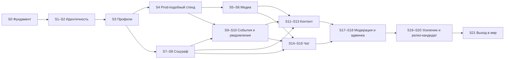

# План спринтов бэкенда messunjerr v2

> Статус: проект, черновик 2 · дата: 2026-10-05 (после S2 порядок выкладки пересмотрен: всё локально, выход в мир в S21, см. 1.1) · основа: [backend-v2-spec.md](backend-v2-spec.md) и опрос (ритм, инфраструктура, порядок, судьба старого кода).
> Эта спека отвечает на вопрос «в каком порядке и что делаем». **Что** именно строим (данные, ручки, ошибки, события, безопасность) описано в backend-v2-spec; здесь только порядок, состав спринтов, оценка и критерии приёмки. Ссылки вида «4.7» или «5.2» ведут в разделы backend-v2-spec.
> Фронтенд переписывается отдельно; здесь учтено только, **когда** бэкенд готов отдать ему очередной кусок контракта (2.5).

## Содержание

0. [Как читать документ](#0-как-читать-документ)
1. [Параметры плана](#1-параметры-плана): [решения опроса](#11-решения-опроса), [упрощения и отклонения от спеки](#12-упрощения-и-отклонения-от-backend-v2-spec), [ёмкость и сроки](#13-ёмкость-и-сроки), [соответствие фазам 4.19](#14-соответствие-фазам-из-419)
2. [Сквозные правила](#2-сквозные-правила): [неделя спринта](#21-неделя-спринта), [готовность](#22-определение-готовности), [ветки и релизы](#23-ветки-pr-и-релизы), [тесты](#24-тесты-и-пороги), [что доступно фронтенду](#25-что-доступно-фронтенду-после-спринтов), [оргзадачи](#26-оргзадачи-вне-кода)
3. [Карта плана](#3-карта-плана): [таблица спринтов](#31-таблица-спринтов), [вехи](#32-вехи), [инфраструктура по спринтам](#33-когда-появляется-инфраструктура), [зависимости](#34-зависимости), [спайки и риски](#35-спайки-и-риски)
4. [Спринты S0–S21](#4-спринты)
5. [Бэклог после 1.0](#5-бэклог-после-10)
6. [Приложения](#6-приложения): [эндпоинты по спринтам](#61-эндпоинты-по-спринтам), [таблицы БД](#62-таблицы-бд-по-спринтам), [задачи, топики, лимиты](#63-фоновые-задачи-топики-и-лимиты-по-спринтам), [шаблоны](#64-шаблоны)

---

## 0. Как читать документ

| Обозначение | Значение |
|---|---|
| Спринт | одна неделя; нумерация `S0`…`S21`; задачи нумеруются `S3-02` |
| Ч | часы чистой работы (код, тесты, документация), без совещаний и ожиданий |
| 🧱 | инфраструктура или конвейер |
| 🔬 | спайк: исследование с жёстким лимитом времени и записью решения в журнал |
| ⚖️ | юридический минимум (галочка согласия и то, что даётся «бесплатно») |
| ✅ / 🧭 / ⚠️ | как в backend-v2-spec: решено вами / предложение / риск |
| «Растяжка» | задача, которую можно отложить на следующий спринт без последствий; в таблицах помечена «(растяжка)» |

У каждого спринта одинаковые блоки: **цель**, **результат (демо)**, **зависит от**, **спецификация** (где читать детали), **задачи** с часами и итогом, **эндпоинты**, **таблицы БД**, **инфраструктура**, **приёмка**, **риски**, **не входит**. По блокам «Эндпоинты» и «Таблицы БД» скриптом проверено, что каждая ручка и каждая таблица из backend-v2-spec попала ровно в один спринт или в бэклог (приложения 6.1 и 6.2).

---

## 1. Параметры плана

### 1.1. Решения опроса

| Тема | Решение ✅ | Следствие |
|---|---|---|
| Ритм | спринт 1 неделя, ёмкость 25–40 ч в неделю | расчётная ёмкость 30 ч; плановая загрузка 20–32 ч (S4, S5 и S21 легче остальных); в спринтах выше 30 ч (S0, S1, S2, S9, S10, S14) последние задачи помечены «растяжкой», так что ядро спринта укладывается в 30 ч |
| Инфраструктура | тонкий скелет, компоненты добавляются, когда нужны | график в 3.3: Caddy, SeaweedFS и prod-подобный стенд приходят в S4, Kafka с первым потребителем (S9–S10), VPS и домен только в S21 |
| Порядок частей | сначала соцсеть, потом чат | вход → профили и медиа → граф → события и уведомления → посты → чат → модерация → усиление → выход в мир |
| Старый код v0.1 | новый код растёт рядом в `backend/src/messunjerr/`; старый `backend/src/*` живёт до паритета и удаляется | паритет (регистрация, профиль, аватар, посты) достигается к S11–S12, удаление в S13 (задача S13-04) |
| Юридическая часть | внимания не уделяем, ставим галочку согласия | см. 1.2 |
| Выход в мир | весь бэкенд собираем и гоняем локально (ноутбук 32 ГБ ОЗУ, Docker); VPS, домен, почту, вход через VK ID и Яндекс ID и выкладку делаем в самом конце (решение владельца после S2) | отдельный спринт S21 после S20; до него ничего не покупаем и не выставляем наружу, письма только в Mailpit; фронтенд начинается после S20 |

### 1.2. Упрощения и отклонения от backend-v2-spec

Чтобы не тащить в первые спринты всё, что описано в 4.20 и 6.9, принято:

1. ⚖️ **Только галочка.** При регистрации и при первом входе через VK ID или Яндекс ID пользователь отмечает чекбокс «Принимаю условия и даю согласие на обработку персональных данных» (текст содержит и «мне есть 18 лет»). Бэкенд хранит `terms_version` и `terms_accepted_at` в `identity.users`, отдаёт статический `GET /legal/documents`. Вместо объекта `consents` из 5.2 пока достаточно флага `accept_terms: true`; ошибка при его отсутствии `422 validation_error` с кодом элемента `consent_missing`.
2. ⚖️ **Остальная юридическая часть в бэклоге** (раздел 5): схема `compliance.*`, `/me/consents`, `/me/onboarding`, выгрузка данных, журнал обращений, журнал уничтожения, матрица сроков хранения, регламенты. «Бесплатно» остаётся то, что и так входит в выбор технологий: хостинг в РФ, события без персональных данных, удаление EXIF, VK ID и Яндекс ID вместо Google и GitHub.
3. **Таблица `identity.users`** в S1 получает столбцы `terms_version` и `terms_accepted_at` вместо `age_declared_at` из DDL 4.5. Поле `MeUser.required_actions` в v1 всегда пустой массив (задел под бэклог).
4. **OAuth** принимает галочку в параметре `accept_terms=1` запроса `GET /auth/oauth/{provider}/start`. Если аккаунт новый, а галочки нет, перенаправление на `/login?error=terms_required` (в каталог ошибок добавляется). Ограниченный токен `scp = "consent"` и онбординг из 4.7 не делаются. Сам вход через VK ID и Яндекс ID делается в последнем спринте (S21).
5. **События до появления Kafka.** С S1 команды пишут события в `platform.outbox` через порт `EventBus` (реализация `NullEventBus`: строки копятся). В S9 запускается relay, который публикует накопленное.
6. **Медиа до Kafka** (S5–S12): после `complete` задача `process_media` ставится в arq напрямую после коммита, а `reconcile_uploads` подхватывает зависшие ресурсы. В S13 путь переводится на событие `AssetUploaded` и потребитель `media`, как в 4.8 (временный код удаляется).
7. **Присутствие** (`presence`) приходит вместе с чатом (S16), хотя SSE появляется в S10: события `presence.*` до этого не отправляются.
8. **Один продуктовый контур.** Отдельного stage нет: до S21 всё работает на локальном prod-подобном стенде (`make up-prod-like`, S4), в S21 к нему добавляется prod на VPS.
9. **Сборщик ошибок** GlitchTip (профиль `obs`) входит в S20 и только если хватает памяти; до этого ошибки идут в JSON-логи.
10. **Выход в мир в конце** (решение владельца после S2). Весь бэкенд собираем и гоняем локально, на ноутбуке с Docker; VPS, домен, TLS Let's Encrypt, выкладка по SSH, копии наружу, SMTP провайдера и вход через VK ID и Яндекс ID делаются в последнем спринте S21. До него `AUTH_METHODS=password`, письма уходят в Mailpit, ничего не покупаем. ⚖️ Перед запуском для людей российский способ входа обязан быть включён (A33 и R11 спецификации). Фронтенд начинается после S20: до тех пор контракт проверяется через Swagger, `.http`-коллекции и демо-скрипты.

### 1.3. Ёмкость и сроки

| Показатель | Значение |
|---|---|
| Спринтов | 22 (`S0`–`S21`) |
| Плановая нагрузка | 612 ч, в среднем 27,8 ч на спринт, диапазон 20–32 ч; из них «растяжка» 31 ч, ядро плана 581 ч |
| Расчётная ёмкость | 30 ч (диапазон 25–40): ядро спринта не превышает 30 ч, с «растяжкой» до 32 ч; при середине диапазона (32,5 ч) запас около 14% |
| Срок при 30 ч в неделю | 22 недели (около 5 месяцев) |
| Срок при 40 ч / при 25 ч | около 16 недель / около 25 недель |
| Календарь | при старте в понедельник 12.10.2026 план заканчивается около 15.03.2027; новогодние каникулы добавляют 1–2 недели |

⚠️ Это уточнённая оценка по задачам снизу вверх: в опросе я называл «14–16 спринтов», а реальный объём спецификации (около 140 эндпоинтов, чат с WebSocket, Kafka, медиа-конвейер) оказался равен 21 спринту; 22-й (S21) добавило решение выходить в мир в самом конце. Если нужно быстрее, режем в таком порядке: сначала S17–S18 (модерация и админка уходят после запуска для друзей), затем часть S19–S20. «Минимальный релиз для друзей» возможен после S13 и S21 (388 + 27 = 415 ч): S21 не зависит от S14–S20 и при желании делается раньше, тогда чат строится уже на боевом стенде. Полный функционал с чатом готов после S16 (475 ч), весь план вместе с выходом в мир занимает 612 ч. Оценки консервативны: при работе вместе с ассистентом фактическое время может быть меньше.

### 1.4. Соответствие фазам из 4.19

| Фаза 4.19 | Спринты |
|---|---|
| 0. Фундамент и спайки | S0 (каркас), S4 (prod-подобный стенд, спайки SSE/WS через Caddy и presigned URL), S9 (спайк aiokafka), S21 (спайк VK ID и Яндекс ID) |
| 1. Идентичность | S1, S2, S21 (OAuth) |
| 2. Профили и медиа | S3, S5, S6; поиск людей в S8 |
| 3. Социальный граф | S7, S8; relay и уведомления S9–S10 |
| 4. Контент | S11, S12, S13 |
| 5. Чат | S14, S15, S16 |
| 6. Модерация | S17, S18 |
| 7. Усиление | S19, S20 |
| 8. По желанию | бэклог (раздел 5) |

Разница с 4.19: Kafka введена не на старте, а вместе с первым потребителем; prod-подобный стенд собирается рано (S4), а выход в мир (VPS, домен, вход через VK ID и Яндекс ID) вынесен в самый конец (S21).

---

## 2. Сквозные правила

### 2.1. Неделя спринта

Предлагаемый ритм для одного разработчика (≈ 30 ч):

| День | Что |
|---|---|
| Пн | планирование (30 минут): прочитать блок спринта, уточнить порядок задач, подготовить окружение; сразу самая рискованная задача |
| Вт–Чт | работа по задачам; каждая задача заканчивается тестами и обновлением `.http`-коллекции |
| Пт | дожим «растяжки»; демо самому себе по сценарию из блока «Результат»; запись в журнал решений; ретро (15 минут: что замедлило, что менять); черновик следующего спринта |

Правило остановки: если к четвергу ясно, что спринт не закрыть, из плана убираются «растяжка» и последняя задача, а не качество тестов.

### 2.2. Определение готовности

**Задача готова**, когда: код проходит `ruff`, `pyright`, `import-linter`; есть тесты на успешный путь и основные ошибки; миграция идёт «вперёд» и совместима со старой версией кода (схема «расширить → мигрировать → сузить»); изменения контракта отражены в OpenAPI.

**Эндпоинт готов** (из 4.17), когда: описан в OpenAPI с примерами; перечислены коды ошибок и они есть в каталоге 5.14; есть тесты политики доступа; назначен бакет лимитов; события задокументированы; чувствительные действия пишут аудит; ручка добавлена в `.http`-коллекцию.

**Спринт готов**, когда: выполнены пункты блока «Приёмка»; CI зелёный на `main`; образ собран и (с S4) поднимается на локальном prod-подобном стенде без простоя (в S21 выкатывается на VPS); сценарий из «Результата» проходит руками и тестом; запись в журнал решений и обновлённый перечень открытых вопросов; тег `v2.0.0-sN`.

### 2.3. Ветки, PR и релизы

- Trunk-based: короткие ветки `sN/задача`, PR в `main` даже при работе в одиночку (CI и самопроверка по шаблону из 6.4), история линейная.
- Каждый спринт заканчивается тегом `v2.0.0-sN`. С S4 CI собирает и проверяет prod-образ, а выкладку на VPS тег запускает только в S21. Релиз-кандидат — тег `v1.0.0-rc1` в S20, релиз 1.0 — тег `v1.0.0` в S21.
- Миграции Alembic только вперёд, никаких правок уже применённых ревизий; каждая миграция проверяется «с нуля до head» и `alembic check`.
- Контракт API до релиза 1.0 можно менять, но каждое изменение записывается в `docs/api-changelog.md` (ведётся с S3), чтобы фронтенд не узнавал о нём из ошибок.

### 2.4. Тесты и пороги

| Когда | Порог |
|---|---|
| с S0 | `core`, `policies`, команды: тест на каждую публичную функцию; CI красный при падении любого теста |
| с S2 | покрытие ядра и политик ≥ 80% |
| с S7 | политики: property-тесты (hypothesis) для матрицы доступа 4.6 |
| с S9 | интеграционные тесты событий на реальном Kafka |
| с S13 | покрытие ядра, политик и команд ≥ 90%, всего ≥ 85%; `schemathesis` по OpenAPI в CI |
| с S15 | тесты реального времени на двух инстансах API |
| S19 | нагрузочные пороги: p95 ленты < 150 мс, p95 доставки сообщения < 500 мс |

### 2.5. Что доступно фронтенду после спринтов

Фронтенд переписывается отдельно. По решению владельца он начинается после S20, когда бэкенд готов и работает локально; таблица показывает, когда готов очередной кусок контракта (на случай, если решение изменится). Первая проверка клиента: два аккаунта в двух браузерах переписываются в чате.

| После спринта | Фронтенд может делать |
|---|---|
| S2 | регистрация, подтверждение почты, вход, выход, сессии, смена и сброс пароля |
| S3 | страница профиля и настройки приватности, удаление аккаунта |
| S6 | загрузка файлов и аватар |
| S8 | друзья, подписки, блокировки, поиск людей |
| S10 | уведомления и SSE, счётчики |
| S13 | посты, лента, комментарии, реакции, поиск, хэштеги |
| S16 | чат целиком: беседы, группы, сообщения, присутствие |
| S18 | интерфейс модератора и администратора |
| S21 | вход через VK ID и Яндекс ID, работа с боевым адресом |

### 2.6. Оргзадачи вне кода

Это не часы разработки, но у них есть сроки ожидания; их нужно начинать заранее. До S21 ничего из этого не нужно: всё работает локально, письма уходят в Mailpit.

| Когда начать | Что | Ожидание |
|---|---|---|
| за 2–3 недели до S21 | купить домен (`.ru`), поднять DNS-зону; заказать VPS в РФ (4 vCPU, 8 ГБ ОЗУ или больше: размер подскажут замеры под лимитами стенда в S4 и S9), оформить S3-хранилище российского провайдера для копий | до суток; 1–3 дня |
| за 2–3 недели до S21 | зарегистрировать приложения VK ID и Яндекс OAuth (redirect URI на домен), выбрать почтового провайдера в РФ и настроить SPF, DKIM, DMARC | VK ID: проверка до нескольких дней |
| за неделю до S21 | написать минимальный текст условий и согласия для чекбокса, опубликовать страницу; составить список друзей для запуска и способ сбора обратной связи | 1–2 часа по шаблону |
| до приглашения людей | ⚖️ юридический минимум вне разработки (B-06): уведомление Роскомнадзора, политика обработки персональных данных, договоры с хостингом, почтой и хранилищем копий | сроки уточнить заранее |

---

## 3. Карта плана

Порядок выстроен по трём правилам: (1) сначала то, на что опирается остальное: вход, профили, граф; (2) рискованное делается рано и в рамках лимита времени: спайки в S4 и S9 (внешние провайдеры VK ID и Яндекс ID проверяются в S21); (3) каждый спринт заканчивается тем, что можно запустить и показать.

### 3.1. Таблица спринтов

| № | Название | Результат | Ч | Что добавляется в инфраструктуру |
|---|---|---|---:|---|
| S0 | Фундамент: скелет и конвейер | `make up && make test` зелёные, CI, миграции, problem+json | 31 | PostgreSQL 18, Redis, Mailpit, GitHub Actions |
| S1 | Идентичность I: регистрация и вход | регистрация → письмо → подтверждение → вход → `/me` | 31 | arq-воркер |
| S2 | Идентичность II: сессии и пароли | refresh с ротацией, сессии, сброс пароля, лимиты, идемпотентность | 31 | воркер `default` (cron) |
| S3 | Профили и приватность | профиль, настройки, ник, удаление аккаунта | 26 | — |
| S4 | Prod-подобный стенд | Caddy с локальным TLS, лимиты как у VPS, SeaweedFS, репетиции выкладки и копий | 24 | Caddy, prod Compose, SeaweedFS, pgBackRest |
| S5 | Медиа I: загрузка | загрузка по presigned URL, статусы, квоты | 20 | — |
| S6 | Медиа II: обработка и аватары | WebP-варианты, EXIF, аватары, метрики | 28 | — |
| S7 | Соцграф I: дружба и блокировки | заявки, друзья, блокировки, матрица доступа | 28 | — |
| S8 | Соцграф II: подписки и поиск людей | подписки, закрытые профили, поиск, seed 5 000 | 26 | — |
| S9 | События I: Kafka и relay | outbox → Kafka, Protobuf, каркас потребителей, DLQ | 31 | Kafka, Karapace, `relay` |
| S10 | Уведомления и SSE | уведомления, SSE, письма, tickets | 31 | `consumer-notifier` |
| S11 | Посты и лента | посты, видимость, стена, лента, хэштеги, упоминания | 29 | — |
| S12 | Комментарии и реакции | комментарии, реакции, уведомления по ним | 26 | — |
| S13 | Поиск и паритет | поиск постов и тегов, удаление старого кода, e2e-сценарий | 26 | `consumer-media` |
| S14 | Чат I: беседы и сообщения | REST чата, порядок id, правка и удаление, прочтение | 31 | — |
| S15 | Чат II: WebSocket | WS-хаб, Redis Pub/Sub, «печатает…», обратное давление | 27 | — |
| S16 | Чат III: группы, вложения, присутствие | группы и роли, вложения, реакции, presence | 29 | — |
| S17 | Модерация I | жалобы, снимки, очередь, санкции | 30 | — |
| S18 | Админка и жизненный цикл аккаунта | администрирование, уничтожение аккаунта, обслуживание | 26 | — |
| S19 | Усиление I: нагрузка и безопасность | k6, оптимизация, ASVS, деградации | 28 | k6 |
| S20 | Усиление II и релиз-кандидат | восстановление, оповещения, runbook'и, `v1.0.0-rc1` | 26 | GlitchTip (по ресурсам) |
| S21 | Выход в мир | VPS за Caddy с TLS, CD, копии наружу, вход через VK ID и Яндекс ID, `v1.0.0` | 27 | VPS в РФ, домен, S3 для копий, SMTP |
| | **Итого** | | **612** | |

### 3.2. Вехи

| Веха | После | Что работает | Кому показываем |
|---|---|---|---|
| M0 Скелет | S0 | CI, миграции, health, ошибки | никому |
| M1 Вход | S2 | регистрация, вход, сессии, пароли | себе |
| M2 Стенд | S4 | prod-подобный стенд: Caddy с локальным TLS, лимиты ресурсов, SeaweedFS, репетиции выкладки и копий | себе |
| M3 С аватарами | S6 | медиа и аватары | себе |
| M4 Друзья | S8 | дружба, подписки, закрытые профили, поиск людей | себе |
| M5 Живая сеть | S10 | уведомления и SSE | себе |
| M6 Стена | S13 | посты, лента, комментарии, реакции, поиск; старый код удалён | себе |
| M7 Чат | S16 | весь функционал, кроме модерации | себе |
| M8 Порядок | S18 | модерация, админка, удаление аккаунта | — |
| M9 Релиз-кандидат | S20 | усиление, восстановление, runbook'и, `v1.0.0-rc1` | себе |
| M10 В мире | S21 | VPS, домен, TLS, CD, копии наружу, вход через VK ID и Яндекс ID, `v1.0.0` | друзьям, затем всем желающим |

До S21 все вехи принимаются локально. Клиент пишется после S20, поэтому до тех пор вехи показываются через Swagger, `.http`-коллекции и демо-скрипты.

### 3.3. Когда появляется инфраструктура

| Компонент | Спринт | Почему именно тогда |
|---|---|---|
| PostgreSQL 18, Redis, Mailpit, GitHub Actions | S0 | нужны с первой строки кода |
| arq-воркер | S1 | письма подтверждения |
| воркер `default` (cron arq) | S2 | очистка неподтверждённых аккаунтов, просроченных токенов и ключей |
| Caddy, prod-подобный Compose (`make up-prod-like`), SeaweedFS, pgBackRest в локальный S3 | S4 | весь боевой контур, кроме сервера, поднимается на ноутбуке с лимитами VPS: выкладка, копии и хранилище репетируются до выхода в мир |
| Kafka (KRaft), Karapace, `buf`, `outbox-relay` | S9 | к этому моменту накопились события графа, готов первый потребитель |
| `consumer-notifier` | S10 | уведомления |
| `consumer-media` | S13 | перевод медиа на событийный путь |
| k6 | S16 (дым), S19 (полный прогон) | нагрузка чата и ленты |
| GlitchTip (профиль `obs`) | S20 | по оставшимся ресурсам |
| VPS в РФ, домен, CD по SSH, S3 провайдера для копий, SMTP провайдера | S21 | выход в мир в самом конце: до него ничего не покупаем (решение владельца) |

⚠️ К S9 нужно проверить бюджет памяти под лимитами стенда (8 ГБ, 4 ядра): Kafka добавляет около 1,5 ГБ, Karapace около 0,3 ГБ (2.3); запас остаётся небольшим. Размер настоящего VPS выберем по этим замерам перед S21.

### 3.4. Зависимости

Критический путь: S0 → S1 → S2 → S3 → S4 → S7 → S9 → S10 → S11 → S14 → S15 → S17 → S19 → S20 → S21. Медиа (S5–S6) и граф (S7–S8) можно менять местами, если вдруг понадобятся друзья раньше аватаров; события (S9) нельзя ставить раньше графа, потому что им нечего публиковать. S21 не зависит от S14–S20: при желании его делают раньше, например после S13, чтобы запустить сеть без чата.

### 3.5. Спайки и риски

| Спринт | Спайк или риск | Лимит | Что выясняем | Запасной вариант |
|---|---|---|---|---|
| S4 | 🔬 SSE и WebSocket через Caddy | 2 ч внутри S4-02 | потоки не буферизуются, WS проходит | `flush_interval -1`, отдельный `handle` |
| S4 | 🔬 presigned PUT и GET SeaweedFS за Caddy (R3) | 5 ч (S4-05) | подпись SigV4 не ломается | отдельный поддомен для S3 или S3 провайдера |
| S9 | 🔬 aiokafka × Kafka 4.x × Karapace × Protobuf (R1) | 5 ч (S9-01) | какой клиент брать | `confluent-kafka` AIO за `EventBus` или брокер 3.9 |
| S9 | ресурсы под лимитами стенда: 8 ГБ, 4 ядра (R4) | в S9-02 | хватает ли памяти | поднять лимит и взять VPS на 12 ГБ или временный `ArqEventBus` |
| S15 | WebSocket на двух инстансах | в задачах S15 | Redis Pub/Sub между репликами | — |
| S19 | производительность ленты и чата | весь S19 | p95 по порогам 4.17 | кэш первой страницы ленты (4.10), индексы |
| S21 | 🔬 VK ID и Яндекс ID: PKCE, `device_id`, отсутствие email | 3 ч внутри S21-05 | реальные параметры провайдеров | сначала только Яндекс ID, VK ID позже |
| S21 | поздний выход в мир: сюрпризы боевого окружения (TLS, прокси, мобильные сети, память сервера) | весь S21 | то, что локальный стенд не показал | закрытый запуск для 2–3 человек, запас 2–3 дня на правки |

---

## 4. Спринты

### Спринт 0. Фундамент: скелет и конвейер

**Цель.** Пустое, но боевое приложение: структура v2, инструменты, миграции, тесты и CI, чтобы дальше работать только над функциями.

**Результат (демо).** `make up && make test` зелёные на чистой машине; `GET /health/ready` показывает PostgreSQL и Redis и отвечает `503`, если Redis остановлен; любая ошибка возвращается как `application/problem+json`; CI зелёный.

**Зависит от:** —. **Спецификация:** 3.2, 4.2–4.5 (таблицы `platform`), 4.15, 5.1, 5.13, 6.1.

| ID | Задача | Ч |
|---|---|---:|
| S0-01 | Каркас репозитория v2: пакет `backend/src/messunjerr/` (контексты-пустышки, `core/`), `pyproject.toml` (uv, зависимости из 3.1), ruff, pyright, import-linter с контрактами 4.2, pre-commit, Makefile | 3 |
| S0-02 | Настройки (`pydantic-settings`, секреты через `*_FILE`, переменные 6.1), structlog в JSON, `X-Request-ID`, access-лог без токенов | 3 |
| S0-03 | Фабрика ASGI-приложения, префикс `/api/v1`, `/health/live`, `/health/ready`, `/api/v1/meta` (лимиты и палитра из настроек), OpenAPI 3.1 (в проде выключена) | 3 |
| S0-04 | Ошибки problem+json (RFC 9457): иерархия `DomainError`, перечисление кодов из 5.14, обработчики (валидация без эха `input`, 404, 405, 500), `request_id` в ответе | 4 |
| S0-05 | БД: SQLAlchemy 2.1 async + asyncpg, пулы, Alembic (async-шаблон), миграция 0001 (схемы, расширения `citext`, `pg_trgm`, `unaccent`, роли `app`, `migrator`, `readonly`) | 4 |
| S0-06 | Unit of Work, outbox, таблицы `platform.*`, after-commit hooks, порт `EventBus` и `NullEventBus` | 4 |
| S0-07 | `core`: UUIDv7, непрозрачные курсоры пагинации, Redis-клиент, проверка готовности | 2 |
| S0-08 | 🧱 Compose для разработки: PostgreSQL 18 (том в `/var/lib/postgresql`), Redis (AOF), Mailpit; `.env.example`; Dockerfile на uv; `make up` | 3 |
| S0-09 | Тестовый стенд: pytest-asyncio, testcontainers (PostgreSQL 18, Redis), фабрики, httpx ASGI-клиент; тест «миграции с нуля до head» и `alembic check` | 3 |
| S0-10 | 🧱 CI (GitHub Actions): ruff, pyright, import-linter, тесты, проверка миграций, сборка образа, матрица Python 3.13 и 3.14 (растяжка) | 2 |
| | **Итого** | **31** |

**Эндпоинты:** `GET /health/live`, `GET /health/ready`, `GET /meta`, `GET /openapi.json`, `GET /docs`
**Таблицы БД:** `platform.outbox`, `platform.inbox`, `platform.idempotency_keys`, `platform.audit_log`
**Инфраструктура:** PostgreSQL 18, Redis, Mailpit (dev-Compose), GitHub Actions.

**Приёмка**

- `make up && make test` проходят с чистого клона; CI зелёный на PR.
- Миграции «с нуля до head» и `alembic check` в CI.
- Ответы 404, 405, 422, 500 имеют формат problem+json с `request_id` и без эха входных значений.
- Нарушение границы между контекстами красит `import-linter` (есть тест на нарушение).
- Откат транзакции откатывает и строку outbox; after-commit hook при откате не вызывается (тест).

**Риски.** ⚠️ pyright в строгом режиме с SQLAlchemy 2.1 и FastAPI 0.x: допускается точечный `# pyright: ignore[...]` с причиной. ⚠️ Python 3.14: если зависимость без колёс, закрепляемся на 3.13 (R8).
**Не входит.** Любые доменные ручки, Caddy, arq, Kafka.

**Итоги (сделан 2026-10-05).**

- Проверено на локальном стеке Docker: 125 тестов (unit и интеграционные на PostgreSQL 18 и Redis 8), ruff, pyright strict (0 ошибок), import-linter (2 контракта целы), `alembic check` без расхождений, миграции «с нуля до head» и откат/накат, `GET /health/ready` отвечает `503` с `redis: down` при остановленном Redis и снова `200` после его запуска, горячая перезагрузка API при правке исходников.
- Отклонения от плана:
  1. **S0-09:** вместо testcontainers тесты берут PostgreSQL и Redis из Compose (локально) или из `services` GitHub Actions (CI). Тестам внутри контейнера понадобился бы `docker.sock`, а свои сервисы у стенда и так есть. Каждый прогон создаёт временную базу `mj_test_*` и в конце удаляет её. Фабрики тестовых данных появятся вместе с первой доменной таблицей (S1).
  2. **S0-10:** workflow `.github/workflows/backend.yml` проверен `actionlint`, а на GitHub первый прогон (коммит `bfa01ce`, спринт 1) прошёл полностью зелёным: линтеры и типы, тесты на Python 3.14 и 3.13, сборка образа. Матрица Python 3.14 и 3.13 включена; те же 125 тестов локально проходят и на 3.14.0, и на 3.13.16.
  3. **S0-01:** на Windows нет `make`, поэтому рядом с Makefile лежит `dev.ps1` с тем же набором команд.
  4. До S13 тесты v2 запускаются с `-c pyproject.toml`: старый `backend/pytest.ini` остаётся до удаления v0.1.
- Что поймали интеграционные тесты: роль `app` не имела права читать `alembic_version`, и `/health/ready` показывал `migrations: unknown`. Право `SELECT` выдаёт миграция 0001; на это есть тесты.

### Спринт 1. Идентичность I: регистрация и вход

**Цель.** Человек регистрируется, подтверждает почту и входит.

**Результат (демо).** Через `.http`: регистрация → письмо в Mailpit → подтверждение → вход → `GET /me`; тот же сценарий проходит автотестом.

**Зависит от:** S0. **Спецификация:** 4.7, 5.2, 5.3 (`GET /me`), 5.14.

| ID | Задача | Ч |
|---|---|---:|
| S1-01 | Миграция identity: `users` (со столбцами `terms_version`, `terms_accepted_at`), `email_tokens`, `sessions` | 2 |
| S1-02 | Пароли: pwdlib Argon2id в пуле потоков, политика (10–128 символов, список частых паролей), выравнивание времени ответа | 3 |
| S1-03 | `POST /auth/register`: схемы, нормализация (`citext`), одинаковый ответ при занятом адресе, ⚖️ флаг `accept_terms` → `terms_version` и `terms_accepted_at`, событие `UserRegistered`; `GET /auth/username-available` | 5 |
| S1-04 | arq: воркер (очереди `email` и `default`), порт `JobQueue`, `send_email` (aiosmtplib, Jinja2, шаблоны на русском, Mailpit), повторы | 5 |
| S1-05 | Одноразовые токены из писем (хэш, срок, использование): `POST /auth/verify-email` (событие `EmailVerified`), `POST /auth/resend-verification` | 3 |
| S1-06 | JWT: Ed25519, `kid`, access 10 минут, JWKS, зависимость `current_user` (проверка `iss`, `aud`, `exp`, `scp`) | 4 |
| S1-07 | `POST /auth/login`: проверка пароля и статуса, создание сессии, refresh-токен (хэш SHA-256) в cookie `__Secure-mj_refresh`; ротация в S2 | 4 |
| S1-08 | `GET /me` (пока без профиля) | 1 |
| S1-09 | ⚖️ Статический `GET /legal/documents` (версия, ссылки, страницы-заглушки) (растяжка) | 1 |
| S1-10 | Тесты: сценарий «регистрация → письмо → подтверждение → вход → `/me`», негативные случаи, перечисление пользователей | 3 |
| | **Итого** | **31** |

**Эндпоинты:** `POST /auth/register`, `POST /auth/verify-email`, `POST /auth/resend-verification`, `POST /auth/login`, `GET /auth/username-available`, `GET /.well-known/jwks.json`, `GET /me`, `GET /legal/documents`
**Таблицы БД:** `identity.users`, `identity.email_tokens`, `identity.sessions`
**Инфраструктура:** контейнер `worker` (arq).

**Приёмка**

- Сценарий проходит автотестом и руками; без `accept_terms: true` регистрация невозможна (`consent_missing`).
- Регистрация на занятый и на свободный email неотличима по ответу и времени (тест).
- Пароли хранятся как Argon2id; JWKS отдаёт `kid`; просроченный токен даёт `401 token_expired`.
- Токен подтверждения одноразовый и истекает через 24 часа; вход в статусе `pending` даёт `403 email_not_verified`.
- Хэширование пароля не блокирует цикл событий (тест на параллельных запросах).

**Риски.** ⚠️ Argon2id нагружает процессор: при нехватке ядер подбираем параметры. R2: arq остаётся за портом `JobQueue`.
**Не входит.** Ротация refresh, список сессий, сброс пароля, лимиты (S2); профиль (S3).

**Итоги (сделан 2026-10-05).** Сценарий «регистрация → письмо в Mailpit → подтверждение → вход → `GET /me`» проходит и автотестом (сквозной тест гоняет настоящие arq и SMTP), и руками на стеке Docker; коллекция запросов лежит в `backend/http/auth.http`. Выполнены все задачи S1-01…S1-10, включая «растяжку» S1-09. Проверено: ruff, pyright strict, import-linter (добавлен контракт раскладки внутри контекста), `alembic check`, тесты на Python 3.14 и 3.13.

Отклонения от плана и принятые решения:

1. **arq и redis-py (R2 сработал частично).** arq 0.28.0 (апрель 2026) заявляет `redis<6`, а проект на redis-py 8.1. Эмпирически они совместимы: enqueue, дедупликация по `job_id`, повторы и отложенный запуск работают, есть два `DeprecationWarning` (`retry_on_timeout`, `close()`). Пин снят через `[tool.uv] override-dependencies`, предупреждения заглушены точечно, связку сторожит тест `test_arq_compat`. Если сломается, запасной вариант Taskiq (`taskiq-redis` поддерживает redis 8); код команд знает только порт `JobQueue`. Задачи сериализуются в JSON, не в pickle: запись в Redis не даёт выполнения кода в воркере.
2. **Воркер по одному процессу на очередь.** arq 0.28 не слушает несколько очередей сразу, поэтому `python -m messunjerr worker --queue email`. Задачи пока есть только в очереди `email`; воркеры `default` и `media` появятся вместе с их задачами (S2, S5). Воркер запускается через `asyncio.run(worker.async_run())`: штатный `arq` CLI берёт цикл через `get_event_loop()`, а в Python 3.14 это ошибка. В Compose воркер перезапускается при правке кода (`--reload`), состояние видно через `worker --check`.
3. **Письмо ставится в очередь до коммита.** Если очередь недоступна, адаптер отвечает `503`, транзакция откатывается и аккаунта нет; обратное («аккаунт есть, письма нет») невозможно. Цена: возможно письмо с токеном, который не записался из-за отката, такая ссылка просто недействительна. Токен лежит в аргументах задачи, поэтому результаты задач `send_email` не сохраняются (`keep_result=0`). Ссылка в письме держит токен во фрагменте (`/verify-email#token=…`): он не попадает ни в журналы Caddy, ни в `Referer`.
4. **Повторная регистрация одного адреса.** Ответ всегда `201`. Активный аккаунт: ничего не меняется, владельцу уходит письмо «вы уже зарегистрированы». Неподтверждённый: данные регистрации заменяют прежние, прежние токены гаснут (иначе тот, кто первым занял чужую почту, оставил бы на ней свой пароль: pre-hijacking). Во всех ветках считается один Argon2id-хэш, время ответа от ветки не зависит (тест на тяжёлых параметрах). Занятый ник всегда даёт `409`, независимо от почты.
5. **Поля профиля при регистрации.** `display_name`, `language`, `timezone` пока не принимаются (`unknown_field`): таблицы профиля нет до S3-01, поля добавятся вместе с ней. Галочку `accept_terms` проверяет команда, а не схема: `consent_missing` приходит в одном ответе вместе с зарезервированным ником и слабым паролем.
6. **`resend-verification`** выполняет работу после отправки ответа (фоновая задача запроса): ни время, ни сбои очереди не выдают, есть ли адрес. Сбой очереди откатывает выдачу нового токена, прежний остаётся рабочим.
7. **JWT.** Ключ задаёт `JWT_PRIVATE_KEY` (PEM или seed Ed25519 в base64url для разработки, `JWT_PRIVATE_KEY_FILE` в проде); `kid` по умолчанию отпечаток ключа (RFC 7638). В prod и stage без ключа процесс не стартует (`check_runtime`), в dev и test ключ временный. Проверка denylist `sess:revoked:{sid}` уже работает (пишет её S2); при недоступном Redis общие ручки продолжают работать. Ограниченные токены (`scp`) не принимаются.
8. **Argon2id** настраивается (`ARGON2_*`; по умолчанию профиль RFC 9106 с малой памятью: t=3, 64 МиБ, p=4), хэширование идёт в потоках, число одновременных хэшей ограничено `PASSWORD_HASH_CONCURRENCY` (4). Тест с настоящими параметрами показывает, что цикл событий не простаивает. Список из 9901 частого пароля собран скриптом из SecLists (MIT), переносится в образ как данные пакета.
9. **В S2, а не в S1:** аудит входов (S2-06), лимиты запросов (S2-05), `Idempotency-Key`. Туда же добавляется крон-очистка неподтверждённых аккаунтов старше нескольких дней (иначе они занимают ники и почту).
10. Дополнительно: блок `legal` в `GET /api/v1/meta`; `GET /api/v1/legal/documents` (растяжка S1-09) отдаёт одну запись `terms` с версией из `LEGAL_TERMS_VERSION`; полный реестр документов остаётся в бэклоге B-01.

### Спринт 2. Идентичность II: сессии, пароли, лимиты

**Цель.** Безопасные сессии, смена и сброс пароля, защита от перебора и повторов.

**Результат (демо).** Показать ротацию refresh и обнаружение повторного использования, «выйти везде», сброс пароля с письмами; 21-я попытка входа с одного IP за 10 минут даёт `429`.

**Зависит от:** S1. **Спецификация:** 4.7, 4.14 (лимиты и аудит), 5.1 (идемпотентность, заголовки), 5.2.

| ID | Задача | Ч |
|---|---|---:|
| S2-01 | `POST /auth/refresh`: ротация, окно гонки 10 с, обнаружение повторного использования, denylist `sess:revoked:{sid}`, CSRF-проверки (`X-Requested-With`, `Origin`) | 6 |
| S2-02 | Выход и сессии: `POST /auth/logout`, `POST /auth/logout-all` (с паролем), `GET /auth/sessions`, `DELETE /auth/sessions/{session_id}` | 4 |
| S2-03 | Пароль: `POST /auth/password/forgot`, `/reset`, `/change`; письма безопасности; отзыв сессий; событие `PasswordChanged` | 4 |
| S2-04 | Почта: `POST /auth/email/change`, `POST /auth/email/confirm` (растяжка) | 3 |
| S2-05 | Лимиты запросов: Lua token bucket в Redis, зависимость и заголовки `RateLimit-*`, `Retry-After`, `ratelimits.toml`, бакеты `auth_*`, `username_check_ip`, `api_read`, `api_write`; деградация при недоступном Redis по 4.7 | 5 |
| S2-06 | Аудит: запись в `platform.audit_log` (вход, выход, смена пароля, повторное использование refresh, отзыв сессий) | 2 |
| S2-07 | `Idempotency-Key`: зависимость, хранение в `platform.idempotency_keys`, `idem:lock`, ошибки `idempotency_key_reuse` и `request_in_progress` | 3 |
| S2-08 | Тесты безопасности: повторное использование refresh, гонка двух вкладок (параллельные запросы), перебор, лимиты, CSRF | 4 |
| | **Итого** | **31** |

Сверх оценки добавлена **S2-09** (≈3 ч): плановая очистка неподтверждённых аккаунтов, просроченных токенов писем и ключей идемпотентности, воркер очереди `default` с cron-задачами (решение п. 9 итогов S1).

**Эндпоинты:** `POST /auth/refresh`, `POST /auth/logout`, `POST /auth/logout-all`, `GET /auth/sessions`, `DELETE /auth/sessions/{session_id}`, `POST /auth/password/forgot`, `POST /auth/password/reset`, `POST /auth/password/change`, `POST /auth/email/change`, `POST /auth/email/confirm`
**Таблицы БД:** — (`platform.audit_log` и `platform.idempotency_keys` созданы ещё в S0)
**Инфраструктура:** Redis теперь хранит лимиты, denylist сессий и замки идемпотентности; новый воркер `worker-default` (очередь `default`) в Compose.

**Приёмка**

- Старый refresh после ротации: в окне 10 с выдаётся только новый access, позже `401 refresh_reused` и сессия отозвана (тесты на оба случая).
- «Выйти везде» отзывает все сессии; старые access-токены перестают приниматься после попадания `sid` в denylist.
- 21-я попытка входа с IP за 10 минут: `429` с `Retry-After`; заголовки `RateLimit-*` на всех ответах.
- Повтор `POST` с тем же `Idempotency-Key` возвращает исходный ответ (`Idempotency-Replayed: true`), с другим телом `422 idempotency_key_reuse`.
- Письма безопасности (смена пароля, повторное использование) приходят в Mailpit; запись в аудите есть.

**Риски.** ⚠️ Lua-скрипт: проверить 10 000 вызовов на корректность и скорость. ⚠️ Гонка вкладок: тест с реальной параллельностью (`asyncio.gather`), а не последовательными вызовами.
**Не входит.** OAuth (S21).

**Итоги (сделан 2026-10-05).** Выполнены все задачи S2-01…S2-08, включая «растяжку» S2-04, и добавленная S2-09. Демо проходит и автотестами, и руками на стеке Docker: ротация refresh с обнаружением повторного использования, «выйти везде», сброс пароля с письмами в Mailpit, 21-я попытка входа с одного адреса даёт `429` (запросы собраны в `backend/http/auth-sessions.http`). Проверено: ruff, pyright strict, import-linter (3 контракта), тесты на Python 3.14: 622 (322 unit и 300 интеграционных на PostgreSQL 18, Redis 8 и Mailpit). На Python 3.13 локально не гонялось (на диске мало места для второго образа), его проверит CI.

Отклонения от плана и принятые решения:

1. **Refresh и повторное использование (S2-01).** Сессия берётся `SELECT … FOR UPDATE` по хэшу текущего токена, затем по `prev_refresh_hash`: параллельные вкладки выстраиваются в очередь на строке сессии (тест: шесть параллельных `refresh` одним токеном дают ровно одну ротацию). Окно гонки 10 с (`REFRESH_RACE_WINDOW_SECONDS`): только новый access, без `Set-Cookie`. Позже окна сессия закрывается (`reuse_detected`), `sid` попадает в denylist `sess:revoked:{sid}`, пишется аудит, владельцу уходит письмо «Подозрительная активность», ответ `401 refresh_reused` стирает cookie. Закрытие сессии и аудит фиксируются коммитом до выброса ошибки, иначе откат стёр бы след.
2. **CSRF.** Для `refresh` и `logout` обязателен заголовок `X-Requested-With: messunjerr`; `Origin`, если он есть, должен быть источником `PUBLIC_BASE_URL` или одним из `ALLOWED_ORIGINS`; `Sec-Fetch-Site`, если он есть, должен быть `same-origin` или `none` (вне prod допускается и `same-site`: клиент на :3000, API на :8000). Проверка идёт раньше токена и лимитов, поэтому чужой сайт не тратит бюджет чужой сессии.
3. **Лимиты (S2-05).** Token bucket одним Lua-скриптом, время берётся у Redis (`TIME`), 10 000 вызовов считаются точно и быстро (тест). Таблица бакетов `ratelimits.toml` лежит в пакете, `RATE_LIMITS_FILE` перекрывает её по полям. Политика при недоступном Redis задаётся бакетом: `auth_login_*`, `auth_register_ip`, `auth_email_*` закрыты (`503` и `Retry-After: 5`), потому что подбор пароля и рассылка без счёта недопустимы; `auth_refresh_session`, `username_check_ip`, `api_read`, `api_write` пропускают запрос с предупреждением в журнале, чтобы сбой Redis не клал всё приложение. `RateLimit-Limit`, `-Remaining`, `-Reset` приходят на ответах лимитируемых ручек, в том числе на ошибках (заголовки лежат в состоянии запроса, их достаёт обработчик ошибок); `429` несёт `Retry-After` и поле `retry_after`. Все ответы-ошибки получили `Cache-Control: no-store`. Лимитируются все ручки таблицы 6.10, кроме `POST /auth/logout` (выход всегда отвечает `204`) и статических публичных ответов (JWKS, `legal/documents`, `meta`: их закрывает Caddy).
4. **Лимит по аккаунту.** Спецификация: «5 за 15 минут, затем задержка»; сделан жёсткий отказ `429` с `Retry-After` (задержка держала бы соединения и упрощала DoS). Токен списывается до проверки пароля и возвращается после успешного входа: параллельный перебор лимит не обходит. Ключ: `id` аккаунта (почта и ник делят один бюджет), для несуществующего логина хэш логина, ответы неотличимы. Тот же бюджет тратят повторные вводы пароля (`logout-all`, смена пароля и почты): подбор через украденный access-токен упирается в тот же лимит. Известная цена: тот, кто знает чужой логин, может мешать владельцу входить (по одному запросу в три минуты); смягчение (капча, доверенные устройства) относится к B-09.
5. **Пул соединений Redis.** Тест на 200 параллельных вызовов показал, что обычный пул redis-py 8 при более чем 100 одновременных операциях отдаёт `MaxConnectionsError`, а лимитер принял бы это за недоступность Redis и пропустил запросы. Клиент теперь строится на `BlockingConnectionPool` (`REDIS_MAX_CONNECTIONS`, `REDIS_POOL_TIMEOUT_SECONDS`): при нехватке соединений вызов ждёт, и только ожидание дольше таймаута считается сбоем.
6. **Чувствительные ручки** (`logout-all`, сессии, смена пароля и почты) при недоступном denylist отвечают `503`; общие ручки работают без проверки отзыва (4.7).
7. **Сброс пароля (S2-03).** Токен из письма доказывает владение ящиком: аккаунт `pending` становится `active`, ставится `email_verified_at`, токены подтверждения гаснут (события `EmailVerified` и `PasswordChanged`), все сессии закрываются, автоматического входа нет. Проверки идут от дешёвого к дорогому: токен, правила пароля, затем Argon2id. Слабый пароль не сжигает токен: его можно ввести заново.
8. **Смена пароля.** Нужен текущий пароль; тот же пароль даёт `422` (`password_too_weak`, `meta.reason = same_as_current`); остальные сессии закрываются (`revoke_other_sessions: false` их оставит); владельцу уходит письмо «Пароль изменён».
9. **Смена почты (S2-04).** Токен уходит на новый адрес, старый получает уведомление с маской нового. Занятый и совпадающий с текущим адреса отвечают тем же `202`, но без письма. Подтверждение не трогает сессии, но гасит все выданные на прежний адрес токены (сброс пароля в том числе): иначе читавший старый ящик ещё час мог бы сбросить пароль.
10. **Идемпотентность (S2-07).** Класс маршрута `idempotent_route_class(...)`: ключ (UUID) действует в пределах пользователя; замок `idem:lock:{user}:{key}` на 60 с в Redis хранит отпечаток запроса (метод, путь, запрос, тело в каноническом JSON), ответ 2xx и `Location` на 24 часа в `platform.idempotency_keys`. Повтор: `Idempotency-Replayed: true`; другое тело, путь или запрос: `422 idempotency_key_reuse`; параллельный дубль: `409 request_in_progress` с `Retry-After`. Сбой запроса запись не оставляет, ключ можно использовать снова; запись с истёкшим сроком перезаписывается; без Redis запрос выполняется без замка, а повтор по-прежнему воспроизводится из PostgreSQL; аутентификация первична (без токена `401`, а не `422`). Создающих ручек в S2 ещё нет (первая, `POST /media/uploads`, появится в S5), поэтому подключение проверено тестовым роутером с тем же классом маршрута.
11. **Аудит (S2-06).** Пишутся вход (успех и неудача), выход, «выйти везде», закрытие сессии, повторное использование refresh, неверный повторный ввод пароля, запрос и выполнение сброса, смена пароля и почты, удаление неподтверждённых аккаунтов. Запись лежит в транзакции действия; при отказе команда фиксирует транзакцию с записью и лишь затем выбрасывает ошибку. В `data` нет почты, паролей и токенов.
12. **Плановая очистка (S2-09).** Воркер `default` (`worker-default` в Compose) с cron-задачами arq по UTC: `cleanup_unverified_accounts` раз в сутки в 03:10 удаляет `pending` без подтверждённой почты, не менявшиеся `UNVERIFIED_ACCOUNT_TTL_DAYS` (7) дней и без живого токена подтверждения (в аудит идёт запись без почты и ника); `cleanup_tokens_and_idempotency` каждый час удаляет токены писем и записи идемпотентности через 7 дней после срока (матрица 6.9.7). Удаление идёт пачками с `FOR UPDATE SKIP LOCKED`, поэтому два воркера не мешают друг другу; отдельная роль `worker --role cron` из 4.12 не нужна: cron-задачи arq уникальны на каждое срабатывание и выполняются один раз при любом числе воркеров. `cleanup_sessions` и очистка IP и User-Agent остаются за S18.
13. **Проверки живости воркеров.** `worker --check` и `healthcheck` перестали импортировать воркер целиком: на медленном диске bind-mount импорт не укладывался в таймаут проверки Docker, и воркеры считались нездоровыми.
14. **Тесты безопасности (S2-08).** Повторное использование и окно гонки, шесть параллельных `refresh`, перебор пароля через вход и через повторный ввод, CSRF (заголовок, `Origin`, `Sec-Fetch-Site`), все лимиты через приложение (включая 21-ю попытку, неразличимость известного и неизвестного логина, сбой Redis), Lua-скрипт на настоящем Redis (200 параллельных вызовов, 10 000 вызовов), идемпотентность (двадцать параллельных дублей выполняют ручку один раз), очистка (два параллельных воркера удаляют каждый аккаунт ровно один раз).
15. **Спецификация.** В таблицу 6.1 добавлены переменные S2 (`REFRESH_RACE_WINDOW_SECONDS`, `PASSWORD_RESET_TTL_MINUTES`, `EMAIL_CHANGE_TTL_MINUTES`, `UNVERIFIED_ACCOUNT_TTL_DAYS`, `IDEMPOTENCY_TTL_HOURS`, `ALLOWED_ORIGINS`, `RATE_LIMITS_ENABLED`, `REDIS_MAX_CONNECTIONS`, `REDIS_POOL_TIMEOUT_SECONDS`); `RATE_LIMITS_FILE` теперь необязательный файл поверх встроенной таблицы.

### Спринт 3. Профили и приватность

**Цель.** У человека есть профиль и настройки приватности; другие видят его по правилам.

**Результат (демо).** Создать и поправить профиль, сменить ник, сделать профиль закрытым, удалить и восстановить аккаунт.

**Зависит от:** S2. **Спецификация:** 4.5 (profile), 4.6, 5.3.

| ID | Задача | Ч |
|---|---|---:|
| S3-01 | Миграция `profile.profiles`, `profile.privacy_settings`; создание строк при регистрации | 2 |
| S3-02 | `PATCH /me/profile` (био, ссылки, город, язык, часовой пояс, дата рождения с проверкой возраста `MIN_AGE`, `is_private`; `avatar_asset_id` пока даёт `asset_not_found`), `GET /me/privacy`, `PATCH /me/privacy` | 5 |
| S3-03 | `GET /users/{ref}` (UserProfile, `relationship` пока заглушка), `PATCH /me/username` (раз в 30 дней, старый ник резервируется) | 4 |
| S3-04 | `GET /me` дополняется профилем, настройками, нулевыми `counters` и пустым `required_actions` | 1 |
| S3-05 | Модуль политик (`policies`, 4.6) для профиля; каркас property-тестов (hypothesis) | 4 |
| S3-06 | Удаление аккаунта: `DELETE /me`, `POST /me/restore`, статус `deletion_pending`, ограничение `account_deletion_pending`, отзыв сессий, событие `UserDeletionRequested` (уничтожение данных в S18) | 4 |
| S3-07 | Seed-данные (`make seed`), коллекция `.http` по готовым ручкам, примеры OpenAPI, `docs/api-changelog.md` | 3 |
| S3-08 | Тесты политик профиля (открытый и закрытый, видимость даты рождения, блокировки-заглушки) | 3 |
| | **Итого** | **26** |

Оргзадачи (заявки VK ID и Яндекс OAuth, заказ VPS, S3 для копий, DNS, почтовый провайдер) перенесены в S21 (S21-07).

Сверх оценки добавлены **S3-09** (≈3 ч): резерв прежних ников (таблица `identity.username_reservations`, учёт в регистрации, смене ника и `GET /auth/username-available`, очистка в `cleanup_tokens_and_idempotency`) и **S3-10** (≈5 ч): порты identity к профилям и публичный интерфейс `identity/api_public.py` (без них `GET /me` и ответы входа не получили бы профиль, не нарушив граф контекстов 4.2) и ограничение `account_deletion_pending` через признак в Redis (решение п. 6 итогов).

**Эндпоинты:** `PATCH /me/profile`, `PATCH /me/username`, `GET /me/privacy`, `PATCH /me/privacy`, `DELETE /me`, `POST /me/restore`, `GET /users/{ref}`
**Таблицы БД:** `profile.profiles`, `profile.privacy_settings`, `identity.username_reservations` (сверх DDL 4.5, S3-09)
**Инфраструктура:** без новых компонентов; в Redis появился ключ `acct:deletion:{user_id}` (4.13).

**Приёмка**

- Профиль читается и правится, поля валидируются (ссылки, возраст по `birth_date`).
- Закрытый профиль показывает чужим ник, имя, био и счётчики, но не дату рождения.
- Смена ника не чаще раза в 30 дней; старый ник занят 30 дней.
- `DELETE /me` отзывает остальные сессии; разрешены только `GET /me`, `POST /me/restore`, выход, остальное `403 account_deletion_pending`.

**Риски.** Существенных нет: оргзадачи (VK ID, VPS, домен) отложены до S21 (2.6).
**Не входит.** Друзья и `relationship` (S7), аватар (S6), оргзадачи выхода в мир (S21).

**Итоги (сделан 2026-10-05).** Выполнены все задачи S3-01…S3-08 и добавленные S3-09 и S3-10. Демо проходит и автотестами, и руками на стеке Docker: регистрация с профилем, правка профиля и приватности, чужой профиль открытый и закрытый, смена ника с паузой и резервом, удаление и восстановление аккаунта (запросы собраны в `backend/http/profile.http`, учебные аккаунты создаёт `make seed`). Проверено: ruff, pyright strict (0 ошибок), import-linter (5 контрактов), `alembic check`, тесты на Python 3.14: 1169 (612 unit и 557 интеграционных на PostgreSQL 18, Redis 8 и Mailpit; до S3 было 622). На Python 3.13 локально не гонялось (на диске мало места для второго образа), его проверит CI.

Отклонения от плана и принятые решения:

1. **Порты вместо импортов (S3-04, S3-10).** identity стоит ниже profiles, а `MeUser` из 5.3 собирается из обоих и входит в ответы `login`, `refresh`, `verify-email`. Поэтому модели разделов (`MeProfile`, `PrivacySettings`, `MeCounters`, `RequiredAction`) лежат в `core/me.py`, а identity знает два порта в `identity/infra/ports.py`: `ProfileProvisioner` (создать профиль при регистрации) и `MeExtrasProvider` (разделы `MeUser`). Реализует оба `ProfileServices`, соединяет корень приложения (`main.py`). В обратную сторону profiles берёт у identity только `identity/api_public.py` (зависимости аутентификации, карточка аккаунта, порты): новый контракт import-linter запрещает остальное, а контракт слоёв (`api`, `commands`, `queries`, `infra`, `domain`) добавлен и для profiles. Порты profiles к контекстам выше (`AvatarAssets` к медиа, `Relationships` к графу, `ProfileCounters`) пока заглушки (`NoMediaYet`, `NoGraphYet`, `ZeroCounters`): настоящие подставят S6, S7–S8 и S11 при сборке приложения, правила профиля от этого не изменятся. Той же схемой придут счётчики `MeUser` (друзья, уведомления, беседы) в S7, S10, S14. Правило записано в 4.2 спецификации.
2. **Профиль создаётся вместе с аккаунтом (S3-01).** Регистрация принимает необязательные `display_name` (по умолчанию ник), `language` (каноническое написание: `en-us` становится `en-US`) и `timezone` (база IANA; для проверки добавлен пакет `tzdata`, чтобы не зависеть от файлов образа). Профиль и настройки приватности вставляются в той же транзакции; повторная регистрация неподтверждённого адреса заменяет имя, язык и пояс (тот, кто занял чужую почту, ничего не оставляет), а регистрация поверх активного аккаунта профиль не трогает. Миграция 0003 создаёт профиль и приватность всем уже зарегистрированным аккаунтам (имя равно нику). Аккаунт без профиля это `500` (`ProfileMissingError`) и вход без сессии, а не молчаливые значения по умолчанию.
3. **`GET /users/{ref}` и политики (S3-03, S3-05, S3-08).** `{ref}` это UUID или ник без учёта регистра; всё остальное и все «нельзя видеть» (нет такого, аккаунт не `active`, блокировка любой стороны) одинаково `404`. Правила видимости лежат в чистых функциях `profiles/domain/policies.py` для пяти отношений (`self`, `friend`, `follower`, `stranger`, `blocked`), проверены таблицами решений и property-тестами hypothesis (девять инвариантов: заблокированный не видит ничего, владелец видит всё, ближний круг не видит меньше дальнего, открытие профиля и ослабление настройки ничего не скрывают, `only_me` скрывает от всех, кроме владельца, и так далее): S7 добавит к ним граф, а не перепишет их. Решения, которых нет в спецификации: закрытость профиля счётчики не скрывает (их скрывают только настройки владельца), сами списки у закрытого профиля чужим недоступны, счётчик постов скрыт от посторонних; счётчик подписок подчиняется настройке `followers_list_visibility` (отдельной настройки нет); владелец видит дату рождения целиком, остальные в объёме `birth_date_visibility`; дата регистрации (`created_at`) видна всегда, она относится к аккаунту, а не к профилю; `relationship` пока всегда «чужой», `presence` всегда `null`.
4. **`PATCH /me/profile` (S3-02).** JSON Merge Patch: схема различает «нет ключа» и `null` через `model_fields_set`, пустая строка в `bio` и `city` очищает поле, `links: null` равно `[]`, `null` в `display_name`, `birth_date_visibility` и `is_private` ошибка `invalid_format`. Возраст проверяет команда по `MIN_AGE`: младше значит `underage` (в `meta` приходит `min_age`), дата в будущем и старше 120 лет `out_of_range`. Ссылки только `http` и `https` с хостом, без логина с паролем, пробелов и невидимых символов. `avatar_asset_id` проходит через порт медиа: до S6 любой ресурс это `asset_not_found`. Все найденные ошибки приходят одним ответом, значения полей в ответ не попадают. Побочные эффекты `is_private` на запросы подписки (4.6, 5.3) делает S8: таблиц запросов ещё нет.
5. **Ник (S3-03, S3-09).** Первая смена бесплатна, дальше пауза `USERNAME_CHANGE_COOLDOWN_DAYS` (30) дней: `409 username_change_cooldown` с `retry_after_days` (округляется вверх). Прежний ник остаётся занятым на тот же срок: в спецификации сказано только «освобождается через 30 дней», где это хранить, не сказано, поэтому добавлена таблица `identity.username_reservations` (имя, владелец, срок; вне DDL 4.5). Резерв учитывают регистрация, смена ника и `GET /auth/username-available` (ответ `taken`); проверка идёт в порядке «владелец, затем резерв», который в одной транзакции смены не оставляет окна для гонки. Свой прежний ник человек может вернуть, чужой нет; тот же ник, что сейчас, сменой не считается (ответ `200`, пауза не запускается); гонка двух людей за один ник кончается `409` у проигравшего, четыре параллельные смены одного человека дают одну смену. Просроченные резервы удаляет плановая очистка `cleanup_tokens_and_idempotency`. В аудит попадает факт смены без самих ников.
6. **Удаление и восстановление (S3-06, S3-10).** `DELETE /me` нужен пароль (общий бюджет попыток с входом и прочими повторными вводами), аккаунт с ролью модератора или администратора получает `409 role_must_be_revoked` после проверки пароля. Статус `deletion_pending`, срок `ACCOUNT_DELETION_GRACE_DAYS` (14) дней, остальные сессии закрыты (`revoked_reason = deletion_requested`), событие `UserDeletionRequested` (только идентификатор), запись в аудите, письмо «Удаление аккаунта» с датой и ссылками на вход и восстановление доступа. Повторный запрос срок не сдвигает (две вкладки одновременно дают одно удаление). **Ограничение `account_deletion_pending`** держит признак в Redis `acct:deletion:{user_id}`: статус из БД на каждый запрос не читается (4.7), а текущая сессия после `DELETE /me` остаётся живой, поэтому нужен ключ на пользователя. Его читает та же команда `MGET`, что и denylist (лишнего обращения к Redis нет), ставит `DELETE /me`, вход и `refresh` подтверждают и продлевают (потерянный Redis восстанавливает признак при следующей выдаче токена), `POST /me/restore` снимает. Срок признака равен сроку токена плюс пять минут: забытый после восстановления признак гаснет сам. Пускают только `GET /me`, `POST /me/restore` и выход, остальное `403 account_deletion_pending` (проверено на одиннадцати ручках); при недоступном Redis общие ручки пропускают (как и с denylist), чувствительные отвечают `503`, `DELETE /me` чувствительная. Профиль такого аккаунта для других `404`; восстановить можно до `deletion_scheduled_at`, после срока `409 not_pending_deletion`, даже если задача уничтожения (S18) до аккаунта ещё не дошла. Аккаунту без пароля (вход через OAuth, S21) вместо пароля достаточно сессии не старше пяти минут (5.3); сейчас такой путь достижим только правкой БД, но ветка и тесты есть.
7. **Состав ответов входа.** `user` в ответах `login`, `refresh` (включая окно гонки вкладок) и `verify-email` теперь полный `MeUser`, как в 5.2; профиль читается до коммита, поэтому сбой чтения профиля даёт `500` без созданной сессии. Прежние поля остались на месте, клиент S2 не ломается.
8. **Seed, `.http`, OpenAPI, журнал API (S3-07).** `make seed` (`./dev.ps1 seed`, `python -m messunjerr seed --users N`) создаёт подтверждённые аккаунты `seed_0001`… детерминированно и повторно безопасно: каждый пятый профиль закрыт, дата рождения трёх уровней видимости, разные настройки приватности, у всех один пароль (хэш Argon2id считается один раз), в `prod` и `stage` команда отказывается работать; модуль `seeding.py` внесён в точки сборки контракта import-linter. Коллекция `backend/http/profile.http` (для JetBrains, как и прежние, в IDE не запускалась: сценарий проверен живым прогоном по тем же запросам с помощью Python), примеры в OpenAPI у всех моделей новых ручек (`MeUser`, `MeProfile`, `PrivacySettings`, `UserProfile`, запросы правки профиля и приватности, смены ника и удаления; без `null`: FastAPI убирает их из схемы), а тест проверяет, что каждый пример проходит проверку своей моделью, журнал `docs/api-changelog.md` начат.
9. **Настройки и лимиты.** Новые переменные `ACCOUNT_DELETION_GRACE_DAYS` (14, уже была в таблице 6.1 спецификации) и `USERNAME_CHANGE_COOLDOWN_DAYS` (30). В `GET /meta` в `limits` добавлены `display_name_max`, `city_max`, `link_title_max`, `link_url_max`. Все новые ручки лимитируются бакетами `api_read` и `api_write`, новых бакетов нет.
10. **Тесты S3.** Unit: поля и нормализация, правила возраста и ссылок, таблицы политик и property-тесты, схемы, порты, разбор `{ref}`, шаблон письма, примеры OpenAPI (каждый пример проходит проверку своей моделью), новые контракты import-linter (слои profiles, публичный интерфейс identity, seed как точка сборки, identity не импортирует profiles). Интеграционные: создание профиля при регистрации и миграция 0003 (откат и накат, ограничения БД, права ролей), правка профиля, приватность, чужой профиль, ник (пауза, резерв, гонки, очистка), удаление и восстановление (ограничение на одиннадцати ручках, Redis, сессии, гонки), `MeUser` в ответах входа и отсутствие профиля, seed. Три теста выхода Redis из строя теперь подменяют `access_state` вместо `is_revoked`; счётчик контрактов import-linter в тесте стал 5, голова миграций `0003`.
11. **Спецификация.** Правки: 4.2 (правило о портах), 4.5 (DDL `identity.username_reservations`), 4.7 и 4.13 (признак `acct:deletion:{user_id}`), 5.3 (резерв ника), 5.13 (новые лимиты в `/meta`), 6.1 (`USERNAME_CHANGE_COOLDOWN_DAYS`).
12. **Нестабильный тест S1.** `test_parallel_logins_do_not_block_the_event_loop` (порог простоя цикла событий 0,08 с) на ноутбуке с Docker Desktop падал и до S3: на коде спринта 2 в четырёх запусках из десяти (простой 0,083–0,115 с), на коде S3 в трёх из десяти, в полном прогоне один раз (0,098 с). Это шум планировщика при четырёх потоках Argon2id, а не блокировка: один хэш с параметрами теста занимает здесь около 0,43 с (на машине автора около 0,2 с), и настоящий блокирующий хэш (проверено временной подменой `_in_pool` на синхронный вызов) даёт простой 1,2 с. Порог поднят до 0,15 с: выше шума (до 0,12 с), ниже самого короткого блокирующего хэша; смысл теста сохранён.
13. **Известные ограничения.** (а) Отображаемое имя, био и город принимают любые символы Unicode кроме управляющих (как в 5.1): невидимые символы и символы управления направлением текста (подмена имён) не отфильтрованы, это тема S19 (ASVS). (б) Ограничение `account_deletion_pending` опирается на Redis: потерянный Redis снимает его для уже выданных токенов до следующего обновления токена (до 10 минут), недоступный Redis снимает его на общих ручках, а чувствительные дают `503`; так же ведёт себя denylist сессий (4.7). (в) Настоящие отношения, счётчики, аватар и побочные эффекты `is_private` на запросы подписки подключат S6–S8 и S11 через уже готовые порты.
14. **Независимая проверка кода** (`/code-review`, уровень high, по `backend/src/messunjerr`): 10 замечаний, 8 исправлены, 2 отложены. Исправлено: повторный `DELETE /me` подтверждает потерянный признак в Redis; `GET /users/{ref}` проверен при настоящих отношениях (друг, подписчик, блокировка в любую сторону, счётчики из порта) через двойники портов в `test_user_profile_relations.py`; тест-сторож `test_deletion_guard_wiring.py` краснеет, если команда, выдающая access-токен (`start_session`, `tokens.issue`), не подтверждает признак удаления (так вход через OAuth в S21 не обойдёт ограничение молча); база часовых поясов читается при старте, а не на первом запросе (около 0,3 с синхронной работы в цикле событий); удалены мёртвый `SessionDenylist.is_revoked` и дубликаты (`ValidationFailedError` вместо своей фабрики, `token_user_gone()` вместо семи копий ошибки, общие наборы ошибок OpenAPI `TOKEN_ERRORS` и `LIMIT_ERRORS` в `core/openapi.py`). Отложено: имя `SessionDenylist` (класс теперь хранит и признак удаления; переименование затронуло бы тесты S2) и зависимость слоя запросов profiles от `identity.api_public` (она тянет зависимости FastAPI; публичный интерфейс стоит разделить на запросы и HTTP, когда появится второй потребитель, например в S7).

### Спринт 4. Prod-подобный стенд

**Цель.** Локально поднимается стенд, повторяющий боевой: Caddy с TLS, две реплики API, лимиты ресурсов как у VPS, хранилище файлов и копии БД; выкладка репетируется на нём.

**Результат (демо).** Открыть `https://messunjerr.localhost/api/v1/meta`; выкатить новую версию без простоя и откатить её; потоки SSE и WebSocket и presigned PUT и GET проходят через Caddy; восстановить резервную копию на отдельной БД.

**Зависит от:** S3 (и S2 для сессий). **Спецификация:** 4.14, 4.16, 6.2.

| ID | Задача | Ч |
|---|---|---:|
| S4-01 | 🧱 Prod-подобный Compose (`make up-prod-like`): `caddy`, `api-a`, `api-b`, `worker`, `migrate`, `postgres`, `redis`; сети `internal`, `egress`, `edge`; секреты файлами; лимиты памяти и ядер как у VPS на 8 ГБ и 4 vCPU | 5 |
| S4-02 | 🧱 Caddyfile: домен `messunjerr.localhost`, TLS от внутреннего центра Caddy (`tls internal`), заголовки безопасности, `/api/*`, `/media/*` (пока пусто), статика-заглушка, лог без токенов, 404 для `/health/*` и `/metrics`; 🔬 спайк SSE и WebSocket через Caddy на тестовых ручках | 4 |
| S4-03 | 🧱 Репетиция выкладки: сценарий поочерёдного перезапуска `api-a` и `api-b`, миграции отдельной задачей, smoke-тест, откат (в S21 его запускает CD) | 2 |
| S4-04 | 🧱 SeaweedFS в Compose (dev и prod-подобный), bucket `media`, ключи, публичный префикс `public/` для аватаров | 3 |
| S4-05 | 🔬 Спайк presigned PUT и GET за Caddy из браузера: подпись SigV4, `Host`, путь `/media/*` без переписывания; результат в журнал решений (R3) | 5 |
| S4-06 | 🧱 Резервные копии: pgBackRest в локальный S3 (SeaweedFS), шифрование, расписание, первое восстановление на отдельной БД | 5 |
| | **Итого** | **24** |

Задачи S4-04 и S4-05 пришли из S5 (были S5-01 и S5-02); сервер, CD по SSH, копии на внешнее хранилище и вход через VK ID и Яндекс ID перенесены в S21.

**Эндпоинты:** —
**Таблицы БД:** —
**Инфраструктура:** Caddy, prod-подобный Compose, SeaweedFS, pgBackRest (копии в локальный S3).

**Приёмка**

- `https://messunjerr.localhost/api/v1/meta` отвечает через Caddy; `/health/*` и `/metrics` снаружи дают 404; контейнеры укладываются в лимиты 8 ГБ и 4 ядра.
- Выкладка новой версии без простоя (цикл `curl` во время выкладки без ошибок), откат работает.
- Копия создана и восстановлена на отдельной БД, процедура записана в runbook.
- Спайк SSE и WebSocket: потоки не буферизуются, WebSocket проходит, закрытие при перезагрузке корректно; результат записан в журнал решений.
- Загрузка и скачивание по presigned URL из браузера (или `curl`) через Caddy проходят, подпись не ломается; решение по спайку записано.

**Риски.** ⚠️ R3: если подпись ломается, S3 уходит на отдельный поддомен (+3–4 ч, берём из S6). R4: память под лимитом 8 ГБ проверяется с приходом Kafka (S9). Корневой сертификат Caddy нужно один раз доверить в ОС и браузерах, иначе браузеры предупреждают о сертификате.
**Не входит.** Сервер, домен, Let's Encrypt, CD по SSH, копии на внешнее хранилище, вход через VK ID и Яндекс ID (S21), Kafka (S9), GlitchTip (S20).

---

### Спринт 5. Медиа I: загрузка

**Цель.** Файлы загружаются напрямую в хранилище по presigned URL; сервер ведёт статусы и квоты.

**Результат (демо).** Загрузить файл `PUT`-ом на presigned URL через локальный домен стенда, увидеть статус `uploaded`; превысить размер и получить ошибку; незавершённая загрузка удаляется задачей.

**Зависит от:** S4. **Спецификация:** 4.11, 4.12, 5.8, 6.2.

| ID | Задача | Ч |
|---|---|---:|
| S5-03 | Миграция `media.assets`; S3-клиент (aiobotocore): внутренний и публичный адреса | 3 |
| S5-04 | `POST /media/uploads`: проверка назначения, типа, расширения, размера и квоты, presigned PUT; `Idempotency-Key`; лимит `upload_init` | 4 |
| S5-05 | `POST /media/uploads/{asset_id}/complete` (HEAD, проверка размера, статус `uploaded`), `GET /media/{asset_id}`, `DELETE /media/{asset_id}`, `GET /media/quota` | 4 |
| S5-06 | Очередь `media`: заглушка `process_media` (тип по сигнатуре, статусы `processing` → `ready` или `rejected`); постановка после коммита и `reconcile_uploads` (временная схема до S13) | 4 |
| S5-07 | Очистка: `cleanup_pending_uploads`, `delete_media_objects` | 2 |
| S5-08 | Тесты на SeaweedFS (testcontainers): успешный путь, превышение размера и квоты, чужой ресурс, повторный `complete` | 3 |
| | **Итого** | **20** |

Задачи S5-01 (SeaweedFS в Compose) и S5-02 (спайк presigned URL) перенесены в S4 (S4-04 и S4-05); нумерация остальных задач сохранена.

**Эндпоинты:** `POST /media/uploads`, `POST /media/uploads/{asset_id}/complete`, `GET /media/{asset_id}`, `DELETE /media/{asset_id}`, `GET /media/quota`
**Таблицы БД:** `media.assets`
**Инфраструктура:** без изменений (SeaweedFS поднят в S4).

**Приёмка**

- Загрузка из браузера (или `curl`) по presigned PUT через локальный домен стенда проходит (спайк S4-05 закрыт).
- Превышение размера, неверный тип, превышение квоты, чужой `asset_id` дают коды `size_exceeds_limit`, `content_type_not_allowed`, `quota_exceeded`, `not_found`.
- Незавершённые загрузки старше 24 часов удаляются; `reconcile_uploads` подхватывает ресурсы в `uploaded`, для которых нет задачи.
- Повторный `complete` идемпотентен.

**Риски.** ⚠️ Multipart не нужен: лимит 25 МБ укладывается в одиночный `PUT`. Риск R3 (подпись за Caddy) закрывается спайком S4-05.
**Не входит.** Обработка изображений, варианты, публичные аватары (S6).

### Спринт 6. Медиа II: обработка и аватары

**Цель.** Изображения перекодируются безопасно, аватары работают, метрики собираются.

**Результат (демо).** Загрузить JPEG с геометкой, получить WebP-варианты без EXIF, поставить аватар и открыть его по публичному адресу.

**Зависит от:** S5, S3. **Спецификация:** 4.11, 4.15, 5.8.

| ID | Задача | Ч |
|---|---|---:|
| S6-01 | `process_media` на Pillow: тип по содержимому, перекодирование в WebP, варианты 64/256 и 320/1280, удаление EXIF, ориентация, лимит 25 мегапикселей, защита от «бомб» | 7 |
| S6-02 | Файлы (не изображения): запрещённые расширения, `Content-Disposition: attachment`, `nosniff`, очистка имени | 2 |
| S6-03 | Выдача ссылок: presigned GET (10 минут), объект `MediaRef`, `GET /media/{asset_id}/urls`, публичные аватары `/media/public/avatars/…` с кэш-заголовками | 4 |
| S6-04 | Аватары: `avatar_asset_id` в `PATCH /me/profile`, `UserSummary.avatar`, замена и очистка прежнего | 3 |
| S6-05 | Квоты: подсчёт по готовым ресурсам, `quota_exceeded`, метрики обработки | 2 |
| S6-06 | Метрики `/metrics`: `http_requests_total`, длительности, `db_pool_in_use`, `arq_*`, `media_processing_seconds` | 3 |
| S6-07 | CLI `create-admin` и `seed`; обновление `.http` | 2 |
| S6-08 | Тесты-ловушки: SVG и HTML под видом PNG, «бомба», подмена `content-type`, EXIF с геометкой, имена файлов | 4 |
| S6-09 | Проверка паритета с v0.1: регистрация, профиль, аватар ✔; зафиксировать остаток (посты) | 1 |
| | **Итого** | **28** |

**Эндпоинты:** `GET /media/{asset_id}/urls`, `GET /metrics`
**Таблицы БД:** —
**Инфраструктура:** без изменений.

**Приёмка**

- Изображение даёт WebP-варианты; в результате нет EXIF, включая геометку (тест); более 25 мегапикселей и «бомба» отклоняются с `reject_reason`.
- Аватар меняется, публичный адрес стабилен и кэшируется (`immutable`), прежний объект удаляется.
- `GET /media/{id}/urls` выдаёт свежие ссылки владельцу; ссылки живут 10 минут.
- `/metrics` отдаёт метрики, снаружи 404.
- Паритет по регистрации, профилю и аватару подтверждён таблицей сравнения со старой версией.

**Риски.** ⚠️ Pillow 12.x на Python 3.14. Обработка изображений грузит процессор: concurrency очереди `media` ограничена двумя.
**Не входит.** Вложения к постам и сообщениям (S11, S16).

### Спринт 7. Соцграф I: дружба и блокировки

**Цель.** Заявки в друзья, дружба и блокировки с единым модулем политик доступа.

**Результат (демо).** Два аккаунта: заявка → принятие → дружба; блокировка разрывает дружбу и закрывает взаимную видимость.

**Зависит от:** S3. **Спецификация:** 4.5 (social), 4.6, 5.4.

| ID | Задача | Ч |
|---|---|---:|
| S7-01 | Миграция `social.friend_requests`, `friendships`, `blocks` (с частичным уникальным индексом на пару) | 3 |
| S7-02 | Политики: состояния отношений `self`, `friend`, `follower`, `stranger`, `blocked`, таблица решений 4.6, `relationship` в `UserProfile` и карточках, property-тесты матрицы | 6 |
| S7-03 | Заявки в друзья: `POST` и `GET /friend-requests`, принятие, отказ, отмена; автопринятие встречной; `Idempotency-Key`; лимит `friend_request` | 6 |
| S7-04 | Друзья: `GET /friends`, `DELETE /friends/{user_id}`, `GET /users/{ref}/friends`, `GET /users/{ref}/mutual-friends` с приватностью списков | 4 |
| S7-05 | Блокировки: `GET /me/blocks`, `PUT` и `DELETE /blocks/{user_id}`; эффекты (дружба, заявки) в одной транзакции | 4 |
| S7-06 | События в outbox: `FriendRequestSent`, `FriendRequestResponded`, `FriendshipRemoved`, `UserBlocked`, `UserUnblocked` (копятся до S9) | 2 |
| S7-07 | Тесты: матрица доступа целиком, гонки (встречные заявки), блокировка в транзакции | 3 |
| | **Итого** | **28** |

**Эндпоинты:** `POST /friend-requests`, `GET /friend-requests`, `POST /friend-requests/{id}/accept`, `POST /friend-requests/{id}/decline`, `DELETE /friend-requests/{id}`, `GET /friends`, `DELETE /friends/{user_id}`, `GET /users/{ref}/friends`, `GET /users/{ref}/mutual-friends`, `GET /me/blocks`, `PUT /blocks/{user_id}`, `DELETE /blocks/{user_id}`
**Таблицы БД:** `social.friend_requests`, `social.friendships`, `social.blocks`
**Инфраструктура:** без изменений.

**Приёмка**

- Матрица 4.6 покрыта property-тестами: для любой комбинации отношений результат совпадает с эталонной таблицей.
- Блокировка в одной транзакции удаляет дружбу и активные заявки; блокирующий и заблокированный не видят друг друга (`404`).
- Одновременные встречные заявки дают ровно одну дружбу (тест гонки).
- Списки друзей уважают `friends_list_visibility`; общие друзья считаются верно.
- События пишутся в outbox в той же транзакции.

**Риски.** ⚠️ Матрица доступа — самое дорогое место для ошибок: тесты пишутся раньше кода.
**Не входит.** Подписки (S8), уведомления (S10).

### Спринт 8. Соцграф II: подписки и поиск людей

**Цель.** Подписки (на открытый профиль сразу, на закрытый по запросу) и поиск людей; тестовые данные на 5 000 пользователей.

**Результат (демо).** Подписаться на открытый и закрытый профиль, одобрить запрос; найти человека по нику и имени.

**Зависит от:** S7. **Спецификация:** 4.5, 4.6, 4.10, 5.4, 5.7 (`/search/users`).

| ID | Задача | Ч |
|---|---|---:|
| S8-01 | Миграция `social.follows`, `follow_requests`; подписки: `PUT` и `DELETE /follows/{user_id}`, `GET /me/following`, `GET /me/followers`, `DELETE /me/followers/{user_id}`, `GET /users/{ref}/followers`, `GET /users/{ref}/following`; лимит `follow` | 5 |
| S8-02 | Закрытые профили: `GET /me/follow-requests`, `approve`, `decline`; автоодобрение ожидающих при открытии профиля | 5 |
| S8-03 | Счётчики и `relationship` в профиле: `counters.friends`, `followers`, `following` с учётом приватности | 3 |
| S8-04 | `GET /search/users`: точное совпадение, префикс, `pg_trgm`; фильтр блокировок и статусов; лимит `search` | 4 |
| S8-05 | События подписок в outbox: `FollowCreated`, `FollowRequested`, `FollowRequestResponded`, `FollowRemoved` | 2 |
| S8-06 | Тесты закрытых профилей, `profile_private`, `list_hidden`, переключения `is_private` | 4 |
| S8-07 | Нагрузочные данные: `make seed-big` (5 000 пользователей, связи, заготовки постов) для замеров в S11 и S19 (растяжка) | 3 |
| | **Итого** | **26** |

**Эндпоинты:** `PUT /follows/{user_id}`, `DELETE /follows/{user_id}`, `GET /me/following`, `GET /me/followers`, `DELETE /me/followers/{user_id}`, `GET /users/{ref}/followers`, `GET /users/{ref}/following`, `GET /me/follow-requests`, `POST /me/follow-requests/{id}/approve`, `POST /me/follow-requests/{id}/decline`, `GET /search/users`
**Таблицы БД:** `social.follows`, `social.follow_requests`
**Инфраструктура:** без изменений.

**Приёмка**

- Подписка на открытый профиль мгновенна, на закрытый идёт через запрос; одобрение создаёт подписку; при открытии профиля ожидающие запросы одобряются.
- Списки и счётчики уважают настройки и закрытость (`list_hidden`, `profile_private`).
- Поиск: точное совпадение выше префикса, префикс выше сходства; заблокированные и неактивные не находятся; p95 < 100 мс на данных из 5 000 пользователей.
- `make seed-big` создаёт данные не дольше 2 минут.

**Риски.** ⚠️ `pg_trgm` на русских именах: подобрать пороги `similarity`.
**Не входит.** Поиск постов и тегов (S13).

### Спринт 9. События I: Kafka и relay

**Цель.** Надёжная шина событий: outbox → Kafka по Protobuf; каркас потребителей с повторами и DLQ.

**Результат (демо).** Остановить Kafka: API работает, outbox копится; запустить: очередь разбирается; сообщение с ошибкой после трёх повторов оказывается в DLQ и возвращается командой `cli dlq-replay`.

**Зависит от:** S8, S4. **Спецификация:** 4.8, 4.12 (`outbox_housekeeping`), 4.15, 6.4.

| ID | Задача | Ч |
|---|---|---:|
| S9-01 | 🔬 Спайк R1: aiokafka × `apache/kafka` 4.x × Karapace × Protobuf; выбор клиента (aiokafka или confluent-kafka AIO), запись в журнал решений | 5 |
| S9-02 | 🧱 Kafka (KRaft) и Karapace в Compose (dev и prod-подобный), топики и retention, DLQ, проверка памяти под лимитами стенда (8 ГБ) | 3 |
| S9-03 | Protobuf: `backend/proto`, `buf` lint и breaking в CI, `buf generate`, конверты `mj.social.graph.v1` и `mj.identity.user.v1` (6.4) | 4 |
| S9-04 | `outbox-relay`: advisory lock, батчи `FOR UPDATE SKIP LOCKED`, `LISTEN/NOTIFY`, идемпотентный продюсер, воспроизведение событий, накопленных с S1 и S7–S8, `outbox_housekeeping`, метрика `outbox_oldest_unpublished_age_seconds` | 7 |
| S9-05 | Каркас потребителей: ручные коммиты, `inbox`, повторы 1/5/30 с, DLQ, `cli dlq-replay`, heartbeat | 6 |
| S9-06 | Оповещения и метрика `kafka_consumer_lag` (растяжка) | 2 |
| S9-07 | Тесты на реальном Kafka (testcontainers): порядок по ключу, идемпотентность, DLQ, недоступность Kafka | 4 |
| | **Итого** | **31** |

**Эндпоинты:** —
**Таблицы БД:** —
**Инфраструктура:** Kafka (KRaft), Karapace, `relay`.

**Приёмка**

- Спайк R1 закрыт: выбранный клиент и версии записаны; тест на `apache/kafka:4.x` зелёный.
- События, накопленные в outbox с S1 и S7–S8, опубликованы; порядок внутри ключа сохранён; повторная публикация не создаёт дублей эффектов (идемпотентность потребителя).
- Kafka остановлена: API работает, outbox копится, метрика возраста растёт; после запуска очередь разобрана.
- Сообщение, не обработанное за три повтора, попадает в `.dlq`; `cli dlq-replay` возвращает его в работу.
- `buf breaking` красит CI при несовместимом изменении схемы.

**Риски.** ⚠️ R1: если aiokafka не дружит с брокером 4.x, берём `confluent-kafka` (AIO) за интерфейсом `EventBus` или закрепляем брокер 3.9. ⚠️ R4: память под лимитами стенда (8 ГБ). R7: стартуем с двух топиков, остальные приходят вместе с потребителями.
**Не входит.** Потребитель уведомлений (S10), топики контента и чата (S11, S14).

---

### Спринт 10. Уведомления и SSE

**Цель.** Человек получает уведомления в приложении (SSE) и по почте; потоки авторизуются одноразовыми tickets.

**Результат (демо).** Заявка в друзья → уведомление в БД за ≤ 3 секунд → SSE-событие получателю → письмо пользователю, который не в сети.

**Зависит от:** S9, S2. **Спецификация:** 4.8, 4.9 (SSE, tickets), 5.10, 5.11 (tickets и SSE).

| ID | Задача | Ч |
|---|---|---:|
| S10-01 | Миграция `notify.notifications`, `notify.settings` | 2 |
| S10-02 | Потребитель `notifier` для `mj.social.graph.v1`: `friend.request_received`, `friend.request_accepted`, `follow.new`, `follow.request_received`, `follow.request_approved`; `dedup_key`; публикация в Redis `chan:user:{id}` | 6 |
| S10-03 | `POST /realtime/tickets` (Redis `GETDEL`, 30 секунд), лимиты `ticket` и `ws_connect` | 3 |
| S10-04 | SSE `GET /api/v1/events`: hub, не более 5 потоков на пользователя, `ready`, keep-alive, `Last-Event-ID` и `last_event_id`, `counters.updated`, `session.revoked` | 8 |
| S10-05 | API уведомлений: `GET /notifications`, `GET /notifications/unread-count`, `POST /notifications/read`, `DELETE /notifications/{notification_id}`, `GET` и `PATCH /notifications/settings` | 5 |
| S10-06 | Письма об уведомлениях: пользователь не в сети не менее 5 минут, не более 20 писем в сутки, `List-Unsubscribe`, `POST /notifications/email/unsubscribe` (растяжка) | 4 |
| S10-07 | Тесты SSE (подключение, одноразовый ticket, повторная доставка, отзыв сессии) и потребителя | 3 |
| | **Итого** | **31** |

**Эндпоинты:** `POST /realtime/tickets`, `GET /events`, `GET /notifications`, `GET /notifications/unread-count`, `POST /notifications/read`, `DELETE /notifications/{notification_id}`, `GET /notifications/settings`, `PATCH /notifications/settings`, `POST /notifications/email/unsubscribe`
**Таблицы БД:** `notify.notifications`, `notify.settings`
**Инфраструктура:** `consumer-notifier`.

**Приёмка**

- Заявка в друзья даёт строку уведомления и SSE-событие у получателя; p95 от действия до события < 3 секунд (измерено).
- Ticket одноразовый (повтор даёт `401 ticket_invalid`); отзыв сессии закрывает SSE событием `session.revoked`.
- Переподключение с `last_event_id` отдаёт пропущенные уведомления без дублей (до 200).
- Письмо уходит только пользователю, которого нет в сети; ссылка отписки работает; лимит 20 в сутки (если S10-06 вошла в спринт, иначе в S11).
- `GET /me` показывает счётчики (`unread_notifications`, `pending_friend_requests`, `pending_follow_requests`).

**Риски.** ⚠️ SSE за двумя инстансами API: событие должно дойти до инстанса, где подключён пользователь (Redis Pub/Sub, тест на два экземпляра).
**Не входит.** Уведомления о постах, комментариях и реакциях (S11–S12), `group.added` и присутствие (S16).

### Спринт 11. Посты и лента

**Цель.** Посты с видимостью, стена человека и хронологическая лента.

**Результат (демо).** Создать посты трёх видимостей: друг видит `public` и `friends`, подписчик только `public`, посторонний закрытого профиля ничего; лента собирается быстрее 150 мс на данных из 5 000 пользователей.

**Зависит от:** S8, S6, S10. **Спецификация:** 4.6, 4.10, 5.5, 6.5.

| ID | Задача | Ч |
|---|---|---:|
| S11-01 | Миграция `content.posts`, `post_media`, `post_hashtags`, `mentions` | 2 |
| S11-02 | Предикат видимости и `can_view_post` в одном месте; property-тесты по матрице 4.6 | 5 |
| S11-03 | CRUD постов: `POST /posts` (`Idempotency-Key`, лимит `post_create`), `GET`, `PATCH`, `DELETE /posts/{post_id}`; вложения (ошибки `asset_*`), `audience`, `viewer` | 6 |
| S11-04 | Хэштеги и упоминания: извлечение и нормализация, `mention_policy`; события `PostCreated`, `PostUpdated`, `PostDeleted` и конверт `mj.content.v1` | 5 |
| S11-05 | Стена `GET /users/{ref}/posts`: `profile_private`, собственные скрытые посты автора | 2 |
| S11-06 | Лента `GET /feed` (запрос с `LATERAL` из 6.5, `scope`, keyset), `GET /feed/new-count` | 5 |
| S11-07 | Потребитель `notifier`: `mention.post` | 1 |
| S11-08 | Тесты утечек по всем комбинациям (отношение × видимость × закрытость × блокировка), замер p95 ленты на `seed-big` (`EXPLAIN (ANALYZE, BUFFERS)`) | 3 |
| | **Итого** | **29** |

**Эндпоинты:** `POST /posts`, `GET /posts/{post_id}`, `PATCH /posts/{post_id}`, `DELETE /posts/{post_id}`, `GET /users/{ref}/posts`, `GET /feed`, `GET /feed/new-count`
**Таблицы БД:** `content.posts`, `content.post_media`, `content.post_hashtags`, `content.mentions`
**Инфраструктура:** новый топик `mj.content.v1`.

**Приёмка**

- Тест утечек: пост виден тогда и только тогда, когда это разрешает матрица (все комбинации).
- p95 `GET /feed` < 150 мс на данных `seed-big`, план запроса приложен.
- Хэштеги и упоминания сохраняются; упоминание не создаётся, если `mention_policy` запрещает.
- Вложения привязываются один раз (`asset_already_attached` при повторе); `GET /media/{id}/urls` выдаёт ссылки на вложения поста только тем, кому виден пост.
- Скрытый модератором пост (состояние выставлено в тесте напрямую) виден автору на стене, но не в ленте.

**Риски.** ⚠️ Запрос ленты: если p95 не укладывается, включаем кэш первой страницы (4.10) или упрощаем `scope`.
**Не входит.** Комментарии и реакции (S12), поиск постов (S13).

### Спринт 12. Комментарии и реакции

**Цель.** Двухуровневые комментарии, реакции на посты и комментарии, уведомления по ним.

**Результат (демо).** Прокомментировать пост, ответить на комментарий, поставить и сменить реакцию; автор получает уведомления без дублей.

**Зависит от:** S11, S10. **Спецификация:** 4.5 (content), 4.6, 5.5, 5.6, 5.10.

| ID | Задача | Ч |
|---|---|---:|
| S12-01 | Миграция `content.comments`, `content.reactions` | 1 |
| S12-02 | Комментарии: `GET` и `POST /posts/{post_id}/comments`, `GET /comments/{comment_id}`, `GET /comments/{comment_id}/replies`, `PATCH` и `DELETE /comments/{comment_id}`; `comment_policy`, «надгробия», счётчики; лимит `comment_create` | 8 |
| S12-03 | Реакции: палитра, `PUT` и `DELETE /posts/{post_id}/reaction`, то же для комментариев, `GET …/reactions`, `ReactionSummary` в `Post` и `Comment`; лимит `reaction_set` | 6 |
| S12-04 | События `CommentCreated`, `CommentDeleted`, `ReactionSet`, `ReactionRemoved`; потребитель `notifier`: `post.comment`, `comment.reply`, `post.reaction`, `comment.reaction`, `mention.comment` | 5 |
| S12-05 | Фильтр блокировок в комментариях и списках реакций | 2 |
| S12-06 | Тесты: двухуровневые деревья, «надгробия», гонки счётчиков, политики | 4 |
| | **Итого** | **26** |

**Эндпоинты:** `GET /posts/{post_id}/comments`, `POST /posts/{post_id}/comments`, `GET /comments/{comment_id}`, `GET /comments/{comment_id}/replies`, `PATCH /comments/{comment_id}`, `DELETE /comments/{comment_id}`, `PUT /posts/{post_id}/reaction`, `DELETE /posts/{post_id}/reaction`, `GET /posts/{post_id}/reactions`, `PUT /comments/{comment_id}/reaction`, `DELETE /comments/{comment_id}/reaction`, `GET /comments/{comment_id}/reactions`
**Таблицы БД:** `content.comments`, `content.reactions`
**Инфраструктура:** без изменений.

**Приёмка**

- Некорневой `parent_id` даёт `parent_invalid`; удалённый корень с ответами показывается «надгробием».
- Счётчики комментариев и реакций консистентны при параллельных запросах (тест).
- Одна реакция на человека: смена заменяет, снятие уменьшает счётчик, повтор идемпотентен.
- Уведомления создаются без дублей (`dedup_key`), себе не создаются, при блокировке не создаются.
- Комментарии и реакции заблокированных пользователей в выдаче не показываются.

**Риски.** ⚠️ Денормализованные счётчики и гонки: проверить `UPDATE … SET n = n + 1` под нагрузкой.
**Не входит.** Реакции на сообщения (S16).

### Спринт 13. Поиск и паритет

**Цель.** Поиск постов и тегов, тренды, перевод медиа на события, удаление старого кода, сквозной сценарий.

**Результат (демо).** Поиск по тексту и тегу; сквозной сценарий (регистрация → друзья → пост → комментарий → уведомление) проходит демо-скриптом на prod-подобном стенде.

**Зависит от:** S12. **Спецификация:** 4.8 (`consumer media`), 4.10, 4.17, 5.7, 5.13.

| ID | Задача | Ч |
|---|---|---:|
| S13-01 | Полнотекстовый поиск: `search_tsv` (русский и английский) и GIN, `GET /search/posts` (`websearch_to_tsquery`, `highlight` сегментами), лимиты | 6 |
| S13-02 | Хэштеги: `GET /search/hashtags`, `GET /hashtags/{tag}/posts`, задача `trending_hashtags` (ZSET), `GET /hashtags/trending` | 6 |
| S13-03 | Полный `GET /api/v1/meta`; примеры OpenAPI для всех ручек (проверка полноты); `schemathesis` в CI | 5 |
| S13-04 | **Паритет и удаление старого кода v0.1:** сверка с таблицей из S6-09, удаление старого `backend/src/*`, старых тестов и `requirements*.txt`, обновление README и Compose | 3 |
| S13-05 | Сквозной e2e-сценарий и демо-скрипт | 3 |
| S13-07 | Перевод медиа на событийный путь: топик `mj.media.v1`, потребитель `media`, удаление `reconcile_uploads` и прямой постановки (растяжка) | 3 |
| | **Итого** | **26** |

Задача S13-06 (альфа для друзей) перенесена в S21 (S21-08); номер S13-07 сохранён.

**Эндпоинты:** `GET /search/posts`, `GET /search/hashtags`, `GET /hashtags/trending`, `GET /hashtags/{tag}/posts`
**Таблицы БД:** —
**Инфраструктура:** `consumer-media`.

**Приёмка**

- Поиск работает по русским и английским словам, `highlight` приходит сегментами, видимость как у ленты (утечек нет).
- `trending_hashtags` пересчитывается каждые 5 минут и учитывает только публичные посты открытых профилей.
- Старый код удалён, `docker-compose.yml` и README описывают только v2; CI зелёный; `schemathesis` без ошибок.
- Покрытие ядра, политик и команд ≥ 90%, всего ≥ 85%; сквозной e2e проходит.
- Медиа обрабатываются через событие `AssetUploaded` (потребитель `media`), временный код удалён.
- Демо-скрипт сквозного сценария проходит на prod-подобном стенде (S4).

**Риски.** ⚠️ Полнотекстовый поиск по-русски: проверить морфологию на реальных текстах. ⚠️ Удаление старого кода необратимо: отдельным коммитом после сверки.
**Не входит.** Поиск по сообщениям (бэклог).

### Спринт 14. Чат I: беседы и сообщения (REST)

**Цель.** Личные и групповые беседы и сообщения по REST: отправка, список, правка, удаление, прочтение.

**Результат (демо).** Два пользователя: открыть личную беседу, обменяться сообщениями, отредактировать, удалить «у себя» и «для всех», отметить прочитанным; список бесед с непрочитанными.

**Зависит от:** S8, S6, S10. **Спецификация:** 4.5 (chat), 4.9, 5.9, 6.3.

| ID | Задача | Ч |
|---|---|---:|
| S14-01 | Миграция `chat.*`: `conversations`, `members`, `messages`, `message_attachments`, `message_reactions`, `message_hidden` | 3 |
| S14-02 | Беседы: `GET` и `POST /conversations` (личная лениво, группа), `GET`, `PATCH`, `DELETE /conversations/{conversation_id}`, `GET …/members`; `dm_policy`, `direct_key` | 6 |
| S14-03 | Сообщения: `POST …/messages` (блокировка беседы `FOR UPDATE`, `client_msg_id`, `reply_to`, лимит `message_send`), `GET …/messages` (`before_id`, `after_id`, `around_id`, `has_more_*`) | 8 |
| S14-04 | Правка и удаление: `PATCH` и `DELETE …/messages/{message_id}` (`scope=me` и `all`), окно правки, `purge_body_at` | 4 |
| S14-05 | Прочтение: `POST …/read`, `unread_count`, `peer_last_read_message_id` | 3 |
| S14-06 | События чата: `ConversationCreated`, `MemberAdded`, `MessageCreated`, `MessageEdited`, `MessageDeleted`, конверт `mj.chat.v1` (растяжка) | 2 |
| S14-07 | Тесты: порядок id при конкурентной отправке (стресс-тест на гонку), политики доступа, курсоры | 5 |
| | **Итого** | **31** |

**Эндпоинты:** `GET /conversations`, `POST /conversations`, `GET /conversations/{conversation_id}`, `PATCH /conversations/{conversation_id}`, `DELETE /conversations/{conversation_id}`, `GET /conversations/{conversation_id}/members`, `GET /conversations/{conversation_id}/messages`, `POST /conversations/{conversation_id}/messages`, `PATCH /conversations/{conversation_id}/messages/{message_id}`, `DELETE /conversations/{conversation_id}/messages/{message_id}`, `POST /conversations/{conversation_id}/read`
**Таблицы БД:** `chat.conversations`, `chat.members`, `chat.messages`, `chat.message_attachments`, `chat.message_reactions`, `chat.message_hidden`
**Инфраструктура:** новый топик `mj.chat.v1`.

**Приёмка**

- 100 сообщений от 10 параллельных клиентов в одну беседу: порядок `id` совпадает с порядком фиксации, запрос `after_id` ничего не теряет (стресс-тест).
- Повтор `client_msg_id` возвращает исходное сообщение (`200`); `dm_forbidden` и `user_blocked_by_you` срабатывают по политикам.
- Курсоры `before_id`, `after_id`, `around_id` и флаги `has_more_*` корректны; сообщения до вступления и до «очистить у себя» не видны.
- «Удалить у себя» и «для всех» работают, `purge_body_at` проставляется, системные сообщения нельзя править.
- Любое обращение к чужой беседе даёт `404`.

**Риски.** ⚠️ Порядок идентификаторов (блокировка беседы до вставки) — ключевой тест спринта.
**Не входит.** WebSocket (S15); изменение состава и ролей групп, вложения и реакции на сообщения (S16).

---

### Спринт 15. Чат II: WebSocket

**Цель.** Доставка событий чата в реальном времени между инстансами API, «печатает…», защита от медленных клиентов.

**Результат (демо).** Сообщение, отправленное по REST на API‑A, приходит по WebSocket клиенту на API‑B быстрее 500 мс; медленный клиент отключается и догружает пропущенное по `after_id`.

**Зависит от:** S14, S10. **Спецификация:** 4.9, 5.11 (WebSocket).

| ID | Задача | Ч |
|---|---|---:|
| S15-01 | WS-хаб `GET /api/v1/ws`: ticket, проверка `Origin`, подписки на беседы пользователя (не более 500), Redis Pub/Sub между инстансами, две реплики API | 8 |
| S15-02 | Доставка: `message.created`, `message.updated`, `message.deleted`, `read.updated`, `conversation.created`, `conversation.updated`, `conversation.removed`; подпись ссылок на вложения при доставке; публикация после коммита | 5 |
| S15-03 | Эфемерные события и команды: `typing.started` и `typing.stopped`, `read.mark`, `ping` и `pong`, лимит кадров (20 в секунду, всплеск 40), коды закрытия | 5 |
| S15-04 | Обратное давление: ограниченные очереди (256 кадров или 1 МБ), `4013 slow_consumer`, heartbeat 25/60 с, не более 10 соединений (`4009`), плавное закрытие при выкладке (`1001`) | 5 |
| S15-05 | Тесты на двух инстансах API и Redis: событие доходит до другого инстанса, переполнение очереди, переподключение с `after_id`, отзыв сессии, `Origin` | 4 |
| | **Итого** | **27** |

**Эндпоинты:** `GET /ws`
**Таблицы БД:** —
**Инфраструктура:** проверка двух реплик API с Redis Pub/Sub (контейнеры уже есть).

**Приёмка**

- Сообщение через REST на API‑A приходит по WebSocket на API‑B; p95 < 500 мс (замер).
- Медленный клиент отключается кодом `4013`, после переподключения догружает по `after_id` без потерь.
- 11-е соединение закрывает самое старое (`4009`); при выкладке клиентам приходит `1001`; мёртвое соединение закрывается по heartbeat (`4008`).
- Ticket одноразовый; чужой `Origin` даёт `403 forbidden_origin`; `session.revoked` закрывает соединение кодом `4001`.
- Индикатор «печатает…» гаснет через 6 секунд без повтора.

**Риски.** ⚠️ Память WebSocket (≈100 КБ на соединение, 4.9): считаем при нагрузочных тестах. ⚠️ Выкладка с живыми соединениями: проверить плавное закрытие.
**Не входит.** Присутствие и группы (S16).

### Спринт 16. Чат III: группы, вложения, присутствие

**Цель.** Полноценные группы с ролями, вложения в сообщениях, реакции, присутствие; чат закончен.

**Результат (демо).** Группа из четырёх человек: добавить, назначить админа, вложить фото, поставить реакцию, увидеть «в сети»; нагрузочный дым на 100 WebSocket.

**Зависит от:** S15. **Спецификация:** 4.9 (presence), 4.17, 5.9, 5.11 (`GET /presence`).

| ID | Задача | Ч |
|---|---|---:|
| S16-01 | Участники групп: `POST`, `PATCH`, `DELETE /conversations/{conversation_id}/members…`, роли, передача владения, выход владельца, системные сообщения | 8 |
| S16-02 | Вложения в сообщениях: `attachment_ids`, однократная привязка, лимиты, ссылки при доставке | 4 |
| S16-03 | Реакции на сообщения: `POST` и `DELETE …/reactions`, событие WebSocket `message.reactions_updated` | 3 |
| S16-04 | Присутствие: heartbeat, ZSET `presence:last_seen`, подметалка в `relay`, SSE `presence.snapshot` и `presence.updated`, `GET /presence`, `presence_visibility` | 5 |
| S16-05 | Счётчики и уведомления: `unread_conversations` в `/me` и SSE `counters.updated`, уведомление `group.added`, письмо о непрочитанных (опционально) | 4 |
| S16-06 | Нагрузочный дым k6: 100 WebSocket и поток сообщений, поиск узких мест (полный прогон на 500 в S19) | 2 |
| S16-07 | Тесты прав групп (матрица ролей), закрытие хвостов | 3 |
| | **Итого** | **29** |

**Эндпоинты:** `POST /conversations/{conversation_id}/members`, `PATCH /conversations/{conversation_id}/members/{user_id}`, `DELETE /conversations/{conversation_id}/members/{user_id}`, `POST /conversations/{conversation_id}/messages/{message_id}/reactions`, `DELETE /conversations/{conversation_id}/messages/{message_id}/reactions`, `GET /presence`
**Таблицы БД:** —
**Инфраструктура:** k6 (дымовой прогон).

**Приёмка**

- Матрица ролей группы (владелец, админ, участник) покрыта тестами; при выходе владельца владение переходит по правилам 5.9.
- Вложения сообщений открываются только участникам; ссылки подписываются при доставке и живут 10 минут.
- Присутствие: друзья видят «в сети» с учётом `presence_visibility`; после обрыва соединения человек офлайн не позднее чем через 60 секунд.
- `GET /me` и SSE показывают `unread_conversations`; уведомление `group.added` приходит.
- k6-дым на 100 WebSocket без ошибок.

**Риски.** ⚠️ Подметалка присутствия работает в одном экземпляре (advisory lock в `relay`). ⚠️ Рассылка presence по большим спискам друзей: ограничение 500 в snapshot.
**Не входит.** Нагрузка 500 WebSocket (S19).

### Спринт 17. Модерация I

**Цель.** Жалобы со снимками, очередь модератора, санкции и скрытие контента.

**Результат (демо).** Пожаловаться на пост и на сообщение; модератор открывает очередь, видит снимок, скрывает пост, предупреждает автора, приостанавливает аккаунт.

**Зависит от:** S13, S16. **Спецификация:** 4.5 (moderation), 4.6, 5.12.

| ID | Задача | Ч |
|---|---|---:|
| S17-01 | Миграция `moderation.reports`, `moderation.actions` | 2 |
| S17-02 | Жалобы: `POST /reports` со снимками целей (пост, комментарий, сообщение и до 5 соседних), лимит `report_create`, идемпотентность | 6 |
| S17-03 | Роли и доступ: `insufficient_role`, чтение роли из БД на `/moderation/*`, права по ролям | 3 |
| S17-04 | Очередь модератора: `GET /moderation/reports`, `GET /moderation/reports/{report_id}`, `claim`, `resolve` (`dismiss`, `hide_content`, `warn_user`, `suspend_user`, `ban_user`) | 8 |
| S17-05 | Скрытие и возврат контента: `POST /moderation/content/{type}/{id}/hide` и `restore` (пост, комментарий; сообщение удаляется для всех при решении по жалобе), `moderation_state` в выдачах | 4 |
| S17-06 | Санкции: `POST /moderation/users/{user_id}/actions`, `GET /moderation/users/{user_id}`, `GET /moderation/actions`; приостановка и бан отзывают сессии и кладут `sid` в denylist; события `UserSuspended`, `UserBanned`, `UserUnbanned` | 4 |
| S17-07 | События и уведомления: `ReportCreated`, `ContentHidden`, `ContentRestored`, `UserWarned`, конверт `mj.moderation.v1`; уведомления `moderation.*`; cron `unsuspend_expired` | 3 |
| | **Итого** | **30** |

**Эндпоинты:** `POST /reports`, `GET /moderation/reports`, `GET /moderation/reports/{report_id}`, `POST /moderation/reports/{report_id}/claim`, `POST /moderation/reports/{report_id}/resolve`, `POST /moderation/content/{type}/{id}/hide`, `POST /moderation/content/{type}/{id}/restore`, `GET /moderation/users/{user_id}`, `POST /moderation/users/{user_id}/actions`, `GET /moderation/actions`
**Таблицы БД:** `moderation.reports`, `moderation.actions`
**Инфраструктура:** новый топик `mj.moderation.v1`.

**Приёмка**

- Жалоба сохраняет снимок; правка или удаление цели после жалобы снимок не меняет.
- Модератор видит только снимок, а не всю переписку; решения пишутся в `moderation.actions` и аудит; пользователь получает уведомление.
- Приостановка и бан отзывают все сессии пользователя; `unsuspend_expired` возвращает аккаунты по сроку.
- `ban_user` и `unban` доступны только админу, остальным `403 insufficient_role` (тесты по ролям).
- Повторная жалоба того же человека на ту же цель возвращает существующую.

**Риски.** ⚠️ Доступ модератора к переписке ограничивается снимком; просмотры снимков пишутся в аудит.
**Не входит.** Админ-ручки (S18); уведомление автора жалобы об итоге (бэклог).

### Спринт 18. Админка и жизненный цикл аккаунта

**Цель.** Администрирование, окончательное удаление аккаунта, задачи обслуживания, аудит каталога ошибок.

**Результат (демо).** Администратор меняет роль и смотрит журнал аудита; удалённый аккаунт через 14 дней исчезает полностью.

**Зависит от:** S17, S3. **Спецификация:** 4.7, 4.12, 5.12, 5.14.

| ID | Задача | Ч |
|---|---|---:|
| S18-01 | Администрирование: `GET /admin/users`, `PUT /admin/users/{user_id}/role`, `POST /admin/users/{user_id}/force-logout`, `GET /admin/audit-log` | 6 |
| S18-02 | Уничтожение аккаунта: `purge_deleted_accounts` (каскады, объекты S3, ключи Redis, `ERASE_GROUP_MESSAGES`), событие `UserDeleted`, тест «в БД не осталось строк пользователя» | 8 |
| S18-03 | Задачи обслуживания: `cleanup_sessions`, `purge_deleted_message_bodies`, обнуление IP и User-Agent старше 90 дней | 4 |
| S18-04 | Аудит каталога ошибок: тест сопоставляет коды из 5.14 с реальными ответами; `.http`-коллекция всех ручек | 4 |
| S18-05 | Зависимости и образы: `pip-audit`, Trivy в CI, обновления, проверка заголовков и CSP, проверка отсутствия внешних URL во фронтенд-сборке (растяжка) | 4 |
| | **Итого** | **26** |

**Эндпоинты:** `GET /admin/users`, `PUT /admin/users/{user_id}/role`, `POST /admin/users/{user_id}/force-logout`, `GET /admin/audit-log`
**Таблицы БД:** —
**Инфраструктура:** без изменений.

**Приёмка**

- После `purge_deleted_accounts` в БД нет строк пользователя (кроме разрешённых исключений, например журнала аудита), в S3 нет объектов, в Redis нет ключей (автотест по `information_schema`).
- Понижение роли отзывает сессии понижаемого; `cannot_change_own_role` работает; все действия администратора пишутся в аудит.
- Задачи обслуживания не трогают свежие данные (тесты на границах сроков).
- Тест каталога ошибок зелёный; `pip-audit` и Trivy без критичных находок.

**Риски.** ⚠️ Полнота удаления: новая таблица с `user_id` без обработки означает остаток данных, поэтому тест по `information_schema` обязателен (упрощённый вариант проверки из 4.20).
**Не входит.** Выгрузка данных, журнал уничтожения, обращения субъектов (бэклог).

### Спринт 19. Усиление I: нагрузка и безопасность

**Цель.** Измерить, найти узкие места, проверить безопасность и деградации.

**Результат (демо).** Отчёт k6 по ленте, входу, загрузкам и 500 WebSocket; пройденный чек-лист ASVS; сервис живёт при падении Kafka, Redis и S3.

**Зависит от:** S18. **Спецификация:** 4.7, 4.9, 4.14, 4.17, 4.18.

| ID | Задача | Ч |
|---|---|---:|
| S19-01 | Нагрузка k6: лента 100 запр/с, вход 5 запр/с, загрузки, 500 WebSocket, смешанный профиль; отчёт в `docs/perf/` | 8 |
| S19-02 | Оптимизация по отчёту: индексы, `EXPLAIN`, пулы, uvloop и httptools, число воркеров и реплик | 6 |
| S19-03 | Проверка по ASVS (аутентификация, сессии, доступ, файлы): IDOR по матрице, CSRF, перебор, обход лимитов | 8 |
| S19-04 | Калибровка лимитов запросов по результатам нагрузки и реальному поведению | 3 |
| S19-05 | Деградации: Kafka, Redis и S3 недоступны, тесты по планам 4.7 и 4.9 (растяжка) | 3 |
| | **Итого** | **28** |

**Эндпоинты:** —
**Таблицы БД:** —
**Инфраструктура:** k6.

**Приёмка**

- p95 ленты < 150 мс при 100 запр/с на данных `seed-big`; p95 доставки сообщений < 500 мс при 500 WebSocket (пороги 4.17); результаты в `docs/perf/`.
- Найденные узкие места устранены либо записаны с оценкой.
- Чек-лист ASVS по аутентификации, сессиям, контролю доступа и файлам закрыт; тесты IDOR зелёные.
- Kafka недоступна: API работает; Redis недоступен: общие ручки работают, чувствительные дают `503`; S3 недоступно: медиа-ручки деградируют, остальное работает.

**Риски.** ⚠️ Нехватка памяти или ядер под лимитами стенда (8 ГБ, 4 ядра) при 500 WebSocket: поднять лимиты и взять VPS побольше либо вынести Kafka на отдельную машину (R4). Цифры ноутбука с лимитами контейнеров ориентировочные: окончательно пороги подтверждаются на VPS в S21.
**Не входит.** Изменения контракта API.

### Спринт 20. Усиление II и релиз-кандидат

**Цель.** Восстановление из копий, оповещения, runbook'и, релиз-кандидат 1.0.

**Результат (демо).** Восстановление из резервной копии за ≤ 1 часа с замером; тестовые оповещения приходят; выпущен тег `v1.0.0-rc1`.

**Зависит от:** S19. **Спецификация:** 4.15, 4.16, 4.18, 4.19.

| ID | Задача | Ч |
|---|---|---:|
| S20-01 | Резервные копии: учение восстановления на локальном стенде (RPO ≤ 5 минут, RTO ≤ 1 час), мониторинг возраста копии, runbook | 6 |
| S20-02 | Наблюдаемость: оповещения (5xx, лаг Kafka, глубина arq, диск, возраст копии), профиль `obs` (GlitchTip) по ресурсам, минимальный дашборд | 6 |
| S20-03 | Runbook'и: выкладка, откат, ротация ключа JWT, инцидент, восстановление | 5 |
| S20-04 | Документация: сверить и обновить backend-v2-spec по фактическому состоянию, README, `docs/` | 4 |
| S20-05 | Релиз-кандидат: тег `v1.0.0-rc1`, `CHANGELOG`, сверка чек-листа запуска | 3 |
| S20-06 | Буфер и ретроспектива проекта: разбор долгов, обновление бэклога (растяжка) | 2 |
| | **Итого** | **26** |

**Эндпоинты:** —
**Таблицы БД:** —
**Инфраструктура:** GlitchTip (профиль `obs`) при наличии памяти.

**Приёмка**

- Восстановление из копии укладывается в 1 час, RPO ≤ 5 минут (замеры в runbook).
- Тестовые события вызывают оповещения: 5xx, лаг Kafka, глубина arq, диск, возраст копии больше 26 часов.
- Runbook'и покрывают выкладку, откат, ротацию ключа JWT, инцидент и восстановление и проверены на практике на локальном стенде (на VPS их повторяет S21).
- Выпущен `v1.0.0-rc1`, бэклог актуален.

**Риски.** ⚠️ GlitchTip не помещается в память: ограничиваемся логами и оповещениями по метрикам.
**Не входит.** Выход в мир (S21), бэклог (раздел 5).

### Спринт 21. Выход в мир

**Цель.** Сервис живёт на VPS в РФ за Caddy с TLS и принимает вход через российских провайдеров; релиз 1.0 для друзей.

**Результат (демо).** Открыть `https://домен/api/v1/meta`; зарегистрироваться через Яндекс ID; выкатить тег без простоя; восстановить копию с внешнего хранилища на отдельной БД; друзья регистрируются и пишут друг другу.

**Зависит от:** S20 (по сути от S4 и S1–S3: при желании спринт делается раньше, например после S13). **Спецификация:** 4.7 (OAuth), 4.14, 4.16, 6.2, 6.9.

| ID | Задача | Ч |
|---|---|---:|
| S21-01 | 🧱 VPS в РФ: ОС, ssh-ключи, firewall, Docker, шифрование диска (если даёт провайдер) | 3 |
| S21-02 | 🧱 Боевой Compose на VPS: тот же prod-подобный стенд, боевые секреты файлами, домен и DNS, TLS Let's Encrypt в Caddy, `PUBLIC_BASE_URL` и `ALLOWED_ORIGINS`; сверка лимитов ресурсов с замерами S9 и S19 | 3 |
| S21-03 | 🧱 CD: публикация образа в GHCR, выкладка по SSH сценарием из S4-03 (поочерёдный перезапуск `api-a` и `api-b`, миграции отдельной задачей, smoke-тест, откат) | 3 |
| S21-04 | 🧱 Копии наружу: pgBackRest на S3 российского провайдера, шифрование, расписание, восстановление на отдельной БД | 3 |
| S21-05 | OAuth VK ID и Яндекс ID: Authlib, PKCE, `start` (с `accept_terms=1`), `callback`, привязка и список привязок, миграция `oauth_identities`, правила сопоставления (4.7); 🔬 уточнение параметров провайдеров | 8 |
| S21-06 | Внешний чек `/health/ready`, пинг бэкапов (healthchecks.io), SMTP российского провайдера (SPF, DKIM, DMARC) (растяжка) | 2 |
| S21-07 | Оргзадачи: заявки VK ID и Яндекс OAuth, заказ VPS, S3 для копий, DNS, почтовый провайдер (сроки ожидания в 2.6) | 2 |
| S21-08 | Запуск для друзей: чек-лист запуска, тексты условий и согласия (минимум), ручные приглашения, канал обратной связи, тег `v1.0.0` | 3 |
| | **Итого** | **27** |

**Эндпоинты:** `GET /auth/oauth/{provider}/start`, `GET /auth/oauth/{provider}/callback`, `POST /auth/oauth/{provider}/link`, `GET /auth/oauth/identities`, `DELETE /auth/oauth/identities/{provider}`
**Таблицы БД:** `identity.oauth_identities`
**Инфраструктура:** VPS в РФ, домен, S3 провайдера для копий, SMTP провайдера.

**Приёмка**

- HTTPS на домене; `GET /api/v1/meta` отвечает с публичного адреса; `/health/*` и `/metrics` снаружи дают 404.
- Выкладка по тегу без простоя (цикл `curl` во время выкладки без ошибок), откат работает.
- Копия лежит на внешнем хранилище и восстановлена на отдельной БД, процедура записана в runbook.
- Вход через VK ID и Яндекс ID работает; новый аккаунт без `accept_terms=1` не создаётся (`/login?error=terms_required`); конфликт email даёт `oauth_email_conflict`; ⚖️ включён хотя бы один российский способ входа (`AUTH_METHODS`, 6.1).
- Письма уходят через SMTP провайдера и не попадают в спам (SPF, DKIM, DMARC).
- 3–5 друзей зарегистрированы и пользуются, первая обратная связь записана; выпущен `v1.0.0`.

**Риски.** ⚠️ VK ID (проверка приложения, `device_id`, отсутствие email): запасной вариант выпустить сначала только Яндекс ID. R5: единственный сервер, поэтому копии наружу и учение восстановления идут в этом же спринте. Поздний выход в мир: сюрпризы боевого окружения вскрываются только здесь, поэтому запас 2–3 дня на правки и сначала закрытый запуск для 2–3 человек. ⚖️ Юридический минимум вне разработки (уведомление Роскомнадзора, политика, договоры с обработчиками, B-06) закрывается до приглашения людей.
**Не входит.** Бэклог (раздел 5).

---

## 5. Бэклог после 1.0

Это то, что описано в backend-v2-spec, но сознательно не входит в 22 спринта. Порядок внутри бэклога не жёсткий; первыми по смыслу идут пункты B-01–B-06, если юридический минимум придётся расширить.

| ID | Что | Где описано | Почему отложено |
|---|---|---|---|
| B-01 | Полный реестр согласий и версий документов: схема `compliance.*`, `/me/consents`, `/me/onboarding`, `required_actions`, ограниченный токен, повторное принятие | 4.20, 5.3 | пока достаточно галочки `accept_terms` |
| B-02 | Выгрузка данных пользователя: `/me/data-export*`, задачи `build_data_export`, `cleanup_data_exports` | 4.20 | не требуется для запуска |
| B-03 | Обращения субъектов: `/privacy/requests*`, `/me/privacy-requests`, `/admin/privacy/requests*`, `check_subject_requests`, календарь РФ | 4.20 | то же |
| B-04 | Порт `PersonalDataProvider` и тест полноты, `erasure_log` с внешним журналом, `erasure-reapply`, админ-ручки выгрузки и уничтожения по обращению | 4.20, 5.12 | упрощённый вариант проверки полноты есть в S18 |
| B-05 | Матрица сроков хранения целиком (`scrub_expired_pii` для уведомлений, закрытых жалоб, журналов) | 6.9.7 | в S18 только IP и User-Agent |
| B-06 | Юридические документы и процессы: политика, соглашение, согласия, уведомление РКН, регламенты, статус ОРИ | 6.9 | вне разработки |
| B-07 | Debezium вместо опроса outbox | 4.8 | путь роста |
| B-08 | Лента fan-out on write (`timeline_entries`) | 4.10 | не нужна при 5 000 пользователей |
| B-09 | Email-дайджесты, Web Push, 2FA, passkeys, вход по номеру телефона (SMS), капча | 1.3, 4.19 | по решению владельца |
| B-10 | Grafana-стек и OpenTelemetry | 4.15 | минимальной наблюдаемости хватает |
| B-11 | Публичные страницы профилей и SEO | 1.2 (A12) | анонимного доступа нет в v1 |
| B-12 | Заглушение, архив и закрепление бесед, приглашения в группы по ссылке | 6.7 | не обсуждались в опросе |
| B-13 | Поиск по сообщениям | 1.3 | нужен отдельный индекс и приватность |
| B-14 | Уведомление автора жалобы об итоге | 6.7 | мелочь для v1.1 |
| B-15 | Хэш email забаненных для защиты от повторной регистрации | 6.7 | юридический вопрос |

---

## 6. Приложения

### 6.1. Эндпоинты по спринтам

Полные списки приведены в блоках «Эндпоинты» каждого спринта. Скрипт сверки сопоставил их с каталогом backend-v2-spec (144 операции): все ручки встречаются ровно один раз либо в спринте, либо в бэклоге.

| Спринт | Ручек | Спринт | Ручек | Спринт | Ручек |
|---|---:|---|---:|---|---:|
| S0 | 5 | S7 | 12 | S14 | 11 |
| S1 | 8 | S8 | 11 | S15 | 1 |
| S2 | 10 | S9 | 0 | S16 | 6 |
| S3 | 7 | S10 | 9 | S17 | 10 |
| S4 | 0 | S11 | 7 | S18 | 4 |
| S5 | 5 | S12 | 12 | S19 | 0 |
| S6 | 2 | S13 | 4 | S20 | 0 |
| S21 | 5 | | | | |
| **В спринтах** | **129** | **В бэклоге** | **15** | **Всего** | **144** |

Ручки в бэклоге: `GET /legal/documents/{slug}/{version}`, `GET /me/consents`, `PUT /me/consents/{purpose}`, `POST /me/consents/{purpose}/withdraw`, `POST /me/onboarding`, `POST /me/data-export`, `GET /me/data-export`, `GET /me/data-export/{export_id}/download`, `POST /privacy/requests`, `POST /privacy/requests/confirm`, `GET /me/privacy-requests`, `GET /admin/privacy/requests`, `PATCH /admin/privacy/requests/{id}`, `POST /admin/users/{user_id}/data-export`, `POST /admin/users/{user_id}/erase`.

### 6.2. Таблицы БД по спринтам

Сверено с DDL из 4.5: из 37 таблиц 32 создаются в спринтах, 5 (`compliance.*`) в бэклоге; сверх DDL добавлена `identity.username_reservations` (S3, резерв прежних ников).

| Спринт | Таблицы |
|---|---|
| S0 | `platform.outbox`, `platform.inbox`, `platform.idempotency_keys`, `platform.audit_log` |
| S1 | `identity.users`, `identity.email_tokens`, `identity.sessions` |
| S3 | `profile.profiles`, `profile.privacy_settings`, `identity.username_reservations` (сверх DDL, S3-09) |
| S5 | `media.assets` |
| S7 | `social.friend_requests`, `social.friendships`, `social.blocks` |
| S8 | `social.follows`, `social.follow_requests` |
| S10 | `notify.notifications`, `notify.settings` |
| S11 | `content.posts`, `content.post_media`, `content.post_hashtags`, `content.mentions` |
| S12 | `content.comments`, `content.reactions` |
| S14 | `chat.conversations`, `chat.members`, `chat.messages`, `chat.message_attachments`, `chat.message_reactions`, `chat.message_hidden` |
| S17 | `moderation.reports`, `moderation.actions` |
| S21 | `identity.oauth_identities` |
| бэклог | `compliance.legal_documents`, `compliance.consents`, `compliance.subject_requests`, `compliance.data_exports`, `compliance.erasure_log` |

Отклонения от DDL 4.5: в `identity.users` вместо `age_declared_at` столбцы `terms_version` и `terms_accepted_at` (S1); `search_tsv` и GIN-индекс постов добавляются в S13 отдельной миграцией (в S11 полнотекстовый столбец не нужен); `moderation.reports.snapshot` создаётся сразу в S17.

### 6.3. Фоновые задачи, топики и лимиты по спринтам

**Фоновые задачи (4.12)**

| Задача | Спринт |
|---|---|
| `send_email` | S1 |
| `cleanup_unverified_accounts`, `cleanup_tokens_and_idempotency` | S2 (с S3 вторая чистит ещё резервы прежних ников) |
| `process_media` | S5 (заглушка), S6 (полная) |
| `reconcile_uploads` (временная) | S5, удаляется в S13 |
| `delete_media_objects`, `cleanup_pending_uploads` | S5 |
| `outbox_housekeeping` | S9 |
| `trending_hashtags` | S13 |
| `digest_unread_chat_email` (по желанию) | S16 |
| `unsuspend_expired` | S17 |
| `cleanup_sessions`, `purge_deleted_accounts`, `purge_deleted_message_bodies`, `scrub_expired_pii` (только IP и User-Agent) | S18 |
| `build_data_export`, `cleanup_data_exports`, `check_subject_requests`, `scrub_expired_pii` (полностью) | бэклог B-02, B-03, B-05 |

**Топики Kafka (4.8)**

| Топик | События пишутся в outbox | Protobuf-конверт | Потребитель |
|---|---|---|---|
| `mj.identity.user.v1` | S1–S3, S17, S18 | S9 | — (задел) |
| `mj.social.graph.v1` | S7, S8 | S9 | `notifier` (S10) |
| `mj.content.v1` | S11, S12 | S11 | `notifier` (S11, S12) |
| `mj.chat.v1` | S14 | S14 | `notifier` (S16, `group.added`) |
| `mj.media.v1` | S13 | S13 | `media` (S13) |
| `mj.moderation.v1` | S17 | S17 | `notifier` (S17) |
| `<топик>.dlq` | — | S9 | `cli dlq-replay` (S9) |

**Бакеты лимитов (4.14)**

| Бакет | Спринт |
|---|---|
| `auth_login_ip`, `auth_login_account`, `auth_register_ip`, `auth_email_ip`, `auth_email_addr`, `auth_refresh_session`, `username_check_ip`, `api_read`, `api_write` | S2 |
| `upload_init` | S5 |
| `friend_request` | S7 |
| `follow`, `search` (люди) | S8 |
| `ticket`, `ws_connect` | S10 (SSE), S15 (WebSocket) |
| `post_create` | S11 |
| `comment_create`, `reaction_set` | S12 (для сообщений `reaction_set` также в S16) |
| `search` (посты и теги) | S13 |
| `message_send` | S14 |
| `report_create` | S17 |
| `consent_write`, `export_request`, `privacy_request_ip` | бэклог B-01–B-03 |

### 6.4. Шаблоны

**Чек-лист PR**

- [ ] Указаны ID задачи из плана и спринт
- [ ] Тесты: успешный путь, ошибки, политика доступа
- [ ] `ruff`, `pyright`, `import-linter` зелёные
- [ ] Миграция вперёд, совместима со старой версией кода, `alembic check`
- [ ] OpenAPI: примеры и коды ошибок (5.14)
- [ ] Назначен бакет лимитов; события описаны; чувствительные действия пишут аудит
- [ ] Обновлены `.http`-коллекция и `docs/api-changelog.md`
- [ ] В логах и событиях нет персональных данных (только идентификаторы)

**Планирование спринта (понедельник)**

1. Цель одной фразой и сценарий демо.
2. Задачи с ID и часами; пометка «растяжка».
3. Самый рискованный пункт идёт первым.
4. Что нужно заранее: оргзадачи (2.6), доступы, данные.
5. Что вынимаем, если к четвергу отстаём.

**Ретро (пятница)**

1. Факт против плана в часах по каждой задаче; коэффициент спринта = факт / план.
2. Что замедлило и что менять; что оказалось проще.
3. Пересчёт ближайших двух спринтов с учётом коэффициента: если он выше 1,2, сокращаем объём по правилу из 2.1, а не качество.
4. Запись в журнал решений и обновление бэклога.

