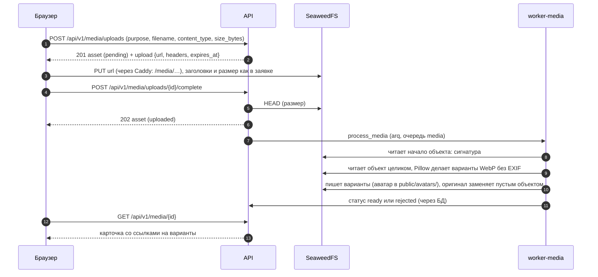

# Runbook: файлы, изображения и аватары (медиа)

Спринты S5 и S6: клиент кладёт файл **прямо в хранилище** по presigned-ссылке, API ведёт статусы и квоту, воркер проверяет и обрабатывает файл, убирает ненужное и выдаёт ссылки на результат. Спецификация: [4.11, 4.12, 5.8](../backend-v2-spec.md).

## Как проходит загрузка



| Статус | Значение |
|---|---|
| `pending` | заявка создана, файла в хранилище ещё нет (или клиент не вызвал `complete`) |
| `uploaded` | объект на месте, размер совпал, ждёт обработки |
| `processing` | воркер взял файл |
| `ready` | файл обработан: у изображения есть варианты, у файла проверена сигнатура |
| `rejected` | отклонён, причина в `reject_reason` (таблица ниже) |
| `deleted` | удалён владельцем, заменой аватара или очисткой; объекты убирает задача |

Запись происходит **один раз**: ссылка подписана с `If-None-Match: *` (заголовок есть в `upload.headers`), второй `PUT` по ней получает `412`, поэтому проверенный файл подменить нельзя. После обработки оригинал изображения заменён пустым объектом на том же ключе: ключ остаётся занятым, и ссылка на загрузку (пока она живёт) всё так же отвечает `412`.

Лимиты размера: аватар 5 МиБ, изображение 10 МиБ, файл 25 МиБ; квота 1 ГиБ на человека (готовые файлы по размеру **сохранённых вариантов** и заявленный размер идущих загрузок). Заявок `POST /media/uploads` не больше 60 в час (`upload_init`).

## Что делает обработка

| Вход | Что получается |
|---|---|
| JPEG, PNG, WebP, GIF до 10 МиБ (аватар: JPEG, PNG, WebP до 5 МиБ) | WebP-варианты без метаданных: фото `thumb` 320 и `medium` 1280 пикселей по длинной стороне (вверх не растягиваются), аватар `thumb` 64 и `medium` 256, квадрат по центру кадра. Ориентация из EXIF применена к пикселям, цвета приведены к sRGB, прозрачность сохранена; у анимации берётся первый кадр |
| GIF в посте или сообщении | то же, плюс оригинал хранится как есть и отдаётся (`urls.original`): анимацию мы не обрабатываем |
| любой файл (документы, архивы…) до 25 МиБ | хранится как есть с типом `application/octet-stream`; отдаётся только вложением (`Content-Disposition: attachment`, `nosniff`) |
| SVG, HTML, неподдерживаемый формат, исполняемый файл, битое изображение | `rejected` с причиной, объекты убирает задача |

| `reject_reason` | Когда |
|---|---|
| `size_mismatch`, `size_exceeds_limit` | размер загруженного объекта не равен заявленному либо больше предела назначения (ставит `complete`) |
| `not_an_image` | SVG, HTML, текст и всё неопознанное под видом изображения; обрезанный, битый или не открывающийся как заявленный формат файл |
| `unsupported_format` | настоящее изображение другого формата (BMP, TIFF, HEIC, AVIF, ICO…) либо GIF в качестве аватара |
| `image_too_large` | больше 25 мегапикселей по заголовку (либо не хватило памяти на разрешённый размер) |
| `decompression_bomb` | больше 50 мегапикселей по заголовку (маленький файл с огромным растром, не декодируется вовсе) либо файл из множества мелких частей: больше 100 сканов JPEG, разбор потребовал больше 50 000 обращений к файлу (миллионы сегментов, чанков, блоков) |
| `forbidden_type` | исполняемый файл (PE, ELF, Mach-O, класс Java) под любым видом |
| `processing_failed` | объекта в хранилище нет, либо обработка упала на этом файле (журнал воркера: `media_render_failed` с трассировкой, без содержимого), либо разбор файла три раза не дошёл до конца: процесс убит по памяти или задача упёрлась в тайм-аут (журнал: `media_gave_up`) |

Недоступное хранилище файл **не отклоняет**: после трёх попыток задача сдаётся, ресурс остаётся в `processing`, его повторит `reconcile_uploads`; через сутки очистка удалит застрявшую загрузку.

## Объекты в bucket `media`

| Ключ | Что это |
|---|---|
| `uploads/{id}/original` | оригинал; у готового изображения (кроме GIF) пустой объект (0 байт), у файла и GIF сам файл |
| `uploads/{id}/thumb.webp`, `medium.webp` | закрытые варианты фото и картинок для сообщений |
| `public/avatars/{id}/64.webp`, `256.webp` | варианты аватара; **единственное** место, которое читается без подписи, с метаданными `Cache-Control: public, max-age=31536000, immutable` |

Писать в `public/` без подписи нельзя (`403`), листинг без подписи закрыт. Удаление ресурса убирает все ключи, которые обработка могла создать, а суточная сверка ловит осиротевшие объекты в обоих префиксах и доделывает замену оригиналов (если пустой объект не записался).

## Ссылки

| Что | Откуда | Срок |
|---|---|---|
| аватар (`avatar.sm`, `avatar.md`) | `GET /me`, `GET /users/{ref}`, карточки людей: относительные адреса `/media/public/avatars/{id}/64.webp` | постоянны (год в кэше, `immutable`); при смене аватара появляется новый `asset_id` |
| карточка ресурса (`urls.thumb`, `urls.medium`, `urls.original`) | `GET /media/{id}`, `complete` у готового ресурса, `GET /media/{id}/urls` | аватар без срока и без подписи; остальное presigned GET на 10 минут (`DOWNLOAD_URL_TTL_SECONDS`), срок в `url_expires_at` |

Заголовки ответа хранилища (`Content-Type`, `Content-Disposition`, `Cache-Control`) задаёт сама ссылка (`response-content-*`), метаданным объекта верить нельзя. Как открыть аватар руками: в разработке `http://localhost:8333` + путь из `GET /me`, на стенде `https://messunjerr.localhost` + путь.

Подпись SigV4 включает `Host`, поэтому ссылка выписывается на тот адрес, с которого к хранилищу придёт браузер (`S3_ENDPOINT_PUBLIC`, по умолчанию адрес сайта):

| Среда | Ссылка из `upload.url` и `urls` | Откуда настройка |
|---|---|---|
| разработка (`make up`) | `http://localhost:8333/media/…` (порт SeaweedFS на хосте) | `compose.dev.yml`: `S3_ENDPOINT_PUBLIC` |
| стенд (`make up-prod-like`) | `https://messunjerr.localhost/media/…` через Caddy | `PUBLIC_BASE_URL` |
| сервер (S21) | `https://<домен>/media/…` | `PUBLIC_BASE_URL` |

Внутренний адрес для проверки, чтения, записи вариантов и удаления (`S3_ENDPOINT_INTERNAL`, `http://seaweedfs:8333`) браузеру не виден.

## Фоновые задачи

| Задача | Очередь, запуск | Что делает |
|---|---|---|
| `process_media` | `media`, ставит `complete` после коммита | сигнатура, затем Pillow: варианты WebP без EXIF, запись в хранилище, замена оригинала пустым объектом, `ready` или `rejected`; две задачи разом, память ограничивает бюджет декодирования; 3 попытки с паузой 30 и 60 с. Если хранилище не отвечает, задача сдаётся, а ресурс остаётся в `processing`: его повторит сверка |
| `delete_media_objects` | `media`, ставят `DELETE`, замена аватара, отказ обработки, очистка | убирает оригинал и все возможные варианты удалённых и отклонённых ресурсов; `objects_deleted_at` ставит, когда ссылка на загрузку уже протухла (15 минут и минута запаса от заявки), до этого `reconcile_uploads` повторяет удаление; 5 попыток, тайм-аут 120 с |
| `cleanup_pending_uploads` | cron `default`, каждый час в :41 | застрявшие загрузки старше 24 часов становятся `deleted`: `pending` считаются от заявки, `uploaded` и `processing` от завершения загрузки |
| `reconcile_uploads` | cron `default`, каждые 5 минут | заново ставит потерянные `process_media` и `delete_media_objects` (временная схема до Kafka) |
| `sweep_orphan_objects` | cron `default`, 04:20 UTC | листает `uploads/` и `public/avatars/` и удаляет объекты старше часа, у которых нет живого ресурса; заменяет пустыми оригиналы готовых изображений, если замена после обработки не удалась; не больше 500 действий каждого рода за запуск |

Задачи идемпотентны и ставятся с детерминированным `job_id`, поэтому повторная постановка дублей не создаёт. Сообщения в журнале воркера: `media_processed`, `media_render_failed`, `media_scrub_deferred`, `reconcile_uploads`, `cleanup_pending_uploads`, `sweep_orphan_objects`, `process_media_retry`, `process_media_gave_up`, `media_gave_up`. Имён файлов, ссылок и содержимого в журнале нет.

## Метрики

API отдаёт Prometheus-метрики на `GET /metrics` (формат 0.0.4), воркеры на отдельном порту (`WORKER_METRICS_PORT`, в Compose 9102). Снаружи Caddy отвечает `404`.

```bash
curl -s http://localhost:8000/metrics | grep -E "^(http_requests_total|db_pool|arq_queue_depth)"   # разработка, API
curl -s http://localhost:9102/metrics | grep -E "^(media_|arq_)"                                    # разработка, worker-media
docker compose -p messunjerr-stand -f deploy/compose.yml exec worker-media python -c "import urllib.request as u; print(u.urlopen('http://127.0.0.1:9102/metrics').read().decode())"   # стенд
```

| Метрика | Что смотреть |
|---|---|
| `media_processing_seconds{kind,outcome}` | время обработки; для фото обычно доли секунды, 24 МП до 2 секунд; хвост выше 10 секунд значит нехватку процессора или памяти. Итоги: `ready`, `rejected`, `skipped` (ресурса нет или он не ждёт обработки), `duplicate` (другая копия задачи уже довела ресурс до `ready`; редкость, частые значит потерю ключей задач в Redis), `error` |
| `media_rejected_total{reason}` | всплеск `not_an_image` или `decompression_bomb` значит, что кто-то перебирает ловушки (или сломан клиент) |
| `arq_queue_depth{queue}` | глубина очередей; у `media` растёт, если воркер стоит или не успевает |
| `arq_jobs_total{job,outcome}`, `arq_jobs_failed_total{job}`, `arq_job_duration_seconds{job}` | исходы задач воркера (`completed`, `failed`, `retried`) |
| `http_requests_total{route,method,status}`, `http_request_duration_seconds` | запросы по шаблону маршрута (идентификаторы в метки не попадают) |
| `db_pool_in_use`, `db_pool_size` | занятость пула соединений БД |
| `rate_limited_total{bucket}`, `auth_failures_total{reason}` | отказы лимитов и неудачные входы |

## Память воркера

`worker-media` (768 МиБ на стенде) берёт две задачи разом; `DecodeBudget` (400 МБ) не пускает тяжёлые изображения вместе. Оценка идёт по формату и числу мегапикселей: JPEG 6 МБ на мегапиксель, GIF 8, PNG 10, WebP 16 (аватар из JPEG 2, потому что декодер читает JPEG сразу уменьшенным); изображение в 25 МП идёт в одиночку. Если контейнер убивает по памяти (`docker inspect … OOMKilled`), смотрите `media_processing_seconds` и размеры загрузок, затем уменьшайте бюджет (`DEFAULT_DECODE_BUDGET_MB` в `media/infra/images.py`) либо поднимайте лимит контейнера. Замеры (Pillow 12.3, пик сверх базовых 45 МБ): JPEG 24 МП в фото +39 МБ, в аватар +14; PNG RGBA 24 МП +209; PNG-палитра +231; GIF +153; WebP +375.

## Команды оператора

```bash
make create-admin ARGS="--email me@example.com --username boss"   # первый администратор; пароль спросит команда
make reprocess-media                                              # ресурсы времён S5 (готовые изображения без вариантов) на новую обработку
```

`create-admin` создаёт подтверждённый аккаунт с ролью `admin` либо выдаёт роль существующему аккаунту с этой почтой (только активному); запись `role.changed` попадает в журнал аудита. Пароль читается из `ADMIN_PASSWORD`, из stdin (`--password-stdin`) или запрашивается, аргументом командной строки его передать нельзя. В боевом контуре и на стенде сервисы API называются `api-a` и `api-b`: `docker compose exec api-a python -m messunjerr create-admin …` (в разработке `api`). У существующего аккаунта команда меняет только роль: переданные пароль и ник она не применяет и предупреждает об этом в stderr. `reprocess-media` безопасна для повтора; до первой боевой выкладки нужна только локальным базам.

## Если что-то не так

| Симптом | Причина и что делать |
|---|---|
| `503 service_unavailable` на `POST /media/uploads` или `complete` | хранилище недоступно или не настроено (ответ приходит не позже чем через 8 секунд: общий срок операции). В разработке `make ps`, `make logs s=seaweedfs`, на стенде `make ps-prod-like`, `make logs-prod-like s=seaweedfs`; в журнале API `storage_failed` с типом ошибки. Без `S3_ENDPOINT_INTERNAL`, `S3_ACCESS_KEY`, `S3_SECRET_KEY` приложение стартует, но загрузки отвечают 503 (в `prod` и `stage` оно не стартует) |
| `403 SignatureDoesNotMatch` на `PUT` | не тот `Content-Type` или размер (подпись закрепляет оба), не отправлен `If-None-Match: *`, ссылка просрочена (15 минут), хост запроса не совпадает с хостом ссылки (`S3_ENDPOINT_PUBLIC`), ссылку испортили при копировании. Достаточно выписать новую: `POST /media/uploads` |
| `412 PreconditionFailed` на `PUT` | объект по этой ссылке уже создан (повтор после обрыва ответа или попытка подмены). Файл на месте: вызвать `complete`; если там не тот файл, выписать новую заявку |
| ресурс застрял в `uploaded` или `processing` | `reconcile_uploads` поставит задачу заново: через 2 минуты льготы, на ближайшем шаге расписания (до 7 минут в сумме). Не помогает: журнал `worker-media` (`make logs s=worker-media`, на стенде `make logs-prod-like s=worker-media`), воркер жив и достаёт до хранилища, `arq_queue_depth{queue="media"}`. Если хранилище не вернулось за сутки от завершения загрузки, очистка удалит такую загрузку |
| `rejected` с `processing_failed` у нормальной картинки | в журнале воркера `media_render_failed` с трассировкой: ошибка кодека или нехватка памяти; смотреть исходный файл (формат, размер, цветовой режим). Объекта в хранилище нет, если нет такой строки |
| `rejected` с `processing_failed`, в журнале `media_gave_up` | разбор этого файла три раза не дошёл до конца (воркер убит по памяти, `docker inspect … OOMKilled`, или тайм-аут 120 с). Файл «ядовитый»: вместе с отказом его объекты уходят в удаление; формат и размер загрузки видны в журнале API. Всплеск `media_rejected_total{reason="processing_failed"}` значит атаку или сломанный кодек |
| воркер `media` перезапускается по кругу | `docker inspect … OOMKilled`: файл, которому не хватило памяти. Счётчик попыток отклонит его после трёх обрывов (`media_gave_up`), цикл кончится сам; если файлы нормальные, поднимайте лимит контейнера или уменьшайте бюджет декодирования |
| `rejected` с `image_too_large`, хотя в картинке меньше 25 мегапикселей | воркеру не хватило памяти (`MemoryError` считается «слишком большим»): проверить лимит контейнера и бюджет декодирования (раздел «Память воркера») |
| `ready`, но `urls` пусты | готовое изображение времён S5 (вариантов нет): `make reprocess-media` вернёт его на обработку |
| `422 asset_not_ready` при назначении аватара | ресурс ещё не `ready` (опрашивать `GET /media/{id}`) либо это ресурс времён S5 без вариантов (`make reprocess-media`) |
| аватар в профиле есть, картинка не открывается (404) | файлов нет в `public/avatars/{id}/`: проверить, не заменён ли аватар (прежний удаляется), `make logs s=worker-media`, суточную сверку; браузер мог закэшировать прежний адрес на год (адрес неизменяем, при смене аватара появляется новый) |
| `quota_exceeded`, хотя файлов мало | заявленный размер идущих загрузок занимает квоту до 24 часов. Лишние `pending` удаляются `DELETE /media/{id}`, если известен идентификатор, иначе очисткой через сутки (списка своих ресурсов в API нет). Ссылка из потерянного ответа живёт 15 минут, заявка с тем же `Idempotency-Key` вернёт её же |
| объекты остаются после удаления | `SELECT count(*) FROM media.assets WHERE status IN ('deleted','rejected') AND objects_deleted_at IS NULL AND created_at < now() - interval '20 minutes'` должно быть около нуля (свежие закрываются, когда протухнет ссылка на загрузку). Растёт: не идут `delete_media_objects` (воркер `media`, хранилище, Redis) |
| в bucket лежат объекты, которых нет в таблице | суточная сверка `sweep_orphan_objects` удалит их сама (старше часа, не больше 500 за запуск; в журнале воркера `default` строка `sweep_orphan_objects`, а при упоре в предел `sweep_orphan_objects_capped`: если сирот больше, чем обычно, сначала проверьте, что БД та же, что у хранилища) |
| оригинал фото с метаданными лежит в хранилище | замена пустым объектом не состоялась (хранилище не отвечало в тот миг, журнал `media_scrub_deferred`): её доделает суточная сверка (`scrubbed` в её строке журнала); вручную `sweep_orphan_objects` запускается по расписанию 04:20 UTC |
| `409 asset_in_use` на удаление | ресурс привязан (аватар профиля; позже вложение поста или сообщения): сначала отвязать (для аватара заменить или очистить через `PATCH /me/profile`) |
| `upload_missing` на `complete` | объекта в хранилище нет: `PUT` не прошёл или ещё идёт. Дозагрузить и повторить `complete` |

## Что проверено при отказах (стенд, фоновая нагрузка без ошибок клиентов)

| Отказ | Что видит человек | Чем кончилось |
|---|---|---|
| остановлено хранилище | `GET /meta` 200, готовность реплик не меняется (хранилище в неё не входит), заявка принимается (ссылка подписывается локально), `PUT` через Caddy 502, `complete` 503 с `Retry-After: 5` за 8 секунд (раньше висел 26), `DELETE` 204 | после возврата хранилища `complete` проходит, незавершённый файл доходит до `ready`, повтор удаления убирает объект |
| остановлен `worker-media` | `complete` 202, ресурс остаётся `uploaded` | задача лежит в Redis и выполняется сразу после запуска воркера |
| потеряна задача (очередь `media` очищена в Redis) | ресурс остаётся `uploaded` | `reconcile_uploads` поставил задачу заново: `ready` через 6,5 минуты |
| остановлен Redis | `complete` 202 за 2 секунды (задача не поставлена, состояние в БД), остальные ручки работают | после возврата Redis воркеры здоровы через 19 секунд, ресурс `ready` через 159 секунд (сверка) |
| `SIGTERM` воркеру (выкладка) | код 0, строка `worker_stopped`, клиент S3 закрыт | прежде каждый воркер заканчивался трассировкой `CancelledError` и кодом 1 |
| четыре изображения по 24 мегапикселя разом (WebP, PNG RGBA, JPEG-аватар, GIF) | `complete` 202 у всех, ресурсы `processing`, затем `ready` | все четыре готовы за 3,3 секунды, пик памяти `worker-media` 365 МиБ из 768, без OOM (бюджет декодирования не пускает тяжёлые изображения вместе) |
| хранилище остановлено посреди обработки | ресурс остаётся `processing`, файл не отклоняется (после трёх попыток задача сдаётся) | через 25 секунд после возврата хранилища ресурс `ready` |
| выкладка S6 поверх S5 под фоновой нагрузкой (запросы, SSE, WebSocket) | отвечают обе сборки, ошибок нет | 25 372 запроса, 0 ошибок клиентов |

## Проверки

```bash
make test                                   # unit и интеграционные тесты, в том числе на настоящем SeaweedFS
make stand-test ARGS="-k media"             # вся цепочка на стенде: API, Caddy, SeaweedFS, воркер media (загрузка, обработка, аватары, ссылки, метрики)
py -3 scripts/stand_browser_check.py        # то же настоящим браузером (Edge или Chrome): картинка из canvas,  с публичным адресом
```

Сценарий руками: [backend/http/media.http](../../backend/http/media.http) (HTTP-клиент JetBrains).
