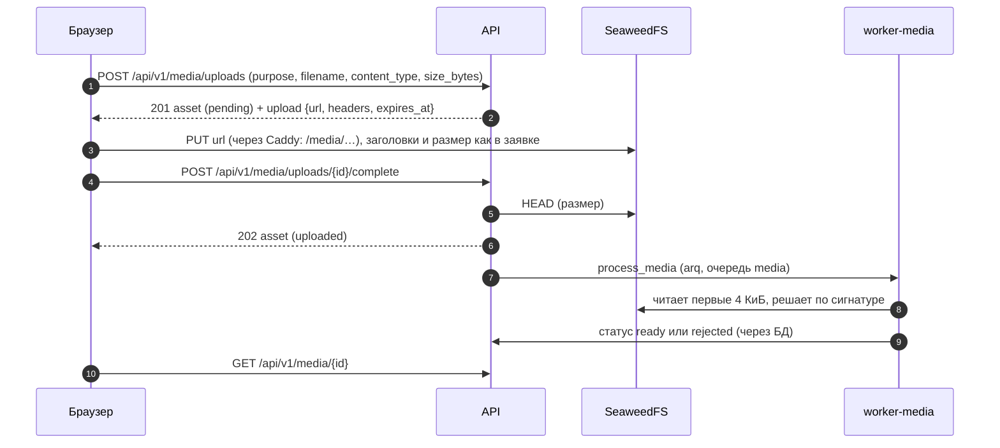

# Runbook: файлы (медиа)

Спринт S5 даёт загрузку файлов: клиент кладёт файл **прямо в хранилище** по presigned-ссылке, API ведёт статусы и квоту, воркер проверяет файл и убирает ненужное. Спецификация: [4.11, 4.12, 5.8](../backend-v2-spec.md). Обработку изображений (Pillow, варианты, EXIF) и выдачу ссылок на чтение добавит S6.

## Как проходит загрузка



| Статус | Значение |
|---|---|
| `pending` | заявка создана, файла в хранилище ещё нет (или клиент не вызвал `complete`) |
| `uploaded` | объект на месте, размер совпал, ждёт обработки |
| `processing` | воркер взял файл |
| `ready` | файл прошёл проверку (в S5: сигнатура; с S6: перекодирование) |
| `rejected` | отклонён, причина в `reject_reason` (`size_mismatch`, `size_exceeds_limit`, `not_an_image`, `unsupported_format`, `forbidden_type`, `processing_failed`) |
| `deleted` | удалён владельцем или очисткой; объекты убирает задача |

Запись происходит **один раз**: ссылка подписана с `If-None-Match: *` (заголовок есть в `upload.headers`), второй `PUT` по ней получает `412`, поэтому проверенный файл подменить нельзя.

Лимиты размера: аватар 5 МиБ, изображение 10 МиБ, файл 25 МиБ; квота 1 ГиБ на человека (готовые файлы и заявленный размер идущих загрузок). Заявок `POST /media/uploads` не больше 60 в час (`upload_init`). Объект лежит в bucket `media` по ключу `uploads/{asset_id}/original`; не-изображения всегда с типом `application/octet-stream`.

## Адреса ссылок

Подпись SigV4 включает `Host`, поэтому ссылка выписывается на тот адрес, с которого к хранилищу придёт браузер (`S3_ENDPOINT_PUBLIC`, по умолчанию адрес сайта):

| Среда | Ссылка из `upload.url` | Откуда настройка |
|---|---|---|
| разработка (`make up`) | `http://localhost:8333/media/uploads/…` (порт SeaweedFS на хосте) | `compose.dev.yml`: `S3_ENDPOINT_PUBLIC` |
| стенд (`make up-prod-like`) | `https://messunjerr.localhost/media/uploads/…` через Caddy | `PUBLIC_BASE_URL` |
| сервер (S21) | `https://<домен>/media/uploads/…` | `PUBLIC_BASE_URL` |

Внутренний адрес для проверки, чтения и удаления (`S3_ENDPOINT_INTERNAL`, `http://seaweedfs:8333`) браузеру не виден.

## Фоновые задачи

| Задача | Очередь, запуск | Что делает |
|---|---|---|
| `process_media` | `media`, ставит `complete` после коммита | читает начало объекта, по сигнатуре ставит `ready` или `rejected`; 3 попытки с паузой 30 и 60 с. Если хранилище не отвечает, задача сдаётся, а ресурс остаётся в `processing`: его повторит сверка, файл не отклоняется и не стирается (`rejected` с `processing_failed` только если объекта в хранилище нет) |
| `delete_media_objects` | `media`, ставят `DELETE`, отказ обработки, очистка | убирает объекты удалённых и отклонённых ресурсов; `objects_deleted_at` ставит, когда ссылка на загрузку уже протухла (15 минут и минута запаса от заявки), до этого `reconcile_uploads` повторяет удаление; 5 попыток, тайм-аут 120 с |
| `cleanup_pending_uploads` | cron `default`, каждый час в :41 | застрявшие загрузки старше 24 часов становятся `deleted`: `pending` считаются от заявки, `uploaded` и `processing` от завершения загрузки |
| `reconcile_uploads` | cron `default`, каждые 5 минут | заново ставит потерянные `process_media` и `delete_media_objects` (временная схема до Kafka) |
| `sweep_orphan_objects` | cron `default`, 04:20 UTC | листает `uploads/` в хранилище и удаляет объекты старше часа, у которых нет живого ресурса (нет строки, либо строка `deleted` или `rejected` с закрытыми объектами); не больше 500 за запуск |

Задачи идемпотентны и ставятся с детерминированным `job_id`, поэтому повторная постановка дублей не создаёт. Сообщения в журнале воркера: `media_processed`, `reconcile_uploads`, `cleanup_pending_uploads`, `process_media_retry`, `process_media_gave_up`. Имён файлов и ссылок в журнале нет.

## Если что-то не так

| Симптом | Причина и что делать |
|---|---|
| `503 service_unavailable` на `POST /media/uploads` или `complete` | хранилище недоступно или не настроено (ответ приходит не позже чем через 8 секунд: общий срок операции). В разработке `make ps`, `make logs s=seaweedfs`, на стенде `make ps-prod-like`, `make logs-prod-like s=seaweedfs`; в журнале API `storage_failed` с типом ошибки. Без `S3_ENDPOINT_INTERNAL`, `S3_ACCESS_KEY`, `S3_SECRET_KEY` приложение стартует, но загрузки отвечают 503 (в `prod` и `stage` оно не стартует) |
| `403 SignatureDoesNotMatch` на `PUT` | не тот `Content-Type` или размер (подпись закрепляет оба), не отправлен `If-None-Match: *`, ссылка просрочена (15 минут), хост запроса не совпадает с хостом ссылки (`S3_ENDPOINT_PUBLIC`), ссылку испортили при копировании. Достаточно выписать новую: `POST /media/uploads` |
| `412 PreconditionFailed` на `PUT` | объект по этой ссылке уже создан (повтор после обрыва ответа или попытка подмены). Файл на месте: вызвать `complete`; если там не тот файл, выписать новую заявку |
| ресурс застрял в `uploaded` или `processing` | `reconcile_uploads` поставит задачу заново: через 2 минуты льготы, на ближайшем шаге расписания (до 7 минут в сумме). Не помогает: журнал `worker-media` (`make logs s=worker-media`, на стенде `make logs-prod-like s=worker-media`), воркер жив и достаёт до хранилища. Если хранилище не вернулось за сутки от завершения загрузки, очистка удалит такую загрузку |
| `quota_exceeded`, хотя файлов мало | заявленный размер идущих загрузок занимает квоту до 24 часов. Лишние `pending` удаляются `DELETE /media/{id}`, если известен идентификатор, иначе очисткой через сутки (списка своих ресурсов в API нет). Ссылка из потерянного ответа живёт 15 минут, заявка с тем же `Idempotency-Key` вернёт её же |
| объекты остаются после удаления | `SELECT count(*) FROM media.assets WHERE status IN ('deleted','rejected') AND objects_deleted_at IS NULL AND created_at < now() - interval '20 minutes'` должно быть около нуля (свежие закрываются, когда протухнет ссылка на загрузку). Растёт: не идут `delete_media_objects` (воркер `media`, хранилище, Redis) |
| в bucket лежат объекты, которых нет в таблице | суточная сверка `sweep_orphan_objects` удалит их сама (старше часа, не больше 500 за запуск; в журнале воркера `default` строка `sweep_orphan_objects`, а при упоре в предел `sweep_orphan_objects_capped`: если сирот больше, чем обычно, сначала проверьте, что БД та же, что у хранилища) |
| `409 asset_in_use` на удаление | ресурс привязан (аватар профиля; позже вложение поста или сообщения): сначала отвязать |
| `upload_missing` на `complete` | объекта в хранилище нет: `PUT` не прошёл или ещё идёт. Дозагрузить и повторить `complete` |

## Что проверено при отказах (стенд, фоновая нагрузка без ошибок клиентов)

| Отказ | Что видит человек | Чем кончилось |
|---|---|---|
| остановлено хранилище | `GET /meta` 200, готовность реплик не меняется (хранилище в неё не входит), заявка принимается (ссылка подписывается локально), `PUT` через Caddy 502, `complete` 503 с `Retry-After: 5` за 8 секунд (раньше висел 26), `DELETE` 204 | после возврата хранилища `complete` проходит, незавершённый файл доходит до `ready`, повтор удаления убирает объект |
| остановлен `worker-media` | `complete` 202, ресурс остаётся `uploaded` | задача лежит в Redis и выполняется сразу после запуска воркера |
| потеряна задача (очередь `media` очищена в Redis) | ресурс остаётся `uploaded` | `reconcile_uploads` поставил задачу заново: `ready` через 6,5 минуты |
| остановлен Redis | `complete` 202 за 2 секунды (задача не поставлена, состояние в БД), остальные ручки работают | после возврата Redis воркеры здоровы через 19 секунд, ресурс `ready` через 159 секунд (сверка) |
| `SIGTERM` воркеру (выкладка) | код 0, строка `worker_stopped`, клиент S3 закрыт | прежде каждый воркер заканчивался трассировкой `CancelledError` и кодом 1 |

## Проверки

```bash
make test                                   # unit и интеграционные тесты, в том числе на настоящем SeaweedFS
make stand-test ARGS="-k uploads"           # вся цепочка на стенде: API, Caddy, SeaweedFS, воркер media
```

Сценарий руками: [backend/http/media.http](../../backend/http/media.http) (HTTP-клиент JetBrains).
